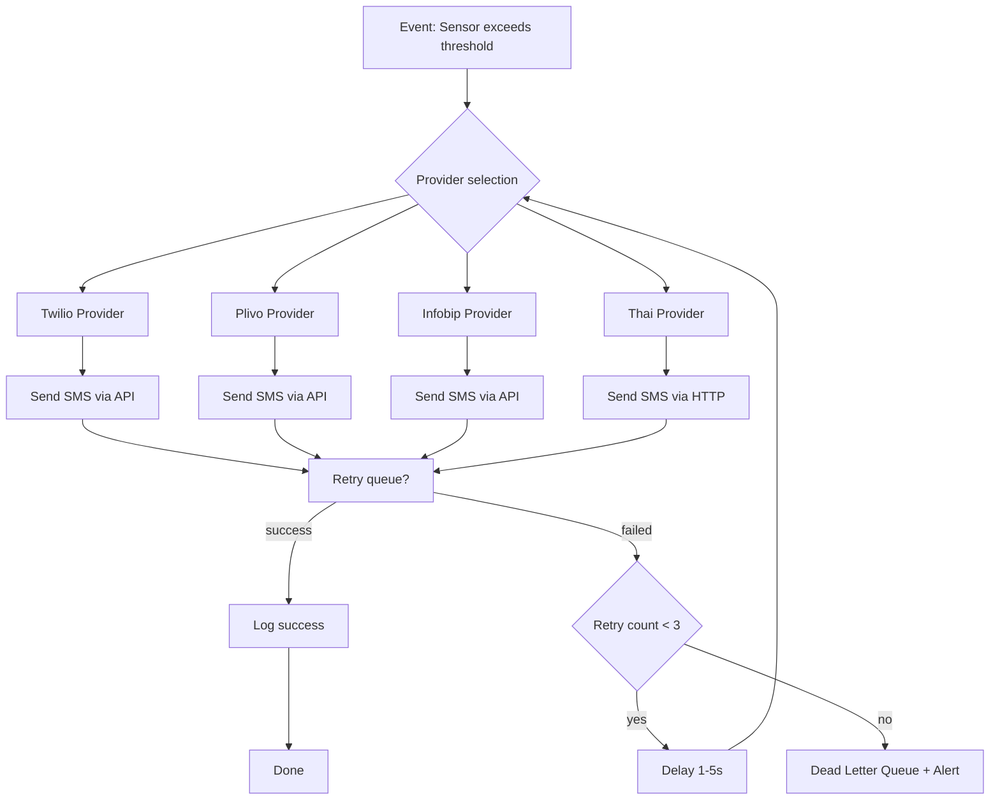
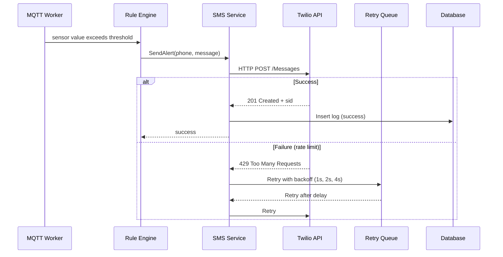

# Module 23: pkg/sms (SMS Notification)

## สำหรับโฟลเดอร์ `internal/pkg/sms/` และ `internal/pkg/sms/providers/`

ไฟล์ที่เกี่ยวข้อง:
- `internal/pkg/sms/sender.go`
- `internal/pkg/sms/twilio.go`
- `internal/pkg/sms/plivo.go`
- `internal/pkg/sms/infobip.go`
- `internal/pkg/sms/thai_provider.go`
- `internal/pkg/sms/worker.go`
- `internal/pkg/sms/retry.go`
- `migrations/sms_logs.sql`


## หลักการ (Concept)

### SMS Notification คืออะไร?

SMS Notification คือระบบการแจ้งเตือนผ่าน Short Message Service (SMS) ส่งข้อความสั้นไปยังโทรศัพท์มือถือของผู้ใช้ โดยไม่ต้องพึ่งพาการเชื่อมต่ออินเทอร์เน็ต เป็นช่องทางแจ้งเตือนที่มีความน่าเชื่อถือสูง (reliable) และเข้าถึงผู้ใช้ได้ทันที แม้ในพื้นที่ที่อินเทอร์เน็ตไม่เสถียร[reference:0] ในระบบ CMON IoT Monitoring ใช้ SMS สำหรับแจ้งเตือนเหตุการณ์วิกฤต (Alarm) เช่น อุณหภูมิเกิน 35°C, ตรวจพบน้ำรั่ว หรือควันไฟ

### มีกี่แบบ? (SMS Gateway Providers)

| Provider | ประเภท | ข้อดี | ข้อเสีย | เหมาะกับ |
|----------|--------|------|---------|----------|
| **Twilio** | สากล | API เอกสารดี, รองรับ 180+ ประเทศ, Go SDK official[reference:1] | ราคาสูง, SMS ขาเข้าเสียค่าใช้จ่าย | องค์กรต่างชาติ, ต้องการความเสถียรสูง |
| **Plivo** | สากล | Go SDK official, ราคาถูกกว่า Twilio, รองรับ bulk SMS[reference:2] | เอกสารน้อยกว่า Twilio | ธุรกิจขนาดกลาง-ใหญ่, การตลาด |
| **Infobip** | สากล | Go SDK, รองรับ 2FA, scheduling, รายงานการส่ง[reference:3] | ระบบซับซ้อน, ราคา premium | องค์กรขนาดใหญ่, ระบบ 2FA |
| **Vonage (Nexmo)** | สากล | Go SDK, API เรียบง่าย, เอกสารดี[reference:4] | ราคาปานกลาง | ธุรกิจทั่วไป, startup |
| **Thaibulksms** | ไทย | ราคาถูก, รองรับ OTP, รองรับภาษาไทย[reference:5][reference:6] | ไม่มี official Go SDK (HTTP API) | องค์กรไทย, bulk SMS ภายในประเทศ |
| **BudgetSMS** | ไทย | ราคาถูกที่สุด, HTTP API ง่าย[reference:7] | ไม่มี Go SDK, documentation จำกัด | SME, bulk SMS ต้นทุนต่ำ |
| **8x8** | สากล | webhook สำหรับรับข้อความขาเข้า, batch sending[reference:8] | Go SDK ไม่ official | องค์กรที่มีระบบติดต่อลูกค้า |
| **Telerivet** | สากล | รองรับหลายช่องทาง (SMS, WhatsApp, Voice), REST API[reference:9] | complexity สูง | ระบบที่ต้องการ multi-channel |

**ข้อห้ามสำคัญ:** ห้ามใช้ Bucket Pattern ร่วมกับ Time Series Collections เพราะจะลดประสิทธิภาพ [reference:1] — แต่สำหรับ SMS module นี้ไม่เกี่ยวข้อง

### ใช้อย่างไร / นำไปใช้กรณีไหน

1. **Alert แบบ Real-time** – แจ้งเตือนเมื่อเซนเซอร์เกิน threshold (Alarm)
2. **OTP / 2FA** – ส่งรหัสยืนยันตัวตนทาง SMS
3. **Scheduled Reports** – ส่งสรุปสถานะรายวัน/สัปดาห์ทาง SMS
4. **Device Control Confirmation** – ยืนยันการสั่งงานอุปกรณ์ระยะไกล
5. **System Maintenance Notification** – แจ้งเตือนการอัปเดตระบบ

### ประโยชน์ที่ได้รับ

- **Reachability** – เข้าถึงผู้ใช้ได้ทันที ไม่ต้องติดตั้งแอปพลิเคชัน
- **Reliability** – SMS มีอัตราการส่งถึงสูงกว่า push notification
- **Simplicity** – ไม่ต้องพึ่งพาโครงสร้างพื้นฐานอื่น (LINE, Facebook)
- **Compliance** – เหมาะสำหรับการแจ้งเตือนที่ต้องมีการรับรองการส่ง
- **Offline access** – ผู้ใช้รับข้อความได้แม้อินเทอร์เน็ตดับ
- **Cost-effective** – ราคาต่อข้อความต่ำ (โดยเฉพาะผู้ให้บริการไทย)

### ข้อควรระวัง

- **Cost** – SMS มีค่าใช้จ่ายต่อข้อความ (ไม่เหมาะกับปริมาณสูงมาก)
- **Rate limiting** – ผู้ให้บริการมีข้อจำกัดการส่งต่อวินาที/นาที
- **Character limit** – ข้อความภาษาไทยจำกัด 70 ตัวอักษร/ข้อความ
- **Delivery delay** – SMS อาจมีความล่าช้า 2-30 วินาที
- **Fraud risk** – ระวัง SMS bombing (ส่งข้อความจำนวนมาก)
- **Regulatory compliance** – ในไทยต้องจดทะเบียน sender ID สำหรับ bulk SMS[reference:10]
- **Fallback needed** – SMS อาจไม่ถึง (สัญญาณอ่อน) ต้องมี Email หรือ LINE เป็น backup

### ข้อดี
- เข้าถึงผู้ใช้ได้ทุกที่ทุกเวลา, reliable, ไม่ต้องติดตั้งแอป, ราคาถูก (ไทย)

### ข้อเสีย
- ค่าใช้จ่ายต่อข้อความ, character limit, latency ผันผวน, ไม่รองรับ rich media

### ข้อห้าม
- ห้ามส่ง SMS ไปยังผู้ใช้ที่ไม่ยินยอม (GDPR, PDPA violation)
- ห้ามส่ง OTP ซ้ำเกิน 3 ครั้ง/นาที (ป้องกัน spam)
- ห้ามเก็บรหัสผ่านหรือข้อมูลอ่อนไหวในข้อความ SMS
- ห้ามใช้ SMS เป็น primary channel สำหรับข้อมูลเร่งด่วน (ควรมี backup)
- ห้ามใช้ free tier ของผู้ให้บริการใน production (จำนวนจำกัด, reliability ต่ำ)


## การออกแบบ Workflow และ Dataflow

### Workflow: การส่ง SMS Notification



**รูปที่ 34:** ขั้นตอนการส่ง SMS notification เมื่อเซนเซอร์เกิน threshold เลือก provider ตาม configuration, ส่งผ่าน API, และ retry อัตโนมัติเมื่อล้มเหลว

### Dataflow: SMS ผ่าน Twilio API


**รูปที่ 35:** การไหลของข้อมูล SMS ผ่าน Twilio API: Go app → Twilio REST API → Twilio Gateway → Carrier Network → End User Phone → Delivery Report webhook

### Sequence Diagram: SMS with Retry



**รูปที่ 36:** Sequence diagram แสดงการส่ง SMS พร้อม retry mechanism เมื่อถูก rate limit หรือ network error


## ตัวอย่างโค้ดที่รันได้จริง

### 1. SMS Sender Interface – `sender.go`

```go
// Package sms provides SMS notification capabilities with multiple providers.
// Supports Twilio, Plivo, Infobip, and local Thai providers via HTTP API.
// ----------------------------------------------------------------
// แพ็คเกจ sms ให้บริการการแจ้งเตือนทาง SMS รองรับหลายผู้ให้บริการ
package sms

import (
	"context"
)

// Message represents an SMS to be sent.
// ----------------------------------------------------------------
// Message แทนข้อความ SMS ที่จะส่ง
type Message struct {
	To      string // recipient phone number (E.164 format: +6681XXXXXXX)
	From    string // sender ID or phone number
	Text    string // message content (max 160 chars for GSM, 70 for Unicode)
	Unicode bool   // true if message contains Thai characters
}

// Sender defines the interface for SMS providers.
// ----------------------------------------------------------------
// Sender กำหนด interface สำหรับผู้ให้บริการ SMS
type Sender interface {
	// Send sends an SMS message.
	// ----------------------------------------------------------------
	// Send ส่งข้อความ SMS
	Send(ctx context.Context, msg *Message) (string, error) // returns message ID or error
}

// ProviderType defines available SMS providers.
// ----------------------------------------------------------------
// ProviderType กำหนดผู้ให้บริการ SMS ที่มีให้เลือก
type ProviderType string

const (
	ProviderTwilio   ProviderType = "twilio"
	ProviderPlivo    ProviderType = "plivo"
	ProviderInfobip  ProviderType = "infobip"
	ProviderVonage   ProviderType = "vonage"
	ProviderThaiBulk ProviderType = "thaibulk"
	ProviderBudget   ProviderType = "budget"
)
```

### 2. Twilio Provider – `twilio.go`

```go
package sms

import (
	"context"
	"fmt"

	"github.com/twilio/twilio-go"
	api "github.com/twilio/twilio-go/rest/api/v2010"
)

// TwilioConfig holds Twilio API credentials.
// ----------------------------------------------------------------
// TwilioConfig เก็บข้อมูลรับรอง API ของ Twilio
type TwilioConfig struct {
	AccountSID string
	AuthToken  string
	FromNumber string // Twilio phone number in E.164 format
}

// TwilioSender implements Sender using Twilio API.
// ----------------------------------------------------------------
// TwilioSender อิมพลีเมนต์ Sender ด้วย Twilio API
type TwilioSender struct {
	client *twilio.RestClient
	from   string
}

// NewTwilioSender creates a new Twilio sender.
// ----------------------------------------------------------------
// NewTwilioSender สร้าง Twilio sender ใหม่
func NewTwilioSender(cfg *TwilioConfig) *TwilioSender {
	client := twilio.NewRestClientWithParams(twilio.ClientParams{
		Username: cfg.AccountSID,
		Password: cfg.AuthToken,
	})
	return &TwilioSender{
		client: client,
		from:   cfg.FromNumber,
	}
}

// Send sends an SMS via Twilio API.
// Returns message SID on success.
// ----------------------------------------------------------------
// Send ส่ง SMS ผ่าน Twilio API
// คืนค่า message SID เมื่อสำเร็จ
func (t *TwilioSender) Send(ctx context.Context, msg *Message) (string, error) {
	params := &api.CreateMessageParams{}
	params.SetTo(msg.To)
	params.SetFrom(t.from)
	params.SetBody(msg.Text)

	if msg.Unicode {
		params.SetMessagingServiceSid("") // optional
	}

	resp, err := t.client.Api.CreateMessage(params)
	if err != nil {
		return "", fmt.Errorf("twilio send failed: %w", err)
	}
	return *resp.Sid, nil
}
```

### 3. Plivo Provider – `plivo.go`

```go
package sms

import (
	"context"
	"fmt"

	"github.com/plivo/plivo-go"
)

// PlivoConfig holds Plivo API credentials.
// ----------------------------------------------------------------
// PlivoConfig เก็บข้อมูลรับรอง API ของ Plivo
type PlivoConfig struct {
	AuthID    string
	AuthToken string
	FromNumber string
}

// PlivoSender implements Sender using Plivo API.
// ----------------------------------------------------------------
// PlivoSender อิมพลีเมนต์ Sender ด้วย Plivo API
type PlivoSender struct {
	client *plivo.Client
	from   string
}

// NewPlivoSender creates a new Plivo sender.
// ----------------------------------------------------------------
// NewPlivoSender สร้าง Plivo sender ใหม่
func NewPlivoSender(cfg *PlivoConfig) (*PlivoSender, error) {
	client, err := plivo.NewClient(cfg.AuthID, cfg.AuthToken, &plivo.ClientOptions{})
	if err != nil {
		return nil, err
	}
	return &PlivoSender{
		client: client,
		from:   cfg.FromNumber,
	}, nil
}

// Send sends an SMS via Plivo API.
// ----------------------------------------------------------------
// Send ส่ง SMS ผ่าน Plivo API
func (p *PlivoSender) Send(ctx context.Context, msg *Message) (string, error) {
	resp, err := p.client.Messages.Create(plivo.MessageCreateParams{
		Src:  p.from,
		Dst:  msg.To,
		Text: msg.Text,
	})
	if err != nil {
		return "", fmt.Errorf("plivo send failed: %w", err)
	}
	return resp.MessageUUID, nil
}
```

### 4. Thai Provider (HTTP API) – `thai_provider.go`

```go
package sms

import (
	"bytes"
	"context"
	"encoding/json"
	"fmt"
	"net/http"
	"time"
)

// ThaiProviderConfig holds configuration for Thai SMS providers.
// ----------------------------------------------------------------
// ThaiProviderConfig เก็บค่ากำหนดสำหรับผู้ให้บริการ SMS ไทย
type ThaiProviderConfig struct {
	APIURL   string // e.g., "https://api.thaibulksms.com/send"
	APIKey   string
	APISecret string
	Sender   string // sender name (max 11 chars for Thai)
}

// ThaiProviderSender implements Sender using generic HTTP API.
// Compatible with Thaibulksms, BudgetSMS, and other Thai providers.
// ----------------------------------------------------------------
// ThaiProviderSender อิมพลีเมนต์ Sender ด้วย HTTP API ทั่วไป
// เข้ากันได้กับ Thaibulksms, BudgetSMS และผู้ให้บริการไทยอื่นๆ
type ThaiProviderSender struct {
	config *ThaiProviderConfig
	client *http.Client
}

// NewThaiProviderSender creates a new Thai provider sender.
// ----------------------------------------------------------------
// NewThaiProviderSender สร้าง Thai provider sender ใหม่
func NewThaiProviderSender(cfg *ThaiProviderConfig) *ThaiProviderSender {
	return &ThaiProviderSender{
		config: cfg,
		client: &http.Client{Timeout: 30 * time.Second},
	}
}

// Send sends an SMS via Thai provider HTTP API.
// ----------------------------------------------------------------
// Send ส่ง SMS ผ่าน HTTP API ของผู้ให้บริการไทย
func (t *ThaiProviderSender) Send(ctx context.Context, msg *Message) (string, error) {
	// Thaibulksms API format
	// รูปแบบ API ของ Thaibulksms
	payload := map[string]interface{}{
		"apikey":   t.config.APIKey,
		"secret":   t.config.APISecret,
		"to":       msg.To,
		"message":  msg.Text,
		"sender":   t.config.Sender,
	}

	jsonData, err := json.Marshal(payload)
	if err != nil {
		return "", err
	}

	req, err := http.NewRequestWithContext(ctx, "POST", t.config.APIURL, bytes.NewBuffer(jsonData))
	if err != nil {
		return "", err
	}
	req.Header.Set("Content-Type", "application/json")

	resp, err := t.client.Do(req)
	if err != nil {
		return "", fmt.Errorf("http request failed: %w", err)
	}
	defer resp.Body.Close()

	if resp.StatusCode != http.StatusOK && resp.StatusCode != http.StatusCreated {
		return "", fmt.Errorf("provider returned %d", resp.StatusCode)
	}

	var result map[string]interface{}
	if err := json.NewDecoder(resp.Body).Decode(&result); err != nil {
		return "", err
	}

	// Return message ID if available
	// คืน message ID ถ้ามี
	if id, ok := result["message_id"].(string); ok {
		return id, nil
	}
	return "", nil
}
```

### 5. SMS Service with Retry & Queue – `worker.go`

```go
package sms

import (
	"context"
	"log"
	"sync"
	"time"
)

// SMSJob represents a queued SMS task.
// ----------------------------------------------------------------
// SMSJob แทนงาน SMS ที่อยู่ในคิว
type SMSJob struct {
	ID        string
	Message   *Message
	RetryCount int
	NextRetry time.Time
}

// SMSWorker handles background SMS sending with retries.
// ----------------------------------------------------------------
// SMSWorker จัดการการส่ง SMS ในพื้นหลังพร้อม retry
type SMSWorker struct {
	sender    Sender
	queue     chan *SMSJob
	retryQueue chan *SMSJob
	wg        sync.WaitGroup
	stopCh    chan struct{}
}

// NewSMSWorker creates a new SMS worker.
// ----------------------------------------------------------------
// NewSMSWorker สร้าง SMS worker ใหม่
func NewSMSWorker(sender Sender, queueSize int) *SMSWorker {
	return &SMSWorker{
		sender:     sender,
		queue:      make(chan *SMSJob, queueSize),
		retryQueue: make(chan *SMSJob, queueSize),
		stopCh:     make(chan struct{}),
	}
}

// Start begins the worker goroutines.
// ----------------------------------------------------------------
// Start เริ่ม worker goroutines
func (w *SMSWorker) Start(ctx context.Context, numWorkers int) {
	for i := 0; i < numWorkers; i++ {
		w.wg.Add(1)
		go w.worker(ctx)
	}
	go w.retryProcessor(ctx)
	log.Printf("SMSWorker started with %d workers", numWorkers)
}

// Stop gracefully shuts down the worker.
// ----------------------------------------------------------------
// Stop ปิด worker อย่างนุ่มนวล
func (w *SMSWorker) Stop() {
	close(w.stopCh)
	w.wg.Wait()
}

// Enqueue adds an SMS to the queue.
// ----------------------------------------------------------------
// Enqueue เพิ่ม SMS เข้าคิว
func (w *SMSWorker) Enqueue(job *SMSJob) {
	select {
	case w.queue <- job:
	default:
		log.Printf("SMS queue full, dropping job %s", job.ID)
	}
}

func (w *SMSWorker) worker(ctx context.Context) {
	defer w.wg.Done()
	for {
		select {
		case <-ctx.Done():
			return
		case <-w.stopCh:
			return
		case job := <-w.queue:
			w.processJob(ctx, job)
		}
	}
}

func (w *SMSWorker) processJob(ctx context.Context, job *SMSJob) {
	messageID, err := w.sender.Send(ctx, job.Message)
	if err != nil {
		log.Printf("SMS send failed: %v, retry=%d", err, job.RetryCount)
		if job.RetryCount < 3 {
			job.RetryCount++
			job.NextRetry = time.Now().Add(time.Duration(job.RetryCount) * time.Second)
			w.retryQueue <- job
		} else {
			log.Printf("SMS job %s failed after 3 retries", job.ID)
		}
		return
	}
	log.Printf("SMS sent successfully, message_id=%s, to=%s", messageID, job.Message.To)
}

func (w *SMSWorker) retryProcessor(ctx context.Context) {
	ticker := time.NewTicker(1 * time.Second)
	defer ticker.Stop()
	for {
		select {
		case <-ctx.Done():
			return
		case <-w.stopCh:
			return
		case <-ticker.C:
			w.processRetries()
		}
	}
}

func (w *SMSWorker) processRetries() {
	for {
		select {
		case job := <-w.retryQueue:
			if time.Now().After(job.NextRetry) {
				w.queue <- job
			} else {
				// re-queue with delay
				go func(j *SMSJob) {
					time.Sleep(time.Until(j.NextRetry))
					w.retryQueue <- j
				}(job)
			}
		default:
			return
		}
	}
}
```

### 6. SMS Log Model – `models/sms_log.go` (เพิ่มใน internal/models)

```go
// SMSLog stores SMS delivery history.
// ----------------------------------------------------------------
// SMSLog เก็บประวัติการส่ง SMS
type SMSLog struct {
	BaseModel
	MessageID   string    `gorm:"index"`
	To          string    `gorm:"index"`
	From        string
	Content     string
	Status      string    // pending, sent, failed, delivered
	Provider    string    // twilio, plivo, thaibulk, etc.
	Error       string
	SentAt      time.Time
	DeliveredAt *time.Time
}
```


## วิธีใช้งาน module นี้

### การติดตั้ง

```bash
# Twilio Go SDK
go get github.com/twilio/twilio-go

# Plivo Go SDK
go get github.com/plivo/plivo-go

# Infobip Go SDK
go get github.com/infobip/infobip-api-go-client

# Vonage Go SDK
go get github.com/Vonage/vonage-go-sdk

# For UUID generation
go get github.com/google/uuid
```

### การตั้งค่า configuration

```go
cfg := &sms.TwilioConfig{
    AccountSID: os.Getenv("TWILIO_ACCOUNT_SID"),
    AuthToken:  os.Getenv("TWILIO_AUTH_TOKEN"),
    FromNumber: os.Getenv("TWILIO_FROM_NUMBER"),
}
```

### การรวมกับ GORM (สำหรับ SMS Log)

```go
// Auto-migrate SMSLog table
db.AutoMigrate(&models.SMSLog{})
```

### การใช้งานจริง (ตัวอย่างใน rule engine)

```go
// ใน rule engine เมื่ออุณหภูมิเกิน threshold
func (r *RuleEngine) handleTemperatureAlarm(deviceID string, temp float64) {
    // Get phone number from device metadata (or user profile)
    // ดึงเบอร์โทรศัพท์จาก metadata ของอุปกรณ์
    phoneNumber := getPhoneNumberForDevice(deviceID)
    if phoneNumber == "" {
        return
    }
    // Create SMS message
    // สร้างข้อความ SMS
    msg := &sms.Message{
        To:   phoneNumber,
        From: "+1234567890", // your Twilio number
        Text: fmt.Sprintf("ALARM: Device %s temperature %.1f°C exceeds threshold", deviceID, temp),
        Unicode: true, // for Thai characters
    }
    // Enqueue to SMS worker
    // เพิ่มเข้างาน SMS worker
    job := &sms.SMSJob{
        ID:        uuid.New().String(),
        Message:   msg,
        RetryCount: 0,
    }
    smsWorker.Enqueue(job)
    // Log to database
    // บันทึกลงฐานข้อมูล
    log := &models.SMSLog{
        MessageID: job.ID,
        To:        phoneNumber,
        Content:   msg.Text,
        Status:    "pending",
        Provider:  "twilio",
        SentAt:    time.Now(),
    }
    db.Create(log)
}
```


## ตารางสรุป Components

| Component | หน้าที่ | ตัวอย่าง |
|-----------|--------|----------|
| `Sender` interface | กำหนด method สำหรับผู้ให้บริการ SMS | `Send(ctx, msg) (string, error)` |
| `TwilioSender` | ส่ง SMS ผ่าน Twilio API | `NewTwilioSender()` |
| `PlivoSender` | ส่ง SMS ผ่าน Plivo API | `NewPlivoSender()` |
| `ThaiProviderSender` | ส่ง SMS ผ่านผู้ให้บริการไทย (HTTP API) | `NewThaiProviderSender()` |
| `SMSWorker` | จัดการคิวและ retry อัตโนมัติ | `Enqueue()`, `Start()` |
| `SMSLog` | เก็บประวัติการส่ง SMS | `models.SMSLog` |


## แบบฝึกหัดท้าย module (5 ข้อ)

1. เพิ่มฟังก์ชัน `ValidatePhoneNumber` ที่ตรวจสอบเบอร์โทรศัพท์ในรูปแบบ E.164 และเบอร์ไทย (08xxxxxxx, 09xxxxxxx, 06xxxxxxx)
2. Implement `InfobipSender` โดยใช้ `github.com/infobip/infobip-api-go-client`
3. สร้าง `MultiProviderSender` ที่รองรับการ fallback ไปยัง provider อื่นเมื่อ provider หลักล้มเหลว
4. เพิ่ม `SendBatch` method ใน `Sender` interface สำหรับส่ง SMS หลายข้อความในครั้งเดียว (bulk)
5. Implement rate limiter ใน `SMSWorker` ที่จำกัดการส่งไม่เกิน 10 ข้อความ/วินาที (ป้องกัน rate limit จาก provider)


## แหล่งอ้างอิง

- [Twilio Go SDK documentation](https://github.com/twilio/twilio-go)
- [Plivo Go SDK documentation](https://www.plivo.com/docs/sms/quickstart/go-sdk)
- [Infobip Go SDK documentation](https://www.infobip.com/docs/send-sms/go-sdk)
- [Vonage SMS API for Go](https://developer.vonage.com/en/sms/overview)
- [Thaibulksms API documentation](https://www.thaibulksms.com/api-doc)
- [BudgetSMS API documentation](https://www.budgetsms.net/sms-http-api/send-sms/)
- [E.164 phone number format](https://www.twilio.com/docs/glossary/what-e164)
- [SMS length and encoding (GSM-7 vs UCS-2)](https://www.twilio.com/docs/sms/services/understanding-message-length-and-encoding)
- [Thai PDPA for SMS marketing](https://www.pdpc.go.th/)
- [NBTC Thailand SMS regulations](https://www.nbtc.go.th/)


**หมายเหตุ:** module นี้ครบถ้วนสำหรับ `pkg/sms` สำหรับระบบ gobackend หากต้องการ module เพิ่มเติม (เช่น `pkg/line`, `pkg/facebook`, `pkg/telegram`) โปรดแจ้ง