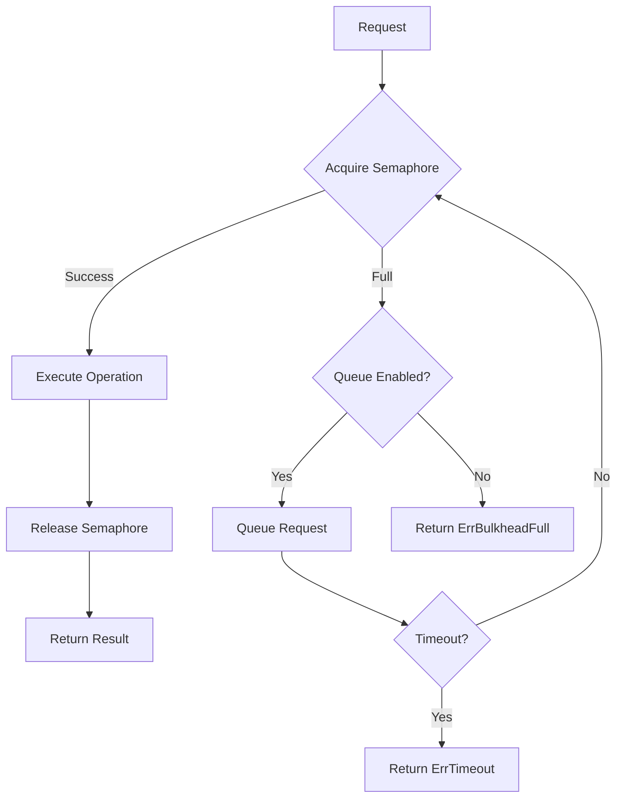

# Module 24: pkg/bulkhead

## สำหรับโฟลเดอร์ `pkg/bulkhead/`

ไฟล์ที่เกี่ยวข้อง:
- `bulkhead.go` – Core interface และ implementation (semaphore-based)
- `config.go` – Configuration management
- `options.go` – Functional options
- `middleware.go` – HTTP/gRPC middleware
- `pool.go` – Worker pool implementation
- `metrics.go` – Prometheus metrics
- `examples/main.go` – ตัวอย่างการใช้งานครบวงจร


## หลักการ (Concept)

### Bulkhead คืออะไร?
Bulkhead (รูปแบบกั้นห้อง) เป็นรูปแบบการออกแบบ (design pattern) สำหรับการจำกัดจำนวน concurrent requests หรือ connections ที่เข้าถึงทรัพยากรหรือ service หนึ่ง ๆ เพื่อป้องกันความล้มเหลวแบบลูกโซ่ (cascading failure) โดยแยกส่วนต่าง ๆ ของระบบออกจากกันอย่างเป็นสัดส่วน เปรียบเสมือนห้องกั้นน้ำในเรือ (ship bulkhead) ที่เมื่อห้องหนึ่งรั่ว น้ำจะไม่ท่วมทั้งลำ

ใน distributed systems, bulkhead ช่วยให้:
- **จำกัด concurrent load** – ป้องกัน service โดน request มากเกินไปจน crash
- **แยกทรัพยากร** – แต่ละ tenant หรือ แต่ละ service มี pool ของตัวเอง
- **รักษาเสถียรภาพ** – เมื่อส่วนหนึ่งล้ม อีกส่วนยังทำงานได้

### มีกี่แบบ? (Types of Bulkhead)

| แบบ | คำอธิบาย | ข้อดี | ข้อเสีย | เหมาะกับ |
|-----|----------|--------|---------|----------|
| **Semaphore-based** | จำกัดจำนวน goroutines ที่ทำงานพร้อมกัน | ง่าย, lightweight | ไม่รองรับ queue, reject ทันทีเมื่อเต็ม | Low latency requirements |
| **Thread pool / Worker pool** | จำกัด worker goroutines และ queue requests | รองรับ queue, ปรับขนาดได้ | ซับซ้อนขึ้น, memory สำหรับ queue | Workloads ที่ยอมรับ latency เพิ่ม |
| **Connection pool** | จำกัด connections ไปยัง resource (DB, HTTP) | ป้องกัน connection exhaustion | ต้องจัดการ timeout, idle connections | Database, external API |
| **Partitioned (tenant-based)** | แยก pool ตาม tenant, API key, หรือ region | ป้องกัน noisy neighbor | management ซับซ้อน | Multi-tenant systems |
| **Dynamic bulkhead** | ปรับขนาด pool ตาม load (auto-scaling) | adaptive, efficient | ซับซ้อนมาก | Cloud-native, unpredictable load |

**ข้อห้ามสำคัญ:** ห้ามใช้ bulkhead โดยไม่มีการตั้ง timeout สำหรับ acquire และ operation เพราะอาจเกิด deadlock หรือ goroutine leak ได้

### ใช้อย่างไร / นำไปใช้กรณีไหน

**กรณีใช้งานหลัก:**
- **API gateway** – จำกัด concurrent requests ต่อ downstream service
- **Database connection pool** – ป้องกัน DB overload
- **External API calls** – จำกัดจำนวน concurrent calls ไปยัง API ที่มี rate limit ต่ำ
- **CPU-intensive operations** – จำกัด parallelism เพื่อป้องกัน CPU thrashing
- **File processing** – จำกัด concurrent file handlers
- **Multi-tenant systems** – จำกัด resource ต่อ tenant

**รูปแบบการใช้งานพื้นฐาน:**
```go
// สร้าง bulkhead ที่อนุญาตสูงสุด 10 concurrent operations
bh := bulkhead.New(bulkhead.Config{
    MaxConcurrent: 10,
    MaxQueueSize:  20, // optional
    Timeout:       5 * time.Second,
})

err := bh.Execute(ctx, func() error {
    // critical section
    return callSlowService()
})
```

### ประโยชน์ที่ได้รับ
- **Prevents resource exhaustion** – จำกัดการใช้ threads, connections, memory
- **Isolates failures** – ความล้มเหลวของส่วนหนึ่งไม่กระทบส่วนอื่น
- **Improves predictability** – latency และ throughput คงที่
- **Graceful degradation** – reject excess requests แทนที่จะ crash
- **Observability** – สามารถ monitor queue size, active requests, rejections

### ข้อควรระวัง
- **Queue size tuning** – queue ใหญ่เกินไปอาจเพิ่ม latency และ memory
- **Deadlock risk** – การ acquire bulkhead ภายใน bulkhead อื่น (nested) ต้องระวัง
- **Timeout management** – operation ที่ไม่มี timeout อาจทำให้ bulkhead เต็มนาน
- **Monitoring overhead** – ต้อง monitor metrics เพื่อปรับขนาดให้เหมาะสม
- **Not a substitute for rate limiting** – bulkhead ควบคุม concurrency, rate limiting ควบคุม frequency

### ข้อดี
- **Simple implementation** – ใช้ semaphore หรือ channel ได้ง่าย
- **Low overhead** – semaphore-based มี overhead น้อย
- **Easy to test** – สามารถ mock bulkhead interface
- **Composable** – ใช้ร่วมกับ circuit breaker และ retry ได้ดี

### ข้อเสีย
- **Queueing may increase latency** – requests ใน queue ต้องรอ
- **Requires tuning** – ต้องหา max concurrent ที่เหมาะสม (load testing)
- **Not distributed** – แต่ละ instance มี bulkhead ของตัวเอง (ไม่ shared ข้าม instance)
- **No built-in prioritization** – requests ทุกตัวเท่ากัน (อาจเพิ่ม priority queue ได้)

### ข้อห้าม
**ห้ามใช้ bulkhead ที่มี queue size ใหญ่เกินไป โดยไม่มี timeout** เพราะจะทำให้ requests ค้างใน queue นาน และอาจ掩盖ปัญหาด้าน performance

**ห้ามใช้ bulkhead เดียวกันสำหรับ workload ที่มีความสำคัญแตกต่างกัน** (เช่น critical vs background jobs) เพราะอาจทำให้ critical path ติด queue เนื่องจาก background jobs

**ห้ามใช้ bulkhead แทน rate limiting สำหรับกรณีที่ต้องการควบคุมจำนวน requests ต่อวินาที** – bulkhead ควบคุม concurrency, rate limiting ควบคุม frequency ควรใช้ทั้งสองแบบร่วมกัน


## การออกแบบ Workflow และ Dataflow



### Dataflow ใน Go application:
1. Client เรียก `bulkhead.Execute()` พร้อม function
2. Bulkhead พยายาม acquire semaphore (หรือ queue)
3. ถ้า acquire สำเร็จ → execute function → release → return
4. ถ้าไม่สำเร็จ และมี queue → enqueue รอ (มี timeout)
5. ถ้า queue เต็ม หรือ timeout → return error ทันที


## ตัวอย่างโค้ดที่รันได้จริง

### โครงสร้างโปรเจกต์
```
pkg/bulkhead/
├── bulkhead.go      # Core interface และ semaphore implementation
├── config.go
├── options.go
├── pool.go          # Worker pool implementation
├── middleware.go    # HTTP middleware
├── metrics.go
└── examples/main.go
```

### 1. การติดตั้ง Dependencies

```bash
# ไม่มี external dependencies จำเป็น
# Optional สำหรับ metrics
go get github.com/prometheus/client_golang/prometheus
```

### 2. ตัวอย่างโค้ด: Core Interface

```go
// bulkhead.go
package bulkhead

import (
    "context"
    "errors"
    "sync"
    "time"
)

var (
    ErrBulkheadFull   = errors.New("bulkhead is full (max concurrent reached)")
    ErrQueueFull      = errors.New("bulkhead queue is full")
    ErrTimeout        = errors.New("bulkhead acquire timeout")
    ErrBulkheadClosed = errors.New("bulkhead is closed")
)

// Bulkhead defines the interface for concurrency limiting
type Bulkhead interface {
    // Execute runs the given function if concurrency permits.
    Execute(ctx context.Context, fn func() error) error

    // ExecuteWithFallback runs function with fallback when bulkhead is full.
    ExecuteWithFallback(ctx context.Context, fn func() error, fallback func(error) error) error

    // Stats returns current usage statistics.
    Stats() Stats

    // Close releases resources.
    Close() error
}

// Stats contains current bulkhead metrics
type Stats struct {
    MaxConcurrent   int
    ActiveRequests  int
    QueuedRequests  int
    TotalRejected   uint64
    TotalExecuted   uint64
    TotalTimedOut   uint64
}

// SemaphoreBulkhead implements Bulkhead using a weighted semaphore.
type SemaphoreBulkhead struct {
    sem         chan struct{}   // counting semaphore
    queue       chan struct{}   // queue for waiting (optional)
    maxQueue    int
    timeout     time.Duration
    mu          sync.RWMutex
    active      int
    queued      int
    totalReject uint64
    totalExec   uint64
    totalTimeout uint64
    closed      bool
}

type Config struct {
    MaxConcurrent int           // maximum concurrent operations
    MaxQueueSize  int           // maximum queue size (0 = no queue)
    Timeout       time.Duration // acquire timeout (0 = no timeout)
}

func New(cfg Config) (*SemaphoreBulkhead, error) {
    if cfg.MaxConcurrent <= 0 {
        return nil, errors.New("MaxConcurrent must be positive")
    }
    bh := &SemaphoreBulkhead{
        sem:      make(chan struct{}, cfg.MaxConcurrent),
        maxQueue: cfg.MaxQueueSize,
        timeout:  cfg.Timeout,
    }
    if cfg.MaxQueueSize > 0 {
        bh.queue = make(chan struct{}, cfg.MaxQueueSize)
    }
    return bh, nil
}

func (b *SemaphoreBulkhead) Execute(ctx context.Context, fn func() error) error {
    return b.ExecuteWithFallback(ctx, fn, nil)
}

func (b *SemaphoreBulkhead) ExecuteWithFallback(ctx context.Context, fn func() error, fallback func(error) error) error {
    b.mu.RLock()
    if b.closed {
        b.mu.RUnlock()
        return ErrBulkheadClosed
    }
    b.mu.RUnlock()

    // Try to acquire semaphore (immediate or with queue)
    acquired, err := b.acquire(ctx)
    if err != nil {
        if fallback != nil {
            return fallback(err)
        }
        return err
    }
    defer b.release()

    err = fn()
    return err
}

func (b *SemaphoreBulkhead) acquire(ctx context.Context) (bool, error) {
    // Try to acquire semaphore directly
    select {
    case b.sem <- struct{}{}:
        b.updateStats(true, false, false)
        return true, nil
    default:
        // Semaphore full, check queue
    }

    // If queue is disabled, reject immediately
    if b.maxQueue == 0 {
        b.updateStats(false, false, true)
        return false, ErrBulkheadFull
    }

    // Try to enqueue
    select {
    case b.queue <- struct{}{}:
        b.updateStats(false, true, false)
        // Wait for semaphore
        defer func() { <-b.queue }()
        // Now wait for semaphore with timeout
        select {
        case b.sem <- struct{}{}:
            b.updateStats(true, false, false)
            return true, nil
        case <-ctx.Done():
            b.updateStats(false, false, true)
            return false, ctx.Err()
        case <-time.After(b.timeout):
            b.updateStats(false, false, true)
            return false, ErrTimeout
        }
    default:
        // Queue full
        b.updateStats(false, false, true)
        return false, ErrQueueFull
    }
}

func (b *SemaphoreBulkhead) release() {
    <-b.sem
}

func (b *SemaphoreBulkhead) updateStats(acquired, queued, rejected bool) {
    b.mu.Lock()
    defer b.mu.Unlock()
    if acquired {
        b.active++
        b.totalExec++
    }
    if queued {
        b.queued++
    }
    if rejected {
        b.totalReject++
    }
    // Adjust active on release is done in release but not tracked here
}

func (b *SemaphoreBulkhead) Stats() Stats {
    b.mu.RLock()
    defer b.mu.RUnlock()
    return Stats{
        MaxConcurrent:  cap(b.sem),
        ActiveRequests: b.active,
        QueuedRequests: b.queued,
        TotalRejected:  b.totalReject,
        TotalExecuted:  b.totalExec,
        TotalTimedOut:  b.totalTimeout,
    }
}

func (b *SemaphoreBulkhead) Close() error {
    b.mu.Lock()
    defer b.mu.Unlock()
    b.closed = true
    return nil
}
```

### 3. ตัวอย่างโค้ด: Worker Pool Implementation

```go
// pool.go
package bulkhead

import (
    "context"
    "sync"
)

type WorkerPoolBulkhead struct {
    workers chan struct{}
    queue   chan func()
    wg      sync.WaitGroup
    ctx     context.Context
    cancel  context.CancelFunc
    stats   Stats
    mu      sync.Mutex
}

func NewWorkerPool(maxWorkers, queueSize int) *WorkerPoolBulkhead {
    ctx, cancel := context.WithCancel(context.Background())
    wp := &WorkerPoolBulkhead{
        workers: make(chan struct{}, maxWorkers),
        queue:   make(chan func(), queueSize),
        ctx:     ctx,
        cancel:  cancel,
    }
    // Start workers
    for i := 0; i < maxWorkers; i++ {
        wp.wg.Add(1)
        go wp.worker()
    }
    return wp
}

func (wp *WorkerPoolBulkhead) worker() {
    defer wp.wg.Done()
    for {
        select {
        case <-wp.ctx.Done():
            return
        case fn := <-wp.queue:
            wp.mu.Lock()
            wp.stats.ActiveRequests++
            wp.mu.Unlock()
            fn()
            wp.mu.Lock()
            wp.stats.ActiveRequests--
            wp.mu.Unlock()
        }
    }
}

func (wp *WorkerPoolBulkhead) Execute(ctx context.Context, fn func() error) error {
    select {
    case wp.queue <- func() { fn() }:
        return nil
    case <-ctx.Done():
        return ctx.Err()
    }
}

func (wp *WorkerPoolBulkhead) Stats() Stats {
    wp.mu.Lock()
    defer wp.mu.Unlock()
    return wp.stats
}

func (wp *WorkerPoolBulkhead) Close() error {
    wp.cancel()
    wp.wg.Wait()
    close(wp.queue)
    return nil
}
```

### 4. ตัวอย่างโค้ด: HTTP Middleware

```go
// middleware.go
package bulkhead

import (
    "net/http"
)

// HTTPMiddleware creates a middleware that limits concurrent requests.
func HTTPMiddleware(bh Bulkhead) func(http.Handler) http.Handler {
    return func(next http.Handler) http.Handler {
        return http.HandlerFunc(func(w http.ResponseWriter, r *http.Request) {
            err := bh.Execute(r.Context(), func() error {
                next.ServeHTTP(w, r)
                return nil
            })
            if err != nil {
                switch err {
                case ErrBulkheadFull, ErrQueueFull, ErrTimeout:
                    http.Error(w, "Too Many Requests", http.StatusTooManyRequests)
                default:
                    http.Error(w, "Internal Server Error", http.StatusInternalServerError)
                }
            }
        })
    }
}
```

### 5. ตัวอย่างโค้ด: Prometheus Metrics

```go
// metrics.go
package bulkhead

import (
    "github.com/prometheus/client_golang/prometheus"
)

type Metrics struct {
    activeGauge   prometheus.Gauge
    queuedGauge   prometheus.Gauge
    rejectedCount prometheus.Counter
    executedCount prometheus.Counter
}

func NewMetrics(reg prometheus.Registerer, name string) *Metrics {
    m := &Metrics{
        activeGauge: prometheus.NewGauge(prometheus.GaugeOpts{
            Name: name + "_bulkhead_active",
            Help: "Current active requests in bulkhead",
        }),
        queuedGauge: prometheus.NewGauge(prometheus.GaugeOpts{
            Name: name + "_bulkhead_queued",
            Help: "Current queued requests in bulkhead",
        }),
        rejectedCount: prometheus.NewCounter(prometheus.CounterOpts{
            Name: name + "_bulkhead_rejected_total",
            Help: "Total rejected requests",
        }),
        executedCount: prometheus.NewCounter(prometheus.CounterOpts{
            Name: name + "_bulkhead_executed_total",
            Help: "Total executed requests",
        }),
    }
    reg.MustRegister(m.activeGauge, m.queuedGauge, m.rejectedCount, m.executedCount)
    return m
}

func (m *Metrics) Update(stats Stats) {
    m.activeGauge.Set(float64(stats.ActiveRequests))
    m.queuedGauge.Set(float64(stats.QueuedRequests))
    // counters are cumulative, but we can set to current total
    // For simplicity, we use Gauge for total, but better to use Counter and inc per event.
}
```

### 6. ตัวอย่างการใช้งานรวมใน Main

```go
// main.go
package main

import (
    "context"
    "log"
    "net/http"
    "time"

    "yourproject/pkg/bulkhead"
)

func main() {
    // Create bulkhead: max 10 concurrent, queue 20, timeout 5s
    bh, _ := bulkhead.New(bulkhead.Config{
        MaxConcurrent: 10,
        MaxQueueSize:  20,
        Timeout:       5 * time.Second,
    })
    defer bh.Close()

    // Use in HTTP handler
    http.HandleFunc("/api", func(w http.ResponseWriter, r *http.Request) {
        err := bh.Execute(r.Context(), func() error {
            // Simulate work
            time.Sleep(100 * time.Millisecond)
            w.Write([]byte("OK"))
            return nil
        })
        if err != nil {
            http.Error(w, "Service overloaded", http.StatusServiceUnavailable)
        }
    })

    // Or use middleware
    // handler := bulkhead.HTTPMiddleware(bh)(http.DefaultServeMux)

    log.Println("server on :8080")
    log.Fatal(http.ListenAndServe(":8080", nil))
}
```


## วิธีใช้งาน module นี้

1. เลือก bulkhead type (semaphore หรือ worker pool)
2. กำหนด `MaxConcurrent` โดยอิงจาก load testing หรือ resource limit (CPU, memory, connection pool)
3. กำหนด `MaxQueueSize` ถ้าต้องการให้ request รอ (0 = reject ทันที)
4. กำหนด `Timeout` สำหรับการ acquire (แนะนำ 1-10 วินาที)
5. ใช้ `Execute()` หรือ `ExecuteWithFallback()` ใน critical sections
6. ใช้ middleware สำหรับ HTTP handlers


## การติดตั้ง

```bash
go get github.com/prometheus/client_golang/prometheus
# ไม่มี external dependencies สำหรับ core
```


## การตั้งค่า configuration

```go
type Config struct {
    MaxConcurrent int           // required
    MaxQueueSize  int           // default 0 (no queue)
    Timeout       time.Duration // default 0 (no timeout)
}
```

Environment variables:
```bash
BULKHEAD_MAX_CONCURRENT=20
BULKHEAD_MAX_QUEUE=50
BULKHEAD_TIMEOUT=5s
```


## การรวมกับ GORM

ใช้ bulkhead จำกัด concurrent database queries:

```go
var dbBulkhead bulkhead.Bulkhead

func init() {
    dbBulkhead, _ = bulkhead.New(bulkhead.Config{
        MaxConcurrent: 100, // connection pool size
        MaxQueueSize:  200,
        Timeout:       30 * time.Second,
    })
}

func FindUser(db *gorm.DB, id string) (*User, error) {
    var user User
    err := dbBulkhead.Execute(context.Background(), func() error {
        return db.Where("id = ?", id).First(&user).Error
    })
    return &user, err
}
```


## การใช้งานจริง

### Example 1: API Gateway with Per-Tenant Bulkhead

```go
type TenantBulkhead struct {
    tenantToBH map[string]bulkhead.Bulkhead
    mu         sync.RWMutex
}

func (t *TenantBulkhead) Execute(tenantID string, fn func() error) error {
    t.mu.RLock()
    bh, ok := t.tenantToBH[tenantID]
    t.mu.RUnlock()
    if !ok {
        // create new bulkhead for this tenant
        bh, _ = bulkhead.New(bulkhead.Config{MaxConcurrent: 5})
        t.mu.Lock()
        t.tenantToBH[tenantID] = bh
        t.mu.Unlock()
    }
    return bh.Execute(context.Background(), fn)
}
```

### Example 2: Database Connection Pool Wrapper

```go
type DBWithBulkhead struct {
    db       *sql.DB
    bulkhead bulkhead.Bulkhead
}

func (d *DBWithBulkhead) Query(ctx context.Context, query string) (*sql.Rows, error) {
    var rows *sql.Rows
    err := d.bulkhead.Execute(ctx, func() error {
        var err error
        rows, err = d.db.QueryContext(ctx, query)
        return err
    })
    return rows, err
}
```

### Example 3: Parallel Processing with Limited Concurrency

```go
func processItems(items []Item) {
    bh, _ := bulkhead.New(bulkhead.Config{MaxConcurrent: 10})
    var wg sync.WaitGroup
    for _, item := range items {
        wg.Add(1)
        go func(it Item) {
            defer wg.Done()
            bh.Execute(context.Background(), func() error {
                processItem(it)
                return nil
            })
        }(item)
    }
    wg.Wait()
}
```


## ตารางสรุป Bulkhead Components

| Component | คำอธิบาย | ตัวอย่าง |
|-----------|----------|----------|
| **SemaphoreBulkhead** | ใช้ counting semaphore จำกัด concurrency | `New(Config{MaxConcurrent:10})` |
| **WorkerPoolBulkhead** | ใช้ worker goroutines + queue | `NewWorkerPool(workers, queueSize)` |
| **Config** | MaxConcurrent, MaxQueueSize, Timeout | `{MaxConcurrent:20, Timeout:5s}` |
| **Stats** | ข้อมูล active, queued, rejected, executed | `bh.Stats()` |
| **Execute** | เรียก operation ภายใต้ bulkhead | `bh.Execute(ctx, fn)` |
| **ExecuteWithFallback** | มี fallback เมื่อ bulkhead เต็ม | `bh.ExecuteWithFallback(ctx, fn, fallback)` |
| **HTTPMiddleware** | Middleware สำหรับ net/http | `HTTPMiddleware(bh)` |


## แบบฝึกหัดท้าย module (5 ข้อ)

### ข้อ 1: Implement Semaphore Bulkhead with Timeout (No External Library)
จงเขียน bulkhead ที่ใช้ `chan struct{}` และ `select` พร้อม timeout (โดยไม่ใช้ package ข้างนอก) โดยมี method `Acquire()` และ `Release()` และทดสอบ concurrent กับ goroutines 100 ตัว

### ข้อ 2: Bulkhead with Priority Queue
ปรับปรุง bulkhead ให้รองรับ priority โดยที่ requests ที่มี priority สูงจะถูกนำออกจาก queue ก่อน (ใช้ heap) เขียน test ที่แสดงว่า priority สูงได้คิวเร็วกว่า

### ข้อ 3: Distributed Bulkhead via Redis
เนื่องจาก bulkhead ทั่วไปเป็นแบบ in-memory (ไม่แชร์ข้าม instance) จง implement distributed bulkhead ที่ใช้ Redis `INCR` และ `EXPIRE` เพื่อจำกัด concurrency ข้ามหลาย instances โดยมี TTL สำหรับการปลด lock (ใช้ Lua script เพื่อ atomic)

### ข้อ 4: Bulkhead with Circuit Breaker Integration
จงสร้าง `ResilientBulkhead` ที่รวม bulkhead และ circuit breaker เข้าด้วยกัน:
- ถ้า circuit breaker เปิด → reject ทันที
- ถ้า bulkhead เต็ม → queue หรือ reject ตาม config
- เมื่อ circuit breaker เปิด, bulkhead ควรหยุดรับ request ใหม่
- เขียน integration test ที่จำลอง failure และ verify behavior

### ข้อ 5: Adaptive Bulkhead Based on System Load
จงสร้าง bulkhead ที่ปรับ `MaxConcurrent` แบบไดนามิกตาม CPU usage หรือ memory usage:
- ใช้ `runtime.ReadMemStats` หรือ `github.com/shirou/gopsutil` เพื่อ monitor load
- ถ้า CPU > 80% → ลด MaxConcurrent ลง 50%
- ถ้า CPU < 30% → เพิ่ม MaxConcurrent ขึ้น 20% (แต่ไม่เกิน max limit)
- ทดสอบโดยจำลอง high CPU load และ verify bulkhead ปรับขนาดอัตโนมัติ


## แหล่งอ้างอิง

- [Bulkhead Pattern – Microsoft Learn](https://learn.microsoft.com/en-us/azure/architecture/patterns/bulkhead)
- [Bulkhead Pattern in Go – Medium](https://medium.com/@pavelfilo/bulkhead-pattern-in-go-4b09b5cdc9b2)
- [Semaphore in Go – Using Channels](https://golang.org/doc/effective_go#channels)
- [Resilience Patterns: Bulkhead](https://resilience4j.readme.io/docs/bulkhead)

---

**หมายเหตุ:** module นี้ครบถ้วนสำหรับ `pkg/bulkhead` สำหรับระบบ gobackend หากต้องการ module เพิ่มเติม (เช่น `pkg/timeout`, `pkg/failsafe`) โปรดแจ้ง