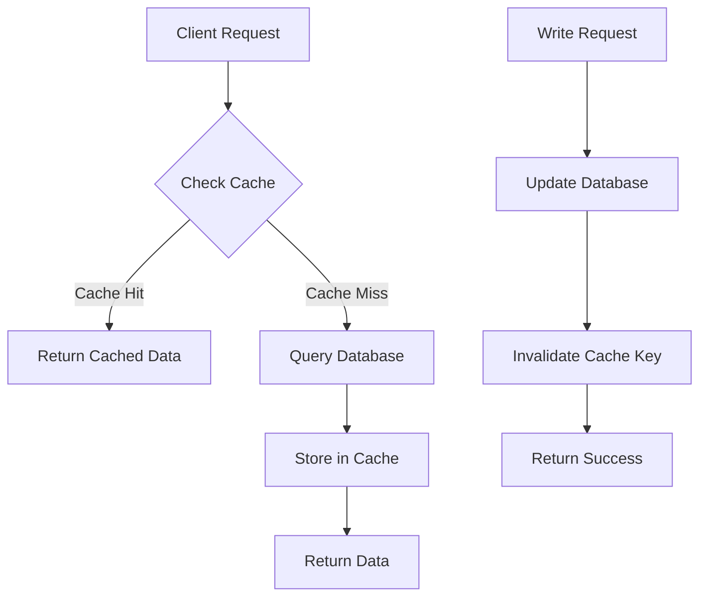
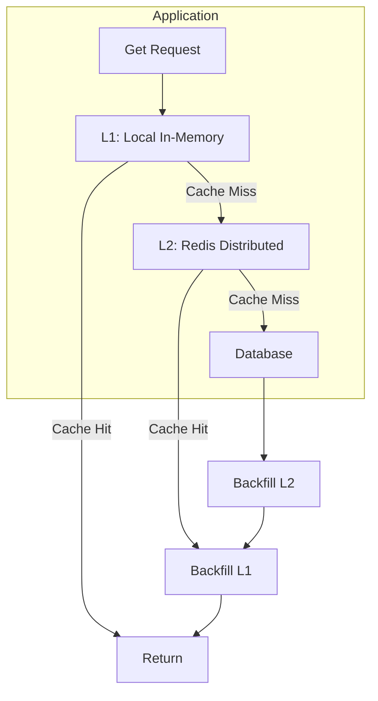
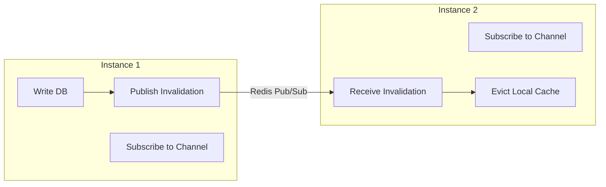

# Module 21: pkg/cache

## สำหรับโฟลเดอร์ `pkg/cache/`

ไฟล์ที่เกี่ยวข้อง:
- `client.go` – การสร้างและจัดการ Cache Interface
- `provider.go` – Provider implementations (In-Memory, Redis, BigCache, FreeCache)
- `options.go` – Functional options for cache operations
- `config.go` – Configuration management
- `codec.go` – Serialization (JSON, MsgPack, GOB)
- `middleware.go` – HTTP middleware for caching responses
- `metrics.go` – Prometheus metrics integration
- `consistency.go` – Cache-Aside, Write-Through, Pub-Sub invalidation
- `gorm.go` – GORM plugin for query caching
- `example_main.go` – Complete usage example


## หลักการ (Concept)

### Cache คืออะไร?
Cache คือชั้นเก็บข้อมูลชั่วคราว (temporary storage layer) ที่มีวัตถุประสงค์เพื่อลดเวลาในการเข้าถึงข้อมูลโดยการเก็บผลลัพธ์ของการทำงานที่ผ่านมาไว้ใกล้กับแอปพลิเคชันมากที่สุด (in-memory)[reference:0]Cache ทำหน้าที่เป็น "shortcut" เพื่อลดความซ้ำซ้อนในการคำนวณ ลดจำนวนการเรียกฐานข้อมูลหรือ API ภายนอก และเพิ่มความสามารถในการขยายขนาดของระบบ[reference:1]

Caching เป็นเทคนิคที่จำเป็นสำหรับการพัฒนา API ที่มีประสิทธิภาพสูง โดยเฉพาะใน Go ซึ่งมีเครื่องมือและไลบรารีที่รองรับการ caching ทั้งในระดับ local และ distributed[reference:2]

### มีกี่แบบ? (Types of Cache in Go)

| แบบ | คำอธิบาย | Example Library | เหมาะกับ |
|-----|----------|-----------------|----------|
| **In-Memory (Single Node)** | เก็บข้อมูลใน RAM ของแอปพลิเคชันโดยตรง เร็วที่สุด แต่ไม่แชร์ข้อมูลข้าม instance | `go-cache`, `bigcache`, `freecache` | Single-instance deployment, data ที่ไม่ต้องการแชร์ |
| **Distributed Cache** | แยก cache เป็น service กลาง (Redis, Memcached) แชร์ข้อมูลได้ทุก instance | `go-redis`, `rueidis`, `buntdb` | Multi-instance, microservices, session storage |
| **Multi-Layer (L1 + L2)** | L1 in-memory (local) + L2 distributed (Redis) | `viney-shih/go-cache` | ต้องการความเร็ว + consistency |[reference:3]|
| **Near Cache** | Distributed cache + local copy เพื่อลด network latency | `coherence`, custom | High-read, low-write workloads |[reference:4]|
| **Embedded** | Cache ใน process เดียวกันกับแอป ไม่มี external dependency | `groupcache`, `ristretto` | Edge cases, low latency requirement |
| **HTTP Response Cache** | Cache HTTP responses ทั้ง response body | `httptreemux`, `echo-cache` | API responses, CDN-like behavior |

**ข้อห้ามสำคัญ:** ห้ามใช้ In-Memory cache ในแอปที่รันหลาย instance โดยไม่มีการ invalidate ข้อมูลระหว่างกัน เพราะจะทำให้ข้อมูลไม่สอดคล้องกัน (stale data) ต้องใช้ Pub-Sub pattern หรือ distributed cache แทน[reference:5]

### ใช้อย่างไร / นำไปใช้กรณีไหน

**กรณีใช้งานหลัก:**
- **Database query caching** – ลด load บน database โดย cache ผลลัพธ์ของ query ที่ซ้ำ
- **Session / Token storage** – เก็บ session state แบบ distributed
- **API response caching** – ลด latency ของ API endpoints ที่มี traffic สูง
- **Rate limiting counter** – ใช้ Redis `INCR` ในการทำ rate limiting
- **Computation caching** – Cache ผลลัพธ์ของการคำนวณที่ใช้เวลานาน
- **Locking / Distributed lock** – ใช้ Redis `SETNX` ทำ distributed lock
- **Leaderboard / Ranking** – ใช้ Redis Sorted Set สำหรับ real-time ranking

**รูปแบบการออกแบบ (Patterns):**

| Pattern | คำอธิบาย | เมื่อใช้ | เมื่อไม่ใช้ |
|---------|----------|---------|------------|
| **Cache-Aside (Lazy Loading)** | App ตรวจ cache ก่อน ถ้าไม่เจอให้ query DB แล้วเก็บ cache | อ่านมากกว่าเขียน, consistency ไม่ critical | เขียนข้อมูลบ่อย, ต้องการ consistency สูง |[reference:6]|
| **Write-Through** | เขียน DB และ cache พร้อมกัน | อ่านและเขียนถี่, consistency สำคัญ | เขียนน้อยกว่าอ่านมาก, overhead สูง |
| **Write-Behind** | เขียน cache ก่อน แล้วค่อย sync ไป DB ภายหลัง | throughput การเขียนสูง, eventual consistency ยอมรับได้ | ต้องการ durability สูง |
| **Refresh-Ahead** | cache refresh ล่วงหน้าก่อน expire | อ่านถี่, stale data tolerance สูง | ข้อมูลเปลี่ยนบ่อย |

### ประโยชน์ที่ได้รับ
- **ลด latency ลงอย่างมาก** – การอ่านจาก RAM (in-memory) เร็วกว่าจาก disk database 100-1000 เท่า
- **ลดภาระฐานข้อมูล** – ลดจำนวน query ที่กระทบ DB โดยตรง เพิ่มความสามารถในการ scale
- **รองรับ high throughput** – cache สามารถรับ request ได้มากกว่า DB หลายเท่า
- **ลดต้นทุน** – ลดความจำเป็นในการ scale database infrastructure
- **Abstraction layer** – สามารถเปลี่ยน caching backend ได้โดยไม่แก้ business logic
- **Observability** – เพิ่ม metrics, logging, tracing สำหรับ cache operations

### ข้อควรระวัง
- **Cache stampede (thundering herd)** – cache expire พร้อมกันหลาย key ทำให้ request พร้อมกันไป query DB ทันที ต้องใช้ techniques เช่น `singleflight` หรือ `random expiration jitter`
- **Memory management** – ระวัง memory leak หรือ cache ที่ใหญ่เกินไปจน application OOM
- **Consistency** – ข้อมูลที่ cache อาจไม่ตรงกับ source of truth ถ้า invalidate ไม่ถูกต้อง[reference:7]
- **Cold start** – หลัง deploy หรือ restart แอป cache ว่างเปล่า ทำให้ performance ติดลบ
- **Serialization overhead** – การ marshal/unmarshal ข้อมูลอาจมีต้นทุนสูง ถ้า cache ข้อมูลขนาดใหญ่
- **Distributed cache network latency** – Redis หรือ Memcached ต้องผ่าน network มี latency เพิ่ม ~0.5-2ms

### ข้อดี
- **Performance boost ที่เห็นผลทันที** – สำหรับ read-heavy workloads
- **Simple abstraction** – Cache interface ใช้ง่าย เหมือน `Get`/`Set`
- **Rich ecosystem** – มีไลบรารี caching คุณภาพสูงสำหรับ Go โดยเฉพาะ[reference:8][reference:9]
- **Production-proven** – Redis, BigCache, FreeCache ใช้ใน production ขนาดใหญ่
- **TTL support** – ทุก cache library รองรับ automatic expiration
- **Observability** – สามารถเพิ่ม metrics และ logging เพื่อ monitor hit rate

### ข้อเสีย
- **Stale data risk** – ข้อมูลที่ cache อาจไม่เป็นปัจจุบันถ้า invalidate ไม่ถูกต้อง
- **Increased complexity** – ต้อง manage cache invalidation logic ใน code
- **Memory cost** – การใช้ cache ต้องเสีย memory เพิ่ม โดยเฉพาะถ้า cache ข้อมูลขนาดใหญ่
- **Distributed cache overhead** – การ serialize/deserialize และ network latency มีต้นทุน
- **Testing complexity** – การทดสอบ cache logic อาจต้อง mock หรือมี environment ที่ซับซ้อน

### ข้อห้าม
**ห้าม cache ข้อมูลที่มีความ sensitive หรือเป็น PII (Personal Identifiable Information)** โดยไม่มีการเข้ารหัสที่เหมาะสม

**ห้าม cache dynamic data ที่เปลี่ยนแปลงบ่อยเกินไป** เช่น stock level, user balance เพราะจะทำให้ stale data risk สูง และ invalidate บ่อยจน cache ไร้ประโยชน์

**ห้ามใช้ cache เป็น primary storage** – cache มีความ volatile (ข้อมูลอาจหายเมื่อ restart หรือ eviction) ดังนั้นต้องมี persistent storage เป็น source of truth เสมอ


## การออกแบบ Workflow และ Dataflow

### Cache-Aside (Lazy Loading) Pattern



### Multi-Layer Cache (L1 + L2)



### Cache Invalidation with Pub-Sub (Multi-Instance Consistency)



**Dataflow ใน Go application:**
1. **Read path** – ตรวจสอบ cache ก่อน ถ้าไม่เจอ (cache miss) → query DB → store ใน cache → return
2. **Write path** – update DB → invalidate cache key (หรือ update cache ตาม pattern)
3. **Eviction** – cache expire ตาม TTL หรือ memory limit
4. **Multi-instance sync** – เมื่อ instance ใด instance หนึ่ง invalidate cache → broadcast ผ่าน Redis Pub/Sub ให้ instance อื่น invalidate ด้วย


## ตัวอย่างโค้ดที่รันได้จริง

### โครงสร้างโปรเจกต์
```
pkg/cache/
├── cache.go          # Core Cache interface
├── provider.go       # InMemory, Redis, BigCache providers
├── options.go        # Functional options
├── config.go         # Configuration
├── codec.go          # Serialization (JSON, MsgPack)
├── middleware.go     # HTTP caching middleware
├── consistency.go    # Cache-Aside, Pub-Sub invalidation
├── gorm.go           # GORM plugin for caching
├── metrics.go        # Prometheus metrics
└── example_main.go   # Complete example
```

### 1. การติดตั้ง Dependencies

```bash
# Core packages
go get github.com/redis/go-redis/v9
go get github.com/allegro/bigcache/v3
go get github.com/coocood/freecache
go get github.com/patrickmn/go-cache

# Serialization
go get github.com/vmihailenco/msgpack/v5
go get github.com/json-iterator/go

# Metrics
go get github.com/prometheus/client_golang

# Utilities
go get golang.org/x/sync/singleflight
go get github.com/google/uuid
```

### 2. การติดตั้ง Cache Backend

#### Redis (สำหรับ distributed cache)
```yaml
# docker-compose.yml
version: '3.8'
services:
  redis:
    image: redis:7-alpine
    container_name: redis
    ports:
      - "6379:6379"
    volumes:
      - redis_data:/data
    command: redis-server --appendonly yes
    restart: unless-stopped

volumes:
  redis_data:
```

#### Redis Stack (รองรับ JSON, Search)
```bash
docker run -d --name redis-stack -p 6379:6379 -p 8001:8001 redis/redis-stack:latest
```

### 3. ตัวอย่างโค้ด: Cache Interface

```go
// cache.go
package cache

import (
    "context"
    "time"
)

// Cache defines the core interface for all cache implementations
type Cache interface {
    // Get retrieves a value from cache
    Get(ctx context.Context, key string) ([]byte, error)

    // Set stores a value in cache with TTL
    Set(ctx context.Context, key string, value []byte, ttl time.Duration) error

    // Delete removes a key from cache
    Delete(ctx context.Context, key string) error

    // Exists checks if a key exists in cache
    Exists(ctx context.Context, key string) (bool, error)

    // GetTTL returns remaining TTL for a key
    GetTTL(ctx context.Context, key string) (time.Duration, error)

    // Close closes the cache connection
    Close() error
}

// TypedCache provides type-safe cache operations using generics
type TypedCache[T any] interface {
    Get(ctx context.Context, key string) (T, error)
    Set(ctx context.Context, key string, value T, ttl time.Duration) error
    Delete(ctx context.Context, key string) error
}

// CacheOption defines functional options for cache operations
type GetOption func(*GetOptions)

type GetOptions struct {
    // Touch resets TTL on access
    Touch bool
}

func WithTouch(touch bool) GetOption {
    return func(o *GetOptions) { o.Touch = touch }
}
```

### 4. ตัวอย่างโค้ด: In-Memory Provider (go-cache)

```go
// provider_inmemory.go
package cache

import (
    "context"
    "time"

    gocache "github.com/patrickmn/go-cache"
)

type InMemoryCache struct {
    client *gocache.Cache
    ttl    time.Duration
}

func NewInMemoryCache(defaultTTL, cleanupInterval time.Duration) *InMemoryCache {
    return &InMemoryCache{
        client: gocache.New(defaultTTL, cleanupInterval),
        ttl:    defaultTTL,
    }
}

func (c *InMemoryCache) Get(ctx context.Context, key string) ([]byte, error) {
    val, found := c.client.Get(key)
    if !found {
        return nil, ErrCacheMiss
    }

    data, ok := val.([]byte)
    if !ok {
        return nil, ErrInvalidType
    }
    return data, nil
}

func (c *InMemoryCache) Set(ctx context.Context, key string, value []byte, ttl time.Duration) error {
    if ttl == 0 {
        ttl = c.ttl
    }
    c.client.Set(key, value, ttl)
    return nil
}

func (c *InMemoryCache) Delete(ctx context.Context, key string) error {
    c.client.Delete(key)
    return nil
}

func (c *InMemoryCache) Exists(ctx context.Context, key string) (bool, error) {
    _, found := c.client.Get(key)
    return found, nil
}

func (c *InMemoryCache) GetTTL(ctx context.Context, key string) (time.Duration, error) {
    if val, found := c.client.Get(key); found {
        // go-cache doesn't expose remaining TTL directly
        // Returns 0 to indicate key exists
        return 0, nil
    }
    return 0, ErrCacheMiss
}

func (c *InMemoryCache) Close() error {
    c.client.Flush()
    return nil
}
```

### 5. ตัวอย่างโค้ด: High-Performance BigCache Provider

```go
// provider_bigcache.go
package cache

import (
    "context"
    "time"

    "github.com/allegro/bigcache/v3"
)

type BigCacheProvider struct {
    client *bigcache.BigCache
}

func NewBigCacheProvider(config Config) (*BigCacheProvider, error) {
    bcConfig := bigcache.Config{
        Shards:             1024,
        LifeWindow:         config.TTL,
        CleanWindow:        5 * time.Minute,
        MaxEntriesInWindow: 1000 * 10 * 60,
        MaxEntrySize:       500,
        StatsEnabled:       false,
        Verbose:            false,
        Hasher:             nil,
        HardMaxCacheSize:   config.MaxSizeMB,
    }

    client, err := bigcache.New(context.Background(), bcConfig)
    if err != nil {
        return nil, err
    }

    return &BigCacheProvider{client: client}, nil
}

func (c *BigCacheProvider) Get(ctx context.Context, key string) ([]byte, error) {
    return c.client.Get(key)
}

func (c *BigCacheProvider) Set(ctx context.Context, key string, value []byte, ttl time.Duration) error {
    return c.client.Set(key, value)
}

func (c *BigCacheProvider) Delete(ctx context.Context, key string) error {
    return c.client.Delete(key)
}

func (c *BigCacheProvider) Exists(ctx context.Context, key string) (bool, error) {
    _, err := c.client.Get(key)
    if err == nil {
        return true, nil
    }
    if err == bigcache.ErrEntryNotFound {
        return false, nil
    }
    return false, err
}

func (c *BigCacheProvider) GetTTL(ctx context.Context, key string) (time.Duration, error) {
    // BigCache doesn't expose per-key TTL
    return 0, nil
}

func (c *BigCacheProvider) Close() error {
    return c.client.Close()
}
```

### 6. ตัวอย่างโค้ด: Redis Provider

```go
// provider_redis.go
package cache

import (
    "context"
    "time"

    "github.com/redis/go-redis/v9"
)

type RedisCache struct {
    client *redis.Client
    ttl    time.Duration
}

func NewRedisCache(addr, password string, db int, defaultTTL time.Duration) *RedisCache {
    client := redis.NewClient(&redis.Options{
        Addr:         addr,
        Password:     password,
        DB:           db,
        PoolSize:     100,
        MinIdleConns: 10,
        ReadTimeout:  3 * time.Second,
        WriteTimeout: 3 * time.Second,
    })

    return &RedisCache{
        client: client,
        ttl:    defaultTTL,
    }
}

func (c *RedisCache) Get(ctx context.Context, key string) ([]byte, error) {
    val, err := c.client.Get(ctx, key).Bytes()
    if err == redis.Nil {
        return nil, ErrCacheMiss
    }
    return val, err
}

func (c *RedisCache) Set(ctx context.Context, key string, value []byte, ttl time.Duration) error {
    if ttl == 0 {
        ttl = c.ttl
    }
    return c.client.Set(ctx, key, value, ttl).Err()
}

func (c *RedisCache) Delete(ctx context.Context, key string) error {
    return c.client.Del(ctx, key).Err()
}

func (c *RedisCache) Exists(ctx context.Context, key string) (bool, error) {
    n, err := c.client.Exists(ctx, key).Result()
    return n > 0, err
}

func (c *RedisCache) GetTTL(ctx context.Context, key string) (time.Duration, error) {
    dur, err := c.client.TTL(ctx, key).Result()
    if err != nil {
        return 0, err
    }
    if dur < 0 {
        return 0, nil
    }
    return dur, nil
}

func (c *RedisCache) Close() error {
    return c.client.Close()
}

// Additional Redis-specific operations
func (c *RedisCache) Incr(ctx context.Context, key string) (int64, error) {
    return c.client.Incr(ctx, key).Result()
}

func (c *RedisCache) IncrBy(ctx context.Context, key string, value int64) (int64, error) {
    return c.client.IncrBy(ctx, key, value).Result()
}

func (c *RedisCache) MGet(ctx context.Context, keys ...string) ([][]byte, error) {
    vals, err := c.client.MGet(ctx, keys...).Result()
    if err != nil {
        return nil, err
    }

    result := make([][]byte, len(vals))
    for i, v := range vals {
        if v == nil {
            result[i] = nil
            continue
        }
        if str, ok := v.(string); ok {
            result[i] = []byte(str)
        }
    }
    return result, nil
}

func (c *RedisCache) MSet(ctx context.Context, pairs map[string][]byte, ttl time.Duration) error {
    pipe := c.client.Pipeline()
    for k, v := range pairs {
        pipe.Set(ctx, k, v, ttl)
    }
    _, err := pipe.Exec(ctx)
    return err
}

func (c *RedisCache) Publish(ctx context.Context, channel string, message []byte) error {
    return c.client.Publish(ctx, channel, message).Err()
}

func (c *RedisCache) Subscribe(ctx context.Context, channel string) *redis.PubSub {
    return c.client.Subscribe(ctx, channel)
}
```

### 7. ตัวอย่างโค้ด: Typed Cache with Generics and Codec

```go
// typed.go
package cache

import (
    "context"
    "time"
)

type Codec interface {
    Marshal(v interface{}) ([]byte, error)
    Unmarshal(data []byte, v interface{}) error
}

type JSONCodec struct{}

func (c JSONCodec) Marshal(v interface{}) ([]byte, error) {
    return json.Marshal(v)
}

func (c JSONCodec) Unmarshal(data []byte, v interface{}) error {
    return json.Unmarshal(data, v)
}

type MsgPackCodec struct{}

func (c MsgPackCodec) Marshal(v interface{}) ([]byte, error) {
    return msgpack.Marshal(v)
}

func (c MsgPackCodec) Unmarshal(data []byte, v interface{}) error {
    return msgpack.Unmarshal(data, v)
}

type TypedCacheImpl[T any] struct {
    cache Cache
    codec Codec
    ttl   time.Duration
}

func NewTypedCache[T any](cache Cache, codec Codec, defaultTTL time.Duration) *TypedCacheImpl[T] {
    return &TypedCacheImpl[T]{
        cache: cache,
        codec: codec,
        ttl:   defaultTTL,
    }
}

func (c *TypedCacheImpl[T]) Get(ctx context.Context, key string) (T, error) {
    var zero T
    data, err := c.cache.Get(ctx, key)
    if err != nil {
        return zero, err
    }

    var result T
    if err := c.codec.Unmarshal(data, &result); err != nil {
        return zero, err
    }
    return result, nil
}

func (c *TypedCacheImpl[T]) Set(ctx context.Context, key string, value T, ttl time.Duration) error {
    if ttl == 0 {
        ttl = c.ttl
    }

    data, err := c.codec.Marshal(value)
    if err != nil {
        return err
    }
    return c.cache.Set(ctx, key, data, ttl)
}

func (c *TypedCacheImpl[T]) Delete(ctx context.Context, key string) error {
    return c.cache.Delete(ctx, key)
}

func (c *TypedCacheImpl[T]) GetOrSet(ctx context.Context, key string, ttl time.Duration, fn func() (T, error)) (T, error) {
    val, err := c.Get(ctx, key)
    if err == nil {
        return val, nil
    }
    if !errors.Is(err, ErrCacheMiss) {
        var zero T
        return zero, err
    }

    val, err = fn()
    if err != nil {
        var zero T
        return zero, err
    }

    if err := c.Set(ctx, key, val, ttl); err != nil {
        var zero T
        return zero, err
    }
    return val, nil
}
```

### 8. ตัวอย่างโค้ด: Multi-Layer Cache (L1 + L2)

```go
// multilevel.go
package cache

import (
    "context"
    "errors"
    "time"
)

type MultiLevelCache struct {
    l1 Cache // in-memory (fast)
    l2 Cache // distributed (slow)
}

func NewMultiLevelCache(l1, l2 Cache) *MultiLevelCache {
    return &MultiLevelCache{
        l1: l1,
        l2: l2,
    }
}

func (c *MultiLevelCache) Get(ctx context.Context, key string) ([]byte, error) {
    // Try L1 first
    data, err := c.l1.Get(ctx, key)
    if err == nil {
        return data, nil
    }
    if !errors.Is(err, ErrCacheMiss) {
        return nil, err
    }

    // L1 miss, try L2
    data, err = c.l2.Get(ctx, key)
    if err != nil {
        return nil, err
    }

    // Backfill L1 in background
    go func() {
        ctxBg := context.Background()
        _ = c.l1.Set(ctxBg, key, data, 0)
    }()

    return data, nil
}

func (c *MultiLevelCache) Set(ctx context.Context, key string, value []byte, ttl time.Duration) error {
    // Write to both layers
    if err := c.l1.Set(ctx, key, value, ttl); err != nil {
        return err
    }
    return c.l2.Set(ctx, key, value, ttl)
}

func (c *MultiLevelCache) Delete(ctx context.Context, key string) error {
    if err := c.l1.Delete(ctx, key); err != nil {
        return err
    }
    return c.l2.Delete(ctx, key)
}

func (c *MultiLevelCache) Exists(ctx context.Context, key string) (bool, error) {
    exists, err := c.l1.Exists(ctx, key)
    if err == nil && exists {
        return true, nil
    }
    return c.l2.Exists(ctx, key)
}

func (c *MultiLevelCache) GetTTL(ctx context.Context, key string) (time.Duration, error) {
    return c.l2.GetTTL(ctx, key)
}

func (c *MultiLevelCache) Close() error {
    if err := c.l1.Close(); err != nil {
        return err
    }
    return c.l2.Close()
}
```

### 9. ตัวอย่างโค้ด: Cache-Aside with Singleflight (Prevent Stampede)

```go
// consistency.go
package cache

import (
    "context"
    "errors"
    "sync"
    "time"

    "golang.org/x/sync/singleflight"
)

type CacheAside struct {
    cache Cache
    group singleflight.Group
}

func NewCacheAside(cache Cache) *CacheAside {
    return &CacheAside{
        cache: cache,
    }
}

// GetOrLoad implements cache-aside pattern with singleflight to prevent stampede
func (c *CacheAside) GetOrLoad(ctx context.Context, key string, ttl time.Duration, loader func(ctx context.Context) ([]byte, error)) ([]byte, error) {
    // Try cache first
    data, err := c.cache.Get(ctx, key)
    if err == nil {
        return data, nil
    }
    if !errors.Is(err, ErrCacheMiss) {
        return nil, err
    }

    // Singleflight ensures only one goroutine loads data
    v, err, _ := c.group.Do(key, func() (interface{}, error) {
        data, err := loader(ctx)
        if err != nil {
            return nil, err
        }

        // Store in cache
        if setErr := c.cache.Set(ctx, key, data, ttl); setErr != nil {
            return nil, setErr
        }
        return data, nil
    })

    if err != nil {
        return nil, err
    }
    return v.([]byte), nil
}

// Invalidate removes key from cache
func (c *CacheAside) Invalidate(ctx context.Context, key string) error {
    return c.cache.Delete(ctx, key)
}
```

### 10. ตัวอย่างโค้ด: HTTP Middleware for Response Caching

```go
// middleware.go
package cache

import (
    "bytes"
    "crypto/sha256"
    "encoding/hex"
    "io"
    "net/http"
    "strings"
    "time"
)

type CachedResponse struct {
    StatusCode int
    Header     http.Header
    Body       []byte
}

type ResponseCacheMiddleware struct {
    cache Cache
    ttl   time.Duration
    codec Codec
}

func NewResponseCacheMiddleware(cache Cache, ttl time.Duration, codec Codec) *ResponseCacheMiddleware {
    return &ResponseCacheMiddleware{
        cache: cache,
        ttl:   ttl,
        codec: codec,
    }
}

// Middleware returns HTTP middleware that caches GET requests
func (m *ResponseCacheMiddleware) Middleware(next http.Handler) http.Handler {
    return http.HandlerFunc(func(w http.ResponseWriter, r *http.Request) {
        // Only cache GET requests
        if r.Method != http.MethodGet {
            next.ServeHTTP(w, r)
            return
        }

        // Generate cache key from URL + query params
        cacheKey := m.generateCacheKey(r)

        // Try to get from cache
        cached, err := m.getCachedResponse(r.Context(), cacheKey)
        if err == nil && cached != nil {
            // Serve from cache
            for k, v := range cached.Header {
                w.Header()[k] = v
            }
            w.Header().Set("X-Cache", "HIT")
            w.WriteHeader(cached.StatusCode)
            w.Write(cached.Body)
            return
        }

        // Cache miss - capture response
        rec := &responseRecorder{
            ResponseWriter: w,
            statusCode:     http.StatusOK,
            header:         make(http.Header),
            body:           &bytes.Buffer{},
        }
        next.ServeHTTP(rec, r)

        // Store in cache
        if rec.statusCode == http.StatusOK {
            cachedResp := &CachedResponse{
                StatusCode: rec.statusCode,
                Header:     rec.header,
                Body:       rec.body.Bytes(),
            }
            go m.storeCachedResponse(r.Context(), cacheKey, cachedResp)
        }

        rec.WriteToOriginal()
    })
}

func (m *ResponseCacheMiddleware) generateCacheKey(r *http.Request) string {
    data := r.URL.Path + "?" + r.URL.RawQuery
    hash := sha256.Sum256([]byte(data))
    return "http:" + hex.EncodeToString(hash[:])
}

func (m *ResponseCacheMiddleware) getCachedResponse(ctx context.Context, key string) (*CachedResponse, error) {
    data, err := m.cache.Get(ctx, key)
    if err != nil {
        return nil, err
    }
    var resp CachedResponse
    if err := m.codec.Unmarshal(data, &resp); err != nil {
        return nil, err
    }
    return &resp, nil
}

func (m *ResponseCacheMiddleware) storeCachedResponse(ctx context.Context, key string, resp *CachedResponse) {
    data, err := m.codec.Marshal(resp)
    if err != nil {
        return
    }
    _ = m.cache.Set(ctx, key, data, m.ttl)
}

type responseRecorder struct {
    http.ResponseWriter
    statusCode int
    header     http.Header
    body       *bytes.Buffer
}

func (r *responseRecorder) WriteHeader(statusCode int) {
    r.statusCode = statusCode
}

func (r *responseRecorder) Write(data []byte) (int, error) {
    return r.body.Write(data)
}

func (r *responseRecorder) Header() http.Header {
    return r.header
}

func (r *responseRecorder) WriteToOriginal() {
    for k, v := range r.header {
        r.ResponseWriter.Header()[k] = v
    }
    r.ResponseWriter.WriteHeader(r.statusCode)
    r.ResponseWriter.Write(r.body.Bytes())
}
```

### 11. ตัวอย่างโค้ด: GORM Caching Plugin

```go
// gorm.go
package cache

import (
    "context"
    "crypto/sha256"
    "encoding/hex"
    "fmt"
    "time"

    "gorm.io/gorm"
    "gorm.io/gorm/clause"
)

type GormCachePlugin struct {
    cache      Cache
    ttl        time.Duration
    codec      Codec
    enabled    bool
}

func NewGormCachePlugin(cache Cache, ttl time.Duration, codec Codec) *GormCachePlugin {
    return &GormCachePlugin{
        cache:   cache,
        ttl:     ttl,
        codec:   codec,
        enabled: true,
    }
}

func (p *GormCachePlugin) Name() string {
    return "gorm:cache"
}

func (p *GormCachePlugin) Initialize(db *gorm.DB) error {
    db.Callback().Query().Before("gorm:query").Register("cache:before_query", p.beforeQuery)
    db.Callback().Query().After("gorm:query").Register("cache:after_query", p.afterQuery)
    db.Callback().Create().After("gorm:create").Register("cache:after_create", p.invalidateTable)
    db.Callback().Update().After("gorm:update").Register("cache:after_update", p.invalidateTable)
    db.Callback().Delete().After("gorm:delete").Register("cache:after_delete", p.invalidateTable)
    return nil
}

func (p *GormCachePlugin) beforeQuery(db *gorm.DB) {
    if !p.enabled {
        return
    }

    key := p.generateCacheKey(db)
    ctx := db.Statement.Context
    if ctx == nil {
        ctx = context.Background()
    }

    data, err := p.cache.Get(ctx, key)
    if err != nil {
        return
    }

    var dest interface{}
    if err := p.codec.Unmarshal(data, &dest); err != nil {
        return
    }

    db.Statement.Dest = dest
    db.Statement.SkipHooks = true
    db.Statement.Result = dest
}

func (p *GormCachePlugin) afterQuery(db *gorm.DB) {
    if !p.enabled {
        return
    }

    if db.Error != nil {
        return
    }

    if db.Statement.Dest == nil {
        return
    }

    key := p.generateCacheKey(db)
    ctx := db.Statement.Context
    if ctx == nil {
        ctx = context.Background()
    }

    data, err := p.codec.Marshal(db.Statement.Dest)
    if err != nil {
        return
    }

    _ = p.cache.Set(ctx, key, data, p.ttl)
}

func (p *GormCachePlugin) invalidateTable(db *gorm.DB) {
    if !p.enabled {
        return
    }

    table := db.Statement.Table
    pattern := fmt.Sprintf("table:%s:*", table)
    // For production, implement pattern-based deletion
    // e.g., using Redis SCAN or store metadata
}

func (p *GormCachePlugin) generateCacheKey(db *gorm.DB) string {
    sql := db.Statement.SQL.String()
    vars := db.Statement.Vars

    data := fmt.Sprintf("%s:%v", sql, vars)
    hash := sha256.Sum256([]byte(data))
    table := db.Statement.Table
    return fmt.Sprintf("gorm:%s:%s", table, hex.EncodeToString(hash[:]))
}
```

### 12. ตัวอย่างการใช้งานรวมใน HTTP Server

```go
// main.go
package main

import (
    "context"
    "encoding/json"
    "log"
    "net/http"
    "os"
    "os/signal"
    "time"

    "yourproject/pkg/cache"
)

type User struct {
    ID   string `json:"id"`
    Name string `json:"name"`
}

func main() {
    // Initialize cache (L1 + L2)
    l1 := cache.NewInMemoryCache(5*time.Minute, 10*time.Minute)
    l2 := cache.NewRedisCache("localhost:6379", "", 0, 10*time.Minute)
    multiCache := cache.NewMultiLevelCache(l1, l2)

    // Typed cache for users
    typedCache := cache.NewTypedCache[[]User](
        multiCache,
        cache.JSONCodec{},
        10*time.Minute,
    )

    // Cache-aside with singleflight
    cacheAside := cache.NewCacheAside(multiCache)

    // HTTP middleware for response caching
    respCache := cache.NewResponseCacheMiddleware(multiCache, 5*time.Minute, cache.JSONCodec{})

    // Setup routes
    mux := http.NewServeMux()

    // Example 1: Database query caching with typed cache
    mux.HandleFunc("/api/users", func(w http.ResponseWriter, r *http.Request) {
        users, err := typedCache.GetOrSet(r.Context(), "users", 0, func() ([]User, error) {
            // Simulate database query
            time.Sleep(100 * time.Millisecond)
            return []User{
                {ID: "1", Name: "Alice"},
                {ID: "2", Name: "Bob"},
            }, nil
        })
        if err != nil {
            http.Error(w, err.Error(), http.StatusInternalServerError)
            return
        }

        w.Header().Set("Content-Type", "application/json")
        json.NewEncoder(w).Encode(users)
    })

    // Example 2: Rate limiting with Redis
    mux.HandleFunc("/api/rate-limited", func(w http.ResponseWriter, r *http.Request) {
        redisCache := l2.(*cache.RedisCache)
        ip := r.RemoteAddr
        key := "rate:" + ip

        count, err := redisCache.Incr(r.Context(), key)
        if err != nil {
            http.Error(w, "Internal error", http.StatusInternalServerError)
            return
        }

        if count == 1 {
            // Set expiration for first request
            _ = redisCache.Set(r.Context(), key, []byte{}, time.Minute)
        }

        if count > 100 {
            w.Header().Set("X-RateLimit-Reset", time.Now().Add(time.Minute).Format(time.RFC3339))
            http.Error(w, "Rate limit exceeded", http.StatusTooManyRequests)
            return
        }

        w.Header().Set("X-RateLimit-Remaining", string(rune(100-count)))
        w.Write([]byte(`{"status":"ok"}`))
    })

    // Example 3: Cache-aside with manual loading
    mux.HandleFunc("/api/product", func(w http.ResponseWriter, r *http.Request) {
        productID := r.URL.Query().Get("id")
        if productID == "" {
            http.Error(w, "missing product id", http.StatusBadRequest)
            return
        }

        key := "product:" + productID
        data, err := cacheAside.GetOrLoad(r.Context(), key, 5*time.Minute, func(ctx context.Context) ([]byte, error) {
            // Simulate DB query
            time.Sleep(50 * time.Millisecond)
            return json.Marshal(map[string]interface{}{
                "id":    productID,
                "name":  "Sample Product",
                "price": 99.99,
            })
        })
        if err != nil {
            http.Error(w, err.Error(), http.StatusInternalServerError)
            return
        }

        w.Header().Set("Content-Type", "application/json")
        w.Write(data)
    })

    // Example 4: HTTP response caching
    mux.Handle("/api/expensive", respCache.Middleware(http.HandlerFunc(func(w http.ResponseWriter, r *http.Request) {
        time.Sleep(200 * time.Millisecond)
        w.Write([]byte(`{"data":"expensive computation result"}`))
    })))

    // Health check
    mux.HandleFunc("/health", func(w http.ResponseWriter, r *http.Request) {
        w.WriteHeader(http.StatusOK)
        w.Write([]byte(`{"status":"ok"}`))
    })

    // Start server
    server := &http.Server{
        Addr:    ":8080",
        Handler: mux,
    }

    go func() {
        log.Println("Server starting on :8080")
        if err := server.ListenAndServe(); err != nil && err != http.ErrServerClosed {
            log.Fatalf("Server error: %v", err)
        }
    }()

    // Graceful shutdown
    quit := make(chan os.Signal, 1)
    signal.Notify(quit, os.Interrupt)
    <-quit

    ctx, cancel := context.WithTimeout(context.Background(), 10*time.Second)
    defer cancel()
    server.Shutdown(ctx)
}
```


## วิธีใช้งาน module นี้

1. **เลือก cache backend** ตามความต้องการ (in-memory สำหรับ single instance, Redis สำหรับ distributed)
2. **ติดตั้ง cache backend** (Redis ตามตัวอย่าง docker-compose)
3. **ติดตั้ง Go dependencies** ตามที่ระบุในหัวข้อ "การติดตั้ง Dependencies"
4. **คัดลอกโค้ด** ไฟล์ `cache.go`, `provider_*.go`, `typed.go`, `consistency.go`, `middleware.go`, `gorm.go` ไปไว้ใน `pkg/cache/`
5. **ปรับ configuration** ตาม environment ของคุณ
6. **สร้าง cache instance** และใช้ผ่าน `TypedCache[T]` interface
7. **ใช้ Cache-Aside pattern** สำหรับลด stampede
8. **ใช้ HTTP middleware** สำหรับ caching API responses


## การติดตั้ง

```bash
# Create module
go mod init yourproject

# Core packages
go get github.com/redis/go-redis/v9
go get github.com/allegro/bigcache/v3
go get github.com/coocood/freecache
go get github.com/patrickmn/go-cache

# Serialization
go get github.com/vmihailenco/msgpack/v5
go get github.com/json-iterator/go

# Utilities
go get golang.org/x/sync/singleflight

# For Docker setup
docker pull redis:7-alpine
docker pull redis/redis-stack:latest
```

## การตั้งค่า configuration

```go
// config.go
package cache

import "time"

type Config struct {
    // General
    Enabled      bool
    DefaultTTL   time.Duration
    MaxSizeMB    int

    // Provider type: "inmemory", "bigcache", "freecache", "redis"
    Provider     string

    // Redis specific
    RedisAddr     string
    RedisPassword string
    RedisDB       int

    // BigCache specific
    BigCacheShards int
    BigCacheLifeWindow time.Duration
}

func DefaultConfig() Config {
    return Config{
        Enabled:           true,
        DefaultTTL:        10 * time.Minute,
        MaxSizeMB:         1024,
        Provider:          "inmemory",
        RedisAddr:         "localhost:6379",
        RedisPassword:     "",
        RedisDB:           0,
        BigCacheShards:    1024,
        BigCacheLifeWindow: 10 * time.Minute,
    }
}
```

### Environment Variables
```bash
# Cache configuration
export CACHE_ENABLED=true
export CACHE_DEFAULT_TTL=600
export CACHE_PROVIDER=redis
export REDIS_ADDR=localhost:6379
export REDIS_PASSWORD=
export REDIS_DB=0
```


## การรวมกับ GORM

```go
// gorm_usage.go
import (
    "gorm.io/driver/postgres"
    "gorm.io/gorm"
    "yourproject/pkg/cache"
)

func initDBWithCache() (*gorm.DB, error) {
    // Connect to database
    db, err := gorm.Open(postgres.Open("postgres://..."), &gorm.Config{})
    if err != nil {
        return nil, err
    }

    // Setup cache plugin
    redisCache := cache.NewRedisCache("localhost:6379", "", 0, 10*time.Minute)
    gormCache := cache.NewGormCachePlugin(redisCache, 5*time.Minute, cache.JSONCodec{})
    
    if err := db.Use(gormCache); err != nil {
        return nil, err
    }

    return db, nil
}

// Example usage - query will be cached automatically
func getUsers(db *gorm.DB) ([]User, error) {
    var users []User
    // This query will be cached
    err := db.Where("active = ?", true).Find(&users).Error
    return users, err
}
```


## การใช้งานจริง

### Example 1: Distributed Rate Limiting with Redis

```go
func rateLimitMiddleware(cache *cache.RedisCache, limit int, window time.Duration) func(http.Handler) http.Handler {
    return func(next http.Handler) http.Handler {
        return http.HandlerFunc(func(w http.ResponseWriter, r *http.Request) {
            key := "ratelimit:" + r.RemoteAddr
            count, err := cache.Incr(r.Context(), key)
            if err != nil {
                http.Error(w, "Internal error", http.StatusInternalServerError)
                return
            }
            if count == 1 {
                cache.Set(r.Context(), key, []byte{}, window)
            }
            if count > int64(limit) {
                w.Header().Set("X-RateLimit-Reset", time.Now().Add(window).Format(time.RFC3339))
                http.Error(w, "Rate limit exceeded", http.StatusTooManyRequests)
                return
            }
            next.ServeHTTP(w, r)
        })
    }
}
```

### Example 2: Session Management with Redis

```go
type SessionStore struct {
    cache *cache.RedisCache
    ttl   time.Duration
}

func (s *SessionStore) CreateSession(ctx context.Context, userID string) (string, error) {
    sessionID := uuid.New().String()
    data := []byte(userID)
    if err := s.cache.Set(ctx, "session:"+sessionID, data, s.ttl); err != nil {
        return "", err
    }
    return sessionID, nil
}

func (s *SessionStore) GetUserID(ctx context.Context, sessionID string) (string, error) {
    data, err := s.cache.Get(ctx, "session:"+sessionID)
    if err != nil {
        return "", err
    }
    return string(data), nil
}
```

### Example 3: Leaderboard with Redis Sorted Set

```go
func (c *RedisCache) UpdateScore(ctx context.Context, leaderboard string, userID string, score float64) error {
    return c.client.ZAdd(ctx, leaderboard, redis.Z{
        Score:  score,
        Member: userID,
    }).Err()
}

func (c *RedisCache) GetTopPlayers(ctx context.Context, leaderboard string, limit int) ([]string, error) {
    results, err := c.client.ZRevRange(ctx, leaderboard, 0, int64(limit-1)).Result()
    if err != nil {
        return nil, err
    }
    return results, nil
}
```


## ตารางสรุป Cache Components

| Component | คำอธิบาย | ตัวอย่าง |
|-----------|----------|----------|
| **Cache Interface** | Core interface สำหรับ cache operations | `Get`, `Set`, `Delete`, `Exists`, `GetTTL` |
| **InMemoryCache** | Local in-memory cache ใช้ `go-cache` | เร็วที่สุด, ไม่แชร์ข้าม instance |
| **BigCache** | High-performance cache, zero GC impact | `allegro/bigcache` สำหรับ high throughput |
| **FreeCache** | Zero GC overhead, เก็บ unlimited objects | `coocood/freecache` สำหรับ long-lived objects |[reference:10]|
| **RedisCache** | Distributed cache ใช้ Redis | รองรับ multi-instance, persistence |
| **TypedCache[T]** | Type-safe cache with generics | `NewTypedCache[User]()` |
| **MultiLevelCache** | L1 + L2 (local + distributed) | L1 ใช้ InMemory, L2 ใช้ Redis |
| **CacheAside** | Cache-Aside pattern + singleflight | ป้องกัน cache stampede |
| **Codec** | Serialization interface | JSONCodec, MsgPackCodec |
| **ResponseCacheMiddleware** | HTTP response caching middleware | Cache GET responses |
| **GormCachePlugin** | GORM query caching plugin | Cache database queries |
| **singleflight** | จำกัดการเรียก loader ครั้งเดียว | ป้องกัน thundering herd |


## แบบฝึกหัดท้าย module (5 ข้อ)

### ข้อ 1: การ Implement Cache Aside สำหรับ High-Traffic API

จาก API `/api/products/:id` ที่มี traffic 10,000 requests/วินาที:
- จง implement cache-aside pattern พร้อม `singleflight` เพื่อป้องกัน cache stampede
- ใช้ `CacheAside.GetOrLoad()` ที่ implement แล้วในการดึงข้อมูล product
- เพิ่ม metrics: cache hits, misses, load duration
- เขียน function `BulkInvalidate` ที่ invalidate cache สำหรับ products ที่มีการ update ใน bulk

### ข้อ 2: การ Implement Multi-Layer Cache (L1 + L2)

จง implement `MultiLevelCache` ที่:
- L1 ใช้ InMemoryCache (TTL 1 นาที)
- L2 ใช้ RedisCache (TTL 10 นาที)
- เมื่อ L2 มี cache hit ให้ backfill L1 แบบ async
- เมื่อ delete หรือ update ให้ invalidate ทั้ง L1 และ L2
- เขียน benchmark เพื่อเปรียบเทียบ performance ของ cache แบบ single layer vs multi-layer

### ข้อ 3: การ Implement Cache Consistency (Pub-Sub Invalidation)

จาก microservices 3 instances ใช้ Redis เดียวกัน:
- จง implement system ที่เมื่อ instance ใดทำการ invalidate cache (update DB)
- ให้ broadcast invalidation message ผ่าน Redis Pub/Sub
- instances อื่นที่ subscribe จะได้รับ message และ invalidate local cache (L1)
- ใช้ channel และ goroutine ในการ listen Pub/Sub
- ทดสอบ consistency โดยการ update ข้อมูลจาก instance A และตรวจสอบ instance B

### ข้อ 4: การ Implement Cache Stampede Protection

จาก cache key ที่ expire พร้อมกันทำให้เกิด "thundering herd":
- จง implement solution โดยใช้ `singleflight` + random TTL jitter
- เขียน `RandomTTL` function ที่เพิ่ม random offset ±20% ของ TTL
- Implement `RefreshAhead` pattern ที่ refresh cache ก่อน expire (early recomputation)
- เขียน benchmark เพื่อวัด QPS drop ก่อนและหลัง implement stampede protection

### ข้อ 5: การ Implement Distributed Rate Limiting

จง implement rate limiter ที่ใช้ Redis และรองรับหลาย algorithm:
1. **Fixed Window** – ใช้ `INCR` + TTL
2. **Sliding Window** – ใช้ Redis Sorted Set (ZADD + ZREMRANGEBYSCORE)
3. **Token Bucket** – ใช้ Lua script บน Redis

ข้อกำหนด:
- Rate limit 100 requests/นาที ต่อ IP address
- Return headers: `X-RateLimit-Limit`, `X-RateLimit-Remaining`, `X-RateLimit-Reset`
- รองรับ burst ที่กำหนดได้
- เปรียบเทียบ accuracy ของแต่ละ algorithm และ memory usage


## แหล่งอ้างอิง

- [go-redis – Redis Go client](https://pkg.go.dev/github.com/redis/go-redis/v9)[reference:11]
- [bigcache – High-performance in-memory cache](https://github.com/allegro/bigcache)[reference:12]
- [freecache – Zero GC overhead cache for Go](https://github.com/coocood/freecache)[reference:13]
- [go-cache – In-memory key-value store with expiration](https://github.com/patrickmn/go-cache)[reference:14]
- [Cache-Aside Pattern – Microsoft Cloud Design Patterns](https://learn.microsoft.com/en-us/azure/architecture/patterns/cache-aside)
- [Singleflight – Go concurrency primitive for deduplication](https://pkg.go.dev/golang.org/x/sync/singleflight)
- [Fastcache – High-performance cache from VictoriaMetrics](https://github.com/VictoriaMetrics/fastcache)[reference:15]
- [Redis Rate Limiting Patterns](https://redis.io/docs/latest/develop/use-cases/rate-limiting/)
- [Caching Best Practices – GoCaching](https://www.gocaching.com/)

---

**หมายเหตุ:** module นี้ครบถ้วนสำหรับ `pkg/cache` สำหรับระบบ gobackend สำหรับ caching database queries, API responses, session management, rate limiting หากต้องการ module เพิ่มเติม (เช่น `pkg/distlock`, `pkg/ratelimit`) โปรดแจ้ง