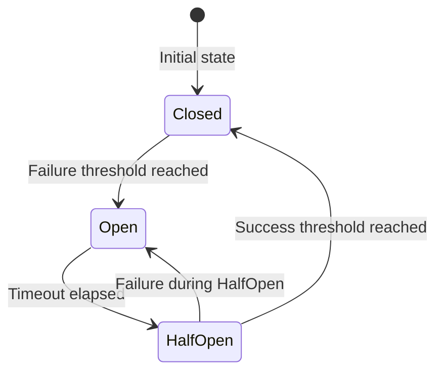
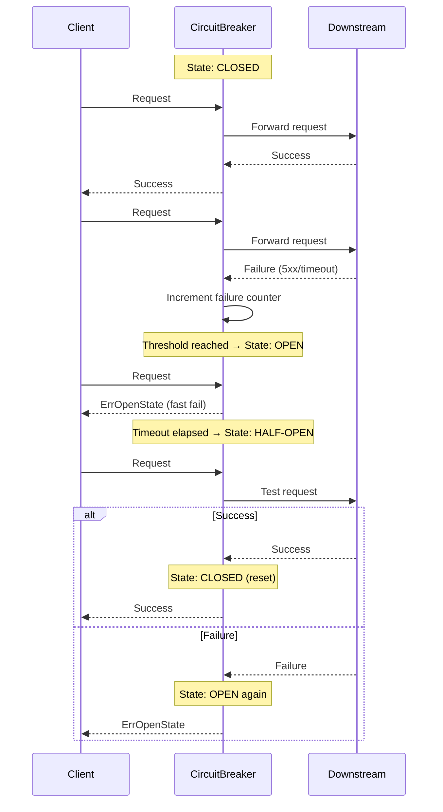

# Module 23: pkg/circuitbreaker

## สำหรับโฟลเดอร์ `pkg/circuitbreaker/`

ไฟล์ที่เกี่ยวข้อง:
- `breaker.go` – Core interface และโครงสร้างพื้นฐานของ circuit breaker
- `gobreaker.go` – Implementation ของ gobreaker
- `options.go` – Configuration options และ builder pattern
- `middleware.go` – HTTP/gRPC middleware สำหรับ auto-instrumentation
- `metrics.go` – Prometheus metrics integration
- `config.go` – Configuration management
- `examples/main.go` – ตัวอย่างการใช้งานครบวงจร


## หลักการ (Concept)

### Circuit Breaker คืออะไร?
Circuit Breaker (ตัวตัดวงจร) เป็นรูปแบบการออกแบบ (design pattern) ที่ช่วยป้องกันระบบจากความล้มเหลวแบบลูกโซ่ (cascading failure) โดยการ "ตัดวงจร" การเรียก service ที่กำลังมีปัญหาอยู่คล้ายกับเบรกเกอร์ไฟฟ้าที่ตัดวงจรเมื่อกระแสเกินมาตรฐาน Circuit breaker ทำหน้าที่เป็น "smart switch" ที่คอยตรวจสอบสถานะของ downstream services โดยผ่านกลไก state machine ที่ประกอบไปด้วย 3 สถานะหลัก: Closed, Open และ Half-Open[reference:0]




### มีกี่แบบ? (Circuit Breaker Implementations)

| Implementation | ตัวอย่าง | ข้อดี | ข้อเสีย | เหมาะกับ |
|----------------|----------|--------|----------|----------|
| **sony/gobreaker** | `gobreaker.CircuitBreaker` | เนทีฟ Go, ไม่มี external dependencies, thread-safe, lightweight | ไม่ support distributed state | Single-instance, in-memory state |
| **hystrix-go** | `hystrix.Do()` | Netflix-grade, rich features | ถูก archived (2019), context support อ่อนแอ, ไม่ compatible กับ Go module | legacy systems (ไม่แนะนำ) |
| **go-kit/kit/circuitbreaker** | `circuitbreaker.Gobreaker()` | ใช้ร่วมกับ go-kit ecosystem ได้ง่าย | ต้องมี go-kit ใน stack | go-kit microservices |
| **fail-safe-go** | `circuitbreaker.New()` | support retry, timeout, bulkhead, rate limiter | abstraction สูง เรียนรู้นาน | complex resilience stack |
| **cep21/circuit** | `circuit.New()` | feature-complete, Hystrix-like | เอกสารไม่มาก, community เล็ก | specific use cases |
| **mercari/go-circuitbreaker** | `circuit.NewBreaker()` | ใช้ร่วมกับ Consul ได้ | เน้น distributed use cases | distributed circuit breaker |

**ข้อห้ามสำคัญ:** ห้ามใช้ hystrix-go (Netflix Hystrix) ใน Go project ใหม่ทุกกรณี เพราะ hystrix-go ถูก archived ตั้งแต่ปี 2019 ไม่รองรับ Go module และ context cancellation รวมถึงมี concurrency bugs ที่เป็นปัญหาสำหรับ high-throughput services[reference:1][reference:2][reference:3]ให้ใช้ sony/gobreaker หรือ fail-safe-go แทน

### ใช้อย่างไร / นำไปใช้กรณีไหน

**กรณีใช้งานหลัก:**
- **External API calls** – ป้องกันการเรียก API ภายนอกที่กำลังมีปัญหาจนทำให้ resource หมด
- **Database queries** – ป้องกัน runaway queries หรือ DB connection pool ที่ full
- **Message queue processing** – ป้องกันการ consume messages จาก queue ที่ downstream รับไม่ทัน
- **Microservices communication** – ป้องกัน cascading failure ใน service mesh
- **Cache layer fallback** – เมื่อ cache service ล้ม ให้ไปใช้ DB โดยตรง

**รูปแบบการใช้งานพื้นฐาน (gobreaker):**
```go
var cb *gobreaker.CircuitBreaker

func init() {
    cb = gobreaker.NewCircuitBreaker(gobreaker.Settings{
        Name: "user-service",
        MaxRequests: 5,          // half-open state: maximum 5 test requests
        Timeout: 60 * time.Second, // open state duration
        ReadyToTrip: func(counts gobreaker.Counts) bool {
            return counts.ConsecutiveFailures > 5
        },
    })
}

func callService() error {
    _, err := cb.Execute(func() (interface{}, error) {
        // actual service call
        return http.Get("https://api.example.com/data")
    })
    return err
}
```

### ประโยชน์ที่ได้รับ
- **Prevents cascading failures** – ป้องกันการล้มระบาดจาก service หนึ่งไปยัง service อื่นๆ[reference:4]
- **Fast fail** – เมื่อ circuit เปิด การเรียกจะล้มเหลวทันที ไม่ต้องรอ timeout ช่วยลด resource usage
- **Auto-recovery** – ระบบจะพยายามกู้คืนโดยอัตโนมัติผ่าน half-open state
- **Reduce latency** – ไม่ต้องรอ timeout เมื่อ service ป่วย
- **Observability** – สามารถ monitor state transitions และ failure metrics

### ข้อควรระวัง
- **Single instance only** – gobreaker เก็บ state ใน memory ของ instance นั้นๆ ถ้ามีหลาย instance แต่ละ instance จะมี state ของตัวเอง[reference:5]
- **No distributed coordination** – ถ้าต้องการ distributed circuit breaker ต้องใช้ etcd หรือ Redis-based solution
- **Configuration complexity** – การตั้งค่า threshold ผิดพลาดอาจทำให้ circuit breaker ทำงานไวเกินไปหรือช้าเกินไป
- **Need to reset on recovery** – เมื่อ service กู้คืนแล้ว circuit breaker ต้องกลับมา working state อย่างถูกต้อง

### ข้อดี
- **Easy to implement** – เพียงไม่กี่บรรทัดก็ได้ circuit breaker
- **No external dependencies** – gobreaker เป็น single file, zero dependencies
- **Thread-safe** – gobreaker.CircuitBreaker instance เป็น thread-safe สามารถ reuse ได้หลาย goroutines[reference:6]
- **Customizable failure detection** – สามารถกำหนดได้ว่าอะไรนับเป็น failure ผ่าน `IsSuccessful`
- **Event-driven** – `OnStateChange` callback สำหรับ logging/metrics

### ข้อเสีย
- **Not distributed** – ไม่สามารถ share state ระหว่าง instances ได้ (ต้องใช้ centralized store เอง)
- **No built-in fallback** – ไม่มี fallback logic ในตัว ต้อง implement เอง
- **State stored in memory** – ถ้า service restart state จะหาย
- **Not suitable for extremely high throughput** – internal locking อาจเป็น bottleneck ในบางกรณี

### ข้อห้าม
**ห้ามใช้ circuit breaker เพียงอย่างเดียวโดยไม่มีการตั้งค่า timeout และ retry mechanism ที่เหมาะสม** เพราะ circuit breaker ต้องทำงานร่วมกับ timeout (ป้องกัน request ค้าง) และ retry (สำหรับ transient errors) อย่างน้อยต้องมี context timeout ก่อนเข้า circuit breaker[reference:7]

**ห้ามใช้ distributed circuit breaker (เช่น mercari/go-circuitbreaker) โดยไม่จำเป็น** เพราะ distributed coordination มี complexity และ overhead สูงกว่ามาก

**ห้ามใช้ circuit breaker เดียวกันสำหรับหลาย downstream services** เพราะแต่ละ service มี failure pattern และ SLA ต่างกัน ควรแยก breaker ตาม service หรือ endpoint[reference:8]


## การออกแบบ Workflow และ Dataflow

### การทำงานของ Circuit Breaker



### Dataflow ใน Go application:
1. Client สร้าง `*gobreaker.CircuitBreaker` instance พร้อม `Settings`
2. ใช้ `cb.Execute()` เพื่อ wrap service call
3. Circuit breaker ตรวจสอบ state ปัจจุบัน:
   - **Closed**: forward request, update counters
   - **Open**: reject request instantly, return `gobreaker.ErrOpenState`
   - **Half-Open**: allow limited requests (`MaxRequests`) to test recovery
4. เมื่อ state เปลี่ยน, `OnStateChange` callback จะถูกเรียก
5. เมื่อ circuit เปิด ควร implement fallback logic หรือ return cached data


## ตัวอย่างโค้ดที่รันได้จริง

### โครงสร้างโปรเจกต์
```
pkg/circuitbreaker/
├── breaker.go          # Core interface and utilities
├── gobreaker.go        # gobreaker implementation
├── options.go          # Configuration builder
├── middleware.go       # HTTP/gRPC middleware
├── metrics.go          # Prometheus integration
├── config.go
└── examples/main.go
```

### 1. การติดตั้ง Dependencies

```bash
# Core circuit breaker
go get github.com/sony/gobreaker/v2

# For metrics
go get github.com/prometheus/client_golang/prometheus

# Optional: for advanced patterns
go get github.com/failsafe-go/failsafe-go
```

### 2. การติดตั้ง Circuit Breaker (go get)

```bash
go get github.com/sony/gobreaker/v2
```

### 3. ตัวอย่างโค้ด: Core Interface และ Configuration

```go
// config.go
package circuitbreaker

import "time"

type Config struct {
    Name            string
    MaxRequests     uint32        // half-open maximum test requests
    Interval        time.Duration // closed state counter reset interval
    Timeout         time.Duration // open state duration before half-open
    FailureThreshold uint32        // consecutive failures to trip
    FailureRatio    float64       // failure ratio threshold (0.0-1.0)
    MinRequests     uint32        // minimum requests before evaluating ratio
}

func DefaultConfig(name string) Config {
    return Config{
        Name:             name,
        MaxRequests:      5,
        Interval:         60 * time.Second,
        Timeout:          60 * time.Second,
        FailureThreshold: 5,
        FailureRatio:     0.5,
        MinRequests:      10,
    }
}
```

```go
// breaker.go
package circuitbreaker

import (
    "context"
    "errors"
)

var (
    ErrOpenState      = errors.New("circuit breaker is open")
    ErrTooManyRequests = errors.New("too many requests (half-open state)")
)

// CircuitBreaker defines the interface for circuit breaker implementations
type CircuitBreaker interface {
    // Execute runs the given function if the circuit is closed or half-open.
    Execute(ctx context.Context, fn func() error) error

    // ExecuteWithFallback runs the function with fallback when circuit is open.
    ExecuteWithFallback(ctx context.Context, fn func() error, fallback func(error) error) error

    // State returns the current circuit breaker state.
    State() State

    // Name returns the circuit breaker name.
    Name() string

    // Metrics returns current counts for monitoring.
    Metrics() Counts
}

// State represents the circuit breaker state.
type State int

const (
    StateClosed State = iota
    StateOpen
    StateHalfOpen
)

func (s State) String() string {
    switch s {
    case StateClosed:
        return "closed"
    case StateOpen:
        return "open"
    case StateHalfOpen:
        return "half-open"
    default:
        return "unknown"
    }
}

// Counts holds request statistics.
type Counts struct {
    Requests             uint32
    TotalSuccesses       uint32
    TotalFailures        uint32
    ConsecutiveSuccesses uint32
    ConsecutiveFailures  uint32
}
```

### 4. ตัวอย่างโค้ด: gobreaker Implementation

```go
// gobreaker.go
package circuitbreaker

import (
    "context"
    "sync"

    "github.com/sony/gobreaker/v2"
)

type Gobreaker struct {
    cb   *gobreaker.CircuitBreaker[any]
    name string
    mu   sync.RWMutex
}

func NewGobreaker(cfg Config) *Gobreaker {
    settings := gobreaker.Settings{
        Name:        cfg.Name,
        MaxRequests: cfg.MaxRequests,
        Interval:    cfg.Interval,
        Timeout:     cfg.Timeout,
        ReadyToTrip: func(counts gobreaker.Counts) bool {
            // Use both consecutive failures and failure ratio
            if cfg.FailureThreshold > 0 && counts.ConsecutiveFailures >= cfg.FailureThreshold {
                return true
            }
            if cfg.FailureRatio > 0 && counts.Requests >= cfg.MinRequests {
                failureRatio := float64(counts.TotalFailures) / float64(counts.Requests)
                return failureRatio >= cfg.FailureRatio
            }
            return false
        },
        IsSuccessful: func(err error) bool {
            // Count nil error as success, everything else as failure
            return err == nil
        },
        OnStateChange: func(name string, from gobreaker.State, to gobreaker.State) {
            // Log state changes or emit metrics
        },
    }

    return &Gobreaker{
        cb:   gobreaker.NewCircuitBreaker[any](settings),
        name: cfg.Name,
    }
}

func (g *Gobreaker) Execute(ctx context.Context, fn func() error) error {
    _, err := g.cb.Execute(func() (any, error) {
        err := fn()
        return nil, err
    })
    return err
}

func (g *Gobreaker) ExecuteWithFallback(ctx context.Context, fn func() error, fallback func(error) error) error {
    result, err := g.cb.Execute(func() (any, error) {
        err := fn()
        return nil, err
    })
    if err != nil && fallback != nil {
        return fallback(err)
    }
    if err != nil {
        return err
    }
    _ = result
    return nil
}

func (g *Gobreaker) State() State {
    state := g.cb.State()
    switch state {
    case gobreaker.StateClosed:
        return StateClosed
    case gobreaker.StateOpen:
        return StateOpen
    case gobreaker.StateHalfOpen:
        return StateHalfOpen
    default:
        return StateClosed
    }
}

func (g *Gobreaker) Name() string {
    return g.name
}

func (g *Gobreaker) Metrics() Counts {
    counts := g.cb.Counts()
    return Counts{
        Requests:             counts.Requests,
        TotalSuccesses:       counts.TotalSuccesses,
        TotalFailures:        counts.TotalFailures,
        ConsecutiveSuccesses: counts.ConsecutiveSuccesses,
        ConsecutiveFailures:  counts.ConsecutiveFailures,
    }
}
```

### 5. ตัวอย่างโค้ด: HTTP Middleware

```go
// middleware.go
package circuitbreaker

import (
    "net/http"
    "strings"
)

// HTTPMiddleware wraps an HTTP handler with circuit breaker protection.
func HTTPMiddleware(breaker CircuitBreaker, next http.Handler) http.Handler {
    return http.HandlerFunc(func(w http.ResponseWriter, r *http.Request) {
        err := breaker.Execute(r.Context(), func() error {
            // Create a response recorder to capture status code
            rec := &statusRecorder{ResponseWriter: w, statusCode: http.StatusOK}
            next.ServeHTTP(rec, r)

            // Treat 5xx and 429 as failures
            if rec.statusCode >= 500 || rec.statusCode == http.StatusTooManyRequests {
                return &httpError{statusCode: rec.statusCode}
            }
            return nil
        })

        if err != nil {
            if strings.Contains(err.Error(), "circuit breaker is open") {
                http.Error(w, "Service temporarily unavailable", http.StatusServiceUnavailable)
            } else if httpErr, ok := err.(*httpError); ok {
                // Status code already written by recorder
                return
            } else {
                http.Error(w, "Internal server error", http.StatusInternalServerError)
            }
        }
    })
}

type statusRecorder struct {
    http.ResponseWriter
    statusCode int
}

func (r *statusRecorder) WriteHeader(code int) {
    r.statusCode = code
    r.ResponseWriter.WriteHeader(code)
}

type httpError struct{ statusCode int }

func (e *httpError) Error() string { return http.StatusText(e.statusCode) }
```

### 6. ตัวอย่างโค้ด: Prometheus Metrics

```go
// metrics.go
package circuitbreaker

import (
    "sync"

    "github.com/prometheus/client_golang/prometheus"
)

type MetricsCollector struct {
    mu sync.RWMutex
    // Breaker state gauge
    stateGauge *prometheus.GaugeVec
    // Request counters
    requestsTotal *prometheus.CounterVec
    // Metrics per breaker
    countsGauge *prometheus.GaugeVec
}

func NewMetricsCollector(reg prometheus.Registerer) *MetricsCollector {
    m := &MetricsCollector{
        stateGauge: prometheus.NewGaugeVec(
            prometheus.GaugeOpts{
                Name: "circuit_breaker_state",
                Help: "Circuit breaker state (0=closed, 1=open, 2=half-open)",
            },
            []string{"breaker"},
        ),
        requestsTotal: prometheus.NewCounterVec(
            prometheus.CounterOpts{
                Name: "circuit_breaker_requests_total",
                Help: "Total requests processed by circuit breaker",
            },
            []string{"breaker", "result"},
        ),
        countsGauge: prometheus.NewGaugeVec(
            prometheus.GaugeOpts{
                Name: "circuit_breaker_counts",
                Help: "Circuit breaker counts (requests, successes, failures, consecutive)",
            },
            []string{"breaker", "type"},
        ),
    }

    reg.MustRegister(m.stateGauge, m.requestsTotal, m.countsGauge)
    return m
}

func (m *MetricsCollector) RecordState(breakerName string, state State) {
    var stateVal float64
    switch state {
    case StateClosed:
        stateVal = 0
    case StateOpen:
        stateVal = 1
    case StateHalfOpen:
        stateVal = 2
    }
    m.stateGauge.WithLabelValues(breakerName).Set(stateVal)
}

func (m *MetricsCollector) RecordResult(breakerName string, err error) {
    result := "success"
    if err != nil {
        if err.Error() == "circuit breaker is open" {
            result = "rejected"
        } else {
            result = "failure"
        }
    }
    m.requestsTotal.WithLabelValues(breakerName, result).Inc()
}

func (m *MetricsCollector) UpdateCounts(breakerName string, counts Counts) {
    m.countsGauge.WithLabelValues(breakerName, "requests").Set(float64(counts.Requests))
    m.countsGauge.WithLabelValues(breakerName, "successes").Set(float64(counts.TotalSuccesses))
    m.countsGauge.WithLabelValues(breakerName, "failures").Set(float64(counts.TotalFailures))
    m.countsGauge.WithLabelValues(breakerName, "consecutive_successes").Set(float64(counts.ConsecutiveSuccesses))
    m.countsGauge.WithLabelValues(breakerName, "consecutive_failures").Set(float64(counts.ConsecutiveFailures))
}
```

### 7. ตัวอย่างการใช้งานรวมใน HTTP server

```go
// main.go
package main

import (
    "context"
    "log"
    "net/http"
    "time"

    "yourproject/pkg/circuitbreaker"
)

func main() {
    cfg := circuitbreaker.DefaultConfig("user-service-api")
    cfg.FailureThreshold = 5
    cfg.Timeout = 30 * time.Second

    breaker := circuitbreaker.NewGobreaker(cfg)

    // Create HTTP client with circuit breaker
    client := &http.Client{Timeout: 5 * time.Second}

    http.HandleFunc("/api/users", func(w http.ResponseWriter, r *http.Request) {
        userID := r.URL.Query().Get("id")
        if userID == "" {
            http.Error(w, "missing user id", http.StatusBadRequest)
            return
        }

        var result []byte
        err := breaker.Execute(r.Context(), func() error {
            resp, err := client.Get("https://user-service.internal/users/" + userID)
            if err != nil {
                return err
            }
            defer resp.Body.Close()

            if resp.StatusCode >= 500 {
                return &statusError{code: resp.StatusCode}
            }

            // read body
            return nil
        })

        if err != nil {
            log.Printf("request failed: %v", err)
            http.Error(w, "service unavailable", http.StatusServiceUnavailable)
            return
        }

        w.Write(result)
    })

    log.Println("server starting on :8080")
    log.Fatal(http.ListenAndServe(":8080", nil))
}

type statusError struct{ code int }

func (e *statusError) Error() string { return http.StatusText(e.code) }
```


## วิธีใช้งาน module นี้

1. ติดตั้ง gobreaker: `go get github.com/sony/gobreaker/v2`
2. กำหนด configuration ตาม service แต่ละตัว (แยก breaker ตาม service)
3. Wrap external calls ด้วย `breaker.Execute()` หรือ `ExecuteWithFallback()`
4. ใช้ HTTP middleware ที่ให้มาเพื่อ auto-instrument HTTP handlers
5. ส่งออก metrics ไปยัง Prometheus เพื่อ monitoring


## การติดตั้ง

```bash
go get github.com/sony/gobreaker/v2
go get github.com/prometheus/client_golang/prometheus
```


## การตั้งค่า configuration

```go
cfg := circuitbreaker.Config{
    Name:             "payment-service",
    MaxRequests:      3,
    Interval:         30 * time.Second,
    Timeout:          60 * time.Second,
    FailureThreshold: 5,
    FailureRatio:     0.6,
    MinRequests:      10,
}
```

Environment variables:
```bash
CB_PAYMENT_MAX_REQUESTS=3
CB_PAYMENT_TIMEOUT=60s
CB_PAYMENT_FAILURE_THRESHOLD=5
```


## การรวมกับ GORM

สามารถ wrap database calls ภายใน circuit breaker:

```go
func (r *UserRepository) GetUser(ctx context.Context, id string) (*User, error) {
    var user User
    err := r.breaker.Execute(ctx, func() error {
        // GORM call with context
        return r.db.WithContext(ctx).First(&user, "id = ?", id).Error
    })
    if err != nil {
        return nil, err
    }
    return &user, nil
}
```


## การใช้งานจริง

### Example 1: Basic HTTP Client with Circuit Breaker

```go
func callExternalAPI(breaker circuitbreaker.CircuitBreaker, url string) error {
    return breaker.Execute(context.Background(), func() error {
        resp, err := http.Get(url)
        if err != nil {
            return err
        }
        defer resp.Body.Close()
        if resp.StatusCode >= 500 {
            return fmt.Errorf("server error: %d", resp.StatusCode)
        }
        return nil
    })
}
```

### Example 2: Fallback to Cached Data

```go
func getProduct(ctx context.Context, id string, breaker circuitbreaker.CircuitBreaker) (*Product, error) {
    var product Product
    err := breaker.ExecuteWithFallback(ctx, func() error {
        // try to fetch from API
        return fetchFromAPI(id, &product)
    }, func(err error) error {
        // fallback to cache when circuit is open
        return getFromCache(id, &product)
    })
    return &product, err
}
```


## ตารางสรุป Circuit Breaker Components

| Component | คำอธิบาย | ตัวอย่าง |
|-----------|----------|----------|
| **State (Closed/Open/Half-Open)** | สถานะของ circuit breaker | `StateClosed = 0` |
| **ReadyToTrip** | ฟังก์ชันที่กำหนดว่าเมื่อไหร่ควรเปิดวงจร | `counts.ConsecutiveFailures > 5` |
| **MaxRequests** | จำนวน request ที่อนุญาตใน Half-Open state | 5 |
| **Timeout** | ระยะเวลาที่ circuit อยู่ใน Open state ก่อนเข้าสู่ Half-Open | 60s |
| **Interval** | ระยะเวลา reset counter ใน Closed state | 60s |
| **OnStateChange** | Callback เมื่อ state เปลี่ยน | logging, metrics |
| **IsSuccessful** | ฟังก์ชันกำหนด success/failure | `err == nil` |
| **Counts** | สถิติ request, success, failure | `Requests, TotalFailures` |


## แบบฝึกหัดท้าย module (5 ข้อ)

### ข้อ 1: การ Implement Circuit Breaker Wrapper สำหรับ HTTP Client
จงเขียน `NewCircuitBreakerHTTPClient` ที่รับ `*http.Client` และ `circuitbreaker.CircuitBreaker` และ return `*http.Client` ใหม่ที่ทุก request จะถูก protected ด้วย circuit breaker

### ข้อ 2: การ Configure ReadyToTrip สำหรับ Business Logic
จาก HTTP API ที่ return status code 429 (rate limit) ควรถูกนับเป็น failure หรือไม่? จงเขียน `ReadyToTrip` function ที่กำหนดให้:
- 5xx = failure (count toward trip)
- 429 = failure but not count toward trip (still try later)
- timeout = failure

### ข้อ 3: การ Implement Distributed Circuit Breaker
ใช้ Redis + Lua script สร้าง distributed circuit breaker ที่สามารถ share state ระหว่างหลาย instances

### ข้อ 4: การ Combine Circuit Breaker + Retry + Timeout
เขียน middleware ที่รวม circuit breaker, retry (max 3 retries with exponential backoff), และ timeout (5 seconds) เข้าด้วยกัน โดย order: timeout → circuit breaker → retry

### ข้อ 5: การ Implement Metrics Dashboard
ใช้ Prometheus และ Grafana สร้าง dashboard ที่แสดง:
- circuit breaker state (Closed/Open/Half-Open) ต่อ service
- request success/failure/rejected rate
- จำนวนครั้งที่ circuit เปิด (state change events)
- ระยะเวลาเฉลี่ยที่ circuit อยู่ใน Open state


## แหล่งอ้างอิง

- [sony/gobreaker – GitHub](https://github.com/sony/gobreaker)
- [sony/gobreaker – GoDoc](https://pkg.go.dev/github.com/sony/gobreaker)
- [Microsoft Circuit Breaker Pattern](https://learn.microsoft.com/en-us/azure/architecture/patterns/circuit-breaker)
- [Martin Fowler: Circuit Breaker](https://martinfowler.com/bliki/CircuitBreaker.html)
- [Fail-safe-go Resilience Policies](https://failsafe-go.dev/circuit-breaker)

---

**หมายเหตุ:** module นี้ครบถ้วนสำหรับ `pkg/circuitbreaker` สำหรับระบบ gobackend หากต้องการ module เพิ่มเติม (เช่น `pkg/retry`, `pkg/bulkhead`) โปรดแจ้ง