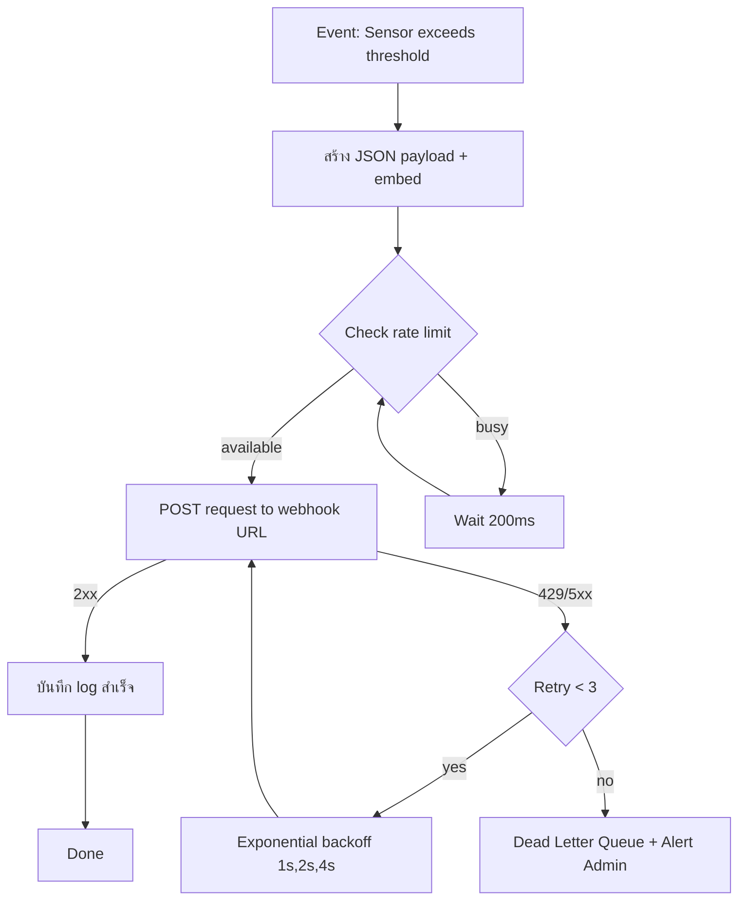
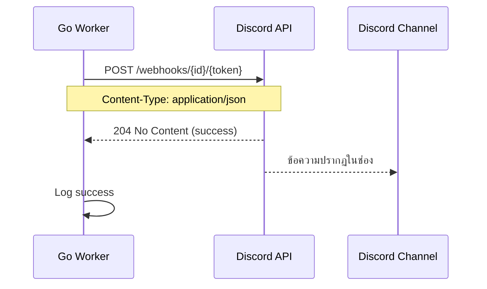

# Module 26: pkg/discord (Discord Webhook Notification)

## สำหรับโฟลเดอร์ `internal/pkg/discord/` และ `internal/repository/`

ไฟล์ที่เกี่ยวข้อง:
- `internal/pkg/discord/client.go`
- `internal/pkg/discord/sender.go`
- `internal/pkg/discord/embed_builder.go`
- `internal/pkg/discord/worker.go`
- `internal/pkg/discord/rate_limiter.go`
- `internal/repository/discord_log.go`
- `migrations/discord_logs.sql`

---

## หลักการ (Concept)

### Discord Webhook Notification คืออะไร?

Discord Webhook เป็นวิธีที่ง่ายที่สุดในการส่งข้อความอัตโนมัติจากระบบภายนอกเข้าไปยังช่อง (channel) ใน Discord โดยไม่ต้องสร้างบอทที่ซับซ้อน ใช้ HTTP POST request ส่ง JSON payload ไปยัง URL ที่สร้างจาก Discord server webhook endpoint รองรับทั้งข้อความธรรมดา, rich embeds (การ์ด), ปุ่ม (buttons), และ select menus ผ่าน webhook interactions เหมาะสำหรับการแจ้งเตือนระบบ, รายงานประจำวัน, และการแจ้งเตือนแบบ real-time จาก CMON IoT.

### มีกี่แบบ? (Discord Notification Methods)

| Method | ลักษณะ | ข้อดี | ข้อเสีย | เหมาะกับ |
|--------|--------|------|---------|----------|
| **Webhook (Incoming)** | ส่งข้อความไปยังช่องโดยใช้ URL | ง่ายมาก, ไม่ต้องจัดการบอท, ไม่ต้องเก็บ token (URL เป็นความลับ) | ไม่สามารถตอบกลับแบบสองทาง, rate limit จำกัด (5 request/second) | การแจ้งเตือนทางเดียว, รายงาน, alert |
| **Bot with REST API** | ใช้ Bot Token ส่งข้อความไปยังช่อง | รองรับ interactions (ปุ่ม, dropdown), อ่านข้อความในช่องได้ | ต้องสร้าง bot, จัดการ permissions, token ต้องรักษาความปลอดภัยสูง | ระบบที่มี interaction (ยืนยันการสั่งงาน) |
| **Webhook with Interactions** | Webhook + ปุ่ม (ต้องมี public endpoint) | ใช้ปุ่มในข้อความ webhook ได้ | ซับซ้อน, ต้องมี server ตอบรับ interaction | ระบบที่ต้องการให้ user กดปุ่มตอบกลับ |

**ข้อห้ามสำคัญ:** ห้ามใช้ Bucket Pattern ร่วมกับ Time Series Collections เพราะจะลดประสิทธิภาพ — แต่สำหรับ Discord module นี้ไม่เกี่ยวข้อง

### ใช้อย่างไร / นำไปใช้กรณีไหน

1. **Alert แบบ Real-time** – แจ้งเตือนไปยังช่อง Discord เมื่ออุณหภูมิเกิน 35°C, ตรวจพบน้ำรั่ว หรือควันไฟ
2. **Scheduled Reports** – ส่งสรุปสถานะ Data Center รายวัน/สัปดาห์แบบ rich embed
3. **System Monitoring** – แจ้งเตือนเมื่อ service มีปัญหา (DB down, disk full)
4. **Incident Response** – แจ้งเตือนทีมงานพร้อม embed แสดงข้อมูลอุปกรณ์ที่ผิดปกติ
5. **Deployment Notifications** – แจ้งเมื่อมีการ deploy ใหม่ (GitHub Actions + Discord webhook)

### ประโยชน์ที่ได้รับ

- **ง่ายมาก** – สร้าง webhook URL ได้ภายใน 1 นาทีใน Discord UI
- **Rich embeds** – สร้างการ์ดข้อมูลสวยงามพร้อมสี รูปภาพ และฟิลด์
- **Rate limit ชัดเจน** – 5 requests/second ต่อ webhook (สามารถ retry ได้)
- **ไม่ต้องจัดการ authentication** – URL เป็นความลับ (เหมือน API key)
- **รองรับการจัดรูปแบบ Markdown** – ตัวหนา, เอียง, ลิงก์, code blocks
- **Supports mentions** – @everyone, @here, หรือ mention specific roles
- **Free** – ไม่มีค่าใช้จ่าย

### ข้อควรระวัง

- **Webhook URL ต้องเป็นความลับ** – ถ้ารั่วไหลจะมีคน spam ช่องได้
- **Rate limit** – 5 requests/วินาที ต่อ webhook, ถ้าเกินจะได้ 429
- **Retry mechanism** – ควรทำ retry ด้วย exponential backoff
- **ขนาด payload** – จำกัด 2000 อักขระสำหรับข้อความ, embed รวมกันไม่เกิน 6000 อักขระ
- **No native reply** – Webhook ไม่สามารถรับข้อความตอบกลับได้ (ต้องใช้ bot)
- **Embed fields limit** – สูงสุด 25 fields ต่อ embed
- **File upload** – Webhook รองรับการอัปโหลดไฟล์ได้ แต่มีขนาดจำกัด (8MB)

### ข้อดี
- ตั้งค่าง่ายมาก, rich embed, rate limit ชัดเจน, ฟรี, รองรับ mentions

### ข้อเสีย
- ไม่รองรับ two‑way communication (เว้นแต่ใช้ interactions), URL ต้องรักษาความลับ, rate limit ต่ำ

### ข้อห้าม
- ห้าม expose webhook URL ใน client‑side code หรือ repository
- ห้ามส่งข้อความซ้ำเกิน rate limit โดยไม่มีการหน่วงเวลา
- ห้ามใช้ webhook สำหรับระบบที่ต้องการการตอบกลับแบบโต้ตอบ (ควรใช้ bot)
- ห้ามส่งข้อมูลอ่อนไหวใน plain text (ถึงแม้ URL จะเป็น HTTPS ก็ตาม)


## การออกแบบ Workflow และ Dataflow

### Workflow: การส่งข้อความผ่าน Discord Webhook



**รูปที่ 41:** ขั้นตอนการส่งข้อความ Discord ผ่าน webhook เมื่อเซนเซอร์เกิน threshold

### Dataflow: Discord Webhook Request/Response



**รูปที่ 42:** Sequence diagram แสดงการส่ง payload ไปยัง Discord webhook endpoint


## ตัวอย่างโค้ดที่รันได้จริง

### 1. Discord Client – `client.go`

```go
// Package discord provides Discord webhook notification capabilities.
// ----------------------------------------------------------------
// แพ็คเกจ discord ให้บริการการแจ้งเตือนทาง Discord webhook
package discord

import (
	"bytes"
	"context"
	"encoding/json"
	"fmt"
	"net/http"
	"time"
)

// WebhookConfig holds Discord webhook configuration.
// ----------------------------------------------------------------
// WebhookConfig เก็บค่ากำหนด webhook Discord
type WebhookConfig struct {
	ID    string // webhook ID
	Token string // webhook token
	URL   string // full webhook URL (if ID+Token not provided)
}

// Client handles Discord webhook HTTP requests.
// ----------------------------------------------------------------
// Client จัดการ HTTP requests ไปยัง Discord webhook
type Client struct {
	webhookURL string
	httpClient *http.Client
}

// NewClient creates a new Discord client from webhook URL.
// ----------------------------------------------------------------
// NewClient สร้าง Discord client ใหม่จาก webhook URL
func NewClient(webhookURL string) *Client {
	return &Client{
		webhookURL: webhookURL,
		httpClient: &http.Client{Timeout: 10 * time.Second},
	}
}

// NewClientFromID creates a new Discord client from ID and token.
// ----------------------------------------------------------------
// NewClientFromID สร้าง Discord client ใหม่จาก ID และ token
func NewClientFromID(id, token string) *Client {
	webhookURL := fmt.Sprintf("https://discord.com/api/webhooks/%s/%s", id, token)
	return NewClient(webhookURL)
}

// Post sends a payload to Discord webhook.
// ----------------------------------------------------------------
// Post ส่ง payload ไปยัง Discord webhook
func (c *Client) Post(ctx context.Context, payload *WebhookPayload) (*http.Response, error) {
	jsonData, err := json.Marshal(payload)
	if err != nil {
		return nil, fmt.Errorf("marshal payload: %w", err)
	}

	req, err := http.NewRequestWithContext(ctx, "POST", c.webhookURL, bytes.NewBuffer(jsonData))
	if err != nil {
		return nil, err
	}
	req.Header.Set("Content-Type", "application/json")

	return c.httpClient.Do(req)
}
```

### 2. Sender & Payload Structures – `sender.go`

```go
package discord

import (
	"context"
	"fmt"
	"log"
)

// WebhookPayload represents the JSON payload sent to Discord.
// ----------------------------------------------------------------
// WebhookPayload แทน JSON payload ที่ส่งไปยัง Discord
type WebhookPayload struct {
	Content   string   `json:"content,omitempty"`   // message text
	Username  string   `json:"username,omitempty"`  // override bot name
	AvatarURL string   `json:"avatar_url,omitempty"` // override avatar
	Embeds    []Embed  `json:"embeds,omitempty"`    // rich embeds
	AllowedMentions *AllowedMentions `json:"allowed_mentions,omitempty"`
}

// AllowedMentions controls mention behavior.
// ----------------------------------------------------------------
// AllowedMentions ควบคุมการ mention
type AllowedMentions struct {
	Parse []string `json:"parse,omitempty"` // "users", "roles", "everyone"
}

// Embed represents a Discord rich embed.
// ----------------------------------------------------------------
// Embed แทน rich embed ของ Discord
type Embed struct {
	Title       string          `json:"title,omitempty"`
	Description string          `json:"description,omitempty"`
	URL         string          `json:"url,omitempty"`
	Color       int             `json:"color,omitempty"` // decimal color
	Timestamp   string          `json:"timestamp,omitempty"` // ISO8601
	Footer      *EmbedFooter    `json:"footer,omitempty"`
	Image       *EmbedImage     `json:"image,omitempty"`
	Thumbnail   *EmbedThumbnail `json:"thumbnail,omitempty"`
	Author      *EmbedAuthor    `json:"author,omitempty"`
	Fields      []EmbedField    `json:"fields,omitempty"`
}

// EmbedFooter represents embed footer.
// ----------------------------------------------------------------
// EmbedFooter แทน footer ของ embed
type EmbedFooter struct {
	Text    string `json:"text"`
	IconURL string `json:"icon_url,omitempty"`
}

// EmbedImage represents embed image.
// ----------------------------------------------------------------
// EmbedImage แทนรูปภาพของ embed
type EmbedImage struct {
	URL string `json:"url"`
}

// EmbedThumbnail represents embed thumbnail.
// ----------------------------------------------------------------
// EmbedThumbnail แทนรูปขนาดย่อของ embed
type EmbedThumbnail struct {
	URL string `json:"url"`
}

// EmbedAuthor represents embed author.
// ----------------------------------------------------------------
// EmbedAuthor แทนผู้เขียนของ embed
type EmbedAuthor struct {
	Name    string `json:"name"`
	URL     string `json:"url,omitempty"`
	IconURL string `json:"icon_url,omitempty"`
}

// EmbedField represents a field in embed.
// ----------------------------------------------------------------
// EmbedField แทนฟิลด์ใน embed
type EmbedField struct {
	Name   string `json:"name"`
	Value  string `json:"value"`
	Inline bool   `json:"inline,omitempty"`
}

// Sender defines interface for sending Discord messages.
// ----------------------------------------------------------------
// Sender กำหนด interface สำหรับส่งข้อความ Discord
type Sender interface {
	Send(ctx context.Context, payload *WebhookPayload) error
}

// WebhookSender implements Sender using Discord webhook.
// ----------------------------------------------------------------
// WebhookSender อิมพลีเมนต์ Sender ด้วย Discord webhook
type WebhookSender struct {
	client *Client
}

// NewWebhookSender creates a new webhook sender.
// ----------------------------------------------------------------
// NewWebhookSender สร้าง webhook sender ใหม่
func NewWebhookSender(webhookURL string) *WebhookSender {
	return &WebhookSender{
		client: NewClient(webhookURL),
	}
}

// Send sends the payload to Discord.
// ----------------------------------------------------------------
// Send ส่ง payload ไปยัง Discord
func (s *WebhookSender) Send(ctx context.Context, payload *WebhookPayload) error {
	resp, err := s.client.Post(ctx, payload)
	if err != nil {
		return err
	}
	defer resp.Body.Close()

	if resp.StatusCode >= 200 && resp.StatusCode < 300 {
		return nil
	}
	return fmt.Errorf("discord returned status %d", resp.StatusCode)
}
```

### 3. Embed Builder – `embed_builder.go`

```go
package discord

import (
	"time"
)

// EmbedBuilder helps construct Discord embeds.
// ----------------------------------------------------------------
// EmbedBuilder ช่วยสร้าง embed ของ Discord
type EmbedBuilder struct {
	embed Embed
}

// NewEmbedBuilder creates a new embed builder.
// ----------------------------------------------------------------
// NewEmbedBuilder สร้าง embed builder ใหม่
func NewEmbedBuilder() *EmbedBuilder {
	return &EmbedBuilder{
		embed: Embed{},
	}
}

// SetTitle sets the embed title.
// ----------------------------------------------------------------
// SetTitle กำหนดชื่อของ embed
func (b *EmbedBuilder) SetTitle(title string) *EmbedBuilder {
	b.embed.Title = title
	return b
}

// SetDescription sets the embed description.
// ----------------------------------------------------------------
// SetDescription กำหนดคำอธิบายของ embed
func (b *EmbedBuilder) SetDescription(desc string) *EmbedBuilder {
	b.embed.Description = desc
	return b
}

// SetColor sets the embed color (decimal). Use Color constants.
// ----------------------------------------------------------------
// SetColor กำหนดสีของ embed (เลขฐานสิบ) ใช้ Color constants
func (b *EmbedBuilder) SetColor(color int) *EmbedBuilder {
	b.embed.Color = color
	return b
}

// SetTimestamp sets the embed timestamp to now.
// ----------------------------------------------------------------
// SetTimestamp กำหนด timestamp ของ embed เป็นเวลาปัจจุบัน
func (b *EmbedBuilder) SetTimestamp() *EmbedBuilder {
	b.embed.Timestamp = time.Now().Format(time.RFC3339)
	return b
}

// SetFooter sets the embed footer.
// ----------------------------------------------------------------
// SetFooter กำหนด footer ของ embed
func (b *EmbedBuilder) SetFooter(text, iconURL string) *EmbedBuilder {
	b.embed.Footer = &EmbedFooter{
		Text:    text,
		IconURL: iconURL,
	}
	return b
}

// SetThumbnail sets the embed thumbnail URL.
// ----------------------------------------------------------------
// SetThumbnail กำหนด URL รูปขนาดย่อของ embed
func (b *EmbedBuilder) SetThumbnail(url string) *EmbedBuilder {
	b.embed.Thumbnail = &EmbedThumbnail{URL: url}
	return b
}

// SetImage sets the embed image URL.
// ----------------------------------------------------------------
// SetImage กำหนด URL รูปภาพหลักของ embed
func (b *EmbedBuilder) SetImage(url string) *EmbedBuilder {
	b.embed.Image = &EmbedImage{URL: url}
	return b
}

// AddField adds a field to the embed.
// ----------------------------------------------------------------
// AddField เพิ่มฟิลด์ใน embed
func (b *EmbedBuilder) AddField(name, value string, inline bool) *EmbedBuilder {
	b.embed.Fields = append(b.embed.Fields, EmbedField{
		Name:   name,
		Value:  value,
		Inline: inline,
	})
	return b
}

// Build returns the constructed Embed.
// ----------------------------------------------------------------
// Build คืน Embed ที่สร้างขึ้น
func (b *EmbedBuilder) Build() Embed {
	return b.embed
}

// Color constants for Discord embeds.
// ----------------------------------------------------------------
// ค่าคงที่สีสำหรับ Discord embed
const (
	ColorDefault   = 0
	ColorSuccess   = 0x00FF00 // green
	ColorWarning   = 0xFFA500 // orange
	ColorError     = 0xFF0000 // red
	ColorInfo      = 0x00AAFF // blue
	ColorCMONGreen = 0x2ECC71 // CMON brand green
)
```

### 4. Discord Worker with Retry & Queue – `worker.go`

```go
package discord

import (
	"context"
	"log"
	"sync"
	"time"
)

// DiscordJob represents a queued Discord message task.
// ----------------------------------------------------------------
// DiscordJob แทนงาน Discord message ที่อยู่ในคิว
type DiscordJob struct {
	ID         string
	Payload    *WebhookPayload
	RetryCount int
	NextRetry  time.Time
}

// DiscordWorker handles background Discord messaging with retries.
// ----------------------------------------------------------------
// DiscordWorker จัดการการส่งข้อความ Discord ในพื้นหลังพร้อม retry
type DiscordWorker struct {
	sender     Sender
	queue      chan *DiscordJob
	retryQueue chan *DiscordJob
	wg         sync.WaitGroup
	stopCh     chan struct{}
}

// NewDiscordWorker creates a new Discord worker.
// ----------------------------------------------------------------
// NewDiscordWorker สร้าง Discord worker ใหม่
func NewDiscordWorker(sender Sender, queueSize int) *DiscordWorker {
	return &DiscordWorker{
		sender:     sender,
		queue:      make(chan *DiscordJob, queueSize),
		retryQueue: make(chan *DiscordJob, queueSize),
		stopCh:     make(chan struct{}),
	}
}

// Start begins the worker goroutines.
// ----------------------------------------------------------------
// Start เริ่ม worker goroutines
func (w *DiscordWorker) Start(ctx context.Context, numWorkers int) {
	for i := 0; i < numWorkers; i++ {
		w.wg.Add(1)
		go w.worker(ctx)
	}
	go w.retryProcessor(ctx)
	log.Printf("DiscordWorker started with %d workers", numWorkers)
}

// Stop gracefully shuts down the worker.
// ----------------------------------------------------------------
// Stop ปิด worker อย่างนุ่มนวล
func (w *DiscordWorker) Stop() {
	close(w.stopCh)
	w.wg.Wait()
}

// Enqueue adds a Discord job to the queue.
// ----------------------------------------------------------------
// Enqueue เพิ่ม Discord job เข้าคิว
func (w *DiscordWorker) Enqueue(job *DiscordJob) {
	select {
	case w.queue <- job:
	default:
		log.Printf("Discord queue full, dropping job %s", job.ID)
	}
}

func (w *DiscordWorker) worker(ctx context.Context) {
	defer w.wg.Done()
	for {
		select {
		case <-ctx.Done():
			return
		case <-w.stopCh:
			return
		case job := <-w.queue:
			w.processJob(ctx, job)
		}
	}
}

func (w *DiscordWorker) processJob(ctx context.Context, job *DiscordJob) {
	err := w.sender.Send(ctx, job.Payload)
	if err != nil {
		log.Printf("Discord send failed: %v, retry=%d", err, job.RetryCount)
		if job.RetryCount < 3 {
			job.RetryCount++
			job.NextRetry = time.Now().Add(time.Duration(job.RetryCount) * time.Second)
			w.retryQueue <- job
		} else {
			log.Printf("Discord job %s failed after 3 retries", job.ID)
		}
	}
}

func (w *DiscordWorker) retryProcessor(ctx context.Context) {
	ticker := time.NewTicker(1 * time.Second)
	defer ticker.Stop()
	for {
		select {
		case <-ctx.Done():
			return
		case <-w.stopCh:
			return
		case <-ticker.C:
			w.processRetries()
		}
	}
}

func (w *DiscordWorker) processRetries() {
	for {
		select {
		case job := <-w.retryQueue:
			if time.Now().After(job.NextRetry) {
				w.queue <- job
			} else {
				go func(j *DiscordJob) {
					time.Sleep(time.Until(j.NextRetry))
					w.retryQueue <- j
				}(job)
			}
		default:
			return
		}
	}
}
```

### 5. Rate Limiter – `rate_limiter.go`

```go
package discord

import (
	"context"
	"sync"
	"time"
)

// RateLimiter implements a simple token bucket for Discord webhook.
// Discord allows 5 requests per second per webhook.
// ----------------------------------------------------------------
// RateLimiter จำกัดอัตราการเรียกใช้ Discord webhook
// Discord อนุญาต 5 requests/วินาที ต่อ webhook
type RateLimiter struct {
	tokens     int
	burst      int
	rate       float64 // tokens per second
	lastRefill time.Time
	mu         sync.Mutex
}

// NewRateLimiter creates a rate limiter for Discord webhook.
// ----------------------------------------------------------------
// NewRateLimiter สร้าง rate limiter สำหรับ Discord webhook
func NewRateLimiter(requestsPerSec, burst int) *RateLimiter {
	return &RateLimiter{
		tokens:     burst,
		burst:      burst,
		rate:       float64(requestsPerSec),
		lastRefill: time.Now(),
	}
}

// Wait blocks until a token is available.
// ----------------------------------------------------------------
// Wait บล็อกจนกว่าจะมี token พร้อม
func (r *RateLimiter) Wait(ctx context.Context) error {
	for {
		select {
		case <-ctx.Done():
			return ctx.Err()
		default:
		}
		r.mu.Lock()
		r.refill()
		if r.tokens > 0 {
			r.tokens--
			r.mu.Unlock()
			return nil
		}
		r.mu.Unlock()
		time.Sleep(100 * time.Millisecond)
	}
}

func (r *RateLimiter) refill() {
	now := time.Now()
	elapsed := now.Sub(r.lastRefill).Seconds()
	newTokens := int(elapsed * r.rate)
	if newTokens > 0 {
		r.tokens += newTokens
		if r.tokens > r.burst {
			r.tokens = r.burst
		}
		r.lastRefill = now
	}
}
```

### 6. Discord Log Model – `internal/models/discord_log.go`

```go
package models

import "time"

// DiscordLog stores Discord webhook message history.
// ----------------------------------------------------------------
// DiscordLog เก็บประวัติการส่งข้อความ Discord webhook
type DiscordLog struct {
	BaseModel
	WebhookURL  string    `gorm:"type:text"` // hashed or partial for security
	Content     string    `gorm:"type:text"`
	EmbedsCount int
	Status      string    // pending, sent, failed
	Error       string
	SentAt      time.Time
}
```

### 7. Migration SQL – `migrations/discord_logs.up.sql`

```sql
-- Create discord_logs table
-- สร้างตาราง discord_logs
CREATE TABLE IF NOT EXISTS discord_logs (
    id BIGSERIAL PRIMARY KEY,
    webhook_url TEXT NOT NULL,
    content TEXT,
    embeds_count INT DEFAULT 0,
    status VARCHAR(20) NOT NULL,
    error TEXT,
    sent_at TIMESTAMP NOT NULL,
    created_at TIMESTAMP NOT NULL DEFAULT CURRENT_TIMESTAMP,
    updated_at TIMESTAMP NOT NULL DEFAULT CURRENT_TIMESTAMP,
    deleted_at TIMESTAMP
);

CREATE INDEX idx_discord_logs_status ON discord_logs(status);
CREATE INDEX idx_discord_logs_sent_at ON discord_logs(sent_at);
```

**migrations/discord_logs.down.sql**
```sql
DROP TABLE IF EXISTS discord_logs;
```


## วิธีใช้งาน module นี้

### การติดตั้ง

```bash
# No external dependencies required (only standard library)
go get github.com/google/uuid
```

### การตั้งค่า configuration

```go
cfg := &discord.WebhookConfig{
    URL: os.Getenv("DISCORD_WEBHOOK_URL"),
}
// หรือใช้ ID+Token
// cfg := &discord.WebhookConfig{ID: "123", Token: "abc"}
```

### การรวมกับ GORM

```go
// Auto-migrate DiscordLog table
db.AutoMigrate(&models.DiscordLog{})
```

### การใช้งานจริง (ตัวอย่างใน rule engine)

```go
// สร้าง webhook sender
webhookURL := "https://discord.com/api/webhooks/123456/abcdef"
sender := discord.NewWebhookSender(webhookURL)

// สร้าง worker
worker := discord.NewDiscordWorker(sender, 1000)
worker.Start(context.Background(), 3)
defer worker.Stop()

// สร้าง embed
embed := discord.NewEmbedBuilder().
    SetTitle("🚨 High Temperature Alert").
    SetDescription("Temperature exceeded threshold in Data Center").
    SetColor(discord.ColorError).
    SetTimestamp().
    AddField("Device", "Rack A1 Sensor", true).
    AddField("Temperature", "36.5°C", true).
    AddField("Threshold", "35.0°C", false).
    Build()

payload := &discord.WebhookPayload{
    Content:  "@here **Alert**",
    Embeds:   []discord.Embed{embed},
    AllowedMentions: &discord.AllowedMentions{Parse: []string{"everyone"}},
}

job := &discord.DiscordJob{
    ID:      uuid.New().String(),
    Payload: payload,
}
worker.Enqueue(job)
```


## ตารางสรุป Components

| Component | หน้าที่ | ตัวอย่าง |
|-----------|--------|----------|
| `Client` | HTTP client สำหรับ webhook | `discord.NewClient()` |
| `WebhookSender` | ส่ง payload ไปยัง Discord | `Send()` |
| `EmbedBuilder` | สร้าง rich embed แบบ builder pattern | `SetTitle()`, `AddField()`, `Build()` |
| `DiscordWorker` | จัดการคิวและ retry อัตโนมัติ | `Enqueue()`, `Start()` |
| `RateLimiter` | จำกัดอัตรา 5 request/วินาที | `Wait()` |
| `DiscordLog` | เก็บประวัติการส่งข้อความ | `models.DiscordLog` |


## แบบฝึกหัดท้าย module (5 ข้อ)

1. เพิ่มฟังก์ชัน `SendFile` ใน `WebhookSender` ที่อัปโหลดไฟล์ (multipart/form-data) ผ่าน webhook (รองรับไฟล์ขนาดสูงสุด 8MB)
2. Implement `WebhookWithButtons` โดยสร้าง payload ที่มี components (ActionRow, Button) เพื่อให้ผู้ใช้กดปุ่มตอบกลับ (ต้องมี public endpoint สำหรับ interaction)
3. สร้าง `DiscordRateLimitedSender` ที่รวม rate limiter ไว้ใน sender โดยอัตโนมัติ
4. เพิ่มฟังก์ชัน `FormatAsCodeBlock` helper ที่ห่อข้อความด้วย triple backticks และระบุภาษา (json, go, sql)
5. เขียนฟังก์ชัน `SendBatch` ที่รับ slice ของ `WebhookPayload` และส่งแต่ละ payload ด้วย rate limiter แบบ async


## แหล่งอ้างอิง

- [Discord Webhook API documentation](https://discord.com/developers/docs/resources/webhook)
- [Discord Embed structure](https://discord.com/developers/docs/resources/channel#embed-object)
- [Discord rate limits](https://discord.com/developers/docs/topics/rate-limits)
- [Discord webhook example in Go](https://gist.github.com/jonas747/1c0e3ccfa115f744455c)
- [Discord message formatting](https://discord.com/developers/docs/reference#message-formatting)

---

**หมายเหตุ:** module นี้ครบถ้วนสำหรับ `pkg/discord` สำหรับระบบ gobackend หากต้องการ module เพิ่มเติม (เช่น `pkg/slack`, `pkg/msteams`, `pkg/whatsapp`) โปรดแจ้ง