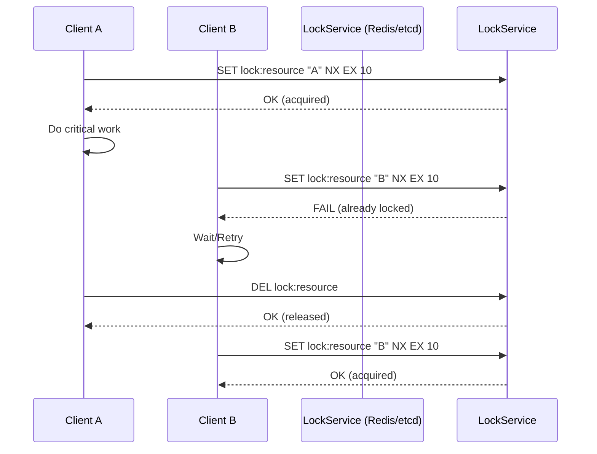

# Module 22: pkg/distlock

## สำหรับโฟลเดอร์ `pkg/distlock/`

ไฟล์ที่เกี่ยวข้อง:
- `lock.go` – Distributed Lock interface และ options
- `redis.go` – Redis-based lock (Redlock, single node)
- `etcd.go` – etcd-based lock using Lease + KeepAlive
- `postgres.go` – PostgreSQL advisory lock
- `memory.go` – In-memory lock (สำหรับ testing, single instance)
- `config.go` – Configuration management
- `middleware.go` – HTTP/gRPC middleware สำหรับ automatic locking
- `examples/main.go` – ตัวอย่างการใช้งานครบวงจร

---

## หลักการ (Concept)

### Distributed Lock คืออะไร?
Distributed lock เป็นกลไกที่ช่วยให้กระบวนการ (processes) หรือบริการ (services) ที่ทำงานบนเครื่องต่างกัน สามารถเข้าถึงทรัพยากรร่วมกัน (shared resource) ได้อย่างเป็นระเบียบและปลอดภัย ผ่านการ “ขอสิทธิ์” ก่อนดำเนินการ critical section ซึ่ง lock จะถูกจัดเก็บในระบบภายนอกที่ทุก instance เข้าถึงได้ เช่น Redis, etcd, ZooKeeper หรือ PostgreSQL โดยทั่วไป distributed lock จำเป็นต้องมีคุณสมบัติพื้นฐานดังนี้

- **Mutual exclusion** – มีเพียง client เดียวเท่านั้นที่ถือ lock ได้ในเวลาเดียวกัน
- **Deadlock avoidance** – lock ต้องมีเวลา timeout (TTL) หรือ heartbeat เพื่อปลด lock อัตโนมัติเมื่อ client ตาย
- **Fault tolerance** – ระบบ lock ต้องยังทำงานได้แม้บาง node ล้ม
- **Reentrancy (optional)** – client เดียวกันขอ lock ซ้ำได้หรือไม่
- **Fairness** – รองรับ queue หรือไม่ (optional)

**ข้อห้ามสำคัญ:** ห้ามใช้ distributed lock สำหรับงานที่ sensitive ต่อความถูกต้องอย่างยิ่ง (เช่น การหักเงินซ้ำซ้อน) โดยไม่มีการป้องกันเพิ่มเติม เช่น fencing token เพราะ distributed lock ยังมีโอกาสผิดพลาดได้ (split-brain, clock drift, GC pause) ควรใช้ optimistic locking หรือ transactional outbox pattern แทนในกรณีที่ต้องการความถูกต้องสูง

### มีกี่แบบ? (Distributed Lock Implementations)

| แบบ | ระบบภายนอก | กลไก | เหมาะกับ |
|-----|-------------|------|----------|
| **Redis (Redlock)** | Redis | SET NX + TTL + Lua script | ความเร็วสูง, infrastructure มี Redis อยู่แล้ว |
| **Redis (Single node)** | Redis | SET NX + TTL | ง่าย, ความเร็วสูง แต่ไม่ทนต่อ Redis failover |
| **etcd** | etcd | Lease + Transaction (CAS) | ต้องการ strong consistency, cluster management |
| **ZooKeeper** | ZooKeeper | Ephemeral sequential node | legacy, ระบบที่ใช้ ZK อยู่แล้ว |
| **PostgreSQL advisory lock** | PostgreSQL | `pg_advisory_lock` | มี PostgreSQL เป็น primary database, ต้องการ lock ที่ durable |
| **Consul** | Consul | Session + KV | infrastructure มี Consul อยู่แล้ว |

### ใช้อย่างไร / นำไปใช้กรณีไหน

**กรณีใช้งานหลัก:**
- **Leader election** – เลือก instance เพียงหนึ่งเดียวใน cluster ที่ทำงานบางอย่าง (scheduler, coordinator)
- **Job scheduling** – ป้องกัน cron job เดียวกันถูก run ซ้ำบนหลาย instance
- **Idempotency protection** – ป้องกันการประมวลผล duplicate message/event
- **Resource reservation** – ควบคุม access ไปยัง external API ที่มี rate limit ต่ำ
- **Database migration** – รัน migration script เพียง instance เดียวใน cluster
- **Cache rebuilding** – ป้องกันหลาย instance rebuild cache พร้อมกัน

**ข้อควรระวังสำคัญ:**
- Distributed lock ไม่ใช่ silver bullet – ต้องเข้าใจข้อจำกัดของแต่ละ implementation
- Redis Redlock มีข้อถกเถียงเรื่อง correctness ใน distributed systems community (Martin Kleppmann) – ใช้อย่างระมัดระวัง
- Clock drift, GC pause, network partition สามารถทำลาย mutual exclusion ได้
- ควรใช้ fencing token เพิ่มเติมเพื่อป้องกัน lock ที่หมดอายุแล้วแต่ client ยังทำงานต่อ

### ประโยชน์ที่ได้รับ
- **Safe concurrency** – ทำให้ critical section ทำงานได้อย่างถูกต้องใน distributed environment
- **Simple abstraction** – interface เดียว (`Lock`, `Unlock`, `WithTimeout`) ใช้งานง่าย
- **Plugable backend** – เปลี่ยน backend (Redis ↔ etcd) ได้โดยไม่แก้ business logic
- **Automatic TTL renewal** – lock ถูกต่ออายุอัตโนมัติ (heartbeat) ในบาง implementation
- **Observability** – สามารถเพิ่ม metrics (lock acquired, contention duration) ได้

### ข้อเสีย
- **Performance overhead** – ทุกการ lock/unlock ต้องไปเรียก external system (network I/O)
- **Complexity** – การจัดการ edge cases (retry, timeout, renewal) ซับซ้อน
- **False safety** – ผู้พัฒนาอาจเข้าใจผิดคิดว่า distributed lock perfect ทำให้ละเลยปัญหาอื่น
- **Lock contention** – ถ้ามีการแย่ง lock สูง อาจกลายเป็น performance bottleneck
- **Monitoring overhead** – ต้อง monitor lock metrics เพื่อตรวจจับปัญหา

### ข้อห้าม
**ห้ามใช้ distributed lock แทน database transaction หรือ optimistic locking** สำหรับ update ข้อมูลที่มี contention สูง เพราะ lock จะกลายเป็น bottleneck และอาจเกิด deadlock ได้ง่าย

**ห้ามใช้ lock โดยไม่กำหนด TTL หรือ timeout** เพราะจะทำให้เกิด deadlock ถ้า client ตายคาล็อค

**ห้ามใช้ Redis single-node lock สำหรับ mission-critical financial transaction** เพราะ Redis อาจ failover หรือ lose data หลังจาก restart (RDB/AOF อาจไม่รับประกัน durability)

---

## การออกแบบ Workflow และ Dataflow



### Dataflow ใน Go application:
1. Client สร้าง `Lock` object พร้อม resource ID และ TTL
2. เรียก `Lock.Acquire(ctx)` – พยายามขอ lock (อาจ retry จนกว่าจะสำเร็จหรือ timeout)
3. ถ้าได้ lock → execute critical section
4. เรียก `defer lock.Release()` หรือทำ auto-renewal (heartbeat) ถ้าจำเป็น
5. เมื่อ release lock ครบแล้ว client อื่นจึงจะขอ lock ได้

---

## ตัวอย่างโค้ดที่รันได้จริง

### โครงสร้างโปรเจกต์
```
pkg/distlock/
├── lock.go          # Core interface and options
├── redis.go         # Redis lock (single node)
├── redlock.go       # Redlock algorithm (multiple Redis nodes)
├── etcd.go          # etcd-based lock
├── postgres.go      # PostgreSQL advisory lock
├── memory.go        # In-memory lock (testing)
├── config.go
├── options.go
├── middleware.go    # HTTP middleware for locking
└── example_test.go
```

### 1. การติดตั้ง Dependencies

```bash
# Core
go get github.com/redis/go-redis/v9
go get go.etcd.io/etcd/client/v3
go get github.com/jackc/pgx/v5
go get github.com/google/uuid
go get github.com/prometheus/client_golang
```

### 2. การติดตั้ง Lock Backend (Docker)

#### Redis
```yaml
# docker-compose.yml
version: '3.8'
services:
  redis:
    image: redis:7-alpine
    ports:
      - "6379:6379"
```

#### etcd
```yaml
  etcd:
    image: quay.io/coreos/etcd:v3.5.9
    command: etcd --advertise-client-urls http://0.0.0.0:2379 --listen-client-urls http://0.0.0.0:2379
    ports:
      - "2379:2379"
```

### 3. ตัวอย่างโค้ด: Lock Interface

```go
// lock.go
package distlock

import (
    "context"
    "time"
)

// Locker is the main interface for distributed locks.
type Locker interface {
    // Lock acquires the lock with given resource ID.
    // If context is cancelled or deadline exceeded, returns error.
    Lock(ctx context.Context, resourceID string, ttl time.Duration) (Lock, error)

    // Close releases any resources.
    Close() error
}

// Lock represents an acquired lock.
type Lock interface {
    // Unlock releases the lock.
    Unlock(ctx context.Context) error

    // Refresh extends the lock's TTL (heartbeat).
    Refresh(ctx context.Context) error

    // Token returns a unique identifier for this lock instance (fencing token).
    Token() string
}
```

### 4. ตัวอย่างโค้ด: Redis Lock (Single Node)

```go
// redis.go
package distlock

import (
    "context"
    "errors"
    "time"

    "github.com/google/uuid"
    "github.com/redis/go-redis/v9"
)

var ErrLockNotHeld = errors.New("lock not held")

type RedisLocker struct {
    client *redis.Client
}

func NewRedisLocker(client *redis.Client) *RedisLocker {
    return &RedisLocker{client: client}
}

type redisLock struct {
    client     *redis.Client
    resourceID string
    token      string
    ttl        time.Duration
}

func (l *RedisLocker) Lock(ctx context.Context, resourceID string, ttl time.Duration) (Lock, error) {
    token := uuid.New().String()
    ok, err := l.client.SetNX(ctx, resourceID, token, ttl).Result()
    if err != nil {
        return nil, err
    }
    if !ok {
        return nil, ErrLockFailed
    }
    return &redisLock{
        client:     l.client,
        resourceID: resourceID,
        token:      token,
        ttl:        ttl,
    }, nil
}

func (l *redisLock) Unlock(ctx context.Context) error {
    // Lua script to ensure we only delete if token matches
    script := `
        if redis.call("get", KEYS[1]) == ARGV[1] then
            return redis.call("del", KEYS[1])
        else
            return 0
        end
    `
    result, err := l.client.Eval(ctx, script, []string{l.resourceID}, l.token).Result()
    if err != nil {
        return err
    }
    if result == int64(0) {
        return ErrLockNotHeld
    }
    return nil
}

func (l *redisLock) Refresh(ctx context.Context) error {
    // Extend TTL only if token matches
    script := `
        if redis.call("get", KEYS[1]) == ARGV[1] then
            return redis.call("pexpire", KEYS[1], ARGV[2])
        else
            return 0
        end
    `
    result, err := l.client.Eval(ctx, script, []string{l.resourceID}, l.token, l.ttl.Milliseconds()).Result()
    if err != nil {
        return err
    }
    if result == int64(0) {
        return ErrLockNotHeld
    }
    return nil
}

func (l *redisLock) Token() string {
    return l.token
}

func (l *RedisLocker) Close() error {
    return l.client.Close()
}
```

### 5. ตัวอย่างโค้ด: etcd Lock

```go
// etcd.go
package distlock

import (
    "context"
    "fmt"
    "time"

    clientv3 "go.etcd.io/etcd/client/v3"
    "go.etcd.io/etcd/client/v3/concurrency"
)

type EtcdLocker struct {
    client *clientv3.Client
}

func NewEtcdLocker(client *clientv3.Client) *EtcdLocker {
    return &EtcdLocker{client: client}
}

type etcdLock struct {
    session *concurrency.Session
    mutex   *concurrency.Mutex
    token   string
}

func (l *EtcdLocker) Lock(ctx context.Context, resourceID string, ttl time.Duration) (Lock, error) {
    // etcd uses lease for TTL; session will auto-refresh
    session, err := concurrency.NewSession(l.client, concurrency.WithTTL(int(ttl.Seconds())))
    if err != nil {
        return nil, err
    }
    mutex := concurrency.NewMutex(session, "/locks/"+resourceID)
    if err := mutex.Lock(ctx); err != nil {
        session.Close()
        return nil, err
    }
    return &etcdLock{
        session: session,
        mutex:   mutex,
        token:   fmt.Sprintf("%d", session.Lease()),
    }, nil
}

func (l *etcdLock) Unlock(ctx context.Context) error {
    if err := l.mutex.Unlock(ctx); err != nil {
        return err
    }
    return l.session.Close()
}

func (l *etcdLock) Refresh(ctx context.Context) error {
    // etcd lease is automatically kept alive by session
    return nil
}

func (l *etcdLock) Token() string {
    return l.token
}

func (l *EtcdLocker) Close() error {
    return l.client.Close()
}
```

### 6. ตัวอย่างโค้ด: PostgreSQL Advisory Lock

```go
// postgres.go
package distlock

import (
    "context"
    "database/sql"
    "fmt"
)

type PostgresLocker struct {
    db *sql.DB
}

func NewPostgresLocker(db *sql.DB) *PostgresLocker {
    return &PostgresLocker{db: db}
}

type pgLock struct {
    db         *sql.DB
    resourceID int64 // advisory lock ID
    token      string
}

func (l *PostgresLocker) Lock(ctx context.Context, resourceID string, ttl time.Duration) (Lock, error) {
    // Convert resourceID to int64 (hash)
    id := int64(fnv1a(resourceID))
    // Try to acquire advisory lock (blocking until timeout)
    // Use pg_try_advisory_lock for non-blocking
    var acquired bool
    err := l.db.QueryRowContext(ctx, "SELECT pg_try_advisory_lock($1)", id).Scan(&acquired)
    if err != nil {
        return nil, err
    }
    if !acquired {
        return nil, ErrLockFailed
    }
    return &pgLock{
        db:         l.db,
        resourceID: id,
        token:      uuid.New().String(),
    }, nil
}

func (l *pgLock) Unlock(ctx context.Context) error {
    _, err := l.db.ExecContext(ctx, "SELECT pg_advisory_unlock($1)", l.resourceID)
    return err
}

func (l *pgLock) Refresh(ctx context.Context) error {
    // PostgreSQL advisory locks do not have TTL; they live until explicit unlock or session end.
    // For refresh we can simply re-acquire? Not applicable. Return nil.
    return nil
}

func (l *pgLock) Token() string {
    return l.token
}

func (l *PostgresLocker) Close() error {
    return l.db.Close()
}

func fnv1a(s string) uint64 {
    // simple hash
    h := uint64(14695981039346656037)
    for i := 0; i < len(s); i++ {
        h ^= uint64(s[i])
        h *= 1099511628211
    }
    return h
}
```

### 7. ตัวอย่างโค้ด: Options และ Retry Strategy

```go
// options.go
package distlock

import (
    "context"
    "time"
)

type LockOptions struct {
    RetryCount    int
    RetryDelay    time.Duration
    Timeout       time.Duration
    Heartbeat     bool
    HeartbeatFreq time.Duration
}

type LockOption func(*LockOptions)

func WithRetry(count int, delay time.Duration) LockOption {
    return func(o *LockOptions) { o.RetryCount = count; o.RetryDelay = delay }
}

func WithTimeout(timeout time.Duration) LockOption {
    return func(o *LockOptions) { o.Timeout = timeout }
}

func WithHeartbeat(freq time.Duration) LockOption {
    return func(o *LockOptions) { o.Heartbeat = true; o.HeartbeatFreq = freq }
}

func AcquireLock(ctx context.Context, locker Locker, resourceID string, ttl time.Duration, opts ...LockOption) (Lock, error) {
    options := &LockOptions{
        RetryCount: 3,
        RetryDelay: 100 * time.Millisecond,
        Timeout:    0,
    }
    for _, o := range opts {
        o(options)
    }

    var lockCtx context.Context
    var cancel context.CancelFunc
    if options.Timeout > 0 {
        lockCtx, cancel = context.WithTimeout(ctx, options.Timeout)
        defer cancel()
    } else {
        lockCtx = ctx
    }

    var lastErr error
    for i := 0; i <= options.RetryCount; i++ {
        select {
        case <-lockCtx.Done():
            return nil, lockCtx.Err()
        default:
        }
        lock, err := locker.Lock(lockCtx, resourceID, ttl)
        if err == nil {
            if options.Heartbeat {
                go startHeartbeat(lockCtx, lock, options.HeartbeatFreq)
            }
            return lock, nil
        }
        lastErr = err
        if i < options.RetryCount {
            time.Sleep(options.RetryDelay)
        }
    }
    return nil, lastErr
}

func startHeartbeat(ctx context.Context, lock Lock, freq time.Duration) {
    ticker := time.NewTicker(freq)
    defer ticker.Stop()
    for {
        select {
        case <-ctx.Done():
            return
        case <-ticker.C:
            if err := lock.Refresh(ctx); err != nil {
                // log error, but cannot recover
                return
            }
        }
    }
}
```

### 8. ตัวอย่างโค้ด: HTTP Middleware

```go
// middleware.go
package distlock

import (
    "net/http"
    "strings"
)

// LockMiddleware acquires a lock based on request path or user ID.
func LockMiddleware(locker Locker, ttl time.Duration) func(http.Handler) http.Handler {
    return func(next http.Handler) http.Handler {
        return http.HandlerFunc(func(w http.ResponseWriter, r *http.Request) {
            // Use path + method as resource ID
            resourceID := r.Method + ":" + r.URL.Path
            // Optionally use user ID from token
            if userID := r.Header.Get("X-User-ID"); userID != "" {
                resourceID = resourceID + ":" + userID
            }
            lock, err := AcquireLock(r.Context(), locker, resourceID, ttl, WithRetry(2, 50*time.Millisecond))
            if err != nil {
                http.Error(w, "Unable to acquire lock", http.StatusConflict)
                return
            }
            defer lock.Unlock(r.Context())
            next.ServeHTTP(w, r)
        })
    }
}
```

### 9. ตัวอย่างการใช้งานรวมใน Main

```go
// main.go
package main

import (
    "context"
    "log"
    "net/http"
    "time"

    "github.com/redis/go-redis/v9"
    "yourproject/pkg/distlock"
)

func main() {
    // Connect to Redis
    rdb := redis.NewClient(&redis.Options{Addr: "localhost:6379"})
    locker := distlock.NewRedisLocker(rdb)

    // Use lock in HTTP handler
    http.HandleFunc("/critical", func(w http.ResponseWriter, r *http.Request) {
        lock, err := distlock.AcquireLock(r.Context(), locker, "critical-resource", 10*time.Second,
            distlock.WithRetry(5, 200*time.Millisecond),
            distlock.WithTimeout(2*time.Second),
        )
        if err != nil {
            http.Error(w, "failed to acquire lock", http.StatusServiceUnavailable)
            return
        }
        defer lock.Unlock(r.Context())

        // Critical section
        w.Write([]byte("work done"))
    })

    // Or use middleware
    // protected := distlock.LockMiddleware(locker, 5*time.Second)(myHandler)

    log.Fatal(http.ListenAndServe(":8080", nil))
}
```

---

## วิธีใช้งาน module นี้

1. เลือก lock backend (Redis, etcd, PostgreSQL) ตามความเหมาะสมของ infrastructure
2. ติดตั้ง backend ด้วย Docker หรือ native package
3. ติดตั้ง Go packages (`go get ...`)
4. สร้าง `Locker` instance
5. ใช้ `AcquireLock()` หรือ `locker.Lock()` โดยตรง
6. เรียก `defer lock.Unlock()` ทันทีหลังจากได้ lock
7. หากงานใช้เวลานานกว่า TTL ให้ใช้ `Refresh()` หรือ option `WithHeartbeat`

---

## การติดตั้ง

```bash
go get github.com/redis/go-redis/v9
go get go.etcd.io/etcd/client/v3
go get github.com/jackc/pgx/v5
go get github.com/google/uuid
```

---

## การตั้งค่า configuration

```go
type LockConfig struct {
    Backend     string // redis, etcd, postgres
    RedisAddr   string
    EtcdEndpoints []string
    PGConnString string
    DefaultTTL  time.Duration
}
```

Environment variables:
```bash
DISTLOCK_BACKEND=redis
REDIS_ADDR=localhost:6379
DISTLOCK_DEFAULT_TTL=30s
```

---

## การรวมกับ GORM

ไม่มีการรวมโดยตรง แต่อาจใช้ distributed lock เพื่อป้องกัน race condition ก่อนทำ GORM transaction:

```go
func TransferMoney(db *gorm.DB, locker distlock.Locker, from, to string, amount int) error {
    lock, err := locker.Lock(ctx, "account:"+from+":"+to, 5*time.Second)
    if err != nil {
        return err
    }
    defer lock.Unlock(ctx)
    // now safe to update both accounts
    return db.Transaction(func(tx *gorm.DB) error { ... })
}
```

---

## การใช้งานจริง

### Example 1: Leader Election สำหรับ Background Worker

```go
func runLeaderElection(locker distlock.Locker) {
    for {
        lock, err := locker.Lock(context.Background(), "leader-election", 15*time.Second)
        if err != nil {
            time.Sleep(5 * time.Second)
            continue
        }
        // This instance is the leader
        go func() {
            ticker := time.NewTicker(10 * time.Second)
            for range ticker.C {
                if err := lock.Refresh(context.Background()); err != nil {
                    return // lost leadership
                }
            }
        }()
        // do leader work
        // ...
        lock.Unlock(context.Background())
    }
}
```

### Example 2: Idempotent Processing of Kafka Message

```go
func handleMessage(msg *kafka.Message, locker distlock.Locker) error {
    lockKey := "msg:" + msg.Key
    lock, err := locker.Lock(ctx, lockKey, 30*time.Second)
    if err != nil {
        return err // maybe retry later
    }
    defer lock.Unlock(ctx)
    // process message exactly once
    return nil
}
```

---

## ตารางสรุป DistLock Components

| Component | คำอธิบาย | ตัวอย่าง |
|-----------|----------|----------|
| **Locker** | Factory สำหรับสร้าง Lock | `RedisLocker`, `EtcdLocker` |
| **Lock** | ตัวแทน lock ที่ถืออยู่ | `Unlock()`, `Refresh()`, `Token()` |
| **Redis lock** | SET NX + TTL + Lua script | เร็ว, ใช้ใน production ทั่วไป |
| **Redlock** | ใช้ Redis ≥3 instances เพิ่มความทนทาน | ซับซ้อน, มีข้อถกเถียง |
| **etcd lock** | Lease + Transaction | strong consistency, auto heartbeat |
| **PostgreSQL advisory lock** | `pg_advisory_lock` | ใช้ร่วมกับฐานข้อมูลหลัก |
| **Fencing token** | ค่า monotonic เพื่อป้องกัน split-brain | `token` ที่เพิ่มขึ้นเสมอ |
| **TTL / Lease** | เวลาที่ lock จะหมดอายุ | 30s, 1m |
| **Heartbeat** | การต่ออายุ lock อัตโนมัติ | etcd session keepalive |

---

## แบบฝึกหัดท้าย module (5 ข้อ)

### ข้อ 1: Implement Redis Lock ด้วย Lua Script
จาก Redis lock ที่ให้มา จงแก้ไข `Unlock` และ `Refresh` ให้ใช้ Lua script เพื่อความ atomic (ทำแล้ว) แต่เพิ่มฟังก์ชัน `ForceUnlock` ที่สามารถปลด lock โดยไม่ตรวจ token (สำหรับ admin) พร้อมทั้ง log event

### ข้อ 2: Redlock Implementation
จง implement Redlock algorithm โดยใช้ Redis instances 3 หรือ 5 ตัว (ระบุ addresses) โดยต้องขอ lock จาก majority ก่อนจึงจะถือว่า lock สำเร็จ และคำนวณ TTL ที่มีประสิทธิภาพ

### ข้อ 3: Leader Election with etcd
ใช้ etcd lock สร้าง leader election สำหรับ service ที่ต้องการมี active node เพียงหนึ่งเดียวในการประมวลผล定时任务 (cron) เขียน function `RunAsLeader(ctx, job func())` ที่จะรัน job เฉพาะเมื่อได้ lock และพยายามรักษา lock ตลอดเวลา

### ข้อ 4: Distributed Lock Monitoring
เพิ่ม Prometheus metrics ใน RedisLocker:
- `distlock_acquired_total{resource}`
- `distlock_failed_total{resource}`
- `distlock_hold_duration_seconds`
- `distlock_contention_wait_seconds`
เขียน middleware ที่บันทึกเวลา contention และ expose endpoint `/metrics`

### ข้อ 5: Deadlock Detection and Recovery
จากระบบที่มีหลาย services ใช้ distributed lock เดียวกัน จง implement deadlock detection ที่:
- แต่ละ lock จะมี timeout (TTL) และ heartbeat
- ถ้า lock ถูกถือนานเกินกว่า threshold (เช่น 2×TTL) โดยไม่มีการ refresh → ถือว่า deadlock
- ส่ง alert ไปยัง Slack และ optionally force unlock
- เขียน test ที่จำลอง deadlock (lock ถูกถือค้าง) และตรวจสอบ detection

---

## แหล่งอ้างอิง

- [Redis Distributed Lock (Official)](https://redis.io/docs/latest/develop/use/patterns/distributed-locks/)
- [Redlock – Martin Kleppmann’s critique](http://martin.kleppmann.com/2016/02/08/how-to-do-distributed-locking.html)
- [etcd concurrency package](https://pkg.go.dev/go.etcd.io/etcd/client/v3/concurrency)
- [PostgreSQL Advisory Locks](https://www.postgresql.org/docs/current/explicit-locking.html#ADVISORY-LOCKS)
- [Distributed Locks: Principles and Pitfalls](https://www.distributed-computing.org/distributed-locks/)

---

**หมายเหตุ:** module นี้ครบถ้วนสำหรับ `pkg/distlock` สำหรับระบบ gobackend หากต้องการ module เพิ่มเติม (เช่น `pkg/ratelimit`, `pkg/circuitbreaker`) โปรดแจ้ง