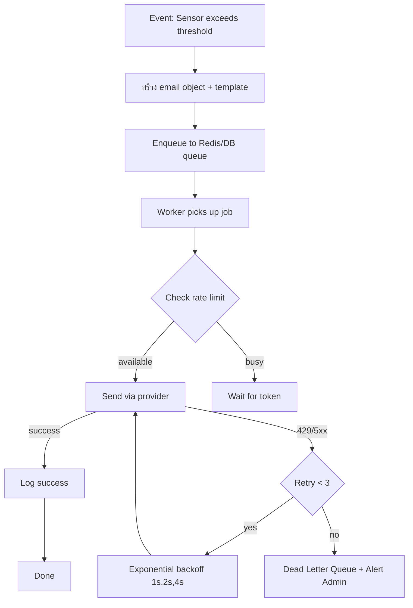
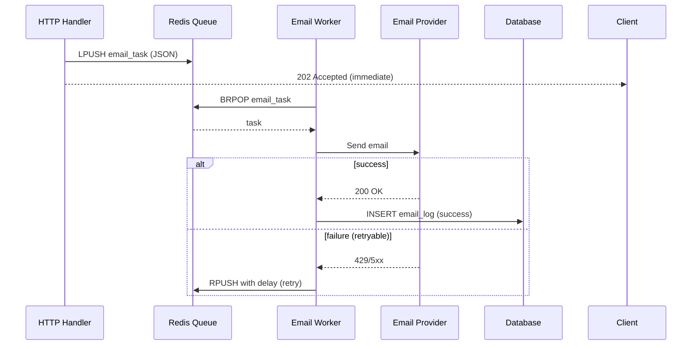

# Module 27: pkg/email_notification (Email Notification with Queue & Retry)

## สำหรับโฟลเดอร์ `internal/pkg/email_notification/`

ไฟล์ที่เกี่ยวข้อง:
- `internal/pkg/email_notification/sender.go`
- `internal/pkg/email_notification/provider_smtp.go`
- `internal/pkg/email_notification/provider_sendgrid.go`
- `internal/pkg/email_notification/template.go`
- `internal/pkg/email_notification/worker.go`
- `internal/pkg/email_notification/retry.go`
- `internal/pkg/email_notification/rate_limiter.go`
- `internal/repository/email_log.go`
- `migrations/email_logs.sql`
- `internal/pkg/email_notification/templates/*.html`

---

## หลักการ (Concept)

### Email Notification คืออะไร?

Email Notification คือระบบส่งอีเมลอัตโนมัติสำหรับแจ้งเตือนเหตุการณ์ รายงาน หรือยืนยันการดำเนินการต่างๆ ในระบบ โดยรองรับหลายผู้ให้บริการ (SMTP, SendGrid, AWS SES) มีการจัดการคิว (queue) เพื่อไม่ให้ HTTP request ต้องรอส่งอีเมล, มี retry mechanism เมื่อส่งล้มเหลว, และมี rate limiting เพื่อป้องกันการถูกผู้ให้บริการบล็อก เหมาะสำหรับการส่งอีเมลแจ้งเตือนจากระบบ CMON IoT เช่น เมื่ออุณหภูมิเกินค่า threshold, ส่งรายงานประจำวัน, หรือส่งลิงก์รีเซ็ตรหัสผ่าน

### มีกี่แบบ? (Email Providers & Strategies)

| Provider | ลักษณะ | ข้อดี | ข้อเสีย | เหมาะกับ |
|----------|--------|------|---------|----------|
| **SMTP (gomail)** | ส่งผ่าน SMTP server ทั่วไป (Gmail, Outlook, ฯลฯ) | ง่าย, ฟรี (ถ้ามี server) | rate limit ต่ำ, ไม่มี analytics | Development, องค์กรที่มี mail server |
| **SendGrid** | REST API, global infrastructure | rate limit สูง, analytics, deliverability ดี | มีค่าใช้จ่าย, ต้องลงทะเบียน | Production, ต้องการ deliverability สูง |
| **AWS SES** | Cloud email service | ราคาถูกมาก, scalable, high deliverability | ต้องมี AWS account, ตั้งค่า domain verification | Enterprise, cost-effective |
| **Mailgun** | REST API, email validation | email validation, analytics | มีค่าใช้จ่าย | การตลาด, transactional emails |
| **Resend** | Modern API, React email support | developer friendly, react email | ใหม่, ecosystem ยังเล็ก | Modern web apps |

**ข้อห้ามสำคัญ:** ห้ามใช้ Bucket Pattern ร่วมกับ Time Series Collections เพราะจะลดประสิทธิภาพ — แต่สำหรับ email module นี้ไม่เกี่ยวข้อง

### ใช้อย่างไร / นำไปใช้กรณีไหน

1. **Alert Notification** – แจ้งเตือนเมื่อเซนเซอร์เกิน threshold ไปยัง admin emails
2. **Scheduled Reports** – ส่งรายงานสรุป Data Center รายวัน/สัปดาห์
3. **User Verification** – ส่งลิงก์ยืนยันอีเมล, รีเซ็ตรหัสผ่าน
4. **System Health Alerts** – แจ้งเตือนเมื่อ service มีปัญหา
5. **Bulk Notifications** – ส่งประกาศไปยังผู้ใช้หลายคน (โดยใช้ queue)

### ประโยชน์ที่ได้รับ

- **Asynchronous processing** – ไม่บล็อก HTTP request
- **Retry & backoff** – จัดการกับความล้มเหลวชั่วคราว (network, rate limit)
- **Multiple providers** – รองรับ SMTP, SendGrid, AWS SES
- **Template support** – แยก HTML template ออกจากโค้ด
- **Rate limiting** – ป้องกันการถูก provider block
- **Delivery logging** – บันทึกประวัติการส่ง
- **Queue persistence** – ใช้ Redis หรือ database สำหรับ durable queue

### ข้อควรระวัง

- **Rate limits** – ผู้ให้บริการแต่ละรายมีข้อจำกัด (Gmail: 500/วัน, SendGrid: 100/วัน free tier)
- **Email deliverability** – ต้องตั้งค่า SPF, DKIM, DMARC
- **Spam traps** – อย่าส่งอีเมลไปยังผู้ใช้ที่ไม่ consent
- **Queue size** – ระวัง queue เต็ม (ต้องมี monitoring)
- **Retry storm** – อย่า retry ทันทีเมื่อล้มเหลว (ใช้ exponential backoff)
- **Template paths** – ต้องระบุ path ให้ถูกต้องเมื่อ deploy เป็น container

### ข้อดี
- ไม่บล็อก main thread, รองรับหลาย provider, retry, rate limit, template

### ข้อเสีย
- เพิ่ม complexity (queue, worker), ต้องจัดการ durable queue

### ข้อห้าม
- ห้ามส่งอีเมลหา user ที่ไม่ยินยอม (GDPR, PDPA violation)
- ห้าม hardcode credentials ใน source code
- ห้ามส่ง sensitive data (password, token) ใน plain text email (ใช้ link แทน)
- ห้ามใช้ default retry policy โดยไม่มี backoff (อาจทำให้ provider rate limit หนักขึ้น)
- ห้ามใช้ email เป็น primary channel สำหรับ alert ที่ต้องแน่ใจว่าถึง (ควรมี SMS หรือ LINE backup)


## การออกแบบ Workflow และ Dataflow

### Workflow: การส่ง Email Notification แบบ Asynchronous



**รูปที่ 43:** ขั้นตอนการส่ง email notification แบบ asynchronous พร้อม queue, rate limit, และ retry

### Dataflow: Queue-based Email Sending



**รูปที่ 44:** Sequence diagram แสดงการแยกการรับ request และการส่ง email ออกจากกันผ่าน queue


## ตัวอย่างโค้ดที่รันได้จริง

### 1. Sender Interface & Core Types – `sender.go`

```go
// Package email_notification provides async email sending with queue, retry, and multiple providers.
// ----------------------------------------------------------------
// แพ็คเกจ email_notification ให้บริการส่งอีเมลแบบ async พร้อม queue, retry, และผู้ให้บริการหลายราย
package email_notification

import (
	"context"
	"time"
)

// Email represents an email message to be sent.
// ----------------------------------------------------------------
// Email แทนข้อความอีเมลที่จะส่ง
type Email struct {
	To          []string
	CC          []string
	BCC         []string
	Subject     string
	HTMLBody    string
	TextBody    string
	Attachments []Attachment
	Metadata    map[string]string // for logging/tracing
}

// Attachment represents a file attachment.
// ----------------------------------------------------------------
// Attachment แทนไฟล์แนบ
type Attachment struct {
	Filename string
	Content  []byte
	MIMEType string
}

// Sender defines the interface for email providers.
// ----------------------------------------------------------------
// Sender กำหนด interface สำหรับผู้ให้บริการอีเมล
type Sender interface {
	Send(ctx context.Context, email *Email) (string, error) // returns message ID
}

// ProviderType defines available email providers.
// ----------------------------------------------------------------
// ProviderType กำหนดประเภทผู้ให้บริการอีเมล
type ProviderType string

const (
	ProviderSMTP    ProviderType = "smtp"
	ProviderSendGrid ProviderType = "sendgrid"
	ProviderAWSSES  ProviderType = "ses"
)
```

### 2. SMTP Provider Implementation – `provider_smtp.go`

```go
package email_notification

import (
	"context"
	"crypto/tls"
	"fmt"

	"gopkg.in/gomail.v2"
)

// SMTPConfig holds SMTP server configuration.
// ----------------------------------------------------------------
// SMTPConfig เก็บค่ากำหนด SMTP server
type SMTPConfig struct {
	Host     string
	Port     int
	Username string
	Password string
	From     string
	TLS      bool
}

// SMTPSender implements Sender using SMTP (gomail).
// ----------------------------------------------------------------
// SMTPSender อิมพลีเมนต์ Sender ด้วย SMTP (gomail)
type SMTPSender struct {
	config *SMTPConfig
}

// NewSMTPSender creates a new SMTP sender.
// ----------------------------------------------------------------
// NewSMTPSender สร้าง SMTP sender ใหม่
func NewSMTPSender(cfg *SMTPConfig) *SMTPSender {
	return &SMTPSender{config: cfg}
}

// Send sends an email via SMTP.
// ----------------------------------------------------------------
// Send ส่งอีเมลผ่าน SMTP
func (s *SMTPSender) Send(ctx context.Context, email *Email) (string, error) {
	m := gomail.NewMessage()
	m.SetHeader("From", s.config.From)
	m.SetHeader("To", email.To...)
	if len(email.CC) > 0 {
		m.SetHeader("Cc", email.CC...)
	}
	if len(email.BCC) > 0 {
		m.SetHeader("Bcc", email.BCC...)
	}
	m.SetHeader("Subject", email.Subject)
	m.SetBody("text/plain", email.TextBody)
	if email.HTMLBody != "" {
		m.AddAlternative("text/html", email.HTMLBody)
	}
	for _, att := range email.Attachments {
		m.Attach(att.Filename, gomail.SetCopyFunc(func(w io.Writer) error {
			_, err := w.Write(att.Content)
			return err
		}))
	}
	dialer := gomail.NewDialer(s.config.Host, s.config.Port, s.config.Username, s.config.Password)
	if s.config.TLS {
		dialer.TLSConfig = &tls.Config{InsecureSkipVerify: false}
	}
	if err := dialer.DialAndSend(m); err != nil {
		return "", fmt.Errorf("SMTP send failed: %w", err)
	}
	// SMTP doesn't return message ID, generate a fake one
	return fmt.Sprintf("smtp-%d", time.Now().UnixNano()), nil
}
```

### 3. SendGrid Provider – `provider_sendgrid.go`

```go
package email_notification

import (
	"context"
	"fmt"

	"github.com/sendgrid/sendgrid-go"
	"github.com/sendgrid/sendgrid-go/helpers/mail"
)

// SendGridConfig holds SendGrid API configuration.
// ----------------------------------------------------------------
// SendGridConfig เก็บค่ากำหนด SendGrid API
type SendGridConfig struct {
	APIKey string
	From   string
	FromName string
}

// SendGridSender implements Sender using SendGrid API.
// ----------------------------------------------------------------
// SendGridSender อิมพลีเมนต์ Sender ด้วย SendGrid API
type SendGridSender struct {
	client *sendgrid.Client
	from   *mail.Email
}

// NewSendGridSender creates a new SendGrid sender.
// ----------------------------------------------------------------
// NewSendGridSender สร้าง SendGrid sender ใหม่
func NewSendGridSender(cfg *SendGridConfig) *SendGridSender {
	return &SendGridSender{
		client: sendgrid.NewSendClient(cfg.APIKey),
		from:   mail.NewEmail(cfg.FromName, cfg.From),
	}
}

// Send sends an email via SendGrid.
// ----------------------------------------------------------------
// Send ส่งอีเมลผ่าน SendGrid
func (s *SendGridSender) Send(ctx context.Context, email *Email) (string, error) {
	m := mail.NewV3Mail()
	m.SetFrom(s.from)
	m.Subject = email.Subject
	personalization := mail.NewPersonalization()
	for _, to := range email.To {
		personalization.AddTos(mail.NewEmail("", to))
	}
	for _, cc := range email.CC {
		personalization.AddCCs(mail.NewEmail("", cc))
	}
	for _, bcc := range email.BCC {
		personalization.AddBCCs(mail.NewEmail("", bcc))
	}
	m.AddPersonalizations(personalization)

	if email.TextBody != "" {
		m.AddContent(mail.NewContent("text/plain", email.TextBody))
	}
	if email.HTMLBody != "" {
		m.AddContent(mail.NewContent("text/html", email.HTMLBody))
	}
	// Attachments not supported in simple example
	response, err := s.client.Send(m)
	if err != nil {
		return "", fmt.Errorf("SendGrid send failed: %w", err)
	}
	if response.StatusCode >= 400 {
		return "", fmt.Errorf("SendGrid returned %d: %s", response.StatusCode, response.Body)
	}
	return response.Headers.Get("X-Message-Id"), nil
}
```

### 4. Template Engine – `template.go`

```go
package email_notification

import (
	"bytes"
	"html/template"
	"path/filepath"
	"sync"
)

// TemplateEngine renders HTML email templates.
// ----------------------------------------------------------------
// TemplateEngine render HTML templates สำหรับอีเมล
type TemplateEngine struct {
	templatesDir string
	cache        map[string]*template.Template
	mu           sync.RWMutex
}

// NewTemplateEngine creates a new template engine.
// ----------------------------------------------------------------
// NewTemplateEngine สร้าง template engine ใหม่
func NewTemplateEngine(templatesDir string) *TemplateEngine {
	return &TemplateEngine{
		templatesDir: templatesDir,
		cache:        make(map[string]*template.Template),
	}
}

// Render renders a template with given data.
// ----------------------------------------------------------------
// Render render template ด้วยข้อมูลที่กำหนด
func (e *TemplateEngine) Render(templateName string, data interface{}) (string, error) {
	e.mu.RLock()
	tmpl, ok := e.cache[templateName]
	e.mu.RUnlock()
	if !ok {
		var err error
		tmpl, err = template.ParseFiles(filepath.Join(e.templatesDir, templateName+".html"))
		if err != nil {
			return "", err
		}
		e.mu.Lock()
		e.cache[templateName] = tmpl
		e.mu.Unlock()
	}
	var buf bytes.Buffer
	if err := tmpl.Execute(&buf, data); err != nil {
		return "", err
	}
	return buf.String(), nil
}
```

### 5. Queue Interface (Redis/DB) – `queue.go`

```go
package email_notification

import (
	"context"
	"encoding/json"
	"time"

	"github.com/redis/go-redis/v9"
)

// EmailJob represents a queued email task.
// ----------------------------------------------------------------
// EmailJob แทนงานอีเมลที่อยู่ในคิว
type EmailJob struct {
	ID        string    `json:"id"`
	Email     *Email    `json:"email"`
	Provider  string    `json:"provider"`
	RetryCount int      `json:"retry_count"`
	NextRetry time.Time `json:"next_retry"`
}

// Queue defines interface for task queue.
// ----------------------------------------------------------------
// Queue กำหนด interface สำหรับ task queue
type Queue interface {
	Enqueue(ctx context.Context, job *EmailJob) error
	Dequeue(ctx context.Context, timeout time.Duration) (*EmailJob, error)
	Requeue(ctx context.Context, job *EmailJob, delay time.Duration) error
}

// RedisQueue implements Queue using Redis list.
// ----------------------------------------------------------------
// RedisQueue อิมพลีเมนต์ Queue ด้วย Redis list
type RedisQueue struct {
	client *redis.Client
	key    string
}

// NewRedisQueue creates a new Redis queue.
// ----------------------------------------------------------------
// NewRedisQueue สร้าง Redis queue ใหม่
func NewRedisQueue(client *redis.Client, queueKey string) *RedisQueue {
	return &RedisQueue{client: client, key: queueKey}
}

// Enqueue adds a job to the queue (right push).
// ----------------------------------------------------------------
// Enqueue เพิ่มงานเข้าคิว (push ทางขวา)
func (q *RedisQueue) Enqueue(ctx context.Context, job *EmailJob) error {
	data, err := json.Marshal(job)
	if err != nil {
		return err
	}
	return q.client.RPush(ctx, q.key, data).Err()
}

// Dequeue retrieves a job from the queue (left pop) with blocking timeout.
// ----------------------------------------------------------------
// Dequeue ดึงงานออกจากคิว (pop ทางซ้าย) แบบบล็อก
func (q *RedisQueue) Dequeue(ctx context.Context, timeout time.Duration) (*EmailJob, error) {
	result, err := q.client.BLPop(ctx, timeout, q.key).Result()
	if err == redis.Nil {
		return nil, nil
	}
	if err != nil {
		return nil, err
	}
	if len(result) < 2 {
		return nil, nil
	}
	var job EmailJob
	if err := json.Unmarshal([]byte(result[1]), &job); err != nil {
		return nil, err
	}
	return &job, nil
}

// Requeue pushes job back to queue after delay (using a delayed queue).
// ----------------------------------------------------------------
// Requeue ใส่งานกลับคิวหลังจากดีเลย์
func (q *RedisQueue) Requeue(ctx context.Context, job *EmailJob, delay time.Duration) error {
	// Simple implementation: re-enqueue immediately and let worker handle delay
	// For production, use Redis sorted set for delayed queue
	data, err := json.Marshal(job)
	if err != nil {
		return err
	}
	return q.client.RPush(ctx, q.key, data).Err()
}
```

### 6. Email Worker with Retry & Rate Limit – `worker.go`

```go
package email_notification

import (
	"context"
	"log"
	"sync"
	"time"
)

// EmailWorker handles background email sending with retries.
// ----------------------------------------------------------------
// EmailWorker จัดการการส่งอีเมลในพื้นหลังพร้อม retry
type EmailWorker struct {
	queue       Queue
	sender      Sender
	rateLimiter *RateLimiter
	retryPolicy *RetryPolicy
	workers     int
	queueChan   chan *EmailJob
	wg          sync.WaitGroup
	stopCh      chan struct{}
}

// NewEmailWorker creates a new email worker.
// ----------------------------------------------------------------
// NewEmailWorker สร้าง email worker ใหม่
func NewEmailWorker(queue Queue, sender Sender, workers int) *EmailWorker {
	return &EmailWorker{
		queue:       queue,
		sender:      sender,
		rateLimiter: NewRateLimiter(1, 5), // 1 request/sec, burst 5
		retryPolicy: DefaultRetryPolicy(),
		workers:     workers,
		queueChan:   make(chan *EmailJob, 100),
		stopCh:      make(chan struct{}),
	}
}

// Start begins the worker goroutines.
// ----------------------------------------------------------------
// Start เริ่ม worker goroutines
func (w *EmailWorker) Start(ctx context.Context) {
	// Start queue fetcher
	go w.fetchLoop(ctx)
	// Start workers
	for i := 0; i < w.workers; i++ {
		w.wg.Add(1)
		go w.workerLoop(ctx, i)
	}
	log.Printf("EmailWorker started with %d workers", w.workers)
}

// Stop gracefully shuts down the worker.
// ----------------------------------------------------------------
// Stop ปิด worker อย่างนุ่มนวล
func (w *EmailWorker) Stop() {
	close(w.stopCh)
	w.wg.Wait()
}

func (w *EmailWorker) fetchLoop(ctx context.Context) {
	for {
		select {
		case <-ctx.Done():
			return
		case <-w.stopCh:
			return
		default:
			job, err := w.queue.Dequeue(ctx, 5*time.Second)
			if err != nil {
				log.Printf("Dequeue error: %v", err)
				continue
			}
			if job == nil {
				continue
			}
			select {
			case w.queueChan <- job:
			case <-w.stopCh:
				return
			}
		}
	}
}

func (w *EmailWorker) workerLoop(ctx context.Context, id int) {
	defer w.wg.Done()
	for {
		select {
		case <-ctx.Done():
			return
		case <-w.stopCh:
			return
		case job := <-w.queueChan:
			w.processJob(ctx, job)
		}
	}
}

func (w *EmailWorker) processJob(ctx context.Context, job *EmailJob) {
	// Check if job is scheduled for retry in the future
	if job.NextRetry.After(time.Now()) {
		time.Sleep(time.Until(job.NextRetry))
	}
	// Wait for rate limiter
	if err := w.rateLimiter.Wait(ctx); err != nil {
		return
	}
	msgID, err := w.sender.Send(ctx, job.Email)
	if err != nil {
		log.Printf("Email send failed: %v, retry=%d, jobID=%s", err, job.RetryCount, job.ID)
		if job.RetryCount < w.retryPolicy.MaxRetries {
			job.RetryCount++
			job.NextRetry = time.Now().Add(w.retryPolicy.Backoff(job.RetryCount))
			if err := w.queue.Requeue(ctx, job, 0); err != nil {
				log.Printf("Failed to requeue job %s: %v", job.ID, err)
			}
		} else {
			log.Printf("Email job %s failed after %d retries", job.ID, w.retryPolicy.MaxRetries)
		}
		return
	}
	log.Printf("Email sent successfully, msgID=%s, jobID=%s", msgID, job.ID)
}
```

### 7. Retry Policy & Rate Limiter – `retry.go` and `rate_limiter.go`

```go
package email_notification

import (
	"context"
	"math"
	"sync"
	"time"
)

// RetryPolicy defines retry behavior.
// ----------------------------------------------------------------
// RetryPolicy กำหนดพฤติกรรมการ retry
type RetryPolicy struct {
	MaxRetries int
	BaseDelay  time.Duration
	MaxDelay   time.Duration
}

// DefaultRetryPolicy returns a sensible default.
// ----------------------------------------------------------------
// DefaultRetryPolicy คืนค่า retry policy ที่เหมาะสม
func DefaultRetryPolicy() *RetryPolicy {
	return &RetryPolicy{
		MaxRetries: 3,
		BaseDelay:  time.Second,
		MaxDelay:   30 * time.Second,
	}
}

// Backoff calculates the delay for a given retry attempt.
// ----------------------------------------------------------------
// Backoff คำนวณ delay สำหรับการ retry ครั้งที่กำหนด
func (p *RetryPolicy) Backoff(attempt int) time.Duration {
	delay := time.Duration(float64(p.BaseDelay) * math.Pow(2, float64(attempt-1)))
	if delay > p.MaxDelay {
		delay = p.MaxDelay
	}
	return delay
}

// RateLimiter implements token bucket for email sending.
// ----------------------------------------------------------------
// RateLimiter จำกัดอัตราการส่งอีเมล
type RateLimiter struct {
	tokens     int
	burst      int
	rate       float64
	lastRefill time.Time
	mu         sync.Mutex
}

// NewRateLimiter creates a rate limiter.
// ----------------------------------------------------------------
// NewRateLimiter สร้าง rate limiter ใหม่
func NewRateLimiter(requestsPerSec, burst int) *RateLimiter {
	return &RateLimiter{
		tokens:     burst,
		burst:      burst,
		rate:       float64(requestsPerSec),
		lastRefill: time.Now(),
	}
}

// Wait blocks until a token is available.
// ----------------------------------------------------------------
// Wait บล็อกจนกว่าจะมี token พร้อม
func (r *RateLimiter) Wait(ctx context.Context) error {
	for {
		select {
		case <-ctx.Done():
			return ctx.Err()
		default:
		}
		r.mu.Lock()
		r.refill()
		if r.tokens > 0 {
			r.tokens--
			r.mu.Unlock()
			return nil
		}
		r.mu.Unlock()
		time.Sleep(100 * time.Millisecond)
	}
}

func (r *RateLimiter) refill() {
	now := time.Now()
	elapsed := now.Sub(r.lastRefill).Seconds()
	newTokens := int(elapsed * r.rate)
	if newTokens > 0 {
		r.tokens += newTokens
		if r.tokens > r.burst {
			r.tokens = r.burst
		}
		r.lastRefill = now
	}
}
```

### 8. Email Log Model – `internal/models/email_log.go`

```go
package models

import "time"

// EmailLog stores email sending history.
// ----------------------------------------------------------------
// EmailLog เก็บประวัติการส่งอีเมล
type EmailLog struct {
	BaseModel
	JobID       string    `gorm:"index"`
	To          string    `gorm:"type:text"`
	Subject     string
	Provider    string
	Status      string // pending, sent, failed
	MessageID   string
	Error       string
	SentAt      time.Time
}
```

### 9. Migration SQL – `migrations/email_logs.up.sql`

```sql
CREATE TABLE IF NOT EXISTS email_logs (
    id BIGSERIAL PRIMARY KEY,
    job_id VARCHAR(36) NOT NULL,
    to_address TEXT NOT NULL,
    subject TEXT,
    provider VARCHAR(50),
    status VARCHAR(20) NOT NULL,
    message_id VARCHAR(255),
    error TEXT,
    sent_at TIMESTAMP NOT NULL,
    created_at TIMESTAMP NOT NULL DEFAULT CURRENT_TIMESTAMP,
    updated_at TIMESTAMP NOT NULL DEFAULT CURRENT_TIMESTAMP,
    deleted_at TIMESTAMP
);

CREATE INDEX idx_email_logs_job_id ON email_logs(job_id);
CREATE INDEX idx_email_logs_status ON email_logs(status);
CREATE INDEX idx_email_logs_sent_at ON email_logs(sent_at);
```

**migrations/email_logs.down.sql**
```sql
DROP TABLE IF EXISTS email_logs;
```


## วิธีใช้งาน module นี้

### การติดตั้ง

```bash
# Core dependencies
go get github.com/redis/go-redis/v9
go get gopkg.in/gomail.v2
go get github.com/sendgrid/sendgrid-go
go get github.com/google/uuid
```

### การตั้งค่า configuration

```go
cfg := &email_notification.SMTPConfig{
    Host:     os.Getenv("SMTP_HOST"),
    Port:     587,
    Username: os.Getenv("SMTP_USER"),
    Password: os.Getenv("SMTP_PASS"),
    From:     "alerts@cmon.local",
    TLS:      true,
}
sender := email_notification.NewSMTPSender(cfg)
```

### การรวมกับ GORM (สำหรับ EmailLog)

```go
db.AutoMigrate(&models.EmailLog{})
```

### การใช้งานจริง (ตัวอย่างใน rule engine)

```go
// สร้าง Redis queue
redisClient := redis.NewClient(&redis.Options{Addr: "localhost:6379"})
queue := email_notification.NewRedisQueue(redisClient, "queue:email")

// สร้าง worker
worker := email_notification.NewEmailWorker(queue, sender, 3)
worker.Start(context.Background())
defer worker.Stop()

// Enqueue email
job := &email_notification.EmailJob{
    ID: uuid.New().String(),
    Email: &email_notification.Email{
        To:      []string{"admin@example.com"},
        Subject: "High Temperature Alert",
        TextBody: fmt.Sprintf("Rack A1 temperature: %.1f°C", temp),
        HTMLBody: fmt.Sprintf("<h3>Alert</h3><p>Temperature: %.1f°C</p>", temp),
    },
}
queue.Enqueue(context.Background(), job)
```


## ตารางสรุป Components

| Component | หน้าที่ | ตัวอย่าง |
|-----------|--------|----------|
| `Sender` interface | รองรับหลาย provider | `SMTPSender`, `SendGridSender` |
| `Queue` interface | จัดการคิวงาน | `RedisQueue` |
| `EmailWorker` | ประมวลผลคิว, retry, rate limit | `Start()`, `Enqueue()` |
| `TemplateEngine` | Render HTML template | `Render()` |
| `RateLimiter` | จำกัดอัตราส่งต่อ provider | `Wait()` |
| `RetryPolicy` | Exponential backoff | `Backoff()` |
| `EmailLog` | เก็บประวัติการส่ง | `models.EmailLog` |


## แบบฝึกท้าย module (5 ข้อ)

1. เพิ่ม Provider `AWSSESSender` โดยใช้ `github.com/aws/aws-sdk-go/service/ses`
2. Implement `DelayedQueue` โดยใช้ Redis Sorted Set เพื่อรองรับการ retry แบบ delay จริง (ไม่ต้อง sleep ใน worker)
3. เพิ่มฟังก์ชัน `SendBatch` ใน `EmailWorker` ที่รับ slice ของ Email และส่งด้วย rate limiter แบบ concurrent แต่ controlled
4. สร้าง `EmailService` ที่รวม TemplateEngine + Sender + Queue ไว้ใน struct เดียว เพื่อใช้งานง่าย
5. Implement webhook endpoint สำหรับรับ delivery status จาก SendGrid หรือ AWS SES (event webhook) และอัปเดต log


## แหล่งอ้างอิง

- [gomail documentation](https://github.com/go-gomail/gomail)
- [SendGrid Go library](https://github.com/sendgrid/sendgrid-go)
- [AWS SES Go SDK](https://docs.aws.amazon.com/sdk-for-go/api/service/ses/)
- [Redis as message queue](https://redis.io/docs/latest/develop/use/patterns/message-queue/)
- [Email rate limiting best practices](https://sendgrid.com/blog/rate-limiting-what-it-is-and-how-to-handle-it/)
- [Exponential backoff](https://aws.amazon.com/blogs/architecture/exponential-backoff-and-jitter/)

---

**หมายเหตุ:** module นี้ครบถ้วนสำหรับ `pkg/email_notification` สำหรับระบบ gobackend หากต้องการ module เพิ่มเติม (เช่น `pkg/slack`, `pkg/webhook`) โปรดแจ้ง