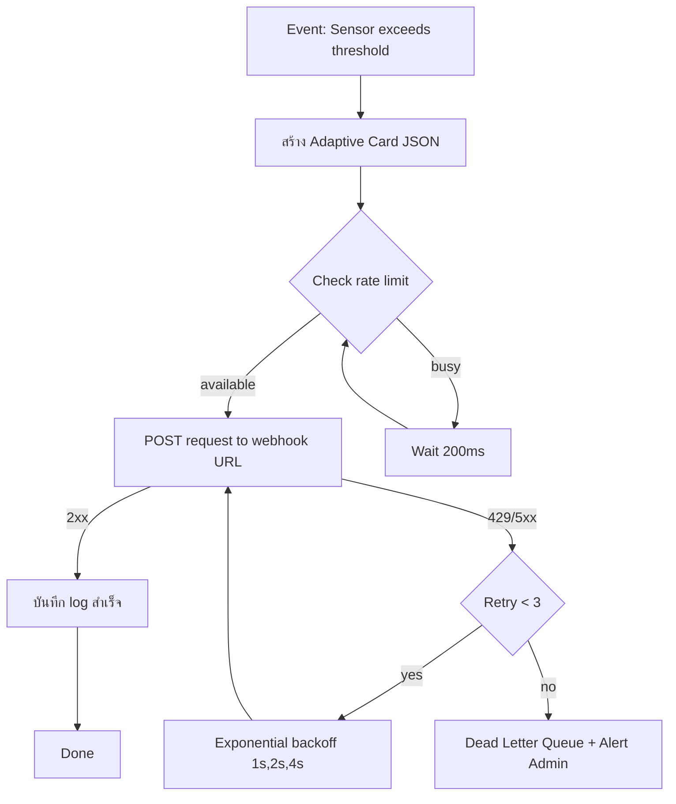
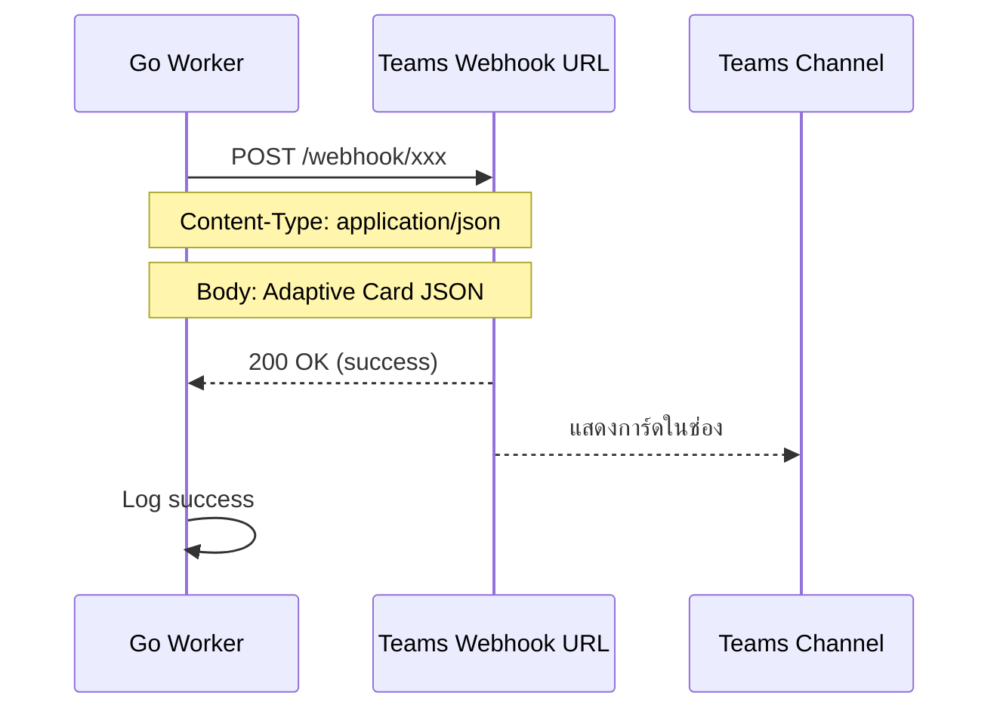

# Module 29: pkg/msteams (Microsoft Teams Webhook Notification)

## สำหรับโฟลเดอร์ `internal/pkg/msteams/` และ `internal/repository/`

ไฟล์ที่เกี่ยวข้อง:
- `internal/pkg/msteams/client.go`
- `internal/pkg/msteams/sender.go`
- `internal/pkg/msteams/card_builder.go`
- `internal/pkg/msteams/worker.go`
- `internal/pkg/msteams/retry.go`
- `internal/pkg/msteams/rate_limiter.go`
- `internal/repository/msteams_log.go`
- `migrations/msteams_logs.sql`

---

## หลักการ (Concept)

### Microsoft Teams Webhook Notification คืออะไร?

Microsoft Teams Webhook เป็นวิธีส่งข้อความอัตโนมัติเข้าไปยังช่อง (channel) ใน Microsoft Teams โดยใช้ **Incoming Webhook** connector ซึ่งเป็น URL พิเศษที่สร้างจาก Teams channel (Settings → Connectors → Incoming Webhook) ระบบของเราส่ง HTTP POST request พร้อม payload ในรูปแบบ JSON ตาม **MessageCard** หรือ **Adaptive Card** structure ไปยัง webhook URL นั้น Teams จะแสดงการแจ้งเตือนใน channel ทันที เหมาะสำหรับการแจ้งเตือนระบบ, รายงาน, และ alert จาก CMON IoT.

### มีกี่แบบ? (Teams Notification Methods)

| Method | ลักษณะ | ข้อดี | ข้อเสีย | เหมาะกับ |
|--------|--------|------|---------|----------|
| **Incoming Webhook** | HTTP POST ไปยัง URL ของ connector | ง่ายมาก, ตั้งค่าใน Teams UI ได้เลย, ฟรี | รองรับเฉพาะการส่งข้อความทางเดียว, ไม่รองรับ interactive (กดปุ่ม) | แจ้งเตือน, รายงาน, alert |
| **Adaptive Card via Webhook** | ใช้ Adaptive Card JSON (รูปแบบรวยกว่า MessageCard) | UI สวยงาม, รองรับรูปภาพ, fields, actions (เปิด URL) | ซับซ้อนกว่า MessageCard, ไม่รองรับการตอบกลับแบบ interactive (ยกเว้น openUrl) | รายงาน, การแจ้งเตือนแบบมีรายละเอียด |
| **Bot + Graph API** | สร้าง bot ใน Azure แล้วส่งข้อความผ่าน Graph API | รองรับสองทาง, interactive, อ่านข้อความในช่องได้ | ซับซ้อน, ต้องจดทะเบียนแอป Azure, จัดการ token | ระบบที่มี interaction (ตอบกลับ, กดปุ่ม) |
| **Activity Feed** | ส่ง notification ไปยัง activity feed ของผู้ใช้ | แจ้งเตือนส่วนตัว | ซับซ้อน, ต้องมี bot | แจ้งเตือนเฉพาะบุคคล |

**ข้อห้ามสำคัญ:** ห้ามใช้ Bucket Pattern ร่วมกับ Time Series Collections เพราะจะลดประสิทธิภาพ — แต่สำหรับ Teams module นี้ไม่เกี่ยวข้อง

### ใช้อย่างไร / นำไปใช้กรณีไหน

1. **Alert แบบ Real‑time** – แจ้งเตือนไปยังช่อง Teams Operations เมื่ออุณหภูมิเกิน 35°C, น้ำรั่ว, ควันไฟ
2. **Scheduled Reports** – ส่งสรุปสถานะ Data Center รายวัน/สัปดาห์ (Adaptive Card)
3. **Deployment Notifications** – แจ้งเมื่อมีการ deploy ใหม่ (CI/CD pipeline)
4. **Incident Response** – แจ้งเตือนทีมงานพร้อมลิงก์ไปยัง dashboard
5. **System Monitoring** – แจ้งเตือนเมื่อ service มีปัญหา (DB down, disk full)

### ประโยชน์ที่ได้รับ

- **ง่ายมาก** – สร้าง webhook ได้ใน 1 นาทีผ่าน Teams UI (ไม่ต้องเขียนโค้ดฝั่ง Teams)
- **Rich cards** – รองรับ MessageCard และ Adaptive Card (รูปภาพ, fields, สี, เปิด URL)
- **Rate limit ชัดเจน** – ตาม Microsoft Graph limit (~50 requests/second)
- **ฟรี** – ไม่มีค่าใช้จ่ายเพิ่มสำหรับ incoming webhook
- **Mentions** – รองรับ @mention ผู้ใช้หรือช่องทาง (ต้องใช้ bot สำหรับ mention จริงๆ)
- **Security** – Webhook URL เป็นความลับ, รองรับ HTTPS

### ข้อควรระวัง

- **Webhook URL ต้องเป็นความลับ** – ถ้ารั่วไหลจะมีคน spam ช่องได้
- **Rate limit** – ประมาณ 30-50 requests/วินาที ต่อ webhook (อาจต่ำกว่านี้)
- **Retry mechanism** – ควรทำ retry ด้วย exponential backoff
- **Payload size** – จำกัดประมาณ 4KB สำหรับ MessageCard, 16KB สำหรับ Adaptive Card
- **No interactive actions** – Incoming webhook ไม่รองรับการส่งข้อมูลกลับ (ต้องใช้ bot)
- **Adaptive Card complexity** – JSON ค่อนข้างซับซ้อน ควรใช้ builder pattern
- **MessageCard deprecated?** – Microsoft แนะนำ Adaptive Card แทน MessageCard (แต่ MessageCard ยังใช้ได้)

### ข้อดี
- ตั้งค่าง่ายมาก, rich cards, ฟรี, รองรับ Adaptive Card สวยงาม

### ข้อเสีย
- ไม่รองรับ two‑way interaction (เว้นแต่ใช้ bot), rate limit ปานกลาง, URL ต้องรักษาความลับ

### ข้อห้าม
- ห้าม expose webhook URL ใน client‑side code หรือ repository
- ห้ามส่งข้อความซ้ำเกิน rate limit โดยไม่มีการหน่วงเวลา
- ห้ามใช้ webhook สำหรับระบบที่ต้องการการตอบกลับแบบโต้ตอบ (ควรใช้ bot)
- ห้ามส่งข้อมูลอ่อนไหวใน plain text


## การออกแบบ Workflow และ Dataflow

### Workflow: การส่งข้อความผ่าน Teams Webhook



**รูปที่ 47:** ขั้นตอนการส่งข้อความ Teams ผ่าน incoming webhook เมื่อเซนเซอร์เกิน threshold

### Dataflow: Teams Webhook Request/Response



**รูปที่ 48:** Sequence diagram แสดงการส่ง Adaptive Card ไปยัง Teams webhook endpoint


## ตัวอย่างโค้ดที่รันได้จริง

### 1. Client & Core Types – `client.go`

```go
// Package msteams provides Microsoft Teams webhook notification capabilities.
// Supports MessageCard and Adaptive Card payloads.
// ----------------------------------------------------------------
// แพ็คเกจ msteams ให้บริการการแจ้งเตือนทาง Microsoft Teams webhook
// รองรับ MessageCard และ Adaptive Card payloads
package msteams

import (
	"bytes"
	"context"
	"encoding/json"
	"fmt"
	"net/http"
	"time"
)

// WebhookConfig holds Teams webhook configuration.
// ----------------------------------------------------------------
// WebhookConfig เก็บค่ากำหนด webhook ของ Teams
type WebhookConfig struct {
	URL string // incoming webhook URL from Teams
}

// Client handles HTTP requests to Teams webhook.
// ----------------------------------------------------------------
// Client จัดการ HTTP requests ไปยัง Teams webhook
type Client struct {
	webhookURL string
	httpClient *http.Client
}

// NewClient creates a new Teams client from webhook URL.
// ----------------------------------------------------------------
// NewClient สร้าง Teams client ใหม่จาก webhook URL
func NewClient(webhookURL string) *Client {
	return &Client{
		webhookURL: webhookURL,
		httpClient: &http.Client{Timeout: 10 * time.Second},
	}
}

// Post sends a payload to Teams webhook.
// ----------------------------------------------------------------
// Post ส่ง payload ไปยัง Teams webhook
func (c *Client) Post(ctx context.Context, payload interface{}) (*http.Response, error) {
	jsonData, err := json.Marshal(payload)
	if err != nil {
		return nil, fmt.Errorf("marshal payload: %w", err)
	}
	req, err := http.NewRequestWithContext(ctx, "POST", c.webhookURL, bytes.NewBuffer(jsonData))
	if err != nil {
		return nil, err
	}
	req.Header.Set("Content-Type", "application/json")
	return c.httpClient.Do(req)
}
```

### 2. Sender & Payload Structures – `sender.go`

```go
package msteams

import (
	"context"
	"fmt"
)

// MessageCard represents the legacy Microsoft Teams message card.
// Deprecated: Use AdaptiveCard for new development.
// ----------------------------------------------------------------
// MessageCard แทน message card แบบเก่าของ Teams (ไม่แนะนำให้ใช้สำหรับการพัฒนาใหม่)
type MessageCard struct {
	Title       string              `json:"title,omitempty"`
	Text        string              `json:"text,omitempty"`
	ThemeColor  string              `json:"themeColor,omitempty"` // hex color without #
	Sections    []MessageCardSection `json:"sections,omitempty"`
	PotentialAction []interface{}   `json:"potentialAction,omitempty"`
}

// MessageCardSection represents a section in MessageCard.
// ----------------------------------------------------------------
// MessageCardSection แทน section ใน MessageCard
type MessageCardSection struct {
	Title string `json:"title,omitempty"`
	Text  string `json:"text,omitempty"`
	Facts []Fact `json:"facts,omitempty"`
}

// Fact represents a key-value pair in card sections.
// ----------------------------------------------------------------
// Fact แทนคู่ key-value ใน section ของ card
type Fact struct {
	Name  string `json:"name"`
	Value string `json:"value"`
}

// AdaptiveCard represents the modern Adaptive Card format.
// ----------------------------------------------------------------
// AdaptiveCard แทน Adaptive Card รูปแบบทันสมัย
type AdaptiveCard struct {
	Type     string                   `json:"type"`
	Version  string                   `json:"version"`
	Body     []AdaptiveCardElement    `json:"body"`
	Actions  []AdaptiveCardAction     `json:"actions,omitempty"`
}

// AdaptiveCardElement is the base interface for card elements.
// ----------------------------------------------------------------
// AdaptiveCardElement เป็น interface สำหรับ element ใน card
type AdaptiveCardElement interface {
	GetType() string
}

// TextBlock represents a text element.
// ----------------------------------------------------------------
// TextBlock แทน element ข้อความ
type TextBlock struct {
	Type      string `json:"type"`
	Text      string `json:"text"`
	Size      string `json:"size,omitempty"`      // small, default, medium, large, extraLarge
	Weight    string `json:"weight,omitempty"`    // lighter, default, bolder
	Color     string `json:"color,omitempty"`     // default, dark, light, accent, good, warning, attention
	Wrap      bool   `json:"wrap,omitempty"`
}

func (t TextBlock) GetType() string { return "TextBlock" }

// FactSet represents a set of facts (key-value pairs).
// ----------------------------------------------------------------
// FactSet แทนชุดของ fact (คู่ key-value)
type FactSet struct {
	Type  string `json:"type"`
	Facts []Fact `json:"facts"`
}

func (f FactSet) GetType() string { return "FactSet" }

// Image represents an image element.
// ----------------------------------------------------------------
// Image แทน element รูปภาพ
type Image struct {
	Type  string `json:"type"`
	URL   string `json:"url"`
	Size  string `json:"size,omitempty"` // auto, stretch, small, medium, large
	AltText string `json:"altText,omitempty"`
}

func (i Image) GetType() string { return "Image" }

// AdaptiveCardAction represents an action button.
// ----------------------------------------------------------------
// AdaptiveCardAction แทนปุ่ม action
type AdaptiveCardAction struct {
	Type  string                 `json:"type"`
	Title string                 `json:"title"`
	URL   string                 `json:"url,omitempty"`
	Data  map[string]interface{} `json:"data,omitempty"`
}

// Sender defines interface for sending Teams messages.
// ----------------------------------------------------------------
// Sender กำหนด interface สำหรับส่งข้อความ Teams
type Sender interface {
	SendAdaptiveCard(ctx context.Context, card *AdaptiveCard) error
	SendMessageCard(ctx context.Context, card *MessageCard) error
}

// WebhookSender implements Sender using Teams incoming webhook.
// ----------------------------------------------------------------
// WebhookSender อิมพลีเมนต์ Sender ด้วย Teams incoming webhook
type WebhookSender struct {
	client *Client
}

// NewWebhookSender creates a new webhook sender.
// ----------------------------------------------------------------
// NewWebhookSender สร้าง webhook sender ใหม่
func NewWebhookSender(webhookURL string) *WebhookSender {
	return &WebhookSender{
		client: NewClient(webhookURL),
	}
}

// SendAdaptiveCard sends an Adaptive Card to Teams.
// ----------------------------------------------------------------
// SendAdaptiveCard ส่ง Adaptive Card ไปยัง Teams
func (s *WebhookSender) SendAdaptiveCard(ctx context.Context, card *AdaptiveCard) error {
	// Adaptive Card wrapper for Teams webhook expects a specific structure
	// Teams webhook wrapper สำหรับ Adaptive Card คาดหวังโครงสร้างเฉพาะ
	payload := map[string]interface{}{
		"type": "message",
		"attachments": []map[string]interface{}{
			{
				"contentType": "application/vnd.microsoft.card.adaptive",
				"content":     card,
			},
		},
	}
	resp, err := s.client.Post(ctx, payload)
	if err != nil {
		return err
	}
	defer resp.Body.Close()
	if resp.StatusCode >= 200 && resp.StatusCode < 300 {
		return nil
	}
	return fmt.Errorf("teams returned status %d", resp.StatusCode)
}

// SendMessageCard sends a legacy MessageCard to Teams.
// ----------------------------------------------------------------
// SendMessageCard ส่ง MessageCard แบบเก่าไปยัง Teams
func (s *WebhookSender) SendMessageCard(ctx context.Context, card *MessageCard) error {
	resp, err := s.client.Post(ctx, card)
	if err != nil {
		return err
	}
	defer resp.Body.Close()
	if resp.StatusCode >= 200 && resp.StatusCode < 300 {
		return nil
	}
	return fmt.Errorf("teams returned status %d", resp.StatusCode)
}
```

### 3. Adaptive Card Builder – `card_builder.go`

```go
package msteams

// CardBuilder helps construct Adaptive Cards.
// ----------------------------------------------------------------
// CardBuilder ช่วยสร้าง Adaptive Card
type CardBuilder struct {
	card *AdaptiveCard
}

// NewCardBuilder creates a new Adaptive Card builder.
// ----------------------------------------------------------------
// NewCardBuilder สร้าง Adaptive Card builder ใหม่
func NewCardBuilder() *CardBuilder {
	return &CardBuilder{
		card: &AdaptiveCard{
			Type:    "AdaptiveCard",
			Version: "1.5",
			Body:    []AdaptiveCardElement{},
		},
	}
}

// AddText adds a text block.
// ----------------------------------------------------------------
// AddText เพิ่ม text block
func (b *CardBuilder) AddText(text string, size, weight, color string) *CardBuilder {
	b.card.Body = append(b.card.Body, TextBlock{
		Type:   "TextBlock",
		Text:   text,
		Size:   size,
		Weight: weight,
		Color:  color,
		Wrap:   true,
	})
	return b
}

// AddTitle adds a large title text.
// ----------------------------------------------------------------
// AddTitle เพิ่มข้อความหัวข้อขนาดใหญ่
func (b *CardBuilder) AddTitle(title string) *CardBuilder {
	return b.AddText(title, "large", "bolder", "default")
}

// AddSubtitle adds a medium subtitle.
// ----------------------------------------------------------------
// AddSubtitle เพิ่มข้อความรองขนาดกลาง
func (b *CardBuilder) AddSubtitle(subtitle string) *CardBuilder {
	return b.AddText(subtitle, "medium", "bolder", "default")
}

// AddFactSet adds a fact set (key-value pairs).
// ----------------------------------------------------------------
// AddFactSet เพิ่มชุด fact (คู่ key-value)
func (b *CardBuilder) AddFactSet(facts []Fact) *CardBuilder {
	b.card.Body = append(b.card.Body, FactSet{
		Type:  "FactSet",
		Facts: facts,
	})
	return b
}

// AddImage adds an image.
// ----------------------------------------------------------------
// AddImage เพิ่มรูปภาพ
func (b *CardBuilder) AddImage(url, altText string) *CardBuilder {
	b.card.Body = append(b.card.Body, Image{
		Type:    "Image",
		URL:     url,
		Size:    "medium",
		AltText: altText,
	})
	return b
}

// AddSeparator adds a horizontal separator line.
// ----------------------------------------------------------------
// AddSeparator เพิ่มเส้นคั่นแนวนอน
func (b *CardBuilder) AddSeparator() *CardBuilder {
	b.card.Body = append(b.card.Body, TextBlock{
		Type: "TextBlock",
		Text: "---",
	})
	return b
}

// AddOpenURLAction adds an action button that opens a URL.
// ----------------------------------------------------------------
// AddOpenURLAction เพิ่มปุ่ม action ที่เปิด URL
func (b *CardBuilder) AddOpenURLAction(title, url string) *CardBuilder {
	if b.card.Actions == nil {
		b.card.Actions = []AdaptiveCardAction{}
	}
	b.card.Actions = append(b.card.Actions, AdaptiveCardAction{
		Type:  "Action.OpenUrl",
		Title: title,
		URL:   url,
	})
	return b
}

// Build returns the constructed AdaptiveCard.
// ----------------------------------------------------------------
// Build คืน AdaptiveCard ที่สร้างขึ้น
func (b *CardBuilder) Build() *AdaptiveCard {
	return b.card
}
```

### 4. Teams Worker with Retry & Queue – `worker.go`

```go
package msteams

import (
	"context"
	"log"
	"sync"
	"time"

	"github.com/google/uuid"
)

// TeamsJob represents a queued Teams message task.
// ----------------------------------------------------------------
// TeamsJob แทนงาน Teams message ที่อยู่ในคิว
type TeamsJob struct {
	ID         string
	Card       *AdaptiveCard
	RetryCount int
	NextRetry  time.Time
}

// TeamsWorker handles background Teams messaging with retries.
// ----------------------------------------------------------------
// TeamsWorker จัดการการส่งข้อความ Teams ในพื้นหลังพร้อม retry
type TeamsWorker struct {
	sender      Sender
	queue       chan *TeamsJob
	retryQueue  chan *TeamsJob
	rateLimiter *RateLimiter
	wg          sync.WaitGroup
	stopCh      chan struct{}
}

// NewTeamsWorker creates a new Teams worker.
// ----------------------------------------------------------------
// NewTeamsWorker สร้าง Teams worker ใหม่
func NewTeamsWorker(sender Sender, queueSize int) *TeamsWorker {
	return &TeamsWorker{
		sender:      sender,
		queue:       make(chan *TeamsJob, queueSize),
		retryQueue:  make(chan *TeamsJob, queueSize),
		rateLimiter: NewRateLimiter(5, 10), // 5 requests/sec
		stopCh:      make(chan struct{}),
	}
}

// Start begins the worker goroutines.
// ----------------------------------------------------------------
// Start เริ่ม worker goroutines
func (w *TeamsWorker) Start(ctx context.Context, numWorkers int) {
	for i := 0; i < numWorkers; i++ {
		w.wg.Add(1)
		go w.worker(ctx)
	}
	go w.retryProcessor(ctx)
	log.Printf("TeamsWorker started with %d workers", numWorkers)
}

// Stop gracefully shuts down the worker.
// ----------------------------------------------------------------
// Stop ปิด worker อย่างนุ่มนวล
func (w *TeamsWorker) Stop() {
	close(w.stopCh)
	w.wg.Wait()
}

// Enqueue adds a Teams job to the queue.
// ----------------------------------------------------------------
// Enqueue เพิ่ม Teams job เข้าคิว
func (w *TeamsWorker) Enqueue(job *TeamsJob) {
	select {
	case w.queue <- job:
	default:
		log.Printf("Teams queue full, dropping job %s", job.ID)
	}
}

func (w *TeamsWorker) worker(ctx context.Context) {
	defer w.wg.Done()
	for {
		select {
		case <-ctx.Done():
			return
		case <-w.stopCh:
			return
		case job := <-w.queue:
			w.processJob(ctx, job)
		}
	}
}

func (w *TeamsWorker) processJob(ctx context.Context, job *TeamsJob) {
	// Wait for rate limiter
	if err := w.rateLimiter.Wait(ctx); err != nil {
		return
	}
	err := w.sender.SendAdaptiveCard(ctx, job.Card)
	if err != nil {
		log.Printf("Teams send failed: %v, retry=%d, jobID=%s", err, job.RetryCount, job.ID)
		if job.RetryCount < 3 {
			job.RetryCount++
			job.NextRetry = time.Now().Add(time.Duration(job.RetryCount) * time.Second)
			w.retryQueue <- job
		} else {
			log.Printf("Teams job %s failed after 3 retries", job.ID)
		}
	}
}

func (w *TeamsWorker) retryProcessor(ctx context.Context) {
	ticker := time.NewTicker(1 * time.Second)
	defer ticker.Stop()
	for {
		select {
		case <-ctx.Done():
			return
		case <-w.stopCh:
			return
		case <-ticker.C:
			w.processRetries()
		}
	}
}

func (w *TeamsWorker) processRetries() {
	for {
		select {
		case job := <-w.retryQueue:
			if time.Now().After(job.NextRetry) {
				w.queue <- job
			} else {
				go func(j *TeamsJob) {
					time.Sleep(time.Until(j.NextRetry))
					w.retryQueue <- j
				}(job)
			}
		default:
			return
		}
	}
}
```

### 5. Rate Limiter & Retry – `rate_limiter.go` and `retry.go`

```go
package msteams

import (
	"context"
	"sync"
	"time"
)

// RateLimiter implements token bucket for Teams webhook.
// ----------------------------------------------------------------
// RateLimiter จำกัดอัตราการส่ง Teams webhook
type RateLimiter struct {
	tokens     int
	burst      int
	rate       float64
	lastRefill time.Time
	mu         sync.Mutex
}

// NewRateLimiter creates a rate limiter.
// ----------------------------------------------------------------
// NewRateLimiter สร้าง rate limiter ใหม่
func NewRateLimiter(requestsPerSec float64, burst int) *RateLimiter {
	return &RateLimiter{
		tokens:     burst,
		burst:      burst,
		rate:       requestsPerSec,
		lastRefill: time.Now(),
	}
}

// Wait blocks until a token is available.
// ----------------------------------------------------------------
// Wait บล็อกจนกว่าจะมี token พร้อม
func (r *RateLimiter) Wait(ctx context.Context) error {
	for {
		select {
		case <-ctx.Done():
			return ctx.Err()
		default:
		}
		r.mu.Lock()
		r.refill()
		if r.tokens > 0 {
			r.tokens--
			r.mu.Unlock()
			return nil
		}
		r.mu.Unlock()
		time.Sleep(100 * time.Millisecond)
	}
}

func (r *RateLimiter) refill() {
	now := time.Now()
	elapsed := now.Sub(r.lastRefill).Seconds()
	newTokens := int(elapsed * r.rate)
	if newTokens > 0 {
		r.tokens += newTokens
		if r.tokens > r.burst {
			r.tokens = r.burst
		}
		r.lastRefill = now
	}
}

// RetryPolicy defines retry behavior.
// ----------------------------------------------------------------
// RetryPolicy กำหนดพฤติกรรมการ retry
type RetryPolicy struct {
	MaxRetries int
	BaseDelay  time.Duration
	MaxDelay   time.Duration
}

// DefaultRetryPolicy returns a sensible default.
// ----------------------------------------------------------------
// DefaultRetryPolicy คืนค่า retry policy ที่เหมาะสม
func DefaultRetryPolicy() *RetryPolicy {
	return &RetryPolicy{
		MaxRetries: 3,
		BaseDelay:  time.Second,
		MaxDelay:   30 * time.Second,
	}
}

// Backoff calculates the delay for a given retry attempt.
// ----------------------------------------------------------------
// Backoff คำนวณ delay สำหรับการ retry ครั้งที่กำหนด
func (p *RetryPolicy) Backoff(attempt int) time.Duration {
	delay := p.BaseDelay * time.Duration(1<<uint(attempt-1))
	if delay > p.MaxDelay {
		delay = p.MaxDelay
	}
	return delay
}
```

### 6. Teams Log Model – `internal/models/msteams_log.go`

```go
package models

import "time"

// MSTeamsLog stores Microsoft Teams webhook message history.
// ----------------------------------------------------------------
// MSTeamsLog เก็บประวัติการส่งข้อความ Teams webhook
type MSTeamsLog struct {
	BaseModel
	WebhookURL string    `gorm:"type:text"`
	CardType   string    // adaptive, messagecard
	Title      string
	Status     string    // pending, sent, failed
	Error      string
	SentAt     time.Time
}
```

### 7. Migration SQL – `migrations/msteams_logs.up.sql`

```sql
CREATE TABLE IF NOT EXISTS msteams_logs (
    id BIGSERIAL PRIMARY KEY,
    webhook_url TEXT NOT NULL,
    card_type VARCHAR(20) NOT NULL,
    title TEXT,
    status VARCHAR(20) NOT NULL,
    error TEXT,
    sent_at TIMESTAMP NOT NULL,
    created_at TIMESTAMP NOT NULL DEFAULT CURRENT_TIMESTAMP,
    updated_at TIMESTAMP NOT NULL DEFAULT CURRENT_TIMESTAMP,
    deleted_at TIMESTAMP
);

CREATE INDEX idx_msteams_logs_status ON msteams_logs(status);
CREATE INDEX idx_msteams_logs_sent_at ON msteams_logs(sent_at);
```

**migrations/msteams_logs.down.sql**
```sql
DROP TABLE IF EXISTS msteams_logs;
```


## วิธีใช้งาน module นี้

### การติดตั้ง

```bash
go get github.com/google/uuid
```

### การตั้งค่า configuration

```go
webhookURL := os.Getenv("TEAMS_WEBHOOK_URL") // from Teams channel
sender := msteams.NewWebhookSender(webhookURL)
worker := msteams.NewTeamsWorker(sender, 1000)
worker.Start(context.Background(), 3)
defer worker.Stop()
```

### การรวมกับ GORM

```go
db.AutoMigrate(&models.MSTeamsLog{})
```

### การใช้งานจริง (ตัวอย่างใน rule engine)

```go
// สร้าง Adaptive Card
card := msteams.NewCardBuilder().
    AddTitle("🚨 High Temperature Alert").
    AddText("Temperature exceeded threshold in Data Center", "default", "default", "attention").
    AddFactSet([]msteams.Fact{
        {Name: "Device", Value: "Rack A1 Sensor"},
        {Name: "Temperature", Value: "36.5°C"},
        {Name: "Threshold", Value: "35.0°C"},
        {Name: "Timestamp", Value: time.Now().Format("2006-01-02 15:04:05")},
    }).
    AddOpenURLAction("View Dashboard", "https://monitoring.cmon.local/dashboard").
    Build()

job := &msteams.TeamsJob{
    ID:   uuid.New().String(),
    Card: card,
}
worker.Enqueue(job)
```


## ตารางสรุป Components

| Component | หน้าที่ | ตัวอย่าง |
|-----------|--------|----------|
| `Client` | HTTP client สำหรับ webhook | `Post()` |
| `WebhookSender` | ส่ง Adaptive Card หรือ MessageCard | `SendAdaptiveCard()` |
| `CardBuilder` | สร้าง Adaptive Card แบบ builder pattern | `AddTitle()`, `AddFactSet()`, `Build()` |
| `TeamsWorker` | จัดการคิวและ retry อัตโนมัติ | `Enqueue()`, `Start()` |
| `RateLimiter` | จำกัดอัตราส่ง 5 request/วินาที | `Wait()` |
| `MSTeamsLog` | เก็บประวัติการส่งข้อความ | `models.MSTeamsLog` |


## แบบฝึกหัดท้าย module (5 ข้อ)

1. เพิ่มฟังก์ชัน `SendMessageCard` ใน `WebhookSender` และสร้าง `MessageCardBuilder` สำหรับ legacy card
2. Implement `SendBatch` ที่รับ slice ของ Adaptive Card และส่งแต่ละ card ด้วย rate limiter แบบ async
3. สร้าง `CardTemplate` helper ที่ใช้ Go template เพื่อสร้าง Adaptive Card จาก template แทนการ hardcode
4. เพิ่มการรองรับ `Action.Submit` สำหรับ interactive webhook (ต้องมี bot endpoint เพื่อรับ response)
5. เขียนฟังก์ชัน `FormatAsAdaptiveCard` ที่แปลง struct ใดๆ ให้เป็น Adaptive Card โดยอัตโนมัติ (reflection)


## แหล่งอ้างอิง

- [Microsoft Teams Incoming Webhooks documentation](https://learn.microsoft.com/en-us/microsoftteams/platform/webhooks-and-connectors/how-to/add-incoming-webhook)
- [Adaptive Cards for Teams](https://learn.microsoft.com/en-us/microsoftteems/platform/task-modules-and-cards/cards/cards-adaptive)
- [Adaptive Card schema explorer](https://adaptivecards.io/explorer/)
- [MessageCard reference (deprecated)](https://learn.microsoft.com/en-us/outlook/actionable-messages/message-card-reference)
- [Teams webhook rate limits](https://learn.microsoft.com/en-us/microsoftteams/platform/webhooks-and-connectors/how-to/connectors-using?tabs=cURL#rate-limiting-for-connectors)

---

**หมายเหตุ:** module นี้ครบถ้วนสำหรับ `pkg/msteams` สำหรับระบบ gobackend หากต้องการ module เพิ่มเติม (เช่น `pkg/slack`, `pkg/signal`, `pkg/whatsapp_business`) โปรดแจ้ง