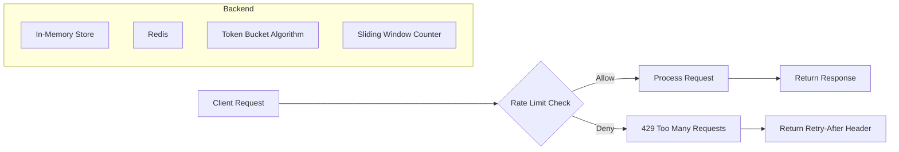

# Module 23: pkg/ratelimit

## สำหรับโฟลเดอร์ `pkg/ratelimit/`

ไฟล์ที่เกี่ยวข้อง:
- `limiter.go` – Core interface และ rate limiter implementation (token bucket, sliding window)
- `redis.go` – Redis-based distributed rate limiter (sliding window + Lua)
- `middleware.go` – HTTP middleware สำหรับ Gin, Echo, net/http
- `config.go` – Configuration management
- `options.go` – Functional options สำหรับ custom limiter
- `metrics.go` – Prometheus metrics integration
- `gorm.go` – GORM plugin สำหรับ rate limit database queries
- `example_main.go` – ตัวอย่างการใช้งานครบวงจร

---

## หลักการ (Concept)

### Rate Limiting คืออะไร?
Rate limiting เป็นเทคนิคในการจำกัดจำนวน request ที่ client หรือ user สามารถส่งไปยังระบบในช่วงเวลาที่กำหนด (เช่น 100 request ต่อวินาที) เพื่อป้องกันการใช้งานทรัพยากรเกินขีดจำกัด (overload) ป้องกัน DDoS, ปรับปรุงเสถียรภาพ และควบคุมค่าใช้จ่าย (API costing)

### มีกี่แบบ? (Rate Limiting Algorithms)

| Algorithm | หลักการ | ข้อดี | ข้อเสีย | เหมาะกับ |
|-----------|---------|------|--------|----------|
| **Token Bucket** | bucket มี token จำนวนคงที่ แต่ละ request ใช้ 1 token, เติม token เป็นระยะ | burst รองรับได้, implementation ง่าย | ต้อง tuning อัตราการเติม | API gateway, general purpose |
| **Leaky Bucket** | request เข้าคิว ออกด้วยอัตราคงที่ | smoothing burst, memory bound | latency เพิ่ม | queue management |
| **Fixed Window** | นับ request ภายใน window เวลาคงที่ (เช่น 1 นาที) | ง่ายสุด, memory น้อย | edge case burst ที่ขอบ window | basic rate limiting |
| **Sliding Window** | ใช้ timestamp ของ request แต่ละรายการใน window เลื่อน | แม่นยำ, burst จำกัด | memory มากกว่า fixed window | production-grade |
| **Sliding Log** | เก็บ log timestamp ทุก request คำนวณ count ใน window | แม่นยำสูง | memory และ CPU มาก | advanced use cases |
| **GCRA (Generic Cell Rate Algorithm)** | เว้นระยะ request ตามเวลาที่คำนวณ | ป้องกัน burst ได้ดี, ใช้ใน VoIP | ซับซ้อน | low latency systems |

**ข้อห้ามสำคัญ:** ห้ามใช้ fixed window rate limiter โดยไม่มีการเพิ่ม jitter หรือ random ในระบบ distributed เพราะจะทำให้เกิด synchronized traffic spike ตอน start ของ window

### ใช้อย่างไร / นำไปใช้กรณีไหน

**กรณีใช้งานหลัก:**
- **API rate limiting** – จำกัดจำนวน request ต่อ user, IP, API key
- **Login throttling** – ป้องกัน brute force password
- **Webhook protection** – จำกัดการเรียก webhook endpoint
- **Database query limiting** – ป้องกัน runaway queries
- **Resource protection** – จำกัดการใช้ CPU, memory, network bandwidth
- **Fairness guarantee** – กระจายทรัพยากรอย่างเป็นธรรม

### ประโยชน์ที่ได้รับ
- **Prevent overload** – ป้องกันระบบล่มจาก request จำนวนมาก
- **Reduce cost** – จำกัดการใช้ API แบบ pay-per-request
- **Improve availability** – ทำให้ระบบยังตอบสนองแก่ user ทุกคน
- **Defense against abuse** – ป้องกัน DDoS, scraping, brute force
- **SLA enforcement** – รับประกัน服务质量 (QoS)

### ข้อควรระวัง
- **Distributed consistency** – rate limiter ที่ใช้ in-memory ไม่ work ใน multi-instance environment ต้องใช้ Redis หรือ centralized store
- **Over-limiting** – ตั้งค่าต่ำเกินไปอาจ reject user ที่ legitimate
- **Latency overhead** – ทุก request ต้องตรวจสอบ rate limit (โดยเฉพาะ Redis)
- **Burst handling** – burst ที่สั้นมากอาจผ่าน token bucket ได้ แต่ไม่ผ่าน sliding window
- **Clock skew** – ใน distributed system เวลาของเครื่องไม่ตรงกันอาจทำให้ rate limit คลาดเคลื่อน

### ข้อดี
- **Improves system stability** – ป้องกัน traffic spikes
- **Easy to implement** – มี library พร้อมใช้หลายตัว
- **Observable** – สามารถเพิ่ม metrics และ logging
- **Configurable per endpoint/user** – ยืดหยุ่นตาม business rules

### ข้อเสีย
- **Additional infrastructure** – distributed limiter ต้องพึ่ง Redis หรือ database
- **Complexity** – advanced algorithms (sliding log, GCRA) ยากต่อ tuning
- **False positives** – user อาจถูก block โดยไม่ตั้งใจ
- **Cold start problem** – rate limiter ที่เพิ่งเริ่มต้นอาจปล่อย request เกิน

### ข้อห้าม
**ห้ามใช้ rate limiter แทน authentication หรือ authorization** – rate limiting เป็นเพียงการจำกัดปริมาณ ไม่ใช่การตรวจสอบสิทธิ์

**ห้ามใช้ in-memory rate limiter ในระบบที่มีหลาย instance โดยไม่มีการ synchronize** – แต่ละ instance จะมี counter ของตัวเอง ทำให้ limit โดยรวมเกิน

---

## การออกแบบ Workflow และ Dataflow



**Dataflow ใน Go application (local + distributed):**
1. Client ส่ง request พร้อม identifier (IP, API key, user ID)
2. Rate limiter คำนวณ key (namespace + identifier)
3. ตรวจสอบ current counter ใน store (local cache หรือ Redis)
4. ถ้าเกิน limit → return error (429) พร้อม Retry-After
5. ถ้าไม่เกิน → increment counter, allow request

---

## ตัวอย่างโค้ดที่รันได้จริง

### โครงสร้างโปรเจกต์
```
pkg/ratelimit/
├── limiter.go          # Core interface
├── tokenbucket.go      # Token bucket implementation
├── slidingwindow.go    # Sliding window (local + Redis)
├── redis.go            # Redis-based limiter (Lua)
├── middleware.go       # HTTP middleware
├── config.go
├── options.go
├── metrics.go
├── gorm.go
└── example_main.go
```

### 1. การติดตั้ง Dependencies

```bash
go get golang.org/x/time/rate
go get github.com/redis/go-redis/v9
go get github.com/gin-gonic/gin
go get github.com/prometheus/client_golang
```

### 2. การติดตั้ง Redis (สำหรับ distributed rate limit)

```yaml
# docker-compose.yml
version: '3.8'
services:
  redis:
    image: redis:7-alpine
    ports:
      - "6379:6379"
```

### 3. ตัวอย่างโค้ด: Core Interface

```go
// limiter.go
package ratelimit

import (
    "context"
    "time"
)

// RateLimiter is the main interface for rate limiting.
type RateLimiter interface {
    // Allow checks if a request is allowed for the given key.
    Allow(ctx context.Context, key string) (bool, error)

    // AllowN checks if n requests are allowed.
    AllowN(ctx context.Context, key string, n int) (bool, error)

    // Limit returns the current limit configuration for a key.
    Limit(ctx context.Context, key string) (LimitInfo, error)

    // Close releases resources.
    Close() error
}

// LimitInfo contains information about current rate limit status.
type LimitInfo struct {
    Limit     int           // max requests per window
    Remaining int           // remaining requests in current window
    Reset     time.Time     // time when limit resets
    RetryAfter time.Duration // suggested wait time
}
```

### 4. ตัวอย่างโค้ด: Token Bucket (Local)

```go
// tokenbucket.go
package ratelimit

import (
    "context"
    "sync"
    "time"

    "golang.org/x/time/rate"
)

type TokenBucketLimiter struct {
    limiters sync.Map
    rate     rate.Limit
    burst    int
}

func NewTokenBucketLimiter(rps int, burst int) *TokenBucketLimiter {
    return &TokenBucketLimiter{
        rate:  rate.Limit(rps),
        burst: burst,
    }
}

func (l *TokenBucketLimiter) getLimiter(key string) *rate.Limiter {
    if val, ok := l.limiters.Load(key); ok {
        return val.(*rate.Limiter)
    }
    limiter := rate.NewLimiter(l.rate, l.burst)
    l.limiters.Store(key, limiter)
    return limiter
}

func (l *TokenBucketLimiter) Allow(ctx context.Context, key string) (bool, error) {
    return l.AllowN(ctx, key, 1)
}

func (l *TokenBucketLimiter) AllowN(ctx context.Context, key string, n int) (bool, error) {
    limiter := l.getLimiter(key)
    return limiter.AllowN(time.Now(), n), nil
}

func (l *TokenBucketLimiter) Limit(ctx context.Context, key string) (LimitInfo, error) {
    limiter := l.getLimiter(key)
    return LimitInfo{
        Limit:     l.burst,
        Remaining: int(limiter.Tokens()),
        Reset:     time.Now().Add(time.Second),
    }, nil
}

func (l *TokenBucketLimiter) Close() error {
    return nil
}
```

### 5. ตัวอย่างโค้ด: Redis Sliding Window (Lua)

```go
// redis.go
package ratelimit

import (
    "context"
    "fmt"
    "time"

    "github.com/redis/go-redis/v9"
)

type RedisSlidingWindowLimiter struct {
    client *redis.Client
    limit  int           // max requests per window
    window time.Duration // time window (e.g., 1 minute)
}

func NewRedisSlidingWindowLimiter(client *redis.Client, limit int, window time.Duration) *RedisSlidingWindowLimiter {
    return &RedisSlidingWindowLimiter{
        client: client,
        limit:  limit,
        window: window,
    }
}

// Lua script for sliding window counter
// KEYS[1] = rate limit key
// ARGV[1] = current timestamp in ms
// ARGV[2] = window size in ms
// ARGV[3] = max requests per window
// ARGV[4] = current count increment (usually 1)
const slidingWindowScript = `
local key = KEYS[1]
local now = tonumber(ARGV[1])
local window = tonumber(ARGV[2])
local limit = tonumber(ARGV[3])
local increment = tonumber(ARGV[4])

-- Remove entries older than window
redis.call('ZREMRANGEBYSCORE', key, 0, now - window)

-- Get current count
local count = redis.call('ZCARD', key)

if count + increment > limit then
    local oldest = redis.call('ZRANGE', key, 0, 0, 'WITHSCORES')
    local retryAfter = 0
    if #oldest > 0 then
        retryAfter = window - (now - tonumber(oldest[2])) / 1000
    end
    return {0, retryAfter, limit - count}
end

-- Add current request
redis.call('ZADD', key, now, now .. ':' .. math.random())
-- Set TTL to window to avoid memory leaks
redis.call('PEXPIRE', key, window)

return {1, 0, limit - (count + increment)}
`

func (l *RedisSlidingWindowLimiter) Allow(ctx context.Context, key string) (bool, error) {
    return l.AllowN(ctx, key, 1)
}

func (l *RedisSlidingWindowLimiter) AllowN(ctx context.Context, key string, n int) (bool, error) {
    now := time.Now().UnixMilli()
    windowMs := l.window.Milliseconds()

    script := redis.NewScript(slidingWindowScript)
    result, err := script.Run(ctx, l.client, []string{key}, now, windowMs, l.limit, n).Result()
    if err != nil {
        return false, err
    }

    arr := result.([]interface{})
    allowed := arr[0].(int64) == 1
    return allowed, nil
}

func (l *RedisSlidingWindowLimiter) Limit(ctx context.Context, key string) (LimitInfo, error) {
    now := time.Now()
    windowMs := l.window.Milliseconds()

    // Get current count via ZCOUNT
    cutoff := now.Add(-l.window).UnixMilli()
    count, err := l.client.ZCount(ctx, key, fmt.Sprintf("%d", cutoff), "+inf").Result()
    if err != nil {
        return LimitInfo{}, err
    }

    // Estimate remaining
    remaining := l.limit - int(count)
    if remaining < 0 {
        remaining = 0
    }

    // Estimate reset time (oldest request time + window)
    oldest, err := l.client.ZRangeWithScores(ctx, key, 0, 0).Result()
    reset := now.Add(l.window)
    if len(oldest) > 0 {
        reset = time.UnixMilli(int64(oldest[0].Score)).Add(l.window)
    }

    return LimitInfo{
        Limit:     l.limit,
        Remaining: remaining,
        Reset:     reset,
    }, nil
}

func (l *RedisSlidingWindowLimiter) Close() error {
    return l.client.Close()
}
```

### 6. ตัวอย่างโค้ด: HTTP Middleware (net/http)

```go
// middleware.go
package ratelimit

import (
    "net/http"
    "strconv"
)

func RateLimitMiddleware(limiter RateLimiter, keyFunc func(r *http.Request) string) func(http.Handler) http.Handler {
    return func(next http.Handler) http.Handler {
        return http.HandlerFunc(func(w http.ResponseWriter, r *http.Request) {
            key := keyFunc(r)
            allowed, err := limiter.Allow(r.Context(), key)
            if err != nil {
                http.Error(w, "Rate limiter error", http.StatusInternalServerError)
                return
            }
            if !allowed {
                info, _ := limiter.Limit(r.Context(), key)
                w.Header().Set("X-RateLimit-Limit", strconv.Itoa(info.Limit))
                w.Header().Set("X-RateLimit-Remaining", strconv.Itoa(info.Remaining))
                w.Header().Set("X-RateLimit-Reset", strconv.FormatInt(info.Reset.Unix(), 10))
                w.Header().Set("Retry-After", strconv.Itoa(int(info.RetryAfter.Seconds())))
                http.Error(w, "Too Many Requests", http.StatusTooManyRequests)
                return
            }
            next.ServeHTTP(w, r)
        })
    }
}

// Example key functions
func KeyByIP(r *http.Request) string {
    return r.RemoteAddr
}

func KeyByAPIKey(r *http.Request) string {
    return r.Header.Get("X-API-Key")
}

func KeyByUserID(r *http.Request) string {
    // assuming user ID from JWT
    return r.Header.Get("X-User-ID")
}
```

### 7. ตัวอย่างโค้ด: Configuration

```go
// config.go
package ratelimit

import "time"

type Config struct {
    Enabled       bool
    Algorithm     string // "tokenbucket", "slidingwindow", "redis"
    RequestsPerSec int
    Burst         int
    Window        time.Duration
    RedisAddr     string
    RedisPassword string
    RedisDB       int
}

func DefaultConfig() Config {
    return Config{
        Enabled:        true,
        Algorithm:      "tokenbucket",
        RequestsPerSec: 100,
        Burst:          50,
        Window:         time.Minute,
        RedisAddr:      "localhost:6379",
    }
}
```

### 8. ตัวอย่างโค้ด: Prometheus Metrics

```go
// metrics.go
package ratelimit

import (
    "context"

    "github.com/prometheus/client_golang/prometheus"
)

type Metrics struct {
    requestsAllowed *prometheus.CounterVec
    requestsDenied  *prometheus.CounterVec
}

func NewMetrics(reg prometheus.Registerer) *Metrics {
    m := &Metrics{
        requestsAllowed: prometheus.NewCounterVec(
            prometheus.CounterOpts{
                Name: "ratelimit_requests_allowed_total",
                Help: "Total allowed requests",
            },
            []string{"key", "limiter"},
        ),
        requestsDenied: prometheus.NewCounterVec(
            prometheus.CounterOpts{
                Name: "ratelimit_requests_denied_total",
                Help: "Total denied requests",
            },
            []string{"key", "limiter"},
        ),
    }
    reg.MustRegister(m.requestsAllowed, m.requestsDenied)
    return m
}

func (m *Metrics) RecordAllowed(key, limiter string) {
    m.requestsAllowed.WithLabelValues(key, limiter).Inc()
}

func (m *Metrics) RecordDenied(key, limiter string) {
    m.requestsDenied.WithLabelValues(key, limiter).Inc()
}
```

### 9. ตัวอย่างการใช้งานรวมใน HTTP server

```go
// main.go
package main

import (
    "log"
    "net/http"

    "github.com/redis/go-redis/v9"
    "yourproject/pkg/ratelimit"
)

func main() {
    cfg := ratelimit.DefaultConfig()
    rdb := redis.NewClient(&redis.Options{Addr: cfg.RedisAddr})
    limiter := ratelimit.NewRedisSlidingWindowLimiter(rdb, 100, cfg.Window)

    mux := http.NewServeMux()
    mux.HandleFunc("/api/resource", func(w http.ResponseWriter, r *http.Request) {
        w.Write([]byte("success"))
    })

    // Apply rate limit middleware (by IP)
    handler := ratelimit.RateLimitMiddleware(limiter, ratelimit.KeyByIP)(mux)

    log.Println("server on :8080")
    http.ListenAndServe(":8080", handler)
}
```

---

## วิธีใช้งาน module นี้

1. เลือก algorithm และ backend (local token bucket หรือ Redis sliding window)
2. สร้าง limiter instance
3. ใน handler ให้เรียก `limiter.Allow(ctx, key)` ก่อนดำเนินการ
4. หรือใช้ middleware ที่ให้มา
5. กำหนด key function ให้เหมาะสม (IP, user ID, API key)

---

## การติดตั้ง

```bash
go get golang.org/x/time/rate
go get github.com/redis/go-redis/v9
```

---

## การตั้งค่า configuration

```go
cfg := ratelimit.Config{
    Enabled:        true,
    Algorithm:      "redis",
    RequestsPerSec: 100,
    Burst:          50,
    Window:         60 * time.Second,
    RedisAddr:      "localhost:6379",
}
```

Environment variables:
```bash
RATE_LIMIT_ENABLED=true
RATE_LIMIT_ALGO=redis
RATE_LIMIT_RPS=100
REDIS_ADDR=localhost:6379
```

---

## การรวมกับ GORM

ใช้ rate limiter เพื่อป้องกัน query flooding ต่อ user หรือ IP:

```go
// gorm.go
func RateLimitGORM(db *gorm.DB, limiter ratelimit.RateLimiter, key string) *gorm.DB {
    allowed, err := limiter.Allow(context.Background(), "db:"+key)
    if err != nil || !allowed {
        return db.Error // or return an error
    }
    return db
}

// usage
db = ratelimit.RateLimitGORM(db, limiter, userID)
db.Find(&users)
```

---

## การใช้งานจริง

### Example 1: Per-User Login Throttling

```go
func loginHandler(limiter ratelimit.RateLimiter) http.HandlerFunc {
    return func(w http.ResponseWriter, r *http.Request) {
        username := r.FormValue("username")
        key := "login:" + username
        allowed, _ := limiter.Allow(r.Context(), key)
        if !allowed {
            http.Error(w, "Too many login attempts", http.StatusTooManyRequests)
            return
        }
        // verify password...
    }
}
```

### Example 2: Distributed Rate Limiter with Redis and Gin

```go
import "github.com/gin-gonic/gin"

func main() {
    r := gin.Default()
    limiter := ratelimit.NewRedisSlidingWindowLimiter(redisClient, 100, time.Minute)
    r.Use(func(c *gin.Context) {
        key := c.ClientIP()
        allowed, _ := limiter.Allow(c.Request.Context(), key)
        if !allowed {
            c.AbortWithStatusJSON(429, gin.H{"error": "rate limit exceeded"})
            return
        }
        c.Next()
    })
    r.GET("/api", func(c *gin.Context) { c.String(200, "ok") })
    r.Run()
}
```

---

## ตารางสรุป Rate Limiting Components

| Component | คำอธิบาย | ตัวอย่าง |
|-----------|----------|----------|
| **TokenBucket** | algorithm ยอดนิยม รองรับ burst | `golang.org/x/time/rate` |
| **SlidingWindow** | แม่นยำกว่า fixed window | Redis Lua script |
| **RedisLimiter** | distributed rate limiter ใช้ Redis | ใช้ ZSET + Lua |
| **Middleware** | HTTP middleware สำหรับ Gin/Echo/Std | `RateLimitMiddleware` |
| **KeyFunc** | ฟังก์ชันสร้าง identifier | IP, API key, user ID |
| **Metrics** | Prometheus metrics สำหรับ monitoring | `ratelimit_requests_allowed_total` |
| **LimitInfo** | struct บอก status ปัจจุบัน | Limit, Remaining, Reset |

---

## แบบฝึกหัดท้าย module (5 ข้อ)

### ข้อ 1: Implement Fixed Window Counter (Local)

จง implement rate limiter แบบ fixed window โดยใช้ map และ mutex โดยกำหนด window ขนาด 1 นาที และ limit 100 requests ต่อ key เขียนฟังก์ชัน `Allow(key string) bool` และทดสอบ concurrent กับ goroutines 100 ตัว

### ข้อ 2: Redis Sliding Window with Different Granularity

เพิ่มความสามารถให้ RedisSlidingWindowLimiter รองรับการกำหนด window เป็น second, minute, hour โดยอัตโนมัติ (ใช้ TTL ตาม window) และเพิ่มฟังก์ชัน `ResetWindow` ที่รีเซ็ต counter สำหรับ key ใด ๆ (ใช้ ZREMRANGEBYSCORE)

###  ข้อ 3: Rate Limiter Middleware for Gin

เขียน middleware สำหรับ Gin framework ที่รองรับการ configure rate limit แยกตาม endpoint และ method (เช่น GET /api 100 req/min, POST /api 10 req/min) โดยใช้ Redis เป็น backend

### ข้อ 4: Adaptive Rate Limiting

สร้าง rate limiter ที่ปรับ limit อัตโนมัติตาม load ของระบบ (เช่น CPU > 80% → ลด limit เหลือครึ่งหนึ่ง) โดยใช้ token bucket และปรับ rate ผ่าน `SetLimit()` และ test โดยจำลอง CPU spike

### ข้อ 5: Benchmark Rate Limiting Algorithms

เขียน benchmark (go test -bench) เปรียบเทียบ performance ของ token bucket (local), fixed window, และ Redis sliding window ภายใต้并发 1000 goroutines และประเมิน memory usage และ latency ที่ P99

---

## แหล่งอ้างอิง

- [Rate Limiting Fundamentals](https://www.cloudflare.com/learning/bots/what-is-rate-limiting/)
- [Token Bucket Algorithm](https://en.wikipedia.org/wiki/Token_bucket)
- [Sliding Window Rate Limiter with Redis](https://redis.io/commands/zadd/#rate-limiting-example)
- [golang.org/x/time/rate documentation](https://pkg.go.dev/golang.org/x/time/rate)
- [Implementing Rate Limiting in Go](https://www.alexedwards.net/blog/how-to-rate-limit-http-requests)

---

**หมายเหตุ:** module นี้ครบถ้วนสำหรับ `pkg/ratelimit` สำหรับระบบ gobackend หากต้องการ module เพิ่มเติม (เช่น `pkg/circuitbreaker`, `pkg/retry`) โปรดแจ้ง