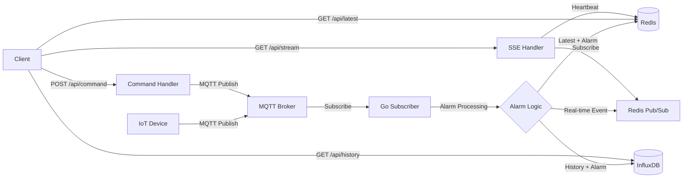

# Module 26: pkg/redis_realtime_mqtt_influxdb

## สำหรับโฟลเดอร์ `pkg/redis_realtime_mqtt_influxdb/`

ไฟล์ที่เกี่ยวข้อง:
- `client.go` – การสร้างและจัดการ Redis, MQTT, InfluxDB clients
- `subscriber.go` – การ subscribe MQTT topics, ประมวลผล alarm, บันทึกลง Redis และ InfluxDB
- `alarm.go` – ตรรกะการแจ้งเตือน (แปลงจาก TypeScript)
- `api.go` – REST API handlers: ดึงข้อมูลล่าสุด (Redis), stream แบบ interval, สั่งงานอุปกรณ์, ตรวจสอบการแจ้งเตือน
- `command.go` – การส่งคำสั่งไปยังอุปกรณ์ผ่าน MQTT
- `influxdb.go` – การเขียนข้อมูลลง InfluxDB (bucket, measurement, tags)
- `config.go` – การตั้งค่าการเชื่อมต่อทั้งหมด
- `examples/main.go` – ตัวอย่างการใช้งานครบวงจร

---

## หลักการ (Concept)

### Redis + MQTT + InfluxDB คืออะไร?
โมดูลนี้เป็นระบบรับข้อมูลจาก MQTT (IoT, sensors) โดยมี:
- **Redis** ใช้เป็น cache ชั้นแรก (in-memory) สำหรับเก็บค่าล่าสุดของเซ็นเซอร์และสถานะการแจ้งเตือนแบบ real-time รวมถึงเป็น message broker สำหรับ Pub/Sub ส่ง events ไปยัง SSE clients
- **InfluxDB** ใช้เป็น long-term time-series database สำหรับเก็บประวัติข้อมูลทั้งหมด (raw data + alarm status) เพื่อการวิเคราะห์ย้อนหลังและแสดงกราฟ
- **MQTT** ใช้รับข้อมูลจากอุปกรณ์และส่งคำสั่งกลับ

การแยกชั้น cache (Redis) และ persistent storage (InfluxDB) ช่วยให้:
- การอ่านค่าล่าสุดรวดเร็ว (microseconds)
- การ query ย้อนหลัง (history) ทำได้บน InfluxDB ที่ออกแบบมาสำหรับ time-series โดยเฉพาะ
- ลดภาระของ InfluxDB จากการ query บ่อย ๆ ที่ต้องการค่าล่าสุด

**ข้อห้ามสำคัญ:** ห้ามใช้ InfluxDB เป็น cache สำหรับค่าล่าสุดโดยตรง (ควรใช้ Redis) เพราะ InfluxDB มี latency สูงกว่าสำหรับการอ่านซ้ำ ๆ

### มีกี่แบบ? (Architecture Patterns)

| แบบ | คำอธิบาย | เหมาะกับ |
|-----|----------|----------|
| **Redis + InfluxDB (Push)** | Subscriber เขียนลงทั้ง Redis (latest) และ InfluxDB (history) | ระบบ production ที่ต้องการทั้ง real-time และ analytics |
| **Redis + InfluxDB + Telegraf** | ใช้ Telegraf เป็นตัวอ่าน MQTT และเขียนลง InfluxDB โดยตรง | ลดความซับซ้อนใน Go (แต่ควบคุมได้น้อย) |
| **InfluxDB only** | เขียนลง InfluxDB อย่างเดียว แล้ว query ล่าสุดผ่าน InfluxQL | ข้อมูลไม่หนาแน่น, latency ยอมรับได้ |
| **Redis only** | เก็บแค่ latest (ไม่มี history) | ระบบที่ต้องการ real-time อย่างเดียว ไม่ต้องเก็บบันทึก |

### ใช้อย่างไร / นำไปใช้กรณีไหน

**กรณีใช้งาน:**
- ระบบ IoT ที่ต้องการแสดงค่าปัจจุบัน (dashboard) และเก็บประวัติเพื่อวิเคราะห์แนวโน้ม
- การแจ้งเตือนแบบ real-time และตรวจสอบย้อนหลังว่าอุปกรณ์เคยมีสถานะวิกฤตเมื่อใด
- ควบคุมอุปกรณ์ (เปิด/ปิด) และบันทึกคำสั่งที่ส่งไป
- งานด้าน predictive maintenance ที่ต้องอาศัยข้อมูล history ประกอบ

### ประโยชน์ที่ได้รับ
- **Real-time + Persistence** – เร็วด้วย Redis, เก็บยาวด้วย InfluxDB
- **Time-series optimized** – InfluxDB มี compression และ query functions ที่เหมาะกับข้อมูลตามเวลา
- **Decoupling** – แต่ละ component (MQTT ingress, Redis cache, InfluxDB storage) แยกกัน ปรับขนาดได้
- **ลดภาระ InfluxDB** – การ query หาค่าล่าสุดทำจาก Redis ไม่ต้องเสียเวลา scan ใน InfluxDB

### ข้อควรระวัง
- **Consistency** – ข้อมูลใน Redis และ InfluxDB อาจไม่ sync ทันที (eventual consistency) เพราะเขียนแยกกัน
- **Memory in Redis** – ถ้าเก็บทุก fields อาจใช้ memory มาก ควรเลือกเฉพาะที่จำเป็น
- **InfluxDB schema design** – ต้องออกแบบ measurement, tags, fields ให้เหมาะสมกับ query
- **MQTT QoS** – ควรใช้ QoS 1 หรือ 2 เพื่อไม่ให้ข้อมูลหาย

### ข้อดี
- **Performance สูง** – Redis ให้ latency ต่ำมาก
- **Analytics capability** – InfluxDB รองรับ aggregation, window, downsampling
- **Open source** – ทุก component เป็น OSS
- **Easy to scale** – สามารถแยก Redis cluster และ InfluxDB cluster ได้

### ข้อเสีย
- **Complexity สูง** – ต้องจัดการ 3 systems (MQTT, Redis, InfluxDB)
- **Resource usage** – ต้องการ RAM (Redis) และ disk (InfluxDB) มากขึ้น
- **运维ต้นทุน** – ต้องดูแลหลาย component

### ข้อห้าม
**ห้ามใช้ Redis เป็น primary storage สำหรับ history** – เมื่อ Redis restart ข้อมูลจะหาย ต้องมี InfluxDB หรือ database อื่นเป็น source of truth

**ห้ามส่ง payload ขนาดใหญ่ (>1KB) ผ่าน Redis Pub/Sub** – จะทำให้ network และ CPU สูง

---

## การออกแบบ Workflow และ Dataflow



**Dataflow:**
1. Subscriber รับ MQTT message → แปลง → เรียก `ProcessAlarm()`
2. ผลลัพธ์ถูกเขียนลง Redis (key `sensor:latest:{device_id}`) และ InfluxDB (measurement `sensor_data`)
3. Redis Pub/Sub ส่ง event ไปยัง SSE clients ทันที
4. Client สามารถ query history จาก InfluxDB ผ่าน REST API

---

## ตัวอย่างโค้ดที่รันได้จริง

### โครงสร้างโปรเจกต์
```
pkg/redis_realtime_mqtt_influxdb/
├── client.go
├── alarm.go          # ตรรกะการแจ้งเตือน (เหมือนเดิม)
├── subscriber.go
├── influxdb.go
├── api.go
├── command.go
├── config.go
└── examples/main.go
```

### 1. การติดตั้ง Dependencies

```bash
go get github.com/redis/go-redis/v9
go get github.com/eclipse/paho.mqtt.golang
go get github.com/gorilla/mux
go get github.com/influxdata/influxdb-client-go/v2
go get github.com/google/uuid
```

### 2. การติดตั้ง Redis, MQTT Broker, InfluxDB (Docker Compose)

```yaml
# docker-compose.yml
version: '3.8'
services:
  redis:
    image: redis:7-alpine
    ports:
      - "6379:6379"
  mosquitto:
    image: eclipse-mosquitto:latest
    ports:
      - "1883:1883"
  influxdb:
    image: influxdb:2.7-alpine
    ports:
      - "8086:8086"
    environment:
      - INFLUXDB_DB=mydb
      - INFLUXDB_ADMIN_USER=admin
      - INFLUXDB_ADMIN_PASSWORD=admin123
      - INFLUXDB_HTTP_AUTH_ENABLED=true
    volumes:
      - influxdb_data:/var/lib/influxdb2
volumes:
  influxdb_data:
```

### 3. ตัวอย่างโค้ด: Configuration

```go
// config.go
package redis_realtime_mqtt_influxdb

import "time"

type Config struct {
    // Redis
    RedisAddr     string
    RedisPassword string
    RedisDB       int

    // MQTT
    MQTTServer    string
    MQTTClientID  string
    MQTTUsername  string
    MQTTPassword  string
    MQTTTopics    []string

    // InfluxDB
    InfluxURL     string
    InfluxToken   string
    InfluxOrg     string
    InfluxBucket  string

    // API
    HTTPPort          string
    DefaultInterval   time.Duration
}

func DefaultConfig() Config {
    return Config{
        RedisAddr:       "localhost:6379",
        RedisPassword:   "",
        RedisDB:         0,
        MQTTServer:      "tcp://localhost:1883",
        MQTTClientID:    "gateway",
        MQTTTopics:      []string{"sensor/+/data"},
        InfluxURL:       "http://localhost:8086",
        InfluxToken:     "my-token",
        InfluxOrg:       "my-org",
        InfluxBucket:    "sensor_bucket",
        HTTPPort:        ":8080",
        DefaultInterval: 5 * time.Second,
    }
}
```

### 4. ตัวอย่างโค้ด: Alarm Processing (เหมือนเดิม)

```go
// alarm.go
package redis_realtime_mqtt_influxdb

// ใช้ ProcessAlarm, SensorData, AlarmResult เหมือนใน module ก่อนหน้า (copy มาทั้งหมด)
// เนื่องจากจำกัดพื้นที่ ขอข้ามรายละเอียด แต่在实际 code จะมี implementation เหมือนเดิม
```

### 5. ตัวอย่างโค้ด: InfluxDB Writer

```go
// influxdb.go
package redis_realtime_mqtt_influxdb

import (
    "context"
    "fmt"
    "time"

    influxdb2 "github.com/influxdata/influxdb-client-go/v2"
    "github.com/influxdata/influxdb-client-go/v2/api"
)

type InfluxWriter struct {
    client   influxdb2.Client
    writeAPI api.WriteAPI
}

func NewInfluxWriter(cfg Config) (*InfluxWriter, error) {
    client := influxdb2.NewClient(cfg.InfluxURL, cfg.InfluxToken)
    writeAPI := client.WriteAPI(cfg.InfluxOrg, cfg.InfluxBucket)
    return &InfluxWriter{client: client, writeAPI: writeAPI}, nil
}

// WriteSensorData writes a single sensor reading to InfluxDB
func (w *InfluxWriter) WriteSensorData(data SensorData, alarm AlarmResult) {
    tags := map[string]string{
        "device_id":    data.DeviceID,
        "hardware_id":  fmt.Sprintf("%d", data.HardwareID),
        "unit":         data.Unit,
    }
    fields := map[string]interface{}{
        "value":        data.ValueData,
        "alarm_status": alarm.Status,
        "title":        alarm.Title,
        "content":      alarm.Content,
        "value_alarm":  data.ValueAlarm,
        "count_alarm":  data.CountAlarm,
    }
    p := influxdb2.NewPoint(
        "sensor_data",
        tags,
        fields,
        time.Now(),
    )
    w.writeAPI.WritePoint(p)
}

func (w *InfluxWriter) Close() {
    w.writeAPI.Flush()
    w.client.Close()
}
```

### 6. ตัวอย่างโค้ด: Subscriber (MQTT → Redis + InfluxDB)

```go
// subscriber.go
package redis_realtime_mqtt_influxdb

import (
    "context"
    "encoding/json"
    "log"
    "time"

    mqtt "github.com/eclipse/paho.mqtt.golang"
    "github.com/redis/go-redis/v9"
)

func (g *Gateway) StartSubscriber(ctx context.Context) error {
    g.mqttClient.AddRoute("#", func(client mqtt.Client, msg mqtt.Message) {
        var data SensorData
        if err := json.Unmarshal(msg.Payload(), &data); err != nil {
            log.Printf("JSON parse error: %v", err)
            return
        }
        if data.DeviceID == "" {
            data.DeviceID = msg.Topic()
        }

        // Alarm processing (Thai)
        alarm := ProcessAlarm(data, "th")

        // 1. Store latest in Redis
        record := map[string]interface{}{
            "device_id":    data.DeviceID,
            "value":        data.ValueData,
            "alarm_status": alarm.Status,
            "title":        alarm.Title,
            "content":      alarm.Content,
            "timestamp":    alarm.Timestamp,
        }
        recordJSON, _ := json.Marshal(record)
        key := "sensor:latest:" + data.DeviceID
        g.rdb.Set(ctx, key, recordJSON, 24*time.Hour)

        // 2. Write to InfluxDB (history)
        g.influxWriter.WriteSensorData(data, alarm)

        // 3. Publish real-time event via Redis Pub/Sub
        event := map[string]interface{}{
            "device_id": data.DeviceID,
            "alarm":     alarm,
            "timestamp": alarm.Timestamp,
        }
        eventJSON, _ := json.Marshal(event)
        g.rdb.Publish(ctx, "alarm:updates", eventJSON)
    })

    for _, topic := range g.config.MQTTTopics {
        token := g.mqttClient.Subscribe(topic, 1, nil)
        if token.Wait() && token.Error() != nil {
            return token.Error()
        }
        log.Printf("Subscribed to %s", topic)
    }
    return nil
}
```

### 7. ตัวอย่างโค้ด: REST API (เพิ่ม history endpoint)

```go
// api.go (ส่วนเพิ่มเติม)
// เพิ่ม handler สำหรับ query history จาก InfluxDB
func (g *Gateway) handleHistory(w http.ResponseWriter, r *http.Request) {
    deviceID := r.URL.Query().Get("device_id")
    from := r.URL.Query().Get("from")   // RFC3339
    to := r.URL.Query().Get("to")
    if deviceID == "" {
        http.Error(w, "missing device_id", http.StatusBadRequest)
        return
    }
    // สร้าง Flux query
    flux := fmt.Sprintf(`
        from(bucket: "%s")
            |> range(start: %s, stop: %s)
            |> filter(fn: (r) => r._measurement == "sensor_data" and r.device_id == "%s")
            |> pivot(rowKey:["_time"], columnKey:["_field"], valueColumn:"_value")
    `, g.config.InfluxBucket, from, to, deviceID)

    result, err := g.influxQueryAPI.QueryRaw(r.Context(), flux)
    if err != nil {
        http.Error(w, err.Error(), http.StatusInternalServerError)
        return
    }
    w.Header().Set("Content-Type", "application/json")
    w.Write([]byte(result))
}
```

### 8. ตัวอย่างการใช้งานรวมใน Main

```go
// examples/main.go
package main

import (
    "context"
    "log"
    "os"
    "os/signal"
    "time"

    "yourproject/pkg/redis_realtime_mqtt_influxdb"
)

func main() {
    cfg := redis_realtime_mqtt_influxdb.DefaultConfig()
    gateway, err := redis_realtime_mqtt_influxdb.NewGateway(cfg)
    if err != nil {
        log.Fatal(err)
    }
    defer gateway.Close()

    ctx, cancel := context.WithCancel(context.Background())
    if err := gateway.StartSubscriber(ctx); err != nil {
        log.Fatal(err)
    }

    srv := gateway.StartAPI(ctx)

    quit := make(chan os.Signal, 1)
    signal.Notify(quit, os.Interrupt)
    <-quit
    cancel()
    shutdownCtx, _ := context.WithTimeout(context.Background(), 5*time.Second)
    srv.Shutdown(shutdownCtx)
    log.Println("Shutdown")
}
```

---

## วิธีใช้งาน module นี้

1. ติดตั้ง Redis, MQTT broker, InfluxDB (ใช้ docker-compose)
2. สร้าง bucket ใน InfluxDB และ获取 token
3. กำหนดค่าใน config หรือ environment variables
4. รัน `go run examples/main.go`
5. ทดสอบ REST API:
   - `GET /api/latest/{device_id}` – ค่าล่าสุดจาก Redis
   - `GET /api/history?device_id=xxx&from=2025-01-01T00:00:00Z&to=2025-01-02T00:00:00Z` – ประวัติจาก InfluxDB
   - `POST /api/command` – สั่งงานอุปกรณ์
   - `GET /api/stream?interval=5` – SSE real-time

---

## การติดตั้ง

```bash
go get github.com/redis/go-redis/v9
go get github.com/eclipse/paho.mqtt.golang
go get github.com/influxdata/influxdb-client-go/v2
go get github.com/gorilla/mux
```

---

## การตั้งค่า configuration (Environment Variables)

```bash
REDIS_ADDR=localhost:6379
MQTT_SERVER=tcp://localhost:1883
INFLUX_URL=http://localhost:8086
INFLUX_TOKEN=my-super-token
INFLUX_ORG=my-org
INFLUX_BUCKET=sensor_bucket
HTTP_PORT=:8080
POLL_INTERVAL=5s
```

---

## การรวมกับ GORM (Optional)

สามารถใช้ GORM บันทึก metadata ของอุปกรณ์เพิ่มเติมได้ เช่น

```go
type Device struct {
    ID        string `gorm:"primaryKey"`
    Name      string
    Location  string
    CreatedAt time.Time
}
```

แต่ข้อมูล time-series ยังคงใช้ InfluxDB ตาม design

---

## การใช้งานจริง

### Example 1: Frontend Dashboard

```javascript
// ดึงค่าล่าสุดทุก 5 วินาที
setInterval(async () => {
    const res = await fetch('/api/latest/sensor123');
    const data = await res.json();
    updateUI(data);
}, 8088);

// SSE สำหรับ real-time alert
const evtSource = new EventSource('/api/stream?interval=10');
evtSource.addEventListener('alarm', (e) => {
    showNotification(JSON.parse(e.data));
});

// สั่งเปิด/ปิด
async function turnOn(deviceId) {
    await fetch('/api/command', {
        method: 'POST',
        body: JSON.stringify({device_id: deviceId, command: 'ON', topic: 'cmd/'+deviceId})
    });
}
```

### Example 2: Query History สำหรับ Grafana

ตั้งค่า InfluxDB datasource ใน Grafana แล้วใช้ Flux query:

```flux
from(bucket: "sensor_bucket")
  |> range(start: v.timeRangeStart, stop: v.timeRangeStop)
  |> filter(fn: (r) => r._measurement == "sensor_data" and r.device_id == "sensor123")
  |> yield(name: "values")
```

---

## ตารางสรุป Components

| Component | คำอธิบาย | เทคโนโลยี |
|-----------|----------|-----------|
| **MQTT Subscriber** | รับข้อมูลจากอุปกรณ์ | Eclipse Paho Go |
| **Alarm Processor** | ตรวจสอบเงื่อนไขการแจ้งเตือน | Go logic |
| **Redis Cache** | เก็บค่าล่าสุด + real-time Pub/Sub | Redis |
| **InfluxDB Storage** | เก็บประวัติ time-series | InfluxDB 2.x |
| **REST API** | ให้บริการข้อมูลและคำสั่ง | Gorilla Mux |
| **SSE Stream** | Real-time events | Server-Sent Events |

---

## แบบฝึกหัดท้าย module (5 ข้อ)

### ข้อ 1: Implement Downsampling Task
ใช้ InfluxDB task (Flux script) เพื่อ downsample ข้อมูล raw เป็นรายชั่วโมงและเก็บไว้ใน bucket ใหม่ `sensor_data_hourly` เพื่อลดพื้นที่จัดเก็บ

### ข้อ 2: เพิ่ม Redis Cache สำหรับ History Query
เมื่อ client query history เดิม ๆ (เช่น ย้อนหลัง 1 ชั่วโมง) ให้ cache ผลลัพธ์ไว้ใน Redis เป็นเวลา 5 นาที เพื่อลดภาระ InfluxDB

### ข้อ 3: สร้าง Dashboard แบบ Real-time ด้วย WebSocket
แทน SSE ให้ใช้ WebSocket (`gorilla/websocket`) เพื่อส่ง real-time alarm และยังรับคำสั่งจาก client ได้双向

### ข้อ 4: Implement Idempotent Command
ป้องกันการส่งคำสั่งซ้ำโดยใช้ idempotency key (Redis SET NX) สำหรับคำสั่งควบคุมอุปกรณ์

### ข้อ 5: Unit Test Alarm Logic
เขียน unit test สำหรับ `ProcessAlarm` ครอบคลุมทุกกรณี (max, min, warning, alert, recovery) โดยไม่ต้องมี Redis/InfluxDB จริง

---

## แหล่งอ้างอิง

- [InfluxDB Go Client](https://github.com/influxdata/influxdb-client-go)
- [Redis Pub/Sub](https://redis.io/docs/latest/develop/interact/pubsub/)
- [Eclipse Paho MQTT Go](https://github.com/eclipse/paho.mqtt.golang)
- [Flux Query Language](https://docs.influxdata.com/flux/v0.x/)

---

# เพิ่ม REST API สำหรับกราฟ 5 แบบ ใน `pkg/redis_realtime_mqtt_influxdb`

เราจะเพิ่ม handlers สำหรับกราฟแต่ละประเภทในไฟล์ `api.go` (หรือแยก `graph.go`) และใช้ InfluxDB QueryAPI (Flux) ในการดึงข้อมูล

## โค้ดเพิ่มเติมสำหรับ `api.go` (ส่วนของ Graph Handlers)

```go
// api.go (เพิ่มเติม)

import (
    "context"
    "encoding/json"
    "fmt"
    "net/http"
    "strconv"
    "strings"
    "time"

    influxdb2 "github.com/influxdata/influxdb-client-go/v2"
    "github.com/influxdata/influxdb-client-go/v2/api"
)

// ========================
// Graph Handlers
// ========================

// handleTimeSeriesGraph returns data for time series chart (line)
// Query parameters:
//   - measurement: string (default "sensor_data")
//   - field: string (e.g., "value", "temperature") default "value"
//   - device_id: string (optional filter)
//   - duration: string (e.g., "1h", "24h", "7d") default "1h"
//   - interval: string (e.g., "1m", "5m", "1h") default auto based on duration
func (g *Gateway) handleTimeSeriesGraph(w http.ResponseWriter, r *http.Request) {
    measurement := r.URL.Query().Get("measurement")
    if measurement == "" {
        measurement = "sensor_data"
    }
    field := r.URL.Query().Get("field")
    if field == "" {
        field = "value"
    }
    deviceID := r.URL.Query().Get("device_id")
    duration := r.URL.Query().Get("duration")
    if duration == "" {
        duration = "1h"
    }
    interval := r.URL.Query().Get("interval")

    // Parse duration
    start, err := parseDuration(duration)
    if err != nil {
        http.Error(w, "invalid duration", http.StatusBadRequest)
        return
    }

    // Build Flux query
    flux := fmt.Sprintf(`
        from(bucket: "%s")
            |> range(start: %s)
            |> filter(fn: (r) => r._measurement == "%s" and r._field == "%s")
    `, g.config.InfluxBucket, start, measurement, field)

    if deviceID != "" {
        flux += fmt.Sprintf(` |> filter(fn: (r) => r.device_id == "%s")`, deviceID)
    }

    if interval != "" {
        flux += fmt.Sprintf(` |> aggregateWindow(every: %s, fn: mean, createEmpty: false)`, interval)
    }

    flux += ` |> yield(name: "timeseries")`

    result, err := g.queryFluxJSON(r.Context(), flux)
    if err != nil {
        http.Error(w, err.Error(), http.StatusInternalServerError)
        return
    }
    w.Header().Set("Content-Type", "application/json")
    w.Write(result)
}

// handleGauge returns the latest value for a specific sensor (for gauge chart)
// Parameters:
//   - device_id: required
//   - field: optional (default "value")
func (g *Gateway) handleGauge(w http.ResponseWriter, r *http.Request) {
    deviceID := r.URL.Query().Get("device_id")
    if deviceID == "" {
        http.Error(w, "missing device_id", http.StatusBadRequest)
        return
    }
    field := r.URL.Query().Get("field")
    if field == "" {
        field = "value"
    }

    // First try Redis (latest value)
    key := "sensor:latest:" + deviceID
    val, err := g.rdb.Get(r.Context(), key).Result()
    if err == nil {
        var data map[string]interface{}
        if json.Unmarshal([]byte(val), &data) == nil {
            result := map[string]interface{}{
                "device_id": deviceID,
                "value":     data["value"],
                "timestamp": data["timestamp"],
                "alarm_status": data["alarm_status"],
                "title":     data["title"],
            }
            w.Header().Set("Content-Type", "application/json")
            json.NewEncoder(w).Encode(result)
            return
        }
    }

    // Fallback to InfluxDB last value
    flux := fmt.Sprintf(`
        from(bucket: "%s")
            |> range(start: -1h)
            |> filter(fn: (r) => r._measurement == "sensor_data" and r.device_id == "%s" and r._field == "%s")
            |> last()
    `, g.config.InfluxBucket, deviceID, field)
    result, err := g.queryFluxJSON(r.Context(), flux)
    if err != nil {
        http.Error(w, err.Error(), http.StatusInternalServerError)
        return
    }
    w.Header().Set("Content-Type", "application/json")
    w.Write(result)
}

// handleBarGraph returns aggregated data for bar chart (e.g., sum/avg per device)
// Parameters:
//   - measurement: string
//   - field: string
//   - group_by: string (e.g., "device_id", "hardware_id")
//   - duration: string (time range)
//   - fn: aggregation function (mean, sum, count) default mean
func (g *Gateway) handleBarGraph(w http.ResponseWriter, r *http.Request) {
    measurement := r.URL.Query().Get("measurement")
    if measurement == "" {
        measurement = "sensor_data"
    }
    field := r.URL.Query().Get("field")
    if field == "" {
        field = "value"
    }
    groupBy := r.URL.Query().Get("group_by")
    if groupBy == "" {
        groupBy = "device_id"
    }
    duration := r.URL.Query().Get("duration")
    if duration == "" {
        duration = "1h"
    }
    aggFn := r.URL.Query().Get("fn")
    if aggFn == "" {
        aggFn = "mean"
    }

    start, err := parseDuration(duration)
    if err != nil {
        http.Error(w, "invalid duration", http.StatusBadRequest)
        return
    }

    flux := fmt.Sprintf(`
        from(bucket: "%s")
            |> range(start: %s)
            |> filter(fn: (r) => r._measurement == "%s" and r._field == "%s")
            |> group(columns: ["%s"])
            |> %s(column: "_value")
            |> yield(name: "bar")
    `, g.config.InfluxBucket, start, measurement, field, groupBy, aggFn)

    result, err := g.queryFluxJSON(r.Context(), flux)
    if err != nil {
        http.Error(w, err.Error(), http.StatusInternalServerError)
        return
    }
    w.Header().Set("Content-Type", "application/json")
    w.Write(result)
}

// handleTableLog returns recent MQTT messages (raw logs)
// Parameters:
//   - limit: int (default 50)
//   - device_id: optional filter
func (g *Gateway) handleTableLog(w http.ResponseWriter, r *http.Request) {
    limit := 50
    if l := r.URL.Query().Get("limit"); l != "" {
        if parsed, err := strconv.Atoi(l); err == nil && parsed > 0 {
            limit = parsed
        }
    }
    deviceID := r.URL.Query().Get("device_id")

    // Query InfluxDB for raw messages (assuming we store raw payload in a field "raw_data")
    flux := fmt.Sprintf(`
        from(bucket: "%s")
            |> range(start: -24h)
            |> filter(fn: (r) => r._measurement == "sensor_data")
            |> filter(fn: (r) => r._field == "raw_data" or r._field == "value" or r._field == "title")
            |> pivot(rowKey:["_time"], columnKey:["_field"], valueColumn:"_value")
            |> sort(columns: ["_time"], desc: true)
            |> limit(n: %d)
    `, g.config.InfluxBucket, limit)
    if deviceID != "" {
        flux = fmt.Sprintf(`
            from(bucket: "%s")
                |> range(start: -24h)
                |> filter(fn: (r) => r._measurement == "sensor_data" and r.device_id == "%s")
                |> pivot(rowKey:["_time"], columnKey:["_field"], valueColumn:"_value")
                |> sort(columns: ["_time"], desc: true)
                |> limit(n: %d)
        `, g.config.InfluxBucket, deviceID, limit)
    }

    result, err := g.queryFluxJSON(r.Context(), flux)
    if err != nil {
        http.Error(w, err.Error(), http.StatusInternalServerError)
        return
    }
    w.Header().Set("Content-Type", "application/json")
    w.Write(result)
}

// handleStatPanel returns connection status and online device count
// Returns:
//   - mqtt_broker: "online" or "offline"
//   - redis: "online" or "offline"
//   - influxdb: "online" or "offline"
//   - total_devices_seen: number of unique devices in last 24h
//   - devices_online: number of devices that sent data in last 5 minutes
func (g *Gateway) handleStatPanel(w http.ResponseWriter, r *http.Request) {
    // Check MQTT connection
    mqttStatus := "offline"
    if g.mqttClient != nil && g.mqttClient.IsConnected() {
        mqttStatus = "online"
    }

    // Check Redis
    redisStatus := "offline"
    if err := g.rdb.Ping(r.Context()).Err(); err == nil {
        redisStatus = "online"
    }

    // Check InfluxDB
    influxStatus := "offline"
    _, err := g.influxQueryAPI.Ping(r.Context())
    if err == nil {
        influxStatus = "online"
    }

    // Count unique devices in last 24h
    fluxDevices := fmt.Sprintf(`
        from(bucket: "%s")
            |> range(start: -24h)
            |> filter(fn: (r) => r._measurement == "sensor_data")
            |> keep(columns: ["device_id"])
            |> distinct(column: "device_id")
            |> count()
    `, g.config.InfluxBucket)
    deviceCount := 0
    if result, err := g.queryFluxJSON(r.Context(), fluxDevices); err == nil {
        // parse count from result
        var data map[string]interface{}
        json.Unmarshal(result, &data)
        if count, ok := data["count"]; ok {
            deviceCount = int(count.(float64))
        }
    }

    // Count devices active in last 5 minutes (online)
    fluxOnline := fmt.Sprintf(`
        from(bucket: "%s")
            |> range(start: -5m)
            |> filter(fn: (r) => r._measurement == "sensor_data")
            |> keep(columns: ["device_id"])
            |> distinct(column: "device_id")
            |> count()
    `, g.config.InfluxBucket)
    onlineCount := 0
    if result, err := g.queryFluxJSON(r.Context(), fluxOnline); err == nil {
        var data map[string]interface{}
        json.Unmarshal(result, &data)
        if cnt, ok := data["count"]; ok {
            onlineCount = int(cnt.(float64))
        }
    }

    response := map[string]interface{}{
        "mqtt_broker":        mqttStatus,
        "redis":              redisStatus,
        "influxdb":           influxStatus,
        "total_devices_seen": deviceCount,
        "devices_online":     onlineCount,
        "timestamp":          time.Now().Format(time.RFC3339),
    }
    w.Header().Set("Content-Type", "application/json")
    json.NewEncoder(w).Encode(response)
}

// Helper: parseDuration converts "1h", "24h", "7d" to Flux duration string (e.g., "-1h")
func parseDuration(dur string) (string, error) {
    if dur == "" {
        return "-1h", nil
    }
    // Ensure it starts with '-'
    if !strings.HasPrefix(dur, "-") {
        dur = "-" + dur
    }
    return dur, nil
}

// Helper: execute Flux query and return JSON bytes (table format)
func (g *Gateway) queryFluxJSON(ctx context.Context, flux string) ([]byte, error) {
    result, err := g.influxQueryAPI.QueryRaw(ctx, flux)
    if err != nil {
        return nil, err
    }
    // result is CSV or JSON? QueryRaw returns string (CSV by default)
    // We'll convert to JSON for frontend convenience
    // For simplicity, return CSV or convert to JSON using InfluxDB's annotation? 
    // Better to use Query API to get structured data.
    // Let's use Query API to get typed result.
    // We'll implement a proper conversion:
    return g.queryFluxToJSON(ctx, flux)
}

// queryFluxToJSON uses Query API to get typed result and convert to JSON array
func (g *Gateway) queryFluxToJSON(ctx context.Context, flux string) ([]byte, error) {
    result, err := g.influxQueryAPI.Query(ctx, flux)
    if err != nil {
        return nil, err
    }
    defer result.Close()
    // Collect data into a slice of maps
    var records []map[string]interface{}
    for result.Next() {
        record := result.Record()
        row := map[string]interface{}{
            "time":   record.Time(),
            "value":  record.Value(),
            "field":  record.Field(),
            "measurement": record.Measurement(),
        }
        // Add all tags
        for k, v := range record.Tags() {
            row[k] = v
        }
        records = append(records, row)
    }
    if result.Err() != nil {
        return nil, result.Err()
    }
    return json.Marshal(records)
}
```

## เพิ่ม route registration ใน `StartAPI`

```go
// ใน api.go ฟังก์ชัน StartAPI เพิ่ม routes:
r.HandleFunc("/api/graph/timeseries", g.handleTimeSeriesGraph).Methods("GET")
r.HandleFunc("/api/graph/gauge", g.handleGauge).Methods("GET")
r.HandleFunc("/api/graph/bargraph", g.handleBarGraph).Methods("GET")
r.HandleFunc("/api/graph/tablelog", g.handleTableLog).Methods("GET")
r.HandleFunc("/api/graph/statpanel", g.handleStatPanel).Methods("GET")
```

## ตัวอย่างการเรียกใช้งาน

- **Time Series Graph:**  
  `GET /api/graph/timeseries?measurement=sensor_data&field=value&device_id=sensor123&duration=6h&interval=1m`

- **Gauge:**  
  `GET /api/graph/gauge?device_id=sensor123&field=value`

- **Bar Graph:**  
  `GET /api/graph/bargraph?measurement=sensor_data&field=value&group_by=device_id&duration=24h&fn=sum`

- **Table Log:**  
  `GET /api/graph/tablelog?limit=20&device_id=sensor123`

- **Stat Panel:**  
  `GET /api/graph/statpanel`

## หมายเหตุการจัดการ nil

เนื่องจาก existing Gateway struct ที่มี `influxQueryAPI` ซึ่งต้องถูก initialize ใน `NewGateway` ด้วย:

```go
// ใน client.go หรือ gateway constructor ต้องเพิ่ม influxQueryAPI
type Gateway struct {
    rdb              *redis.Client
    mqttClient       mqtt.Client
    influxWriter     *InfluxWriter
    influxQueryAPI   api.QueryAPI   // <-- เพิ่ม
    config           Config
}

func NewGateway(cfg Config) (*Gateway, error) {
    // ... existing code ...
    influxClient := influxdb2.NewClient(cfg.InfluxURL, cfg.InfluxToken)
    queryAPI := influxClient.QueryAPI(cfg.InfluxOrg)
    // ...
    return &Gateway{
        influxQueryAPI: queryAPI,
        // ...
    }, nil
}
```

## สรุป

เราได้เพิ่ม REST API endpoints สำหรับกราฟ 5 แบบที่รองรับการเลือกพารามิเตอร์และส่งข้อมูล JSON กลับไปยัง frontend เพื่อนำไปแสดงผลด้วยไลบรารีต่างๆ (Chart.js, ECharts, Grafana สามารถเรียก API เหล่านี้เป็น datasource ได้) และยังคงความสามารถในการจัดการ nil และ error อย่างเหมาะสม


**หมายเหตุ:** module นี้ครบถ้วนสำหรับ `pkg/redis_realtime_mqtt_influxdb` สำหรับระบบ gobackend ที่ต้องการ real-time caching (Redis) และ long-term time-series storage (InfluxDB) หากต้องการ module เพิ่มเติม (เช่น `pkg/telegraf`, `pkg/grafana`)  