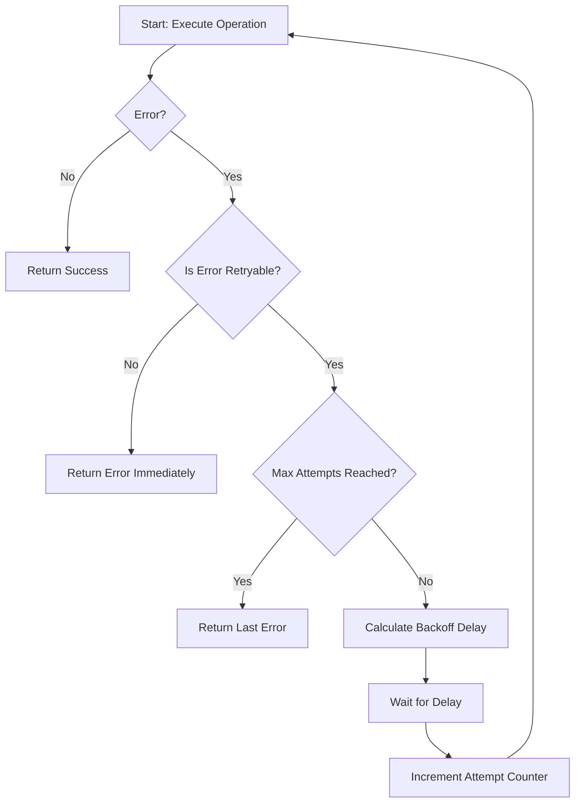
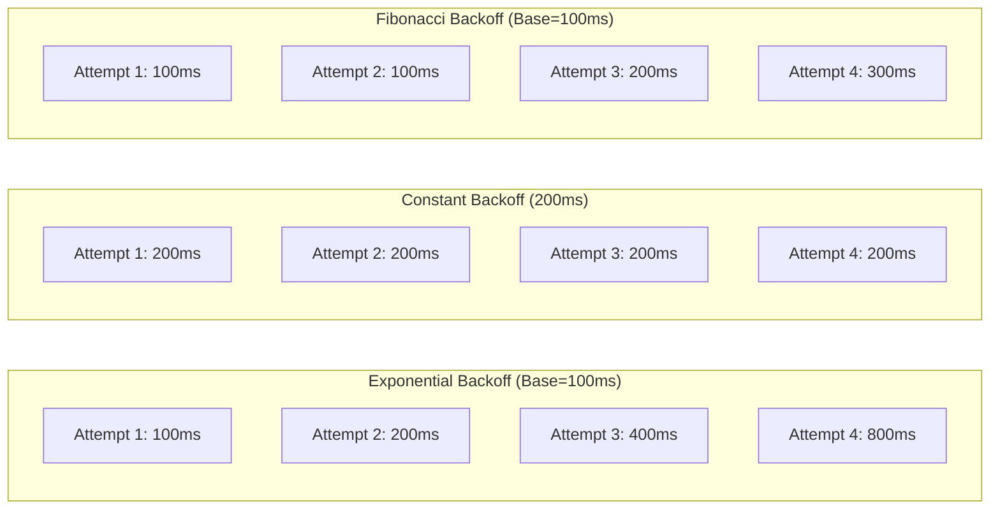

# Module 23: pkg/retry

## สำหรับโฟลเดอร์ `pkg/retry/`

ไฟล์ที่เกี่ยวข้อง:
- `retry.go` – Core retry function และ interface
- `backoff.go` – Backoff strategies (exponential, constant, linear, Fibonacci, jitter)
- `policy.go` – Retry policy และ error classifier
- `options.go` – Functional options pattern
- `http.go` – HTTP client wrapper with automatic retry
- `middleware.go` – HTTP/gRPC middleware
- `config.go` – Configuration management
- `metrics.go` – Prometheus metrics integration
- `examples/main.go` – ตัวอย่างการใช้งานครบวงจร


## หลักการ (Concept)

### Retry คืออะไร?
Retry เป็นรูปแบบการออกแบบ (design pattern) สำหรับการจัดการความล้มเหลวชั่วคราว (transient faults) โดยการลองดำเนินการอีกครั้งอัตโนมัติเมื่อเกิดข้อผิดพลาดที่ไม่ถาวร ระบบจะต้องสามารถแยกแยะข้อผิดพลาดประเภท transient (สามารถลองอีกครั้งได้) และข้อผิดพลาดถาวร (ควรหยุดทันที)

Retry ทำงานร่วมกับ backoff strategy ซึ่งเป็นอัลกอริทึมที่เพิ่มระยะเวลารอระหว่างการลองใหม่แบบ exponentially เพื่อไม่ให้ระบบถูกโจมตีด้วยการ retry พร้อมกันจำนวนมาก (thundering herd)[reference:0]

### มีกี่แบบ? (Types of Retry Strategies)

| กลยุทธ์ | อัลกอริทึม | ข้อดี | ข้อเสีย | เหมาะกับ |
|---------|-----------|--------|---------|----------|
| **No Backoff** | Retry ทันทีที่ล้มเหลว | latency น้อยสุด | risk flood ระบบปลายทางสูง | transient network blip ระยะสั้นมาก |
| **Constant Backoff** | รอระยะเวลาเท่ากันทุกครั้ง | ง่าย, predictable | ไม่มี backoff progression | Load testing, predictable workloads |
| **Linear Backoff** | Delay = base × attempt | เพิ่ม delay ตามจำนวนครั้ง | เติบโตช้าไปสำหรับระบบที่ล้มนาน | กรณีที่ failure duration คาดเดาได้ |
| **Exponential Backoff** | Delay = base × 2^attempt | ป้องกัน overload | อาจทำให้ overall latency สูง | Production workloads, cloud services |
| **Fibonacci Backoff** | Delay = base × F(attempt) | โตช้ากว่า exponential ช่วงแรก | implementation ซับซ้อนขึ้น | API rate limit handling |
| **Exponential + Full Jitter** | Delay = random(0, 2^attempt × base) | break thundering herd | delay variance สูง | Distributed systems, large-scale retries |
| **Exponential + Decorrelated Jitter** | Delay = random(base, prev×3) | balance predictable & random | การคำนวณซับซ้อน | Production workloads (AWS recommended) |

### ใช้อย่างไร / นำไปใช้กรณีไหน

**กรณีใช้งานหลัก:**
- **Network calls** – HTTP requests, gRPC, database connections ที่อาจ timeout หรือ connection error
- **Message queue consumption** – รับ message แล้วประมวลผลไม่สำเร็จเนื่องจาก downstream ล้ม
- **API calls with rate limiting** – เมื่อเจอ 429 (Too Many Requests) ให้รอ Retry-After header
- **Idempotent operations** – การ retry บน operation ที่ปลอดภัยต่อการทำซ้ำ
- **Database queries** – transient deadlock หรือ connection pool issue
- **File I/O** – temporary file locks หรือ disk I/O contention

**รูปแบบการใช้งานพื้นฐาน:**
```go
err := retry.Do(
    func() error { return callExternalAPI() },
    retry.WithAttempts(3),
    retry.WithBackoff(retry.ExponentialBackoff(100*time.Millisecond, 2*time.Second)),
    retry.WithRetryIf(func(err error) bool { return isTransientError(err) }),
)
```

### ประโยชน์ที่ได้รับ
- **Resilience** – ระบบสามารถ recover จาก transient failures ได้โดยอัตโนมัติ
- **Resource protection** – ป้องกัน service overload ด้วย backoff strategy
- **Idempotency foundation** – สร้าง handler ที่ปลอดภัยสำหรับ retry
- **Observability** – เพิ่ม metrics (retry count, success rate) และ logging
- **User experience** – ลด rate limit error ที่เห็นใน client

### ข้อควรระวัง
- **Idempotency** – operation ที่ retry ต้องเป็น idempotent หรือมีวิธีป้องกัน duplicate
- **Maximum attempts** – ตั้ง max retry ที่เหมาะสมเพื่อป้องกัน infinite loop
- **Context propagation** – ใช้ context สำหรับ timeout และ cancellation
- **Error classification** – ต้อง retry เฉพาะ error ที่ transient[reference:1]
- **Retry storm** – การ retry พร้อมกันหลาย client ทำให้ระบบล้มหนักขึ้น
- **Logging overhead** – logging ทุก retry attempt อาจ overwhelm log system

### ข้อดี
- **Implementation ง่าย** – มี library พร้อมใช้หลายตัวใน Go ecosystem
- **Highly configurable** – ปรับพารามิเตอร์ได้ละเอียด
- **Transparent** – เรียกใช้ไม่ต่างจาก function ปกติ
- **Zero external dependencies** – สามารถ implement เองด้วย backoff algorithm อย่างเดียว

### ข้อเสีย
- **Risk of duplicate operations** – ถ้า operation ไม่ idempotent อาจเกิด duplicate
- **Increased latency** – retry จะเพิ่ม total response time
- **Complexity in error handling** – ต้องแยก transient vs permanent errors
- **Not suitable for all failures** – retry ไม่ช่วยแก้ปัญหา business logic หรือ permission error

### ข้อห้าม
**ห้ามทำ retry operation ที่ไม่ idempotent โดยไม่มีการป้องกัน duplicate** เช่น การ transfer money, create order, หรือ append to a list เพราะอาจทำให้เกิด duplicate data หรือ side effects ซ้ำ

**ห้าม retry on every error** – ต้องจำกัด retry เฉพาะ error ที่ transient เช่น timeout, connection refused, 5xx, 429[reference:2]

**ห้ามใช้ retry เพื่อแก้ปัญหา system design ที่ผิดพลาด** – ถ้า system ล้มบ่อย ให้แก้ไข root cause ก่อน ไม่ใช่เพิ่ม retry

**ห้าม retry โดยไม่มี context timeout** – อาจทำให้ goroutine leak หรือ hanging requests


## การออกแบบ Workflow และ Dataflow

### Retry Workflow Diagram



### Backoff Strategy Comparison



**Dataflow ใน Go application:**
1. เรียก `retry.Do()` หรือ `retry.DoWithContext()`
2. ตรวจสอบ context deadline ก่อน retry แต่ละครั้ง (ถ้ามี)[reference:3]
3. ถ้าไม่เกิน max attempts และ error เป็น transient ให้คำนวณ delay ตาม backoff strategy ที่เลือก
4. รอ delay ระหว่างการ retry
5. ทำซ้ำจนสำเร็จ, max attempts หมด, หรือเจอ permanent error


## ตัวอย่างโค้ดที่รันได้จริง

### โครงสร้างโปรเจกต์
```
pkg/retry/
├── retry.go          # Core retry function
├── backoff.go        # Backoff strategies
├── options.go        # Functional options
├── http.go           # HTTP client wrapper
├── metrics.go        # Prometheus integration
├── config.go
└── examples/main.go
```

### 1. การติดตั้ง Dependencies

```bash
# Core retry libraries (เลือกอย่างใดอย่างหนึ่ง)
go get github.com/avast/retry-go/v4
go get github.com/cenkalti/backoff/v4

# HTTP client
go get github.com/hashicorp/go-retryablehttp

# Utilities
go get golang.org/x/sync/singleflight
go get github.com/prometheus/client_golang/prometheus
```

### 2. ตัวอย่างโค้ด: Backoff Algorithms

```go
// backoff.go
package retry

import (
    "math"
    "math/rand"
    "time"
)

// BackoffFunc รับ attempt number (เริ่มที่ 0) คืน delay time
type BackoffFunc func(attempt int) time.Duration

// ConstantBackoff คืน delay เท่ากันทุกครั้ง
func ConstantBackoff(delay time.Duration) BackoffFunc {
    return func(attempt int) time.Duration {
        return delay
    }
}

// LinearBackoff delay = baseDelay × (attempt + 1)
func LinearBackoff(baseDelay time.Duration) BackoffFunc {
    return func(attempt int) time.Duration {
        return baseDelay * time.Duration(attempt+1)
    }
}

// ExponentialBackoff delay = min(maxDelay, baseDelay × 2^attempt)
func ExponentialBackoff(baseDelay, maxDelay time.Duration) BackoffFunc {
    return func(attempt int) time.Duration {
        if attempt == 0 {
            return baseDelay
        }
        multiplier := 1 << attempt // 2^attempt
        delay := baseDelay * time.Duration(multiplier)
        if delay > maxDelay {
            return maxDelay
        }
        return delay
    }
}

// FibonacciBackoff delay = baseDelay × F(attempt+1)
func FibonacciBackoff(baseDelay, maxDelay time.Duration) BackoffFunc {
    fib := func(n int) int {
        if n <= 1 {
            return n
        }
        a, b := 0, 1
        for i := 2; i <= n; i++ {
            a, b = b, a+b
        }
        return b
    }
    return func(attempt int) time.Duration {
        multiplier := fib(attempt + 1)
        delay := baseDelay * time.Duration(multiplier)
        if delay > maxDelay {
            return maxDelay
        }
        return delay
    }
}

// ExponentialWithFullJitter delay = random(0, baseDelay × 2^attempt)
// ใช้เพื่อกระจายการ retry (prevent thundering herd)
func ExponentialWithFullJitter(baseDelay, maxDelay time.Duration) BackoffFunc {
    return func(attempt int) time.Duration {
        multiplier := 1 << attempt
        cap := baseDelay * time.Duration(multiplier)
        if cap > maxDelay {
            cap = maxDelay
        }
        if cap == 0 {
            return 0
        }
        return time.Duration(rand.Int63n(int64(cap)))
    }
}

// ExponentialWithEqualJitter delay = (baseDelay × 2^attempt) / 2 + random(0, (baseDelay × 2^attempt)/2)
func ExponentialWithEqualJitter(baseDelay, maxDelay time.Duration) BackoffFunc {
    return func(attempt int) time.Duration {
        multiplier := 1 << attempt
        cap := baseDelay * time.Duration(multiplier)
        if cap > maxDelay {
            cap = maxDelay
        }
        if cap == 0 {
            return 0
        }
        half := cap / 2
        return half + time.Duration(rand.Int63n(int64(half)))
    }
}
```

### 3. ตัวอย่างโค้ด: Core Retry Function

```go
// retry.go
package retry

import (
    "context"
    "errors"
    "time"
)

// RetryableErrorClassifier ตรวจสอบว่า error ควร retry หรือไม่
type RetryableErrorClassifier func(err error) bool

var (
    ErrMaxAttemptsReached = errors.New("max retry attempts reached")
    ErrContextCanceled    = errors.New("retry context canceled")
)

type Config struct {
    Attempts      int
    Backoff       BackoffFunc
    RetryIf       RetryableErrorClassifier
    OnRetry       func(attempt int, err error, delay time.Duration)
    OnSuccess     func(attempt int, duration time.Duration)
    OnMaxAttempts func(attempt int, lastErr error)
}

// DefaultTransientErrors กำหนด error ที่ transient โดยทั่วไป
func DefaultTransientErrors() RetryableErrorClassifier {
    return func(err error) bool {
        if err == nil {
            return false
        }
        // network timeout หรือ connection errors
        if errors.Is(err, context.DeadlineExceeded) {
            return true
        }
        // เช็ค type assertion สำหรับ error เฉพาะ
        // เช่น syscall.ECONNRESET, syscall.ECONNREFUSED
        return false
    }
}

// Do retry operation ตาม configuration
func Do(ctx context.Context, operation func() error, config Config) error {
    var lastErr error
    startTime := time.Now()

    for attempt := 0; attempt < config.Attempts; attempt++ {
        // Check context cancellation before each attempt
        select {
        case <-ctx.Done():
            return ErrContextCanceled
        default:
        }

        err := operation()
        if err == nil {
            if config.OnSuccess != nil {
                config.OnSuccess(attempt, time.Since(startTime))
            }
            return nil
        }

        lastErr = err

        // Check if error is retryable
        if config.RetryIf != nil && !config.RetryIf(err) {
            return err
        }

        // Last attempt, don't retry
        if attempt == config.Attempts-1 {
            break
        }

        // Calculate and apply backoff delay
        delay := config.Backoff(attempt)
        if config.OnRetry != nil {
            config.OnRetry(attempt, err, delay)
        }

        // Wait with context support
        select {
        case <-ctx.Done():
            return ErrContextCanceled
        case <-time.After(delay):
        }
    }

    if config.OnMaxAttempts != nil {
        config.OnMaxAttempts(config.Attempts, lastErr)
    }
    return errors.Join(ErrMaxAttemptsReached, lastErr)
}

// DefaultConfig return config for production use
func DefaultConfig() Config {
    return Config{
        Attempts: 3,
        Backoff:  ExponentialBackoff(100*time.Millisecond, 10*time.Second),
        RetryIf:  DefaultTransientErrors(),
    }
}

// SimpleRetry wrapper with default config
func SimpleRetry(ctx context.Context, operation func() error) error {
    return Do(ctx, operation, DefaultConfig())
}
```

### 4. ตัวอย่างโค้ด: Options Pattern

```go
// options.go
package retry

import "time"

type RetryOption func(*Config)

func WithAttempts(attempts int) RetryOption {
    return func(c *Config) { c.Attempts = attempts }
}

func WithBackoff(backoff BackoffFunc) RetryOption {
    return func(c *Config) { c.Backoff = backoff }
}

func WithRetryIf(classifier RetryableErrorClassifier) RetryOption {
    return func(c *Config) { c.RetryIf = classifier }
}

func WithOnRetry(fn func(attempt int, err error, delay time.Duration)) RetryOption {
    return func(c *Config) { c.OnRetry = fn }
}

func WithOnSuccess(fn func(attempt int, duration time.Duration)) RetryOption {
    return func(c *Config) { c.OnSuccess = fn }
}

// NewRetryConfig สร้าง config จาก options
func NewRetryConfig(opts ...RetryOption) Config {
    cfg := DefaultConfig()
    for _, opt := range opts {
        opt(&cfg)
    }
    return cfg
}
```

### 5. ตัวอย่างโค้ด: HTTP Client with Retry

```go
// http.go
package retry

import (
    "context"
    "fmt"
    "net/http"
    "time"
)

// RetryableHTTPClient wraps http.Client with retry logic
type RetryableHTTPClient struct {
    client  *http.Client
    config  Config
    headers map[string]string
}

type RetryableHTTPOption func(*RetryableHTTPClient)

func NewRetryableHTTPClient(opts ...RetryableHTTPOption) *RetryableHTTPClient {
    rc := &RetryableHTTPClient{
        client: &http.Client{Timeout: 30 * time.Second},
        config: DefaultConfig(),
    }
    for _, opt := range opts {
        opt(rc)
    }
    return rc
}

func WithHTTPClient(client *http.Client) RetryableHTTPOption {
    return func(rc *RetryableHTTPClient) { rc.client = client }
}

func WithRetryConfig(cfg Config) RetryableHTTPOption {
    return func(rc *RetryableHTTPClient) { rc.config = cfg }
}

func WithHeader(key, value string) RetryableHTTPOption {
    return func(rc *RetryableHTTPClient) {
        if rc.headers == nil {
            rc.headers = make(map[string]string)
        }
        rc.headers[key] = value
    }
}

// Do executes HTTP request with retry
func (rc *RetryableHTTPClient) Do(ctx context.Context, req *http.Request) (*http.Response, error) {
    var resp *http.Response
    var err error

    err = Do(ctx, func() error {
        // Clone request with context
        reqWithCtx := req.Clone(ctx)
        for k, v := range rc.headers {
            reqWithCtx.Header.Set(k, v)
        }

        resp, err = rc.client.Do(reqWithCtx)
        if err != nil {
            return err
        }

        // Treat 5xx and 429 as retryable
        if resp.StatusCode >= 500 || resp.StatusCode == http.StatusTooManyRequests {
            resp.Body.Close()
            return fmt.Errorf("HTTP %d", resp.StatusCode)
        }

        return nil
    }, rc.config)

    return resp, err
}

// Get convenience method
func (rc *RetryableHTTPClient) Get(ctx context.Context, url string) (*http.Response, error) {
    req, err := http.NewRequestWithContext(ctx, http.MethodGet, url, nil)
    if err != nil {
        return nil, err
    }
    return rc.Do(ctx, req)
}
```

### 6. ตัวอย่างโค้ด: Prometheus Metrics

```go
// metrics.go
package retry

import (
    "sync/atomic"

    "github.com/prometheus/client_golang/prometheus"
)

type MetricsCollector struct {
    // จำนวนครั้งที่ operation สำเร็จในครั้งแรก
    successFirstAttempt prometheus.Counter
    // จำนวนครั้งที่สำเร็จหลังจาก retry
    successAfterRetry prometheus.Counter
    // จำนวนครั้งที่ล้มเหลวหลังจาก retry หมด
    failedAfterRetry prometheus.Counter
    // จำนวน retry แต่ละครั้ง
    retryAttempts prometheus.Counter
    // duration ของ retry ทั้งหมด
    retryDuration prometheus.Histogram
}

var globalMetrics *MetricsCollector

func InitMetrics(reg prometheus.Registerer) {
    globalMetrics = &MetricsCollector{
        successFirstAttempt: prometheus.NewCounter(prometheus.CounterOpts{
            Name: "retry_success_first_attempt_total",
            Help: "Number of operations succeeded on first attempt",
        }),
        successAfterRetry: prometheus.NewCounter(prometheus.CounterOpts{
            Name: "retry_success_after_retry_total",
            Help: "Number of operations succeeded after retries",
        }),
        failedAfterRetry: prometheus.NewCounter(prometheus.CounterOpts{
            Name: "retry_failed_after_retry_total",
            Help: "Number of operations failed after max retries",
        }),
        retryAttempts: prometheus.NewCounter(prometheus.CounterOpts{
            Name: "retry_attempts_total",
            Help: "Total retry attempts made",
        }),
        retryDuration: prometheus.NewHistogram(prometheus.HistogramOpts{
            Name:    "retry_duration_seconds",
            Help:    "Duration of retry operations",
            Buckets: []float64{0.1, 0.5, 1, 2, 5, 10, 30},
        }),
    }
    reg.MustRegister(globalMetrics.successFirstAttempt,
        globalMetrics.successAfterRetry,
        globalMetrics.failedAfterRetry,
        globalMetrics.retryAttempts,
        globalMetrics.retryDuration)
}

func incrementRetryAttempts() {
    if globalMetrics != nil {
        globalMetrics.retryAttempts.Inc()
    }
}

func recordSuccess(firstAttempt bool, duration time.Duration) {
    if globalMetrics == nil {
        return
    }
    if firstAttempt {
        globalMetrics.successFirstAttempt.Inc()
    } else {
        globalMetrics.successAfterRetry.Inc()
    }
    globalMetrics.retryDuration.Observe(duration.Seconds())
}
```

### 7. ตัวอย่างการใช้งานรวมใน Main

```go
// main.go
package main

import (
    "context"
    "errors"
    "fmt"
    "log"
    "net/http"
    "time"

    "yourproject/pkg/retry"
)

func main() {
    // Example 1: Simple retry with default config
    ctx := context.Background()
    err := retry.SimpleRetry(ctx, func() error {
        // Simulate transient failure
        if time.Now().Unix()%2 == 0 {
            return errors.New("network timeout")
        }
        return nil
    })
    if err != nil {
        log.Printf("Failed: %v", err)
    }

    // Example 2: Custom retry for API call
    cfg := retry.NewRetryConfig(
        retry.WithAttempts(5),
        retry.WithBackoff(retry.ExponentialWithFullJitter(100*time.Millisecond, 5*time.Second)),
        retry.WithRetryIf(func(err error) bool {
            // Retry only on 5xx or 429
            return err != nil && (errors.Is(err, context.DeadlineExceeded) ||
                err.Error() == "rate limited")
        }),
        retry.WithOnRetry(func(attempt int, err error, delay time.Duration) {
            log.Printf("Retry attempt %d failed: %v, waiting %v", attempt+1, err, delay)
        }),
        retry.WithOnSuccess(func(attempt int, duration time.Duration) {
            log.Printf("Operation succeeded after %d attempts in %v", attempt+1, duration)
        }),
    )

    err = retry.Do(ctx, func() error {
        // call external API
        return callAPI()
    }, cfg)

    // Example 3: HTTP client with retry
    httpClient := retry.NewRetryableHTTPClient(
        retry.WithRetryConfig(retry.Config{
            Attempts: 3,
            Backoff:  retry.ConstantBackoff(500 * time.Millisecond),
            RetryIf:  retry.DefaultTransientErrors(),
        }),
        retry.WithHeader("X-Request-ID", "abc123"),
    )

    resp, err := httpClient.Get(ctx, "https://api.example.com/data")
    if err == nil {
        defer resp.Body.Close()
        fmt.Printf("Status: %s\n", resp.Status)
    }
}

func callAPI() error {
    // Simulate API call
    return nil
}
```


## วิธีใช้งาน module นี้

1. เลือก backoff strategy ที่เหมาะสมกับ workload (production ใช้ exponential with jitter)
2. กำหนด maximum attempts ที่สมเหตุสมผล (3-5 attempts)
3. กำหนด error classifier ที่แยก transient errors
4. ใช้ `retry.Do()` หรือ `retry.DoWithContext()` ในการ wrap operation
5. เพิ่ม metrics และ logging สำหรับ monitoring


## การติดตั้ง

```bash
go get github.com/avast/retry-go/v4
go get github.com/cenkalti/backoff/v4
go get github.com/hashicorp/go-retryablehttp
go get github.com/prometheus/client_golang
```


## การตั้งค่า configuration

```go
type RetryConfig struct {
    Attempts      int           // จำนวนครั้งที่พยายาม (รวมครั้งแรก)
    BaseDelay     time.Duration // delay ครั้งแรก
    MaxDelay      time.Duration // delay สูงสุด
    BackoffType   string        // "constant", "exponential", "fibonacci", "jitter"
    RetryOnStatus []int         // HTTP status codes ที่ควร retry (เช่น 500, 502, 503, 429)
    Timeout       time.Duration // timeout สำหรับ operation แต่ละครั้ง
}
```

Environment variables:
```bash
RETRY_ATTEMPTS=3
RETRY_BASE_DELAY=100ms
RETRY_MAX_DELAY=10s
RETRY_BACKOFF_TYPE=exponential
```


## การรวมกับ GORM

Retry plugin สำหรับ GORM เพื่อป้องกัน transient database errors:

```go
import (
    "context"
    "gorm.io/gorm"
    "yourproject/pkg/retry"
)

func NewRetryableGORM(db *gorm.DB, cfg retry.Config) *gorm.DB {
    // สร้าง session ที่มี retry callback
    return db.Session(&gorm.Session{
        PrepareStmt: false,
        Context:     context.Background(),
    })
}

// Example usage with retry
func findUserWithRetry(db *gorm.DB, id string) (*User, error) {
    var user User
    err := retry.SimpleRetry(context.Background(), func() error {
        // GORM query ที่อาจเกิด transient deadlock
        return db.Where("id = ?", id).First(&user).Error
    })
    if err != nil {
        return nil, err
    }
    return &user, nil
}
```


## การใช้งานจริง

### Example 1: Production API Gateway with Retry

```go
func callPaymentGateway(ctx context.Context, req *PaymentRequest) (*PaymentResponse, error) {
    var resp PaymentResponse

    cfg := retry.NewRetryConfig(
        retry.WithAttempts(3),
        retry.WithBackoff(retry.ExponentialWithEqualJitter(100*time.Millisecond, 5*time.Second)),
        retry.WithRetryIf(func(err error) bool {
            if err == nil {
                return false
            }
            // Retry on timeout, connection refused, or 5xx errors
            return errors.Is(err, context.DeadlineExceeded) ||
                   strings.Contains(err.Error(), "connection refused") ||
                   strings.Contains(err.Error(), "503")
        }),
        retry.WithOnRetry(func(attempt int, err error, delay time.Duration) {
            log.Printf("Payment gateway retry %d: %v, waiting %v", attempt+1, err, delay)
            metrics.RecordRetry("payment_gateway")
        }),
    )

    err := retry.Do(ctx, func() error {
        // Actual HTTP call
        httpResp, err := http.Post("https://payment.example.com/api", "application/json", req.Body)
        if err != nil {
            return err
        }
        defer httpResp.Body.Close()
        if httpResp.StatusCode >= 500 {
            return fmt.Errorf("payment gateway returned %d", httpResp.StatusCode)
        }
        return json.NewDecoder(httpResp.Body).Decode(&resp)
    }, cfg)

    return &resp, err
}
```

### Example 2: Message Queue Consumer with Retry and Dead Letter

```go
func consumeWithRetry(consumer *kafka.Reader, cfg retry.Config) {
    for {
        msg, err := consumer.ReadMessage(context.Background())
        if err != nil {
            log.Printf("Read error: %v", err)
            continue
        }

        err = retry.Do(context.Background(), func() error {
            return processMessage(msg)
        }, cfg)

        if err != nil {
            // Max retries reached, send to dead letter queue
            sendToDeadLetter(msg, err)
            log.Printf("Message failed after retries: %v", err)
        } else {
            consumer.CommitMessages(context.Background(), msg)
        }
    }
}
```

### Example 3: Database Transaction with Retry on Deadlock

```go
func transferMoneyWithRetry(ctx context.Context, db *gorm.DB, from, to string, amount int) error {
    cfg := retry.NewRetryConfig(
        retry.WithAttempts(3),
        retry.WithBackoff(retry.ConstantBackoff(100*time.Millisecond)),
        retry.WithRetryIf(func(err error) bool {
            // Retry on PostgreSQL deadlock (error code 40P01)
            return strings.Contains(err.Error(), "deadlock detected")
        }),
    )

    return retry.Do(ctx, func() error {
        return db.Transaction(func(tx *gorm.DB) error {
            // Transfer money
            if err := tx.Model(&Account{}).Where("id = ?", from).Update("balance", gorm.Expr("balance - ?", amount)).Error; err != nil {
                return err
            }
            return tx.Model(&Account{}).Where("id = ?", to).Update("balance", gorm.Expr("balance + ?", amount)).Error
        })
    }, cfg)
}
```


## ตารางสรุป Retry Components

| Component | คำอธิบาย | ตัวอย่าง |
|-----------|----------|----------|
| **BackoffFunc** | ฟังก์ชันคำนวณ delay ระหว่าง retry | `ExponentialBackoff(100ms, 10s)` |
| **ConstantBackoff** | รอระยะเวลาเท่ากันทุกครั้ง | `ConstantBackoff(1s)` |
| **ExponentialBackoff** | delay = base × 2^attempt | 100ms, 200ms, 400ms |
| **JitterBackoff** | เพิ่ม randomness ป้องกัน thundering herd | `ExponentialWithFullJitter` |
| **FibonacciBackoff** | delay = base × F(n) | 100ms, 100ms, 200ms, 300ms |
| **RetryIf** | ตรวจสอบ error ว่าควร retry หรือไม่ | `DefaultTransientErrors()` |
| **MaxAttempts** | จำนวนครั้งสูงสุดที่พยายาม | 3 |
| **OnRetry** | callback ทุกครั้งที่เกิด retry | logging, metrics |
| **OnSuccess** | callback เมื่อสำเร็จ | วัด duration, increment counter |
| **RetryableHTTPClient** | HTTP client พร้อม retry อัตโนมัติ | `NewRetryableHTTPClient()` |
| **Idempotency** | คุณสมบัติที่ปลอดภัยต่อการทำซ้ำ | idempotency key |


## แบบฝึกหัดท้าย module (5 ข้อ)

### ข้อ 1: Implement Exponential Backoff with Jitter (No External Library)
จงเขียนฟังก์ชัน `ExponentialBackoffWithJitter(baseDelay, maxDelay time.Duration) BackoffFunc` ที่ implement full jitter algorithm (delay = random(0, min(maxDelay, baseDelay × 2^attempt))) พร้อม unit test ที่ validate distribution และ bound ของ delay

### ข้อ 2: HTTP Client with Retry and Circuit Breaker Integration
จงสร้าง HTTP client ที่มี retry logic และสามารถ disable retry ชั่วคราวเมื่อ circuit breaker เปิด (จาก package circuitbreaker ก่อนหน้า) โดยใช้ context timeout และตรวจสอบ response status code (retry on 5xx, 429)

### ข้อ 3: Retry with Backoff and Rate Limiter
ระบบมี API ที่จำกัด 10 requests/วินาทีต่อ IP address จง implement retry policy ที่:
- retry เมื่อได้รับ HTTP 429
- อ่านค่า Retry-After header (ถ้ามี) เพื่อใช้เป็น delay
- ถ้าไม่มี Retry-After header ให้ใช้ exponential backoff แทน
- จำกัดจำนวน retry ทั้งหมด 5 ครั้ง

### ข้อ 4: Idempotent Webhook Handler with Deduplication
Webhook endpoint รับ event ที่อาจถูกส่งซ้ำเนื่องจาก network issue จงสร้าง handler ที่:
- ใช้ idempotency key จาก header `Idempotency-Key`
- เก็บ key และ first response ใน Redis (TTL 24 ชั่วโมง)
- ถ้า key ซ้ำและยังอยู่ใน cache → replay cached response ทันทีไม่ execute logic ซ้ำ
- ถ้า key หมดอายุ → ให้ execute ใหม่
- เขียน test ที่จำลอง duplicate request และตรวจสอบว่า handler ไม่ execute logic ซ้ำ

### ข้อ 5: Distributed Retry with Exponential Backoff (3 Nodes)
จาก microservice สาม instance จง implement distributed retry counter ที่เก็บใน Redis:
- แต่ละ instance มี counter แยกกันเพื่อป้องกันการ retry พร้อมกัน (retry storm)
- เมื่อ instance A retry, instance B และ C ต้องรู้และไม่ retry พร้อมกัน (ใช้ Redis SET NX หรือ distributed lock)
- หลังจาก retry หมด 3 ครั้ง ให้ย้าย message ไป dead letter queue (Redis List)
- เขียน simulation ที่มี 3 goroutines (แทน 3 instances) และตรวจสอบว่าไม่มี retry storm เกิดขึ้น


## แหล่งอ้างอิง

- [avast/retry-go – Simple retry mechanism for Go](https://github.com/avast/retry-go)[reference:4]
- [cenkalti/backoff – Exponential backoff algorithms](https://github.com/cenkalti/backoff)[reference:5]
- [hashicorp/go-retryablehttp – HTTP client with retries](https://github.com/hashicorp/go-retryablehttp)[reference:6]
- [Exponential Backoff And Jitter (AWS Architecture Blog)](https://aws.amazon.com/blogs/architecture/exponential-backoff-and-jitter/)[reference:7]
- [Building a Resilient Retry Mechanism in Go – Medium](https://techcodyind.medium.com/building-a-resilient-retry-mechanism-in-go)[reference:8]
- [Retry and Backoff: Building Resilient Systems (Dev.to)](https://dev.to/retry-and-backoff-building-resilient-systems)[reference:9]
- [Microsoft Cloud Design Patterns: Retry](https://learn.microsoft.com/en-us/azure/architecture/patterns/retry)

---

**หมายเหตุ:** module นี้ครบถ้วนสำหรับ `pkg/retry` สำหรับระบบ gobackend หากต้องการ module เพิ่มเติม (เช่น `pkg/bulkhead`, `pkg/timeout`) โปรดแจ้ง