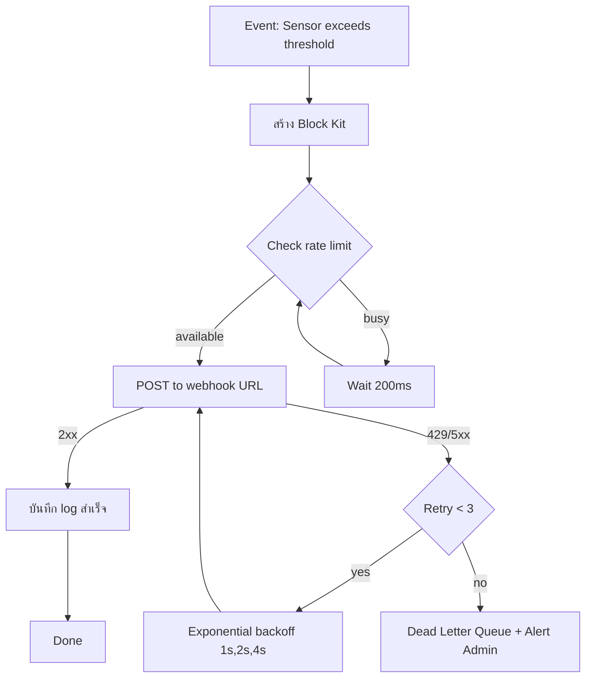
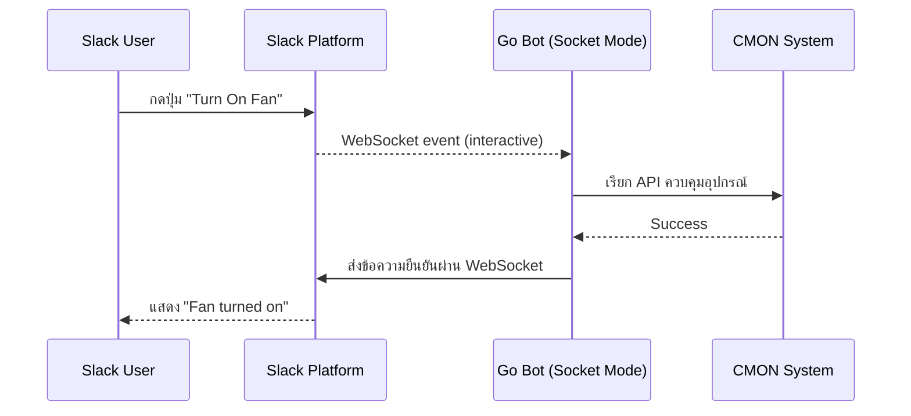

# Module 30: pkg/slack (Slack Webhook & Bot Notification)

## สำหรับโฟลเดอร์ `internal/pkg/slack/` และ `internal/repository/`

ไฟล์ที่เกี่ยวข้อง:
- `internal/pkg/slack/client.go`
- `internal/pkg/slack/sender.go`
- `internal/pkg/slack/message_builder.go`
- `internal/pkg/slack/block_builder.go`
- `internal/pkg/slack/worker.go`
- `internal/pkg/slack/retry.go`
- `internal/pkg/slack/rate_limiter.go`
- `internal/repository/slack_log.go`
- `migrations/slack_logs.sql`

---

## หลักการ (Concept)

### Slack Webhook / Bot Notification คืออะไร?

Slack เป็นแพลตฟอร์มสื่อสารในองค์กรที่ได้รับความนิยมสูงสุดระดับโลก รองรับการแจ้งเตือนแบบ Real‑time ผ่าน **Incoming Webhook** (ง่าย ไม่ต้องมีบอท) หรือ **Bot with Socket Mode / Events API** (สองทาง รองรับ interactive). ระบบ CMON IoT ใช้ Slack Webhook สำหรับแจ้งเตือนเหตุการณ์สำคัญ (อุณหภูมิเกิน, น้ำรั่ว, ควันไฟ) ไปยังช่อง (channel) ที่ทีมงานเฝ้าติดตาม รวมถึงส่งรายงานอัตโนมัติ และใช้ Block Kit Builder เพื่อสร้าง UI ที่สวยงาม (buttons, select menus, fields).

### มีกี่แบบ? (Slack Notification Methods)

| Method | ลักษณะ | ข้อดี | ข้อเสีย | เหมาะกับ |
|--------|--------|------|---------|----------|
| **Incoming Webhook** | HTTP POST ไปยัง URL ที่สร้างจาก Slack App | ง่ายมาก, ตั้งค่าใน Slack UI, ฟรี | ส่งได้ทางเดียว, ไม่รองรับ interactive | แจ้งเตือน, รายงาน, alert |
| **Bot with Socket Mode** | เชื่อมต่อ WebSocket แทน public endpoint | ไม่ต้องมี public URL, รองรับสองทาง, interactive | ต้องจัดการ connection, ซับซ้อนกว่า | Development, ระบบที่ไม่มี public endpoint |
| **Bot with Events API** | Slack ส่ง events ไปยัง public endpoint | รองรับ interactive, scale ได้ดี | ต้องมี public HTTPS endpoint | Production, ระบบ interactive |
| **Chat PostMessage** | ส่งข้อความผ่าน Bot Token โดยตรง | รองรับ Block Kit, กำหนด channel/ user ได้ | ต้องมี bot token และ manage permissions | ระบบที่ต้องการส่งไปหลาย channel |

**ข้อห้ามสำคัญ:** ห้ามใช้ Bucket Pattern ร่วมกับ Time Series Collections เพราะจะลดประสิทธิภาพ — แต่สำหรับ Slack module นี้ไม่เกี่ยวข้อง

### ใช้อย่างไร / นำไปใช้กรณีไหน

1. **Alert แบบ Real‑time** – แจ้งเตือนไปยังช่อง #alerts เมื่ออุณหภูมิเกิน 35°C, ตรวจพบน้ำรั่ว หรือควันไฟ
2. **Scheduled Reports** – ส่งสรุปสถานะ Data Center รายวัน/สัปดาห์ (Block Kit)
3. **Incident Response** – แจ้งเตือนทีมงานพร้อมปุ่มยืนยันการรับทราบ
4. **System Monitoring** – แจ้งเตือนเมื่อ service มีปัญหา (DB down, disk full)
5. **Interactive Control** – ส่งปุ่มให้ผู้ใช้กดเพื่อสั่งเปิด/ปิดอุปกรณ์

### ประโยชน์ที่ได้รับ

- **Block Kit UI** – สร้างข้อความที่สวยงามพร้อมปุ่ม, dropdown, date picker
- **Interactive components** – ผู้ใช้สามารถตอบกลับหรือกดปุ่มเพื่อสั่งงานได้ (ต้องใช้ bot)
- **Rich formatting** – รองรับ markdown, รูปภาพ, ไฟล์, mentions (@here, @channel)
- **Webhook ง่าย** – สร้าง URL ได้จาก Slack App ภายใน 2 นาที
- **Rate limits** – ชัดเจน (1 request/second ต่อ webhook)
- **Thread replies** – สนทนาต่อใน thread ได้
- **Free tier** – ฟรีสำหรับการใช้งานพื้นฐาน (10,000 messages/month)

### ข้อควรระวัง

- **Webhook URL ต้องเป็นความลับ** – ถ้ารั่วไหลจะมีคน spam ช่องได้
- **Rate limit** – 1 request/second ต่อ webhook, burst 50 (อย่าส่งเกิน)
- **Retry mechanism** – ควรทำ retry ด้วย exponential backoff
- **Payload size** – จำกัด 3000 ตัวอักษรสำหรับข้อความ, 16KB สำหรับ attachments
- **Interactive components** – ต้องมี public endpoint สำหรับรับ interactions (หรือ Socket Mode)
- **Bot token** – ต้องเก็บเป็นความลับ, อย่า commit ขึ้น repository
- **Permissions** – Bot ต้องได้รับ scopes (chat:write, incoming-webhook, commands)

### ข้อดี
- ตั้งค่าง่าย, Block Kit UI สวย, รองรับ interactive, rate limit ชัดเจน

### ข้อเสีย
- Webhook ไม่รองรับ interactive, ต้องใช้ bot token สำหรับ interactive, rate limit ค่อนข้างต่ำ

### ข้อห้าม
- ห้าม expose webhook URL หรือ bot token ใน client‑side code
- ห้ามส่งข้อความซ้ำเกิน rate limit โดยไม่มีการหน่วงเวลา
- ห้ามใช้ webhook สำหรับระบบที่ต้อง interactive (ควรใช้ bot)
- ห้ามส่งข้อมูลอ่อนไหวใน plain text


## การออกแบบ Workflow และ Dataflow

### Workflow: การส่งข้อความผ่าน Slack Webhook



**รูปที่ 49:** ขั้นตอนการส่งข้อความ Slack ผ่าน incoming webhook

### Sequence Diagram: Interactive Bot (Socket Mode)



**รูปที่ 50:** Sequence diagram แสดงการรับ interactive event จากปุ่มใน Slack ผ่าน Socket Mode


## ตัวอย่างโค้ดที่รันได้จริง

### 1. Client & Core Types – `client.go`

```go
// Package slack provides Slack webhook and bot notification capabilities.
// Supports Incoming Webhook, Bot Token with Block Kit.
// ----------------------------------------------------------------
// แพ็คเกจ slack ให้บริการการแจ้งเตือนทาง Slack webhook และ bot
// รองรับ Incoming Webhook, Bot Token และ Block Kit
package slack

import (
	"bytes"
	"context"
	"encoding/json"
	"fmt"
	"net/http"
	"time"
)

// WebhookConfig holds Slack incoming webhook configuration.
// ----------------------------------------------------------------
// WebhookConfig เก็บค่ากำหนด incoming webhook ของ Slack
type WebhookConfig struct {
	URL string // webhook URL from Slack app
}

// BotConfig holds Slack bot token configuration.
// ----------------------------------------------------------------
// BotConfig เก็บค่ากำหนด bot token ของ Slack
type BotConfig struct {
	Token string // Bot User OAuth Token (starts with xoxb-)
}

// Client handles HTTP requests to Slack.
// ----------------------------------------------------------------
// Client จัดการ HTTP requests ไปยัง Slack API
type Client struct {
	webhookURL string
	botToken   string
	httpClient *http.Client
}

// NewWebhookClient creates a client for incoming webhook.
// ----------------------------------------------------------------
// NewWebhookClient สร้าง client สำหรับ incoming webhook
func NewWebhookClient(webhookURL string) *Client {
	return &Client{
		webhookURL: webhookURL,
		httpClient: &http.Client{Timeout: 10 * time.Second},
	}
}

// NewBotClient creates a client using bot token.
// ----------------------------------------------------------------
// NewBotClient สร้าง client โดยใช้ bot token
func NewBotClient(botToken string) *Client {
	return &Client{
		botToken:   botToken,
		httpClient: &http.Client{Timeout: 10 * time.Second},
	}
}

// PostWebhook sends a payload to incoming webhook URL.
// ----------------------------------------------------------------
// PostWebhook ส่ง payload ไปยัง incoming webhook URL
func (c *Client) PostWebhook(ctx context.Context, payload interface{}) (*http.Response, error) {
	if c.webhookURL == "" {
		return nil, fmt.Errorf("webhook URL not configured")
	}
	return c.doPost(ctx, c.webhookURL, payload)
}

// PostChatMessage sends a message to a channel using bot token.
// ----------------------------------------------------------------
// PostChatMessage ส่งข้อความไปยัง channel โดยใช้ bot token
func (c *Client) PostChatMessage(ctx context.Context, channel, text string, blocks interface{}) (*http.Response, error) {
	if c.botToken == "" {
		return nil, fmt.Errorf("bot token not configured")
	}
	url := "https://slack.com/api/chat.postMessage"
	payload := map[string]interface{}{
		"channel": channel,
		"text":    text,
	}
	if blocks != nil {
		payload["blocks"] = blocks
	}
	return c.doPostWithAuth(ctx, url, payload)
}

func (c *Client) doPost(ctx context.Context, url string, payload interface{}) (*http.Response, error) {
	jsonData, err := json.Marshal(payload)
	if err != nil {
		return nil, err
	}
	req, err := http.NewRequestWithContext(ctx, "POST", url, bytes.NewBuffer(jsonData))
	if err != nil {
		return nil, err
	}
	req.Header.Set("Content-Type", "application/json")
	return c.httpClient.Do(req)
}

func (c *Client) doPostWithAuth(ctx context.Context, url string, payload interface{}) (*http.Response, error) {
	jsonData, err := json.Marshal(payload)
	if err != nil {
		return nil, err
	}
	req, err := http.NewRequestWithContext(ctx, "POST", url, bytes.NewBuffer(jsonData))
	if err != nil {
		return nil, err
	}
	req.Header.Set("Content-Type", "application/json")
	req.Header.Set("Authorization", "Bearer "+c.botToken)
	return c.httpClient.Do(req)
}
```

### 2. Sender & Payload Structures – `sender.go`

```go
package slack

import (
	"context"
	"fmt"
)

// WebhookMessage represents a simple text message for webhook.
// ----------------------------------------------------------------
// WebhookMessage แทนข้อความธรรมดาสำหรับ webhook
type WebhookMessage struct {
	Text string `json:"text"`
}

// BlockMessage represents a message with Block Kit.
// ----------------------------------------------------------------
// BlockMessage แทนข้อความที่มี Block Kit
type BlockMessage struct {
	Text   string        `json:"text,omitempty"`
	Blocks []Block       `json:"blocks,omitempty"`
}

// Block represents a Slack Block Kit block.
// ----------------------------------------------------------------
// Block แทน Block Kit block ของ Slack
type Block struct {
	Type     string                 `json:"type"`
	Text     *TextObject            `json:"text,omitempty"`
	BlockID  string                 `json:"block_id,omitempty"`
	Elements []interface{}          `json:"elements,omitempty"`
	Fields   []*TextObject          `json:"fields,omitempty"`
	Accessory map[string]interface{} `json:"accessory,omitempty"`
}

// TextObject represents a text object in blocks.
// ----------------------------------------------------------------
// TextObject แทน object ข้อความใน blocks
type TextObject struct {
	Type string `json:"type"` // plain_text, mrkdwn
	Text string `json:"text"`
	Emoji bool  `json:"emoji,omitempty"`
}

// Sender defines interface for sending Slack messages.
// ----------------------------------------------------------------
// Sender กำหนด interface สำหรับส่งข้อความ Slack
type Sender interface {
	SendWebhook(ctx context.Context, message *WebhookMessage) error
	SendBlockMessage(ctx context.Context, channel string, blocks []Block) error
}

// WebhookSender implements Sender using incoming webhook.
// ----------------------------------------------------------------
// WebhookSender อิมพลีเมนต์ Sender ด้วย incoming webhook
type WebhookSender struct {
	client *Client
}

// NewWebhookSender creates a webhook sender.
// ----------------------------------------------------------------
// NewWebhookSender สร้าง webhook sender ใหม่
func NewWebhookSender(webhookURL string) *WebhookSender {
	return &WebhookSender{
		client: NewWebhookClient(webhookURL),
	}
}

// SendWebhook sends a simple text message.
// ----------------------------------------------------------------
// SendWebhook ส่งข้อความธรรมดา
func (s *WebhookSender) SendWebhook(ctx context.Context, message *WebhookMessage) error {
	resp, err := s.client.PostWebhook(ctx, message)
	if err != nil {
		return err
	}
	defer resp.Body.Close()
	if resp.StatusCode >= 200 && resp.StatusCode < 300 {
		return nil
	}
	return fmt.Errorf("slack webhook returned %d", resp.StatusCode)
}

// SendBlockMessage sends a block message to a channel (requires bot token).
// ----------------------------------------------------------------
// SendBlockMessage ส่ง block message ไปยัง channel (ต้องใช้ bot token)
func (s *WebhookSender) SendBlockMessage(ctx context.Context, channel string, blocks []Block) error {
	// Webhook sender does not support blocks to arbitrary channel
	return fmt.Errorf("webhook sender cannot send to arbitrary channel, use BotSender")
}

// BotSender implements Sender using bot token.
// ----------------------------------------------------------------
// BotSender อิมพลีเมนต์ Sender ด้วย bot token
type BotSender struct {
	client *Client
}

// NewBotSender creates a bot sender.
// ----------------------------------------------------------------
// NewBotSender สร้าง bot sender ใหม่
func NewBotSender(botToken string) *BotSender {
	return &BotSender{
		client: NewBotClient(botToken),
	}
}

// SendWebhook is not supported for bot sender.
// ----------------------------------------------------------------
// SendWebhook ไม่รองรับสำหรับ bot sender
func (s *BotSender) SendWebhook(ctx context.Context, message *WebhookMessage) error {
	return fmt.Errorf("bot sender does not support webhook, use SendBlockMessage")
}

// SendBlockMessage sends a block message using bot token.
// ----------------------------------------------------------------
// SendBlockMessage ส่ง block message โดยใช้ bot token
func (s *BotSender) SendBlockMessage(ctx context.Context, channel string, blocks []Block) error {
	resp, err := s.client.PostChatMessage(ctx, channel, "", blocks)
	if err != nil {
		return err
	}
	defer resp.Body.Close()
	if resp.StatusCode >= 200 && resp.StatusCode < 300 {
		// Parse Slack response to check for "ok"
		var slackResp struct {
			OK    bool   `json:"ok"`
			Error string `json:"error"`
		}
		if err := json.NewDecoder(resp.Body).Decode(&slackResp); err == nil && !slackResp.OK {
			return fmt.Errorf("slack API error: %s", slackResp.Error)
		}
		return nil
	}
	return fmt.Errorf("slack API returned %d", resp.StatusCode)
}
```

### 3. Block Kit Builder – `block_builder.go`

```go
package slack

// BlockBuilder helps construct Slack Block Kit messages.
// ----------------------------------------------------------------
// BlockBuilder ช่วยสร้าง Block Kit messages ของ Slack
type BlockBuilder struct {
	blocks []Block
}

// NewBlockBuilder creates a new block builder.
// ----------------------------------------------------------------
// NewBlockBuilder สร้าง block builder ใหม่
func NewBlockBuilder() *BlockBuilder {
	return &BlockBuilder{
		blocks: []Block{},
	}
}

// AddHeader adds a header block.
// ----------------------------------------------------------------
// AddHeader เพิ่ม header block
func (b *BlockBuilder) AddHeader(text string) *BlockBuilder {
	b.blocks = append(b.blocks, Block{
		Type: "header",
		Text: &TextObject{
			Type: "plain_text",
			Text: text,
		},
	})
	return b
}

// AddSection adds a section block with markdown text.
// ----------------------------------------------------------------
// AddSection เพิ่ม section block พร้อมข้อความ markdown
func (b *BlockBuilder) AddSection(text string) *BlockBuilder {
	b.blocks = append(b.blocks, Block{
		Type: "section",
		Text: &TextObject{
			Type: "mrkdwn",
			Text: text,
		},
	})
	return b
}

// AddFields adds a section with multiple fields (side-by-side).
// ----------------------------------------------------------------
// AddFields เพิ่ม section ที่มีหลาย fields (เรียงเคียงข้าง)
func (b *BlockBuilder) AddFields(fields ...map[string]string) *BlockBuilder {
	var textFields []*TextObject
	for _, f := range fields {
		for k, v := range f {
			textFields = append(textFields, &TextObject{
				Type: "mrkdwn",
				Text: fmt.Sprintf("*%s*:\n%s", k, v),
			})
		}
	}
	b.blocks = append(b.blocks, Block{
		Type:   "section",
		Fields: textFields,
	})
	return b
}

// AddDivider adds a divider block (horizontal line).
// ----------------------------------------------------------------
// AddDivider เพิ่ม divider block (เส้นคั่นแนวนอน)
func (b *BlockBuilder) AddDivider() *BlockBuilder {
	b.blocks = append(b.blocks, Block{
		Type: "divider",
	})
	return b
}

// AddImage adds an image block.
// ----------------------------------------------------------------
// AddImage เพิ่ม image block
func (b *BlockBuilder) AddImage(imageURL, altText string) *BlockBuilder {
	b.blocks = append(b.blocks, Block{
		Type: "image",
		ImageURL: imageURL,
		AltText:  altText,
	})
	return b
}

// AddButton adds a button to the last section (as accessory).
// ----------------------------------------------------------------
// AddButton เพิ่มปุ่มใน section ล่าสุด (เป็น accessory)
func (b *BlockBuilder) AddButton(text, value, actionID string) *BlockBuilder {
	if len(b.blocks) == 0 {
		return b
	}
	last := &b.blocks[len(b.blocks)-1]
	if last.Type != "section" {
		return b
	}
	last.Accessory = map[string]interface{}{
		"type": "button",
		"text": map[string]interface{}{
			"type": "plain_text",
			"text": text,
		},
		"value": value,
		"action_id": actionID,
	}
	return b
}

// AddActions adds an actions block with multiple buttons.
// ----------------------------------------------------------------
// AddActions เพิ่ม actions block ที่มีหลายปุ่ม
func (b *BlockBuilder) AddActions(buttons ...map[string]string) *BlockBuilder {
	var elements []interface{}
	for _, btn := range buttons {
		elements = append(elements, map[string]interface{}{
			"type": "button",
			"text": map[string]interface{}{
				"type": "plain_text",
				"text": btn["text"],
			},
			"value":     btn["value"],
			"action_id": btn["action_id"],
		})
	}
	b.blocks = append(b.blocks, Block{
		Type:     "actions",
		Elements: elements,
	})
	return b
}

// Build returns the constructed blocks.
// ----------------------------------------------------------------
// Build คืน blocks ที่สร้างขึ้น
func (b *BlockBuilder) Build() []Block {
	return b.blocks
}
```

### 4. Slack Worker with Retry & Queue – `worker.go`

```go
package slack

import (
	"context"
	"log"
	"sync"
	"time"

	"github.com/google/uuid"
)

// SlackJob represents a queued Slack message task.
// ----------------------------------------------------------------
// SlackJob แทนงาน Slack message ที่อยู่ในคิว
type SlackJob struct {
	ID         string
	Type       string   // "webhook" or "block"
	Channel    string   // for block messages
	Blocks     []Block
	Text       string   // for webhook
	RetryCount int
	NextRetry  time.Time
}

// SlackWorker handles background Slack messaging with retries.
// ----------------------------------------------------------------
// SlackWorker จัดการการส่งข้อความ Slack ในพื้นหลังพร้อม retry
type SlackWorker struct {
	sender      Sender
	queue       chan *SlackJob
	retryQueue  chan *SlackJob
	rateLimiter *RateLimiter
	wg          sync.WaitGroup
	stopCh      chan struct{}
}

// NewSlackWorker creates a new Slack worker.
// ----------------------------------------------------------------
// NewSlackWorker สร้าง Slack worker ใหม่
func NewSlackWorker(sender Sender, queueSize int) *SlackWorker {
	return &SlackWorker{
		sender:      sender,
		queue:       make(chan *SlackJob, queueSize),
		retryQueue:  make(chan *SlackJob, queueSize),
		rateLimiter: NewRateLimiter(1, 5), // 1 request/sec for webhook
		stopCh:      make(chan struct{}),
	}
}

// Start begins the worker goroutines.
// ----------------------------------------------------------------
// Start เริ่ม worker goroutines
func (w *SlackWorker) Start(ctx context.Context, numWorkers int) {
	for i := 0; i < numWorkers; i++ {
		w.wg.Add(1)
		go w.worker(ctx)
	}
	go w.retryProcessor(ctx)
	log.Printf("SlackWorker started with %d workers", numWorkers)
}

// Stop gracefully shuts down the worker.
// ----------------------------------------------------------------
// Stop ปิด worker อย่างนุ่มนวล
func (w *SlackWorker) Stop() {
	close(w.stopCh)
	w.wg.Wait()
}

// Enqueue adds a Slack job to the queue.
// ----------------------------------------------------------------
// Enqueue เพิ่ม Slack job เข้าคิว
func (w *SlackWorker) Enqueue(job *SlackJob) {
	select {
	case w.queue <- job:
	default:
		log.Printf("Slack queue full, dropping job %s", job.ID)
	}
}

func (w *SlackWorker) worker(ctx context.Context) {
	defer w.wg.Done()
	for {
		select {
		case <-ctx.Done():
			return
		case <-w.stopCh:
			return
		case job := <-w.queue:
			w.processJob(ctx, job)
		}
	}
}

func (w *SlackWorker) processJob(ctx context.Context, job *SlackJob) {
	// Wait for rate limiter
	if err := w.rateLimiter.Wait(ctx); err != nil {
		return
	}
	var err error
	if job.Type == "webhook" {
		err = w.sender.SendWebhook(ctx, &WebhookMessage{Text: job.Text})
	} else {
		err = w.sender.SendBlockMessage(ctx, job.Channel, job.Blocks)
	}
	if err != nil {
		log.Printf("Slack send failed: %v, retry=%d, jobID=%s", err, job.RetryCount, job.ID)
		if job.RetryCount < 3 {
			job.RetryCount++
			job.NextRetry = time.Now().Add(time.Duration(job.RetryCount) * time.Second)
			w.retryQueue <- job
		} else {
			log.Printf("Slack job %s failed after 3 retries", job.ID)
		}
	}
}

func (w *SlackWorker) retryProcessor(ctx context.Context) {
	ticker := time.NewTicker(1 * time.Second)
	defer ticker.Stop()
	for {
		select {
		case <-ctx.Done():
			return
		case <-w.stopCh:
			return
		case <-ticker.C:
			w.processRetries()
		}
	}
}

func (w *SlackWorker) processRetries() {
	for {
		select {
		case job := <-w.retryQueue:
			if time.Now().After(job.NextRetry) {
				w.queue <- job
			} else {
				go func(j *SlackJob) {
					time.Sleep(time.Until(j.NextRetry))
					w.retryQueue <- j
				}(job)
			}
		default:
			return
		}
	}
}
```

### 5. Rate Limiter & Retry – `rate_limiter.go` and `retry.go`

```go
package slack

import (
	"context"
	"sync"
	"time"
)

// RateLimiter implements token bucket for Slack (1 request/sec).
// ----------------------------------------------------------------
// RateLimiter จำกัดอัตราการส่ง Slack (1 request/วินาที)
type RateLimiter struct {
	tokens     int
	burst      int
	rate       float64
	lastRefill time.Time
	mu         sync.Mutex
}

// NewRateLimiter creates a rate limiter.
// ----------------------------------------------------------------
// NewRateLimiter สร้าง rate limiter ใหม่
func NewRateLimiter(requestsPerSec float64, burst int) *RateLimiter {
	return &RateLimiter{
		tokens:     burst,
		burst:      burst,
		rate:       requestsPerSec,
		lastRefill: time.Now(),
	}
}

// Wait blocks until a token is available.
// ----------------------------------------------------------------
// Wait บล็อกจนกว่าจะมี token พร้อม
func (r *RateLimiter) Wait(ctx context.Context) error {
	for {
		select {
		case <-ctx.Done():
			return ctx.Err()
		default:
		}
		r.mu.Lock()
		r.refill()
		if r.tokens > 0 {
			r.tokens--
			r.mu.Unlock()
			return nil
		}
		r.mu.Unlock()
		time.Sleep(100 * time.Millisecond)
	}
}

func (r *RateLimiter) refill() {
	now := time.Now()
	elapsed := now.Sub(r.lastRefill).Seconds()
	newTokens := int(elapsed * r.rate)
	if newTokens > 0 {
		r.tokens += newTokens
		if r.tokens > r.burst {
			r.tokens = r.burst
		}
		r.lastRefill = now
	}
}

// RetryPolicy defines retry behavior.
// ----------------------------------------------------------------
// RetryPolicy กำหนดพฤติกรรมการ retry
type RetryPolicy struct {
	MaxRetries int
	BaseDelay  time.Duration
	MaxDelay   time.Duration
}

// DefaultRetryPolicy returns a sensible default.
// ----------------------------------------------------------------
// DefaultRetryPolicy คืนค่า retry policy ที่เหมาะสม
func DefaultRetryPolicy() *RetryPolicy {
	return &RetryPolicy{
		MaxRetries: 3,
		BaseDelay:  time.Second,
		MaxDelay:   30 * time.Second,
	}
}

// Backoff calculates the delay for a given retry attempt.
// ----------------------------------------------------------------
// Backoff คำนวณ delay สำหรับการ retry ครั้งที่กำหนด
func (p *RetryPolicy) Backoff(attempt int) time.Duration {
	delay := p.BaseDelay * time.Duration(1<<uint(attempt-1))
	if delay > p.MaxDelay {
		delay = p.MaxDelay
	}
	return delay
}
```

### 6. Slack Log Model – `internal/models/slack_log.go`

```go
package models

import "time"

// SlackLog stores Slack message delivery history.
// ----------------------------------------------------------------
// SlackLog เก็บประวัติการส่งข้อความ Slack
type SlackLog struct {
	BaseModel
	JobID      string    `gorm:"index"`
	Channel    string
	MessageType string   // webhook, block
	Text       string    `gorm:"type:text"`
	Status     string    // pending, sent, failed
	Error      string
	SentAt     time.Time
}
```

### 7. Migration SQL – `migrations/slack_logs.up.sql`

```sql
CREATE TABLE IF NOT EXISTS slack_logs (
    id BIGSERIAL PRIMARY KEY,
    job_id VARCHAR(36) NOT NULL,
    channel VARCHAR(255),
    message_type VARCHAR(20) NOT NULL,
    text TEXT,
    status VARCHAR(20) NOT NULL,
    error TEXT,
    sent_at TIMESTAMP NOT NULL,
    created_at TIMESTAMP NOT NULL DEFAULT CURRENT_TIMESTAMP,
    updated_at TIMESTAMP NOT NULL DEFAULT CURRENT_TIMESTAMP,
    deleted_at TIMESTAMP
);

CREATE INDEX idx_slack_logs_job_id ON slack_logs(job_id);
CREATE INDEX idx_slack_logs_status ON slack_logs(status);
CREATE INDEX idx_slack_logs_sent_at ON slack_logs(sent_at);
```

**migrations/slack_logs.down.sql**
```sql
DROP TABLE IF EXISTS slack_logs;
```


## วิธีใช้งาน module นี้

### การติดตั้ง

```bash
go get github.com/google/uuid
```

### การตั้งค่า configuration

```go
// Webhook mode (simple)
webhookURL := os.Getenv("SLACK_WEBHOOK_URL")
sender := slack.NewWebhookSender(webhookURL)

// Bot mode (interactive)
botToken := os.Getenv("SLACK_BOT_TOKEN")
sender := slack.NewBotSender(botToken)

worker := slack.NewSlackWorker(sender, 1000)
worker.Start(context.Background(), 3)
defer worker.Stop()
```

### การรวมกับ GORM

```go
db.AutoMigrate(&models.SlackLog{})
```

### การใช้งานจริง (ตัวอย่างใน rule engine)

```go
// สร้าง Block Kit message
blocks := slack.NewBlockBuilder().
    AddHeader("🚨 High Temperature Alert").
    AddDivider().
    AddSection("*Device:* Rack A1 Sensor\n*Temperature:* 36.5°C\n*Threshold:* 35.0°C").
    AddDivider().
    AddActions(
        map[string]string{"text": "View Dashboard", "value": "dashboard", "action_id": "view_dashboard"},
        map[string]string{"text": "Acknowledge", "value": "ack", "action_id": "ack_alert"},
    ).
    Build()

job := &slack.SlackJob{
    ID:      uuid.New().String(),
    Type:    "block",
    Channel: "#alerts",
    Blocks:  blocks,
}
worker.Enqueue(job)
```


## ตารางสรุป Components

| Component | หน้าที่ | ตัวอย่าง |
|-----------|--------|----------|
| `Client` | HTTP client สำหรับ Slack API | `PostWebhook()`, `PostChatMessage()` |
| `WebhookSender` | ส่งข้อความผ่าน webhook | `SendWebhook()` |
| `BotSender` | ส่ง Block message ผ่าน bot token | `SendBlockMessage()` |
| `BlockBuilder` | สร้าง Block Kit message | `AddHeader()`, `AddSection()`, `AddActions()` |
| `SlackWorker` | จัดการคิวและ retry | `Enqueue()`, `Start()` |
| `RateLimiter` | จำกัดอัตราส่ง 1 request/วินาที | `Wait()` |
| `SlackLog` | เก็บประวัติการส่งข้อความ | `models.SlackLog` |


## แบบฝึกหัดท้าย module (5 ข้อ)

1. เพิ่มฟังก์ชัน `AddSelectMenu` ใน `BlockBuilder` สำหรับสร้าง dropdown menu
2. Implement `InteractiveHandler` ที่รับ Slack interactive payload (via HTTP or Socket Mode) และประมวลผลปุ่มที่ผู้ใช้กด
3. สร้าง `SendBatch` method ที่รับหลาย Slack jobs และส่งด้วย rate limiter แบบ async
4. เพิ่มการรองรับ `SendFile` ที่อัปโหลดไฟล์ไปยัง Slack (ใช้ `files.upload` API)
5. เขียนฟังก์ชัน `FormatAsBlock` ที่แปลง struct ใดๆ ให้เป็น Slack Block โดยอัตโนมัติ (reflection)


## แหล่งอ้างอิง

- [Slack Incoming Webhooks documentation](https://api.slack.com/messaging/webhooks)
- [Slack Block Kit Builder](https://app.slack.com/block-kit-builder)
- [Slack API chat.postMessage](https://api.slack.com/methods/chat.postMessage)
- [Slack rate limits](https://api.slack.com/docs/rate-limits)
- [Slack Events API](https://api.slack.com/apis/connections/events-api)
- [Socket Mode for Slack apps](https://api.slack.com/apis/connections/socket)

---

**หมายเหตุ:** module นี้ครบถ้วนสำหรับ `pkg/slack` สำหรับระบบ gobackend หากต้องการ module เพิ่มเติม (เช่น `pkg/pagerduty`, `pkg/opsgenie`, `pkg/mattermost`) โปรดแจ้ง