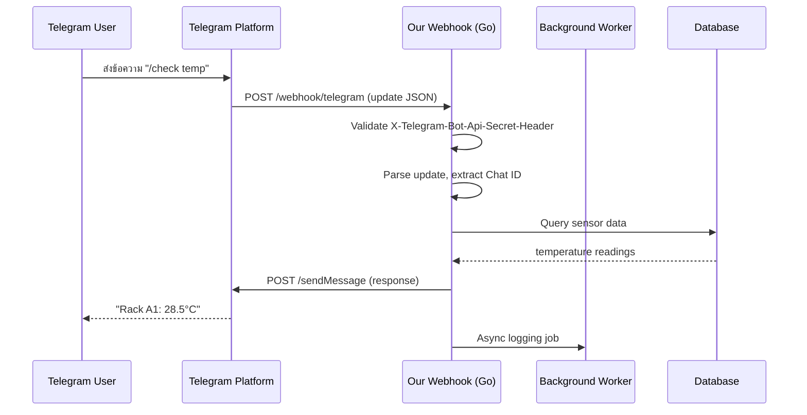

# Module 25: pkg/telegram (Telegram Bot Notification)

## สำหรับโฟลเดอร์ `internal/pkg/telegram/` และ `internal/repository/`

ไฟล์ที่เกี่ยวข้อง:
- `internal/pkg/telegram/client.go`
- `internal/pkg/telegram/sender.go`
- `internal/pkg/telegram/webhook.go`
- `internal/pkg/telegram/keyboard.go`
- `internal/pkg/telegram/worker.go`
- `internal/pkg/telegram/retry.go`
- `internal/repository/telegram_log.go`
- `migrations/telegram_logs.sql`

---

## หลักการ (Concept)

### Telegram Bot Notification คืออะไร?

Telegram Bot คือบอทอัตโนมัติที่ทำงานบนแพลตฟอร์ม Telegram ซึ่งเป็นแอปพลิเคชัน messaging ที่ได้รับความนิยมทั่วโลก โดยเฉพาะในกลุ่มนักพัฒนาและองค์กรที่ต้องการระบบแจ้งเตือนที่มีประสิทธิภาพสูง ระบบ CMON IoT Monitoring ใช้ Telegram Bot สำหรับแจ้งเตือนแบบ Real-time เนื่องจากมีอัตราการเปิดอ่านสูง, รองรับ Rich Media (รูปภาพ, ปุ่มกด, การ์ดข้อมูล), และสามารถตั้งค่า Webhook หรือ Polling ได้ตามความเหมาะสม[reference:0].

### มีกี่แบบ? (Telegram Bot Interaction Models)

| API / Method | ลักษณะ | ข้อดี | ข้อเสีย | เหมาะกับ |
|--------------|--------|------|---------|----------|
| **Long Polling (GetUpdates)** | ใช้ HTTP requests ดึงข้อมูลซ้ำๆ | ง่าย, ไม่ต้องมี public endpoint, ใช้ localhost ได้ | เปลืองทรัพยากร, latency สูงกว่า webhook เล็กน้อย | Development, Local testing |
| **Webhook** | Telegram ส่ง POST request ไปยัง endpoint ที่กำหนด | Real-time, ประหยัด resources, latency ต่ำ | ต้องมี HTTPS + public URL, ต้องจัดการ certificate | Production, Cloud deployment |
| **SendMessage** | ส่งข้อความถึง chat หรือ user | พื้นฐาน, ง่ายที่สุด | ข้อความธรรมดา | การแจ้งเตือนทั่วไป |
| **Inline Keyboard** | ปุ่มที่ติดมากับข้อความ, กดแล้ว callback | ไม่ส่งข้อความใหม่, interactive | ซับซ้อนกว่า reply keyboard | ยืนยันการทำงาน, สั่งงาน |
| **Reply Keyboard** | แทนที่ keyboard ปกติของผู้ใช้ | ใช้งานง่าย, user-friendly | ส่งข้อความเมื่อกด | เมนูตอบกลับด่วน |
| **Media Messages** | ส่งรูปภาพ, วิดีโอ, ไฟล์, เอกสาร | แนบรูปภาพกราฟ, รายงาน PDF | จำกัดขนาดไฟล์ (50MB) | ส่งรายงานพร้อมรูปภาพ |
| **Paid Broadcast** | จ่าย Telegram Stars เพื่อ bypass rate limit | ส่งได้ถึง 1,000 ข้อความ/วินาที | มีค่าใช้จ่าย | กรณีต้องการส่งปริมาณสูงมาก[reference:1] |

### ใช้อย่างไร / นำไปใช้กรณีไหน

1. **Alert แบบ Real-time** – แจ้งเตือนไปยังกลุ่ม Telegram Ops เมื่ออุณหภูมิเกิน 35°C, ตรวจพบน้ำรั่ว หรือควันไฟ
2. **Scheduled Reports** – ส่งสรุปสถานะ Data Center รายวัน/สัปดาห์ พร้อมรูปภาพกราฟ
3. **Device Control Confirmation** – ส่ง Inline Keyboard พร้อมปุ่มยืนยันการสั่งงานอุปกรณ์ระยะไกล
4. **Interactive Chatbot** – รับคำสั่งผ่าน Telegram (สอบถามสถานะเซนเซอร์ล่าสุด, เปิด/ปิดพัดลม)
5. **User-specific Notification** – ส่งแจ้งเตือนไปยังผู้ใช้ที่เริ่มคุยกับบอทแล้ว
6. **System Health Monitoring** – แจ้งเตือนเมื่อ service มีปัญหา (DB down, disk full)

### ประโยชน์ที่ได้รับ

- **High engagement** – Telegram มีอัตราการเปิดอ่านสูง, การแจ้งเตือนถึงทันที
- **Rich media** – ส่งรูปภาพ, ไฟล์, ปุ่มกด, การ์ด Flex Message
- **Two‑way communication** – ผู้ใช้สามารถตอบกลับหรือกดปุ่มเพื่อสั่งงานได้ทันที
- **Free tier** – API ฟรี ไม่มีค่าใช้จ่าย, ไม่จำกัดจำนวนข้อความ
- **Group & Channel support** – แจ้งเตือนไปยังกลุ่มหรือ channel ได้โดยตรง
- **Webhook vs Polling** – เลือกได้ตาม environment
- **High rate limits** – ข้อความธรรมดา ~30 ข้อความ/วินาที, กลุ่ม ~20 ข้อความ/นาที[reference:2]

### ข้อควรระวัง

- **Rate limits** – การส่งข้อความเกินอัตราจะได้รับ error 429 พร้อม Retry-After header[reference:3]
- **Webhook requirement** – ต้องใช้ HTTPS และ public URL (Let's Encrypt ได้, self-signed ไม่ได้)[reference:4]
- **Chat ID retrieval** – ต้องมี webhook หรือ polling เพื่อดึง chat ID ก่อนส่งข้อความ
- **Message flooding** – ระวังการส่งข้อความซ้ำเกินไป, ควรมี cooldown และ rate limit
- **File size limit** – ไฟล์สูงสุด 50MB
- **Bot privacy mode** – หากเปิด privacy mode บอทจะเห็นเฉพาะข้อความที่ @mention หรือ command เท่านั้น
- **Token security** – Bot token ต้องเก็บเป็นความลับ, ไม่ commit ขึ้น repository[reference:5]
- **Update offset** – เมื่อใช้ polling ต้องจัดการ offset อย่างถูกต้อง[reference:6]
- **Update structure** – Update มีหลายประเภท (message, callback_query, inline_query) ต้องตรวจสอบ type และ nil ก่อนเข้าถึง field[reference:7]

### ข้อดี
- ฟรี, รองรับ rich media, interactive, rate limit สูง, webhook/polling เลือกได้

### ข้อเสีย
- Webhook ต้องมี HTTPS public URL, Chat ID retrieval ซับซ้อนกว่า LINE, ไม่มี native dark mode adjustment

### ข้อห้าม
- ห้ามส่งข้อความ spam (Telegram อาจ ban bot)
- ห้ามส่งข้อความหา user ที่ยังไม่ได้เริ่มคุยกับบอท (จะได้ error 403)
- ห้าม hardcode bot token ใน source code
- ห้ามใช้ polling โดยไม่จัดการ offset (จะเกิด duplicate หรือ missing updates)[reference:8]
- ห้ามใช้ `update.Message.Text` โดยไม่ตรวจสอบ `update.Message != nil`[reference:9]


## การออกแบบ Workflow และ Dataflow

### Workflow: การส่งข้อความผ่าน Telegram Bot (Push)

```mermaid
flowchart TB
    Start[Event: Sensor exceeds threshold] --> GetTarget{มี Chat ID?}
    GetTarget -->|Yes| DirectSend[ส่งตรงไปยัง Chat ID]
    GetTarget -->|No| GetFromDB[ดึง Chat ID จากฐานข้อมูล]
    GetFromDB --> DirectSend
    
    DirectSend --> BuildMessage[สร้างข้อความ + Inline Keyboard]
    BuildMessage --> SendAPI[POST to api.telegram.org/bot{TOKEN}/sendMessage]
    SendAPI -->|success| Log[บันทึกลงฐานข้อมูล]
    SendAPI -->|429/500| Retry{Retry < 3}
    Retry -->|yes| Delay[Delay with backoff] --> SendAPI
    Retry -->|no| DeadLetter[Dead Letter Queue + Alert Admin]
    Log --> Done[Done]
```

**รูปที่ 39:** ขั้นตอนการส่งข้อความ Telegram เมื่อเซนเซอร์เกิน threshold

### Workflow: Webhook สำหรับรับข้อความจากผู้ใช้



**รูปที่ 40:** Sequence diagram แสดงการรับข้อความจาก Telegram user ผ่าน webhook และตอบกลับแบบ synchronous


## ตัวอย่างโค้ดที่รันได้จริง

### 1. Telegram Client – `client.go`

```go
// Package telegram provides Telegram Bot notification capabilities.
// Uses go-telegram-bot-api/v5 library.
// ----------------------------------------------------------------
// แพ็คเกจ telegram ให้บริการการแจ้งเตือนทาง Telegram Bot
// ใช้ไลบรารี go-telegram-bot-api/v5
package telegram

import (
	"context"
	"fmt"
	"log"
	"time"

	tgbotapi "github.com/go-telegram-bot-api/telegram-bot-api/v5"
)

// Config holds Telegram Bot configuration.
// ----------------------------------------------------------------
// Config เก็บค่ากำหนดการทำงานของ Telegram Bot
type Config struct {
	Token          string        // Bot token from BotFather (format: 1234567890:ABCdefGHIJKlmNoPQRstUvwXYZ)
	Debug          bool          // Enable debug mode (logs API requests/responses)
	Timeout        time.Duration // HTTP client timeout (default: 10s)
	UseWebhook     bool          // Use webhook instead of polling
	WebhookURL     string        // Public URL for webhook (must be HTTPS)
	WebhookPort    string        // Port for webhook server (default: 8443)
	WebhookPath    string        // Path for webhook endpoint (default: "/webhook/telegram")
	AllowedUpdates []string      // List of update types to receive (nil = all)
}

// DefaultConfig returns recommended config for production (polling).
// ----------------------------------------------------------------
// DefaultConfig คืนค่า config ที่แนะนำสำหรับ production (polling)
func DefaultConfig() *Config {
	return &Config{
		Token:          "",
		Debug:          false,
		Timeout:        10 * time.Second,
		UseWebhook:     false,
		WebhookURL:     "",
		WebhookPort:    "8443",
		WebhookPath:    "/webhook/telegram",
		AllowedUpdates: nil, // nil means receive all update types
	}
}

// Client wraps Telegram bot API client.
// ----------------------------------------------------------------
// Client ห่อหุ้ม Telegram bot API client
type Client struct {
	Bot      *tgbotapi.BotAPI
	Config   *Config
	stopCh   chan struct{}
	updates  tgbotapi.UpdatesChannel
}

// NewClient creates a new Telegram client.
// ----------------------------------------------------------------
// NewClient สร้าง Telegram client ใหม่
func NewClient(cfg *Config) (*Client, error) {
	if cfg == nil {
		cfg = DefaultConfig()
	}
	if cfg.Token == "" {
		return nil, fmt.Errorf("telegram bot token is required")
	}

	bot, err := tgbotapi.NewBotAPI(cfg.Token)
	if err != nil {
		return nil, fmt.Errorf("failed to create bot: %w", err)
	}
	bot.Debug = cfg.Debug

	// Verify connection
	// ตรวจสอบการเชื่อมต่อ
	me, err := bot.GetMe()
	if err != nil {
		return nil, fmt.Errorf("failed to verify token: %w", err)
	}
	log.Printf("Telegram bot connected: @%s (ID: %d)", me.UserName, me.ID)

	return &Client{
		Bot:    bot,
		Config: cfg,
		stopCh: make(chan struct{}),
	}, nil
}

// Close gracefully closes the client.
// ----------------------------------------------------------------
// Close ปิด client อย่างนุ่มนวล
func (c *Client) Close() {
	close(c.stopCh)
}

// GetBot returns the underlying bot API instance.
// ----------------------------------------------------------------
// GetBot คืน instance bot API ด้านล่าง
func (c *Client) GetBot() *tgbotapi.BotAPI {
	return c.Bot
}
```

### 2. Sender Interface & Implementation – `sender.go`

```go
package telegram

import (
	"context"
	"fmt"

	tgbotapi "github.com/go-telegram-bot-api/telegram-bot-api/v5"
)

// ParseMode defines message formatting options.
// ----------------------------------------------------------------
// ParseMode กำหนดรูปแบบการจัดรูปแบบข้อความ
type ParseMode string

const (
	ParseModeHTML       ParseMode = "HTML"        // HTML formatting
	ParseModeMarkdownV2 ParseMode = "MarkdownV2"  // Telegram Markdown V2 syntax
	ParseModeMarkdown   ParseMode = "Markdown"    // Legacy Markdown (deprecated)
)

// Message represents a Telegram message to be sent.
// ----------------------------------------------------------------
// Message แทนข้อความ Telegram ที่จะส่ง
type Message struct {
	ChatID             int64
	Text               string
	ParseMode          ParseMode
	DisableNotification bool
	DisableWebPagePreview bool
	ReplyToMessageID    int
	ReplyMarkup         interface{} // InlineKeyboardMarkup or ReplyKeyboardMarkup
}

// Sender defines the interface for Telegram messaging.
// ----------------------------------------------------------------
// Sender กำหนด interface สำหรับการส่งข้อความ Telegram
type Sender interface {
	// SendMessage sends a text message.
	// ----------------------------------------------------------------
	// SendMessage ส่งข้อความธรรมดา
	SendMessage(ctx context.Context, msg *Message) (*tgbotapi.Message, error)

	// SendPhoto sends a photo message.
	// ----------------------------------------------------------------
	// SendPhoto ส่งรูปภาพ
	SendPhoto(ctx context.Context, chatID int64, photo interface{}, caption string) (*tgbotapi.Message, error)

	// SendDocument sends a document file.
	// ----------------------------------------------------------------
	// SendDocument ส่งไฟล์เอกสาร
	SendDocument(ctx context.Context, chatID int64, document interface{}, caption string) (*tgbotapi.Message, error)

	// SendChatAction sends a chat action (typing, upload_photo, etc.).
	// ----------------------------------------------------------------
	// SendChatAction ส่งสถานะการพิมพ์ (typing, upload_photo, etc.)
	SendChatAction(ctx context.Context, chatID int64, action string) error

	// GetChat retrieves chat information.
	// ----------------------------------------------------------------
	// GetChat ดึงข้อมูล chat
	GetChat(ctx context.Context, chatID int64) (*tgbotapi.Chat, error)
}

// TelegramSender implements Sender using go-telegram-bot-api.
// ----------------------------------------------------------------
// TelegramSender อิมพลีเมนต์ Sender ด้วย go-telegram-bot-api
type TelegramSender struct {
	bot *tgbotapi.BotAPI
}

// NewTelegramSender creates a new Telegram sender.
// ----------------------------------------------------------------
// NewTelegramSender สร้าง Telegram sender ใหม่
func NewTelegramSender(bot *tgbotapi.BotAPI) *TelegramSender {
	return &TelegramSender{bot: bot}
}

// SendMessage sends a text message.
// ----------------------------------------------------------------
// SendMessage ส่งข้อความธรรมดา
func (s *TelegramSender) SendMessage(ctx context.Context, msg *Message) (*tgbotapi.Message, error) {
	tgMsg := tgbotapi.NewMessage(msg.ChatID, msg.Text)
	tgMsg.ParseMode = string(msg.ParseMode)
	tgMsg.DisableNotification = msg.DisableNotification
	tgMsg.DisableWebPagePreview = msg.DisableWebPagePreview
	tgMsg.ReplyToMessageID = msg.ReplyToMessageID
	if msg.ReplyMarkup != nil {
		tgMsg.ReplyMarkup = msg.ReplyMarkup
	}
	return s.bot.Send(tgMsg)
}

// SendPhoto sends a photo message (by URL, file ID, or file path).
// ----------------------------------------------------------------
// SendPhoto ส่งรูปภาพ (โดย URL, file ID, หรือ file path)
func (s *TelegramSender) SendPhoto(ctx context.Context, chatID int64, photo interface{}, caption string) (*tgbotapi.Message, error) {
	var tgPhoto tgbotapi.PhotoConfig
	switch p := photo.(type) {
	case string:
		tgPhoto = tgbotapi.NewPhoto(chatID, tgbotapi.FilePath(p))
	case tgbotapi.FileReader:
		tgPhoto = tgbotapi.NewPhoto(chatID, p)
	default:
		return nil, fmt.Errorf("unsupported photo type")
	}
	tgPhoto.Caption = caption
	return s.bot.Send(tgPhoto)
}

// SendDocument sends a document file.
// ----------------------------------------------------------------
// SendDocument ส่งไฟล์เอกสาร
func (s *TelegramSender) SendDocument(ctx context.Context, chatID int64, document interface{}, caption string) (*tgbotapi.Message, error) {
	var tgDoc tgbotapi.DocumentConfig
	switch d := document.(type) {
	case string:
		tgDoc = tgbotapi.NewDocument(chatID, tgbotapi.FilePath(d))
	case tgbotapi.FileReader:
		tgDoc = tgbotapi.NewDocument(chatID, d)
	default:
		return nil, fmt.Errorf("unsupported document type")
	}
	tgDoc.Caption = caption
	return s.bot.Send(tgDoc)
}

// SendChatAction sends a chat action (e.g., "typing", "upload_photo").
// ----------------------------------------------------------------
// SendChatAction ส่งสถานะ chat action
func (s *TelegramSender) SendChatAction(ctx context.Context, chatID int64, action string) error {
	chatAction := tgbotapi.NewChatAction(chatID, action)
	_, err := s.bot.Send(chatAction)
	return err
}

// GetChat retrieves chat information.
// ----------------------------------------------------------------
// GetChat ดึงข้อมูล chat
func (s *TelegramSender) GetChat(ctx context.Context, chatID int64) (*tgbotapi.Chat, error) {
	chatConfig := tgbotapi.ChatInfoConfig{ChatID: chatID}
	return s.bot.GetChat(chatConfig)
}
```

### 3. Keyboard Builder – `keyboard.go`

```go
package telegram

import (
	tgbotapi "github.com/go-telegram-bot-api/telegram-bot-api/v5"
)

// KeyboardBuilder helps construct Telegram keyboards.
// ----------------------------------------------------------------
// KeyboardBuilder ช่วยสร้าง keyboard ของ Telegram
type KeyboardBuilder struct{}

// NewKeyboardBuilder creates a new keyboard builder.
// ----------------------------------------------------------------
// NewKeyboardBuilder สร้าง keyboard builder ใหม่
func NewKeyboardBuilder() *KeyboardBuilder {
	return &KeyboardBuilder{}
}

// InlineKeyboard builds an inline keyboard with buttons.
// ----------------------------------------------------------------
// InlineKeyboard สร้าง inline keyboard พร้อมปุ่ม
func (k *KeyboardBuilder) InlineKeyboard(rows ...[]tgbotapi.InlineKeyboardButton) tgbotapi.InlineKeyboardMarkup {
	keyboardRows := make([][]tgbotapi.InlineKeyboardButton, len(rows))
	for i, row := range rows {
		keyboardRows[i] = row
	}
	return tgbotapi.NewInlineKeyboardMarkup(keyboardRows...)
}

// InlineButton creates an inline button with callback data.
// ----------------------------------------------------------------
// InlineButton สร้าง inline button พร้อม callback data
func (k *KeyboardBuilder) InlineButton(text, callbackData string) tgbotapi.InlineKeyboardButton {
	return tgbotapi.NewInlineKeyboardButtonData(text, callbackData)
}

// InlineButtonURL creates an inline button that opens a URL.
// ----------------------------------------------------------------
// InlineButtonURL สร้าง inline button ที่เปิด URL
func (k *KeyboardBuilder) InlineButtonURL(text, url string) tgbotapi.InlineKeyboardButton {
	return tgbotapi.NewInlineKeyboardButtonURL(text, url)
}

// InlineButtonSwitch creates an inline button that switches to inline query.
// ----------------------------------------------------------------
// InlineButtonSwitch สร้าง inline button ที่สลับไป inline query
func (k *KeyboardBuilder) InlineButtonSwitch(text, switchQuery string) tgbotapi.InlineKeyboardButton {
	return tgbotapi.NewInlineKeyboardButtonSwitchInlineQuery(text, switchQuery)
}

// ReplyKeyboard builds a reply keyboard (replaces user's keyboard).
// ----------------------------------------------------------------
// ReplyKeyboard สร้าง reply keyboard (แทนที่ keyboard ปกติของผู้ใช้)
func (k *KeyboardBuilder) ReplyKeyboard(rows ...[]tgbotapi.KeyboardButton) tgbotapi.ReplyKeyboardMarkup {
	keyboardRows := make([][]tgbotapi.KeyboardButton, len(rows))
	for i, row := range rows {
		keyboardRows[i] = row
	}
	return tgbotapi.NewReplyKeyboard(keyboardRows...)
}

// ReplyButton creates a reply button.
// ----------------------------------------------------------------
// ReplyButton สร้าง reply button
func (k *KeyboardBuilder) ReplyButton(text string) tgbotapi.KeyboardButton {
	return tgbotapi.NewKeyboardButton(text)
}

// ReplyButtonContact creates a reply button that requests contact.
// ----------------------------------------------------------------
// ReplyButtonContact สร้าง reply button ที่ขอเบอร์โทรศัพท์
func (k *KeyboardBuilder) ReplyButtonContact(text string) tgbotapi.KeyboardButton {
	return tgbotapi.NewKeyboardButtonContact(text)
}

// ReplyButtonLocation creates a reply button that requests location.
// ----------------------------------------------------------------
// ReplyButtonLocation สร้าง reply button ที่ขอตำแหน่งที่ตั้ง
func (k *KeyboardBuilder) ReplyButtonLocation(text string) tgbotapi.KeyboardButton {
	return tgbotapi.NewKeyboardButtonLocation(text)
}

// RemoveReplyKeyboard creates a keyboard that removes the custom keyboard.
// ----------------------------------------------------------------
// RemoveReplyKeyboard สร้าง keyboard ที่ลบ keyboard ที่กำหนดเอง
func (k *KeyboardBuilder) RemoveReplyKeyboard(removeForAll bool) tgbotapi.ReplyKeyboardRemove {
	return tgbotapi.NewRemoveKeyboard(removeForAll)
}
```

### 4. Webhook Handler – `webhook.go`

```go
package telegram

import (
	"bytes"
	"encoding/json"
	"io"
	"net/http"

	tgbotapi "github.com/go-telegram-bot-api/telegram-bot-api/v5"
)

// WebhookHandler processes incoming Telegram webhook requests.
// ----------------------------------------------------------------
// WebhookHandler ประมวลผล webhook request ที่เข้ามาจาก Telegram
type WebhookHandler struct {
	bot          *tgbotapi.BotAPI
	updateHandler func(update tgbotapi.Update)
}

// NewWebhookHandler creates a new webhook handler.
// ----------------------------------------------------------------
// NewWebhookHandler สร้าง webhook handler ใหม่
func NewWebhookHandler(bot *tgbotapi.BotAPI, updateHandler func(tgbotapi.Update)) *WebhookHandler {
	return &WebhookHandler{
		bot:          bot,
		updateHandler: updateHandler,
	}
}

// ServeHTTP implements http.Handler for Telegram webhook.
// IMPORTANT: Must read raw body before any parsing!
// ----------------------------------------------------------------
// ServeHTTP อิมพลีเมนต์ http.Handler สำหรับ Telegram webhook
// สำคัญ: ต้องอ่าน raw body ก่อน parsing ใดๆ!
func (h *WebhookHandler) ServeHTTP(w http.ResponseWriter, r *http.Request) {
	// Read raw body (Telegram expects us to read the body exactly once)
	// อ่าน raw body (Telegram คาดหวังให้เราอ่าน body ครั้งเดียว)
	body, err := io.ReadAll(r.Body)
	if err != nil {
		http.Error(w, "Failed to read body", http.StatusBadRequest)
		return
	}
	defer r.Body.Close()

	// Parse update
	var update tgbotapi.Update
	if err := json.Unmarshal(body, &update); err != nil {
		http.Error(w, "Invalid JSON", http.StatusBadRequest)
		return
	}

	// Process update asynchronously (non-blocking)
	// ประมวลผล update แบบ asynchronous (ไม่บล็อก)
	if h.updateHandler != nil {
		go h.updateHandler(update)
	}

	// Always return 200 OK to acknowledge receipt
	// คืน 200 OK เสมอเพื่อยืนยันการรับ
	w.WriteHeader(http.StatusOK)
}

// SetWebhook configures the bot to use webhook mode.
// ----------------------------------------------------------------
// SetWebhook กำหนดให้ bot ใช้โหมด webhook
func (h *WebhookHandler) SetWebhook(url, path string, allowedUpdates []string) error {
	webhookConfig, err := tgbotapi.NewWebhook(url + path)
	if err != nil {
		return err
	}
	webhookConfig.AllowedUpdates = allowedUpdates
	_, err = h.bot.Request(webhookConfig)
	return err
}

// RemoveWebhook removes the webhook configuration (switches to polling).
// ----------------------------------------------------------------
// RemoveWebhook ลบการกำหนดค่า webhook (เปลี่ยนเป็น polling)
func (h *WebhookHandler) RemoveWebhook() error {
	remove := tgbotapi.DeleteWebhookConfig{}
	_, err := h.bot.Request(remove)
	return err
}

// StartPolling starts long-polling for updates.
// ----------------------------------------------------------------
// StartPolling เริ่ม long-polling เพื่อรับ updates
func (h *WebhookHandler) StartPolling(ctx context.Context, timeout int) (<-chan tgbotapi.Update, error) {
	updateConfig := tgbotapi.NewUpdate(0)
	updateConfig.Timeout = timeout
	updates := h.bot.GetUpdatesChan(updateConfig)
	return updates, nil
}
```

### 5. Telegram Worker with Retry & Queue – `worker.go`

```go
package telegram

import (
	"context"
	"log"
	"sync"
	"time"

	tgbotapi "github.com/go-telegram-bot-api/telegram-bot-api/v5"
)

// TelegramJob represents a queued Telegram task.
// ----------------------------------------------------------------
// TelegramJob แทนงาน Telegram ที่อยู่ในคิว
type TelegramJob struct {
	ID         string
	ChatID     int64
	Text       string
	ParseMode  ParseMode
	ReplyMarkup interface{}
	RetryCount int
	NextRetry  time.Time
}

// TelegramWorker handles background Telegram messaging with retries.
// ----------------------------------------------------------------
// TelegramWorker จัดการการส่งข้อความ Telegram ในพื้นหลังพร้อม retry
type TelegramWorker struct {
	sender     *TelegramSender
	queue      chan *TelegramJob
	retryQueue chan *TelegramJob
	wg         sync.WaitGroup
	stopCh     chan struct{}
}

// NewTelegramWorker creates a new Telegram worker.
// ----------------------------------------------------------------
// NewTelegramWorker สร้าง Telegram worker ใหม่
func NewTelegramWorker(sender *TelegramSender, queueSize int) *TelegramWorker {
	return &TelegramWorker{
		sender:     sender,
		queue:      make(chan *TelegramJob, queueSize),
		retryQueue: make(chan *TelegramJob, queueSize),
		stopCh:     make(chan struct{}),
	}
}

// Start begins the worker goroutines.
// ----------------------------------------------------------------
// Start เริ่ม worker goroutines
func (w *TelegramWorker) Start(ctx context.Context, numWorkers int) {
	for i := 0; i < numWorkers; i++ {
		w.wg.Add(1)
		go w.worker(ctx)
	}
	go w.retryProcessor(ctx)
	log.Printf("TelegramWorker started with %d workers", numWorkers)
}

// Stop gracefully shuts down the worker.
// ----------------------------------------------------------------
// Stop ปิด worker อย่างนุ่มนวล
func (w *TelegramWorker) Stop() {
	close(w.stopCh)
	w.wg.Wait()
}

// Enqueue adds a Telegram job to the queue.
// ----------------------------------------------------------------
// Enqueue เพิ่ม Telegram job เข้าคิว
func (w *TelegramWorker) Enqueue(job *TelegramJob) {
	select {
	case w.queue <- job:
	default:
		log.Printf("Telegram queue full, dropping job %s", job.ID)
	}
}

func (w *TelegramWorker) worker(ctx context.Context) {
	defer w.wg.Done()
	for {
		select {
		case <-ctx.Done():
			return
		case <-w.stopCh:
			return
		case job := <-w.queue:
			w.processJob(ctx, job)
		}
	}
}

func (w *TelegramWorker) processJob(ctx context.Context, job *TelegramJob) {
	msg := &Message{
		ChatID:     job.ChatID,
		Text:       job.Text,
		ParseMode:  job.ParseMode,
		ReplyMarkup: job.ReplyMarkup,
	}
	_, err := w.sender.SendMessage(ctx, msg)
	if err != nil {
		log.Printf("Telegram send failed: %v, retry=%d", err, job.RetryCount)
		if job.RetryCount < 3 {
			job.RetryCount++
			job.NextRetry = time.Now().Add(time.Duration(job.RetryCount) * time.Second)
			w.retryQueue <- job
		} else {
			log.Printf("Telegram job %s failed after 3 retries", job.ID)
		}
	}
}

func (w *TelegramWorker) retryProcessor(ctx context.Context) {
	ticker := time.NewTicker(1 * time.Second)
	defer ticker.Stop()
	for {
		select {
		case <-ctx.Done():
			return
		case <-w.stopCh:
			return
		case <-ticker.C:
			w.processRetries()
		}
	}
}

func (w *TelegramWorker) processRetries() {
	for {
		select {
		case job := <-w.retryQueue:
			if time.Now().After(job.NextRetry) {
				w.queue <- job
			} else {
				go func(j *TelegramJob) {
					time.Sleep(time.Until(j.NextRetry))
					w.retryQueue <- j
				}(job)
			}
		default:
			return
		}
	}
}
```

### 6. Rate Limiter & Retry Handler – `retry.go`

```go
package telegram

import (
	"context"
	"math"
	"time"

	tgbotapi "github.com/go-telegram-bot-api/telegram-bot-api/v5"
)

// RateLimiter implements token bucket rate limiting for Telegram API.
// Telegram limits: ~30 messages/second for private chats, ~20/minute for groups.
// ----------------------------------------------------------------
// RateLimiter จำกัดอัตราการเรียกใช้ Telegram API
// Telegram จำกัด: ~30 ข้อความ/วินาที สำหรับ private chat, ~20/นาที สำหรับกลุ่ม
type RateLimiter struct {
	requestsPerSec int
	burst          int
	tokens         int
	lastRefill     time.Time
	mu             chan struct{}
}

// NewRateLimiter creates a rate limiter.
// ----------------------------------------------------------------
// NewRateLimiter สร้าง rate limiter ใหม่
func NewRateLimiter(requestsPerSec, burst int) *RateLimiter {
	return &RateLimiter{
		requestsPerSec: requestsPerSec,
		burst:          burst,
		tokens:         burst,
		lastRefill:     time.Now(),
		mu:             make(chan struct{}, 1),
	}
}

// Wait blocks until a token is available.
// ----------------------------------------------------------------
// Wait บล็อกจนกว่าจะมี token พร้อม
func (r *RateLimiter) Wait(ctx context.Context) error {
	for {
		select {
		case <-ctx.Done():
			return ctx.Err()
		case r.mu <- struct{}{}:
			r.refill()
			if r.tokens > 0 {
				r.tokens--
				<-r.mu
				return nil
			}
			<-r.mu
			time.Sleep(100 * time.Millisecond)
		}
	}
}

func (r *RateLimiter) refill() {
	now := time.Now()
	elapsed := now.Sub(r.lastRefill).Seconds()
	newTokens := int(elapsed * float64(r.requestsPerSec))
	if newTokens > 0 {
		r.tokens += newTokens
		if r.tokens > r.burst {
			r.tokens = r.burst
		}
		r.lastRefill = now
	}
}

// RetryHandler implements exponential backoff for failed requests.
// ----------------------------------------------------------------
// RetryHandler จัดการ retry แบบ exponential backoff สำหรับ requests ที่ล้มเหลว
type RetryHandler struct {
	maxAttempts int
	baseDelay   time.Duration
	maxDelay    time.Duration
}

// NewRetryHandler creates a retry handler.
// ----------------------------------------------------------------
// NewRetryHandler สร้าง retry handler ใหม่
func NewRetryHandler(maxAttempts int, baseDelay, maxDelay time.Duration) *RetryHandler {
	return &RetryHandler{
		maxAttempts: maxAttempts,
		baseDelay:   baseDelay,
		maxDelay:    maxDelay,
	}
}

// DoWithRetry executes a function with retry on failure.
// ----------------------------------------------------------------
// DoWithRetry ทำงานฟังก์ชันพร้อม retry เมื่อล้มเหลว
func (r *RetryHandler) DoWithRetry(ctx context.Context, fn func() error) error {
	var err error
	for attempt := 0; attempt < r.maxAttempts; attempt++ {
		if attempt > 0 {
			delay := time.Duration(float64(r.baseDelay) * math.Pow(2, float64(attempt-1)))
			if delay > r.maxDelay {
				delay = r.maxDelay
			}
			select {
			case <-ctx.Done():
				return ctx.Err()
			case <-time.After(delay):
			}
		}
		err = fn()
		if err == nil {
			return nil
		}
		// Check if error is retryable (network error, 5xx, 429)
		// ตรวจสอบว่า error สามารถ retry ได้หรือไม่
		if !isRetryableError(err) {
			return err
		}
	}
	return err
}

// isRetryableError checks if an error is worth retrying.
// ----------------------------------------------------------------
// isRetryableError ตรวจสอบว่า error ควร retry หรือไม่
func isRetryableError(err error) bool {
	if err == nil {
		return false
	}
	// Check for Telegram API errors
	if apiErr, ok := err.(*tgbotapi.Error); ok {
		// 429 Too Many Requests (rate limit) - retry
		if apiErr.Code == 429 {
			return true
		}
		// 5xx server errors - retry
		if apiErr.Code >= 500 && apiErr.Code < 600 {
			return true
		}
	}
	return false
}
```

### 7. Telegram Log Model – `internal/models/telegram_log.go`

```go
package models

import "time"

// TelegramLog stores Telegram message delivery history.
// ----------------------------------------------------------------
// TelegramLog เก็บประวัติการส่งข้อความ Telegram
type TelegramLog struct {
	BaseModel
	MessageID   int       `gorm:"index"`
	ChatID      int64     `gorm:"index"`
	ChatType    string    // private, group, supergroup, channel
	Text        string    `gorm:"type:text"`
	ParseMode   string
	Status      string    // pending, sent, failed
	Error       string
	SentAt      time.Time
}
```


## วิธีใช้งาน module นี้

### การติดตั้ง

```bash
# Install go-telegram-bot-api/v5
go get github.com/go-telegram-bot-api/telegram-bot-api/v5

# For UUID generation
go get github.com/google/uuid
```

### การตั้งค่า configuration

```go
cfg := &telegram.Config{
    Token:      os.Getenv("TELEGRAM_BOT_TOKEN"),
    Debug:      false,
    Timeout:    10 * time.Second,
    UseWebhook: false, // use polling for development
}
```

### การรวมกับ GORM (สำหรับ Telegram Log)

```go
// Auto-migrate TelegramLog table
db.AutoMigrate(&models.TelegramLog{})
```

### การใช้งานจริง (ตัวอย่างใน rule engine)

```go
// สร้าง Telegram sender และ worker
botClient, _ := telegram.NewClient(telegram.DefaultConfig())
sender := telegram.NewTelegramSender(botClient.Bot)
worker := telegram.NewTelegramWorker(sender, 1000)
worker.Start(context.Background(), 3)
defer worker.Stop()

// สร้าง keyboard builder
kb := telegram.NewKeyboardBuilder()
keyboard := kb.InlineKeyboard(
    []tgbotapi.InlineKeyboardButton{
        kb.InlineButton("View Details", "device_rack_a1"),
        kb.InlineButton("Acknowledge", "ack_rack_a1"),
    },
)

// เมื่ออุณหภูมิเกิน threshold
func sendTemperatureAlert(chatID int64, deviceID string, temp float64) {
    job := &telegram.TelegramJob{
        ID:      uuid.New().String(),
        ChatID:  chatID,
        Text:    fmt.Sprintf("🌡️ Alert: %s - %.1f°C exceeds threshold 35°C", deviceID, temp),
        ParseMode: telegram.ParseModeHTML,
        ReplyMarkup: keyboard,
    }
    worker.Enqueue(job)
}
```

### การตั้งค่า Webhook ใน router

```go
// สร้าง webhook handler
webhookHandler := telegram.NewWebhookHandler(botClient.Bot, func(update tgbotapi.Update) {
    if update.Message != nil && update.Message.IsCommand() {
        switch update.Message.Command() {
        case "check":
            reply := fmt.Sprintf("Current temperature: %.1f°C", getTemperature())
            msg := tgbotapi.NewMessage(update.Message.Chat.ID, reply)
            botClient.Bot.Send(msg)
        }
    }
})

// ตั้งค่า webhook
webhookHandler.SetWebhook("https://your-domain.com", "/webhook/telegram", nil)

// ลงทะเบียนใน router
r.Post("/webhook/telegram", webhookHandler.ServeHTTP)
```


## ตารางสรุป Components

| Component | หน้าที่ | ตัวอย่าง |
|-----------|--------|----------|
| `Client` | จัดการ connection, bot instance | `telegram.NewClient()` |
| `TelegramSender` | ส่งข้อความ, รูปภาพ, ไฟล์ | `SendMessage()`, `SendPhoto()` |
| `KeyboardBuilder` | สร้าง inline/reply keyboard | `InlineKeyboard()`, `ReplyKeyboard()` |
| `WebhookHandler` | รับ events จาก Telegram | `ServeHTTP()`, `SetWebhook()` |
| `TelegramWorker` | จัดการคิวและ retry | `Enqueue()`, `Start()` |
| `RateLimiter` | จำกัดอัตราการส่ง API | `Wait()` |
| `RetryHandler` | Exponential backoff | `DoWithRetry()` |
| `TelegramLog` | เก็บประวัติการส่งข้อความ | `models.TelegramLog` |


## แบบฝึกหัดท้าย module (5 ข้อ)

1. เพิ่มฟังก์ชัน `SendMediaGroup` ใน `TelegramSender` ที่ส่งรูปภาพหรือวิดีโอหลายรายการพร้อมกัน (album)
2. Implement `ParseModeEscape` helper ที่ escape อักขระพิเศษสำหรับ MarkdownV2 (`_`, `*`, `[`, `]`, `(`, `)`, `~`, `` ` ``, `>`, `#`, `+`, `-`, `=`, `|`, `{`, `}`, `.`, `!`)
3. สร้าง `InlineQueryHandler` ใน webhook สำหรับรับ inline query และแสดงผลลัพธ์แบบ real-time
4. Implement rate limiter ที่แยกระหว่าง private chat และ group chat (กลุ่ม ~20 ข้อความ/นาที) โดยใช้ token bucket แยกกัน
5. สร้างฟังก์ชัน `SendReportAsFile` ที่สร้างไฟล์ PDF หรือ Excel และส่งผ่าน Telegram document (ใช้ `SendDocument`)


## แหล่งอ้างอิง

- [go-telegram-bot-api/v5 documentation](https://github.com/go-telegram-bot-api/telegram-bot-api)[reference:10]
- [Telegram Bot API official documentation](https://core.telegram.org/bots/api)
- [Getting Started with go-telegram-bot-api](https://go-telegram-bot-api.dev/)[reference:11]
- [Keyboards and Buttons guide](https://core.telegram.org/bots/api#keyboard)
- [Flood limits and rate limiting](https://core.telegram.org/bots/faq#my-bot-is-hitting-limits-how-do-i-avoid-this)[reference:12]
- [Webhook setup requirements](https://core.telegram.org/bots/webhooks)
- [Message formatting with MarkdownV2](https://core.telegram.org/bots/api#markdownv2-style)
- [Sending photos and files](https://go-telegram-bot-api.dev/internals/uploading-files.html)[reference:13]


**หมายเหตุ:** module นี้ครบถ้วนสำหรับ `pkg/telegram` สำหรับระบบ gobackend หากต้องการ module เพิ่มเติม (เช่น `pkg/slack`, `pkg/discord`, `pkg/whatsapp`) โปรดแจ้ง