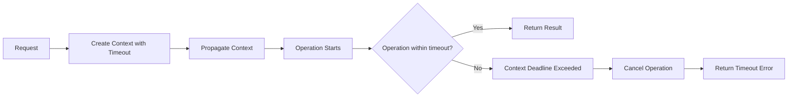

# Module 24: pkg/timeout

## สำหรับโฟลเดอร์ `pkg/timeout/`

ไฟล์ที่เกี่ยวข้อง:
- `timeout.go` – Core timeout interface and utilities
- `context.go` – Context-based timeout helpers
- `middleware.go` – HTTP/gRPC timeout middleware
- `config.go` – Configuration management
- `examples/main.go` – ตัวอย่างการใช้งาน


## หลักการ (Concept)

### Timeout คืออะไร?
Timeout เป็นกลไกที่กำหนดระยะเวลาสูงสุดที่ระบบจะรอให้การทำงาน (operation) ใดดำเนินการจนเสร็จสิ้นก่อนที่จะตัดสินใจว่าการทำงานนั้นล้มเหลว (timeout error) Timeout เป็นหนึ่งใน resilience patterns ที่สำคัญที่สุดในการพัฒนา distributed systems ช่วยป้องกันไม่ให้ goroutine หรือ request ค้างตลอดไป (goroutine leak) และป้องกันระบบจากการรอคอยทรัพยากรที่ไม่มีวันตอบกลับ

ใน Go การจัดการ timeout ทำได้ง่ายมากด้วย `context.Context` และ `context.WithTimeout`, `context.WithDeadline`, `time.After` และ `time.Ticker`

### มีกี่แบบ? (Timeout Strategies)

| แบบ | คำอธิบาย | ข้อดี | ข้อเสีย | เหมาะกับ |
|-----|----------|--------|---------|----------|
| **Context Timeout** | ใช้ `context.WithTimeout()` กำหนด deadline จาก parent context | Native Go, ใช้ได้กับ几乎所有 operation, cancel อัตโนมัติ | ต้อง propagate context ผ่าน call chain | General purpose, database, HTTP, gRPC |
| **Channel Timeout** | ใช้ `select` ร่วมกับ `time.After` | ง่าย, ไม่ต้องใช้ context | ต้อง manual cancel goroutine (อาจ leak) | Simple operations, single goroutine |
| **HTTP Client Timeout** | ตั้ง `http.Client.Timeout` หรือ `http.Transport` | ครอบคลุมทั้ง request lifecycle |  granularity น้อย (ไม่แยก dial, TLS, response) | HTTP calls |
| **Database Timeout** | `context.WithTimeout` ส่งไปยัง `QueryContext` | แยก control per query | ต้องระวัง timeout ต่ำเกินไป | Database operations |
| **Function Timeout** | wrapper ที่ใช้ channel + goroutine | ใช้ได้กับ function ใดก็ตาม | goroutine leak ถ้าไม่ cleanup | Blocking third-party code |
| **Deadline Propagation** | ส่ง deadline ผ่าน headers (B3, gRPC deadline) | timeout กระจายข้าม services | ต้อง support propagation | Distributed tracing |

**ข้อห้ามสำคัญ:** ห้ามใช้ `time.After` ใน loop โดยไม่ reset เพราะจะเกิด memory leak (timer ไม่ถูก garbage collect จนกว่า timer จะ fire) ควรใช้ `time.NewTimer` และ `Stop()` แทน

### ใช้อย่างไร / นำไปใช้กรณีไหน

**กรณีใช้งานหลัก:**
- **HTTP requests** – ป้องกัน requests ค้างนานเกินไป (เช่น downstream API ช้า)
- **Database queries** – ป้องกัน slow queries ที่อาจ lock table
- **RPC/gRPC calls** – ติดตาม deadline propagation
- **File I/O** – ป้องกัน read/write บน network file system ที่ไม่ตอบสนอง
- **External API calls** – กำหนด timeout ต่อ request (รวมถึง connection, TLS handshake)
- **Background jobs** – ป้องกัน job ที่ทำงานนานเกินไป
- **Distributed transactions** – ใช้ timeout เป็นส่วนหนึ่งของ saga pattern

**รูปแบบการใช้งานพื้นฐาน:**
```go
ctx, cancel := context.WithTimeout(context.Background(), 5*time.Second)
defer cancel()

result, err := doSomething(ctx)
if errors.Is(err, context.DeadlineExceeded) {
    // handle timeout
}
```

### ประโยชน์ที่ได้รับ
- **Prevent resource leaks** – goroutines ไม่ติดค้าง, connections ไม่หมด
- **Improve user experience** – response time มีขอบเขตบน ( predictable latency)
- **Protect downstream** – ป้องกัน slow clients ทำให้ระบบ upstream รับ load มากเกินไป
- **Fail fast** – ไม่ต้องรอ operation ที่ likely จะล้มเหลว
- **Deadline propagation** – timeout ข้าม services (e.g., gRPC deadlines)

### ข้อควรระวัง
- **Timeout too short** – ทำให้ operation ที่ legitimate ต้องล้มเหลว
- **Timeout too long** – อาจ real performance issues
- **Goroutine leaks** – เมื่อใช้ `time.After` หรือ `select` กับ channel ต้องแน่ใจว่าอีก side จะถูก cancel
- **Context cancellation** – ต้องเรียก `defer cancel()` ทุกครั้งเพื่อ release resources
- **Nested timeouts** – child context timeout ต้องน้อยกว่า parent (หรือเท่ากับ)

### ข้อดี
- **Native support in Go** – `context` package เป็น standard library
- **Lightweight** – `context.WithTimeout` มี overhead น้อย
- **Composable** – สามารถ wrap middleware, database driver, HTTP client ได้
- **Testable** – ง่ายในการทดสอบ timeout behavior ด้วย `time` package

### ข้อเสีย
- **Requires propagation** – timeout ต้องส่งผ่าน context ไปยังทุก layer
- **ไม่เหมาะกับ blocking I/O บางประเภท** – system call บางตัวไม่รองรับ context (อาจต้องใช้ goroutine + select)
- **Error handling complexity** – ต้องตรวจสอบ `context.DeadlineExceeded` และ `errors.Is`

### ข้อห้าม
**ห้ามสร้าง context ด้วย `context.WithTimeout` โดยไม่เรียก `cancel`** – จะเกิด goroutine leak (timer ยังทำงานใน background) ต้องใช้ `defer cancel()` เสมอ

**ห้ามใช้ `time.After` ใน production loop โดยไม่ reset** – เพราะจะเกิด memory leak เนื่องจาก timer แต่ละตัวถูกเก็บไว้จนกว่า time จะถึง

**ห้ามกำหนด timeout ที่สั้นเกินไปโดยไม่วิเคราะห์ P99 latency** – จะทำให้ legitimate requests ถูก cancel บ่อย (false positive)


## การออกแบบ Workflow และ Dataflow



### Dataflow ใน Go application:
1. ต้นทางสร้าง `context.WithTimeout` หรือ `WithDeadline`
2. ส่ง context ผ่าน parameter ไปยัง function calls, HTTP requests, database queries
3. Operation ตรวจสอบ `ctx.Done()` เป็นระยะ หรือใช้ `select` ร่วมกับ channel
4. ถ้า timeout เกิดขึ้น, `ctx.Err()` จะเป็น `context.DeadlineExceeded`
5. Resource cleanup (defer cancel, close connections) ต้องถูกเรียก


## ตัวอย่างโค้ดที่รันได้จริง

### โครงสร้างโปรเจกต์
```
pkg/timeout/
├── context.go       # Context helpers
├── http.go          # HTTP client with timeout
├── middleware.go    # HTTP server timeout middleware
├── config.go
└── examples/main.go
```

### 1. การติดตั้ง Dependencies

```bash
# ไม่มี external dependencies นอก standard library
```

### 2. ตัวอย่างโค้ด: Context Helpers

```go
// context.go
package timeout

import (
    "context"
    "time"
)

// WithTimeout is a wrapper that ensures cancel is called.
func WithTimeout(timeout time.Duration) (context.Context, context.CancelFunc) {
    return context.WithTimeout(context.Background(), timeout)
}

// WithCustomTimeout creates a context with timeout and returns a helper.
type TimeoutContext struct {
    ctx    context.Context
    cancel context.CancelFunc
}

func NewTimeoutContext(timeout time.Duration) *TimeoutContext {
    ctx, cancel := context.WithTimeout(context.Background(), timeout)
    return &TimeoutContext{ctx: ctx, cancel: cancel}
}

func (tc *TimeoutContext) Context() context.Context {
    return tc.ctx
}

func (tc *TimeoutContext) Cancel() {
    tc.cancel()
}

// IsTimeout checks if error is context.DeadlineExceeded.
func IsTimeout(err error) bool {
    return err != nil && err == context.DeadlineExceeded
}

// WithTimeoutAndFallback runs operation with timeout, if timeout occurs calls fallback.
func WithTimeoutAndFallback(ctx context.Context, timeout time.Duration, fn func(ctx context.Context) error, fallback func() error) error {
    ctx, cancel := context.WithTimeout(ctx, timeout)
    defer cancel()

    err := fn(ctx)
    if IsTimeout(err) && fallback != nil {
        return fallback()
    }
    return err
}
```

### 3. ตัวอย่างโค้ด: HTTP Client with Timeout

```go
// http.go
package timeout

import (
    "context"
    "net/http"
    "time"
)

// NewHTTPClient returns an HTTP client with configurable timeouts.
func NewHTTPClient(connectTimeout, readTimeout, writeTimeout time.Duration) *http.Client {
    transport := &http.Transport{
        DialContext: (&net.Dialer{
            Timeout: connectTimeout,
        }).DialContext,
        TLSHandshakeTimeout: connectTimeout,
    }
    return &http.Client{
        Transport: transport,
        Timeout:   readTimeout + writeTimeout,
    }
}

// DoWithContext performs HTTP request with context timeout.
func DoWithContext(ctx context.Context, client *http.Client, req *http.Request) (*http.Response, error) {
    req = req.WithContext(ctx)
    return client.Do(req)
}
```

### 4. ตัวอย่างโค้ด: HTTP Middleware

```go
// middleware.go
package timeout

import (
    "context"
    "net/http"
    "time"
)

// TimeoutMiddleware returns a middleware that sets a timeout per request.
func TimeoutMiddleware(timeout time.Duration) func(http.Handler) http.Handler {
    return func(next http.Handler) http.Handler {
        return http.HandlerFunc(func(w http.ResponseWriter, r *http.Request) {
            ctx, cancel := context.WithTimeout(r.Context(), timeout)
            defer cancel()

            r = r.WithContext(ctx)
            done := make(chan struct{})
            go func() {
                next.ServeHTTP(w, r)
                close(done)
            }()

            select {
            case <-done:
                return
            case <-ctx.Done():
                w.WriteHeader(http.StatusGatewayTimeout)
                w.Write([]byte(`{"error":"request timeout"}`))
                return
            }
        })
    }
}

// TimeoutHandler is a standard http.Handler that wraps with timeout.
func TimeoutHandler(h http.Handler, timeout time.Duration, msg string) http.Handler {
    return http.TimeoutHandler(h, timeout, msg)
}
```

### 5. ตัวอย่างโค้ด: Configuration

```go
// config.go
package timeout

import "time"

type Config struct {
    DefaultTimeout time.Duration
    HTTPTimeout    time.Duration
    DBTimeout      time.Duration
    RPCTimeout     time.Duration
}

func DefaultConfig() Config {
    return Config{
        DefaultTimeout: 30 * time.Second,
        HTTPTimeout:    10 * time.Second,
        DBTimeout:      5 * time.Second,
        RPCTimeout:     15 * time.Second,
    }
}
```

### 6. ตัวอย่างการใช้งานรวมใน Main

```go
// main.go
package main

import (
    "context"
    "log"
    "net/http"
    "time"

    "yourproject/pkg/timeout"
)

func main() {
    cfg := timeout.DefaultConfig()

    // Example 1: Using context timeout directly
    ctx, cancel := context.WithTimeout(context.Background(), cfg.DefaultTimeout)
    defer cancel()
    if err := callService(ctx); err != nil {
        log.Printf("error: %v", err)
    }

    // Example 2: HTTP server with timeout middleware
    mux := http.NewServeMux()
    mux.HandleFunc("/api", slowHandler)
    handler := timeout.TimeoutMiddleware(5 * time.Second)(mux)

    log.Println("server on :8080")
    log.Fatal(http.ListenAndServe(":8080", handler))
}

func slowHandler(w http.ResponseWriter, r *http.Request) {
    select {
    case <-time.After(10 * time.Second):
        w.Write([]byte("done"))
    case <-r.Context().Done():
        w.WriteHeader(http.StatusGatewayTimeout)
        w.Write([]byte("timeout"))
    }
}

func callService(ctx context.Context) error {
    // simulate work
    select {
    case <-time.After(2 * time.Second):
        return nil
    case <-ctx.Done():
        return ctx.Err()
    }
}
```


## วิธีใช้งาน module นี้

1. ใช้ `context.WithTimeout` ในทุก operation ที่ต้องมี timeout
2. ใช้ HTTP middleware `TimeoutMiddleware` หรือ `http.TimeoutHandler` สำหรับ HTTP server
3. ตั้งค่า `http.Client.Timeout` สำหรับ HTTP client
4. ส่ง context ไปยัง database driver (`db.QueryContext(ctx, ...)`)
5. ตรวจสอบ error ด้วย `errors.Is(err, context.DeadlineExceeded)`
6. ใช้ `defer cancel()` ทุกครั้ง


## การติดตั้ง

```bash
# ไม่ต้องติดตั้ง package เพิ่ม (ใช้ standard library)
```


## การตั้งค่า configuration

```go
type TimeoutConfig struct {
    Default  time.Duration // default timeout for operations
    HTTP     time.Duration // HTTP client timeout
    DB       time.Duration // database query timeout
    RPC      time.Duration // gRPC/RPC timeout
}
```

Environment variables:
```bash
TIMEOUT_DEFAULT=30s
TIMEOUT_HTTP=10s
TIMEOUT_DB=5s
TIMEOUT_RPC=15s
```


## การรวมกับ GORM

```go
import "gorm.io/gorm"

func FindUserWithTimeout(db *gorm.DB, id string, timeout time.Duration) (*User, error) {
    ctx, cancel := context.WithTimeout(context.Background(), timeout)
    defer cancel()
    var user User
    err := db.WithContext(ctx).Where("id = ?", id).First(&user).Error
    return &user, err
}
```


## การใช้งานจริง

### Example 1: Database Query Timeout

```go
func GetOrders(db *sql.DB, userID string) ([]Order, error) {
    ctx, cancel := context.WithTimeout(context.Background(), 3*time.Second)
    defer cancel()
    rows, err := db.QueryContext(ctx, "SELECT * FROM orders WHERE user_id = $1", userID)
    if err != nil {
        return nil, err
    }
    defer rows.Close()
    // process rows
    return orders, nil
}
```

### Example 2: External API Call with Timeout and Fallback

```go
func FetchUser(ctx context.Context, id string) (*User, error) {
    client := &http.Client{Timeout: 5 * time.Second}
    req, _ := http.NewRequestWithContext(ctx, "GET", "https://api.example.com/users/"+id, nil)
    resp, err := client.Do(req)
    if err != nil {
        if errors.Is(err, context.DeadlineExceeded) {
            // return cached user
            return getCachedUser(id)
        }
        return nil, err
    }
    defer resp.Body.Close()
    // decode user
    return user, nil
}
```

### Example 3: gRPC Client with Timeout

```go
conn, _ := grpc.Dial("localhost:50051")
client := pb.NewUserServiceClient(conn)
ctx, cancel := context.WithTimeout(context.Background(), 2*time.Second)
defer cancel()
resp, err := client.GetUser(ctx, &pb.GetUserRequest{Id: "123"})
```


## ตารางสรุป Timeout Components

| Component | คำอธิบาย | ตัวอย่าง |
|-----------|----------|----------|
| **context.WithTimeout** | สร้าง context ที่มี deadline | `ctx, cancel := context.WithTimeout(parent, 5*time.Second)` |
| **context.WithDeadline** | สร้าง context ที่มี deadline แน่นอน | `ctx, cancel := context.WithDeadline(parent, time.Now().Add(5*time.Minute))` |
| **DeadlineExceeded** | error เมื่อ timeout | `errors.Is(err, context.DeadlineExceeded)` |
| **http.TimeoutHandler** | HTTP handler middleware | `http.TimeoutHandler(handler, 5*time.Second, "timeout")` |
| **http.Client.Timeout** |  timeout สำหรับ HTTP request ทั้งหมด | `&http.Client{Timeout: 10*time.Second}` |
| **db.QueryContext** | database query ที่รับ context | `db.QueryContext(ctx, "SELECT ...")` |
| **grpc.DialContext** | gRPC connection ที่รับ context | `grpc.DialContext(ctx, target)` |
| **select + time.After** | channel-based timeout (risk of leak) | `select { case <-ch: ... case <-time.After(1s): ... }` |
| **time.NewTimer** | timer ที่หยุดได้ (safe) | `timer := time.NewTimer(1s); defer timer.Stop(); select { case <-timer.C: }` |


## แบบฝึกหัดท้าย module (5 ข้อ)

### ข้อ 1: Implement Function Timeout Without Context (using channel)
จงเขียนฟังก์ชัน `WithTimeout(fn func() error, timeout time.Duration) error` ที่ใช้ goroutine + channel + `time.After` โดยไม่ใช้ context และจัดการกรณี goroutine leak (ใช้ buffered channel) และทดสอบกับ fn ที่ทำงานนาน

### ข้อ 2: HTTP Client with Granular Timeouts
สร้าง HTTP client ที่แยก timeout เป็น三个阶段: dial timeout, TLS handshake timeout, response header timeout, และ 전체 request timeout โดยใช้ `http.Transport` และ `http.Client.Timeout`

### ข้อ 3: Database Connection Pool with Timeout
จำลอง connection pool (channel of struct{}) ที่มี timeout ในการ acquire connection โดยใช้ `select` + `time.After` พร้อมกับ context cancellation ถ้า acquire ไม่ทันภายใน timeout ให้ return error

### ข้อ 4: Timeout Middleware for Gin/Echo
เขียน middleware สำหรับ Gin framework ที่ inject timeout context และเมื่อ timeout เกิดขึ้นให้ response HTTP 504 และ cancel การทำงาน โดยใช้ `context.WithTimeout` และ gin handler ที่ respect context

### ข้อ 5: Distributed Timeout Propagation (B3 headers)
สร้าง HTTP client และ server ที่ propagate timeout ผ่าน headers (ใช้ B3 timeout header หรือ custom header) โดย server ต้องใช้ remaining time จาก header เพื่อตั้ง context timeout (ไม่เกิน original deadline) และ client ต้องคำนวณ remaining time ก่อนส่ง


## แหล่งอ้างอิง

- [Go context package documentation](https://pkg.go.dev/context)
- [Go blog: Context and structs](https://go.dev/blog/context)
- [net/http TimeoutHandler](https://pkg.go.dev/net/http#TimeoutHandler)
- [Graceful shutdown and timeouts in Go](https://dev.to/captainpenguin/graceful-shutdown-and-timeouts-in-go-3f2n)
- [Timeout vs Deadline in Distributed Systems](https://aws.amazon.com/builders-library/timeouts-retries-and-backoff-with-jitter/)

---

**หมายเหตุ:** module นี้ครบถ้วนสำหรับ `pkg/timeout` สำหรับระบบ gobackend หากต้องการ module เพิ่มเติม (เช่น `pkg/cancelation`, `pkg/gracefulshutdown`) โปรดแจ้ง