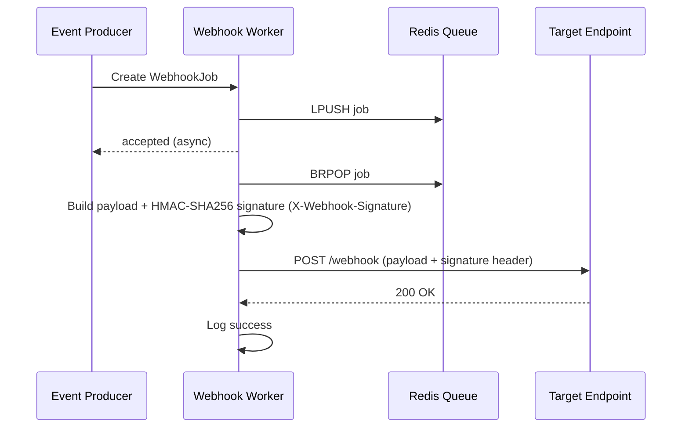

# Module 28: pkg/webhook (Generic Webhook Sender & Receiver)

## สำหรับโฟลเดอร์ `internal/pkg/webhook/`

ไฟล์ที่เกี่ยวข้อง:
- `internal/pkg/webhook/client.go`
- `internal/pkg/webhook/sender.go`
- `internal/pkg/webhook/signature.go`
- `internal/pkg/webhook/worker.go`
- `internal/pkg/webhook/retry.go`
- `internal/pkg/webhook/rate_limiter.go`
- `internal/pkg/webhook/receiver.go`
- `internal/repository/webhook_log.go`
- `migrations/webhook_logs.sql`

---

## หลักการ (Concept)

### Generic Webhook คืออะไร?

Webhook คือ HTTP callback ชนิดหนึ่งที่ระบบส่งข้อมูลไปยัง URL ที่กำหนดโดยอัตโนมัติเมื่อเกิดเหตุการณ์ (event) เช่น เมื่ออุณหภูมิเกิน threshold หรือเมื่อมี alert ใหม่ ส่วน Generic Webhook Sender คือแพ็คเกจที่ทำให้ระบบสามารถส่ง HTTP request ไปยังปลายทางใดๆ ได้อย่างยืดหยุ่น รองรับการตั้ง header, body format (JSON, XML, form), การ sign request เพื่อความปลอดภัย, การ retry อัตโนมัติ, การจำกัดอัตราส่ง, และการจัดคิว (queue) เพื่อไม่ให้ระบบหลักถูกบล็อก.

### มีกี่แบบ? (Webhook Integration Patterns)

| แบบ | ลักษณะ | ข้อดี | ข้อเสีย | เหมาะกับ |
|-----|--------|------|---------|----------|
| **Outgoing Webhook (Sender)** | ระบบของเราส่ง HTTP request ไปยัง API อื่น | ง่าย, ใช้กับ webhook endpoint ภายนอก (Slack, Discord, Datadog) | ต้องจัดการ retry, rate limit | แจ้งเตือนไปยัง third‑party |
| **Incoming Webhook (Receiver)** | รับ HTTP request จากภายนอก | รับข้อมูลจากระบบอื่น (GitHub, CI/CD) | ต้อง validate signature ป้องกันปลอม | รับ webhook จากภายนอก |
| **Signed Webhook** | ใช้ HMAC หรือ RSA sign payload | ปลอดภัย ตรวจสอบ source ได้ | ซับซ้อนขึ้น | Production, security‑critical |
| **Queue‑based Webhook** | ใช้ queue เก็บงานก่อนส่ง | ไม่บล็อก main thread, durable | เพิ่ม complexity | High‑volume events |

**ข้อห้ามสำคัญ:** ห้ามใช้ Bucket Pattern ร่วมกับ Time Series Collections เพราะจะลดประสิทธิภาพ — แต่สำหรับ webhook module นี้ไม่เกี่ยวข้อง

### ใช้อย่างไร / นำไปใช้กรณีไหน

1. **Send alerts to third‑party** – ส่งข้อมูล alert ไปยัง Slack, Discord, Datadog, หรือ PagerDuty
2. **Trigger external automation** – เมื่อเซนเซอร์เกิน threshold ให้เรียก API ของระบบควบคุมอาคาร
3. **Forward sensor data** – ส่งข้อมูลดิบไปยัง external analytics platform
4. **Receive webhook from external systems** – รับข้อมูลจาก GitHub, Jenkins, หรือ monitoring tools
5. **Integration with legacy systems** – ส่งข้อมูลผ่าน HTTP ไปยังระบบเก่าที่มี REST API

### ประโยชน์ที่ได้รับ

- **Decoupling** – แยก event producer และ consumer ออกจากกัน
- **Asynchronous** – ไม่บล็อก main request processing
- **Retry & backoff** – จัดการความล้มเหลวชั่วคราวของปลายทาง
- **Queue persistence** – เก็บงานไว้ใน Redis/DB เพื่อไม่ให้สูญหาย
- **Rate limiting** – ป้องกันการ overwhelm ปลายทาง
- **Signature validation** – ตรวจสอบความถูกต้องของ webhook ที่เข้ามา
- **Flexible payload** – รองรับ JSON, XML, form‑encoded, plain text
- **Logging & auditing** – บันทึกทุกการส่งและรับ

### ข้อควรระวัง

- **Timeout** – ปลายทางอาจช้าหรือไม่ตอบกลับ ควรตั้ง timeout (5-10 วินาที)
- **Retry storm** – ถ้าปลายทางล้มเหลวทุก request อาจเกิด retry พร้อมกัน (ใช้ backoff และ jitter)
- **Queue size** – ระวัง queue เต็ม ต้องมี monitoring และ dead letter queue
- **Security** – ต้องใช้ HTTPS และ signature เพื่อป้องกันปลอมแปลง
- **Header injection** – ระวังการส่ง headers ที่อาจเป็นอันตราย
- **Payload size** – Webhook endpoint ส่วนใหญ่จำกัด payload ขนาด (Slack: 40KB, Discord: 2000 chars)
- **Idempotency** – ควรออกแบบให้ปลายทางรองรับ idempotency (ใช้ message ID)

### ข้อดี
- ยืดหยุ่น, ใช้กับ third‑party ได้, asynchronous, durable, secure (signature)

### ข้อเสีย
- complexity สูง, ต้องจัดการ queue, retry, rate limit
- debugging ยากขึ้น (งานถูก process ทีหลัง)

### ข้อห้าม
- ห้ามส่ง sensitive data ใน plain text (ต้องใช้ HTTPS)
- ห้าม hardcode webhook URL และ secret ใน source code
- ห้าม ignore signature validation สำหรับ incoming webhook (เสี่ยงถูกปลอมแปลง)
- ห้ามใช้ timeout นานเกินไป (ควรไม่เกิน 30 วินาที)
- ห้าม retry เกิน 3-5 ครั้งโดยไม่มี backoff (จะเพิ่ม load ให้ปลายทาง)


## การออกแบบ Workflow และ Dataflow

### Workflow: การส่ง Webhook แบบ Asynchronous

```mermaid
flowchart TB
    Start[Event: Sensor exceeds threshold] --> BuildPayload[สร้าง payload + headers]
    BuildPayload --> Sign[Sign payload (optional)]
    Sign --> Enqueue[Enqueue to Redis/DB queue]
    Enqueue --> Worker[Worker picks up job]
    Worker --> RateLimiter{Check rate limit per endpoint}
    RateLimiter -->|available| Send[HTTP POST to URL]
    RateLimiter -->|busy| Wait[Wait for token]
    Send -->|2xx| Log[Log success]
    Send -->|429/5xx| Retry{Retry < max}
    Retry -->|yes| Backoff[Exponential backoff + jitter] --> Enqueue
    Retry -->|no| DeadLetter[Dead Letter Queue + Alert]
    Log --> Done[Done]
```

**รูปที่ 45:** ขั้นตอนการส่ง webhook แบบ asynchronous พร้อม queue, rate limit, และ retry

### Dataflow: Webhook with Signature (Outgoing)



**รูปที่ 46:** Sequence diagram แสดงการส่ง webhook พร้อม signature และ retry queue


## ตัวอย่างโค้ดที่รันได้จริง

### 1. Core Types & Client – `client.go`

```go
// Package webhook provides generic webhook sending and receiving with queue, retry, and signing.
// ----------------------------------------------------------------
// แพ็คเกจ webhook ให้บริการส่งและรับ webhook ทั่วไป พร้อม queue, retry, และการ sign
package webhook

import (
	"bytes"
	"context"
	"crypto/hmac"
	"crypto/sha256"
	"encoding/hex"
	"encoding/json"
	"fmt"
	"io"
	"net/http"
	"time"
)

// Method represents HTTP method for webhook.
// ----------------------------------------------------------------
// Method แทน HTTP method สำหรับ webhook
type Method string

const (
	MethodPost Method = "POST"
	MethodPut  Method = "PUT"
	MethodPatch Method = "PATCH"
)

// ContentType represents payload format.
// ----------------------------------------------------------------
// ContentType แทนรูปแบบ payload
type ContentType string

const (
	ContentTypeJSON ContentType = "application/json"
	ContentTypeXML  ContentType = "application/xml"
	ContentTypeForm ContentType = "application/x-www-form-urlencoded"
	ContentTypeText ContentType = "text/plain"
)

// WebhookPayload represents a webhook message to be sent.
// ----------------------------------------------------------------
// WebhookPayload แทนข้อความ webhook ที่จะส่ง
type WebhookPayload struct {
	URL         string
	Method      Method
	Headers     map[string]string
	Body        []byte
	ContentType ContentType
	Timeout     time.Duration
}

// WebhookResponse represents the response from webhook endpoint.
// ----------------------------------------------------------------
// WebhookResponse แทน response จาก webhook endpoint
type WebhookResponse struct {
	StatusCode int
	Body       []byte
	Headers    http.Header
}

// Client handles HTTP requests for webhook.
// ----------------------------------------------------------------
// Client จัดการ HTTP requests สำหรับ webhook
type Client struct {
	httpClient *http.Client
}

// NewClient creates a new webhook client with default timeout.
// ----------------------------------------------------------------
// NewClient สร้าง webhook client ใหม่พร้อม timeout เริ่มต้น
func NewClient(timeout time.Duration) *Client {
	return &Client{
		httpClient: &http.Client{Timeout: timeout},
	}
}

// Send sends a webhook request synchronously.
// ----------------------------------------------------------------
// Send ส่ง webhook request แบบ同步
func (c *Client) Send(ctx context.Context, payload *WebhookPayload) (*WebhookResponse, error) {
	req, err := http.NewRequestWithContext(ctx, string(payload.Method), payload.URL, bytes.NewReader(payload.Body))
	if err != nil {
		return nil, err
	}
	for k, v := range payload.Headers {
		req.Header.Set(k, v)
	}
	req.Header.Set("Content-Type", string(payload.ContentType))
	if payload.Timeout > 0 {
		// override client timeout if payload specifies
		client := &http.Client{Timeout: payload.Timeout}
		resp, err := client.Do(req)
		if err != nil {
			return nil, err
		}
		defer resp.Body.Close()
		body, _ := io.ReadAll(resp.Body)
		return &WebhookResponse{
			StatusCode: resp.StatusCode,
			Body:       body,
			Headers:    resp.Header,
		}, nil
	}
	resp, err := c.httpClient.Do(req)
	if err != nil {
		return nil, err
	}
	defer resp.Body.Close()
	body, _ := io.ReadAll(resp.Body)
	return &WebhookResponse{
		StatusCode: resp.StatusCode,
		Body:       body,
		Headers:    resp.Header,
	}, nil
}
```

### 2. Signature Helper – `signature.go`

```go
package webhook

import (
	"crypto/hmac"
	"crypto/sha256"
	"encoding/hex"
	"fmt"
)

// Signer generates HMAC-SHA256 signature for webhook payloads.
// ----------------------------------------------------------------
// Signer สร้าง HMAC-SHA256 signature สำหรับ payload ของ webhook
type Signer struct {
	secret []byte
}

// NewSigner creates a new signer with a secret key.
// ----------------------------------------------------------------
// NewSigner สร้าง signer ใหม่ด้วย secret key
func NewSigner(secret string) *Signer {
	return &Signer{secret: []byte(secret)}
}

// Sign generates a signature for the given body.
// Returns hex-encoded HMAC-SHA256.
// ----------------------------------------------------------------
// Sign สร้าง signature สำหรับ body ที่กำหนด
// คืนค่า HMAC-SHA256 ที่เข้ารหัสเป็น hex
func (s *Signer) Sign(body []byte) string {
	mac := hmac.New(sha256.New, s.secret)
	mac.Write(body)
	return hex.EncodeToString(mac.Sum(nil))
}

// Verify checks if the signature matches the body.
// ----------------------------------------------------------------
// Verify ตรวจสอบว่า signature ตรงกับ body หรือไม่
func (s *Signer) Verify(body []byte, signature string) bool {
	expected := s.Sign(body)
	return hmac.Equal([]byte(expected), []byte(signature))
}

// AddSignatureHeader adds a signature header to the payload headers.
// ----------------------------------------------------------------
// AddSignatureHeader เพิ่ม signature header ใน headers ของ payload
func (s *Signer) AddSignatureHeader(payload *WebhookPayload, headerName string) {
	if payload.Headers == nil {
		payload.Headers = make(map[string]string)
	}
	payload.Headers[headerName] = s.Sign(payload.Body)
}
```

### 3. Webhook Queue & Job – `worker.go`

```go
package webhook

import (
	"context"
	"encoding/json"
	"log"
	"sync"
	"time"

	"github.com/redis/go-redis/v9"
	"github.com/google/uuid"
)

// WebhookJob represents a queued webhook task.
// ----------------------------------------------------------------
// WebhookJob แทนงาน webhook ที่อยู่ในคิว
type WebhookJob struct {
	ID         string          `json:"id"`
	Payload    *WebhookPayload `json:"payload"`
	RetryCount int             `json:"retry_count"`
	NextRetry  time.Time       `json:"next_retry"`
}

// Queue defines interface for webhook task queue.
// ----------------------------------------------------------------
// Queue กำหนด interface สำหรับคิวงาน webhook
type Queue interface {
	Enqueue(ctx context.Context, job *WebhookJob) error
	Dequeue(ctx context.Context, timeout time.Duration) (*WebhookJob, error)
	Requeue(ctx context.Context, job *WebhookJob, delay time.Duration) error
}

// RedisQueue implements Queue using Redis list.
// ----------------------------------------------------------------
// RedisQueue อิมพลีเมนต์ Queue ด้วย Redis list
type RedisQueue struct {
	client *redis.Client
	key    string
}

// NewRedisQueue creates a new Redis queue.
// ----------------------------------------------------------------
// NewRedisQueue สร้าง Redis queue ใหม่
func NewRedisQueue(client *redis.Client, queueKey string) *RedisQueue {
	return &RedisQueue{client: client, key: queueKey}
}

// Enqueue adds a job to the queue.
// ----------------------------------------------------------------
// Enqueue เพิ่มงานเข้าคิว
func (q *RedisQueue) Enqueue(ctx context.Context, job *WebhookJob) error {
	data, err := json.Marshal(job)
	if err != nil {
		return err
	}
	return q.client.RPush(ctx, q.key, data).Err()
}

// Dequeue retrieves a job from the queue (blocking).
// ----------------------------------------------------------------
// Dequeue ดึงงานออกจากคิว (แบบบล็อก)
func (q *RedisQueue) Dequeue(ctx context.Context, timeout time.Duration) (*WebhookJob, error) {
	result, err := q.client.BLPop(ctx, timeout, q.key).Result()
	if err == redis.Nil {
		return nil, nil
	}
	if err != nil {
		return nil, err
	}
	if len(result) < 2 {
		return nil, nil
	}
	var job WebhookJob
	if err := json.Unmarshal([]byte(result[1]), &job); err != nil {
		return nil, err
	}
	return &job, nil
}

// Requeue pushes job back to queue after delay.
// ----------------------------------------------------------------
// Requeue ใส่งานกลับคิวหลังจากดีเลย์
func (q *RedisQueue) Requeue(ctx context.Context, job *WebhookJob, delay time.Duration) error {
	data, err := json.Marshal(job)
	if err != nil {
		return err
	}
	return q.client.RPush(ctx, q.key, data).Err()
}

// WebhookWorker handles background webhook sending with retries and rate limiting.
// ----------------------------------------------------------------
// WebhookWorker จัดการการส่ง webhook ในพื้นหลังพร้อม retry และ rate limit
type WebhookWorker struct {
	queue       Queue
	client      *Client
	rateLimiter *RateLimiter
	retryPolicy *RetryPolicy
	workers     int
	queueChan   chan *WebhookJob
	wg          sync.WaitGroup
	stopCh      chan struct{}
}

// NewWebhookWorker creates a new webhook worker.
// ----------------------------------------------------------------
// NewWebhookWorker สร้าง webhook worker ใหม่
func NewWebhookWorker(queue Queue, client *Client, workers int) *WebhookWorker {
	return &WebhookWorker{
		queue:       queue,
		client:      client,
		rateLimiter: NewRateLimiter(5, 10), // 5 requests/sec per endpoint (adjustable)
		retryPolicy: DefaultRetryPolicy(),
		workers:     workers,
		queueChan:   make(chan *WebhookJob, 100),
		stopCh:      make(chan struct{}),
	}
}

// Start begins the worker goroutines.
// ----------------------------------------------------------------
// Start เริ่ม worker goroutines
func (w *WebhookWorker) Start(ctx context.Context) {
	go w.fetchLoop(ctx)
	for i := 0; i < w.workers; i++ {
		w.wg.Add(1)
		go w.workerLoop(ctx, i)
	}
	log.Printf("WebhookWorker started with %d workers", w.workers)
}

// Stop gracefully shuts down the worker.
// ----------------------------------------------------------------
// Stop ปิด worker อย่างนุ่มนวล
func (w *WebhookWorker) Stop() {
	close(w.stopCh)
	w.wg.Wait()
}

func (w *WebhookWorker) fetchLoop(ctx context.Context) {
	for {
		select {
		case <-ctx.Done():
			return
		case <-w.stopCh:
			return
		default:
			job, err := w.queue.Dequeue(ctx, 5*time.Second)
			if err != nil {
				log.Printf("Webhook dequeue error: %v", err)
				continue
			}
			if job == nil {
				continue
			}
			select {
			case w.queueChan <- job:
			case <-w.stopCh:
				return
			}
		}
	}
}

func (w *WebhookWorker) workerLoop(ctx context.Context, id int) {
	defer w.wg.Done()
	for {
		select {
		case <-ctx.Done():
			return
		case <-w.stopCh:
			return
		case job := <-w.queueChan:
			w.processJob(ctx, job)
		}
	}
}

func (w *WebhookWorker) processJob(ctx context.Context, job *WebhookJob) {
	// Wait for rate limiter (per endpoint)
	if err := w.rateLimiter.Wait(ctx, job.Payload.URL); err != nil {
		return
	}
	resp, err := w.client.Send(ctx, job.Payload)
	if err != nil {
		log.Printf("Webhook send failed: %v, url=%s, retry=%d, jobID=%s", err, job.Payload.URL, job.RetryCount, job.ID)
		w.handleRetry(ctx, job, err)
		return
	}
	if resp.StatusCode >= 200 && resp.StatusCode < 300 {
		log.Printf("Webhook sent successfully, url=%s, status=%d, jobID=%s", job.Payload.URL, resp.StatusCode, job.ID)
		return
	}
	// Non-2xx response
	log.Printf("Webhook returned non-2xx: %d, url=%s, jobID=%s", resp.StatusCode, job.Payload.URL, job.ID)
	w.handleRetry(ctx, job, fmt.Errorf("status %d", resp.StatusCode))
}

func (w *WebhookWorker) handleRetry(ctx context.Context, job *WebhookJob, err error) {
	if job.RetryCount < w.retryPolicy.MaxRetries {
		job.RetryCount++
		job.NextRetry = time.Now().Add(w.retryPolicy.Backoff(job.RetryCount))
		if requeueErr := w.queue.Requeue(ctx, job, 0); requeueErr != nil {
			log.Printf("Failed to requeue webhook job %s: %v", job.ID, requeueErr)
		}
	} else {
		log.Printf("Webhook job %s failed after %d retries: %v", job.ID, w.retryPolicy.MaxRetries, err)
		// Could move to dead letter queue
	}
}
```

### 4. Retry Policy & Rate Limiter – `retry.go` & `rate_limiter.go`

```go
package webhook

import (
	"context"
	"math"
	"sync"
	"time"
)

// RetryPolicy defines retry behavior.
// ----------------------------------------------------------------
// RetryPolicy กำหนดพฤติกรรมการ retry
type RetryPolicy struct {
	MaxRetries int
	BaseDelay  time.Duration
	MaxDelay   time.Duration
	Jitter     bool
}

// DefaultRetryPolicy returns a sensible default.
// ----------------------------------------------------------------
// DefaultRetryPolicy คืนค่า retry policy ที่เหมาะสม
func DefaultRetryPolicy() *RetryPolicy {
	return &RetryPolicy{
		MaxRetries: 3,
		BaseDelay:  time.Second,
		MaxDelay:   30 * time.Second,
		Jitter:     true,
	}
}

// Backoff calculates the delay for a given retry attempt.
// ----------------------------------------------------------------
// Backoff คำนวณ delay สำหรับการ retry ครั้งที่กำหนด
func (p *RetryPolicy) Backoff(attempt int) time.Duration {
	delay := time.Duration(float64(p.BaseDelay) * math.Pow(2, float64(attempt-1)))
	if delay > p.MaxDelay {
		delay = p.MaxDelay
	}
	if p.Jitter {
		// Add jitter: random ±20%
		jitterRange := float64(delay) * 0.2
		jitter := time.Duration(rand.Float64()*2*jitterRange - jitterRange)
		delay += jitter
	}
	return delay
}

// RateLimiter implements per-endpoint token bucket rate limiting.
// ----------------------------------------------------------------
// RateLimiter จำกัดอัตราการส่ง webhook ต่อ endpoint
type RateLimiter struct {
	mu        sync.Mutex
	buckets   map[string]*tokenBucket
	rate      float64 // tokens per second
	burst     int
}

type tokenBucket struct {
	tokens     int
	lastRefill time.Time
}

// NewRateLimiter creates a rate limiter with default tokens per second.
// ----------------------------------------------------------------
// NewRateLimiter สร้าง rate limiter
func NewRateLimiter(requestsPerSec float64, burst int) *RateLimiter {
	return &RateLimiter{
		buckets: make(map[string]*tokenBucket),
		rate:    requestsPerSec,
		burst:   burst,
	}
}

// Wait blocks until a token is available for the given endpoint.
// ----------------------------------------------------------------
// Wait บล็อกจนกว่าจะมี token สำหรับ endpoint ที่กำหนด
func (r *RateLimiter) Wait(ctx context.Context, endpoint string) error {
	for {
		select {
		case <-ctx.Done():
			return ctx.Err()
		default:
		}
		r.mu.Lock()
		bucket := r.getBucket(endpoint)
		r.refill(bucket)
		if bucket.tokens > 0 {
			bucket.tokens--
			r.mu.Unlock()
			return nil
		}
		r.mu.Unlock()
		time.Sleep(100 * time.Millisecond)
	}
}

func (r *RateLimiter) getBucket(endpoint string) *tokenBucket {
	if b, ok := r.buckets[endpoint]; ok {
		return b
	}
	b := &tokenBucket{
		tokens:     r.burst,
		lastRefill: time.Now(),
	}
	r.buckets[endpoint] = b
	return b
}

func (r *RateLimiter) refill(b *tokenBucket) {
	now := time.Now()
	elapsed := now.Sub(b.lastRefill).Seconds()
	newTokens := int(elapsed * r.rate)
	if newTokens > 0 {
		b.tokens += newTokens
		if b.tokens > r.burst {
			b.tokens = r.burst
		}
		b.lastRefill = now
	}
}
```

### 5. Webhook Receiver (Incoming) – `receiver.go`

```go
package webhook

import (
	"encoding/json"
	"io"
	"net/http"
)

// ReceiverConfig holds configuration for incoming webhook receiver.
// ----------------------------------------------------------------
// ReceiverConfig เก็บค่ากำหนดสำหรับรับ webhook ขาเข้า
type ReceiverConfig struct {
	Secret           string // HMAC secret for signature verification
	SignatureHeader  string // Header name containing signature (e.g., "X-Webhook-Signature")
	MaxBodySize      int64  // maximum payload size (bytes)
}

// Receiver handles incoming webhook requests.
// ----------------------------------------------------------------
// Receiver จัดการ webhook request ขาเข้า
type Receiver struct {
	config  *ReceiverConfig
	handler func(payload []byte, headers http.Header) error
}

// NewReceiver creates a new webhook receiver.
// ----------------------------------------------------------------
// NewReceiver สร้าง webhook receiver ใหม่
func NewReceiver(cfg *ReceiverConfig, handler func(payload []byte, headers http.Header) error) *Receiver {
	return &Receiver{
		config:  cfg,
		handler: handler,
	}
}

// ServeHTTP implements http.Handler for incoming webhooks.
// ----------------------------------------------------------------
// ServeHTTP อิมพลีเมนต์ http.Handler สำหรับ webhook ขาเข้า
func (r *Receiver) ServeHTTP(w http.ResponseWriter, req *http.Request) {
	// Limit body size
	if r.config.MaxBodySize > 0 {
		req.Body = http.MaxBytesReader(w, req.Body, r.config.MaxBodySize)
	}
	body, err := io.ReadAll(req.Body)
	if err != nil {
		http.Error(w, "Failed to read body", http.StatusBadRequest)
		return
	}
	// Verify signature if configured
	if r.config.Secret != "" && r.config.SignatureHeader != "" {
		signature := req.Header.Get(r.config.SignatureHeader)
		if signature == "" {
			http.Error(w, "Missing signature header", http.StatusUnauthorized)
			return
		}
		signer := NewSigner(r.config.Secret)
		if !signer.Verify(body, signature) {
			http.Error(w, "Invalid signature", http.StatusUnauthorized)
			return
		}
	}
	// Call handler
	if err := r.handler(body, req.Header); err != nil {
		http.Error(w, err.Error(), http.StatusInternalServerError)
		return
	}
	w.WriteHeader(http.StatusOK)
}
```

### 6. Webhook Log Model – `internal/models/webhook_log.go`

```go
package models

import "time"

// WebhookLog stores webhook sending history.
// ----------------------------------------------------------------
// WebhookLog เก็บประวัติการส่ง webhook
type WebhookLog struct {
	BaseModel
	JobID      string    `gorm:"index"`
	URL        string    `gorm:"type:text"`
	Method     string
	StatusCode int
	Status     string    // pending, sent, failed
	Error      string
	SentAt     time.Time
}
```

### 7. Migration SQL – `migrations/webhook_logs.up.sql`

```sql
CREATE TABLE IF NOT EXISTS webhook_logs (
    id BIGSERIAL PRIMARY KEY,
    job_id VARCHAR(36) NOT NULL,
    url TEXT NOT NULL,
    method VARCHAR(10),
    status_code INT,
    status VARCHAR(20) NOT NULL,
    error TEXT,
    sent_at TIMESTAMP NOT NULL,
    created_at TIMESTAMP NOT NULL DEFAULT CURRENT_TIMESTAMP,
    updated_at TIMESTAMP NOT NULL DEFAULT CURRENT_TIMESTAMP,
    deleted_at TIMESTAMP
);

CREATE INDEX idx_webhook_logs_job_id ON webhook_logs(job_id);
CREATE INDEX idx_webhook_logs_status ON webhook_logs(status);
CREATE INDEX idx_webhook_logs_sent_at ON webhook_logs(sent_at);
```

**migrations/webhook_logs.down.sql**
```sql
DROP TABLE IF EXISTS webhook_logs;
```


## วิธีใช้งาน module นี้

### การติดตั้ง

```bash
go get github.com/redis/go-redis/v9
go get github.com/google/uuid
```

### การตั้งค่า configuration

```go
webhookClient := webhook.NewClient(10 * time.Second)
queue := webhook.NewRedisQueue(redisClient, "queue:webhook")
worker := webhook.NewWebhookWorker(queue, webhookClient, 3)
worker.Start(context.Background())
defer worker.Stop()
```

### การรวมกับ GORM (สำหรับ WebhookLog)

```go
db.AutoMigrate(&models.WebhookLog{})
```

### การใช้งานจริง (ตัวอย่างใน rule engine)

```go
// สร้าง payload
payload := &webhook.WebhookPayload{
    URL:         "https://hooks.slack.com/services/xxx",
    Method:      webhook.MethodPost,
    ContentType: webhook.ContentTypeJSON,
    Headers: map[string]string{
        "X-Custom": "value",
    },
    Body: jsonData,
}
signer := webhook.NewSigner("my-secret")
signer.AddSignatureHeader(payload, "X-Webhook-Signature")

job := &webhook.WebhookJob{
    ID:      uuid.New().String(),
    Payload: payload,
}
queue.Enqueue(context.Background(), job)
```


## ตารางสรุป Components

| Component | หน้าที่ | ตัวอย่าง |
|-----------|--------|----------|
| `Client` | HTTP client สำหรับส่ง webhook | `Send()` |
| `Signer` | สร้าง/ตรวจสอบ HMAC signature | `Sign()`, `Verify()` |
| `RedisQueue` | คิวงาน webhook | `Enqueue()`, `Dequeue()` |
| `WebhookWorker` | จัดการคิว, retry, rate limit | `Start()`, `Enqueue()` |
| `RateLimiter` | จำกัดอัตราส่งต่อ endpoint | `Wait()` |
| `RetryPolicy` | Exponential backoff + jitter | `Backoff()` |
| `Receiver` | รับและตรวจสอบ webhook ขาเข้า | `ServeHTTP()` |
| `WebhookLog` | เก็บประวัติการส่ง | `models.WebhookLog` |


## แบบฝึกหัดท้าย module (5 ข้อ)

1. เพิ่ม `DeadLetterQueue` ใน `WebhookWorker` สำหรับงานที่ล้มเหลวหลัง retry ครบ โดยใช้ Redis list อีกตัว
2. Implement `BatchSender` ที่รวมหลาย webhook job เข้าเป็น batch request (ถ้า endpoint รองรับ)
3. เพิ่ม circuit breaker pattern ใน `WebhookWorker` ที่เปิด/ปิด endpoint ชั่วคราวเมื่อล้มเหลวติดต่อกันเกิน threshold
4. สร้าง `TemplatePayload` helper ที่สร้าง payload จาก template (Go template) ก่อนส่ง
5. Implement webhook retry with `Retry-After` header (ใช้ delay จาก header แทน backoff)


## แหล่งอ้างอิง

- [Discord Webhook API](https://discord.com/developers/docs/resources/webhook)
- [Slack Incoming Webhooks](https://api.slack.com/messaging/webhooks)
- [HMAC signing for webhooks](https://webhook.site/docs/signature-validation)
- [Exponential backoff with jitter](https://aws.amazon.com/blogs/architecture/exponential-backoff-and-jitter/)
- [Redis as a message queue](https://redis.io/docs/latest/develop/use/patterns/message-queue/)
- [Circuit breaker pattern](https://martinfowler.com/bliki/CircuitBreaker.html)

---

**หมายเหตุ:** module นี้ครบถ้วนสำหรับ `pkg/webhook` สำหรับระบบ gobackend หากต้องการ module เพิ่มเติม (เช่น `pkg/slack`, `pkg/msteams`, `pkg/pagerduty`) โปรดแจ้ง