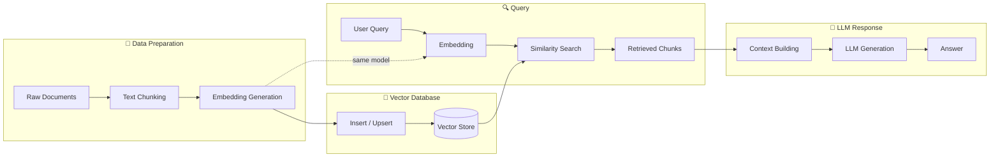

# Module 21: pkg/vectordb


## สำหรับโฟลเดอร์ `pkg/vectordb/`

ไฟล์ที่เกี่ยวข้อง:
- `client.go` - การสร้าง client สำหรับ vector database (Milvus, Qdrant, pgvector)
- `embedding.go` - การสร้าง embeddings ผ่าน provider (OpenAI, Ollama, local models)
- `store.go` - การ insert, upsert, และ delete vectors
- `search.go` - การค้นหาแบบ semantic search, similarity search, hybrid search
- `schema.go` - การกำหนด schema สำหรับ collection/document
- `filter.go` - การสร้าง metadata filters (payload filters)
- `config.go` - การตั้งค่า connection และ batch sizes
- `middleware.go` - HTTP middleware สำหรับ RAG endpoints
- `example_main.go` - ตัวอย่างการใช้งานครบวงจร


## หลักการ (Concept)

### Vector Database คืออะไร?
Vector database เป็นระบบฐานข้อมูลที่ออกแบบมาเฉพาะสำหรับการจัดเก็บ จัดการ และค้นหาข้อมูลในรูปแบบเวกเตอร์ (embedding vectors) ซึ่งเป็นตัวแทนตัวเลขของข้อมูลที่ไม่ใช่ตัวเลข เช่น ข้อความ รูปภาพ หรือเสียง โดยใช้การคำนวณความคล้ายคลึงทางคณิตศาสตร์เพื่อค้นหาข้อมูลที่มีความหมายใกล้เคียงกันที่สุด

Go เองไม่มีฟังก์ชันสำหรับการค้นหาข้อมูลแบบ vector ภายในตัว (native vector retrieval) ดังนั้นจึงจำเป็นต้องพึ่งพา external service หรือ library[reference:0]โดย Go เป็นภาษา standard สำหรับ vector databases หลายตัวที่เขียนด้วย Go เอง (เช่น Milvus, Weaviate)[reference:1]

### มีกี่แบบ? (Formats / Types of Vector Databases)

| ประเภท | ตัวอย่าง | คำอธิบาย | เหมาะกับ |
|--------|---------|----------|----------|
| **Dedicated Vector DB** | Milvus, Qdrant, Weaviate | ออกแบบมาเฉพาะสำหรับ vector search โดยเฉพาะ | Production, large scale |
| **Extension on Existing DB** | pgvector (PostgreSQL) | เพิ่ม vector capability ให้กับ relational database | Existing PostgreSQL, small scale |
| **Embedded/Library** | chromem-go, gvdb | ทำงานใน process ของ Go ไม่ต้องแยก service | Development, prototyping, small scale |
| **Managed Cloud** | Pinecone, Tencent VectorDB, VikingDB | Fully-managed service โดย cloud provider | Enterprise, ต้องการ low maintenance |

### ใช้อย่างไร / นำไปใช้กรณีไหน

**กรณีใช้งานหลัก:**
- **RAG (Retrieval-Augmented Generation)** - ดึงเอกสารที่เกี่ยวข้องก่อนส่งให้ LLM เพื่อตอบคำถาม
- **Semantic search** - ค้นหาข้อมูลตามความหมาย แทนการจับคู่ keyword
- **Recommendation systems** - แนะนำเนื้อหาที่คล้ายกับที่ผู้ใช้สนใจ
- **Knowledge base / Q&A systems** - ระบบฐานความรู้และตอบคำถาม
- **Similarity detection** - ตรวจหาข้อความหรือเอกสารที่คล้ายกัน
- **Image/text search** - ค้นหารูปภาพหรือข้อความด้วยความหมาย

**แนวทางการเลือก:**
- **Qdrant** – เหมาะกับ中小规模 production, API ออกแบบดี, ใช้ Go client ได้ง่าย[reference:2][reference:3]
- **Milvus** – รองรับการขยายแนวนอน (horizontal scaling), จัดการ vector จำนวนมาก[reference:4][reference:5]
- **pgvector** – ถ้ามี PostgreSQL อยู่แล้ว, vector 百万级以内, ไม่ต้องการ运维 component เพิ่ม[reference:6]
- **chromem-go** – ใช้งานภายใน Go process, development, prototype[reference:7]

### ข้อห้ามสำคัญ
**ห้ามใช้ใน-memory vector store (เช่น chromem-go) ใน production ขนาดใหญ่** เพราะไม่มี persistence ที่ robust, concurrent control ที่สมบูรณ์, และไม่รองรับ distributed scaling และการทดสอบ local ยังคงใช้ได้[reference:8]

**ห้ามใช้ embedding models ที่ไม่ตรงกันระหว่าง indexing และ query** – query embedding model และ chunk embedding model ต้องเป็น model เดียวกัน มิฉะนั้น cosine similarity ที่คำนวณได้จะไม่มีความหมาย[reference:9]

**ห้ามใช้ Go SDK version ที่ไม่ stable สำหรับ Milvus** – สำหรับ Milvus แนะนำ lock SDK version ที่ v2.4.5 เพื่อความเสถียร[reference:10]


## การออกแบบ Workflow และ Dataflow



**Dataflow ใน Go application (RAG pipeline):**
1. **Text Chunking** – ตัดข้อความเอกสารเป็น chunk ขนาด 256-512 token[reference:11]
2. **Embedding** – แปลงแต่ละ chunk เป็น vector ด้วย embedding model (OpenAI, Ollama)
3. **Store** – Insert vectors พร้อม metadata ลง vector database
4. **Query** – แปลงคำถามผู้ใช้เป็น vector ด้วย model เดียวกัน
5. **Search** – ค้นหาความคล้ายคลึง (cosine similarity, dot product, Euclidean)
6. **Context Building** – นำผลลัพธ์ที่ได้มาสร้าง context
7. **LLM Generation** – ส่ง context + คำถามไปยัง LLM เพื่อ generate คำตอบ


## ตัวอย่างโค้ดที่รันได้จริง

### โครงสร้างโปรเจกต์
```
pkg/vectordb/
├── client.go          # Vector DB client abstraction
├── embedding.go       # Embedding providers
├── store.go           # CRUD operations
├── search.go          # Similarity search
├── schema.go          # Collection/document schema
├── filter.go          # Metadata filtering
├── config.go          # Configuration
├── chunker.go         # Text chunking utilities
├── middleware.go      # HTTP middleware for RAG
└── example_main.go    # Complete RAG example
```

### 1. การติดตั้ง Dependencies

```bash
# Core packages
go get github.com/qdrant/go-client
go get github.com/milvus-io/milvus-sdk-go/v2
go get github.com/jackc/pgx/v5
go get github.com/pgvector/pgvector-go
go get github.com/philippgille/chromem-go

# Embedding providers
go get github.com/sashabaranov/go-openai
go get github.com/tmc/langchaingo/llms/ollama

# Text chunking
go get github.com/tmc/langchaingo/textsplitter
```

### 2. การติดตั้ง Vector Database

#### Qdrant (Docker) – สำหรับ production ขนาดเล็กถึงกลาง
```yaml
# docker-compose.yml
version: '3.8'
services:
  qdrant:
    image: qdrant/qdrant:latest
    container_name: qdrant
    ports:
      - "6333:6333"   # HTTP API
      - "6334:6334"   # gRPC API
    volumes:
      - qdrant_storage:/qdrant/storage
    environment:
      - QDRANT__SERVICE__GRPC_PORT=6334
    restart: unless-stopped

volumes:
  qdrant_storage:
```

#### Milvus (Docker) – สำหรับ大规模 distributed
```yaml
version: '3.8'
services:
  etcd:
    container_name: milvus-etcd
    image: quay.io/coreos/etcd:v3.5.5
    environment:
      - ETCD_AUTO_COMPACTION_MODE=revision
      - ETCD_AUTO_COMPACTION_RETENTION=1000
      - ETCD_QUOTA_BACKEND_BYTES=4294967296
    volumes:
      - etcd_data:/etcd
    command: etcd -advertise-client-urls=http://127.0.0.1:2379 -listen-client-urls http://0.0.0.0:2379 --data-dir /etcd

  minio:
    container_name: milvus-minio
    image: minio/minio:RELEASE.2023-03-20T20-16-18Z
    environment:
      MINIO_ACCESS_KEY: minioadmin
      MINIO_SECRET_KEY: minioadmin
    volumes:
      - minio_data:/minio_data
    command: minio server /minio_data
    healthcheck:
      test: ["CMD", "curl", "-f", "http://localhost:9000/minio/health/live"]
      interval: 30s
      timeout: 20s
      retries: 3

  standalone:
    container_name: milvus-standalone
    image: milvusdb/milvus:v2.4.5
    command: ["milvus", "run", "standalone"]
    environment:
      ETCD_ENDPOINTS: etcd:2379
      MINIO_ADDRESS: minio:9000
    volumes:
      - milvus_data:/var/lib/milvus
    ports:
      - "19530:19530"
    depends_on:
      - etcd
      - minio

volumes:
  etcd_data:
  minio_data:
  milvus_data:
```

#### PostgreSQL + pgvector (สำหรับ existing PostgreSQL)
```sql
-- ติดตั้ง pgvector extension
CREATE EXTENSION IF NOT EXISTS vector;

-- สร้างตาราง
CREATE TABLE documents (
    id TEXT PRIMARY KEY,
    content TEXT NOT NULL,
    embedding vector(1536),
    metadata JSONB,
    created_at TIMESTAMP DEFAULT NOW()
);

-- สร้าง index เพื่อเพิ่มความเร็ว (IVFFlat หรือ HNSW)
CREATE INDEX ON documents USING ivfflat (embedding vector_cosine_ops);
```

### 3. ตัวอย่างโค้ด: Configuration

```go
// config.go
package vectordb

import (
    "os"
    "time"
)

type DBType string

const (
    DBTypeQdrant   DBType = "qdrant"
    DBTypeMilvus   DBType = "milvus"
    DBTypePgvector DBType = "pgvector"
    DBTypeChroma   DBType = "chroma"
)

type EmbeddingProvider string

const (
    ProviderOpenAI EmbeddingProvider = "openai"
    ProviderOllama EmbeddingProvider = "ollama"
)

type Config struct {
    // Vector database
    DBType     DBType
    DBHost     string
    DBPort     int
    DBUser     string
    DBPassword string
    
    // Collection settings
    CollectionName string
    VectorDim      int
    
    // Embedding
    EmbeddingProvider EmbeddingProvider
    EmbeddingModel    string
    OpenAIAPIKey      string
    OllamaURL         string
    
    // Chunking
    ChunkSize    int
    ChunkOverlap int
    
    // Search
    DefaultTopK int
}

func DefaultConfig() Config {
    return Config{
        DBType:            DBTypeQdrant,
        DBHost:            "localhost",
        DBPort:            6333,
        CollectionName:    "documents",
        VectorDim:         1536,
        EmbeddingProvider: ProviderOpenAI,
        EmbeddingModel:    "text-embedding-3-small",
        ChunkSize:         512,
        ChunkOverlap:      64,
        DefaultTopK:       5,
    }
}

func LoadConfigFromEnv() Config {
    cfg := DefaultConfig()
    
    if url := os.Getenv("VECTOR_DB_URL"); url != "" {
        // parse host and port from URL
    }
    if apiKey := os.Getenv("OPENAI_API_KEY"); apiKey != "" {
        cfg.OpenAIAPIKey = apiKey
    }
    if ollamaURL := os.Getenv("OLLAMA_URL"); ollamaURL != "" {
        cfg.OllamaURL = ollamaURL
    }
    if chunkSize := os.Getenv("CHUNK_SIZE"); chunkSize != "" {
        // parse int
    }
    return cfg
}
```

### 4. ตัวอย่างโค้ด: Qdrant Client

```go
// client_qdrant.go
package vectordb

import (
    "context"
    "fmt"
    
    "github.com/qdrant/go-client"
)

type QdrantStore struct {
    client     *qdrant.Client
    collection string
}

func NewQdrantStore(cfg Config) (*QdrantStore, error) {
    client, err := qdrant.NewClient(&qdrant.Config{
        Host:   cfg.DBHost,
        Port:   cfg.DBPort,
        UseTLS: false,
    })
    if err != nil {
        return nil, err
    }
    
    // Ensure collection exists
    collectionName := cfg.CollectionName
    vectorDim := uint64(cfg.VectorDim)
    
    exists, err := client.CollectionExists(context.Background(), collectionName)
    if err != nil {
        return nil, err
    }
    
    if !exists {
        err = client.CreateCollection(context.Background(), &qdrant.CreateCollection{
            CollectionName: collectionName,
            VectorsConfig: qdrant.NewVectorsConfig(&qdrant.VectorParams{
                Size:     &vectorDim,
                Distance: qdrant.DistanceCosine.Ptr(),
            }),
        })
        if err != nil {
            return nil, err
        }
    }
    
    return &QdrantStore{
        client:     client,
        collection: collectionName,
    }, nil
}

// Insert adds a document with its embedding
func (s *QdrantStore) Insert(ctx context.Context, id string, vector []float32, payload map[string]interface{}) error {
    points := []*qdrant.PointStruct{
        {
            Id:      qdrant.NewIDUUID(id),
            Vectors: qdrant.NewVectors(vector...),
            Payload: payload,
        },
    }
    
    _, err := s.client.Upsert(ctx, &qdrant.UpsertPoints{
        CollectionName: s.collection,
        Points:         points,
    })
    return err
}

// Search performs similarity search
func (s *QdrantStore) Search(ctx context.Context, vector []float32, limit int, filter map[string]interface{}) ([]SearchResult, error) {
    // Build payload filter if provided
    var payloadFilter *qdrant.Filter
    if filter != nil {
        payloadFilter = &qdrant.Filter{}
        for k, v := range filter {
            payloadFilter.Must = append(payloadFilter.Must, &qdrant.Condition{
                Field: &qdrant.FieldCondition{
                    Key: k,
                    Match: &qdrant.Match{
                        Value: v,
                    },
                },
            })
        }
    }
    
    results, err := s.client.Search(ctx, &qdrant.SearchPoints{
        CollectionName: s.collection,
        Vector:         vector,
        Limit:          uint64(limit),
        Filter:         payloadFilter,
        WithPayload:    &qdrant.WithPayloadSelector{Enable: true},
    })
    if err != nil {
        return nil, err
    }
    
    var searchResults []SearchResult
    for _, r := range results {
        searchResults = append(searchResults, SearchResult{
            ID:       r.Id.GetUuid(),
            Score:    float64(*r.Score),
            Payload:  r.Payload,
        })
    }
    return searchResults, nil
}
```

### 5. ตัวอย่างโค้ด: Embedding Provider

```go
// embedding.go
package vectordb

import (
    "context"
    "fmt"
    
    "github.com/sashabaranov/go-openai"
)

type Embedder interface {
    Embed(ctx context.Context, texts []string) ([][]float32, error)
    GetDimension() int
}

type OpenAIEmbedder struct {
    client  *openai.Client
    model   string
    dim     int
}

func NewOpenAIEmbedder(apiKey, model string, dim int) *OpenAIEmbedder {
    return &OpenAIEmbedder{
        client: openai.NewClient(apiKey),
        model:  model,
        dim:    dim,
    }
}

func (e *OpenAIEmbedder) Embed(ctx context.Context, texts []string) ([][]float32, error) {
    resp, err := e.client.CreateEmbeddings(ctx, openai.EmbeddingRequest{
        Input: texts,
        Model: openai.EmbeddingModel(e.model),
    })
    if err != nil {
        return nil, fmt.Errorf("embedding failed: %w", err)
    }
    
    vectors := make([][]float32, len(resp.Data))
    for i, item := range resp.Data {
        // Convert []float64 to []float32
        vec := make([]float32, len(item.Embedding))
        for j, v := range item.Embedding {
            vec[j] = float32(v)
        }
        vectors[i] = vec
    }
    return vectors, nil
}

func (e *OpenAIEmbedder) GetDimension() int {
    return e.dim
}
```

### 6. ตัวอย่างโค้ด: Text Chunking

```go
// chunker.go
package vectordb

import (
    "crypto/md5"
    "encoding/hex"
    "fmt"
    
    "github.com/tmc/langchaingo/textsplitter"
)

type Chunk struct {
    ID       string
    Text     string
    Metadata map[string]interface{}
}

type Chunker struct {
    splitter textsplitter.RecursiveCharacterTextSplitter
    size     int
    overlap  int
}

func NewChunker(size, overlap int) *Chunker {
    splitter := textsplitter.NewRecursiveCharacterTextSplitter(
        textsplitter.WithChunkSize(size),
        textsplitter.WithChunkOverlap(overlap),
        textsplitter.WithSeparators([]string{"\n\n", "\n", ". ", " ", ""}),
    )
    return &Chunker{
        splitter: splitter,
        size:     size,
        overlap:  overlap,
    }
}

// SplitDocument splits a document into chunks
func (c *Chunker) SplitDocument(docID, content string, baseMetadata map[string]interface{}) ([]Chunk, error) {
    chunks, err := c.splitter.SplitText(content)
    if err != nil {
        return nil, err
    }
    
    // Deduplicate chunks using MD5
    seen := make(map[string]bool)
    var result []Chunk
    
    for i, chunkText := range chunks {
        // Create hash for deduplication
        hash := md5.Sum([]byte(chunkText))
        hashStr := hex.EncodeToString(hash[:])
        
        if seen[hashStr] {
            continue
        }
        seen[hashStr] = true
        
        // Create chunk ID
        chunkID := fmt.Sprintf("%s_chunk_%d", docID, i)
        
        // Copy metadata
        metadata := make(map[string]interface{})
        for k, v := range baseMetadata {
            metadata[k] = v
        }
        metadata["chunk_index"] = i
        metadata["source_doc_id"] = docID
        
        result = append(result, Chunk{
            ID:       chunkID,
            Text:     chunkText,
            Metadata: metadata,
        })
    }
    
    return result, nil
}
```

### 7. ตัวอย่างโค้ด: RAG Service

```go
// rag.go
package vectordb

import (
    "context"
    "fmt"
    "log/slog"
    "strings"
    "time"
)

type Document struct {
    ID       string
    Content  string
    Metadata map[string]interface{}
}

type SearchResult struct {
    ID       string
    Score    float64
    Payload  map[string]interface{}
}

type RAGService struct {
    store    VectorStore
    embedder Embedder
    chunker  *Chunker
    topK     int
}

type VectorStore interface {
    Insert(ctx context.Context, id string, vector []float32, payload map[string]interface{}) error
    Search(ctx context.Context, vector []float32, limit int, filter map[string]interface{}) ([]SearchResult, error)
    Close() error
}

func NewRAGService(store VectorStore, embedder Embedder, chunker *Chunker, topK int) *RAGService {
    return &RAGService{
        store:    store,
        embedder: embedder,
        chunker:  chunker,
        topK:     topK,
    }
}

// AddDocument processes and adds a document to the vector store
func (r *RAGService) AddDocument(ctx context.Context, doc Document) error {
    // Split document into chunks
    chunks, err := r.chunker.SplitDocument(doc.ID, doc.Content, doc.Metadata)
    if err != nil {
        return fmt.Errorf("failed to chunk document: %w", err)
    }
    
    if len(chunks) == 0 {
        return fmt.Errorf("no chunks generated from document")
    }
    
    // Extract chunk texts for batch embedding
    chunkTexts := make([]string, len(chunks))
    for i, c := range chunks {
        chunkTexts[i] = c.Text
    }
    
    // Generate embeddings for all chunks
    embeddings, err := r.embedder.Embed(ctx, chunkTexts)
    if err != nil {
        return fmt.Errorf("failed to generate embeddings: %w", err)
    }
    
    // Insert each chunk into vector store
    for i, chunk := range chunks {
        payload := map[string]interface{}{
            "text":      chunk.Text,
            "doc_id":    doc.ID,
            "chunk_idx": i,
        }
        // Merge metadata
        for k, v := range chunk.Metadata {
            payload[k] = v
        }
        
        if err := r.store.Insert(ctx, chunk.ID, embeddings[i], payload); err != nil {
            slog.Warn("failed to insert chunk", "chunk_id", chunk.ID, "error", err)
        }
    }
    
    slog.Info("document added", "doc_id", doc.ID, "chunks", len(chunks))
    return nil
}

// Query retrieves relevant chunks for a user question
func (r *RAGService) Query(ctx context.Context, question string, filter map[string]interface{}) ([]string, error) {
    start := time.Now()
    
    // Embed the question
    embeddings, err := r.embedder.Embed(ctx, []string{question})
    if err != nil {
        return nil, fmt.Errorf("failed to embed question: %w", err)
    }
    questionVector := embeddings[0]
    
    // Search for similar chunks
    results, err := r.store.Search(ctx, questionVector, r.topK, filter)
    if err != nil {
        return nil, fmt.Errorf("failed to search: %w", err)
    }
    
    // Extract chunk texts from results
    var chunks []string
    for _, res := range results {
        if text, ok := res.Payload["text"].(string); ok {
            chunks = append(chunks, text)
        }
    }
    
    slog.Info("query completed", 
        "question", question, 
        "results", len(chunks), 
        "duration_ms", time.Since(start).Milliseconds())
    
    return chunks, nil
}

// BuildContext builds a context string from retrieved chunks
func (r *RAGService) BuildContext(chunks []string, maxTokens int) string {
    if len(chunks) == 0 {
        return ""
    }
    
    // Simple truncation strategy
    var builder strings.Builder
    totalLen := 0
    
    for _, chunk := range chunks {
        if totalLen+len(chunk) > maxTokens {
            break
        }
        builder.WriteString(chunk)
        builder.WriteString("\n\n")
        totalLen += len(chunk)
    }
    
    return builder.String()
}

func (r *RAGService) Close() error {
    return r.store.Close()
}
```

### 8. ตัวอย่างโค้ด: HTTP Middleware สำหรับ RAG

```go
// middleware.go
package vectordb

import (
    "context"
    "encoding/json"
    "net/http"
    "strings"
    "time"
)

type RAGHandler struct {
    rag *RAGService
}

func NewRAGHandler(rag *RAGService) *RAGHandler {
    return &RAGHandler{rag: rag}
}

// QueryRequest represents a RAG query request
type QueryRequest struct {
    Question string                 `json:"question"`
    Filter   map[string]interface{} `json:"filter,omitempty"`
}

// QueryResponse represents a RAG query response
type QueryResponse struct {
    Question   string   `json:"question"`
    Chunks     []string `json:"chunks"`
    Context    string   `json:"context"`
    Count      int      `json:"count"`
    DurationMs int64    `json:"duration_ms"`
}

// HandleQuery handles RAG query requests
func (h *RAGHandler) HandleQuery(w http.ResponseWriter, r *http.Request) {
    var req QueryRequest
    if err := json.NewDecoder(r.Body).Decode(&req); err != nil {
        http.Error(w, "Invalid request body", http.StatusBadRequest)
        return
    }
    
    if strings.TrimSpace(req.Question) == "" {
        http.Error(w, "Question is required", http.StatusBadRequest)
        return
    }
    
    start := time.Now()
    
    // Query the vector database
    chunks, err := h.rag.Query(r.Context(), req.Question, req.Filter)
    if err != nil {
        http.Error(w, err.Error(), http.StatusInternalServerError)
        return
    }
    
    // Build context
    contextStr := h.rag.BuildContext(chunks, 4000)
    
    resp := QueryResponse{
        Question:   req.Question,
        Chunks:     chunks,
        Context:    contextStr,
        Count:      len(chunks),
        DurationMs: time.Since(start).Milliseconds(),
    }
    
    w.Header().Set("Content-Type", "application/json")
    json.NewEncoder(w).Encode(resp)
}

// HandleAddDocument handles document ingestion requests
func (h *RAGHandler) HandleAddDocument(w http.ResponseWriter, r *http.Request) {
    var doc Document
    if err := json.NewDecoder(r.Body).Decode(&doc); err != nil {
        http.Error(w, "Invalid request body", http.StatusBadRequest)
        return
    }
    
    if doc.ID == "" || strings.TrimSpace(doc.Content) == "" {
        http.Error(w, "ID and content are required", http.StatusBadRequest)
        return
    }
    
    err := h.rag.AddDocument(r.Context(), doc)
    if err != nil {
        http.Error(w, err.Error(), http.StatusInternalServerError)
        return
    }
    
    w.WriteHeader(http.StatusCreated)
    json.NewEncoder(w).Encode(map[string]interface{}{
        "status": "ok",
        "doc_id": doc.ID,
    })
}
```

### 9. ตัวอย่างการใช้งานรวมใน Main

```go
// main.go
package main

import (
    "context"
    "log"
    "net/http"
    "os"
    "os/signal"
    "time"
    
    "yourproject/pkg/vectordb"
)

func main() {
    // Load configuration
    cfg := vectordb.DefaultConfig()
    cfg.OpenAIAPIKey = os.Getenv("OPENAI_API_KEY")
    cfg.ChunkSize = 512
    cfg.ChunkOverlap = 64
    cfg.DefaultTopK = 5
    
    // Initialize vector store (Qdrant)
    store, err := vectordb.NewQdrantStore(cfg)
    if err != nil {
        log.Fatalf("Failed to connect to Qdrant: %v", err)
    }
    defer store.Close()
    
    // Initialize embedder
    embedder := vectordb.NewOpenAIEmbedder(
        cfg.OpenAIAPIKey,
        cfg.EmbeddingModel,
        cfg.VectorDim,
    )
    
    // Initialize chunker
    chunker := vectordb.NewChunker(cfg.ChunkSize, cfg.ChunkOverlap)
    
    // Initialize RAG service
    ragService := vectordb.NewRAGService(store, embedder, chunker, cfg.DefaultTopK)
    defer ragService.Close()
    
    // Initialize HTTP handlers
    ragHandler := vectordb.NewRAGHandler(ragService)
    
    // Setup routes
    mux := http.NewServeMux()
    mux.HandleFunc("POST /api/documents", ragHandler.HandleAddDocument)
    mux.HandleFunc("POST /api/query", ragHandler.HandleQuery)
    mux.HandleFunc("GET /health", func(w http.ResponseWriter, r *http.Request) {
        w.WriteHeader(http.StatusOK)
        w.Write([]byte(`{"status":"ok"}`))
    })
    
    // Start server
    server := &http.Server{
        Addr:    ":8080",
        Handler: mux,
    }
    
    go func() {
        log.Println("Server starting on :8080")
        if err := server.ListenAndServe(); err != nil && err != http.ErrServerClosed {
            log.Fatalf("Server error: %v", err)
        }
    }()
    
    // Graceful shutdown
    quit := make(chan os.Signal, 1)
    signal.Notify(quit, os.Interrupt)
    <-quit
    
    ctx, cancel := context.WithTimeout(context.Background(), 10*time.Second)
    defer cancel()
    server.Shutdown(ctx)
}
```

### 10. pgvector Implementation

```go
// client_pgvector.go
package vectordb

import (
    "context"
    "database/sql"
    "fmt"
    
    _ "github.com/jackc/pgx/v5/stdlib"
    "github.com/pgvector/pgvector-go"
)

type PgvectorStore struct {
    db         *sql.DB
    tableName  string
}

func NewPgvectorStore(cfg Config) (*PgvectorStore, error) {
    connStr := fmt.Sprintf("host=%s port=%d user=%s password=%s dbname=%s sslmode=disable",
        cfg.DBHost, cfg.DBPort, cfg.DBUser, cfg.DBPassword, "postgres")
    
    db, err := sql.Open("pgx", connStr)
    if err != nil {
        return nil, err
    }
    
    // Enable pgvector extension
    _, err = db.Exec("CREATE EXTENSION IF NOT EXISTS vector")
    if err != nil {
        return nil, err
    }
    
    // Create table if not exists
    createTableSQL := fmt.Sprintf(`
        CREATE TABLE IF NOT EXISTS %s (
            id TEXT PRIMARY KEY,
            content TEXT NOT NULL,
            embedding vector(%d),
            payload JSONB,
            created_at TIMESTAMP DEFAULT NOW()
        )
    `, cfg.CollectionName, cfg.VectorDim)
    
    _, err = db.Exec(createTableSQL)
    if err != nil {
        return nil, err
    }
    
    // Create index for faster search (IVFFlat)
    indexSQL := fmt.Sprintf(`CREATE INDEX IF NOT EXISTS idx_%s_embedding ON %s USING ivfflat (embedding vector_cosine_ops)`, 
        cfg.CollectionName, cfg.CollectionName)
    db.Exec(indexSQL)
    
    return &PgvectorStore{
        db:        db,
        tableName: cfg.CollectionName,
    }, nil
}

func (s *PgvectorStore) Insert(ctx context.Context, id string, vector []float32, payload map[string]interface{}) error {
    // Convert []float32 to pgvector.Vector
    pgVec := pgvector.NewVector(vector)
    
    _, err := s.db.ExecContext(ctx, 
        fmt.Sprintf("INSERT INTO %s (id, content, embedding, payload) VALUES ($1, $2, $3, $4)", s.tableName),
        id, payload["text"], pgVec, payload)
    return err
}

func (s *PgvectorStore) Search(ctx context.Context, vector []float32, limit int, filter map[string]interface{}) ([]SearchResult, error) {
    pgVec := pgvector.NewVector(vector)
    
    query := fmt.Sprintf(`
        SELECT id, content, embedding <=> $1 AS distance, payload
        FROM %s
        ORDER BY embedding <=> $1
        LIMIT $2
    `, s.tableName)
    
    rows, err := s.db.QueryContext(ctx, query, pgVec, limit)
    if err != nil {
        return nil, err
    }
    defer rows.Close()
    
    var results []SearchResult
    for rows.Next() {
        var id, content string
        var distance float64
        var payload map[string]interface{}
        
        if err := rows.Scan(&id, &content, &distance, &payload); err != nil {
            return nil, err
        }
        
        // Convert cosine distance to similarity score (1 - distance)
        results = append(results, SearchResult{
            ID:      id,
            Score:   1 - distance,
            Payload: payload,
        })
    }
    
    return results, nil
}

func (s *PgvectorStore) Close() error {
    return s.db.Close()
}
```


## วิธีใช้งาน module นี้

1. **เลือก vector database** ตามความต้องการและขนาดของระบบ
2. **ติดตั้ง vector database** ด้วย Docker หรือ binary (ตามตัวอย่าง)
3. **ติดตั้ง Go packages** ตามที่ระบุในหัวข้อ "การติดตั้ง Dependencies"
4. **คัดลอกโค้ด** ไฟล์ `client_*.go`, `embedding.go`, `store.go`, `search.go`, `chunker.go`, `rag.go` ไปไว้ใน `pkg/vectordb/`
5. **ปรับ configuration** ตาม environment ของคุณ
6. **สร้าง RAG service** และ expose HTTP endpoints สำหรับ query และ document ingestion
7. **เตรียม embedding API key** (OpenAI หรือตั้งค่า Ollama)


## การติดตั้ง

```bash
# Create module
go mod init yourproject

# Qdrant client
go get github.com/qdrant/go-client

# Milvus SDK
go get github.com/milvus-io/milvus-sdk-go/v2

# pgvector
go get github.com/jackc/pgx/v5
go get github.com/pgvector/pgvector-go

# chromem-go (embedded)
go get github.com/philippgille/chromem-go@latest

# OpenAI embedding
go get github.com/sashabaranov/go-openai

# Text splitting
go get github.com/tmc/langchaingo/textsplitter

# For Docker setup
docker pull qdrant/qdrant:latest
docker pull milvusdb/milvus:v2.4.5
docker pull postgres:15
```


## การตั้งค่า configuration

```yaml
# config.yaml (optional)
vector_db:
  type: "qdrant"  # qdrant, milvus, pgvector, chroma
  host: "localhost"
  port: 6333
  collection: "documents"
  vector_dim: 1536

embedding:
  provider: "openai"  # openai, ollama
  model: "text-embedding-3-small"
  api_key: "${OPENAI_API_KEY}"

chunking:
  chunk_size: 512
  chunk_overlap: 64
  separators: ["\n\n", "\n", ".", " "]

search:
  top_k: 5
  similarity: "cosine"  # cosine, dot, euclidean
```

Environment variables:
```bash
# OpenAI
export OPENAI_API_KEY="sk-..."

# Ollama (optional)
export OLLAMA_URL="http://localhost:11434"

# Vector database (if not default)
export VECTOR_DB_URL="http://localhost:6333"
```

## การรวมกับ GORM

สำหรับ pgvector สามารถใช้ GORM ได้ดังนี้:

```go
import (
    "gorm.io/driver/postgres"
    "gorm.io/gorm"
    "github.com/pgvector/pgvector-go"
)

type Document struct {
    ID        string         `gorm:"primaryKey"`
    Content   string         `gorm:"type:text"`
    Embedding pgvector.Vector `gorm:"type:vector(1536)"`
    Metadata  datatypes.JSON `gorm:"type:jsonb"`
    CreatedAt time.Time
}

func SetupGORMWithPGVector(cfg Config) (*gorm.DB, error) {
    dsn := fmt.Sprintf("host=%s user=%s password=%s dbname=%s port=%d sslmode=disable",
        cfg.DBHost, cfg.DBUser, cfg.DBPassword, "postgres", cfg.DBPort)
    
    db, err := gorm.Open(postgres.Open(dsn), &gorm.Config{})
    if err != nil {
        return nil, err
    }
    
    // Enable pgvector extension
    db.Exec("CREATE EXTENSION IF NOT EXISTS vector")
    
    // Auto migrate
    db.AutoMigrate(&Document{})
    
    return db, nil
}

// Similarity search with GORM
func SearchSimilar(db *gorm.DB, vector pgvector.Vector, limit int) ([]Document, error) {
    var docs []Document
    err := db.Model(&Document{}).
        Select("*, embedding <=> ? as distance", vector).
        Order("embedding <=> ?", vector).
        Limit(limit).
        Find(&docs).Error
    return docs, err
}
```

## การใช้งานจริง

### Example 1: Building a Knowledge Base Q&A System

```go
package main

import (
    "context"
    "fmt"
    "log"
    
    "yourproject/pkg/vectordb"
)

func main() {
    // Setup
    cfg := vectordb.DefaultConfig()
    store, _ := vectordb.NewQdrantStore(cfg)
    embedder := vectordb.NewOpenAIEmbedder(cfg.OpenAIAPIKey, cfg.EmbeddingModel, 1536)
    chunker := vectordb.NewChunker(512, 64)
    rag := vectordb.NewRAGService(store, embedder, chunker, 5)
    
    // Add knowledge base documents
    docs := []vectordb.Document{
        {ID: "doc1", Content: "Go is a statically typed compiled programming language...", Metadata: map[string]interface{}{"category": "programming"}},
        {ID: "doc2", Content: "OpenTelemetry provides observability SDKs for traces, metrics, logs...", Metadata: map[string]interface{}{"category": "observability"}},
    }
    
    for _, doc := range docs {
        rag.AddDocument(context.Background(), doc)
    }
    
    // Query
    chunks, _ := rag.Query(context.Background(), "What is Go?", nil)
    for _, chunk := range chunks {
        fmt.Println("Relevant chunk:", chunk)
    }
}
```

### Example 2: Custom Metadata Filtering

```go
// Search with filter (only documents from specific category)
filter := map[string]interface{}{
    "category": "programming",
}
chunks, _ := rag.Query(ctx, "How to handle concurrency in Go?", filter)
```


## ตารางสรุป Vector Database Components

| Component | คำอธิบาย | ตัวอย่าง |
|-----------|----------|----------|
| **Collection** | คล้าย table เก็บ vectors และ metadata | `CreateCollection("documents", dim=1536)` |
| **Point / Document** | vector + id + payload (metadata) | `{id: "1", vector: [...], payload: {...}}` |
| **Payload / Metadata** | ข้อมูลเพิ่มเติมที่ใช้ในการกรอง | `{"source": "pdf", "page": 5}` |
| **Vector Dimension** | ขนาดของ vector (ขึ้นกับ embedding model) | 1536 (text-embedding-3-small) |
| **Distance Metric** | วิธีวัดความคล้ายคลึง | Cosine, Dot product, Euclidean |
| **HNSW Index** | Graph-based index, search เร็วมาก | HNSW สำหรับ Qdrant, Milvus |
| **IVFFlat Index** | IVF index, เร็วดี memory น้อยกว่า | IVFFlat สำหรับ pgvector |
| **Hybrid Search** | vector search + keyword search | Qdrant, Milvus, pgvector |
| **Upsert** | Insert หรือ Update ถ้ามี id ซ้ำ | `Upsert(points)` |
| **Filter** | กรองตาม metadata ก่อนค้นหา | `filter: {"category": "tech"}` |
| **Semantic Search** | ค้นหาตามความหมาย | embedding + similarity |
| **RAG (Retrieval-Augmented Generation)** | ดึงข้อมูลที่เกี่ยวข้อง + LLM | QA system, chatbot |
| **Text Chunking** | ตัดข้อความเป็นชิ้นเล็กๆ | RecursiveCharacterTextSplitter |
| **Embedding Model** | แปลง text เป็น vector | OpenAI, BGE, Ollama |


## แบบฝึกหัดท้าย module (5 ข้อ)

### ข้อ 1: การออกแบบ Schema และ Index สำหรับ Document Search

ระบบต้องการเก็บเอกสาร 1,000,000 ฉบับ แต่ละฉบับมี:
- ชื่อเอกสาร (string)
- ประเภทเอกสาร (contract, manual, report)
- ผู้สร้าง (string)
- วันที่สร้าง (timestamp)
- embedding (1536 dimensions)

**คำถาม:**
- จงออกแบบ collection สำหรับ Qdrant (กำหนด vector config และ payload schema)
- จงออกแบบ table สำหรับ pgvector (กำหนด index type และ columns)
- อธิบายเหตุผลในการเลือก distance metric (cosine, dot, euclidean)
- กรณีต้องการค้นหาเอกสารที่สร้างระหว่าง 2024-01-01 ถึง 2025-01-01 เท่านั้น สามารถทำได้อย่างไร?

### ข้อ 2: การสร้าง RAG Pipeline อย่างสมบูรณ์

จงสร้างโปรแกรม Go ที่:
- อ่าน PDF หรือข้อความจากไฟล์
- ใช้ RecursiveCharacterTextSplitter ตัดเป็น chunks ขนาด 500 tokens, overlap 50 tokens
- ใช้ OpenAI embedding model สร้าง vectors
- เก็บข้อมูลใน Qdrant พร้อม metadata (source, page number)
- รับคำถามจากผู้ใช้ผ่าน API (POST /ask)
- ค้นหาข้อมูลที่เกี่ยวข้อง 3 อันดับแรก
- รวม context และส่งให้ LLM (OpenAI GPT หรือ Ollama) generate คำตอบ
- ส่ง response กลับเป็น JSON

### ข้อ 3: Hybrid Search Implementation

จากระบบ RAG ในข้อ 2:
- เพิ่มฟังก์ชัน hybrid search ที่รวมทั้ง vector similarity (80%) และ keyword matching (20%)
- เขียนฟังก์ชัน `HybridSearch(query, vectorWeight, textWeight)` ที่:
  - ทำ vector search ได้ 5 อันดับแรก
  - ทำ keyword search (ใช้ PostgreSQL full-text หรือ Qdrant payload filtering) ได้ 5 อันดับแรก
  - รวมผลลัพธ์ด้วย weighted scoring (Reciprocal Rank Fusion หรือ weighted sum)
- เปรียบเทียบผลลัพธ์ระหว่าง pure vector search กับ hybrid search

### ข้อ 4: การ Implement Cache Layer และ Batch Processing

ระบบมีปริมาณ query 1,000 requests/วินาที:
- จงออกแบบ caching strategy สำหรับคำถามที่ซ้ำกัน (ใช้ Redis หรือ in-memory cache)
- กำหนด TTL ที่เหมาะสมสำหรับ cache (5 นาที, 1 ชั่วโมง)
- เขียนฟังก์ชัน `BatchInsertDocuments(docs []Document)` ที่รองรับ batch insert ขนาด 1,000 chunks ต่อครั้ง
- ประมาณการเวลาในการ insert 1,000,000 chunks ด้วย batch size 1,000 (สมมติ embedding time 50ms/chunk)

### ข้อ 5: การ Monitoring และ Alerting สำหรับ RAG System

จากระบบที่ implement ไปแล้ว:
- จงสร้าง Prometheus metrics สำหรับ:
  - `rag_queries_total` (counter) พร้อม labels `status` (success/error)
  - `rag_query_duration_seconds` (histogram)
  - `rag_chunks_retrieved_total` (counter)
  - `rag_cache_hits_total` (counter)
- เขียนฟังก์ชัน `RecordMetrics` ที่ increment metrics ทุกครั้งที่มีการ query
- เขียน alerting rule ใน Prometheus ที่จะ alert เมื่อ:
  - error rate > 5% ใน 5 นาที
  - query duration P95 > 2 วินาที
  - cache hit rate < 30% (อาจต้องปรับ chunking strategy)
- อธิบายวิธีการใช้ OpenTelemetry traces เพื่อ debug RAG pipeline performance


## แหล่งอ้างอิง

- [Qdrant Go Client Documentation](https://github.com/qdrant/go-client)[reference:12]
- [Milvus SDK v2 Documentation](https://milvus.io/blog/introducing-milvus-sdk-v2-native-async-support-unified-apis-and-superior-performance.md)[reference:13]
- [pgvector GitHub Repository](https://github.com/pgvector/pgvector)[reference:14]
- [chromem-go: Embeddable Vector Database for Go](https://github.com/philippgille/chromem-go)[reference:15][reference:16]
- [Go RAG Pipeline Best Practices](https://www.php.cn/faq/2279847.html)[reference:17]
- [Vector Database Comparison 2025](https://github.com/portkeys/vector-db-comparison)[reference:18]
- [Tencent Cloud VectorDB Go SDK](https://cloud.tencent.cn/document/product/1709/102630)[reference:19]
- [OpenAI Embeddings Go Client](https://github.com/sashabaranov/go-openai)
- [LangChain Go Text Splitter](https://github.com/tmc/langchaingo/textsplitter)

---

**หมายเหตุ:** module นี้ครบถ้วนสำหรับ `pkg/vectordb` สำหรับระบบ gobackend สำหรับงาน RAG, semantic search และ AI-powered retrieval หากต้องการ module เพิ่มเติม (เช่น `pkg/embedding`, `pkg/reranker`) โปรดแจ้ง