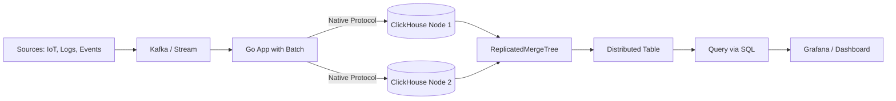

# Module 18: pkg/clickhouse

## สำหรับโฟลเดอร์ `pkg/clickhouse/`

ไฟล์ที่เกี่ยวข้อง:
- `client.go` - การเชื่อมต่อกับ ClickHouse (native protocol)
- `writer.go` - การเขียนข้อมูลแบบ batch และ async insert
- `query.go` - การ query ด้วย SQL และ time-series functions
- `schema.go` - การสร้างตาราง MergeTree พร้อม partition, order by, TTL
- `config.go` - การตั้งค่า connection pool และ compression

---

## หลักการ (Concept)

### ClickHouse คืออะไร?
ClickHouse คือระบบจัดการฐานข้อมูลแบบคอลัมน์ (column-oriented DBMS) ที่ออกแบบมาสำหรับการวิเคราะห์ข้อมูลปริมาณมหาศาลแบบ real-time โดยเฉพาะ [0†L32-L34] สามารถประมวลผล aggregations บนข้อมูลหลายพันล้านแถวได้ในระดับ sub-second [0†L43-L45] แม้จะไม่ได้ถูกออกแบบมาโดยเฉพาะสำหรับ time-series แต่ ClickHouse สามารถจัดเก็บและวิเคราะห์ข้อมูล time-series ได้อย่างมีประสิทธิภาพสูง [0†L7-L9] ด้วยสถาปัตยกรรม columnar ที่ทำให้การบีบอัดข้อมูลมีประสิทธิภาพ และ query aggregations ทำได้รวดเร็ว [0†L14-L15]

### มีกี่แบบ? (Formats / Deployment)

**รูปแบบการติดตั้ง:**
1. **ClickHouse OSS (Open Source)** - ฟรี, รองรับ standalone, cluster, replication
2. **ClickHouse Cloud** - บริการ fully-managed บน AWS/GCP (serverless หรือ dedicated)
3. **ClickHouse Enterprise** - รองรับ security features, backup, advanced monitoring

**ตาราง引擎 (Table Engines) ที่สำคัญ:**
- **MergeTree** - 引擎หลักและใช้งานบ่อยที่สุด รองรับ primary key, partitioning, replication, TTL [1†L11-L12] เหมาะกับ OLAP workloads และ time-series data ขนาดใหญ่ [1†L42-L43]
- **ReplicatedMergeTree** - MergeTree ที่รองรับ replication อัตโนมัติผ่าน ZooKeeper/ClickHouse Keeper [1†L7-L8]
- **Distributed** - ไม่เก็บข้อมูลจริง ทำหน้าที่เป็น proxy สำหรับกระจาย query ไปยัง shard ต่างๆ ใน cluster [1†L19-L21] ใช้ร่วมกับ ReplicatedMergeTree เพื่อให้ transparent sharding [1†L14-L18]
- **Log Family** - Log, TinyLog, StripeLog ใช้กับข้อมูลชุดเล็กที่ต้องการความเร็วในการ insert สูง แต่ไม่ support并发 [1†L6]
- **Integration Family** - Kafka, MySQL, MongoDB, S3 ใช้สำหรับ集成数据จาก external systems [1†L7]

**รูปแบบการจัดเก็บข้อมูล:**
- **Column-oriented Storage** - ข้อมูลแต่ละคอลัมน์เก็บแยกไฟล์ บีบอัดแยกตามประเภทข้อมูล
- **Partition** - การแบ่งข้อมูลตามคีย์ (เช่น按月/วัน) เพื่อลด scope การ query
- **Granule (8192 rows)** - หน่วยที่เล็กที่สุดในการอ่านข้อมูล มี primary key index ช่วย skip granules ที่ไม่เกี่ยวข้อง
- **Data Skipping Index** - index รอง (secondary index) ช่วยกรอง granules ที่ไม่มีข้อมูลตรงตามเงื่อนไข ก่อนอ่านข้อมูลจริง [10†L14-L16]

### ใช้อย่างไร / นำไปใช้กรณีไหน

**กรณีใช้งาน:**
- ระบบ observability (metrics, logs, traces) แบบรวมศูนย์ [7†L30-L32]
- IoT sensor data analysis อุปกรณ์นับล้านเครื่อง ส่งข้อมูลทุกวินาที [7†L43-L45]
- การวิเคราะห์ user behavior และ event tracking (คลิก, หน้าเว็บ) แบบ real-time [7†L23-L25]
- Financial market data analysis และ anomaly detection [7†L20-L21]
- Cybersecurity และ log analytics (SIEM) [7†L27-L29]
- Business intelligence บนข้อมูลขนาดใหญ่ [0†L38-L39]

**รูปแบบการเขียนข้อมูล:**
```sql
-- สร้างตารางแบบ MergeTree สำหรับ time-series data
CREATE TABLE sensor_data (
    timestamp   DateTime64(3) NOT NULL,
    device_id   String NOT NULL,
    sensor_type LowCardinality(String),
    value       Float64,
    metadata    JSON
) ENGINE = MergeTree()
PARTITION BY toYYYYMM(timestamp)
ORDER BY (device_id, timestamp)
TTL timestamp + INTERVAL 30 DAY
SETTINGS index_granularity = 8192;
```

### ประโยชน์ที่ได้รับ
- **Query ความเร็วสูง** - columnar storage + vectorized execution ทำให้ aggregations บนข้อมูลพันล้านแถวทำได้ภายในวินาที [0†L37-L38]
- **Compression สูงมาก** - ข้อมูลซ้ำกันในคอลัมน์ถูกบีบอัดได้ดี (5-10x เมื่อเทียบกับ row-based)
- **SQL standard** - ใช้ SQL แทบ 100% รองรับ JOIN, subquery, window functions, CTE
- **Real-time ingestion** - insert throughput สูงถึงหลายล้านแถวต่อวินาที
- **Automatic data lifecycle** - TTL (Time-To-Live) สำหรับลบข้อมูลเก่าอัตโนมัติ [9†L7-L9]
- **Materialized Views** - pre-aggregate ข้อมูลอัตโนมัติเมื่อมีการ insert [9†L11-L12]

### ข้อควรระวัง
- **ClickHouse ไม่ใช่ transactional database** - ไม่รองรับ ACID แบบ full row-level lock, ไม่เหมาะกับการ update/delete บ่อย
- **การ update/delete มี performance cost สูง** - ควรออกแบบให้ data เป็น append-only
- **Partition ต้องเหมาะสม** - partition ละเอียดเกินไป (เช่น by hour) จะสร้าง parts จำนวนมาก กดดัน后台 merge [5†L5-L6]
- **Primary key ไม่ unique** - ใน ClickHouse primary key ใช้สำหรับเรียงลำดับข้อมูลและสร้าง sparse index เท่านั้น [3†L13-L15]
- **JOIN performance** - การ JOIN ตารางใหญ่ควรทำในขั้นตอน ETL ก่อน หรือใช้ dictionary แทน
- **Memory consumption สูง** - GROUP BY บน high cardinality columns อาจใช้ memory มาก [8†L8-L10]

### ข้อดี
- อ่านและ aggregate ข้อมูลเร็วกว่า TimescaleDB และ PostgreSQL ใน benchmark ส่วนใหญ่ [8†L16]
- บีบอัดข้อมูลได้ดีกว่า InfluxDB และ TimescaleDB สำหรับข้อมูล time-series
- รองรับ advanced analytics เช่น outlier detection, STL decomposition, exponential moving average [12†L4-L10]
- สามารถ query ข้อมูล JSON ได้โดยตรง (รองรับ JSON data type) [4†L6-L8]
- มี ecosystem ขนาดใหญ่ (Grafana, Superset, Metabase, dbt)

### ข้อเสีย
- การเขียนข้อมูล (insert) แต่ละครั้งควรเป็น batch ขนาดใหญ่ (≥10k rows) เพื่อ performance ที่ดี [5†L24]
- การ update/delete ทำได้ยาก ต้อง rewrite both parts
- ต้องการ RAM มากขึ้นในการประมวลผล query เมื่อเทียบกับ InfluxDB [8†L8-L10]
- การ tuning เพื่อ performance ต้องเข้าใจ partition key, order key, และ index granularity

### ข้อห้าม
**ห้ามใช้ ClickHouse เป็น primary database สำหรับระบบ OLTP** (Online Transaction Processing) เช่น ระบบ e-commerce ที่มีการ update/delete บ่อย และต้องการ atomic transactions ClickHouse ออกแบบมาสำหรับ OLAP (Online Analytical Processing) โดยเฉพาะ การนำไปใช้ผิดวัตถุประสงค์จะทำให้ performance ต่ำและ maintenance ยาก【reference: ClickHouse best practices】

---

## การออกแบบ Workflow และ Dataflow



**Dataflow ใน Go application:**
1. Config → สร้าง connection pool (native TCP protocol) [2†L5-L6]
2. Batch insert → ใช้ `PrepareBatch()` เพื่อ insert หลาย thousand rows ต่อครั้ง [14†L15-L16]
3. Async insert → สำหรับ high-throughput scenarios (不รอ acknowledge) [14†L7]
4. Query → ส่ง SQL ปกติ รับผลลัพธ์เป็น struct หรือ Row iterator
5. ปิด connection pool เมื่อจบการทำงาน

---

## ตัวอย่างโค้ดที่รันได้จริง

### โครงสร้างโปรเจกต์
```
pkg/clickhouse/
├── client.go
├── writer.go
├── query.go
├── schema.go
└── example_main.go
```

### 1. การติดตั้ง ClickHouse ด้วย Docker
```bash
docker run -d --name clickhouse -p 8123:8123 -p 9000:9000 \
  -e CLICKHOUSE_DB=metricsdb \
  -e CLICKHOUSE_USER=admin \
  -e CLICKHOUSE_PASSWORD=password \
  clickhouse/clickhouse-server:24.8-alpine
```

### 2. ติดตั้ง Go client
```bash
go get github.com/ClickHouse/clickhouse-go/v2
```

### 3. ตัวอย่างโค้ด: การสร้าง client และ schema

```go
// client.go
package clickhouse

import (
    "context"
    "fmt"
    "time"
    "github.com/ClickHouse/clickhouse-go/v2"
    "github.com/ClickHouse/clickhouse-go/v2/lib/driver"
)

type ClickHouseDB struct {
    conn driver.Conn
}

type Config struct {
    Host     string
    Port     int
    Database string
    Username string
    Password string
    MaxOpenConns int
    MaxIdleConns int
}

func NewClickHouse(cfg Config) (*ClickHouseDB, error) {
    conn, err := clickhouse.Open(&clickhouse.Options{
        Addr: []string{fmt.Sprintf("%s:%d", cfg.Host, cfg.Port)},
        Auth: &clickhouse.Auth{
            Database: cfg.Database,
            Username: cfg.Username,
            Password: cfg.Password,
        },
        Settings: clickhouse.Settings{
            "max_execution_time": 60,
        },
        DialTimeout: 5 * time.Second,
        Compression: &clickhouse.Compression{
            Method: clickhouse.CompressionLZ4,
        },
        MaxOpenConns: cfg.MaxOpenConns,
        MaxIdleConns: cfg.MaxIdleConns,
    })
    if err != nil {
        return nil, err
    }
    return &ClickHouseDB{conn: conn}, nil
}

func (db *ClickHouseDB) Close() error {
    return db.conn.Close()
}

// CreateMetricsTable สร้าง hypertable สำหรับ time-series metrics
func (db *ClickHouseDB) CreateMetricsTable(ctx context.Context) error {
    sql := `
        CREATE TABLE IF NOT EXISTS metrics (
            timestamp   DateTime64(3) NOT NULL,
            device_id   String NOT NULL,
            sensor_type LowCardinality(String),
            value       Float64,
            metadata    JSON
        ) ENGINE = MergeTree()
        PARTITION BY toYYYYMM(timestamp)
        ORDER BY (device_id, timestamp)
        TTL timestamp + INTERVAL 30 DAY
        SETTINGS index_granularity = 8192
    `
    return db.conn.Exec(ctx, sql)
}
```

### 4. ตัวอย่างโค้ด: การเขียนข้อมูลแบบ Batch

```go
// writer.go
package clickhouse

import (
    "context"
    "time"
)

type Metric struct {
    Timestamp  time.Time
    DeviceID   string
    SensorType string
    Value      float64
    Metadata   map[string]interface{}
}

// WriteBatch เขียนข้อมูลหลาย record ด้วย batch API (recommended)
func (db *ClickHouseDB) WriteBatch(ctx context.Context, metrics []Metric) error {
    batch, err := db.conn.PrepareBatch(ctx, `
        INSERT INTO metrics (timestamp, device_id, sensor_type, value, metadata)
    `)
    if err != nil {
        return err
    }
    defer batch.Abort()

    for _, m := range metrics {
        if err := batch.Append(m.Timestamp, m.DeviceID, m.SensorType, m.Value, m.Metadata); err != nil {
            return err
        }
    }
    return batch.Send()
}

// WriteAsyncInsert ใช้ async insert สำหรับ high-throughput (ไม่รอ确认)
func (db *ClickHouseDB) WriteAsyncInsert(ctx context.Context, metrics []Metric) error {
    for _, m := range metrics {
        sql := `
            INSERT INTO metrics (timestamp, device_id, sensor_type, value, metadata)
            VALUES ($1, $2, $3, $4, $5)
        `
        // async insert option
        if err := db.conn.Exec(ctx, sql, m.Timestamp, m.DeviceID, m.SensorType, m.Value, m.Metadata); err != nil {
            return err
        }
    }
    return nil
}

// BulkInsertOptimized  optimized bulk insert with pre-sorted data
func (db *ClickHouseDB) BulkInsertOptimized(ctx context.Context, metrics []Metric) error {
    if len(metrics) == 0 {
        return nil
    }
    // sort by primary key (device_id, timestamp) before insert for better compression
    // ...
    return db.WriteBatch(ctx, metrics)
}
```

### 5. ตัวอย่างโค้ด: การ query และ time-series functions

```go
// query.go
package clickhouse

import (
    "context"
    "time"
)

type AggregatedMetric struct {
    Bucket    time.Time
    DeviceID  string
    AvgValue  float64
    MaxValue  float64
    MinValue  float64
    Count     int
}

// GetHourlyAverage ดึงค่าเฉลี่ยรายชั่วโมงของ device_id ที่ระบุ
func (db *ClickHouseDB) GetHourlyAverage(ctx context.Context, deviceID string, startTime, endTime time.Time) ([]AggregatedMetric, error) {
    sql := `
        SELECT 
            toStartOfHour(timestamp) AS bucket,
            device_id,
            avg(value) AS avg_value,
            max(value) AS max_value,
            min(value) AS min_value,
            count(*) AS count
        FROM metrics
        WHERE device_id = $1 AND timestamp >= $2 AND timestamp < $3
        GROUP BY bucket, device_id
        ORDER BY bucket ASC
    `
    rows, err := db.conn.Query(ctx, sql, deviceID, startTime, endTime)
    if err != nil {
        return nil, err
    }
    defer rows.Close()

    var results []AggregatedMetric
    for rows.Next() {
        var m AggregatedMetric
        if err := rows.Scan(&m.Bucket, &m.DeviceID, &m.AvgValue, &m.MaxValue, &m.MinValue, &m.Count); err != nil {
            return nil, err
        }
        results = append(results, m)
    }
    return results, nil
}

// GetMovingAverage คำนวณ moving average ด้วย window function
func (db *ClickHouseDB) GetMovingAverage(ctx context.Context, deviceID string, duration time.Duration, windowSize int) ([]float64, error) {
    sql := `
        WITH ranked AS (
            SELECT 
                timestamp,
                value,
                row_number() OVER (ORDER BY timestamp) AS row_num
            FROM metrics
            WHERE device_id = $1 AND timestamp >= now() - INTERVAL $2 second
        )
        SELECT 
            timestamp,
            avg(value) OVER (ORDER BY row_num ROWS BETWEEN $3 PRECEDING AND CURRENT ROW) AS moving_avg
        FROM ranked
        ORDER BY timestamp
    `
    rows, err := db.conn.Query(ctx, sql, deviceID, int(duration.Seconds()), windowSize)
    if err != nil {
        return nil, err
    }
    defer rows.Close()

    var movingAverages []float64
    for rows.Next() {
        var ts time.Time
        var avg float64
        if err := rows.Scan(&ts, &avg); err != nil {
            return nil, err
        }
        movingAverages = append(movingAverages, avg)
    }
    return movingAverages, nil
}

// GetLastValues ดึงค่าล่าสุดของแต่ละ device (using argMax)
func (db *ClickHouseDB) GetLastValues(ctx context.Context) (map[string]float64, error) {
    sql := `
        SELECT 
            device_id,
            argMax(value, timestamp) AS last_value
        FROM metrics
        GROUP BY device_id
    `
    rows, err := db.conn.Query(ctx, sql)
    if err != nil {
        return nil, err
    }
    defer rows.Close()

    results := make(map[string]float64)
    for rows.Next() {
        var deviceID string
        var value float64
        if err := rows.Scan(&deviceID, &value); err != nil {
            return nil, err
        }
        results[deviceID] = value
    }
    return results, nil
}

// FillMissingGaps ใช้ WITH FILL เพื่อ interpolate ข้อมูลที่ขาดหาย
func (db *ClickHouseDB) FillMissingGaps(ctx context.Context, deviceID string, startTime, endTime time.Time) ([]AggregatedMetric, error) {
    sql := `
        SELECT 
            toStartOfHour(timestamp) AS bucket,
            device_id,
            avg(value) AS avg_value
        FROM metrics
        WHERE device_id = $1 AND timestamp >= $2 AND timestamp < $3
        GROUP BY bucket, device_id
        ORDER BY bucket ASC
        WITH FILL STEP toIntervalHour(1)
    `
    rows, err := db.conn.Query(ctx, sql, deviceID, startTime, endTime)
    if err != nil {
        return nil, err
    }
    defer rows.Close()

    var results []AggregatedMetric
    for rows.Next() {
        var m AggregatedMetric
        if err := rows.Scan(&m.Bucket, &m.DeviceID, &m.AvgValue); err != nil {
            return nil, err
        }
        results = append(results, m)
    }
    return results, nil
}
```

### 6. ตัวอย่างการสร้าง Materialized View

```go
// materialized.go
package clickhouse

import "context"

// CreateHourlyAggregateMV สร้าง materialized view สำหรับ pre-aggregate รายชั่วโมง
func (db *ClickHouseDB) CreateHourlyAggregateMV(ctx context.Context) error {
    // สร้าง target table สำหรับเก็บ aggregate
    createTargetSQL := `
        CREATE TABLE IF NOT EXISTS metrics_hourly (
            bucket      DateTime NOT NULL,
            device_id   String NOT NULL,
            sensor_type LowCardinality(String),
            avg_value   Float64,
            max_value   Float64,
            min_value   Float64,
            count       UInt64
        ) ENGINE = SummingMergeTree()
        PARTITION BY toYYYYMM(bucket)
        ORDER BY (device_id, sensor_type, bucket)
    `
    if err := db.conn.Exec(ctx, createTargetSQL); err != nil {
        return err
    }

    // สร้าง materialized view ที่会自动写入 target table
    mvSQL := `
        CREATE MATERIALIZED VIEW IF NOT EXISTS mv_metrics_hourly
        TO metrics_hourly
        AS SELECT
            toStartOfHour(timestamp) AS bucket,
            device_id,
            sensor_type,
            avg(value) AS avg_value,
            max(value) AS max_value,
            min(value) AS min_value,
            count(*) AS count
        FROM metrics
        GROUP BY bucket, device_id, sensor_type
    `
    return db.conn.Exec(ctx, mvSQL)
}
```

### 7. ตัวอย่างการใช้งานรวมใน HTTP server

```go
// main.go
package main

import (
    "context"
    "encoding/json"
    "log"
    "net/http"
    "time"
    "yourproject/pkg/clickhouse"
)

var db *clickhouse.ClickHouseDB

func main() {
    var err error
    db, err = clickhouse.NewClickHouse(clickhouse.Config{
        Host:         "localhost",
        Port:         9000,
        Database:     "metricsdb",
        Username:     "admin",
        Password:     "password",
        MaxOpenConns: 10,
        MaxIdleConns: 5,
    })
    if err != nil {
        log.Fatal(err)
    }
    defer db.Close()

    ctx := context.Background()
    if err := db.CreateMetricsTable(ctx); err != nil {
        log.Printf("Warning: %v", err)
    }

    http.HandleFunc("/metrics", postMetrics)
    http.HandleFunc("/query/hourly", queryHourly)
    http.HandleFunc("/query/moving-avg", queryMovingAvg)
    log.Fatal(http.ListenAndServe(":8080", nil))
}

func postMetrics(w http.ResponseWriter, r *http.Request) {
    var req struct {
        DeviceID   string                 `json:"device_id"`
        SensorType string                 `json:"sensor_type"`
        Value      float64                `json:"value"`
        Metadata   map[string]interface{} `json:"metadata"`
    }
    if err := json.NewDecoder(r.Body).Decode(&req); err != nil {
        http.Error(w, err.Error(), 400)
        return
    }

    // batch insert with single record (recommended to batch multiple records)
    metrics := []clickhouse.Metric{{
        Timestamp:  time.Now(),
        DeviceID:   req.DeviceID,
        SensorType: req.SensorType,
        Value:      req.Value,
        Metadata:   req.Metadata,
    }}

    if err := db.WriteBatch(r.Context(), metrics); err != nil {
        http.Error(w, err.Error(), 500)
        return
    }
    w.WriteHeader(http.StatusOK)
}

func queryHourly(w http.ResponseWriter, r *http.Request) {
    deviceID := r.URL.Query().Get("device_id")
    if deviceID == "" {
        http.Error(w, "missing device_id", 400)
        return
    }
    end := time.Now()
    start := end.Add(-24 * time.Hour)
    results, err := db.GetHourlyAverage(r.Context(), deviceID, start, end)
    if err != nil {
        http.Error(w, err.Error(), 500)
        return
    }
    json.NewEncoder(w).Encode(results)
}

func queryMovingAvg(w http.ResponseWriter, r *http.Request) {
    deviceID := r.URL.Query().Get("device_id")
    if deviceID == "" {
        http.Error(w, "missing device_id", 400)
        return
    }
    results, err := db.GetMovingAverage(r.Context(), deviceID, 24*time.Hour, 10)
    if err != nil {
        http.Error(w, err.Error(), 500)
        return
    }
    json.NewEncoder(w).Encode(results)
}
```

---

## วิธีใช้งาน module นี้

1. **ติดตั้ง ClickHouse** (ใช้ Docker หรือติดตั้งบน Ubuntu ด้วย `apt install clickhouse-server`)
2. **สร้าง database** และ user:
   ```sql
   CREATE DATABASE metricsdb;
   CREATE USER admin IDENTIFIED WITH sha256_password BY 'password';
   GRANT ALL ON metricsdb.* TO admin;
   ```
3. **ติดตั้ง Go client**:
   ```bash
   go get github.com/ClickHouse/clickhouse-go/v2
   ```
4. **คัดลอกโค้ด** ไฟล์ `client.go`, `writer.go`, `query.go`, `schema.go` ไปไว้ใน `pkg/clickhouse/`
5. **ปรับ connection configuration** ให้ถูกต้อง
6. **เรียกใช้งาน** ตามตัวอย่างใน `main.go`

---

## ตารางสรุป ClickHouse Components

| Component | คำอธิบาย | ตัวอย่าง |
|-----------|----------|----------|
| **MergeTree Engine** | 引擎หลักสำหรับ OLAP รองรับ primary key, partitioning, TTL | `ENGINE = MergeTree() PARTITION BY toYYYYMM(time) ORDER BY (device_id, time)` |
| **ReplicatedMergeTree** | MergeTree + replication ผ่าน ZooKeeper | `ENGINE = ReplicatedMergeTree('/clickhouse/tables/{shard}/metrics', '{replica}')` |
| **Distributed Engine** | Proxy สำหรับกระจาย query ไปยัง shard ต่างๆ | `ENGINE = Distributed(cluster, db, table, rand())` |
| **Partition** | แบ่งข้อมูลตามคีย์ ลด scope การ query | `PARTITION BY toYYYYMM(timestamp)` |
| **ORDER BY** | กำหนด physical sort order บน disk (สำคัญที่สุดสำหรับ performance) [3†L34-L36] | `ORDER BY (device_id, timestamp)` |
| **Primary Key (Sparse Index)** | กำหนด prefix ของ sorting key สำหรับ sparse index, ไม่ unique [3†L13-L15] | `PRIMARY KEY (device_id, timestamp)` |
| **Data Skipping Index** | Secondary index สำหรับ skip granules [10†L14-L16] | `INDEX idx_value value TYPE minmax GRANULARITY 2` |
| **TTL (Time-To-Live)** | ลบข้อมูลหรือย้ายข้อมูลตามเวลา [9†L7-L9] | `TTL timestamp + INTERVAL 30 DAY` |
| **Materialized View** | pre-aggregate อัตโนมัติเมื่อ insert [9†L11-L12] | `CREATE MATERIALIZED VIEW mv_hourly TO target_table AS SELECT ...` |
| **LowCardinality** | Optimized type สำหรับ string ที่มี cardinality ต่ำ | `sensor_type LowCardinality(String)` |
| **WITH FILL** | เติมค่าที่ขาดหายใน time-series query | `ORDER BY timestamp WITH FILL STEP toIntervalHour(1)` |
| **argMax** | Aggregate function หาค่า max timestamp แล้ว return ค่าที่ต้องการ | `argMax(value, timestamp)` |

---

## แบบฝึกหัดท้าย module (3 ข้อ)

### ข้อ 1: การออก Schema และ Bulk Insert สำหรับ IoT Platform
คุณต้องเก็บข้อมูลจากเซ็นเซอร์ 10,000 ตัว ส่งข้อมูล 5 metrics (temperature, humidity, pressure, vibration, current) ทุก 1 วินาที

**คำถาม:**
- จงออกแบบ MergeTree table ที่เหมาะสม (กำหนด PARTITION BY, ORDER BY, TTL ที่ 90 วัน)
- อธิบายเหตุผลในการเลือก partition key และ order key
- เขียนฟังก์ชัน `BatchInsertFromChannel(ctx context.Context, ch <-chan Metric, batchSize int)` ที่รับข้อมูลจาก channel แล้ว insert แบบ batch (batchSize = 50,000 rows)
- ประมาณการพื้นที่จัดเก็บต่อวัน ก่อน compression และหลัง compression (สมมติ compression ratio 10:1)

### ข้อ 2: การ Query ขั้นสูงด้วย Time-Series Functions
จากตาราง `metrics` ที่มี schema เหมือนในตัวอย่าง ให้เขียนฟังก์ชันดังนี้:

```go
// DetectAnomalies ตรวจจับ anomalies ของ device ใน 24 ชั่วโมงที่ผ่านมา
// ใช้ seriesOutliersTukey function [12†L4-L10]
func (db *ClickHouseDB) DetectAnomalies(ctx context.Context, deviceID string) ([]Anomaly, error) {
    // TODO: query โดยใช้ seriesOutliersTukey หรือ window functions
}

// GetFilledGaps เติม missing data ด้วย linear interpolation สำหรับ metric ที่หายไป
func (db *ClickHouseDB) GetFilledGaps(ctx context.Context, deviceID string, interval time.Duration) ([]FilledMetric, error) {
    // TODO: ใช้ WITH FILL ร่วมกับ GROUP BY time bucket
}
```

### ข้อ 3: การปรับปรุง Performance ด้วย Materialized View และ TTL
ระบบมีข้อมูล raw metrics 10 billion rows ต่อเดือน แต่ query ส่วนใหญ่ต้องการค่าเฉลี่ยราย 5 นาทีของ 24 ชั่วโมงล่าสุดเท่านั้น

**คำถาม:**
- จงสร้าง materialized view สำหรับ pre-aggregate ราย 5 นาที (avg, max, min, count)
- ตั้งค่า TTL สำหรับ raw table ให้ลบข้อมูลหลัง 7 วัน
- ตั้งค่า TTL สำหรับ materialized view ให้ลบข้อมูลหลัง 90 วัน
- เขียน Go function สำหรับ query จาก materialized view แทน raw table
- อธิบายว่า materialized view จะ refresh อัตโนมัติเมื่อมีข้อมูลเข้า raw table อย่างไร

---

## แหล่งอ้างอิง

- [ClickHouse Official Documentation](https://clickhouse.com/docs)
- [clickhouse-go GitHub Repository](https://github.com/ClickHouse/clickhouse-go) [2†L4-L8]
- [ClickHouse Time-Series Guide](https://clickhouse.com/docs/en/optimize/time-series-data) [7†L4-L10]
- [Designing ClickHouse Schemas for 1B+ Row Tables](https://chistadata.com/designing-clickhouse-schemas/) [3†L10-L15]
- [ClickHouse vs TimescaleDB vs InfluxDB Comparison](https://blog.elest.io/clickhouse-vs-timescaledb-vs-influxdb/) [8†L4-L10]

---

**หมายเหตุ:** module นี้ครบถ้วนสำหรับ `pkg/clickhouse` สำหรับระบบ gobackend หากต้องการ module เพิ่มเติม (เช่น `pkg/questdb`, `pkg/duckdb`) โปรดแจ้ง