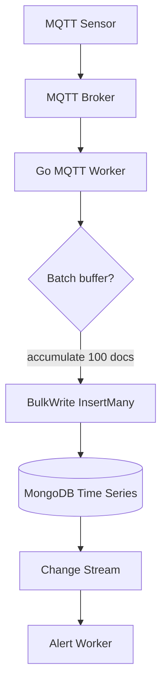
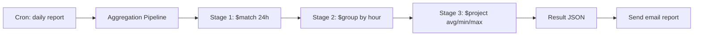

# Module 16: pkg/mongodb (MongoDB Client & Time‑Series Data)

## สำหรับโฟลเดอร์ `internal/pkg/mongodb/`

ไฟล์ที่เกี่ยวข้อง:
- `internal/pkg/mongodb/client.go`
- `internal/pkg/mongodb/sensor_repo.go`
- `internal/pkg/mongodb/bulk_writer.go`
- `internal/pkg/mongodb/change_stream.go`

---

## หลักการ (Concept)

### MongoDB คืออะไร?

MongoDB เป็นฐานข้อมูล NoSQL แบบ document‑based (ใช้ BSON) ที่เก็บข้อมูลในรูปแบบ JSON‑like documents มี schema‑flexible และรองรับการขยายแนวนอน (horizontal scaling) ผ่าน sharding ในระบบ IoT Monitoring ใช้ MongoDB เป็น **primary data store สำหรับ time‑series sensor data** เนื่องจากมีความสามารถในการเขียนข้อมูลความถี่สูง (high‑throughput writes) และรองรับ **Time Series Collections** (MongoDB 5.0+) ที่ optimize สำหรับข้อมูลที่เปลี่ยนแปลงตามเวลาโดยเฉพาะ

### มีกี่แบบ? (Use Cases ในระบบ IoT)

| การใช้งาน | เหมาะกับ MongoDB? | เหตุผล |
|-----------|-------------------|--------|
| **Sensor logs (time‑series)** | ✅ เหมาะมาก | Time Series Collections + bucket pattern |
| **Event history** | ✅ เหมาะ | flexible schema, fast writes |
| **User profiles** | ⚠️ ปานกลาง | PostgreSQL เหมาะกว่า (ACID, relations) |
| **Real‑time alerts** | ✅ เหมาะ | Change Streams สำหรับ reactive systems |
| **Reports & aggregations** | ✅ เหมาะ | Aggregation pipeline ทรงพลัง |
| **Configuration data** | ✅ เหมาะ | document‑based, versioning ได้ |

### MongoDB Time Series Collection

MongoDB 5.0 เป็นต้นมามี **Time Series Collections** ที่ออกแบบมาโดยเฉพาะสำหรับข้อมูลที่เปลี่ยนแปลงตามเวลา เช่น อุณหภูมิ ความชื้น หรือกระแสไฟฟ้าจากเซนเซอร์ ทำงานโดยการจัดกลุ่มข้อมูล (bucket) อัตโนมัติตามเวลา ทำให้ query และ aggregations มีประสิทธิภาพสูง[reference:0]:

```javascript
// สร้าง Time Series Collection สำหรับ sensor data
db.createCollection(
    "sensor_readings",
    {
        timeseries: {
            timeField: "timestamp",
            metaField: "metadata",
            granularity: "seconds"  // "seconds", "minutes", "hours"
        }
    }
)
```

**ข้อห้ามสำคัญ:** ห้ามใช้ Bucket Pattern ร่วมกับ Time Series Collections เพราะจะลดประสิทธิภาพ[reference:1]

### ใช้อย่างไร / นำไปใช้กรณีไหน

1. **Time Series Sensor Data**: เก็บอุณหภูมิ ความชื้น น้ำรั่ว ควัน แบบ minute‑by‑minute
2. **Event Logging**: เก็บประวัติการแจ้งเตือน การควบคุมอุปกรณ์
3. **Real‑time Aggregations**: ใช้ aggregation pipeline สำหรับรายงานรายชั่วโมง/วัน
4. **Change Streams**: สำหรับระบบ reactive (เช่น trigger alert เมื่อ sensor ค่าเกิน threshold)

### ทำไมต้องใช้ (แทน PostgreSQL)

| คุณสมบัติ | PostgreSQL | MongoDB |
|-----------|------------|---------|
| **Write throughput** | ~10k ops/sec | ~50k+ ops/sec (เวลามีการแบทช์) |
| **Schema flexibility** | Fixed schema | Dynamic (เพิ่มฟิลด์ได้ตลอด) |
| **Time‑series optimization** | TimescaleDB extension | Built‑in Time Series Collections |
| **Horizontal scaling** | Complex (sharding) | Native sharding |
| **Aggregation for time‑series** | Good with TimescaleDB | Excellent (Aggregation Pipeline) |

**เมื่อใช้ MongoDB:** ข้อมูลมีปริมาณสูง (หลายล้านเรกคอร์ด/วัน), schema อาจเปลี่ยนแปลงได้, ต้องการ aggregation แบบ complex สำหรับ time‑series data

### ประโยชน์ที่ได้รับ

- **Write performance สูง** – ด้วย Bulk Write และการจัดเก็บแบบ Time Series ที่ optimize
- **Flexible schema** – เปลี่ยนโครงสร้างข้อมูลได้โดยไม่ต้อง migration
- **Aggregation pipeline** – Query แบบ time‑series ได้ง่าย (ค่าเฉลี่ยรายชั่วโมง, สูงสุด/ต่ำสุด)
- **Change Streams** – real‑time notification สำหรับระบบ alert
- **TTL (Time‑to‑Live) indexes** – ลบข้อมูลเก่าอัตโนมัติ

### ข้อควรระวัง

- **MongoDB ไม่ support transaction ข้าม collection ใน standalone** (ต้องใช้ replica set)
- **ใช้ memory สูง** เนื่องจากใช้ memory‑mapped files
- **การออก schema** ต้องคำนึงถึง query patterns ล่วงหน้า
- **Time Series Collections** ต้องการ MongoDB 5.0+ และไม่สามารถเปลี่ยน granularity ได้หลังสร้าง

### ข้อดี
- High write throughput, flexible schema, built‑in time‑series optimization

### ข้อเสีย
- No ACID transactions (เฉพาะ replica set), ใช้ memory มาก, query บางประเภทซับซ้อน

### ข้อห้าม
- ห้ามใช้เป็น primary database สำหรับข้อมูลที่มีความสัมพันธ์ซับซ้อน (use PostgreSQL)
- ห้ามใช้ Time Series Collections สำหรับข้อมูลที่ไม่เรียงตามเวลา (ใช้ normal collection)
- ห้ามใช้ Bucket Pattern ร่วมกับ Time Series Collections[reference:2]

---

## การออกแบบ Workflow และ Dataflow

### Workflow: Sensor Data Ingestion ผ่าน MongoDB



**รูปที่ 19:** กระบวนการรับข้อมูลเซนเซอร์จาก MQTT worker แล้ว batch ก่อนเขียนเป็น BulkWrite ลง MongoDB Time Series Collection

### Workflow: Time Series Aggregation สำหรับ Report



**รูปที่ 20:** การใช้ Aggregation Pipeline สำหรับสร้างรายงานสรุปรายวัน (ค่าเฉลี่ย/สูงสุด/ต่ำสุดต่อชั่วโมง)

---

## ตัวอย่างโค้ดที่รันได้จริง

### 1. MongoDB Client with Connection Pool – `client.go`

```go
// Package mongodb provides MongoDB client and utilities for time-series sensor data.
// ----------------------------------------------------------------
// แพ็คเกจ mongodb ให้บริการ MongoDB client และ utilities สำหรับข้อมูลเซนเซอร์แบบ time-series
package mongodb

import (
	"context"
	"time"

	"go.mongodb.org/mongo-driver/event"
	"go.mongodb.org/mongo-driver/mongo"
	"go.mongodb.org/mongo-driver/mongo/options"
	"go.uber.org/zap"
)

// Config holds MongoDB connection settings.
// ----------------------------------------------------------------
// Config เก็บค่ากำหนดการเชื่อมต่อ MongoDB
type Config struct {
	URI              string        // MongoDB connection URI, e.g., "mongodb://localhost:27017"
	Database         string        // Database name
	MaxPoolSize      uint64        // Maximum connection pool size (default 100)
	MinPoolSize      uint64        // Minimum connection pool size (default 0)
	MaxIdleTime      time.Duration // Maximum idle time for a connection
	ConnectTimeout   time.Duration // Timeout for initial connection
	SocketTimeout    time.Duration // Timeout for socket read/write
	RetryWrites      bool          // Enable retryable writes
	RetryReads       bool          // Enable retryable reads
}

// DefaultConfig returns recommended config for production.
// ----------------------------------------------------------------
// DefaultConfig คืนค่า config ที่แนะนำสำหรับ production
func DefaultConfig() *Config {
	return &Config{
		URI:            "mongodb://localhost:27017",
		Database:       "cmon_sensor",
		MaxPoolSize:    100,              // MongoDB Go driver default is 100[reference:3]
		MinPoolSize:    10,
		MaxIdleTime:    30 * time.Second,
		ConnectTimeout: 10 * time.Second,
		SocketTimeout:  30 * time.Second,
		RetryWrites:    true,
		RetryReads:     true,
	}
}

// Client wraps MongoDB client with connection management.
// ----------------------------------------------------------------
// Client ห่อหุ้ม MongoDB client พร้อมการจัดการการเชื่อมต่อ
type Client struct {
	*mongo.Client
	Database *mongo.Database
	config   *Config
}

// NewClient creates a new MongoDB client with connection pool.
// ----------------------------------------------------------------
// NewClient สร้าง MongoDB client ใหม่พร้อม connection pool
func NewClient(ctx context.Context, cfg *Config) (*Client, error) {
	if cfg == nil {
		cfg = DefaultConfig()
	}

	// Configure connection pool
	// กำหนดค่า connection pool
	clientOpts := options.Client().
		ApplyURI(cfg.URI).
		SetMaxPoolSize(cfg.MaxPoolSize).
		SetMinPoolSize(cfg.MinPoolSize).
		SetMaxConnIdleTime(cfg.MaxIdleTime).
		SetConnectTimeout(cfg.ConnectTimeout).
		SetSocketTimeout(cfg.SocketTimeout).
		SetRetryWrites(cfg.RetryWrites).
		SetRetryReads(cfg.RetryReads)

	// Optional: Add command monitoring for debugging
	// เพิ่มการตรวจสอบคำสั่งสำหรับการดีบัก
	clientOpts.SetMonitor(&event.CommandMonitor{
		Started: func(ctx context.Context, evt *event.CommandStartedEvent) {
			// logger.Debug("MongoDB command", zap.String("cmd", evt.CommandName))
		},
	})

	// Connect to MongoDB
	// เชื่อมต่อ MongoDB
	client, err := mongo.Connect(ctx, clientOpts)
	if err != nil {
		return nil, err
	}

	// Verify connection
	// ตรวจสอบการเชื่อมต่อ
	if err := client.Ping(ctx, nil); err != nil {
		return nil, err
	}

	return &Client{
		Client:   client,
		Database: client.Database(cfg.Database),
		config:   cfg,
	}, nil
}

// Close gracefully closes the MongoDB connection.
// ----------------------------------------------------------------
// Close ปิดการเชื่อมต่อ MongoDB อย่างนุ่มนวล
func (c *Client) Close(ctx context.Context) error {
	return c.Client.Disconnect(ctx)
}
```

### 2. Sensor Data Model & Repository – `sensor_repo.go`

```go
package mongodb

import (
	"context"
	"time"

	"go.mongodb.org/mongo-driver/bson"
	"go.mongodb.org/mongo-driver/bson/primitive"
	"go.mongodb.org/mongo-driver/mongo"
	"go.mongodb.org/mongo-driver/mongo/options"
)

// SensorReading represents a single sensor reading document.
// ----------------------------------------------------------------
// SensorReading แทนเอกสารการอ่านค่าจากเซนเซอร์ 1 รายการ
type SensorReading struct {
	ID         primitive.ObjectID `bson:"_id,omitempty"`
	DeviceID   string             `bson:"device_id"`
	SensorType string             `bson:"sensor_type"` // temperature, humidity, water_leak, smoke
	Value      float64            `bson:"value"`
	Unit       string             `bson:"unit"`       // C, %, bool
	Location   string             `bson:"location"`   // rack_a1, room_1, floor_2
	Metadata   map[string]string  `bson:"metadata,omitempty"` // device_name, firmware_version, etc.
	Timestamp  time.Time          `bson:"timestamp"`
}

// SensorRepository defines operations for time-series sensor data.
// ----------------------------------------------------------------
// SensorRepository กำหนดการดำเนินการสำหรับข้อมูลเซนเซอร์แบบ time-series
type SensorRepository interface {
	// InsertOne inserts a single sensor reading.
	InsertOne(ctx context.Context, reading *SensorReading) error

	// InsertMany inserts multiple sensor readings (bulk insert).
	InsertMany(ctx context.Context, readings []SensorReading) error

	// GetReadings retrieves readings for a device within time range.
	GetReadings(ctx context.Context, deviceID, sensorType string, start, end time.Time, limit int) ([]SensorReading, error)

	// GetHourlyAggregation returns aggregated values (avg, min, max) per hour.
	GetHourlyAggregation(ctx context.Context, deviceID, sensorType string, start, end time.Time) ([]HourlyAggregate, error)

	// CreateTimeSeriesCollection creates a time-series collection (if not exists).
	CreateTimeSeriesCollection(ctx context.Context, collectionName string) error
}

// HourlyAggregate represents aggregated sensor data per hour.
// ----------------------------------------------------------------
// HourlyAggregate แทนข้อมูลเซนเซอร์ที่ถูก aggregation รายชั่วโมง
type HourlyAggregate struct {
	Hour       time.Time `bson:"hour"`
	AvgValue   float64   `bson:"avg_value"`
	MinValue   float64   `bson:"min_value"`
	MaxValue   float64   `bson:"max_value"`
	Count      int       `bson:"count"`
}

// sensorRepository implements SensorRepository.
// ----------------------------------------------------------------
// sensorRepository อิมพลีเมนต์ SensorRepository
type sensorRepository struct {
	collection *mongo.Collection
}

// NewSensorRepository creates a new sensor repository.
// ----------------------------------------------------------------
// NewSensorRepository สร้าง sensor repository ใหม่
func NewSensorRepository(db *mongo.Database, collectionName string) SensorRepository {
	return &sensorRepository{
		collection: db.Collection(collectionName),
	}
}

// CreateTimeSeriesCollection creates a time-series collection optimized for sensor data.
// MongoDB 5.0+ only.
// ----------------------------------------------------------------
// CreateTimeSeriesCollection สร้าง time-series collection ที่ optimize สำหรับข้อมูลเซนเซอร์
// ต้องใช้ MongoDB 5.0 ขึ้นไปเท่านั้น
func (r *sensorRepository) CreateTimeSeriesCollection(ctx context.Context, collectionName string) error {
	// Check if collection already exists
	// ตรวจสอบว่ามี collection อยู่แล้วหรือไม่
	names, err := r.collection.Database().ListCollectionNames(ctx, bson.M{"name": collectionName})
	if err != nil {
		return err
	}
	if len(names) > 0 {
		return nil // already exists, มีอยู่แล้ว
	}

	// Create time-series collection
	// สร้าง time-series collection
	// timeField: field that contains the timestamp
	// metaField: field that contains metadata (used for partitioning)
	// granularity: "seconds" for high-frequency data (per minute/second)
	// ----------------------------------------------------------------
	// timeField: ฟิลด์ที่มี timestamp
	// metaField: ฟิลด์ที่มี metadata (ใช้สำหรับการแบ่งพาร์ติชัน)
	// granularity: "seconds" สำหรับข้อมูลความถี่สูง (ทุกนาที/วินาที)
	createCmd := bson.D{
		{Key: "create", Value: collectionName},
		{Key: "timeseries", Value: bson.D{
			{Key: "timeField", Value: "timestamp"},
			{Key: "metaField", Value: "metadata"},
			{Key: "granularity", Value: "seconds"},
		}},
	}

	return r.collection.Database().RunCommand(ctx, createCmd).Err()
}

// InsertOne inserts a single sensor reading.
// ----------------------------------------------------------------
// InsertOne เพิ่มข้อมูลเซนเซอร์ 1 รายการ
func (r *sensorRepository) InsertOne(ctx context.Context, reading *SensorReading) error {
	reading.Timestamp = reading.Timestamp.UTC()
	_, err := r.collection.InsertOne(ctx, reading)
	return err
}

// InsertMany inserts multiple sensor readings using bulk insert.
// This is MUCH faster than individual inserts for high-frequency data.
// ----------------------------------------------------------------
// InsertMany เพิ่มข้อมูลเซนเซอร์หลายรายการแบบ bulk insert
// วิธีนี้เร็วกว่าการ insert ทีละรายการมาก เหมาะกับข้อมูลความถี่สูง
func (r *sensorRepository) InsertMany(ctx context.Context, readings []SensorReading) error {
	if len(readings) == 0 {
		return nil
	}
	// Convert to []interface{} for InsertMany
	// แปลงเป็น []interface{} สำหรับ InsertMany
	docs := make([]interface{}, len(readings))
	for i, reading := range readings {
		reading.Timestamp = reading.Timestamp.UTC()
		docs[i] = reading
	}

	// Use ordered: false for better performance (continue on error)
	// ใช้ ordered: false เพื่อประสิทธิภาพที่ดีขึ้น (ดำเนินการต่อแม้มี error)
	opts := options.InsertMany().SetOrdered(false)
	_, err := r.collection.InsertMany(ctx, docs, opts)
	return err
}

// GetReadings retrieves sensor readings within time range with pagination.
// ----------------------------------------------------------------
// GetReadings ดึงข้อมูลเซนเซอร์ในช่วงเวลาที่กำหนดพร้อมการแบ่งหน้า
func (r *sensorRepository) GetReadings(ctx context.Context, deviceID, sensorType string, start, end time.Time, limit int) ([]SensorReading, error) {
	filter := bson.M{
		"device_id":   deviceID,
		"sensor_type": sensorType,
		"timestamp": bson.M{
			"$gte": start.UTC(),
			"$lte": end.UTC(),
		},
	}

	opts := options.Find().
		SetSort(bson.M{"timestamp": 1}).
		SetLimit(int64(limit))

	cursor, err := r.collection.Find(ctx, filter, opts)
	if err != nil {
		return nil, err
	}
	defer cursor.Close(ctx)

	var readings []SensorReading
	if err := cursor.All(ctx, &readings); err != nil {
		return nil, err
	}
	return readings, nil
}

// GetHourlyAggregation returns aggregated values using MongoDB aggregation pipeline.
// This is much more efficient than aggregating in application code.
// ----------------------------------------------------------------
// GetHourlyAggregation คืนค่าที่ถูก aggregation (avg, min, max) รายชั่วโมง
// ใช้ aggregation pipeline ของ MongoDB ซึ่งมีประสิทธิภาพสูงกว่าการทำ aggregation ใน Go
func (r *sensorRepository) GetHourlyAggregation(ctx context.Context, deviceID, sensorType string, start, end time.Time) ([]HourlyAggregate, error) {
	// Aggregation pipeline:
	// Stage 1: $match - filter by device, sensor type, and time range
	// Stage 2: $group - group by hour and calculate aggregates
	// Stage 3: $project - format output
	// ----------------------------------------------------------------
	// Aggregation pipeline:
	// ขั้นที่ 1: $match - กรองตาม device, sensor type และช่วงเวลา
	// ขั้นที่ 2: $group - จัดกลุ่มรายชั่วโมงและคำนวณค่า aggregate
	// ขั้นที่ 3: $project - จัดรูปแบบ output
	pipeline := mongo.Pipeline{
		// Stage 1: Match filter
		// ขั้นที่ 1: กรองข้อมูล
		{{Key: "$match", Value: bson.M{
			"device_id":   deviceID,
			"sensor_type": sensorType,
			"timestamp": bson.M{
				"$gte": start.UTC(),
				"$lte": end.UTC(),
			},
		}}},
		// Stage 2: Group by hour
		// ขั้นที่ 2: จัดกลุ่มรายชั่วโมง
		{{Key: "$group", Value: bson.M{
			"_id": bson.M{
				"$dateTrunc": bson.M{
					"date":    "$timestamp",
					"unit":    "hour",
					"timezone": "Asia/Bangkok",
				},
			},
			"avg_value": bson.M{"$avg": "$value"},
			"min_value": bson.M{"$min": "$value"},
			"max_value": bson.M{"$max": "$value"},
			"count":     bson.M{"$sum": 1},
		}}},
		// Stage 3: Project to rename fields
		// ขั้นที่ 3: เปลี่ยนชื่อฟิลด์
		{{Key: "$project", Value: bson.M{
			"hour":      "$_id",
			"avg_value": 1,
			"min_value": 1,
			"max_value": 1,
			"count":     1,
			"_id":       0,
		}}},
		// Stage 4: Sort by hour
		// ขั้นที่ 4: เรียงตามชั่วโมง
		{{Key: "$sort", Value: bson.M{"hour": 1}}},
	}

	cursor, err := r.collection.Aggregate(ctx, pipeline)
	if err != nil {
		return nil, err
	}
	defer cursor.Close(ctx)

	var results []HourlyAggregate
	if err := cursor.All(ctx, &results); err != nil {
		return nil, err
	}
	return results, nil
}
```

### 3. Bulk Writer with Batching – `bulk_writer.go`

```go
package mongodb

import (
	"context"
	"sync"
	"time"

	"go.uber.org/zap"
)

// BulkWriter handles batched insert of sensor data for high throughput.
// ----------------------------------------------------------------
// BulkWriter จัดการการ insert แบบ batch สำหรับข้อมูลเซนเซอร์เพื่อปริมาณงานสูง
type BulkWriter struct {
	repo      SensorRepository
	batchSize int
	flushInterval time.Duration
	buffer    []SensorReading
	mu        sync.Mutex
	stopCh    chan struct{}
}

// NewBulkWriter creates a new bulk writer with batching.
// ----------------------------------------------------------------
// NewBulkWriter สร้าง bulk writer ใหม่พร้อมการทำ batch
func NewBulkWriter(repo SensorRepository, batchSize int, flushInterval time.Duration) *BulkWriter {
	return &BulkWriter{
		repo:          repo,
		batchSize:     batchSize,
		flushInterval: flushInterval,
		buffer:        make([]SensorReading, 0, batchSize),
		stopCh:        make(chan struct{}),
	}
}

// Start begins the background flusher goroutine.
// ----------------------------------------------------------------
// Start เริ่ม goroutine ที่ flush ข้อมูลในพื้นหลัง
func (w *BulkWriter) Start(ctx context.Context) {
	ticker := time.NewTicker(w.flushInterval)
	go func() {
		for {
			select {
			case <-ticker.C:
				w.Flush(ctx)
			case <-w.stopCh:
				ticker.Stop()
				w.Flush(ctx) // final flush, flush ครั้งสุดท้าย
				return
			case <-ctx.Done():
				ticker.Stop()
				w.Flush(ctx)
				return
			}
		}
	}()
}

// Stop gracefully stops the bulk writer and flushes remaining data.
// ----------------------------------------------------------------
// Stop หยุด bulk writer อย่างนุ่มนวลและ flush ข้อมูลที่เหลือ
func (w *BulkWriter) Stop() {
	close(w.stopCh)
}

// Add adds a sensor reading to the buffer, flushing if batch is full.
// ----------------------------------------------------------------
// Add เพิ่มข้อมูลเซนเซอร์ลง buffer และ flush ถ้าเต็ม batch
func (w *BulkWriter) Add(ctx context.Context, reading SensorReading) error {
	w.mu.Lock()
	defer w.mu.Unlock()

	w.buffer = append(w.buffer, reading)
	if len(w.buffer) >= w.batchSize {
		return w.flush(ctx)
	}
	return nil
}

// Flush writes all buffered readings to MongoDB.
// ----------------------------------------------------------------
// Flush เขียนข้อมูลทั้งหมดใน buffer ลง MongoDB
func (w *BulkWriter) Flush(ctx context.Context) error {
	w.mu.Lock()
	defer w.mu.Unlock()
	return w.flush(ctx)
}

func (w *BulkWriter) flush(ctx context.Context) error {
	if len(w.buffer) == 0 {
		return nil
	}
	// Copy buffer to avoid holding lock during write
	// คัดลอก buffer เพื่อไม่ต้องถือ lock ขณะเขียน
	toWrite := make([]SensorReading, len(w.buffer))
	copy(toWrite, w.buffer)
	w.buffer = w.buffer[:0] // clear buffer, ล้าง buffer

	// Write to MongoDB
	// เขียนลง MongoDB
	if err := w.repo.InsertMany(ctx, toWrite); err != nil {
		// Log error and maybe retry
		// บันทึก error และอาจ retry
		// For production, consider dead letter queue
		return err
	}
	return nil
}
```

### 4. Change Streams (Real‑time Alert) – `change_stream.go`

```go
package mongodb

import (
	"context"
	"encoding/json"
	"log"

	"go.mongodb.org/mongo-driver/bson"
	"go.mongodb.org/mongo-driver/mongo"
	"go.mongodb.org/mongo-driver/mongo/options"
)

// ChangeEvent represents a MongoDB change stream event.
// ----------------------------------------------------------------
// ChangeEvent แทน event ของ MongoDB change stream
type ChangeEvent struct {
	OperationType string                 `bson:"operationType"`
	FullDocument  map[string]interface{} `bson:"fullDocument"`
	DocumentKey   map[string]interface{} `bson:"documentKey"`
	NS            struct {
		DB         string `bson:"db"`
		Coll       string `bson:"coll"`
	} `bson:"ns"`
}

// ChangeStreamHandler is called for each change event.
// ----------------------------------------------------------------
// ChangeStreamHandler ถูกเรียกสำหรับแต่ละ change event
type ChangeStreamHandler func(event ChangeEvent)

// WatchCollection watches a collection for changes and triggers handler.
// ----------------------------------------------------------------
// WatchCollection ติดตามการเปลี่ยนแปลงใน collection และเรียก handler
func WatchCollection(ctx context.Context, collection *mongo.Collection, handler ChangeStreamHandler) error {
	// Open change stream
	// เปิด change stream
	changeStream, err := collection.Watch(ctx, mongo.Pipeline{}, options.ChangeStream().SetFullDocument(options.UpdateLookup))
	if err != nil {
		return err
	}
	defer changeStream.Close(ctx)

	log.Printf("Started change stream on collection %s", collection.Name())

	for changeStream.Next(ctx) {
		var event ChangeEvent
		if err := changeStream.Decode(&event); err != nil {
			log.Printf("Failed to decode change event: %v", err)
			continue
		}
		// Trigger handler asynchronously
		// เรียก handler แบบ asynchronous
		go handler(event)
	}

	return changeStream.Err()
}
```

---

## วิธีใช้งาน module นี้

### 1. ติดตั้ง dependencies
```bash
go get go.mongodb.org/mongo-driver/mongo
go get go.mongodb.org/mongo-driver/mongo/options
go get go.mongodb.org/mongo-driver/bson
```

### 2. วางไฟล์ตามโครงสร้างใน `internal/pkg/mongodb/`

### 3. สร้าง client และ repository ใน `main.go`

```go
import "gobackend/internal/pkg/mongodb"

func main() {
    // Create MongoDB client
    mongoCfg := mongodb.DefaultConfig()
    mongoCfg.URI = os.Getenv("MONGODB_URI")
    mongoCfg.Database = "cmon_sensor"
    
    mongoClient, err := mongodb.NewClient(context.Background(), mongoCfg)
    if err != nil {
        log.Fatal(err)
    }
    defer mongoClient.Close(context.Background())
    
    // Create time-series collection for sensor data
    sensorRepo := mongodb.NewSensorRepository(mongoClient.Database, "sensor_readings")
    if err := sensorRepo.CreateTimeSeriesCollection(context.Background(), "sensor_readings"); err != nil {
        log.Printf("Warning: time-series collection creation: %v", err)
    }
    
    // Use bulk writer for high-throughput ingestion
    bulkWriter := mongodb.NewBulkWriter(sensorRepo, 100, 5*time.Second)
    bulkWriter.Start(context.Background())
    defer bulkWriter.Stop()
    
    // In your MQTT worker, add readings to bulk writer
    // ใน MQTT worker ให้เพิ่มข้อมูลผ่าน bulkWriter.Add()
}
```

### 4. ตัวอย่างการใช้งานใน MQTT Worker

```go
func (w *MQTTWorker) handleSensorData(data SensorData) {
    reading := mongodb.SensorReading{
        DeviceID:   data.DeviceID,
        SensorType: data.SensorType,
        Value:      data.Value,
        Unit:       data.Unit,
        Location:   data.Location,
        Timestamp:  time.Now(),
    }
    w.bulkWriter.Add(context.Background(), reading)
}
```

---

## ตารางสรุป MongoDB Components

| Component | หน้าที่ | ตัวอย่าง |
|-----------|--------|----------|
| `Client` | จัดการ connection pool | `mongodb.NewClient()` |
| `SensorRepository` | CRUD สำหรับ time‑series sensor data | `InsertMany()`, `GetHourlyAggregation()` |
| `BulkWriter` | Batch insert สำหรับ high throughput | `Add()`, `Flush()` |
| `ChangeStream` | Real‑time notification | `WatchCollection()` |

---

## แบบฝึกหัดท้าย module (3 ข้อ)

1. เพิ่มฟังก์ชัน `CreateTTLIndex` ที่สร้าง TTL index บน `timestamp` field สำหรับลบข้อมูลเก่าโดยอัตโนมัติ (ตั้ง retention 90 วัน)
2. Implement `GetDeviceLatestReading` ที่ใช้ `$sort` และ `$limit` เพื่อดึงค่าล่าสุดของแต่ละ device
3. สร้าง aggregation pipeline สำหรับรายงานสรุปวัน: แสดงค่า avg/min/max ของอุณหภูมิต่อ rack พร้อมจัดเรียงตามค่าเฉลี่ยสูงสุด

---

## แหล่งอ้างอิง

- [MongoDB Go Driver documentation](https://pkg.go.dev/go.mongodb.org/mongo-driver/mongo)[reference:4]
- [Time Series Collections](https://mongodocs.github.io/tutorial/model-iot-data.html)[reference:5]
- [Bulk Operations in Go Driver](https://www.mongodb.com/ja-jp/docs/drivers/go/upcoming/crud/bulk/)[reference:6]
- [Change Streams with Go](https://www.mongodb.com/pt-br/docs/drivers/go/upcoming/monitoring-and-logging/change-streams/)[reference:7]
- [Transactions in Go Driver](https://www.mongodb.com/ja-jp/docs/drivers/go/upcoming/crud/transactions/)[reference:8]
- [Connection Pool Configuration](https://datasea.cn/go1020211242.html)[reference:9]

---

**หมายเหตุ:** module นี้ครบถ้วนสำหรับ `pkg/mongodb` สำหรับระบบ gobackend หากต้องการ module เพิ่มเติม (เช่น `pkg/influxdb`, `pkg/timescaledb`) โปรดแจ้ง