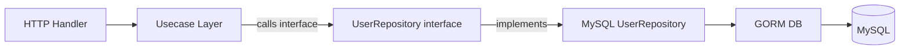

# Module 20: pkg/mysql (MySQL Database Client & Repository)

## สำหรับโฟลเดอร์ `internal/pkg/mysql/` และ `internal/repository/`

ไฟล์ที่เกี่ยวข้อง:
- `internal/pkg/mysql/client.go`
- `internal/pkg/mysql/repository.go`
- `internal/pkg/mysql/transaction.go`
- `internal/repository/mysql_user_repo.go`
- `migrations/mysql/` (สำหรับ migration files เฉพาะ MySQL)

---

## หลักการ (Concept)

### MySQL คืออะไร?

MySQL เป็นระบบจัดการฐานข้อมูลเชิงสัมพันธ์ (RDBMS) แบบ open-source ที่ได้รับความนิยมสูงสุดตัวหนึ่งของโลก พัฒนาโดย Oracle Corporation มีจุดเด่นด้านความเร็ว ความน่าเชื่อถือ และใช้งานง่าย รองรับการทำ replication, partitioning, และมี storage engines หลากหลาย (InnoDB, MyISAM, Memory) โดย InnoDB เป็นค่าเริ่มต้นที่รองรับ ACID transactions และ foreign keys

### มีกี่แบบ? (MySQL Editions & Storage Engines)

| Edition / Engine | ลักษณะ | เหมาะกับ |
|------------------|--------|----------|
| **MySQL Community Edition** | ฟรี, open-source (GPL) | Development, production ขนาดเล็ก-กลาง |
| **MySQL Enterprise Edition** | จ่ายเงิน, มี enterprise features | Enterprise production |
| **InnoDB** | Storage engine เริ่มต้น, รองรับ transaction, FK | ระบบทั่วไปที่ต้องการ ACID |
| **MyISAM** | เร็ว, ไม่มี transaction, table-level lock | Data warehouse, อ่านอย่างเดียว |
| **JSON support** | Native JSON data type และ functions | ข้อมูล semi-structured |

**ข้อห้ามสำคัญ:** ห้ามใช้ MyISAM สำหรับระบบที่มีการเขียนสูง (write-heavy) เพราะ table-level locking[reference:1]

### ใช้อย่างไร / นำไปใช้กรณีไหน

1. **Web applications** – MySQL เป็นตัวเลือกยอดนิยมสำหรับ web apps (ร่วมกับ PHP, Node.js, Go)
2. **Data warehousing** – ใช้กับ OLAP workloads (Star schema, MyISAM หรือ Columnstore)
3. **High‑availability systems** – ด้วย MySQL Group Replication, InnoDB Cluster
4. **Read‑heavy applications** – ใช้ replication master-slave, read replicas
5. **Legacy system integration** – องค์กรที่มี MySQL อยู่แล้ว

### ประโยชน์ที่ได้รับ

- **ความเร็วสูง** – โดยเฉพาะกับ read-heavy workloads
- **ใช้งานง่าย** – configuration และ maintenance ไม่ซับซ้อน
- **Replication** – master-slave replication สำหรับ scaling read
- **Partitioning** – แบ่งตารางใหญ่ออกเป็น partitions (range, list, hash)
- **Full‑text search** – รองรับการค้นหาข้อความ (MyISAM, InnoDB 5.6+)
- **JSON support** – เก็บและ query JSON ได้ (MySQL 5.7+)
- **GORM support** – GORM มี driver สำหรับ MySQL โดยเฉพาะ (`gorm.io/driver/mysql`)

### ข้อควรระวัง

- **MyISAM ไม่มี transaction** – ใช้เฉพาะเมื่อมั่นใจว่าไม่ต้องการ ACID
- **InnoDB lock contention** – การ lock row เยอะเกินไปอาจ deadlock
- **Connection string format** – ต้องระบุ charset และ parseTime=true สำหรับ time.Time
- **Default values** – MySQL มีความแตกต่างจาก PostgreSQL ในเรื่อง default values และ auto-increment
- **Index length** – Index บน VARCHAR ต้องระบุ length สำหรับ UTF8MB4 (max 191 chars สำหรับ unique index)
- **Timezone** – MySQL server timezone ส่งผลต่อ TIMESTAMP fields

### ข้อดี
- Open-source, เร็ว, replication, ใช้งานง่าย, community ขนาดใหญ่

### ข้อเสีย
- MyISAM ไม่มี transaction, InnoDB lock contention อาจสูงกว่า PostgreSQL
- JSON functions น้อยกว่า PostgreSQL
- Full-text search บน InnoDB มาช้า (5.6+)

### ข้อห้าม
- ห้ามใช้ MyISAM สำหรับระบบที่ต้องมี data integrity
- ห้ามใช้ `SELECT *` บนตารางใหญ่ (เปลือง I/O)
- ห้ามใช้ `utf8` (ต้องใช้ `utf8mb4` เท่านั้น)
- ห้ามละเลยการตั้งค่า `max_connections` และ connection pool
- ห้ามใช้ `MyISAM` ใน production สำหรับระบบใหม่

---

## การออกแบบ Workflow และ Dataflow

### Workflow: การเชื่อมต่อ MySQL ผ่าน GORM

```mermaid
flowchart TB
    Start[Start Application] --> LoadConfig[Load DB Config]
    LoadConfig --> BuildConnString[Build DSN: user:pass@tcp(host:port)/db?charset=utf8mb4&parseTime=True&loc=Local]
    BuildConnString --> GormOpen[gorm.Open with mysql.Open]
    GormOpen --> SetPool[SetMaxOpenConns, SetMaxIdleConns, SetConnMaxLifetime]
    SetPool --> Ping[Ping database]
    Ping -->|success| StoreDB[Store *gorm.DB in DI container]
    Ping -->|failed| Retry{Retry?}
    Retry -->|yes| Wait[Wait 1-5s] --> BuildConnString
    Retry -->|no| Exit[Exit with fatal error]
    StoreDB --> Ready[Application ready]
```

**รูปที่ 27:** ขั้นตอนการสร้าง connection ไปยัง MySQL ผ่าน GORM พร้อม connection pool configuration

### Workflow: Repository Pattern สำหรับ MySQL



**รูปที่ 28:** การทำงานของ Repository Pattern ที่แยก interface ออกจาก implementation สำหรับ MySQL

---

## ตัวอย่างโค้ดที่รันได้จริง

### 1. MySQL Client – `client.go`

```go
// Package mysql provides MySQL database client and utilities using GORM.
// ----------------------------------------------------------------
// แพ็คเกจ mysql ให้บริการ MySQL database client และ utilities ด้วย GORM
package mysql

import (
	"context"
	"fmt"
	"log"
	"time"

	"gorm.io/driver/mysql"
	"gorm.io/gorm"
	gormlogger "gorm.io/gorm/logger"
)

// Config holds MySQL connection settings.
// ----------------------------------------------------------------
// Config เก็บค่ากำหนดการเชื่อมต่อ MySQL
type Config struct {
	Host         string // hostname or IP, e.g., "localhost" or "127.0.0.1"
	Port         int    // default 3306
	User         string // database username
	Password     string // database password
	Database     string // database name
	Charset      string // character set, default "utf8mb4"
	Collation    string // collation, default "utf8mb4_unicode_ci"
	ParseTime    bool   // parse time.Time automatically, default true
	Loc          string // timezone location, default "Local"
	Timeout      time.Duration // connection timeout, default 10s
	ReadTimeout  time.Duration // read timeout, default 30s
	WriteTimeout time.Duration // write timeout, default 30s
	MaxOpenConns int    // maximum open connections
	MaxIdleConns int    // maximum idle connections
	ConnMaxLifetime time.Duration // maximum lifetime of a connection
	ConnMaxIdleTime time.Duration // maximum idle time before closing
}

// DefaultConfig returns recommended config for development.
// ----------------------------------------------------------------
// DefaultConfig คืนค่า config ที่แนะนำสำหรับ development
func DefaultConfig() *Config {
	return &Config{
		Host:            "localhost",
		Port:            3306,
		User:            "root",
		Password:        "",
		Database:        "cmon_db",
		Charset:         "utf8mb4",
		Collation:       "utf8mb4_unicode_ci",
		ParseTime:       true,
		Loc:             "Local",
		Timeout:         10 * time.Second,
		ReadTimeout:     30 * time.Second,
		WriteTimeout:    30 * time.Second,
		MaxOpenConns:    50,
		MaxIdleConns:    10,
		ConnMaxLifetime: 30 * time.Minute,
		ConnMaxIdleTime: 5 * time.Minute,
	}
}

// DSN returns the Data Source Name for MySQL driver.
// Format: user:pass@tcp(host:port)/dbname?charset=utf8mb4&parseTime=True&loc=Local
// ----------------------------------------------------------------
// DSN คืน Data Source Name สำหรับ MySQL driver
func (c *Config) DSN() string {
	dsn := fmt.Sprintf("%s:%s@tcp(%s:%d)/%s?charset=%s&collation=%s&parseTime=%t&timeout=%s&readTimeout=%s&writeTimeout=%s",
		c.User, c.Password, c.Host, c.Port, c.Database,
		c.Charset, c.Collation, c.ParseTime, c.Timeout, c.ReadTimeout, c.WriteTimeout)
	if c.Loc != "" {
		dsn += fmt.Sprintf("&loc=%s", c.Loc)
	}
	return dsn
}

// Client wraps GORM DB instance with connection management.
// ----------------------------------------------------------------
// Client ห่อหุ้ม GORM DB instance พร้อมการจัดการการเชื่อมต่อ
type Client struct {
	DB     *gorm.DB
	config *Config
}

// NewClient creates a new MySQL client with connection pool.
// ----------------------------------------------------------------
// NewClient สร้าง MySQL client ใหม่พร้อม connection pool
func NewClient(ctx context.Context, cfg *Config, logLevel gormlogger.LogLevel) (*Client, error) {
	if cfg == nil {
		cfg = DefaultConfig()
	}

	// Configure GORM logger
	// กำหนดค่า GORM logger
	gormLogger := gormlogger.New(
		log.New(logWriter{}, "\r\n", log.LstdFlags),
		gormlogger.Config{
			SlowThreshold:             200 * time.Millisecond,
			LogLevel:                  logLevel,
			IgnoreRecordNotFoundError: true,
			Colorful:                  false,
		},
	)

	// Open connection with GORM
	// เปิด connection ด้วย GORM
	dsn := cfg.DSN()
	gormDB, err := gorm.Open(mysql.Open(dsn), &gorm.Config{
		Logger:                 gormLogger,
		SkipDefaultTransaction: false,
		PrepareStmt:            true,
	})
	if err != nil {
		return nil, fmt.Errorf("failed to connect to MySQL: %w", err)
	}

	// Get underlying sql.DB for connection pool configuration
	// ดึง sql.DB สำหรับการกำหนดค่า connection pool
	sqlDB, err := gormDB.DB()
	if err != nil {
		return nil, fmt.Errorf("failed to get sql.DB: %w", err)
	}

	// Configure connection pool
	// กำหนดค่า connection pool
	if cfg.MaxOpenConns > 0 {
		sqlDB.SetMaxOpenConns(cfg.MaxOpenConns)
	}
	if cfg.MaxIdleConns > 0 {
		sqlDB.SetMaxIdleConns(cfg.MaxIdleConns)
	}
	if cfg.ConnMaxLifetime > 0 {
		sqlDB.SetConnMaxLifetime(cfg.ConnMaxLifetime)
	}
	if cfg.ConnMaxIdleTime > 0 {
		sqlDB.SetConnMaxIdleTime(cfg.ConnMaxIdleTime)
	}

	// Test connection
	// ทดสอบการเชื่อมต่อ
	if err := sqlDB.PingContext(ctx); err != nil {
		return nil, fmt.Errorf("failed to ping MySQL: %w", err)
	}

	return &Client{
		DB:     gormDB,
		config: cfg,
	}, nil
}

// Close gracefully closes the database connection.
// ----------------------------------------------------------------
// Close ปิดการเชื่อมต่อฐานข้อมูลอย่างนุ่มนวล
func (c *Client) Close() error {
	sqlDB, err := c.DB.DB()
	if err != nil {
		return err
	}
	return sqlDB.Close()
}

// logWriter adapts standard log for GORM.
// ----------------------------------------------------------------
// logWriter ปรับ log มาตรฐานสำหรับ GORM
type logWriter struct{}

func (l logWriter) Write(p []byte) (n int, err error) {
	log.Print(string(p))
	return len(p), nil
}
```

### 2. Generic MySQL Repository – `repository.go`

```go
package mysql

import (
	"context"

	"gorm.io/gorm"
)

// Repository defines generic CRUD operations for any entity.
// ----------------------------------------------------------------
// Repository กำหนดการดำเนินการ CRUD ทั่วไปสำหรับ entity ใดๆ
type Repository[T any] interface {
	Create(ctx context.Context, tx *gorm.DB, entity *T) error
	FindByID(ctx context.Context, id interface{}) (*T, error)
	Update(ctx context.Context, tx *gorm.DB, entity *T) error
	Delete(ctx context.Context, tx *gorm.DB, id interface{}) error
	List(ctx context.Context, limit, offset int) ([]T, int64, error)
}

// GenericRepository implements Repository with GORM.
// ----------------------------------------------------------------
// GenericRepository อิมพลีเมนต์ Repository ด้วย GORM
type GenericRepository[T any] struct {
	db *gorm.DB
}

// NewGenericRepository creates a new generic repository.
// ----------------------------------------------------------------
// NewGenericRepository สร้าง generic repository ใหม่
func NewGenericRepository[T any](db *gorm.DB) *GenericRepository[T] {
	return &GenericRepository[T]{db: db}
}

// getDB returns transaction if provided, otherwise default db.
// ----------------------------------------------------------------
// getDB คืนค่า transaction ถ้ามี หรือ db ปกติ
func (r *GenericRepository[T]) getDB(tx *gorm.DB) *gorm.DB {
	if tx != nil {
		return tx
	}
	return r.db
}

// Create inserts a new entity.
// ----------------------------------------------------------------
// Create เพิ่ม entity ใหม่
func (r *GenericRepository[T]) Create(ctx context.Context, tx *gorm.DB, entity *T) error {
	db := r.getDB(tx)
	return db.WithContext(ctx).Create(entity).Error
}

// FindByID retrieves an entity by primary key.
// ----------------------------------------------------------------
// FindByID ดึง entity ด้วย primary key
func (r *GenericRepository[T]) FindByID(ctx context.Context, id interface{}) (*T, error) {
	var entity T
	err := r.db.WithContext(ctx).First(&entity, id).Error
	if err != nil {
		return nil, err
	}
	return &entity, nil
}

// Update modifies an existing entity.
// ----------------------------------------------------------------
// Update แก้ไข entity ที่มีอยู่
func (r *GenericRepository[T]) Update(ctx context.Context, tx *gorm.DB, entity *T) error {
	db := r.getDB(tx)
	return db.WithContext(ctx).Save(entity).Error
}

// Delete removes an entity by primary key.
// ----------------------------------------------------------------
// Delete ลบ entity ด้วย primary key
func (r *GenericRepository[T]) Delete(ctx context.Context, tx *gorm.DB, id interface{}) error {
	db := r.getDB(tx)
	return db.WithContext(ctx).Delete(new(T), id).Error
}

// List returns paginated list of entities.
// MySQL uses LIMIT and OFFSET.
// ----------------------------------------------------------------
// List คืนค่ารายการ entity แบบแบ่งหน้า
func (r *GenericRepository[T]) List(ctx context.Context, limit, offset int) ([]T, int64, error) {
	var entities []T
	var total int64

	query := r.db.WithContext(ctx).Model(new(T))
	if err := query.Count(&total).Error; err != nil {
		return nil, 0, err
	}
	if err := query.Limit(limit).Offset(offset).Find(&entities).Error; err != nil {
		return nil, 0, err
	}
	return entities, total, nil
}
```

### 3. Transaction Manager – `transaction.go`

```go
package mysql

import (
	"context"

	"gorm.io/gorm"
)

// TransactionManager defines methods for managing database transactions.
// ----------------------------------------------------------------
// TransactionManager กำหนด method สำหรับจัดการ transaction ของฐานข้อมูล
type TransactionManager interface {
	Begin(ctx context.Context) (*gorm.DB, error)
	Commit(tx *gorm.DB) error
	Rollback(tx *gorm.DB) error
	ExecuteInTransaction(ctx context.Context, fn func(tx *gorm.DB) error) error
}

// GormTransactionManager implements TransactionManager using GORM.
// ----------------------------------------------------------------
// GormTransactionManager อิมพลีเมนต์ TransactionManager ด้วย GORM
type GormTransactionManager struct {
	db *gorm.DB
}

// NewTransactionManager creates a new transaction manager.
// ----------------------------------------------------------------
// NewTransactionManager สร้าง transaction manager ใหม่
func NewTransactionManager(db *gorm.DB) TransactionManager {
	return &GormTransactionManager{db: db}
}

// Begin starts a new transaction.
// ----------------------------------------------------------------
// Begin เริ่ม transaction ใหม่
func (m *GormTransactionManager) Begin(ctx context.Context) (*gorm.DB, error) {
	tx := m.db.WithContext(ctx).Begin()
	if tx.Error != nil {
		return nil, tx.Error
	}
	return tx, nil
}

// Commit commits the transaction.
// ----------------------------------------------------------------
// Commit ยืนยัน transaction
func (m *GormTransactionManager) Commit(tx *gorm.DB) error {
	return tx.Commit().Error
}

// Rollback aborts the transaction.
// ----------------------------------------------------------------
// Rollback ยกเลิก transaction
func (m *GormTransactionManager) Rollback(tx *gorm.DB) error {
	return tx.Rollback().Error
}

// ExecuteInTransaction runs the given function within a transaction.
// ----------------------------------------------------------------
// ExecuteInTransaction รันฟังก์ชันที่กำหนดภายใน transaction
func (m *GormTransactionManager) ExecuteInTransaction(ctx context.Context, fn func(tx *gorm.DB) error) error {
	return m.db.WithContext(ctx).Transaction(fn)
}
```

### 4. User Repository for MySQL – `internal/repository/mysql_user_repo.go`

```go
// Package repository provides MySQL-specific implementations.
// ----------------------------------------------------------------
// แพ็คเกจ repository ให้บริการ implementation เฉพาะของ MySQL
package repository

import (
	"context"
	"errors"

	"gobackend/internal/models"
	"gobackend/internal/pkg/mysql"
	"gorm.io/gorm"
)

// MySQLUserRepository implements UserRepository for MySQL.
// ----------------------------------------------------------------
// MySQLUserRepository อิมพลีเมนต์ UserRepository สำหรับ MySQL
type MySQLUserRepository struct {
	db  *gorm.DB
	gen *mysql.GenericRepository[models.User]
}

// NewMySQLUserRepository creates a new MySQL user repository.
// ----------------------------------------------------------------
// NewMySQLUserRepository สร้าง MySQL user repository ใหม่
func NewMySQLUserRepository(db *gorm.DB) *MySQLUserRepository {
	return &MySQLUserRepository{
		db:  db,
		gen: mysql.NewGenericRepository[models.User](db),
	}
}

// Create inserts a new user.
// ----------------------------------------------------------------
// Create เพิ่มผู้ใช้ใหม่
func (r *MySQLUserRepository) Create(ctx context.Context, tx *gorm.DB, user *models.User) error {
	return r.gen.Create(ctx, tx, user)
}

// FindByID retrieves a user by ID.
// ----------------------------------------------------------------
// FindByID ดึงผู้ใช้ด้วย ID
func (r *MySQLUserRepository) FindByID(ctx context.Context, id uint) (*models.User, error) {
	return r.gen.FindByID(ctx, id)
}

// FindByEmail retrieves a user by email.
// MySQL by default is case-insensitive (due to collation).
// For case-sensitive, use BINARY or specific collation.
// ----------------------------------------------------------------
// FindByEmail ดึงผู้ใช้ด้วยอีเมล
// MySQL จะเปรียบเทียบ case-insensitive ตามค่าเริ่มต้น (เนื่องจาก collation)
// ถ้าต้องการ case-sensitive ให้ใช้ BINARY หรือ collation เฉพาะ
func (r *MySQLUserRepository) FindByEmail(ctx context.Context, email string) (*models.User, error) {
	var user models.User
	err := r.db.WithContext(ctx).
		Where("email = ?", email).
		First(&user).Error
	if errors.Is(err, gorm.ErrRecordNotFound) {
		return nil, nil
	}
	if err != nil {
		return nil, err
	}
	return &user, nil
}

// Update updates an existing user.
// ----------------------------------------------------------------
// Update อัปเดตผู้ใช้ที่มีอยู่
func (r *MySQLUserRepository) Update(ctx context.Context, tx *gorm.DB, user *models.User) error {
	return r.gen.Update(ctx, tx, user)
}

// Delete soft-deletes a user (if DeletedAt field exists).
// ----------------------------------------------------------------
// Delete ลบผู้ใช้แบบ soft delete (ถ้ามีฟิลด์ DeletedAt)
func (r *MySQLUserRepository) Delete(ctx context.Context, tx *gorm.DB, id uint) error {
	return r.gen.Delete(ctx, tx, id)
}

// List returns paginated users.
// ----------------------------------------------------------------
// List คืนค่ารายชื่อผู้ใช้แบบแบ่งหน้า
func (r *MySQLUserRepository) List(ctx context.Context, limit, offset int) ([]models.User, int64, error) {
	return r.gen.List(ctx, limit, offset)
}

// RawSQLExample demonstrates executing raw SQL for MySQL-specific features.
// Useful for JSON functions, full-text search, etc.
// ----------------------------------------------------------------
// RawSQLExample แสดงการ execute raw SQL สำหรับฟีเจอร์เฉพาะของ MySQL
// มีประโยชน์สำหรับ JSON functions, full-text search
func (r *MySQLUserRepository) RawSQLExample(ctx context.Context) ([]models.User, error) {
	var users []models.User
	// Example: full-text search (requires FULLTEXT index)
	sql := `SELECT * FROM users WHERE MATCH(email, full_name) AGAINST(?)`
	err := r.db.WithContext(ctx).Raw(sql, "john").Scan(&users).Error
	return users, err
}
```

### 5. MySQL Migration Example – `migrations/mysql/000001_create_users_table.up.sql`

```sql
-- Create users table for MySQL
-- สร้างตาราง users สำหรับ MySQL
CREATE TABLE users (
    id BIGINT UNSIGNED NOT NULL AUTO_INCREMENT PRIMARY KEY,
    email VARCHAR(255) NOT NULL UNIQUE,
    password_hash VARCHAR(255) NOT NULL,
    full_name VARCHAR(255),
    role VARCHAR(20) NOT NULL DEFAULT 'user',
    is_active TINYINT(1) NOT NULL DEFAULT 1,
    last_login_at DATETIME NULL,
    created_at DATETIME NOT NULL DEFAULT CURRENT_TIMESTAMP,
    updated_at DATETIME NOT NULL DEFAULT CURRENT_TIMESTAMP ON UPDATE CURRENT_TIMESTAMP,
    deleted_at DATETIME NULL
) ENGINE=InnoDB DEFAULT CHARSET=utf8mb4 COLLATE=utf8mb4_unicode_ci;

-- Create indexes for performance
-- สร้าง indexes เพื่อประสิทธิภาพ
CREATE INDEX idx_users_email ON users(email);
CREATE INDEX idx_users_role ON users(role);
CREATE INDEX idx_users_deleted_at ON users(deleted_at);
```

**migrations/mysql/000001_create_users_table.down.sql**

```sql
DROP TABLE IF EXISTS users;
```

---

## วิธีใช้งาน module นี้

### การติดตั้ง

```bash
# Install GORM MySQL driver
go get gorm.io/driver/mysql
# Install GORM core
go get gorm.io/gorm
```

### การตั้งค่า configuration

```go
cfg := &mysql.Config{
    Host:         os.Getenv("MYSQL_HOST"),
    Port:         3306,
    User:         os.Getenv("MYSQL_USER"),
    Password:     os.Getenv("MYSQL_PASSWORD"),
    Database:     os.Getenv("MYSQL_DATABASE"),
    Charset:      "utf8mb4",
    Collation:    "utf8mb4_unicode_ci",
    ParseTime:    true,
    Loc:          "Asia/Bangkok",
    MaxOpenConns: 50,
    MaxIdleConns: 10,
}
```

### การรวมกับ GORM

```go
import (
    "gobackend/internal/pkg/mysql"
    "gorm.io/gorm/logger"
)

func main() {
    client, err := mysql.NewClient(context.Background(), cfg, logger.Info)
    if err != nil {
        log.Fatal(err)
    }
    defer client.Close()
    
    // client.DB คือ *gorm.DB ที่ใช้ได้ตามปกติ
}
```

### การใช้งานจริง (ตัวอย่าง)

```go
// สร้าง repository และ transaction manager
userRepo := repository.NewMySQLUserRepository(client.DB)
txManager := mysql.NewTransactionManager(client.DB)

// ใช้ transaction
err := txManager.ExecuteInTransaction(ctx, func(tx *gorm.DB) error {
    if err := userRepo.Create(ctx, tx, &user); err != nil {
        return err
    }
    // ... other operations
    return nil
})
```

---

## ตารางสรุป Components

| Component | หน้าที่ | ตัวอย่าง |
|-----------|--------|----------|
| `Client` | จัดการ connection pool | `mysql.NewClient()` |
| `GenericRepository[T]` | Generic CRUD | `Create()`, `FindByID()`, `List()` |
| `TransactionManager` | จัดการ transaction | `ExecuteInTransaction()` |
| `MySQLUserRepository` | User-specific queries | `FindByEmail()`, `RawSQLExample()` |

---

## แบบฝึกหัดท้าย module (5 ข้อ)

1. เพิ่มฟังก์ชัน `BulkInsert` ใน `GenericRepository` ที่รับ slice ของ entities และใช้ `CreateInBatches` ของ GORM (MySQL รองรับ multi-row insert)
2. สร้าง migration สำหรับตาราง `audit_logs` ที่บันทึกการเปลี่ยนแปลง (user_id, action, old_value, new_value, timestamp) พร้อม indexes ที่เหมาะสมสำหรับ MySQL (InnoDB)
3. Implement repository method ที่ใช้ MySQL's JSON functions (เช่น `JSON_EXTRACT`, `JSON_CONTAINS`) สำหรับ query ข้อมูล metadata
4. ปรับปรุง `FindByEmail` ให้ใช้ `COLLATE utf8mb4_bin` สำหรับ case-sensitive search (เผื่อ collation เป็น case-insensitive)
5. เขียนฟังก์ชัน `CreateFullTextIndex` ที่เพิ่ม FULLTEXT index สำหรับการค้นหาข้อความในตาราง users (email, full_name)

---

## แหล่งอ้างอิง

- [GORM MySQL Driver documentation](https://gorm.io/docs/connecting_to_the_database.html#MySQL)
- [MySQL official documentation](https://dev.mysql.com/doc/)
- [MySQL connection string parameters](https://github.com/go-sql-driver/mysql#dsn-data-source-name)
- [golang-migrate MySQL driver](https://github.com/golang-migrate/migrate/tree/master/database/mysql)
- [MySQL InnoDB locking](https://dev.mysql.com/doc/refman/8.0/en/innodb-locking.html)

---

**หมายเหตุ:** module นี้ครบถ้วนสำหรับ `pkg/mysql` สำหรับระบบ gobackend หากต้องการ module เพิ่มเติม (เช่น `pkg/postgres`, `pkg/sqlite`) โปรดแจ้ง