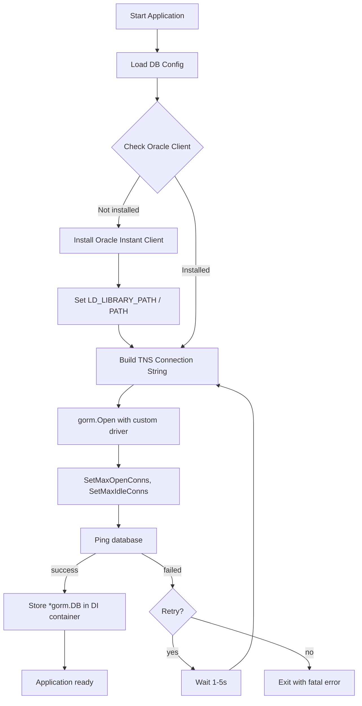
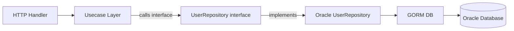

# Module 18: pkg/oracle (Oracle Database Client & Repository)

## สำหรับโฟลเดอร์ `internal/pkg/oracle/` และ `internal/repository/`

ไฟล์ที่เกี่ยวข้อง:
- `internal/pkg/oracle/client.go`
- `internal/pkg/oracle/repository.go`
- `internal/pkg/oracle/transaction.go`
- `internal/repository/oracle_user_repo.go`
- `migrations/oracle/` (สำหรับ migration files เฉพาะ Oracle)

---

## หลักการ (Concept)

### Oracle Database คืออะไร?

Oracle Database เป็นระบบจัดการฐานข้อมูลเชิงสัมพันธ์ (RDBMS) ระดับ enterprise ที่พัฒนาโดย Oracle Corporation มีจุดเด่นด้านความปลอดภัยสูงสุดระดับหนึ่ง รองรับการทำงานปริมาณมหาศาล และมีฟีเจอร์เฉพาะ เช่น **Real Application Clusters (RAC)** สำหรับ high availability, **Advanced Security (TDE, Redaction)** และ **PL/SQL stored procedures** โดยสามารถเชื่อมต่อผ่าน GORM ซึ่งต้องใช้ driver 第三方เนื่องจาก Oracle ไม่มี official Go driver[reference:0].

### มีกี่แบบ? (Oracle Driver Options for Go)

| Driver | ลักษณะ | ข้อดี | ข้อเสีย | เหมาะกับ |
|--------|--------|------|---------|----------|
| **godror** | CGO-based (OCI wrapper) | performance สูง, รองรับ Oracle features ครบ, mature | ต้องติดตั้ง Oracle Instant Client ขนาดใหญ่ | Production, enterprise |
| **go-ora** | Pure Go | ไม่ต้องติดตั้ง Oracle client, container-friendly | performance ต่ำกว่า godror, features น้อยกว่า | Development, container |
| **mattn/go-oci8** | CGO-based | legacy, stable | ขนาด image ใหญ่ (~1.5GB) | Legacy systems |

**ข้อควรรู้:** godror ขนาด image ~13.9MB, go-oci8 ขนาด ~1.5GB[reference:1].

### GORM Oracle Driver

GORM รองรับ Oracle ผ่าน driver `github.com/CengSin/oracle` (pure Go, based on go-ora) หรือ `github.com/godror/godror` (CGO-based) ต้องนำเข้ามาในโปรเจกต์และลงทะเบียน driver ก่อนใช้[reference:2][reference:3].

### ใช้อย่างไร / นำไปใช้กรณีไหน

1. **Enterprise data storage** – ใช้ Oracle สำหรับข้อมูลสำคัญ (ผู้ใช้, ธุรกรรม, logs) ตามมาตรฐานองค์กร
2. **Legacy system integration** – เชื่อมต่อ Go backend กับ Oracle database เดิมขององค์กร
3. **High‑throughput OLTP** – รองรับธุรกรรมปริมาณสูงด้วย RAC และ partitioning
4. **Financial/Government systems** – เมื่อต้องการความปลอดภัยและ audit compliance ระดับสูง

### ทำไมต้องใช้ (แทน PostgreSQL/MSSQL)

| คุณสมบัติ | PostgreSQL | SQL Server | Oracle |
|-----------|------------|------------|--------|
| **License** | Open‑source | Commercial | Commercial (สูงสุด) |
| **High availability** | 第三方 | Always On | RAC (Active-Active) |
| **Security features** | Good | Good | Excellent (TDE, Data Redaction, VPD) |
| **Partitioning** | Basic | Good | Advanced (interval, reference, etc.) |
| **PL/SQL** | PL/pgSQL | T-SQL | PL/SQL (mature) |
| **GORM support** | ✅ excellent | ✅ good | ⚠️ community driver |

**เมื่อใช้ Oracle:** องค์กรมี license อยู่แล้ว, ต้องการ RAC สำหรับ high availability, หรือมี legacy database ที่ต้องเชื่อมต่อ

### ประโยชน์ที่ได้รับ

- **Real Application Clusters (RAC)** – active-active clustering สำหรับ zero downtime
- **Transparent Data Encryption (TDE)** – เข้ารหัสข้อมูลอัตโนมัติ
- **Virtual Private Database (VPD)** – row-level security ตาม policy
- **Flashback Technology** – เรียกดูข้อมูลย้อนหลังโดยไม่ต้อง restore
- **Advanced Queuing (AQ)** – built-in message queue

### ข้อควรระวัง

- **License cost** – Oracle license มีค่าใช้จ่ายสูงมาก (core-based)
- **CGO dependency** – godror ต้องติดตั้ง Oracle Instant Client บน server[reference:4]
- **Connection string format** – รูปแบบ TNS: `user/password@//host:port/service_name`[reference:5]
- **Oracle session vs connection** – concept ต่างกัน ต้องเข้าใจการ configure
- **Go 1.14.6+** – godror มีการจัดการ session pool ที่ดีขึ้น ไม่ต้องตั้งค่า MaxIdleConns=0[reference:6]

### ข้อดี
- Enterprise features, high security, RAC, PL/SQL, mature

### ข้อเสีย
- License cost สูงมาก, ต้องติดตั้ง Oracle client, resource hungry, community support น้อย

### ข้อห้าม
- ห้ามใช้ `db.SetMaxIdleConns(0)` สำหรับ godror (obsolete advice)
- ห้ามใช้ pure Go driver (go-ora) ใน production หากต้องการ reliability
- ห้ามใช้ Oracle XE (Express Edition) ใน production (limit 12GB data)
- ห้ามละเลยการตั้งค่า connection pool limits สำหรับ high concurrency

---

## การออกแบบ Workflow และ Dataflow

### Workflow: การเชื่อมต่อ Oracle ผ่าน GORM + godror



**รูปที่ 23:** ขั้นตอนการสร้าง connection ไปยัง Oracle Database ผ่าน GORM + godror driver

### Workflow: Repository Pattern สำหรับ Oracle



**รูปที่ 24:** การทำงานของ Repository Pattern ที่แยก interface ออกจาก implementation สำหรับ Oracle

---

## ตัวอย่างโค้ดที่รันได้จริง

### 1. Oracle Client – `client.go`

```go
// Package oracle provides Oracle Database client and utilities using GORM.
// Requires Oracle Instant Client to be installed on the system.
// ----------------------------------------------------------------
// แพ็คเกจ oracle ให้บริการ Oracle Database client และ utilities ด้วย GORM
// ต้องติดตั้ง Oracle Instant Client บนระบบ
package oracle

import (
	"context"
	"fmt"
	"log"
	"time"

	"gorm.io/gorm"
	gormlogger "gorm.io/gorm/logger"

	// Import Oracle driver for GORM (choose one based on your needs)
	// เลือก driver ตามความต้องการ
	_ "github.com/godror/godror"           // CGO-based, requires Oracle client
	// หรือใช้ pure Go driver (development only)
	// _ "github.com/CengSin/oracle"
)

// Config holds Oracle connection settings.
// ----------------------------------------------------------------
// Config เก็บค่ากำหนดการเชื่อมต่อ Oracle
type Config struct {
	User         string // database username
	Password     string // database password
	Host         string // hostname or IP, e.g., "localhost" or "192.168.1.100"
	Port         int    // default 1521
	ServiceName  string // service name (or SID)
	// Connection pool settings
	MaxOpenConns    int
	MaxIdleConns    int
	ConnMaxLifetime time.Duration
	ConnMaxIdleTime time.Duration
	// Advanced options
	EnableTLS       bool   // enable TLS encryption
	WalletLocation  string // Oracle wallet location for cloud databases
	StandalonePool  bool   // use standalone connection pool (godror)
}

// DefaultConfig returns recommended config for development.
// ----------------------------------------------------------------
// DefaultConfig คืนค่า config ที่แนะนำสำหรับ development
func DefaultConfig() *Config {
	return &Config{
		User:            "system",
		Password:        "oracle",
		Host:            "localhost",
		Port:            1521,
		ServiceName:     "ORCLCDB",
		MaxOpenConns:    50,
		MaxIdleConns:    10,
		ConnMaxLifetime: 30 * time.Minute,
		ConnMaxIdleTime: 5 * time.Minute,
		EnableTLS:       false,
		StandalonePool:  false, // use session pool (default)
	}
}

// ConnectionString returns TNS-style connection string for godror.
// Format: "user/password@//host:port/service_name?option=value"
// ----------------------------------------------------------------
// ConnectionString คืน connection string แบบ TNS สำหรับ godror
func (c *Config) ConnectionString() string {
	// Base connection string
	// connection string พื้นฐาน
	connStr := fmt.Sprintf("%s/%s@//%s:%d/%s",
		c.User, c.Password, c.Host, c.Port, c.ServiceName)
	
	// Add parameters
	// เพิ่มพารามิเตอร์
	params := []string{}
	if c.EnableTLS {
		params = append(params, "ssl=require")
	}
	if c.StandalonePool {
		params = append(params, "standaloneConnection=1")
	}
	if c.WalletLocation != "" {
		params = append(params, "walletLocation="+c.WalletLocation)
	}
	
	if len(params) > 0 {
		connStr += "?"
		for i, p := range params {
			if i > 0 {
				connStr += "&"
			}
			connStr += p
		}
	}
	return connStr
}

// ConnectionParams returns godror.ConnectionParams struct for advanced config.
// ----------------------------------------------------------------
// ConnectionParams คืนค่า godror.ConnectionParams struct สำหรับการตั้งค่าแบบละเอียด
func (c *Config) ConnectionParams() map[string]string {
	params := map[string]string{
		"user":     c.User,
		"password": c.Password,
		"connectString": fmt.Sprintf("//%s:%d/%s", c.Host, c.Port, c.ServiceName),
	}
	if c.EnableTLS {
		params["ssl"] = "require"
	}
	if c.WalletLocation != "" {
		params["walletLocation"] = c.WalletLocation
	}
	return params
}

// Client wraps GORM DB instance with connection management.
// ----------------------------------------------------------------
// Client ห่อหุ้ม GORM DB instance พร้อมการจัดการการเชื่อมต่อ
type Client struct {
	DB     *gorm.DB
	config *Config
}

// NewClient creates a new Oracle client with connection pool.
// Requires Oracle Instant Client to be installed.
// ----------------------------------------------------------------
// NewClient สร้าง Oracle client ใหม่พร้อม connection pool
// ต้องติดตั้ง Oracle Instant Client
func NewClient(ctx context.Context, cfg *Config, logLevel gormlogger.LogLevel) (*Client, error) {
	if cfg == nil {
		cfg = DefaultConfig()
	}

	// Configure GORM logger
	// กำหนดค่า GORM logger
	gormLogger := gormlogger.New(
		log.New(logWriter{}, "\r\n", log.LstdFlags),
		gormlogger.Config{
			SlowThreshold:             200 * time.Millisecond,
			LogLevel:                  logLevel,
			IgnoreRecordNotFoundError: true,
			Colorful:                  false,
		},
	)

	// Build connection string
	// สร้าง connection string
	dsn := cfg.ConnectionString()

	// Open connection with GORM
	// เปิด connection ด้วย GORM
	gormDB, err := gorm.Open(GetDialector(dsn), &gorm.Config{
		Logger:                 gormLogger,
		SkipDefaultTransaction: false,
		PrepareStmt:            true,
	})
	if err != nil {
		return nil, fmt.Errorf("failed to connect to Oracle: %w", err)
	}

	// Get underlying sql.DB for connection pool configuration
	// ดึง sql.DB สำหรับการกำหนดค่า connection pool
	sqlDB, err := gormDB.DB()
	if err != nil {
		return nil, fmt.Errorf("failed to get sql.DB: %w", err)
	}

	// Configure connection pool
	// กำหนดค่า connection pool
	if cfg.MaxOpenConns > 0 {
		sqlDB.SetMaxOpenConns(cfg.MaxOpenConns)
	}
	if cfg.MaxIdleConns > 0 {
		sqlDB.SetMaxIdleConns(cfg.MaxIdleConns)
	}
	if cfg.ConnMaxLifetime > 0 {
		sqlDB.SetConnMaxLifetime(cfg.ConnMaxLifetime)
	}
	if cfg.ConnMaxIdleTime > 0 {
		sqlDB.SetConnMaxIdleTime(cfg.ConnMaxIdleTime)
	}

	// Test connection
	// ทดสอบการเชื่อมต่อ
	if err := sqlDB.PingContext(ctx); err != nil {
		return nil, fmt.Errorf("failed to ping Oracle: %w", err)
	}

	return &Client{
		DB:     gormDB,
		config: cfg,
	}, nil
}

// GetDialector returns the appropriate GORM dialector based on imported driver.
// ----------------------------------------------------------------
// GetDialector คืน GORM dialector ที่เหมาะสมตาม driver ที่ import
func GetDialector(dsn string) gorm.Dialector {
	// For godror driver (CGO-based)
	// สำหรับ godror driver
	return oracle.Open(dsn)
	// For pure Go driver (development)
	// return oracle.Open(dsn)  // if using CengSin/oracle
}

// Close gracefully closes the database connection.
// ----------------------------------------------------------------
// Close ปิดการเชื่อมต่อฐานข้อมูลอย่างนุ่มนวล
func (c *Client) Close() error {
	sqlDB, err := c.DB.DB()
	if err != nil {
		return err
	}
	return sqlDB.Close()
}

// logWriter adapts standard log for GORM.
// ----------------------------------------------------------------
// logWriter ปรับ log มาตรฐานสำหรับ GORM
type logWriter struct{}

func (l logWriter) Write(p []byte) (n int, err error) {
	log.Print(string(p))
	return len(p), nil
}
```

### 2. Generic Oracle Repository – `repository.go`

```go
package oracle

import (
	"context"

	"gorm.io/gorm"
)

// Repository defines generic CRUD operations for any entity.
// ----------------------------------------------------------------
// Repository กำหนดการดำเนินการ CRUD ทั่วไปสำหรับ entity ใดๆ
type Repository[T any] interface {
	Create(ctx context.Context, tx *gorm.DB, entity *T) error
	FindByID(ctx context.Context, id interface{}) (*T, error)
	Update(ctx context.Context, tx *gorm.DB, entity *T) error
	Delete(ctx context.Context, tx *gorm.DB, id interface{}) error
	List(ctx context.Context, limit, offset int) ([]T, int64, error)
}

// GenericRepository implements Repository with GORM.
// ----------------------------------------------------------------
// GenericRepository อิมพลีเมนต์ Repository ด้วย GORM
type GenericRepository[T any] struct {
	db *gorm.DB
}

// NewGenericRepository creates a new generic repository.
// ----------------------------------------------------------------
// NewGenericRepository สร้าง generic repository ใหม่
func NewGenericRepository[T any](db *gorm.DB) *GenericRepository[T] {
	return &GenericRepository[T]{db: db}
}

// getDB returns transaction if provided, otherwise default db.
// ----------------------------------------------------------------
// getDB คืนค่า transaction ถ้ามี หรือ db ปกติ
func (r *GenericRepository[T]) getDB(tx *gorm.DB) *gorm.DB {
	if tx != nil {
		return tx
	}
	return r.db
}

// Create inserts a new entity.
// ----------------------------------------------------------------
// Create เพิ่ม entity ใหม่
func (r *GenericRepository[T]) Create(ctx context.Context, tx *gorm.DB, entity *T) error {
	db := r.getDB(tx)
	return db.WithContext(ctx).Create(entity).Error
}

// FindByID retrieves an entity by primary key.
// ----------------------------------------------------------------
// FindByID ดึง entity ด้วย primary key
func (r *GenericRepository[T]) FindByID(ctx context.Context, id interface{}) (*T, error) {
	var entity T
	err := r.db.WithContext(ctx).First(&entity, id).Error
	if err != nil {
		return nil, err
	}
	return &entity, nil
}

// Update modifies an existing entity.
// ----------------------------------------------------------------
// Update แก้ไข entity ที่มีอยู่
func (r *GenericRepository[T]) Update(ctx context.Context, tx *gorm.DB, entity *T) error {
	db := r.getDB(tx)
	return db.WithContext(ctx).Save(entity).Error
}

// Delete removes an entity by primary key.
// ----------------------------------------------------------------
// Delete ลบ entity ด้วย primary key
func (r *GenericRepository[T]) Delete(ctx context.Context, tx *gorm.DB, id interface{}) error {
	db := r.getDB(tx)
	return db.WithContext(ctx).Delete(new(T), id).Error
}

// List returns paginated list of entities.
// Oracle uses ROWNUM or OFFSET/FETCH (12c+)
// ----------------------------------------------------------------
// List คืนค่ารายการ entity แบบแบ่งหน้า
func (r *GenericRepository[T]) List(ctx context.Context, limit, offset int) ([]T, int64, error) {
	var entities []T
	var total int64

	query := r.db.WithContext(ctx).Model(new(T))
	if err := query.Count(&total).Error; err != nil {
		return nil, 0, err
	}
	// For Oracle 12c+, OFFSET/FETCH is supported
	if err := query.Limit(limit).Offset(offset).Find(&entities).Error; err != nil {
		return nil, 0, err
	}
	return entities, total, nil
}
```

### 3. Transaction Manager – `transaction.go`

```go
package oracle

import (
	"context"

	"gorm.io/gorm"
)

// TransactionManager defines methods for managing database transactions.
// ----------------------------------------------------------------
// TransactionManager กำหนด method สำหรับจัดการ transaction ของฐานข้อมูล
type TransactionManager interface {
	Begin(ctx context.Context) (*gorm.DB, error)
	Commit(tx *gorm.DB) error
	Rollback(tx *gorm.DB) error
	ExecuteInTransaction(ctx context.Context, fn func(tx *gorm.DB) error) error
}

// GormTransactionManager implements TransactionManager using GORM.
// ----------------------------------------------------------------
// GormTransactionManager อิมพลีเมนต์ TransactionManager ด้วย GORM
type GormTransactionManager struct {
	db *gorm.DB
}

// NewTransactionManager creates a new transaction manager.
// ----------------------------------------------------------------
// NewTransactionManager สร้าง transaction manager ใหม่
func NewTransactionManager(db *gorm.DB) TransactionManager {
	return &GormTransactionManager{db: db}
}

// Begin starts a new transaction.
// ----------------------------------------------------------------
// Begin เริ่ม transaction ใหม่
func (m *GormTransactionManager) Begin(ctx context.Context) (*gorm.DB, error) {
	tx := m.db.WithContext(ctx).Begin()
	if tx.Error != nil {
		return nil, tx.Error
	}
	return tx, nil
}

// Commit commits the transaction.
// ----------------------------------------------------------------
// Commit ยืนยัน transaction
func (m *GormTransactionManager) Commit(tx *gorm.DB) error {
	return tx.Commit().Error
}

// Rollback aborts the transaction.
// ----------------------------------------------------------------
// Rollback ยกเลิก transaction
func (m *GormTransactionManager) Rollback(tx *gorm.DB) error {
	return tx.Rollback().Error
}

// ExecuteInTransaction runs the given function within a transaction.
// ----------------------------------------------------------------
// ExecuteInTransaction รันฟังก์ชันที่กำหนดภายใน transaction
func (m *GormTransactionManager) ExecuteInTransaction(ctx context.Context, fn func(tx *gorm.DB) error) error {
	return m.db.WithContext(ctx).Transaction(fn)
}
```

### 4. User Repository for Oracle – `internal/repository/oracle_user_repo.go`

```go
// Package repository provides Oracle-specific implementations.
// ----------------------------------------------------------------
// แพ็คเกจ repository ให้บริการ implementation เฉพาะของ Oracle
package repository

import (
	"context"
	"errors"

	"gobackend/internal/models"
	"gobackend/internal/pkg/oracle"
	"gorm.io/gorm"
)

// OracleUserRepository implements UserRepository for Oracle Database.
// ----------------------------------------------------------------
// OracleUserRepository อิมพลีเมนต์ UserRepository สำหรับ Oracle Database
type OracleUserRepository struct {
	db  *gorm.DB
	gen *oracle.GenericRepository[models.User]
}

// NewOracleUserRepository creates a new Oracle user repository.
// ----------------------------------------------------------------
// NewOracleUserRepository สร้าง Oracle user repository ใหม่
func NewOracleUserRepository(db *gorm.DB) *OracleUserRepository {
	return &OracleUserRepository{
		db:  db,
		gen: oracle.NewGenericRepository[models.User](db),
	}
}

// Create inserts a new user.
// ----------------------------------------------------------------
// Create เพิ่มผู้ใช้ใหม่
func (r *OracleUserRepository) Create(ctx context.Context, tx *gorm.DB, user *models.User) error {
	return r.gen.Create(ctx, tx, user)
}

// FindByID retrieves a user by ID.
// ----------------------------------------------------------------
// FindByID ดึงผู้ใช้ด้วย ID
func (r *OracleUserRepository) FindByID(ctx context.Context, id uint) (*models.User, error) {
	return r.gen.FindByID(ctx, id)
}

// FindByEmail retrieves a user by email.
// Oracle by default is case-sensitive for string comparisons.
// Use UPPER() for case-insensitive search.
// ----------------------------------------------------------------
// FindByEmail ดึงผู้ใช้ด้วยอีเมล
// Oracle จะเปรียบเทียบ case-sensitive ตามค่าเริ่มต้น
// ใช้ UPPER() เพื่อค้นหาแบบ case-insensitive
func (r *OracleUserRepository) FindByEmail(ctx context.Context, email string) (*models.User, error) {
	var user models.User
	err := r.db.WithContext(ctx).
		Where("UPPER(email) = UPPER(?)", email).
		First(&user).Error
	if errors.Is(err, gorm.ErrRecordNotFound) {
		return nil, nil
	}
	if err != nil {
		return nil, err
	}
	return &user, nil
}

// Update updates an existing user.
// ----------------------------------------------------------------
// Update อัปเดตผู้ใช้ที่มีอยู่
func (r *OracleUserRepository) Update(ctx context.Context, tx *gorm.DB, user *models.User) error {
	return r.gen.Update(ctx, tx, user)
}

// Delete soft-deletes a user (if DeletedAt field exists).
// ----------------------------------------------------------------
// Delete ลบผู้ใช้แบบ soft delete (ถ้ามีฟิลด์ DeletedAt)
func (r *OracleUserRepository) Delete(ctx context.Context, tx *gorm.DB, id uint) error {
	return r.gen.Delete(ctx, tx, id)
}

// List returns paginated users with Oracle-specific pagination.
// ----------------------------------------------------------------
// List คืนค่ารายชื่อผู้ใช้แบบแบ่งหน้า
func (r *OracleUserRepository) List(ctx context.Context, limit, offset int) ([]models.User, int64, error) {
	return r.gen.List(ctx, limit, offset)
}

// GetActiveUsersWithRawSQL demonstrates executing raw SQL for Oracle-specific features.
// Useful for Oracle-specific features like CONNECT BY (hierarchical queries).
// ----------------------------------------------------------------
// GetActiveUsersWithRawSQL แสดงการ execute raw SQL สำหรับฟีเจอร์เฉพาะของ Oracle
// มีประโยชน์สำหรับฟีเจอร์เช่น CONNECT BY (hierarchical queries)
func (r *OracleUserRepository) GetActiveUsersWithRawSQL(ctx context.Context) ([]models.User, error) {
	var users []models.User
	sql := `SELECT * FROM users WHERE is_active = 1`
	err := r.db.WithContext(ctx).Raw(sql).Scan(&users).Error
	return users, err
}
```

### 5. Oracle Migration Example – `migrations/oracle/000001_create_users_table.up.sql`

```sql
-- Create users table for Oracle Database
-- สร้างตาราง users สำหรับ Oracle Database
CREATE TABLE users (
    id NUMBER GENERATED BY DEFAULT AS IDENTITY PRIMARY KEY,
    email NVARCHAR2(255) NOT NULL UNIQUE,
    password_hash NVARCHAR2(255) NOT NULL,
    full_name NVARCHAR2(255) NULL,
    role NVARCHAR2(20) DEFAULT 'user' NOT NULL,
    is_active NUMBER(1) DEFAULT 1 NOT NULL,
    last_login_at TIMESTAMP WITH TIME ZONE NULL,
    created_at TIMESTAMP WITH TIME ZONE DEFAULT CURRENT_TIMESTAMP NOT NULL,
    updated_at TIMESTAMP WITH TIME ZONE DEFAULT CURRENT_TIMESTAMP NOT NULL,
    deleted_at TIMESTAMP WITH TIME ZONE NULL
);

-- Create indexes for performance
-- สร้าง indexes เพื่อประสิทธิภาพ
CREATE INDEX idx_users_email ON users(email);
CREATE INDEX idx_users_role ON users(role);
CREATE INDEX idx_users_deleted_at ON users(deleted_at);

-- Create trigger to auto-update updated_at
-- สร้าง trigger สำหรับอัปเดต updated_at อัตโนมัติ
CREATE OR REPLACE TRIGGER trg_users_updated_at
BEFORE UPDATE ON users
FOR EACH ROW
BEGIN
    :NEW.updated_at := CURRENT_TIMESTAMP;
END;
/
```

**migrations/oracle/000001_create_users_table.down.sql**

```sql
DROP TRIGGER trg_users_updated_at;
DROP TABLE users;
```

---

## วิธีใช้งาน module นี้

### 1. ติดตั้ง dependencies
```bash
# Install godror (requires CGO)
go get github.com/godror/godror

# Or install pure Go driver (development only)
go get github.com/CengSin/oracle

# Install GORM
go get gorm.io/gorm
```

### 2. ติดตั้ง Oracle Instant Client (สำหรับ godror)
```bash
# Download from Oracle website
# Set environment variables
export LD_LIBRARY_PATH=/usr/lib/oracle/instantclient_21_10:$LD_LIBRARY_PATH
export PATH=$PATH:/usr/lib/oracle/instantclient_21_10
```

### 3. วางไฟล์ตามโครงสร้าง
```
internal/pkg/oracle/
├── client.go
├── repository.go
└── transaction.go

internal/repository/
└── oracle_user_repo.go

migrations/oracle/
└── *.up.sql
```

### 4. สร้าง client และ repositories ใน `main.go`

```go
import (
    "gobackend/internal/pkg/oracle"
    "gobackend/internal/repository"
)

func main() {
    // Create Oracle client
    oracleCfg := &oracle.Config{
        User:        os.Getenv("ORACLE_USER"),
        Password:    os.Getenv("ORACLE_PASSWORD"),
        Host:        os.Getenv("ORACLE_HOST"),
        Port:        1521,
        ServiceName: os.Getenv("ORACLE_SERVICE"),
        MaxOpenConns: 50,
        MaxIdleConns: 10,
    }
    
    oracleClient, err := oracle.NewClient(context.Background(), oracleCfg, gormlogger.Info)
    if err != nil {
        log.Fatal(err)
    }
    defer oracleClient.Close()
    
    // Create repository
    userRepo := repository.NewOracleUserRepository(oracleClient.DB)
    txManager := oracle.NewTransactionManager(oracleClient.DB)
    
    // Inject into usecases...
}
```

### 5. ตัวอย่างการใช้งาน Usecase

```go
func (u *userUsecase) RegisterWithTransaction(ctx context.Context, email, password string) error {
    return u.txManager.ExecuteInTransaction(ctx, func(tx *gorm.DB) error {
        user := &models.User{
            Email:    email,
            Password: hashedPassword,
        }
        if err := u.userRepo.Create(ctx, tx, user); err != nil {
            return err
        }
        // Additional operations...
        return nil
    })
}
```

---

## ตารางสรุป Oracle Components

| Component | หน้าที่ | ตัวอย่าง |
|-----------|--------|----------|
| `Client` | จัดการ connection pool | `oracle.NewClient()` |
| `GenericRepository[T]` | Generic CRUD | `Create()`, `FindByID()`, `List()` |
| `TransactionManager` | จัดการ transaction | `ExecuteInTransaction()` |
| `OracleUserRepository` | User-specific queries | `FindByEmail()`, `GetActiveUsersWithRawSQL()` |

---

## แบบฝึกหัดท้าย module (3 ข้อ)

1. เพิ่มฟังก์ชัน `BulkInsert` ใน `GenericRepository` ที่รับ slice ของ entities และใช้ `CreateInBatches` ของ GORM สำหรับ insert จำนวนมาก (Oracle 12c+)
2. สร้าง migration สำหรับตาราง `audit_logs` ที่บันทึกการเปลี่ยนแปลง (user_id, action, old_value, new_value, timestamp) พร้อม indexes ที่เหมาะสมสำหรับ Oracle
3. Implement repository method ที่ใช้ Oracle-specific hierarchical query (`CONNECT BY`) สำหรับ organization chart

---

## แหล่งอ้างอิง

- [godror - Go Driver for Oracle](https://github.com/godror/godror)
- [GORM Oracle Driver (community)](https://github.com/CengSin/oracle)
- [Oracle Database Go Driver Documentation](https://godror.github.io/godror/)
- [golang-migrate Oracle driver](https://github.com/brandonmartin/migrate/tree/master/database/oracle)
- [Oracle Connection Strings](https://www.connectionstrings.com/oracle/)

---

**หมายเหตุ:** module นี้เป็นส่วนหนึ่งของระบบ gobackend ทั้งหมด หากต้องการ module เพิ่มเติม (เช่น `pkg/clickhouse`, `pkg/timescaledb`) โปรดแจ้ง