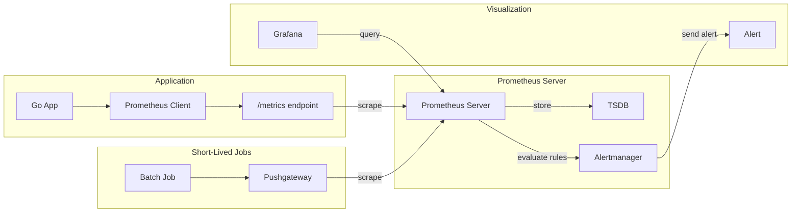

# Module 20: pkg/prometheus

## สำหรับโฟลเดอร์ `pkg/prometheus/`

ไฟล์ที่เกี่ยวข้อง:
- `client.go` - การสร้าง Registry และเชื่อมต่อกับ Prometheus server (HTTP API)
- `metrics.go` - การนิยามและสร้าง metric types (Counter, Gauge, Histogram, Summary)
- `writer.go` - การ push metrics ไปยัง Pushgateway สำหรับ short-lived jobs
- `query.go` - การ query ข้อมูลจาก Prometheus ด้วย HTTP API และ PromQL
- `registry.go` - การจัดการ custom registry และ collectors
- `config.go` - การตั้งค่า connection, scrape intervals, และ alerting rules
- `middleware.go` - HTTP middleware สำหรับ auto-instrumentation

---

## หลักการ (Concept)

### Prometheus คืออะไร?
Prometheus เป็นระบบ monitoring และ alerting แบบ open-source ที่ถูกออกแบบมาเฉพาะสำหรับการเก็บ metrics แบบ time-series โดยใช้ pull-based model เป็นหลัก[reference:0] Prometheus ถูกพัฒนาโดย SoundCloud ในปี 2012 และกลายเป็นโครงการที่สองที่เข้าร่วม CNCF ต่อจาก Kubernetes ปัจจุบันเป็นมาตรฐาน de facto สำหรับ monitoring ในโลก cloud-native[reference:1]

สถาปัตยกรรมของ Prometheus ประกอบด้วย:
- **Prometheus server** - scrape และ store metrics
- **Pushgateway** - intermediary สำหรับ short-lived jobs ที่ไม่สามารถถูก scrape ได้โดยตรง[reference:2]
- **Alertmanager** - จัดการ routing, grouping, silencing และการส่ง alert ไปยัง receivers
- **Client libraries** - สำหรับ instrument โค้ด application (มีให้ใน Go, Java, Python, Ruby, etc.)

**ข้อห้ามสำคัญ:** ห้ามใช้ Prometheus เป็น long-term storage สำหรับข้อมูลประวัติศาสตร์ เพราะ Prometheus ออกแบบมาให้เก็บข้อมูลในช่วง limited retention (default 15 วัน) เท่านั้น และไม่มี clustering native สำหรับข้อมูลระยะยาว ควรใช้ร่วมกับ remote storage adapter อย่าง Thanos, Cortex, หรือ VictoriaMetrics【reference: Prometheus best practices】

### มีกี่แบบ? (Deployment Models)

**รูปแบบการติดตั้ง:**
1. **Prometheus OSS (Open Source)** - ฟรี, single binary, เหมาะกับ development และ production ขนาดเล็ก
2. **Prometheus Operator** - สำหรับ Kubernetes, จัดการ Prometheus clusters อัตโนมัติ
3. **Managed Prometheus Services** - เช่น Alibaba Cloud Managed Service for Prometheus, AWS AMP, Google Cloud Managed Prometheus
4. **Prometheus as remote storage receiver** - ใช้ Prometheus เป็น ingestion endpoint สำหรับ Thanos หรือ Cortex

**Metric Types (4 ประเภทหลัก):**

| Type | Description | Use Cases | Methods |
|------|-------------|-----------|---------|
| **Counter** | ค่า cumulative ที่เพิ่มขึ้นอย่างเดียว (reset ได้เมื่อ restart)[reference:3] | จำนวน requests, errors, tasks completed, bytes sent | `Inc()`, `Add(float64)`, `AddWithExemplar()` |
| **Gauge** | ค่าที่ขึ้นลงได้[reference:4] | CPU usage, memory usage, temperature, active connections | `Set(float64)`, `Inc()`, `Dec()`, `Add()`, `Sub()`, `SetToCurrentTime()` |
| **Histogram** | สุ่มตัวอย่าง observations และนับใน configurable buckets, รองรับการคำนวณ quantiles ที่ server-side[reference:5] | Request durations, response sizes | `Observe(float64)` |
| **Summary** | คล้าย histogram แต่คำนวณ quantiles ที่ client-side[reference:6] | ใช้เมื่อต้องการ quantiles ที่แม่นยำสูงและไม่ต้อง aggregate ข้าม instance | `Observe(float64)` |

**ข้อควรรู้เกี่ยวกับ Histogram vs Summary:**
Prometheus แนะนำให้ใช้ Histogram เว้นแต่คุณต้องการ quantiles ที่แม่นยำสูงเฉพาะ client และไม่จำเป็นต้อง aggregate ข้าม instance เพราะ Summary คำนวณ quantiles ที่ client-side ทำให้ไม่สามารถ aggregate ค่า quantile ข้ามหลาย instance ได้อย่างถูกต้อง[reference:7][reference:8]

### ใช้อย่างไร / นำไปใช้กรณีไหน

**กรณีใช้งานที่เหมาะสม:**
- การ monitor microservices และระบบ distributed
- การเก็บ metrics จาก Kubernetes clusters
- การสร้าง dashboards แบบ real-time (ร่วมกับ Grafana)
- การตั้งค่า alerting rules สำหรับระบบ production
- การวิเคราะห์ performance trends และ capacity planning
- การเก็บ business metrics เช่น number of orders, user signups

**รูปแบบการทำงาน:**
Prometheus ใช้ pull-based model เป็นหลัก โดย:
1. Application instrumented ด้วย client library และ expose metrics endpoint (ปกติที่ `/metrics`)
2. Prometheus server scrape endpoint ตามกำหนด interval (scrape_interval)
3. ข้อมูลถูกเก็บใน local TSDB และ query ผ่าน PromQL
4. Alerting rules ถูกประเมินตามกำหนด (evaluation_interval) และส่ง alert ไปยัง Alertmanager

**Push-based model (ผ่าน Pushgateway):**
สำหรับ short-lived jobs หรือ batch processes ที่ไม่สามารถถูก scrape ได้โดยตรง[reference:9]:
- Cron jobs, data pipeline tasks, CI/CD jobs
- Serverless functions ที่มี lifespan สั้น
- Jobs ที่ run ใน network environment ที่ไม่สามารถเข้าถึงได้จาก Prometheus server

### ประโยชน์ที่ได้รับ
- **Pull-based architecture** - ง่ายต่อการ scaling และ service discovery
- **Powerful PromQL** - ภาษา query ที่ยืดหยุ่นและมีประสิทธิภาพ
- **Multi-dimensional data model** - รองรับ labels ทำให้สามารถ filter และ aggregate ได้ละเอียด
- **Built-in alerting** - ไม่ต้องใช้ external system แยกต่างหาก
- **Excellent ecosystem** - Grafana, Alertmanager, exporters มากมาย
- **Simple deployment** - single binary, ไม่มี external dependencies
- **Service discovery integration** - Kubernetes, Consul, DNS, file-based SD

### ข้อควรระวัง
- **Cardinality explosion** - การใช้ labels ที่มี cardinality สูง (เช่น user_id, email) จะทำให้จำนวน time series เพิ่มขึ้นแบบ exponential และกิน memory จำนวนมาก[reference:10]
- **No strong consistency** - ระหว่าง replicas (ใช้ local storage)
- **Limited storage capacity** - ไม่เหมาะกับ long-term storage (>1 year) ควรใช้ remote storage adapter
- **Pull model limitations** - ไม่สามารถรับ metrics จาก services ที่อยู่ behind firewall ได้ง่าย (ต้องใช้ Pushgateway)
- **No data encryption at rest** (ต้องใช้ filesystem encryption)
- **No automatic sharding** (ต้องใช้ Thanos/Cortex สำหรับ cluster)

### ข้อดี
- เป็นมาตรฐาน de facto สำหรับ monitoring ใน cloud-native ecosystem
- ชุมชนใหญ่และ active มี exporters ให้ใช้กับ几乎所有 systems
- การ query ด้วย PromQL มีประสิทธิภาพสูง
- ผสานงานกับ Grafana ได้ seamless
- การ alerting มีความยืดหยุ่น (suppression, inhibition, grouping)

### ข้อเสีย
- ไม่รองรับ SQL หรือ query อื่นๆ นอกจาก PromQL (learning curve)
- Long-term storage เป็น challenge ต้องใช้ external solutions
- Pull-based model อาจไม่เหมาะกับ high-frequency metrics (sub-second)
- การทำ high availability ต้องรัน Prometheus instances แบบแยกกัน (มี duplicate data)

### ข้อห้าม
**ห้ามใช้ Prometheus เป็น primary database สำหรับเก็บ raw business transactions หรือข้อมูลที่ต้องการ high durability และ consistency** เพราะ Prometheus ออกแบบมาเพื่อ monitoring โดยเฉพาะ ไม่มี transaction support, ไม่มี strong consistency guarantee, และการ query ไม่เหมาะกับรายละเอียดระดับ row แต่ละรายการ【reference: Prometheus best practices】

---

## การออกแบบ Workflow และ Dataflow



**Dataflow ใน Go application:**
1. สร้าง Registry (prometheus.NewRegistry() หรือใช้ default)
2. Register collectors (GoCollector, ProcessCollector)[reference:11]
3. Define metrics (Counter, Gauge, Histogram, Summary)
4. Instrument business logic ด้วย metric methods (Inc, Set, Observe)
5. Expose `/metrics` endpoint ด้วย promhttp.Handler[reference:12]
6. Prometheus server scrape endpoint ตาม interval
7. Query ผ่าน PromQL API หรือ Grafana

**Pushgateway dataflow:**
1. สร้าง Pusher ด้วย push.New()[reference:13]
2. Register metrics ลง Registry
3. Push หรือ Add metrics ไปยัง Pushgateway[reference:14]
4. Prometheus scrape จาก Pushgateway แทน application โดยตรง

---

## ตัวอย่างโค้ดที่รันได้จริง

### โครงสร้างโปรเจกต์
```
pkg/prometheus/
├── client.go
├── metrics.go
├── writer.go
├── query.go
├── registry.go
├── middleware.go
├── config.go
└── example_main.go
```

### 1. การติดตั้ง Go client library

```bash
go get github.com/prometheus/client_golang/prometheus
go get github.com/prometheus/client_golang/prometheus/promauto
go get github.com/prometheus/client_golang/prometheus/promhttp
go get github.com/prometheus/client_golang/prometheus/push
go get github.com/prometheus/client_golang/api/prometheus/v1
go get github.com/prometheus/client_golang/api
```

### 2. การติดตั้ง Prometheus ด้วย Docker

```yaml
# docker-compose.yml
version: '3.8'
services:
  prometheus:
    image: prom/prometheus:latest
    container_name: prometheus
    ports:
      - "9090:9090"
    volumes:
      - ./prometheus.yml:/etc/prometheus/prometheus.yml
      - prometheus_data:/prometheus
    command:
      - '--config.file=/etc/prometheus/prometheus.yml'
      - '--storage.tsdb.path=/prometheus'
      - '--storage.tsdb.retention.time=15d'
    restart: unless-stopped

  pushgateway:
    image: prom/pushgateway:latest
    container_name: pushgateway
    ports:
      - "9091:9091"
    restart: unless-stopped

  grafana:
    image: grafana/grafana:latest
    container_name: grafana
    ports:
      - "3000:3000"
    environment:
      - GF_SECURITY_ADMIN_PASSWORD=admin
    volumes:
      - grafana_data:/var/lib/grafana
    restart: unless-stopped

volumes:
  prometheus_data:
  grafana_data:
```

Prometheus configuration (`prometheus.yml`):
```yaml
global:
  scrape_interval: 15s
  evaluation_interval: 15s

scrape_configs:
  - job_name: 'go-app'
    static_configs:
      - targets: ['host.docker.internal:8080']
  
  - job_name: 'pushgateway'
    honor_labels: true
    static_configs:
      - targets: ['pushgateway:9091']
```

รันด้วย:
```bash
docker-compose up -d
```

### 3. ตัวอย่างโค้ด: Config และ Client

```go
// config.go
package prometheus

import "time"

type Config struct {
    // Prometheus server
    ServerURL   string
    ServerPort  int
    
    // Pushgateway
    PushgatewayURL string
    
    // Metric naming
    Namespace string
    Subsystem string
    
    // Scrape settings
    ScrapeInterval time.Duration
    
    // Alerting
    AlertmanagerURL string
}

func DefaultConfig() Config {
    return Config{
        ServerURL:        "http://localhost:9090",
        ServerPort:       9090,
        PushgatewayURL:   "http://localhost:9091",
        Namespace:        "myapp",
        Subsystem:        "",
        ScrapeInterval:   15 * time.Second,
        AlertmanagerURL:  "http://localhost:9093",
    }
}
```

### 4. ตัวอย่างโค้ด: Metrics Definition

```go
// metrics.go
package prometheus

import (
    "github.com/prometheus/client_golang/prometheus"
    "github.com/prometheus/client_golang/prometheus/promauto"
)

// Metrics struct holds all custom metrics
type Metrics struct {
    // Counters
    RequestsTotal   *prometheus.CounterVec
    ErrorsTotal     *prometheus.CounterVec
    
    // Gauges
    ActiveConnections prometheus.Gauge
    QueueSize         prometheus.Gauge
    MemoryUsage       *prometheus.GaugeVec
    
    // Histograms (recommended for request duration)
    RequestDuration *prometheus.HistogramVec
    
    // Summary (use when high accuracy needed, no cross-instance aggregation)
    ResponseSize *prometheus.SummaryVec
}

// NewMetrics creates and registers all metrics with the provided registry
func NewMetrics(reg prometheus.Registerer, namespace, subsystem string) *Metrics {
    m := &Metrics{
        // Counter with labels
        RequestsTotal: promauto.With(reg).NewCounterVec(
            prometheus.CounterOpts{
                Namespace: namespace,
                Subsystem: subsystem,
                Name:      "requests_total",
                Help:      "Total number of HTTP requests",
            },
            []string{"method", "endpoint", "status"},
        ),
        
        ErrorsTotal: promauto.With(reg).NewCounterVec(
            prometheus.CounterOpts{
                Namespace: namespace,
                Subsystem: subsystem,
                Name:      "errors_total",
                Help:      "Total number of errors",
            },
            []string{"type"},
        ),
        
        // Gauge
        ActiveConnections: promauto.With(reg).NewGauge(
            prometheus.GaugeOpts{
                Namespace: namespace,
                Subsystem: subsystem,
                Name:      "active_connections",
                Help:      "Number of active connections",
            },
        ),
        
        QueueSize: promauto.With(reg).NewGauge(
            prometheus.GaugeOpts{
                Namespace: namespace,
                Subsystem: subsystem,
                Name:      "queue_size",
                Help:      "Current queue size",
            },
        ),
        
        MemoryUsage: promauto.With(reg).NewGaugeVec(
            prometheus.GaugeOpts{
                Namespace: namespace,
                Subsystem: subsystem,
                Name:      "memory_usage_bytes",
                Help:      "Memory usage in bytes",
            },
            []string{"type"},
        ),
        
        // Histogram with custom buckets (in seconds)
        RequestDuration: promauto.With(reg).NewHistogramVec(
            prometheus.HistogramOpts{
                Namespace: namespace,
                Subsystem: subsystem,
                Name:      "request_duration_seconds",
                Help:      "HTTP request duration in seconds",
                Buckets:   prometheus.DefBuckets, // [0.005, 0.01, 0.025, 0.05, 0.1, 0.25, 0.5, 1, 2.5, 5, 10]
                // Or custom buckets: prometheus.LinearBuckets(0.01, 0.05, 20)
                // Or exponential: prometheus.ExponentialBuckets(0.01, 2, 10)
            },
            []string{"method", "endpoint"},
        ),
        
        // Summary (with configurable quantiles)
        ResponseSize: promauto.With(reg).NewSummaryVec(
            prometheus.SummaryOpts{
                Namespace:  namespace,
                Subsystem:  subsystem,
                Name:       "response_size_bytes",
                Help:       "HTTP response size in bytes",
                Objectives: map[float64]float64{0.5: 0.05, 0.9: 0.01, 0.99: 0.001},
            },
            []string{"method", "endpoint"},
        ),
    }
    
    return m
}
```

### 5. ตัวอย่างโค้ด: Registry Setup

```go
// registry.go
package prometheus

import (
    "github.com/prometheus/client_golang/prometheus"
    "github.com/prometheus/client_golang/prometheus/collectors"
)

// SetupRegistry creates a custom registry with default Go and Process metrics
func SetupRegistry() *prometheus.Registry {
    reg := prometheus.NewRegistry()
    
    // Register default Go runtime metrics (goroutines, GC, memory, etc.)
    reg.MustRegister(collectors.NewGoCollector())
    
    // Register process metrics (CPU, memory, file descriptors)
    reg.MustRegister(collectors.NewProcessCollector(collectors.ProcessCollectorOpts{}))
    
    return reg
}

// SetupPedanticRegistry for testing (enforces extra validation)
func SetupPedanticRegistry() *prometheus.Registry {
    return prometheus.NewPedanticRegistry()
}
```

### 6. ตัวอย่างโค้ด: HTTP Middleware

```go
// middleware.go
package prometheus

import (
    "net/http"
    "strconv"
    "time"
    
    "github.com/prometheus/client_golang/prometheus/promhttp"
)

// InstrumentMiddleware automatically instruments HTTP handlers
func InstrumentMiddleware(metrics *Metrics, next http.Handler) http.Handler {
    return promhttp.InstrumentHandlerCounter(
        metrics.RequestsTotal,
        promhttp.InstrumentHandlerDuration(
            metrics.RequestDuration,
            promhttp.InstrumentHandlerResponseSize(
                metrics.ResponseSize,
                next,
            ),
        ),
    )
}

// HTTPMiddleware returns a middleware function for standard http.Handler
func HTTPMiddleware(metrics *Metrics) func(http.Handler) http.Handler {
    return func(next http.Handler) http.Handler {
        return http.HandlerFunc(func(w http.ResponseWriter, r *http.Request) {
            start := time.Now()
            
            // Wrap response writer to capture status code
            rw := &responseWriter{ResponseWriter: w, statusCode: http.StatusOK}
            next.ServeHTTP(rw, r)
            
            duration := time.Since(start).Seconds()
            metrics.RequestDuration.WithLabelValues(r.Method, r.URL.Path).Observe(duration)
            metrics.RequestsTotal.WithLabelValues(r.Method, r.URL.Path, strconv.Itoa(rw.statusCode)).Inc()
        })
    }
}

type responseWriter struct {
    http.ResponseWriter
    statusCode int
}

func (rw *responseWriter) WriteHeader(code int) {
    rw.statusCode = code
    rw.ResponseWriter.WriteHeader(code)
}
```

### 7. ตัวอย่างโค้ด: Pushgateway Integration

```go
// writer.go
package prometheus

import (
    "context"
    "net/http"
    
    "github.com/prometheus/client_golang/prometheus"
    "github.com/prometheus/client_golang/prometheus/push"
)

// PushMetrics pushes metrics to Pushgateway for short-lived jobs
func PushMetrics(jobName string, grouping map[string]string, registry prometheus.Gatherer, pushgatewayURL string) error {
    pusher := push.New(pushgatewayURL, jobName)
    
    // Add grouping labels
    for k, v := range grouping {
        pusher = pusher.Grouping(k, v)
    }
    
    // Set registry and push
    pusher = pusher.Gatherer(registry)
    
    // Use Push() to replace all metrics for this job
    // Use Add() to only replace metrics with same name
    return pusher.Push()
}

// PushBatchJobMetrics example for batch job
func PushBatchJobMetrics(recordsProcessed int, errors int, duration float64) error {
    // Create temporary registry for this batch
    reg := prometheus.NewRegistry()
    
    recordsCounter := prometheus.NewCounter(prometheus.CounterOpts{
        Name: "batch_records_processed_total",
        Help: "Total records processed by batch job",
    })
    reg.MustRegister(recordsCounter)
    recordsCounter.Add(float64(recordsProcessed))
    
    errorCounter := prometheus.NewCounter(prometheus.CounterOpts{
        Name: "batch_errors_total",
        Help: "Total errors during batch processing",
    })
    reg.MustRegister(errorCounter)
    errorCounter.Add(float64(errors))
    
    durationGauge := prometheus.NewGauge(prometheus.GaugeOpts{
        Name: "batch_duration_seconds",
        Help: "Duration of batch job in seconds",
    })
    reg.MustRegister(durationGauge)
    durationGauge.Set(duration)
    
    // Push to Pushgateway with job name "batch_processor"
    return PushMetrics("batch_processor", map[string]string{
        "environment": "production",
        "batch_id":    "daily_2026-04-01",
    }, reg, "http://localhost:9091")
}
```

### 8. ตัวอย่างโค้ด: Query API

```go
// query.go
package prometheus

import (
    "context"
    "fmt"
    "time"
    
    "github.com/prometheus/client_golang/api"
    v1 "github.com/prometheus/client_golang/api/prometheus/v1"
    "github.com/prometheus/common/model"
)

type PrometheusClient struct {
    api v1.API
}

func NewPrometheusClient(serverURL string) (*PrometheusClient, error) {
    client, err := api.NewClient(api.Config{
        Address: serverURL,
    })
    if err != nil {
        return nil, err
    }
    return &PrometheusClient{api: v1.NewAPI(client)}, nil
}

// QueryInstant performs instant query at a single timestamp
func (p *PrometheusClient) QueryInstant(ctx context.Context, query string, ts time.Time) (model.Value, error) {
    result, warnings, err := p.api.Query(ctx, query, ts)
    if err != nil {
        return nil, err
    }
    if len(warnings) > 0 {
        fmt.Printf("Warnings: %v\n", warnings)
    }
    return result, nil
}

// QueryRange performs range query over time interval
func (p *PrometheusClient) QueryRange(ctx context.Context, query string, start, end time.Time, step time.Duration) (model.Value, error) {
    r := v1.Range{
        Start: start,
        End:   end,
        Step:  step,
    }
    result, warnings, err := p.api.QueryRange(ctx, query, r)
    if err != nil {
        return nil, err
    }
    if len(warnings) > 0 {
        fmt.Printf("Warnings: %v\n", warnings)
    }
    return result, nil
}

// GetRequestRate returns request rate per second over last hour
func (p *PrometheusClient) GetRequestRate(ctx context.Context) (map[string]float64, error) {
    query := `rate(myapp_requests_total[5m])`
    result, err := p.QueryInstant(ctx, query, time.Now())
    if err != nil {
        return nil, err
    }
    
    rates := make(map[string]float64)
    if vector, ok := result.(model.Vector); ok {
        for _, sample := range vector {
            key := string(sample.Metric["endpoint"])
            rates[key] = float64(sample.Value)
        }
    }
    return rates, nil
}

// GetP99Latency returns 99th percentile latency for endpoint
func (p *PrometheusClient) GetP99Latency(ctx context.Context, endpoint string, duration time.Duration) (float64, error) {
    query := fmt.Sprintf(`histogram_quantile(0.99, sum(rate(myapp_request_duration_seconds_bucket{endpoint="%s"}[%s])) by (le))`,
        endpoint, duration.String())
    result, err := p.QueryInstant(ctx, query, time.Now())
    if err != nil {
        return 0, err
    }
    
    if vector, ok := result.(model.Vector); ok && len(vector) > 0 {
        return float64(vector[0].Value), nil
    }
    return 0, nil
}
```

### 9. ตัวอย่างการใช้งานรวมใน HTTP server

```go
// main.go
package main

import (
    "log"
    "math/rand"
    "net/http"
    "time"
    
    "yourproject/pkg/prometheus"
    
    "github.com/prometheus/client_golang/prometheus/promhttp"
)

func main() {
    // Setup registry
    reg := prometheus.SetupRegistry()
    
    // Create custom metrics
    metrics := prometheus.NewMetrics(reg, "myapp", "http")
    
    // Create HTTP server with middleware
    mux := http.NewServeMux()
    
    // Instrument handlers
    mux.HandleFunc("/api/users", prometheus.InstrumentMiddleware(metrics, http.HandlerFunc(handleUsers)).ServeHTTP)
    mux.HandleFunc("/api/health", handleHealth)
    
    // Expose metrics endpoint
    mux.Handle("/metrics", promhttp.HandlerFor(reg, promhttp.HandlerOpts{}))
    
    // Start background goroutine to update gauges
    go updateMetrics(metrics)
    
    log.Println("Server starting on :8080")
    log.Fatal(http.ListenAndServe(":8080", mux))
}

func handleUsers(w http.ResponseWriter, r *http.Request) {
    start := time.Now()
    
    // Simulate processing
    time.Sleep(time.Duration(rand.Intn(100)) * time.Millisecond)
    
    w.WriteHeader(http.StatusOK)
    w.Write([]byte(`{"users":[]}`))
    
    // Observe duration
    duration := time.Since(start).Seconds()
    // Note: With middleware, this is automatically recorded
    log.Printf("Request processed in %.3fs", duration)
}

func handleHealth(w http.ResponseWriter, r *http.Request) {
    w.WriteHeader(http.StatusOK)
    w.Write([]byte(`{"status":"ok"}`))
}

func updateMetrics(metrics *prometheus.Metrics) {
    ticker := time.NewTicker(5 * time.Second)
    for range ticker.C {
        // Update gauge with random values for demonstration
        metrics.ActiveConnections.Set(float64(rand.Intn(100)))
        metrics.QueueSize.Set(float64(rand.Intn(50)))
        
        // Memory usage simulation
        metrics.MemoryUsage.WithLabelValues("heap").Set(float64(rand.Int63n(1024*1024*1024)))
        metrics.MemoryUsage.WithLabelValues("stack").Set(float64(rand.Int63n(1024*1024*1024)))
    }
}
```

### 10. ตัวอย่างการใช้งาน Pushgateway สำหรับ Batch Job

```go
// batch_job.go
package main

import (
    "log"
    "time"
    
    "yourproject/pkg/prometheus"
)

func main() {
    start := time.Now()
    recordsProcessed := 18088
    errors := 42
    
    // Process batch job...
    // ...
    
    duration := time.Since(start).Seconds()
    
    // Push metrics to Pushgateway
    if err := prometheus.PushBatchJobMetrics(recordsProcessed, errors, duration); err != nil {
        log.Printf("Failed to push metrics: %v", err)
    } else {
        log.Println("Metrics pushed successfully")
    }
}
```

---

## วิธีใช้งาน module นี้

1. **ติดตั้ง Prometheus** (ใช้ Docker หรือ binary) พร้อม Pushgateway และ Grafana
2. **ติดตั้ง Go client libraries** ตามที่ระบุในหัวข้อ "การติดตั้ง Go client library"
3. **คัดลอกโค้ด** ไฟล์ `metrics.go`, `registry.go`, `middleware.go`, `writer.go`, `query.go`, `config.go` ไปไว้ใน `pkg/prometheus/`
4. **สร้าง Registry** ด้วย `prometheus.SetupRegistry()`
5. **สร้าง Metrics** ด้วย `prometheus.NewMetrics(reg, namespace, subsystem)`
6. **Instrument handlers** ด้วย middleware หรือเพิ่ม metric calls ใน business logic
7. **Expose `/metrics` endpoint** ด้วย `promhttp.HandlerFor(reg, promhttp.HandlerOpts{})`
8. **ตั้งค่า Prometheus scrape config** ให้ชี้ไปที่ endpoint ของ application
9. **สำหรับ batch jobs** ใช้ Pushgateway ตามตัวอย่าง
10. **Query metrics** ด้วย PromQL ผ่าน Web UI หรือ Grafana

---

## การติดตั้ง

```bash
# Create module
go mod init yourproject

# Install dependencies
go get github.com/prometheus/client_golang/prometheus
go get github.com/prometheus/client_golang/prometheus/promauto
go get github.com/prometheus/client_golang/prometheus/promhttp
go get github.com/prometheus/client_golang/prometheus/push
go get github.com/prometheus/client_golang/api/prometheus/v1
go get github.com/prometheus/common/model

# For Docker setup
docker pull prom/prometheus
docker pull prom/pushgateway
docker pull grafana/grafana
```

---

## การตั้งค่า configuration

```go
// config.go
package prometheus

type Config struct {
    // Prometheus server
    ServerURL   string
    ServerPort  int
    
    // Pushgateway
    PushgatewayURL string
    
    // Metric naming
    Namespace string
    Subsystem string
    
    // Scrape settings
    ScrapeInterval time.Duration
    
    // Alerting
    AlertmanagerURL string
}

func LoadConfig() Config {
    return Config{
        ServerURL:        getEnv("PROMETHEUS_URL", "http://localhost:9090"),
        PushgatewayURL:   getEnv("PUSHGATEWAY_URL", "http://localhost:9091"),
        Namespace:        getEnv("METRIC_NAMESPACE", "myapp"),
        Subsystem:        getEnv("METRIC_SUBSYSTEM", ""),
        ScrapeInterval:   15 * time.Second,
        AlertmanagerURL:  getEnv("ALERTMANAGER_URL", "http://localhost:9093"),
    }
}

func getEnv(key, defaultValue string) string {
    if value := os.Getenv(key); value != "" {
        return value
    }
    return defaultValue
}
```

---

## การรวมกับ GORM

```go
// gorm_plugin.go
package prometheus

import (
    "time"
    
    "github.com/prometheus/client_golang/prometheus"
    "gorm.io/gorm"
)

type GormPrometheusPlugin struct {
    dbName          string
    queryDuration   *prometheus.HistogramVec
    queriesTotal    *prometheus.CounterVec
}

func NewGormPrometheusPlugin(dbName string, reg prometheus.Registerer) *GormPrometheusPlugin {
    p := &GormPrometheusPlugin{
        dbName: dbName,
        queryDuration: prometheus.NewHistogramVec(
            prometheus.HistogramOpts{
                Namespace: "myapp",
                Subsystem: "database",
                Name:      "query_duration_seconds",
                Help:      "Database query duration in seconds",
                Buckets:   []float64{0.001, 0.005, 0.01, 0.025, 0.05, 0.1, 0.25, 0.5, 1},
            },
            []string{"table", "operation"},
        ),
        queriesTotal: prometheus.NewCounterVec(
            prometheus.CounterOpts{
                Namespace: "myapp",
                Subsystem: "database",
                Name:      "queries_total",
                Help:      "Total number of database queries",
            },
            []string{"table", "operation", "status"},
        ),
    }
    reg.MustRegister(p.queryDuration, p.queriesTotal)
    return p
}

func (p *GormPrometheusPlugin) Name() string {
    return "prometheus"
}

func (p *GormPrometheusPlugin) Initialize(db *gorm.DB) error {
    db.Callback().Query().Before("gorm:query").Register("prometheus:before_query", p.before)
    db.Callback().Query().After("gorm:query").Register("prometheus:after_query", p.after)
    return nil
}

func (p *GormPrometheusPlugin) before(db *gorm.DB) {
    db.InstanceSet("prometheus_start_time", time.Now())
}

func (p *GormPrometheusPlugin) after(db *gorm.DB) {
    if startTime, ok := db.InstanceGet("prometheus_start_time"); ok {
        duration := time.Since(startTime.(time.Time)).Seconds()
        table := db.Statement.Table
        operation := "query"
        
        p.queryDuration.WithLabelValues(table, operation).Observe(duration)
        
        status := "success"
        if db.Error != nil {
            status = "error"
        }
        p.queriesTotal.WithLabelValues(table, operation, status).Inc()
    }
}
```

---

## การใช้งานจริง

### Example 1: Monitoring HTTP Server

```go
package main

import (
    "context"
    "log"
    "net/http"
    "time"
    
    "yourproject/pkg/prometheus"
    
    "github.com/prometheus/client_golang/prometheus/promhttp"
)

func main() {
    // Setup
    cfg := prometheus.LoadConfig()
    reg := prometheus.SetupRegistry()
    metrics := prometheus.NewMetrics(reg, cfg.Namespace, cfg.Subsystem)
    
    // Create router
    mux := http.NewServeMux()
    
    // Protected endpoint with instrumentation
    mux.Handle("/api/", prometheus.HTTPMiddleware(metrics)(http.DefaultServeMux))
    
    // Metrics endpoint
    mux.Handle("/metrics", promhttp.HandlerFor(reg, promhttp.HandlerOpts{}))
    
    // Start server
    srv := &http.Server{
        Addr:    ":8080",
        Handler: mux,
    }
    
    go func() {
        log.Println("Server starting on :8080")
        if err := srv.ListenAndServe(); err != http.ErrServerClosed {
            log.Fatal(err)
        }
    }()
    
    // Graceful shutdown
    <-context.Background().Done()
    ctx, cancel := context.WithTimeout(context.Background(), 5*time.Second)
    defer cancel()
    srv.Shutdown(ctx)
}
```

### Example 2: Batch Job with Pushgateway

```go
package main

import (
    "log"
    "time"
    
    "yourproject/pkg/prometheus"
)

func main() {
    start := time.Now()
    
    // Process data
    records, errs := processData()
    
    // Push metrics
    if err := prometheus.PushBatchJobMetrics(records, errs, time.Since(start).Seconds()); err != nil {
        log.Printf("Failed to push metrics: %v", err)
    }
}

func processData() (int, int) {
    // Your batch processing logic here
    return 18088, 42
}
```

---

## ตารางสรุป Prometheus Components

| Component | คำอธิบาย | ตัวอย่าง |
|-----------|----------|----------|
| **Prometheus Server** | Core server สำหรับ scrape, store, และ query metrics | `prom/prometheus` Docker image |
| **Pushgateway** | intermediary สำหรับ short-lived jobs ที่ไม่สามารถ scrape ได้โดยตรง[reference:15] | `prom/pushgateway` Docker image |
| **Alertmanager** | จัดการ routing, grouping, silencing alerts | `prom/alertmanager` Docker image |
| **Client Library** | สำหรับ instrument โค้ด application | `github.com/prometheus/client_golang` |
| **Exporter** | 第三方工具ที่แปลง metrics จากระบบอื่นเป็น Prometheus format | Node Exporter, Blackbox Exporter |
| **Registry** | เก็บ metrics และจัดการการ registration[reference:16] | `prometheus.NewRegistry()` |
| **Collector** | 负责收集 metrics (GoCollector, ProcessCollector) | `collectors.NewGoCollector()` |
| **Counter** | Metric ที่เพิ่มขึ้นอย่างเดียว[reference:17] | `http_requests_total` |
| **Gauge** | Metric ที่ขึ้นลงได้[reference:18] | `active_connections` |
| **Histogram** | สุ่มตัวอย่าง observations ใน buckets, รองรับการคำนวณ quantile ที่ server-side[reference:19] | `request_duration_seconds` |
| **Summary** | คล้าย histogram แต่คำนวณ quantile ที่ client-side[reference:20] | `response_size_bytes` |
| **PromQL** | ภาษา query ของ Prometheus | `rate(http_requests_total[5m])` |
| **Prometheus Operator** | Kubernetes operator สำหรับจัดการ Prometheus cluster | `prometheus-operator` |
| **ServiceMonitor** | CRD สำหรับกำหนด endpoints ที่ Prometheus ต้อง scrape[reference:21] | `ServiceMonitor` resource |
| **Grafana** | Visualization tool สำหรับ query และแสดง metrics | `grafana/grafana` Docker image |

---

## แบบฝึกหัดท้าย module (5 ข้อ)

### ข้อ 1: การสร้างและใช้งาน Counter และ Gauge

จงสร้าง struct `OrderMetrics` ที่มี metrics ดังนี้:
- `orders_total` (Counter) พร้อม labels: `status` (success, failed), `payment_method` (credit_card, bank_transfer, cod)
- `active_orders` (Gauge) สำหรับ tracking จำนวน order ที่กำลังดำเนินการ
- `order_value_total` (Counter) สำหรับ tracking มูลค่ารวมของ orders

จากนั้นเขียนฟังก์ชัน `ProcessOrder(amount float64, paymentMethod string) error` ที่:
- เพิ่ม active_orders ขึ้น 1 เมื่อเริ่ม process
- เมื่อ process สำเร็จ ให้เพิ่ม orders_total (success), เพิ่ม order_value_total, ลด active_orders
- เมื่อเกิด error ให้เพิ่ม orders_total (failed), ลด active_orders
- ใช้ defer เพื่อ ensure active_orders ลดลงเสมอ

### ข้อ 2: การใช้ Histogram สำหรับ Request Latency

จาก HTTP server ที่มี endpoints 3 endpoints (`/api/users`, `/api/products`, `/api/orders`):
- จงสร้าง HistogramVec ชื่อ `http_request_duration_seconds` พร้อม labels: `method`, `endpoint`
- กำหนด buckets ที่เหมาะสมสำหรับ latency ที่คาดหวัง (0.01, 0.05, 0.1, 0.25, 0.5, 1.0, 2.5, 5.0, 10.0)
- เขียน middleware ที่บันทึก duration ของแต่ละ request และ observe ค่าลง histogram
- จากนั้นเขียน query (PromQL) เพื่อคำนวณ P95 latency ของ `/api/users` endpoint ในช่วง 5 นาทีที่ผ่านมา

### ข้อ 3: Pushgateway สำหรับ Batch Job

บริษัทมี batch job ที่รันทุกวันเวลา 02:00 น. สำหรับประมวลผลไฟล์ logs จำนวน 100,000 แถว:
- จงเขียนฟังก์ชัน `PushBatchMetrics(jobID string, linesProcessed int, errors int, startTime time.Time)` ที่:
  - สร้าง custom registry ชั่วคราว
  - สร้าง Counter metrics: `batch_lines_processed_total`, `batch_errors_total`
  - สร้าง Gauge metric: `batch_duration_seconds`
  - Push metrics ไปยัง Pushgateway ด้วย job name `log_processor` และ grouping labels: `job_id`, `environment`
- อธิบายความแตกต่างระหว่างการใช้ `Push()` และ `Add()` เมื่อ push ไปยัง Pushgateway[reference:22]

### ข้อ 4: การ Query ด้วย PromQL

จาก metrics ที่ถูก expose:
```
myapp_requests_total{method="GET", endpoint="/api/users", status="200"}
myapp_requests_total{method="POST", endpoint="/api/users", status="201"}
myapp_request_duration_seconds_bucket{method="GET", endpoint="/api/users", le="0.1"}
myapp_request_duration_seconds_bucket{method="GET", endpoint="/api/users", le="0.5"}
```

จงเขียนฟังก์ชัน Go ที่ใช้ Prometheus API query:
1. `GetErrorRate(endpoint string, duration time.Duration)` - คืนค่า error rate (requests status 500 ต่อวินาที)
2. `GetRequestsPerSecond()` - คืนค่า requests per second แยกตาม endpoint
3. `GetAverageLatency(endpoint string, duration time.Duration)` - คืนค่า average latency เป็น milliseconds
4. `GetPercentileLatency(endpoint string, percentile float64, duration time.Duration)` - คืนค่า percentile latency (เช่น P99)

### ข้อ 5: การออกแบบ Alerting Rules

จากระบบ e-commerce ที่มี metrics:
- `orders_total` (Counter) - จำนวน orders ทั้งหมด
- `payment_errors_total` (Counter) - จำนวน payment failures
- `http_request_duration_seconds` (Histogram) - latency ของ API
- `active_users` (Gauge) - จำนวน users ที่กำลังใช้งาน

จงออกแบบ alerting rules ในรูปแบบ YAML ที่จะ:
1. Alert เมื่อ payment error rate > 5% ในช่วง 5 นาทีที่ผ่านมา
2. Alert เมื่อ P99 latency ของ `/api/checkout` endpoint > 3 วินาที ติดต่อกัน 5 นาที
3. Alert เมื่อจำนวน active_users ลดลงมากกว่า 50% ภายใน 10 นาที (อาจ indicate service outage)
4. Alert เมื่อไม่มีการเพิ่มของ orders_total ติดต่อกัน 30 นาทีใน business hours (09:00-17:00)

สำหรับแต่ละ rule ให้ระบุ:
- `expr` (PromQL expression)
- `for` (duration ก่อน firing)
- `labels` (severity, category)
- `annotations` (summary, description)

---

## แหล่งอ้างอิง

- [Prometheus Official Documentation](https://prometheus.io/docs/introduction/overview/)
- [Instrumenting Go applications for Prometheus](https://prometheus.io/docs/guides/go-application/)[reference:23]
- [prometheus/client_golang GoDoc](https://pkg.go.dev/github.com/prometheus/client_golang/prometheus)
- [Metric Types - Prometheus](https://prometheus.io/docs/concepts/metric_types/)
- [Pushgateway documentation](https://github.com/prometheus/pushgateway)[reference:24]
- [PromQL Querying](https://prometheus.io/docs/prometheus/latest/querying/basics/)
- [Prometheus best practices for naming](https://prometheus.io/docs/practices/naming/)
- [Grafana + Prometheus integration](https://grafana.com/docs/grafana/latest/datasources/prometheus/)
- [ServiceMonitor for Kubernetes](https://prometheus-operator.dev/docs/operator/api/#monitoring.coreos.com/v1.ServiceMonitor)[reference:25]

---

**หมายเหตุ:** module นี้ครบถ้วนสำหรับ `pkg/prometheus` สำหรับระบบ gobackend หากต้องการ module เพิ่มเติม (เช่น `pkg/victoriametrics`, `pkg/opentelemetry`) โปรดแจ้ง