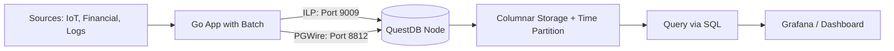
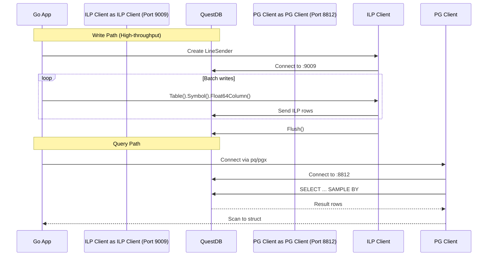

# Module 19: pkg/questdb

## สำหรับโฟลเดอร์ `pkg/questdb/`

ไฟล์ที่เกี่ยวข้อง:
- `client.go` - การเชื่อมต่อกับ QuestDB (ILP and PostgreSQL interfaces)
- `writer.go` - การเขียนข้อมูลแบบ high-throughput ด้วย ILP client
- `query.go` - การ query ด้วย SQL และ time-series extensions
- `schema.go` - การสร้างตารางพร้อม designated timestamp และ partition
- `config.go` - การตั้งค่า connection และ batch optimization


## หลักการ (Concept)

### QuestDB คืออะไร?
QuestDB คือ open-source time-series database ที่ถูกออกแบบมาเพื่อ high-throughput ingestion และ low-latency analytical queries โดยเฉพาะ โดยมีสถาปัตยกรรม column-oriented, time-partitioned storage engine พร้อม memory-mapped files และ vectorized (SIMD) execution[reference:0]พัฒนาโดยตรงใน Java (zero-GC), C++ และ Rust (ส่วนของ Enterprise) ทำให้สามารถรองรับการเขียนข้อมูลได้มากกว่า 4 ล้านแถวต่อวินาทีต่อโหนด[reference:1]และ query แบบเวลามีประสิทธิภาพระดับมิลลิวินาที

QuestDB ถูกสร้างขึ้นมาเฉพาะสำหรับงาน time-series โดยเฉพาะตั้งแต่ต้น (purpose-built) ตั้งแต่ปี 2014 และเปิดซอร์สในปี 2019[reference:2]ต่างจาก TimescaleDB ที่เป็นส่วนขยายของ PostgreSQL หรือ InfluxDB ที่ถูกออกแบบมาเพื่อ metrics โดยเฉพาะ QuestDB เน้น performance และ simplicity ผ่าน SQL extensions[reference:3]

### มีกี่แบบ? (Formats / Deployment)

**รูปแบบการติดตั้ง:**
1. **QuestDB Open Source (OSS)** - ฟรี, standalone deployment
2. **QuestDB Enterprise** - เพิ่ม High Availability, advanced security, RBAC, automated backups, multi-tier storage และ seamless object storage integration[reference:4]
3. **QuestDB Cloud** - บริการ fully-managed (ยังอยู่ใน development/preview)

**รูปแบบการเชื่อมต่อ (Interfaces):**
QuestDB รองรับหลาย interface สำหรับ ingestion และ query[reference:5]:

| Interface | Port | ใช้สำหรับ |
|-----------|------|----------|
| **ILP (InfluxDB Line Protocol)** | 9009 | การเขียนข้อมูลความเร็วสูง (recommended) |
| **HTTP REST API** | 9000 | การ query และการเขียนข้อมูลแบบง่าย |
| **PostgreSQL Wire Protocol (PGWire)** | 8812 | Query ข้อมูลด้วย SQL (ใช้ร่วมกับ PostgreSQL clients) |
| **Web Console** | 9000 | UI สำหรับ query และ visualization |

**รูปแบบข้อมูลและ SQL extensions:**
QuestDB implements ANSI SQL ที่ถูก extended สำหรับ time-series analytics[reference:6][reference:7]:

- **SAMPLE BY** - time-based aggregation (คล้าย GROUP BY แต่ตามช่วงเวลา)[reference:8]
- **LATEST ON** - หาค่า entry ล่าสุดตาม timestamp สำหรับแต่ละ key[reference:9]
- **ASOF JOIN / WINDOW JOIN** - การ join ข้อมูล time-series ระหว่างกัน[reference:10]
- **Timestamp Search Notation** - syntax ย่อสำหรับค้นหาช่วงเวลา[reference:11]
- **TICK Interval Syntax** - สร้าง interval scans หลายครั้งจาก expression เดียว[reference:12]

**ข้อมูลประเภทพิเศษ:**
- **SYMBOL** - ประเภทสำหรับ categorical data (string ที่มีค่าซ้ำกันบ่อย) ใช้ dictionary encoding เพิ่ม performance[reference:13]
- **TIMESTAMP** - แบบ microsecond precision (default)[reference:14]
- **TIMESTAMP_NS** - แบบ nanosecond precision (รองรับตั้งแต่เวอร์ชัน 9.1.0)[reference:15]
- **UUID, IPv4, ARRAY, BINARY** - ประเภทข้อมูลพิเศษอื่นๆ[reference:16]

### ใช้อย่างไร / นำไปใช้กรณีไหน

**กรณีใช้งานที่เหมาะสมที่สุด:**

1. **Financial market data** - tick data, order books, OHLC aggregation ต้องการ latency ต่ำ[reference:17]
2. **IoT sensor data** - อุปกรณ์นับล้านเครื่อง ส่งข้อมูลความถี่สูง[reference:18]
3. **Real-time monitoring & observability** - metrics, logs, traces[reference:19]
4. **Ad-tech / user behavior analytics** - event streams, clickstream[reference:20]
5. **Feature store สำหรับ AI/ML** - time-indexed training data[reference:21]
6. **Real-time dashboards** - ร่วมกับ Grafana[reference:22]

**รูปแบบการเขียนข้อมูล (Line Protocol syntax):**
```
table_name,tag1=val1,tag2=val2 field1=value1,field2=value2 timestamp
```

**รูปแบบการ query ขั้นพื้นฐาน:**
```sql
-- Basic query with time filter and aggregation
SELECT timestamp, symbol, avg(price) 
FROM trades 
WHERE timestamp IN today() 
SAMPLE BY 1h;

-- Get latest price for each symbol
SELECT * FROM trades 
WHERE timestamp IN today() 
LATEST ON timestamp PARTITION BY symbol;
```

### ประโยชน์ที่ได้รับ

- **Ingestion throughput สูงมาก** - เร็วกว่า InfluxDB 3-10 เท่า[reference:23] และเร็วกว่า TimescaleDB 6.5-16 เท่า[reference:24]
- **Query latency ต่ำ** - performance ดีกว่า TimescaleDB ประมาณ 270%[reference:25]
- **SQL standard** - ไม่ต้องเรียนรู้ query ภาษาใหม่ (Flux, InfluxQL)
- **Zero-GC Java core** - latency ที่คาดเดาได้, ไม่มี GC pause[reference:26]
- **Parquet support** - รองรับการอ่าน/เขียน Parquet ไฟล์โดยตรง ทำให้ข้อมูล portable และ AI-ready[reference:27]
- **Partition pruning** - ตัด partition ที่อยู่นอกช่วงเวลาที่ต้องการโดยอัตโนมัติ[reference:28]
- **Automatic schema management** - Go client สร้าง table และปรับ schema อัตโนมัติ[reference:29]

### ข้อควรระวัง

- **Out-of-order data** - การ insert timestamp ที่ไม่เรียงลำดับกับข้อมูลที่มีอยู่จะมี overhead เพราะ QuestDB ต้องเรียงข้อมูลใหม่เพื่อรักษา physical order[reference:30]
- **Designated timestamp ต้องมี** - การใช้ตารางโดยไม่มี designated timestamp จะสูญเสีย performance และ time-series features[reference:31]
- **SYMBOL cardinality** - SYMBOL type ใช้ dictionary encoding ควรใช้กับค่า unique ไม่เกิน 10-50 ล้านค่า ถ้ามากกว่านั้นควรใช้ VARCHAR[reference:32]
- **Partition ขนาด** - แต่ละ partition ควรมีขนาดไม่กี่ร้อย MB ถึงไม่กี่ GB[reference:33]
- **ไม่รองรับการ JOIN ตารางขนาดใหญ่ข้าม partition** - JOIN ที่ซับซ้อนอาจต้องใช้เทคนิคอื่น
- **ไม่มี foreign key constraints** - เช่นเดียวกับ time-series databases ทั่วไป

### ข้อดี

- **Performance ดีที่สุดในกลุ่ม** ใน benchmark ส่วนใหญ่เมื่อเทียบกับ TimescaleDB, InfluxDB, ClickHouse[reference:34]
- **SQL ที่ใช้ง่าย** - ไม่ต้องเรียน query ภาษาใหม่
- **Go client มีประสิทธิภาพสูง** - ออกแบบมาเฉพาะสำหรับ insert-only operations[reference:35]
- **Built-in time-series SQL extensions** - SAMPLE BY, LATEST ON ใช้งานง่ายและมีประสิทธิภาพ
- **รองรับทั้ง high-throughput writes และ analytical queries ในตัวเดียว**
- **Parquet integration** - สามารถ export/import ข้อมูลระหว่างระบบต่างๆ ได้ง่าย

### ข้อเสีย

- **ไม่มี advanced data retention policies** แบบ InfluxDB (มีแค่ TTL และ partition drop)[reference:36]
- **Materialized views** เป็น feature ใหม่ (GA since 8.3.1)[reference:37] - อาจยังไม่ mature เท่า ClickHouse/TimescaleDB
- **Community ecosystem** - แม้จะโตเร็ว แต่ยังเล็กกว่า InfluxDB และ PostgreSQL
- **Enterprise features** - replication, HA, backup เป็น commercial feature
- **ไม่มี visual query builder หรือ advanced BI tool integration ในตัว**

### ข้อห้าม

**ห้ามใช้ QuestDB เป็น primary database สำหรับข้อมูลที่ไม่ใช่ time-series** เช่น master data (users, products, inventory) หรือข้อมูลที่มีการ update/delete บ่อยโดยไม่มีการระบุช่วงเวลาใน condition เพราะ QuestDB ออกแบบมาเป็น append-optimized time-series database การใช้ผิดวัตถุประสงค์จะทำให้ performance ต่ำและ maintenance ยาก


## การออกแบบ Workflow และ Dataflow



**Dataflow ใน Go application:**




## ตัวอย่างโค้ดที่รันได้จริง

### โครงสร้างโปรเจกต์
```
pkg/questdb/
├── client.go
├── writer.go
├── query.go
├── schema.go
├── config.go
└── example_main.go
```

### 1. การติดตั้ง QuestDB ด้วย Docker

```yaml
# docker-compose.yml
version: '3.8'
services:
  questdb:
    image: questdb/questdb:latest
    container_name: questdb
    ports:
      - "8812:8812"   # PostgreSQL wire protocol (query)
      - "9000:9000"   # Web console & REST API
      - "9009:9009"   # ILP (Ingestion)
    environment:
      - QDB_PG_READONLY_USER_ENABLED=true
      - QDB_ILP_DISABLED=false
    volumes:
      - questdb_data:/var/lib/questdb
    restart: unless-stopped

volumes:
  questdb_data:
```

รันด้วย:
```bash
docker compose up -d
```

เข้าใช้งาน Web Console ที่: http://localhost:9000

### 2. ติดตั้ง Go client

```bash
# ILP Client สำหรับ high-throughput writes (v4)
go get github.com/questdb/go-questdb-client/v4

# PostgreSQL driver สำหรับ queries
go get github.com/lib/pq
# หรือใช้ pgx สำหรับ performance ที่สูงกว่า
go get github.com/jackc/pgx/v5
```

### 3. ตัวอย่างโค้ด: Config และ Client

```go
// config.go
package questdb

import "time"

type Config struct {
    // ILP configuration (writes)
    ILPHost     string
    ILPPort     int
    ILPUsername string
    ILPPassword string
    ILPUseTLS   bool
    
    // PGWire configuration (queries)
    PGHost     string
    PGPort     int
    PGDatabase string
    PGUser     string
    PGPassword string
    PGSSLMode  string
    
    // Batch settings
    BatchSize     int           // number of rows per batch
    FlushInterval time.Duration // auto-flush interval
    RetryAttempts int
}

func DefaultConfig() Config {
    return Config{
        ILPHost:       "localhost",
        ILPPort:       9009,
        ILPUsername:   "admin",
        ILPPassword:   "quest",
        ILPUseTLS:     false,
        PGHost:        "localhost",
        PGPort:        8812,
        PGDatabase:    "qdb",
        PGUser:        "admin",
        PGPassword:    "quest",
        PGSSLMode:     "disable",
        BatchSize:     10000,
        FlushInterval: 1 * time.Second,
        RetryAttempts: 3,
    }
}
```

```go
// client.go
package questdb

import (
    "context"
    "database/sql"
    "fmt"
    
    "github.com/jackc/pgx/v5"
    "github.com/jackc/pgx/v5/stdlib"
    questdb "github.com/questdb/go-questdb-client/v4"
)

type QuestDBClient struct {
    ilpSender   *questdb.LineSender
    pgDB        *sql.DB
    pgConn      *pgx.Conn
    config      Config
}

func NewQuestDBClient(cfg Config) (*QuestDBClient, error) {
    client := &QuestDBClient{config: cfg}
    
    // Initialize ILP client for writes
    if err := client.initILPClient(); err != nil {
        return nil, fmt.Errorf("failed to init ILP client: %w", err)
    }
    
    // Initialize PG client for queries
    if err := client.initPGClient(); err != nil {
        return nil, fmt.Errorf("failed to init PG client: %w", err)
    }
    
    return client, nil
}

func (c *QuestDBClient) initILPClient() error {
    ctx := context.Background()
    
    // Build connection string
    scheme := "http"
    if c.config.ILPUseTLS {
        scheme = "https"
    }
    connStr := fmt.Sprintf("%s::addr=%s:%d;username=%s;password=%s;",
        scheme, c.config.ILPHost, c.config.ILPPort, 
        c.config.ILPUsername, c.config.ILPPassword)
    
    sender, err := questdb.LineSenderFromConf(ctx, connStr)
    if err != nil {
        return err
    }
    c.ilpSender = &sender
    return nil
}

func (c *QuestDBClient) initPGClient() error {
    connStr := fmt.Sprintf(
        "host=%s port=%d dbname=%s user=%s password=%s sslmode=%s",
        c.config.PGHost, c.config.PGPort, c.config.PGDatabase,
        c.config.PGUser, c.config.PGPassword, c.config.PGSSLMode,
    )
    
    conn, err := pgx.Connect(context.Background(), connStr)
    if err != nil {
        return err
    }
    c.pgConn = conn
    c.pgDB = stdlib.OpenDB(*conn.Config().Copy())
    return nil
}

func (c *QuestDBClient) Close() error {
    if c.ilpSender != nil {
        if err := (*c.ilpSender).Close(context.Background()); err != nil {
            return err
        }
    }
    if c.pgDB != nil {
        return c.pgDB.Close()
    }
    return nil
}

// GetPGDB returns the database/sql connection for queries
func (c *QuestDBClient) GetPGDB() *sql.DB {
    return c.pgDB
}
```

### 4. ตัวอย่างโค้ด: การเขียนข้อมูล (Writer)

```go
// writer.go
package questdb

import (
    "context"
    "fmt"
    "time"
    
    questdb "github.com/questdb/go-questdb-client/v4"
)

type Metric struct {
    Timestamp  time.Time
    DeviceID   string
    SensorType string
    Value      float64
    Tags       map[string]string
}

// WriteMetric เขียน metric 1 record
func (c *QuestDBClient) WriteMetric(ctx context.Context, table string, m Metric) error {
    sender := *c.ilpSender
    
    // Start building the row
    row := sender.Table(table)
    
    // Add symbol columns (tags) - for categorical/filtered data
    row.Symbol("device_id", m.DeviceID)
    row.Symbol("sensor_type", m.SensorType)
    
    // Add custom tags
    for k, v := range m.Tags {
        row.Symbol(k, v)
    }
    
    // Add field columns (values)
    row.Float64Column("value", m.Value)
    
    // Set timestamp
    if err := row.At(ctx, m.Timestamp); err != nil {
        return err
    }
    
    // Flush to ensure data is sent
    return sender.Flush(ctx)
}

// WriteBatch เขียนข้อมูลหลาย record แบบ batch
func (c *QuestDBClient) WriteBatch(ctx context.Context, table string, metrics []Metric) error {
    if len(metrics) == 0 {
        return nil
    }
    
    sender := *c.ilpSender
    
    for _, m := range metrics {
        row := sender.Table(table).
            Symbol("device_id", m.DeviceID).
            Symbol("sensor_type", m.SensorType).
            Float64Column("value", m.Value)
        
        for k, v := range m.Tags {
            row.Symbol(k, v)
        }
        
        if err := row.At(ctx, m.Timestamp); err != nil {
            return fmt.Errorf("failed to add row at batch index: %w", err)
        }
    }
    
    return sender.Flush(ctx)
}

// WriteBatchOptimized เขียน batch แบบ optimized (ใช้ buffer pooling)
func (c *QuestDBClient) WriteBatchOptimized(ctx context.Context, table string, metrics []Metric) error {
    if len(metrics) == 0 {
        return nil
    }
    
    // Group by batch size to avoid too large single flush
    batchSize := c.config.BatchSize
    for i := 0; i < len(metrics); i += batchSize {
        end := i + batchSize
        if end > len(metrics) {
            end = len(metrics)
        }
        
        batch := metrics[i:end]
        if err := c.WriteBatch(ctx, table, batch); err != nil {
            return fmt.Errorf("batch %d-%d failed: %w", i, end, err)
        }
    }
    return nil
}
```

### 5. ตัวอย่างโค้ด: การสร้าง Schema และ Query

```go
// schema.go
package questdb

import (
    "context"
    "fmt"
)

// CreateTimeSeriesTable สร้างตาราง time-series พร้อม designated timestamp
func (c *QuestDBClient) CreateTimeSeriesTable(ctx context.Context, tableName string) error {
    sql := fmt.Sprintf(`
        CREATE TABLE IF NOT EXISTS %s (
            timestamp TIMESTAMP,
            device_id SYMBOL,
            sensor_type SYMBOL,
            value DOUBLE,
            metadata VARCHAR
        ) TIMESTAMP(timestamp)
        PARTITION BY DAY;
    `, tableName)
    
    _, err := c.pgDB.ExecContext(ctx, sql)
    return err
}

// CreateTableWithCustomPartition สร้างตารางพร้อม partition strategy ที่กำหนดเอง
func (c *QuestDBClient) CreateTableWithCustomPartition(ctx context.Context, tableName, partitionBy string) error {
    // partitionBy สามารถเป็น: HOUR, DAY, MONTH, YEAR
    sql := fmt.Sprintf(`
        CREATE TABLE IF NOT EXISTS %s (
            timestamp TIMESTAMP,
            symbol SYMBOL,
            side SYMBOL,
            price DOUBLE,
            quantity DOUBLE,
            exchange SYMBOL
        ) TIMESTAMP(timestamp)
        PARTITION BY %s;
    `, tableName, partitionBy)
    
    _, err := c.pgDB.ExecContext(ctx, sql)
    return err
}
```

```go
// query.go
package questdb

import (
    "context"
    "time"
)

type AggregatedResult struct {
    Bucket   time.Time
    DeviceID string
    AvgValue float64
    MaxValue float64
    MinValue float64
    Count    int64
}

// GetHourlyAverage ดึงค่าเฉลี่ยรายชั่วโมงด้วย SAMPLE BY
func (c *QuestDBClient) GetHourlyAverage(ctx context.Context, deviceID string, startTime, endTime time.Time) ([]AggregatedResult, error) {
    sql := `
        SELECT 
            timestamp,
            device_id,
            avg(value) AS avg_value,
            max(value) AS max_value,
            min(value) AS min_value,
            count(*) AS count
        FROM metrics
        WHERE device_id = $1 
            AND timestamp >= $2 
            AND timestamp < $3
        SAMPLE BY 1h
    `
    
    rows, err := c.pgDB.QueryContext(ctx, sql, deviceID, startTime, endTime)
    if err != nil {
        return nil, err
    }
    defer rows.Close()
    
    var results []AggregatedResult
    for rows.Next() {
        var r AggregatedResult
        if err := rows.Scan(&r.Bucket, &r.DeviceID, &r.AvgValue, &r.MaxValue, &r.MinValue, &r.Count); err != nil {
            return nil, err
        }
        results = append(results, r)
    }
    return results, nil
}

// GetLatestValues ดึงค่าล่าสุดของแต่ละ device ด้วย LATEST ON
func (c *QuestDBClient) GetLatestValues(ctx context.Context, tableName string) (map[string]float64, error) {
    sql := fmt.Sprintf(`
        SELECT device_id, value 
        FROM %s
        LATEST ON timestamp PARTITION BY device_id
    `, tableName)
    
    rows, err := c.pgDB.QueryContext(ctx, sql)
    if err != nil {
        return nil, err
    }
    defer rows.Close()
    
    results := make(map[string]float64)
    for rows.Next() {
        var deviceID string
        var value float64
        if err := rows.Scan(&deviceID, &value); err != nil {
            return nil, err
        }
        results[deviceID] = value
    }
    return results, nil
}

// GetTimeBucketedStats ดึง statistics แบบ time-bucketed สำหรับ dashboard
func (c *QuestDBClient) GetTimeBucketedStats(ctx context.Context, bucketInterval string, startTime, endTime time.Time) ([]AggregatedResult, error) {
    // bucketInterval เช่น '1h', '5m', '1d'
    sql := `
        SELECT 
            timestamp,
            device_id,
            avg(value) AS avg_value,
            max(value) AS max_value,
            min(value) AS min_value,
            count(*) AS count
        FROM metrics
        WHERE timestamp >= $1 AND timestamp < $2
        SAMPLE BY $3
        FILL(NULL)
    `
    
    rows, err := c.pgDB.QueryContext(ctx, sql, startTime, endTime, bucketInterval)
    if err != nil {
        return nil, err
    }
    defer rows.Close()
    
    var results []AggregatedResult
    for rows.Next() {
        var r AggregatedResult
        if err := rows.Scan(&r.Bucket, &r.DeviceID, &r.AvgValue, &r.MaxValue, &r.MinValue, &r.Count); err != nil {
            return nil, err
        }
        results = append(results, r)
    }
    return results, nil
}
```

### 6. ตัวอย่างการสร้าง Materialized View

```go
// materialized.go
package questdb

import (
    "context"
    "fmt"
)

// CreateHourlyMaterializedView สร้าง materialized view สำหรับ pre-aggregate รายชั่วโมง
func (c *QuestDBClient) CreateHourlyMaterializedView(ctx context.Context, sourceTable, viewName string) error {
    sql := fmt.Sprintf(`
        CREATE MATERIALIZED VIEW IF NOT EXISTS %s
        AS
        SELECT 
            timestamp,
            device_id,
            sensor_type,
            avg(value) AS avg_value,
            max(value) AS max_value,
            min(value) AS min_value,
            count(*) AS count
        FROM %s
        SAMPLE BY 1h
    `, viewName, sourceTable)
    
    _, err := c.pgDB.ExecContext(ctx, sql)
    return err
}

// RefreshMaterializedView รีเฟรช materialized view
func (c *QuestDBClient) RefreshMaterializedView(ctx context.Context, viewName string) error {
    sql := fmt.Sprintf("REFRESH MATERIALIZED VIEW %s", viewName)
    _, err := c.pgDB.ExecContext(ctx, sql)
    return err
}
```

### 7. ตัวอย่างการใช้งานรวมใน HTTP server

```go
// main.go
package main

import (
    "context"
    "encoding/json"
    "log"
    "net/http"
    "time"
    
    "yourproject/pkg/questdb"
)

var qdb *questdb.QuestDBClient

func main() {
    cfg := questdb.DefaultConfig()
    var err error
    qdb, err = questdb.NewQuestDBClient(cfg)
    if err != nil {
        log.Fatal(err)
    }
    defer qdb.Close()
    
    ctx := context.Background()
    // Create table if not exists
    if err := qdb.CreateTimeSeriesTable(ctx, "metrics"); err != nil {
        log.Printf("Warning: %v", err)
    }
    
    http.HandleFunc("/metrics", postMetrics)
    http.HandleFunc("/query/hourly", queryHourly)
    http.HandleFunc("/query/latest", queryLatest)
    
    log.Println("Server starting on :8080")
    log.Fatal(http.ListenAndServe(":8080", nil))
}

func postMetrics(w http.ResponseWriter, r *http.Request) {
    var req struct {
        DeviceID   string            `json:"device_id"`
        SensorType string            `json:"sensor_type"`
        Value      float64           `json:"value"`
        Tags       map[string]string `json:"tags"`
    }
    if err := json.NewDecoder(r.Body).Decode(&req); err != nil {
        http.Error(w, err.Error(), 400)
        return
    }
    
    m := questdb.Metric{
        Timestamp:  time.Now(),
        DeviceID:   req.DeviceID,
        SensorType: req.SensorType,
        Value:      req.Value,
        Tags:       req.Tags,
    }
    
    if err := qdb.WriteMetric(r.Context(), "metrics", m); err != nil {
        http.Error(w, err.Error(), 500)
        return
    }
    w.WriteHeader(http.StatusOK)
}

func queryHourly(w http.ResponseWriter, r *http.Request) {
    deviceID := r.URL.Query().Get("device_id")
    if deviceID == "" {
        http.Error(w, "missing device_id", 400)
        return
    }
    
    end := time.Now()
    start := end.Add(-24 * time.Hour)
    
    results, err := qdb.GetHourlyAverage(r.Context(), deviceID, start, end)
    if err != nil {
        http.Error(w, err.Error(), 500)
        return
    }
    json.NewEncoder(w).Encode(results)
}

func queryLatest(w http.ResponseWriter, r *http.Request) {
    results, err := qdb.GetLatestValues(r.Context(), "metrics")
    if err != nil {
        http.Error(w, err.Error(), 500)
        return
    }
    json.NewEncoder(w).Encode(results)
}
```


## วิธีใช้งาน module นี้

1. **ติดตั้ง QuestDB** (ใช้ Docker ตามตัวอย่างด้านบน)
2. **เข้า Web Console** ที่ http://localhost:9000 เพื่อตรวจสอบการทำงาน
3. **ติดตั้ง Go client**:
   ```bash
   go get github.com/questdb/go-questdb-client/v4
   go get github.com/jackc/pgx/v5
   ```
4. **คัดลอกโค้ด** ไฟล์ `client.go`, `writer.go`, `query.go`, `schema.go`, `config.go` ไปไว้ใน `pkg/questdb/`
5. **ปรับ configuration** ตาม environment ของคุณ
6. **เรียกใช้งาน** ตามตัวอย่างใน `main.go`

**หมายเหตุสำคัญ:**
- สำหรับ **การเขียนข้อมูล** (high-throughput) ให้ใช้ ILP client ผ่าน port 9009
- สำหรับ **การ query** ให้ใช้ PostgreSQL wire protocol ผ่าน port 8812 (หรือใช้ HTTP REST API ที่ port 9000)
- Go client ของ QuestDB รองรับ Go 1.19 หรือสูงกว่า[reference:38]


## ตารางสรุป QuestDB Components

| Component | คำอธิบาย | ตัวอย่าง |
|-----------|----------|----------|
| **Designated Timestamp** | คอลัมน์เวลาที่ใช้เป็น time axis, กำหนด physical storage order | `TIMESTAMP(timestamp)`[reference:39] |
| **PARTITION BY** | แบ่งข้อมูลเป็นส่วนๆ ตามช่วงเวลา (HOUR/DAY/MONTH/YEAR) | `PARTITION BY DAY`[reference:40] |
| **SYMBOL Type** | Optimized type สำหรับ categorical string (dictionary encoded) | `symbol SYMBOL`[reference:41] |
| **SAMPLE BY** | SQL extension สำหรับ time-based aggregation | `SAMPLE BY 1h`[reference:42] |
| **LATEST ON** | หาค่า entry ล่าสุดตาม timestamp สำหรับแต่ละ partition key | `LATEST ON timestamp PARTITION BY symbol`[reference:43] |
| **ILP (InfluxDB Line Protocol)** | Protocol สำหรับ high-throughput ingestion | port 9009[reference:44] |
| **PGWire (PostgreSQL Wire)** | Protocol สำหรับ query ด้วย PostgreSQL-compatible clients | port 8812[reference:45] |
| **Materialized View** | Pre-aggregated view (GA since 8.3.1) | `CREATE MATERIALIZED VIEW ...`[reference:46] |
| **TICK Syntax** | สร้าง interval scans หลายครั้งจาก expression เดียว | `ts IN '2024-01-01T09:30@NY#workday;6h30m'`[reference:47] |
| **ASOF JOIN** | Time-series join ที่ match กับ timestamp ล่าสุดที่ <= อีกฝั่ง | `SELECT * FROM trades ASOF JOIN quotes`[reference:48] |


## แบบฝึกหัดท้าย module (3 ข้อ)

### ข้อ 1: การออกแบบ Schema สำหรับ High-Cardinality IoT Data

บริษัทมีเซ็นเซอร์ 500,000 เครื่อง ส่งข้อมูล temperature, humidity, pressure ทุก 1 วินาที โดยมี metadata ของเซ็นเซอร์ (location, firmware_version, model) ที่มีการเปลี่ยนแปลงบ้าง

**คำถาม:**
- จงออกแบบ QuestDB table schema สำหรับข้อมูลนี้ (กำหนด designated timestamp, partition strategy, และการใช้ SYMBOL vs VARCHAR)
- อธิบายเหตุผลในการเลือก partition interval (ควรเลือก HOUR, DAY หรือ MONTH?)
- เขียน Go function `CreateSensorTable()` ที่สร้างตารางตามที่ออกแบบ

### ข้อ 2: การ Implement Real-time Dashboard Query

จากตาราง `sensor_metrics` ที่มี schema: `timestamp TIMESTAMP, device_id SYMBOL, metric_type SYMBOL, value DOUBLE`

จงเขียนฟังก์ชัน `GetDashboardData(ctx, deviceID string, lookbackDuration time.Duration)` ที่:
- ใช้ `SAMPLE BY` เพื่อหาค่าเฉลี่ยของ temperature ราย 5 นาที ในช่วง lookbackDuration
- ใช้ `LATEST ON` เพื่อหาค่า temperature, humidity, pressure ล่าสุดของ device นั้น
- ใช้ timestamp search notation ในการกรองเวลา (แทนการเปรียบเทียบด้วย `>=` และ `<`)
- คืนค่า struct `DashboardData` ที่มีทั้ง time-series data และ latest values

### ข้อ 3: Performance Optimization with Materialized Views

ระบบมีข้อมูล raw metrics 1 billion rows ต่อวัน แต่ query ส่วนใหญ่ต้องการค่าเฉลี่ยราย 5 นาทีของ 24 ชั่วโมงล่าสุด และค่าเฉลี่ยรายชั่วโมงของ 30 วันที่ผ่านมา

**คำถาม:**
- จงออกแบบ materialized views ที่เหมาะสม (กำหนด refresh interval)
- เปรียบเทียบ performance ระหว่าง query จาก raw table โดยตรง vs จาก materialized view (ประเมินปริมาณข้อมูลที่ต้องอ่าน)
- เขียน Go function `CreateOptimizedViews()` ที่สร้าง materialized view สำหรับทั้ง 5-minute และ 1-hour aggregations
- เขียน query ที่ใช้ materialized view สำหรับ dashboard ที่ต้องการข้อมูล 5-minute averages


## แหล่งอ้างอิง

- [QuestDB Official Documentation](https://questdb.com/docs/)
- [Go Client Documentation](https://questdb.com/docs/ingestion/clients/go/)[reference:49]
- [Schema Design Essentials](https://questdb.com/docs/schema-design-essentials/)[reference:50]
- [Designated Timestamp Guide](https://questdb.com/docs/concepts/designated-timestamp/)[reference:51]
- [QuestDB vs InfluxDB vs TimescaleDB Comparison](https://questdb.com/blog/comparing-influxdb-timescaledb-questdb-time-series-databases/)[reference:52]
- [SQL Extensions Documentation](https://questdb.com/docs/concepts/deep-dive/sql-extensions/)[reference:53]
- [QuestDB Grafana Integration](https://questdb.com/blog/time-series-monitoring-dashboard-grafana-questdb/)[reference:54]
- [QuestDB GitHub Repository](https://github.com/questdb/questdb)


**หมายเหตุ:** module นี้ครบถ้วนสำหรับ `pkg/questdb` สำหรับระบบ gobackend หากต้องการ module เพิ่มเติม (เช่น `pkg/prometheus`, `pkg/victoriametrics`) โปรดแจ้ง