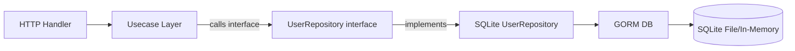

# Module 21: pkg/sqlite (SQLite Database Client & Repository)

## สำหรับโฟลเดอร์ `internal/pkg/sqlite/` และ `internal/repository/`

ไฟล์ที่เกี่ยวข้อง:
- `internal/pkg/sqlite/client.go`
- `internal/pkg/sqlite/repository.go`
- `internal/pkg/sqlite/transaction.go`
- `internal/repository/sqlite_user_repo.go`
- `migrations/sqlite/` (สำหรับ migration files เฉพาะ SQLite)

---

## หลักการ (Concept)

### SQLite คืออะไร?

SQLite เป็นระบบจัดการฐานข้อมูลเชิงสัมพันธ์ (RDBMS) แบบ embedded ที่ไม่ต้องใช้ server แยกต่างหาก ตัวฐานข้อมูลถูกเก็บเป็นไฟล์เดียว (.db หรือ .sqlite) บนเครื่อง client มีขนาดเล็ก (น้อยกว่า 1MB) และไม่ต้องติดตั้งหรือ configuration ที่ซับซ้อน เหมาะสำหรับการพัฒนา การทดสอบ (testing) และแอปพลิเคชัน desktop/mobile หรือระบบที่มีการเข้าถึงพร้อมกันน้อย

### มีกี่แบบ? (SQLite Use Cases)

| Use Case | ลักษณะ | เหมาะกับ |
|----------|--------|----------|
| **Unit/Integration testing** | ใช้เป็น temporary database ใน CI | ทดสอบ repository layer โดยไม่ต้องใช้ PostgreSQL จริง |
| **Development environment** | ใช้แทน PostgreSQL สำหรับ dev (quick start) | Developer ที่ไม่ต้องการติดตั้ง Docker |
| **Edge/IoT devices** | ฐานข้อมูลบนอุปกรณ์ที่มีทรัพยากรจำกัด | เก็บบันทึกเซนเซอร์, configuration |
| **Desktop applications** | เก็บข้อมูล local ของแอปพลิเคชัน | Go GUI applications, CLI tools |
| **Read‑only replicas** | สำหรับ analytics หรือ reporting | ระบบที่อ่านอย่างเดียว ไม่ต้องเขียนพร้อมกัน |

**ข้อห้ามสำคัญ:** ห้ามใช้ SQLite สำหรับ production systems ที่มีการเขียนพร้อมกันสูง (concurrent writes) เพราะ SQLite lock ทั้ง database ขณะเขียน[reference:1]

### ใช้อย่างไร / นำไปใช้กรณีไหน

1. **Testing** – ใช้ `:memory:` สำหรับ unit test ที่ไม่ต้องการ disk I/O
2. **Development** – ใช้ SQLite แทน PostgreSQL เพื่อลด dependency (air, docker)
3. **Edge computing** – เก็บข้อมูลเซนเซอร์บนอุปกรณ์ IoT ก่อนส่งไป cloud
4. **Read‑only caching** – ใช้เป็น local cache สำหรับข้อมูลอ้างอิง
5. **Prototyping** – สร้าง prototype เร็วๆ โดยไม่ต้องตั้งค่า database server

### ประโยชน์ที่ได้รับ

- **Zero configuration** – ไม่ต้องติดตั้ง server, ไม่ต้องสร้าง user, ไม่ต้องกำหนด port
- **Portable** – ฐานข้อมูลเป็นไฟล์เดียว (copy/move ได้)
- **Lightweight** – ขนาดไลบรารีน้อย, ใช้หน่วยความจำน้อย
- **Fast read** – การอ่านข้อมูลเร็วมาก เหมาะกับ read-heavy workloads
- **Transaction support** – รองรับ ACID transactions (ด้วย Rollback journal หรือ WAL)
- **GORM support** – GORM มี driver สำหรับ SQLite โดยเฉพาะ (`gorm.io/driver/sqlite`)
- **In‑memory mode** – รองรับฐานข้อมูลใน RAM (`:memory:`) สำหรับ testing

### ข้อควรระวัง

- **Concurrent writes** – มี database‑level lock, การเขียนพร้อมกันหลาย process/goroutine ช้า
- **No user management** – ไม่มีระบบ user/password, authentication
- **Limited ALTER TABLE** – การเปลี่ยนแปลง schema ทำได้จำกัด (ต้อง recreate table)
- **No network access** – เป็น embedded, remote access ไม่มี (ไม่เหมาะกับ microservices)
- **Data type affinity** – SQLite มี type affinity ไม่ใช่ strict typing เหมือน PostgreSQL
- **Foreign key constraints** – ต้องเปิดใช้งานด้วย `PRAGMA foreign_keys = ON;`
- **WAL mode** – สำหรับ production ควรเปิด Write-Ahead Logging เพื่อ improve concurrency

### ข้อดี
- Zero‑config, portable, lightweight, fast reads, ในตัว Go (cgo หรือ pure Go)

### ข้อเสีย
- Concurrent writes ช้า, ไม่มี network access, limited ALTER TABLE, ไม่เหมาะกับ high traffic

### ข้อห้าม
- ห้ามใช้ SQLite เป็น primary database สำหรับ web application ที่มีผู้ใช้พร้อมกันมาก (> 10 writes/sec)
- ห้ามใช้ SQLite ใน production บน network drive (NFS) เพราะ file locking ปัญหา
- ห้ามใช้ `:memory:` database สำหรับข้อมูลสำคัญ (ข้อมูลหายเมื่อปิด connection)
- ห้ามใช้ SQLite บน Windows กับ AVG/Avira (มีปัญหา file locking)
- ห้ามใช้ `PRAGMA journal_mode=DELETE` บน SSD (ควรใช้ WAL)

---

## การออกแบบ Workflow และ Dataflow

### Workflow: การเชื่อมต่อ SQLite ผ่าน GORM

```mermaid
flowchart TB
    Start[Start Application] --> LoadConfig[Load DB Config: path or :memory:]
    LoadConfig --> BuildDSN[Build DSN: file:test.db?cache=shared&mode=rwc]
    BuildDSN --> GormOpen[gorm.Open with sqlite.Open]
    GormOpen --> SetPool[SetMaxOpenConns (usually 1 for write, >1 for read-only)]
    SetPool --> Ping[Ping database]
    Ping -->|success| StoreDB[Store *gorm.DB in DI container]
    Ping -->|failed| Retry{Retry?}
    Retry -->|yes| Wait[Wait 100ms] --> BuildDSN
    Retry -->|no| Exit[Exit with fatal error]
    StoreDB --> Ready[Application ready]
```

**รูปที่ 29:** ขั้นตอนการสร้าง connection ไปยัง SQLite (ไฟล์หรือ in‑memory) ผ่าน GORM

### Workflow: Repository Pattern สำหรับ SQLite



**รูปที่ 30:** การทำงานของ Repository Pattern ที่แยก interface ออกจาก implementation สำหรับ SQLite

---

## ตัวอย่างโค้ดที่รันได้จริง

### 1. SQLite Client – `client.go`

```go
// Package sqlite provides SQLite database client and utilities using GORM.
// Supports both file-based and in-memory databases.
// ----------------------------------------------------------------
// แพ็คเกจ sqlite ให้บริการ SQLite database client และ utilities ด้วย GORM
// รองรับทั้งฐานข้อมูลแบบไฟล์และ in-memory
package sqlite

import (
	"context"
	"fmt"
	"log"
	"time"

	"gorm.io/driver/sqlite"
	"gorm.io/gorm"
	gormlogger "gorm.io/gorm/logger"
)

// Config holds SQLite connection settings.
// ----------------------------------------------------------------
// Config เก็บค่ากำหนดการเชื่อมต่อ SQLite
type Config struct {
	// Path to database file, or ":memory:" for in-memory database
	// Path ไปยังไฟล์ฐานข้อมูล หรือ ":memory:" สำหรับฐานข้อมูลใน RAM
	Path string
	
	// Connection parameters (see: https://www.sqlite.org/uri.html)
	Cache       string // shared, private (default: shared)
	Mode        string // rwc, rw, ro, memory (default: rwc)
	JournalMode string // DELETE, TRUNCATE, PERSIST, MEMORY, WAL, OFF (default: WAL)
	Synchronous string // OFF, NORMAL, FULL, EXTRA (default: FULL)
	ForeignKey  bool   // enable foreign key constraints (default: true)
	
	// Connection pool settings (SQLite 3.8.0+ with sqlite3 module)
	// SQLite จำกัดการเขียนพร้อมกัน จึงแนะนำ MaxOpenConns = 1 สำหรับ write
	MaxOpenConns    int
	MaxIdleConns    int
	ConnMaxLifetime time.Duration
}

// DefaultConfig returns recommended config for production (WAL mode, foreign keys on).
// ----------------------------------------------------------------
// DefaultConfig คืนค่า config ที่แนะนำสำหรับ production (โหมด WAL, เปิด foreign key)
func DefaultConfig() *Config {
	return &Config{
		Path:           "./cmon.db",
		Cache:          "shared",
		Mode:           "rwc",
		JournalMode:    "WAL",
		Synchronous:    "NORMAL",
		ForeignKey:     true,
		MaxOpenConns:   1,   // SQLite writes are serialized, best with 1
		MaxIdleConns:   1,
		ConnMaxLifetime: 5 * time.Minute,
	}
}

// DSN returns the Data Source Name for SQLite driver.
// Format: file:test.db?cache=shared&mode=rwc&_journal_mode=WAL&_foreign_keys=on
// ----------------------------------------------------------------
// DSN คืน Data Source Name สำหรับ SQLite driver
func (c *Config) DSN() string {
	dsn := fmt.Sprintf("file:%s?cache=%s&mode=%s", c.Path, c.Cache, c.Mode)
	if c.JournalMode != "" {
		dsn += fmt.Sprintf("&_journal_mode=%s", c.JournalMode)
	}
	if c.Synchronous != "" {
		dsn += fmt.Sprintf("&_synchronous=%s", c.Synchronous)
	}
	if c.ForeignKey {
		dsn += "&_foreign_keys=on"
	}
	return dsn
}

// Client wraps GORM DB instance with connection management.
// ----------------------------------------------------------------
// Client ห่อหุ้ม GORM DB instance พร้อมการจัดการการเชื่อมต่อ
type Client struct {
	DB     *gorm.DB
	config *Config
}

// NewClient creates a new SQLite client with connection pool.
// ----------------------------------------------------------------
// NewClient สร้าง SQLite client ใหม่พร้อม connection pool
func NewClient(ctx context.Context, cfg *Config, logLevel gormlogger.LogLevel) (*Client, error) {
	if cfg == nil {
		cfg = DefaultConfig()
	}

	// Configure GORM logger
	// กำหนดค่า GORM logger
	gormLogger := gormlogger.New(
		log.New(logWriter{}, "\r\n", log.LstdFlags),
		gormlogger.Config{
			SlowThreshold:             200 * time.Millisecond,
			LogLevel:                  logLevel,
			IgnoreRecordNotFoundError: true,
			Colorful:                  false,
		},
	)

	// Open connection with GORM
	// เปิด connection ด้วย GORM
	dsn := cfg.DSN()
	gormDB, err := gorm.Open(sqlite.Open(dsn), &gorm.Config{
		Logger:                 gormLogger,
		SkipDefaultTransaction: false,
		PrepareStmt:            true,
	})
	if err != nil {
		return nil, fmt.Errorf("failed to connect to SQLite: %w", err)
	}

	// Enable WAL mode if not already set
	// เปิดโหมด WAL ถ้ายังไม่ได้ตั้งค่า
	if cfg.JournalMode == "WAL" {
		gormDB.Exec("PRAGMA journal_mode=WAL;")
	}
	if cfg.ForeignKey {
		gormDB.Exec("PRAGMA foreign_keys=ON;")
	}

	// Get underlying sql.DB for connection pool configuration
	// ดึง sql.DB สำหรับการกำหนดค่า connection pool
	sqlDB, err := gormDB.DB()
	if err != nil {
		return nil, fmt.Errorf("failed to get sql.DB: %w", err)
	}

	// Configure connection pool (SQLite recommended settings)
	// กำหนดค่า connection pool (ค่าที่แนะนำสำหรับ SQLite)
	if cfg.MaxOpenConns > 0 {
		sqlDB.SetMaxOpenConns(cfg.MaxOpenConns)
	}
	if cfg.MaxIdleConns > 0 {
		sqlDB.SetMaxIdleConns(cfg.MaxIdleConns)
	}
	if cfg.ConnMaxLifetime > 0 {
		sqlDB.SetConnMaxLifetime(cfg.ConnMaxLifetime)
	}

	// Test connection
	// ทดสอบการเชื่อมต่อ
	if err := sqlDB.PingContext(ctx); err != nil {
		return nil, fmt.Errorf("failed to ping SQLite: %w", err)
	}

	return &Client{
		DB:     gormDB,
		config: cfg,
	}, nil
}

// Close gracefully closes the database connection.
// ----------------------------------------------------------------
// Close ปิดการเชื่อมต่อฐานข้อมูลอย่างนุ่มนวล
func (c *Client) Close() error {
	sqlDB, err := c.DB.DB()
	if err != nil {
		return err
	}
	return sqlDB.Close()
}

// logWriter adapts standard log for GORM.
// ----------------------------------------------------------------
// logWriter ปรับ log มาตรฐานสำหรับ GORM
type logWriter struct{}

func (l logWriter) Write(p []byte) (n int, err error) {
	log.Print(string(p))
	return len(p), nil
}
```

### 2. Generic SQLite Repository – `repository.go`

```go
package sqlite

import (
	"context"

	"gorm.io/gorm"
)

// Repository defines generic CRUD operations for any entity.
// ----------------------------------------------------------------
// Repository กำหนดการดำเนินการ CRUD ทั่วไปสำหรับ entity ใดๆ
type Repository[T any] interface {
	Create(ctx context.Context, tx *gorm.DB, entity *T) error
	FindByID(ctx context.Context, id interface{}) (*T, error)
	Update(ctx context.Context, tx *gorm.DB, entity *T) error
	Delete(ctx context.Context, tx *gorm.DB, id interface{}) error
	List(ctx context.Context, limit, offset int) ([]T, int64, error)
}

// GenericRepository implements Repository with GORM.
// ----------------------------------------------------------------
// GenericRepository อิมพลีเมนต์ Repository ด้วย GORM
type GenericRepository[T any] struct {
	db *gorm.DB
}

// NewGenericRepository creates a new generic repository.
// ----------------------------------------------------------------
// NewGenericRepository สร้าง generic repository ใหม่
func NewGenericRepository[T any](db *gorm.DB) *GenericRepository[T] {
	return &GenericRepository[T]{db: db}
}

// getDB returns transaction if provided, otherwise default db.
// ----------------------------------------------------------------
// getDB คืนค่า transaction ถ้ามี หรือ db ปกติ
func (r *GenericRepository[T]) getDB(tx *gorm.DB) *gorm.DB {
	if tx != nil {
		return tx
	}
	return r.db
}

// Create inserts a new entity.
// ----------------------------------------------------------------
// Create เพิ่ม entity ใหม่
func (r *GenericRepository[T]) Create(ctx context.Context, tx *gorm.DB, entity *T) error {
	db := r.getDB(tx)
	return db.WithContext(ctx).Create(entity).Error
}

// FindByID retrieves an entity by primary key.
// ----------------------------------------------------------------
// FindByID ดึง entity ด้วย primary key
func (r *GenericRepository[T]) FindByID(ctx context.Context, id interface{}) (*T, error) {
	var entity T
	err := r.db.WithContext(ctx).First(&entity, id).Error
	if err != nil {
		return nil, err
	}
	return &entity, nil
}

// Update modifies an existing entity.
// ----------------------------------------------------------------
// Update แก้ไข entity ที่มีอยู่
func (r *GenericRepository[T]) Update(ctx context.Context, tx *gorm.DB, entity *T) error {
	db := r.getDB(tx)
	return db.WithContext(ctx).Save(entity).Error
}

// Delete removes an entity by primary key.
// ----------------------------------------------------------------
// Delete ลบ entity ด้วย primary key
func (r *GenericRepository[T]) Delete(ctx context.Context, tx *gorm.DB, id interface{}) error {
	db := r.getDB(tx)
	return db.WithContext(ctx).Delete(new(T), id).Error
}

// List returns paginated list of entities.
// SQLite supports LIMIT and OFFSET.
// ----------------------------------------------------------------
// List คืนค่ารายการ entity แบบแบ่งหน้า
func (r *GenericRepository[T]) List(ctx context.Context, limit, offset int) ([]T, int64, error) {
	var entities []T
	var total int64

	query := r.db.WithContext(ctx).Model(new(T))
	if err := query.Count(&total).Error; err != nil {
		return nil, 0, err
	}
	if err := query.Limit(limit).Offset(offset).Find(&entities).Error; err != nil {
		return nil, 0, err
	}
	return entities, total, nil
}
```

### 3. Transaction Manager – `transaction.go`

```go
package sqlite

import (
	"context"

	"gorm.io/gorm"
)

// TransactionManager defines methods for managing database transactions.
// ----------------------------------------------------------------
// TransactionManager กำหนด method สำหรับจัดการ transaction ของฐานข้อมูล
type TransactionManager interface {
	Begin(ctx context.Context) (*gorm.DB, error)
	Commit(tx *gorm.DB) error
	Rollback(tx *gorm.DB) error
	ExecuteInTransaction(ctx context.Context, fn func(tx *gorm.DB) error) error
}

// GormTransactionManager implements TransactionManager using GORM.
// ----------------------------------------------------------------
// GormTransactionManager อิมพลีเมนต์ TransactionManager ด้วย GORM
type GormTransactionManager struct {
	db *gorm.DB
}

// NewTransactionManager creates a new transaction manager.
// ----------------------------------------------------------------
// NewTransactionManager สร้าง transaction manager ใหม่
func NewTransactionManager(db *gorm.DB) TransactionManager {
	return &GormTransactionManager{db: db}
}

// Begin starts a new transaction.
// ----------------------------------------------------------------
// Begin เริ่ม transaction ใหม่
func (m *GormTransactionManager) Begin(ctx context.Context) (*gorm.DB, error) {
	tx := m.db.WithContext(ctx).Begin()
	if tx.Error != nil {
		return nil, tx.Error
	}
	return tx, nil
}

// Commit commits the transaction.
// ----------------------------------------------------------------
// Commit ยืนยัน transaction
func (m *GormTransactionManager) Commit(tx *gorm.DB) error {
	return tx.Commit().Error
}

// Rollback aborts the transaction.
// ----------------------------------------------------------------
// Rollback ยกเลิก transaction
func (m *GormTransactionManager) Rollback(tx *gorm.DB) error {
	return tx.Rollback().Error
}

// ExecuteInTransaction runs the given function within a transaction.
// ----------------------------------------------------------------
// ExecuteInTransaction รันฟังก์ชันที่กำหนดภายใน transaction
func (m *GormTransactionManager) ExecuteInTransaction(ctx context.Context, fn func(tx *gorm.DB) error) error {
	return m.db.WithContext(ctx).Transaction(fn)
}
```

### 4. User Repository for SQLite – `internal/repository/sqlite_user_repo.go`

```go
// Package repository provides SQLite-specific implementations.
// ----------------------------------------------------------------
// แพ็คเกจ repository ให้บริการ implementation เฉพาะของ SQLite
package repository

import (
	"context"
	"errors"

	"gobackend/internal/models"
	"gobackend/internal/pkg/sqlite"
	"gorm.io/gorm"
)

// SQLiteUserRepository implements UserRepository for SQLite.
// ----------------------------------------------------------------
// SQLiteUserRepository อิมพลีเมนต์ UserRepository สำหรับ SQLite
type SQLiteUserRepository struct {
	db  *gorm.DB
	gen *sqlite.GenericRepository[models.User]
}

// NewSQLiteUserRepository creates a new SQLite user repository.
// ----------------------------------------------------------------
// NewSQLiteUserRepository สร้าง SQLite user repository ใหม่
func NewSQLiteUserRepository(db *gorm.DB) *SQLiteUserRepository {
	return &SQLiteUserRepository{
		db:  db,
		gen: sqlite.NewGenericRepository[models.User](db),
	}
}

// Create inserts a new user.
// ----------------------------------------------------------------
// Create เพิ่มผู้ใช้ใหม่
func (r *SQLiteUserRepository) Create(ctx context.Context, tx *gorm.DB, user *models.User) error {
	return r.gen.Create(ctx, tx, user)
}

// FindByID retrieves a user by ID.
// ----------------------------------------------------------------
// FindByID ดึงผู้ใช้ด้วย ID
func (r *SQLiteUserRepository) FindByID(ctx context.Context, id uint) (*models.User, error) {
	return r.gen.FindByID(ctx, id)
}

// FindByEmail retrieves a user by email.
// SQLite by default is case-sensitive for string comparisons.
// Use COLLATE NOCASE for case-insensitive search.
// ----------------------------------------------------------------
// FindByEmail ดึงผู้ใช้ด้วยอีเมล
// SQLite จะเปรียบเทียบ case-sensitive ตามค่าเริ่มต้น
// ใช้ COLLATE NOCASE เพื่อค้นหาแบบ case-insensitive
func (r *SQLiteUserRepository) FindByEmail(ctx context.Context, email string) (*models.User, error) {
	var user models.User
	err := r.db.WithContext(ctx).
		Where("email = ? COLLATE NOCASE", email).
		First(&user).Error
	if errors.Is(err, gorm.ErrRecordNotFound) {
		return nil, nil
	}
	if err != nil {
		return nil, err
	}
	return &user, nil
}

// Update updates an existing user.
// ----------------------------------------------------------------
// Update อัปเดตผู้ใช้ที่มีอยู่
func (r *SQLiteUserRepository) Update(ctx context.Context, tx *gorm.DB, user *models.User) error {
	return r.gen.Update(ctx, tx, user)
}

// Delete soft-deletes a user (if DeletedAt field exists).
// ----------------------------------------------------------------
// Delete ลบผู้ใช้แบบ soft delete (ถ้ามีฟิลด์ DeletedAt)
func (r *SQLiteUserRepository) Delete(ctx context.Context, tx *gorm.DB, id uint) error {
	return r.gen.Delete(ctx, tx, id)
}

// List returns paginated users.
// ----------------------------------------------------------------
// List คืนค่ารายชื่อผู้ใช้แบบแบ่งหน้า
func (r *SQLiteUserRepository) List(ctx context.Context, limit, offset int) ([]models.User, int64, error) {
	return r.gen.List(ctx, limit, offset)
}

// RawSQLExample demonstrates executing raw SQL for SQLite-specific features.
// Useful for JSON functions, full-text search (FTS5), etc.
// ----------------------------------------------------------------
// RawSQLExample แสดงการ execute raw SQL สำหรับฟีเจอร์เฉพาะของ SQLite
// มีประโยชน์สำหรับ JSON functions, full-text search (FTS5)
func (r *SQLiteUserRepository) RawSQLExample(ctx context.Context) ([]models.User, error) {
	var users []models.User
	// Example: using JSON functions (SQLite 3.9+)
	sql := `SELECT * FROM users WHERE json_extract(metadata, '$.department') = ?`
	err := r.db.WithContext(ctx).Raw(sql, "IT").Scan(&users).Error
	return users, err
}
```

### 5. SQLite Migration Example – `migrations/sqlite/000001_create_users_table.up.sql`

```sql
-- Create users table for SQLite
-- สร้างตาราง users สำหรับ SQLite
CREATE TABLE users (
    id INTEGER PRIMARY KEY AUTOINCREMENT,
    email TEXT NOT NULL UNIQUE,
    password_hash TEXT NOT NULL,
    full_name TEXT,
    role TEXT NOT NULL DEFAULT 'user',
    is_active INTEGER NOT NULL DEFAULT 1,
    last_login_at DATETIME,
    created_at DATETIME NOT NULL DEFAULT CURRENT_TIMESTAMP,
    updated_at DATETIME NOT NULL DEFAULT CURRENT_TIMESTAMP,
    deleted_at DATETIME
);

-- Create indexes for performance
-- สร้าง indexes เพื่อประสิทธิภาพ
CREATE INDEX idx_users_email ON users(email);
CREATE INDEX idx_users_role ON users(role);
CREATE INDEX idx_users_deleted_at ON users(deleted_at);

-- Trigger to auto-update updated_at (SQLite uses trigger instead of ON UPDATE)
-- Trigger สำหรับอัปเดต updated_at อัตโนมัติ
CREATE TRIGGER trg_users_updated_at
AFTER UPDATE ON users
FOR EACH ROW
BEGIN
    UPDATE users SET updated_at = CURRENT_TIMESTAMP WHERE id = OLD.id;
END;
```

**migrations/sqlite/000001_create_users_table.down.sql**

```sql
DROP TRIGGER IF EXISTS trg_users_updated_at;
DROP TABLE IF EXISTS users;
```

---

## วิธีใช้งาน module นี้

### การติดตั้ง

```bash
# Install GORM SQLite driver (requires CGO)
go get gorm.io/driver/sqlite
# Install GORM core
go get gorm.io/gorm
```

**หมายเหตุ:** SQLite driver ต้องการ CGO (`CGO_ENABLED=1`). ถ้าไม่ต้องการ CGO ให้ใช้ pure Go driver: `github.com/glebarez/sqlite` (ทดแทน)

```bash
# Pure Go driver (no CGO)
go get github.com/glebarez/sqlite
```

### การตั้งค่า configuration

```go
cfg := &sqlite.Config{
    Path:        "./cmon_dev.db",   // or ":memory:" for in-memory
    JournalMode: "WAL",
    ForeignKey:  true,
    MaxOpenConns: 1,
    MaxIdleConns: 1,
}
```

### การรวมกับ GORM

```go
import (
    "gobackend/internal/pkg/sqlite"
    "gorm.io/gorm/logger"
)

func main() {
    client, err := sqlite.NewClient(context.Background(), cfg, logger.Info)
    if err != nil {
        log.Fatal(err)
    }
    defer client.Close()
    
    // client.DB คือ *gorm.DB ที่ใช้ได้ตามปกติ
}
```

### การใช้งานจริง (ตัวอย่าง)

```go
// สร้าง repository และ transaction manager
userRepo := repository.NewSQLiteUserRepository(client.DB)
txManager := sqlite.NewTransactionManager(client.DB)

// ใช้ transaction
err := txManager.ExecuteInTransaction(ctx, func(tx *gorm.DB) error {
    if err := userRepo.Create(ctx, tx, &user); err != nil {
        return err
    }
    // ... other operations
    return nil
})
```

---

## ตารางสรุป Components

| Component | หน้าที่ | ตัวอย่าง |
|-----------|--------|----------|
| `Client` | จัดการ connection pool | `sqlite.NewClient()` |
| `GenericRepository[T]` | Generic CRUD | `Create()`, `FindByID()`, `List()` |
| `TransactionManager` | จัดการ transaction | `ExecuteInTransaction()` |
| `SQLiteUserRepository` | User-specific queries | `FindByEmail()`, `RawSQLExample()` |

---

## แบบฝึกหัดท้าย module (5 ข้อ)

1. เพิ่มฟังก์ชัน `CreateInMemoryDB` ที่สร้าง connection ไปยัง `:memory:` database และคืน `*gorm.DB` สำหรับ testing
2. เขียน migration สำหรับสร้างตาราง `sensor_logs` ที่มีฟิลด์ `timestamp` และสร้าง index บน timestamp (SQLite syntax)
3. Implement repository method ที่ใช้ SQLite's `json_extract` สำหรับ query ข้อมูล metadata แบบ JSON
4. ปรับปรุง `FindByEmail` ให้รองรับ case‑insensitive search โดยใช้ `COLLATE NOCASE` (ตามตัวอย่าง) และอธิบายข้อดี/ข้อเสีย
5. สร้างฟังก์ชัน `EnableWALMode` ที่ตรวจสอบและเปิด WAL mode สำหรับ production และอธิบายผลกระทบต่อ concurrency

---

## แหล่งอ้างอิง

- [GORM SQLite Driver documentation](https://gorm.io/docs/connecting_to_the_database.html#SQLite)
- [SQLite official documentation](https://www.sqlite.org/docs.html)
- [SQLite WAL mode](https://www.sqlite.org/wal.html)
- [GORM with pure Go SQLite driver](https://github.com/glebarez/sqlite)
- [SQLite JSON functions](https://www.sqlite.org/json1.html)

---

**หมายเหตุ:** module นี้ครบถ้วนสำหรับ `pkg/sqlite` สำหรับระบบ gobackend หากต้องการ module เพิ่มเติม (เช่น `pkg/clickhouse`, `pkg/cassandra`, `pkg/scylla`) โปรดแจ้ง