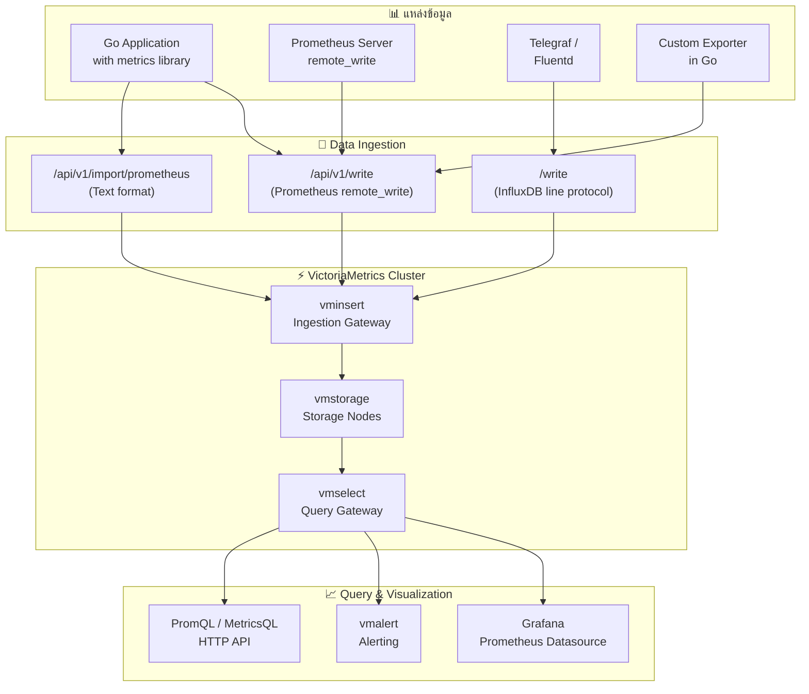

# Module 20: pkg/victoriametrics

## สำหรับโฟลเดอร์ `pkg/victoriametrics/`

ไฟล์ที่เกี่ยวข้อง:
- `client.go` - การสร้างและจัดการ VictoriaMetrics client (HTTP API และ Metrics library)
- `writer.go` - การ push metrics ด้วย Prometheus text format และ remote write API
- `query.go` - การ query ข้อมูลด้วย PromQL และ MetricsQL ผ่าน HTTP API
- `metrics.go` - การ define custom metrics ด้วย lightweight library
- `config.go` - การตั้งค่า connection, retention policies และ cluster endpoints
- `exporter.go` - การสร้าง custom exporter สำหรับดึง metrics จาก third-party APIs


## หลักการ (Concept)

### VictoriaMetrics คืออะไร?
VictoriaMetrics เป็นฐานข้อมูลแบบ time-series ที่มีความเร็วสูง คุ้มค่า และสามารถขยายขนาดได้ (scalable) โดยถูกพัฒนาขึ้นมาเพื่อใช้เป็นโซลูชันสำหรับการ monitoring และจัดการข้อมูล time-series โดยเฉพาะ[reference:0]ได้รับการออกแบบให้เป็นทั้ง long-term storage แทนที่ Prometheus และเป็น standalone monitoring solution ที่สมบูรณ์แบบ[reference:1]

**คุณสมบัติเด่น:**
- **High Performance:** ใน benchmark พบว่า VictoriaMetrics ใช้หน่วยความจำน้อยกว่า Prometheus 1.7 เท่า พื้นที่ดิสก์น้อยกว่า 2.5 เท่า และให้ความเร็ว query เร็วกว่าถึง 16 เท่า โดยเฉลี่ย[reference:2]
- **High Compression Ratio:** บีบอัดข้อมูล time-series ได้อย่างมีประสิทธิภาพมาก ประหยัดพื้นที่จัดเก็บ
- **Drop-in Replacement:** รองรับ Prometheus query API (`/api/v1/query`, `/api/v1/query_range`), remote write API และ Grafana datasource ทำให้สามารถแทนที่ Prometheus ได้โดยตรง[reference:3]

### มีกี่แบบ? (Deployment Models)

| Version | คำอธิบาย | เหมาะกับ |
|---------|----------|----------|
| **Single-node** | โปรแกรมเดียว ไม่มี external dependencies ขยายขนาดได้ตาม CPU cores, RAM และ storage space[reference:4] | ข้อมูล < 1 ล้าน data points ต่อวินาที องค์กรขนาดเล็กถึงกลาง[reference:5] |
| **Cluster** | ประกอบด้วย vminsert (ingestion), vmselect (query), vmstorage (storage) สามารถแยก scale แต่ละ component ได้[reference:6] | ข้อมูล > 1 ล้าน data points ต่อวินาที องค์กรขนาดใหญ่ |
| **Enterprise** | เพิ่ม replication, multi-tenancy, backup, downsampling, alerting (vmalert) และ advanced security | ต้องการ HA และ SLA สูง |

**ข้อห้ามสำคัญ:** ห้ามใช้ Cluster version โดยไม่จำเป็น เพราะ Single-node version นั้น configure และ operate ได้ง่ายกว่ามาก ควรใช้ Cluster version เฉพาะเมื่อข้อมูลปริมาณสูงมากจริงๆ เท่านั้น[reference:7]

### ใช้อย่างไร / นำไปใช้กรณีไหน

**กรณีใช้งาน:**
- **Long-term storage สำหรับ Prometheus** - ใช้ VictoriaMetrics เป็น remote storage backend ของ Prometheus เพื่อเก็บข้อมูลระยะยาว
- **Standalone monitoring solution** - ใช้ VictoriaMetrics แทน Prometheus ทั้งหมด เพื่อลด complexity และเพิ่ม performance
- **IoT sensor data** - รวบรวมข้อมูลจากเซ็นเซอร์นับล้านเครื่อง
- **Real-time dashboards** - ร่วมกับ Grafana สำหรับแสดง metrics แบบ real-time
- **Multi-cluster monitoring** - รวม metrics จากหลาย Kubernetes clusters เข้าด้วยกัน

**รูปแบบการส่งข้อมูล:**
VictoriaMetrics รองรับหลาย ingestion protocols:
- **Prometheus remote_write protocol** - `/api/v1/write` (default, most efficient)
- **Prometheus text exposition format** - `/api/v1/import/prometheus`
- **InfluxDB line protocol** - `/write`
- **Graphite plaintext protocol** - `/api/v1/import/graphite`
- **JSON format** - `/api/v1/import`
- **Native binary format** - `/api/v1/import/native` (fastest)

### ประโยชน์ที่ได้รับ
- **ลดต้นทุนการจัดเก็บ** - ด้วย compression ratio ที่สูงกว่า Prometheus และ InfluxDB
- **Long-term retention** - สามารถเก็บข้อมูลได้เป็นปีโดยไม่ต้องใช้ external solutions (Thanos/Cortex)
- **High availability native** - รองรับทั้ง active-active และ replication ใน cluster mode
- **Powerful MetricsQL** - ภาษา query ที่ extend จาก PromQL เพิ่มฟังก์ชันที่มีประโยชน์
- **ง่ายต่อการ运维** - Single-node version ใช้ binary เดียว ไม่มี external dependencies
- **Ecosystem ใหญ่** - รองรับ Grafana native, Kubernetes operator, VM alerting stack

### ข้อควรระวัง
- **Cardinality explosion** - เช่นเดียวกับ Prometheus การใช้ labels ที่มี cardinality สูง (user_id, session_id) จะทำให้ memory usage พุ่งสูง[reference:8]
- **Single-node limitations** - ไม่มี built-in replication ถ้าข้อมูลหายก็หายเลย ควรใช้ backup หรือ cluster mode
- **Rollback of cluster** - cluster mode มี learning curve สูงกว่า single-node มาก
- **PromQL compatibility** - VictoriaMetrics รองรับ PromQL แต่มีบาง edge cases ที่ behavior ต่างกันเล็กน้อย
- **Memory for high cardinality** - สำหรับการ query GROUP BY บน high cardinality labels อาจต้องใช้ memory สูง
- **Data deletion** - การลบข้อมูลทำได้แต่มี performance overhead เพราะต้อง rewrite parts

### ข้อดี
- **Performance ดีกว่า Prometheus** ในทุกมิติ (ingestion speed, query latency, resource usage)
- **Cost-effective** - ลดค่าใช้จ่ายในการจัดเก็บข้อมูลได้ถึง 90% ในบางกรณี[reference:9]
- **Operation ง่ายกว่า** - ไม่ต้องใช้ Thanos, Cortex หรือ object storage สำหรับ long-term retention
- **Compatibility 100%** - ใช้ Prometheus configs, relabeling rules และ Grafana datasource ได้โดยตรง
- **Built-in downsampling** (Enterprise) - ลดข้อมูลเก่าโดยอัตโนมัติ

### ข้อเสีย
- **Community smaller** - ชุมชนเล็กกว่า Prometheus ทำให้หาตัวอย่างและ plugins ได้น้อยกว่า
- **Single-node lacks replication** - ต้องพึ่ง backup strategy แทน
- **Learning curve for MetricsQL** - แม้จะคล้าย PromQL แต่มีฟังก์ชันเฉพาะตัวที่ต้องเรียนรู้
- **Documentation** - เอกสารกระจัดกระจายมากกว่า Prometheus
- **Enterprise features** - Downsampling, backup, replication เป็น commercial features

### ข้อห้าม
**ห้ามใช้ VictoriaMetrics เป็น transactional database หรือเก็บข้อมูลที่มีการ update/delete บ่อย** เช่นเดียวกับ time-series databases ทั่วไป VictoriaMetrics ออกแบบมาสำหรับ append-only workloads การ update/delete บ่อยจะ degrade performance และอาจเกิด data inconsistency ได้ หากต้องการแก้ไขข้อมูลที่ผิดพลาด ควรใช้วิธีการ re-ingest ข้อมูลใหม่ แทนการ update ทีละจุด【reference: VictoriaMetrics best practices】


## การออกแบบ Workflow และ Dataflow



**Dataflow ใน Go application:**
1. **Define metrics** - สร้าง custom metrics (counter, gauge, histogram) ด้วย `github.com/VictoriaMetrics/metrics` library
2. **Push metrics** - ส่ง metrics ไปยัง VictoriaMetrics ผ่าน HTTP API หรือ remote_write
3. **Export metrics** (for pull model) - expose `/metrics` endpoint ให้ vmagent scrape
4. **Query metrics** - ใช้ PromQL หรือ MetricsQL ผ่าน `/api/v1/query` และ `/api/v1/query_range`


## ตัวอย่างโค้ดที่รันได้จริง

### โครงสร้างโปรเจกต์
```
pkg/victoriametrics/
├── client.go          # VictoriaMetrics HTTP API client
├── writer.go          # Push metrics via remote_write and import APIs
├── query.go           # Query metrics with PromQL/MetricsQL
├── metrics.go         # Lightweight metrics definition
├── config.go          # Configuration management
├── exporter.go        # Custom exporter implementation
├── middleware.go      # HTTP middleware for auto-instrumentation
└── example_main.go    # Complete usage example
```

### 1. การติดตั้ง VictoriaMetrics ด้วย Docker

```yaml
# docker-compose.yml
version: '3.8'
services:
  victoriametrics:
    image: victoriametrics/victoria-metrics:latest
    container_name: victoriametrics
    ports:
      - "8428:8428"   # HTTP API (query, ingestion)
    volumes:
      - victoria_data:/victoria-metrics-data
    command:
      - '-storageDataPath=/victoria-metrics-data'
      - '-retentionPeriod=30d'
      - '-httpListenAddr=:8428'
    restart: unless-stopped

  vmagent:
    image: victoriametrics/vmagent:latest
    container_name: vmagent
    ports:
      - "8429:8429"
    volumes:
      - ./vmagent-config.yml:/etc/vmagent/config.yml
    command:
      - '-remoteWrite.url=http://victoriametrics:8428/api/v1/write'
      - '-promscrape.config=/etc/vmagent/config.yml'
    restart: unless-stopped

  grafana:
    image: grafana/grafana:latest
    container_name: grafana
    ports:
      - "3000:3000"
    environment:
      - GF_SECURITY_ADMIN_PASSWORD=admin
    volumes:
      - grafana_data:/var/lib/grafana
    restart: unless-stopped

volumes:
  victoria_data:
  grafana_data:
```

รันด้วย:
```bash
docker-compose up -d
```

ตรวจสอบการทำงาน: http://localhost:8428 (VictoriaMetrics UI)

### 2. การติดตั้ง Go libraries

```bash
# VictoriaMetrics lightweight metrics library
go get github.com/VictoriaMetrics/metrics

# HTTP client for API calls
go get github.com/go-resty/resty/v2
```

### 3. ตัวอย่างโค้ด: Configuration

```go
// config.go
package victoriametrics

import (
    "os"
    "time"
)

type Config struct {
    // VM instance
    VMURL        string
    VMUser       string
    VMPassword   string
    
    // Retention settings
    RetentionDays int
    
    // Push settings
    PushInterval  time.Duration
    BatchSize     int
    
    // Query settings
    QueryTimeout  time.Duration
    
    // Extra labels to add to all metrics
    ExtraLabels   map[string]string
}

func DefaultConfig() Config {
    return Config{
        VMURL:         "http://localhost:8428",
        VMUser:        "",
        VMPassword:    "",
        RetentionDays: 30,
        PushInterval:  10 * time.Second,
        BatchSize:     10000,
        QueryTimeout:  30 * time.Second,
        ExtraLabels:   make(map[string]string),
    }
}

func LoadConfigFromEnv() Config {
    cfg := DefaultConfig()
    if url := os.Getenv("VICTORIA_METRICS_URL"); url != "" {
        cfg.VMURL = url
    }
    if user := os.Getenv("VICTORIA_METRICS_USER"); user != "" {
        cfg.VMUser = user
    }
    if pass := os.Getenv("VICTORIA_METRICS_PASSWORD"); pass != "" {
        cfg.VMPassword = pass
    }
    return cfg
}
```

### 4. ตัวอย่างโค้ด: Metrics Definition (Lightweight Library)

```go
// metrics.go
package victoriametrics

import (
    "fmt"
    "sync"
    "time"
    
    "github.com/VictoriaMetrics/metrics"
)

// CustomMetrics holds all application metrics
type CustomMetrics struct {
    // Counters
    RequestsTotal    *metrics.Counter
    ErrorsTotal      *metrics.Counter
    
    // Gauges
    ActiveConnections *metrics.Gauge
    QueueSize         *metrics.Gauge
    
    // Histograms
    RequestDuration  *metrics.Histogram
    ResponseSize     *metrics.Histogram
    
    // Gauges with labels
    metricsMap sync.Map // for labeled metrics
}

func NewCustomMetrics(namespace string) *CustomMetrics {
    return &CustomMetrics{
        RequestsTotal:     metrics.NewCounter(fmt.Sprintf(`%s_requests_total`, namespace)),
        ErrorsTotal:       metrics.NewCounter(fmt.Sprintf(`%s_errors_total`, namespace)),
        ActiveConnections: metrics.NewGauge(fmt.Sprintf(`%s_active_connections`, namespace), func() float64 { return 0 }),
        QueueSize:         metrics.NewGauge(fmt.Sprintf(`%s_queue_size`, namespace), func() float64 { return 0 }),
        RequestDuration:   metrics.NewHistogram(fmt.Sprintf(`%s_request_duration_seconds`, namespace)),
        ResponseSize:      metrics.NewHistogram(fmt.Sprintf(`%s_response_size_bytes`, namespace)),
    }
}

// GetOrCreateCounterWithLabels สร้าง counter พร้อม labels (dynamic)
func (m *CustomMetrics) GetOrCreateCounterWithLabels(name string, labels map[string]string) *metrics.Counter {
    metricName := name
    for k, v := range labels {
        metricName += fmt.Sprintf(`_%s="%s"`, k, v)
    }
    
    if val, ok := m.metricsMap.Load(metricName); ok {
        return val.(*metrics.Counter)
    }
    
    counter := metrics.NewCounter(metricName)
    m.metricsMap.Store(metricName, counter)
    return counter
}

// UpdateGauge updates a gauge value
func (m *CustomMetrics) UpdateGauge(name string, value float64) {
    // Use GetOrCreateGauge if gauge doesn't exist
    gauge := metrics.GetOrCreateGauge(name, func() float64 { return value })
    gauge.Set(value)
}

// RecordRequest records request duration and response size
func (m *CustomMetrics) RecordRequest(duration time.Duration, size int, err error) {
    m.RequestsTotal.Inc()
    m.RequestDuration.UpdateDuration(duration)
    m.ResponseSize.Update(float64(size))
    
    if err != nil {
        m.ErrorsTotal.Inc()
    }
}
```

### 5. ตัวอย่างโค้ด: Writer (Push Metrics)

```go
// writer.go
package victoriametrics

import (
    "bytes"
    "fmt"
    "net/http"
    "strings"
    "time"
)

type VMClient struct {
    config     Config
    httpClient *http.Client
}

func NewVMClient(cfg Config) *VMClient {
    return &VMClient{
        config: cfg,
        httpClient: &http.Client{
            Timeout: cfg.QueryTimeout,
        },
    }
}

// PushMetricsViaImport ส่ง metrics แบบ Prometheus text format ผ่าน /api/v1/import/prometheus
func (c *VMClient) PushMetricsViaImport(metricsData string) error {
    url := fmt.Sprintf("%s/api/v1/import/prometheus", c.config.VMURL)
    
    req, err := http.NewRequest("POST", url, bytes.NewBufferString(metricsData))
    if err != nil {
        return err
    }
    req.Header.Set("Content-Type", "text/plain; version=0.0.4")
    
    if c.config.VMUser != "" {
        req.SetBasicAuth(c.config.VMUser, c.config.VMPassword)
    }
    
    resp, err := c.httpClient.Do(req)
    if err != nil {
        return err
    }
    defer resp.Body.Close()
    
    if resp.StatusCode != http.StatusNoContent && resp.StatusCode != http.StatusOK {
        return fmt.Errorf("failed to push metrics: status %d", resp.StatusCode)
    }
    return nil
}

// PushMetricsViaRemoteWrite ส่ง metrics ผ่าน remote_write protocol (more efficient)
func (c *VMClient) PushMetricsViaRemoteWrite(metricsData []byte) error {
    url := fmt.Sprintf("%s/api/v1/write", c.config.VMURL)
    
    req, err := http.NewRequest("POST", url, bytes.NewReader(metricsData))
    if err != nil {
        return err
    }
    req.Header.Set("Content-Type", "application/x-protobuf")
    req.Header.Set("Content-Encoding", "snappy")
    req.Header.Set("X-Prometheus-Remote-Write-Version", "0.1.0")
    
    if c.config.VMUser != "" {
        req.SetBasicAuth(c.config.VMUser, c.config.VMPassword)
    }
    
    resp, err := c.httpClient.Do(req)
    if err != nil {
        return err
    }
    defer resp.Body.Close()
    
    if resp.StatusCode != http.StatusNoContent && resp.StatusCode != http.StatusOK {
        return fmt.Errorf("remote write failed: %d", resp.StatusCode)
    }
    return nil
}

// GeneratePrometheusTextFormat สร้าง Prometheus text format จาก metrics
func GeneratePrometheusTextFormat(metrics map[string]interface{}, labels map[string]string) string {
    var builder strings.Builder
    
    labelStr := ""
    for k, v := range labels {
        labelStr += fmt.Sprintf(`,%s="%s"`, k, v)
    }
    if labelStr != "" {
        labelStr = "{" + labelStr[1:] + "}"
    }
    
    for name, value := range metrics {
        builder.WriteString(fmt.Sprintf("%s%s %v %d\n", name, labelStr, value, time.Now().UnixMilli()))
    }
    return builder.String()
}
```

### 6. ตัวอย่างโค้ด: Query

```go
// query.go
package victoriametrics

import (
    "context"
    "encoding/json"
    "fmt"
    "io"
    "net/http"
    "net/url"
    "time"
)

type QueryResponse struct {
    Status string `json:"status"`
    Data   struct {
        ResultType string `json:"resultType"`
        Result     []struct {
            Metric map[string]string `json:"metric"`
            Value  []interface{}     `json:"value"`
            Values [][]interface{}    `json:"values"`
        } `json:"result"`
    } `json:"data"`
}

// QueryInstant executes instant query at a single timestamp
func (c *VMClient) QueryInstant(ctx context.Context, query string, ts time.Time) (*QueryResponse, error) {
    params := url.Values{}
    params.Add("query", query)
    params.Add("time", ts.Format(time.RFC3339))
    
    reqURL := fmt.Sprintf("%s/api/v1/query?%s", c.config.VMURL, params.Encode())
    
    req, err := http.NewRequestWithContext(ctx, "GET", reqURL, nil)
    if err != nil {
        return nil, err
    }
    
    if c.config.VMUser != "" {
        req.SetBasicAuth(c.config.VMUser, c.config.VMPassword)
    }
    
    resp, err := c.httpClient.Do(req)
    if err != nil {
        return nil, err
    }
    defer resp.Body.Close()
    
    body, err := io.ReadAll(resp.Body)
    if err != nil {
        return nil, err
    }
    
    var result QueryResponse
    if err := json.Unmarshal(body, &result); err != nil {
        return nil, err
    }
    return &result, nil
}

// QueryRange executes range query over time interval
func (c *VMClient) QueryRange(ctx context.Context, query string, start, end time.Time, step time.Duration) (*QueryResponse, error) {
    params := url.Values{}
    params.Add("query", query)
    params.Add("start", start.Format(time.RFC3339))
    params.Add("end", end.Format(time.RFC3339))
    params.Add("step", step.String())
    
    reqURL := fmt.Sprintf("%s/api/v1/query_range?%s", c.config.VMURL, params.Encode())
    
    req, err := http.NewRequestWithContext(ctx, "GET", reqURL, nil)
    if err != nil {
        return nil, err
    }
    
    if c.config.VMUser != "" {
        req.SetBasicAuth(c.config.VMUser, c.config.VMPassword)
    }
    
    resp, err := c.httpClient.Do(req)
    if err != nil {
        return nil, err
    }
    defer resp.Body.Close()
    
    body, err := io.ReadAll(resp.Body)
    if err != nil {
        return nil, err
    }
    
    var result QueryResponse
    if err := json.Unmarshal(body, &result); err != nil {
        return nil, err
    }
    return &result, nil
}

// GetRequestRate returns request rate per second over last 5 minutes
func (c *VMClient) GetRequestRate(ctx context.Context) (map[string]float64, error) {
    query := `rate(myapp_requests_total[5m])`
    result, err := c.QueryInstant(ctx, query, time.Now())
    if err != nil {
        return nil, err
    }
    
    rates := make(map[string]float64)
    for _, item := range result.Data.Result {
        if len(item.Value) >= 2 {
            if val, ok := item.Value[1].(float64); ok {
                endpoint := item.Metric["endpoint"]
                rates[endpoint] = val
            }
        }
    }
    return rates, nil
}
```

### 7. ตัวอย่างโค้ด: Exporter (Pull model สำหรับ vmagent)

```go
// exporter.go
package victoriametrics

import (
    "fmt"
    "net/http"
    "sync"
    "time"
)

// Exporter exposes metrics endpoint for vmagent to scrape
type Exporter struct {
    metrics     *CustomMetrics
    mu          sync.RWMutex
    metricLines []string
}

func NewExporter(namespace string) *Exporter {
    return &Exporter{
        metrics: NewCustomMetrics(namespace),
    }
}

// RegisterMetric adds a metric line to be exposed at /metrics
func (e *Exporter) RegisterMetric(line string) {
    e.mu.Lock()
    defer e.mu.Unlock()
    e.metricLines = append(e.metricLines, line)
}

// ServeHTTP implements http.Handler for /metrics endpoint
func (e *Exporter) ServeHTTP(w http.ResponseWriter, r *http.Request) {
    e.mu.RLock()
    defer e.mu.RUnlock()
    
    for _, line := range e.metricLines {
        fmt.Fprintln(w, line)
    }
    
    // Add any custom metrics from the lightweight library
    // metrics.WritePrometheus(w, true)
}

// RunBackgroundCollector runs background metric collection
func (e *Exporter) RunBackgroundCollector(interval time.Duration, collectFunc func() map[string]interface{}) {
    ticker := time.NewTicker(interval)
    go func() {
        for range ticker.C {
            data := collectFunc()
            for name, value := range data {
                line := fmt.Sprintf("%s %v", name, value)
                e.RegisterMetric(line)
            }
        }
    }()
}
```

### 8. ตัวอย่างโค้ด: HTTP Middleware

```go
// middleware.go
package victoriametrics

import (
    "net/http"
    "strconv"
    "time"
)

type responseWriter struct {
    http.ResponseWriter
    statusCode int
}

func (rw *responseWriter) WriteHeader(code int) {
    rw.statusCode = code
    rw.ResponseWriter.WriteHeader(code)
}

// MetricsMiddleware instruments HTTP handlers with VictoriaMetrics metrics
func MetricsMiddleware(metrics *CustomMetrics) func(http.Handler) http.Handler {
    return func(next http.Handler) http.Handler {
        return http.HandlerFunc(func(w http.ResponseWriter, r *http.Request) {
            start := time.Now()
            rw := &responseWriter{ResponseWriter: w, statusCode: http.StatusOK}
            
            next.ServeHTTP(rw, r)
            
            duration := time.Since(start)
            metrics.RecordRequest(duration, 0, nil)
            
            // Record labeled counter for status codes
            statusCounter := metrics.GetOrCreateCounterWithLabels(
                "http_requests_total",
                map[string]string{
                    "method": r.Method,
                    "path":   r.URL.Path,
                    "status": strconv.Itoa(rw.statusCode),
                },
            )
            statusCounter.Inc()
        })
    }
}
```

### 9. ตัวอย่างการใช้งานรวมใน HTTP server

```go
// main.go
package main

import (
    "context"
    "encoding/json"
    "log"
    "math/rand"
    "net/http"
    "time"
    
    "yourproject/pkg/victoriametrics"
)

func main() {
    // Load config
    cfg := victoriametrics.LoadConfigFromEnv()
    
    // Initialize VictoriaMetrics client
    vmClient := victoriametrics.NewVMClient(cfg)
    
    // Create custom metrics
    metrics := victoriametrics.NewCustomMetrics("myapp")
    
    // Update gauge periodically
    go func() {
        ticker := time.NewTicker(5 * time.Second)
        for range ticker.C {
            metrics.ActiveConnections.Set(float64(rand.Intn(100)))
            metrics.QueueSize.Set(float64(rand.Intn(50)))
        }
    }()
    
    // Create HTTP server with middleware
    mux := http.NewServeMux()
    
    // Instrumented endpoint
    mux.Handle("/api/users", victoriametrics.MetricsMiddleware(metrics)(
        http.HandlerFunc(func(w http.ResponseWriter, r *http.Request) {
            // Simulate processing
            time.Sleep(time.Duration(rand.Intn(100)) * time.Millisecond)
            w.Header().Set("Content-Type", "application/json")
            json.NewEncoder(w).Encode(map[string]interface{}{
                "users": []string{"alice", "bob", "charlie"},
            })
        }),
    ))
    
    // Endpoint for pushing metrics to VictoriaMetrics (push model)
    mux.HandleFunc("/push", func(w http.ResponseWriter, r *http.Request) {
        metricsData := victoriametrics.GeneratePrometheusTextFormat(
            map[string]interface{}{
                "custom_metric": 42.5,
            },
            map[string]string{
                "app":   "myapp",
                "env":   "production",
            },
        )
        
        if err := vmClient.PushMetricsViaImport(metricsData); err != nil {
            http.Error(w, err.Error(), 500)
            return
        }
        w.WriteHeader(http.StatusOK)
    })
    
    // Health check
    mux.HandleFunc("/health", func(w http.ResponseWriter, r *http.Request) {
        w.WriteHeader(http.StatusOK)
        w.Write([]byte(`{"status":"ok"}`))
    })
    
    log.Println("Server starting on :8080")
    log.Fatal(http.ListenAndServe(":8080", mux))
}
```


## วิธีใช้งาน module นี้

1. **ติดตั้ง VictoriaMetrics** (ใช้ Docker ตามตัวอย่างด้านบน)
2. **ติดตั้ง Go libraries**:
   ```bash
   go get github.com/VictoriaMetrics/metrics
   go get github.com/go-resty/resty/v2
   ```
3. **คัดลอกโค้ด** ไฟล์ `client.go`, `writer.go`, `query.go`, `metrics.go`, `config.go`, `middleware.go` ไปไว้ใน `pkg/victoriametrics/`
4. **ปรับ configuration** ตาม environment ของคุณ
5. **สร้าง metrics** ด้วย `victoriametrics.NewCustomMetrics(namespace)`
6. **Push metrics** ผ่าน `vmClient.PushMetricsViaImport()` หรือ expose `/metrics` endpoint ให้ vmagent scrape
7. **Query metrics** ผ่าน `vmClient.QueryInstant()` หรือ `vmClient.QueryRange()`


## การติดตั้ง

### การติดตั้ง VictoriaMetrics

**Option 1: Docker (Recommended)**
```bash
docker run -d --name victoriametrics -p 8428:8428 \
  -v victoria_data:/victoria-metrics-data \
  victoriametrics/victoria-metrics:latest \
  -storageDataPath=/victoria-metrics-data \
  -retentionPeriod=30d
```

**Option 2: Binary (Linux)**
```bash
wget https://github.com/VictoriaMetrics/VictoriaMetrics/releases/download/v1.93.0/victoria-metrics-linux-amd64-v1.93.0.tar.gz
tar xzf victoria-metrics-linux-amd64-v1.93.0.tar.gz
./victoria-metrics-prod -storageDataPath=./victoria-metrics-data
```

**Option 3: Kubernetes with Operator**
```bash
# Add Helm repo
helm repo add vm https://victoriametrics.github.io/helm-charts/
helm repo update

# Install VM Operator
helm install vmoperator vm/victoria-metrics-operator

# Deploy VMSingle instance
kubectl apply -f - <<EOF
apiVersion: operator.victoriametrics.com/v1beta1
kind: VMSingle
metadata:
  name: vmsingle-example
spec:
  retentionPeriod: "30d"
  resources:
    requests:
      memory: "1Gi"
EOF
```
[reference:10][reference:11]


## การตั้งค่า configuration

### Environment Variables
```bash
export VICTORIA_METRICS_URL=http://localhost:8428
export VICTORIA_METRICS_USER=admin
export VICTORIA_METRICS_PASSWORD=your_password
export RETENTION_DAYS=30
```

### vmagent Configuration (`vmagent-config.yml`)
```yaml
global:
  scrape_interval: 15s

scrape_configs:
  - job_name: 'go-app'
    static_configs:
      - targets: ['host.docker.internal:8080']
    
  - job_name: 'kubernetes-pods'
    kubernetes_sd_configs:
      - role: pod
    relabel_configs:
      - source_labels: [__meta_kubernetes_pod_annotation_prometheus_io_scrape]
        action: keep
        regex: true
      - source_labels: [__meta_kubernetes_pod_annotation_prometheus_io_path]
        action: replace
        target_label: __metrics_path__
        regex: (.+)
```

### Grafana Datasource Configuration
1. เข้า Grafana → Configuration → Data Sources
2. Add data source → Prometheus
3. ตั้งค่า URL: `http://victoriametrics:8428`
4. Access: Server (default)
5. Save & Test


## การรวมกับ Prometheus

VictoriaMetrics สามารถใช้เป็น **long-term remote storage** สำหรับ Prometheus ได้โดยตรง:

```yaml
# prometheus.yml
remote_write:
  - url: http://victoriametrics:8428/api/v1/write
    queue_config:
      capacity: 10000
      max_shards: 20
    basic_auth:
      username: admin
      password: your_password

remote_read:
  - url: http://victoriametrics:8428/api/v1/read
    read_recent: true
    basic_auth:
      username: admin
      password: your_password
```

จากนั้น Prometheus จะ forward ข้อมูลไปยัง VictoriaMetrics โดยอัตโนมัติ และ Grafana สามารถ query ข้อมูลจาก VictoriaMetrics โดยตรง


## การใช้งานจริง

### Example 1: Basic Metrics Push

```go
package main

import (
    "log"
    "time"
    
    "github.com/VictoriaMetrics/metrics"
)

func main() {
    // Create counter
    requestsTotal := metrics.NewCounter(`http_requests_total{path="/api/users"}`)
    
    // Create gauge
    activeConnections := metrics.NewGauge(`active_connections`, func() float64 {
        return 42
    })
    
    // Create histogram
    requestDuration := metrics.NewHistogram(`request_duration_seconds`)
    
    for i := 0; i < 100; i++ {
        start := time.Now()
        // Do work...
        time.Sleep(10 * time.Millisecond)
        requestDuration.UpdateDuration(time.Since(start))
        requestsTotal.Inc()
    }
    
    activeConnections.Set(100)
    
    // Push metrics to VictoriaMetrics
    metrics.WritePrometheus(nil, true)
}
```

### Example 2: Custom Exporter for Third-Party API

```go
package main

import (
    "encoding/json"
    "net/http"
    "time"
    
    "github.com/VictoriaMetrics/metrics"
)

type APIClient struct {
    baseURL string
    client  *http.Client
}

func (c *APIClient) FetchMetrics() {
    resp, err := c.client.Get(c.baseURL + "/metrics")
    if err != nil {
        metrics.GetOrCreateCounter(`api_errors_total`).Inc()
        return
    }
    defer resp.Body.Close()
    
    var data map[string]interface{}
    json.NewDecoder(resp.Body).Decode(&data)
    
    // Export as Prometheus metrics
    for k, v := range data {
        if val, ok := v.(float64); ok {
            metrics.GetOrCreateGauge(k, func() float64 { return val })
        }
    }
}

func main() {
    client := &APIClient{baseURL: "https://api.example.com", client: &http.Client{}}
    ticker := time.NewTicker(30 * time.Second)
    for range ticker.C {
        client.FetchMetrics()
    }
}
```

### Example 3: Integration with Grafana Dashboard

สร้าง dashboard ใน Grafana โดยใช้ datasource ที่ชี้ไปที่ VictoriaMetrics:

```json
{
  "dashboard": {
    "title": "Go Application Metrics",
    "panels": [
      {
        "title": "Request Rate",
        "targets": [
          {
            "expr": "rate(myapp_requests_total[5m])",
            "legendFormat": "{{method}} {{path}}"
          }
        ]
      },
      {
        "title": "Request Duration (P99)",
        "targets": [
          {
            "expr": "histogram_quantile(0.99, sum(rate(myapp_request_duration_seconds_bucket[5m])) by (le))",
            "legendFormat": "P99 Latency"
          }
        ]
      }
    ]
  }
}
```


## ตารางสรุป VictoriaMetrics Components

| Component | คำอธิบาย | ตัวอย่าง |
|-----------|----------|----------|
| **vminsert** | Ingestion gateway สำหรับ cluster version รับข้อมูลจาก Prometheus remote_write | `-httpListenAddr=:8480` |
| **vmselect** | Query gateway สำหรับ cluster version ทำหน้าที่ประมวลผล query | `-storageNode=vmstorage:8401` |
| **vmstorage** | Storage node สำหรับ cluster version เก็บข้อมูล time-series | `-retentionPeriod=30d` |
| **vmagent** | Lightweight agent สำหรับ scrape metrics และ forward ไปยัง VictoriaMetrics[reference:12] | `-remoteWrite.url=http://vm:8428/api/v1/write` |
| **vmalert** | Alerting component ประเมิน alerting rules และส่ง alert | `-rule=/etc/alerts/*.yml` |
| **vmauth** | Authentication proxy สำหรับ cluster components | `-auth.config=/etc/auth.yml` |
| **vmbackup** | Backup tool สำหรับเก็บข้อมูลไปยัง S3/GCS | `-storageDataPath=/victoria-metrics-data` |
| **vmrestore** | Restore tool สำหรับกู้ข้อมูลจาก backup | `-storageDataPath=/victoria-metrics-data` |
| **VM Operator** | Kubernetes operator จัดการ VictoriaMetrics components ด้วย CRDs[reference:13] | `VMSingle`, `VMCluster`, `VMAgent` |
| **MetricsQL** | Extended PromQL พร้อมฟังก์ชันเพิ่มเติม | `rollup_rate()`, `rollup_increase()` |
| **VMAgent CRD** | Kubernetes CRD สำหรับกำหนด vmagent configuration[reference:14] | `spec.scrapeConfigs` |


## แบบฝึกหัดท้าย module (5 ข้อ)

### ข้อ 1: การสร้างและ Push Metrics

จงเขียน Go program ที่:
- สร้าง Counter metric ชื่อ `order_processed_total` พร้อม labels: `status` (success, failed), `payment_method` (credit_card, bank_transfer, cod)
- สร้าง Histogram metric ชื่อ `order_processing_duration_seconds` สำหรับวัดเวลาประมวลผล order
- สร้าง Gauge metric ชื่อ `pending_orders` สำหรับ tracking จำนวน order ที่รอดำเนินการ
- จำลองการประมวลผล orders 100 orders (random duration 10-500ms)
- Push metrics ไปยัง VictoriaMetrics ผ่าน `/api/v1/import/prometheus` ทุก 10 วินาที
- หลังจาก push ข้อมูลแล้ว ให้ query เพื่อ verify ว่า metric ถูกเก็บเรียบร้อย

### ข้อ 2: การ Query และ Alerting

จากระบบ e-commerce ที่มี metric `order_errors_total` (counter) และ `order_requests_total` (counter):
- เขียนฟังก์ชัน Go ที่ query ค่า error rate (errors/requests) ในช่วง 5 นาทีที่ผ่านมา โดยใช้ MetricsQL
- ถ้า error rate > 5% ให้ส่ง alert ไปยัง Slack webhook
- ถ้า error rate > 10% ให้เพิ่ม severity เป็น "critical"
- เขียน PromQL expression สำหรับ alerting rule ที่จะใช้กับ vmalert

### ข้อ 3: การสร้าง Custom Exporter

จงสร้าง custom exporter ใน Go สำหรับดึง metrics จาก third-party API (สมมติว่า API endpoint `/stats` คืนค่า JSON ดังนี้):
```json
{
  "total_users": 18088,
  "active_sessions": 342,
  "api_calls_today": 128088,
  "error_count": 23
}
```
- สร้าง exporter ที่ดึงข้อมูลทุก 30 วินาที
- แปลงข้อมูลเป็น Prometheus text format
- expose endpoint `/metrics` บน port 8080 สำหรับให้ vmagent scrape
- ทดสอบโดยใช้ curl ตรวจสอบที่ `/metrics`

### ข้อ 4: การตั้งค่า Retention และ Downsampling

บริษัทมีข้อมูล metrics 10 million samples ต่อวัน และต้องการเก็บข้อมูล raw ไว้ 7 วัน แต่เก็บ aggregated data (รายชั่วโมง) ไว้ 90 วัน:
- จงเขียน Docker command หรือ docker-compose สำหรับรัน VictoriaMetrics single-node ที่มี retention 7 วัน
- อธิบายวิธีการ downsampling ข้อมูล raw เป็นรายชั่วโมง (ต้องใช้ Enterprise features หรือวิธีอื่น)
- เขียน recording rule (PromQL) สำหรับ pre-aggregate ข้อมูลเป็นรายชั่วโมง
- เปรียบเทียบพื้นที่เก็บข้อมูลที่ประหยัดได้ระหว่างเก็บ raw 90 วัน vs เก็บ raw 7 วัน + aggregated 90 วัน (สมมติ compression ratio 10:1 สำหรับ raw และ 50:1 สำหรับ aggregated)

### ข้อ 5: การ Integrate กับ Prometheus และ Grafana

จากสถาปัตยกรรมที่มี Prometheus 2 instances (ใน Kubernetes clusters 2 clusters) และต้องการรวบรวม metrics ทั้งหมดไว้ที่ VictoriaMetrics instance กลาง:
- จงอธิบายสถาปัตยกรรมที่เหมาะสม (ใช้ vmagent, remote_write, หรือ federation)
- เขียน Prometheus remote_write configuration สำหรับ forward metrics ไปยัง VictoriaMetrics
- เขียน vmagent configuration สำหรับ scrape metrics จากทั้ง 2 clusters
- เขียน Grafana dashboard configuration (JSON) สำหรับแสดง:
  - Request rate แยกตาม cluster
  - Error rate แยกตาม service
  - P99 latency ของ API endpoints
- ทดสอบโดยสร้าง VictoriaMetrics instance ด้วย Docker และจำลอง data จากทั้ง 2 clusters


## แหล่งอ้างอิง

- [VictoriaMetrics Official Documentation](https://docs.victoriametrics.com/)
- [VictoriaMetrics/metrics GoDoc](https://pkg.go.dev/github.com/VictoriaMetrics/metrics)
- [VictoriaMetrics vs Prometheus Benchmark](https://victoriametrics.com/blog/victoriametrics-vs-prometheus-benchmark/)
- [VictoriaMetrics Kubernetes Operator Documentation](https://docs.victoriametrics.com/operator/)
- [vmagent Documentation](https://docs.victoriametrics.com/vmagent.html)
- [MetricsQL Functions](https://docs.victoriametrics.com/MetricsQL.html)
- [VictoriaMetrics Remote Write Guide](https://docs.victoriametrics.com/#how-to-import-data)
- [VictoriaMetrics Grafana Plugin](https://grafana.com/grafana/plugins/victoriametrics-datasource/)

---

**หมายเหตุ:** module นี้ครบถ้วนสำหรับ `pkg/victoriametrics` สำหรับระบบ gobackend หากต้องการ module เพิ่มเติม (เช่น `pkg/opentelemetry`, `pkg/thanos`) โปรดแจ้ง