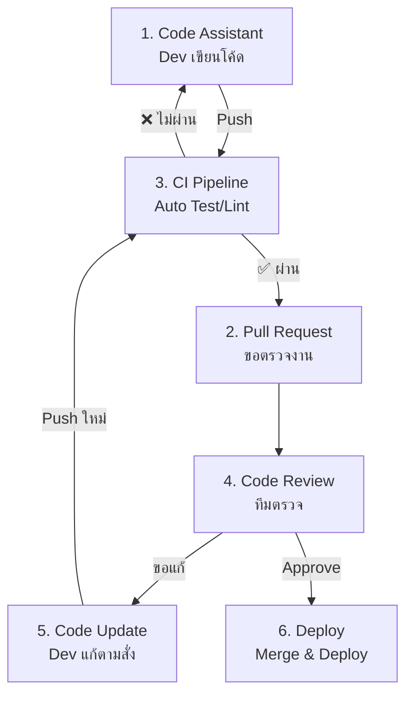

# คู่มือ Git Flow (ทีมใหญ่)

---

## บทนำ

ระบบศูนย์บริการรถยนต์เป็นระบบขนาดใหญ่ที่ประกอบด้วย Backend สองเทคโนโลยี (NestJS และ Spring Boot) และ Frontend (ReactJS) การพัฒนาด้วยทีมงานหลายคนจำเป็นต้องมีกระบวนการจัดการซอร์สโค้ดที่ได้มาตรฐาน ลดความขัดแย้งในการรวมโค้ด (merge conflict) และเพิ่มประสิทธิภาพในการตรวจสอบโค้ด (code review) เอกสารนี้รวบรวมแนวปฏิบัติ **Git Flow** ที่ปรับปรุงสำหรับทีมใหญ่ พร้อมทั้งคู่มือการตั้งชื่อ branch, การจัดการ merge conflict, ขั้นตอน pull request, และเทมเพลตต่างๆ เพื่อให้ทีมทำงานร่วมกันได้อย่างราบรื่น

---

## บทนิยาม

| ศัพท์ | คำจำกัดความ |
| :--- | :--- |
| **Git Flow** | รูปแบบการจัดการ branch หลักที่มี `main`, `develop`, `feature`, `release`, `hotfix` |
| **Merge Conflict** | สถานการณ์ที่ Git ไม่สามารถรวมการเปลี่ยนแปลงจากสอง branch ได้โดยอัตโนมัติ เนื่องจากมีการแก้ไขไฟล์เดียวกันในตำแหน่งที่ต่างกัน |
| **Pull Request (PR)** | การขอรวมโค้ดจาก branch หนึ่งไปยังอีก branch หนึ่ง พร้อมเปิดให้มีการตรวจสอบและแสดงความคิดเห็น |
| **Monorepo** | การเก็บโค้ดของหลายโปรเจกต์ (backend, frontend, infrastructure) ไว้ใน repository เดียว |
| **CI/CD** | Continuous Integration / Continuous Deployment – กระบวนการทดสอบและปรับใช้โค้ดอัตโนมัติ |
| **Semantic Versioning** | รูปแบบหมายเลขเวอร์ชัน `major.minor.patch` (เช่น 1.0.0) |
| **Ticket ID** | รหัสงานจากระบบจัดการงาน (Jira, Trello, ClickUp) ใช้สำหรับเชื่อมโยงโค้ดกับงาน |
| **OWASP** | มาตรฐานความปลอดภัยของเว็บแอปพลิเคชัน |
| **Code Review** | กระบวนการตรวจสอบโค้ดโดยเพื่อนร่วมทีมก่อน merge |

---

## บทหัวข้อ (สารบัญ)

- [คู่มือ Git Flow (ทีมใหญ่)](#คู่มือ-git-flow-ทีมใหญ่)
  - [บทนำ](#บทนำ)
  - [บทนิยาม](#บทนิยาม)
  - [บทหัวข้อ (สารบัญ)](#บทหัวข้อ-สารบัญ)
  - [3. โครงสร้าง Repository และ Branch Strategy](#3-โครงสร้าง-repository-และ-branch-strategy)
    - [3.1 Monorepo (แนะนำ)](#31-monorepo-แนะนำ)
    - [3.2 Branch หลักและประเภท branch](#32-branch-หลักและประเภท-branch)
    - [3.3 การตั้งชื่อ branch สำหรับทีมใหญ่ (เน้น Traceability)](#33-การตั้งชื่อ-branch-สำหรับทีมใหญ่-เน้น-traceability)
      - [ตัวอย่างทั้งหมด](#ตัวอย่างทั้งหมด)
    - [3.4 Branch Protection Rules](#34-branch-protection-rules)
  - [4. การจัดการ Merge Conflict](#4-การจัดการ-merge-conflict)
    - [4.1 หลักการป้องกัน (ป้องกันดีกว่าแก้)](#41-หลักการป้องกัน-ป้องกันดีกว่าแก้)
    - [4.2 ขั้นตอนการแก้ไข Merge Conflict (แบบ rebase - แนะนำ)](#42-ขั้นตอนการแก้ไข-merge-conflict-แบบ-rebase---แนะนำ)
    - [4.3 การใช้เครื่องมือช่วย](#43-การใช้เครื่องมือช่วย)
    - [4.4 การหลีกเลี่ยง Conflict เฉพาะโปรเจกต์นี้](#44-การหลีกเลี่ยง-conflict-เฉพาะโปรเจกต์นี้)
  - [5. กระบวนการ Pull Request และ Code Review](#5-กระบวนการ-pull-request-และ-code-review)
    - [5.1 ขั้นตอนการเปิด Pull Request](#51-ขั้นตอนการเปิด-pull-request)
    - [5.2 เทมเพลต Pull Request](#52-เทมเพลต-pull-request)
    - [5.3 Code Review Workflow (6 ขั้นตอน)](#53-code-review-workflow-6-ขั้นตอน)
    - [5.4 เกณฑ์การประเมินโค้ด 10 ข้อสำหรับ Reviewer](#54-เกณฑ์การประเมินโค้ด-10-ข้อสำหรับ-reviewer)
    - [5.5 คำถามที่ Reviewer ควรถาม (แทนการสั่ง)](#55-คำถามที่-reviewer-ควรถาม-แทนการสั่ง)
    - [5.6 คำถามเฉพาะด้านความปลอดภัย (Security-Focused)](#56-คำถามเฉพาะด้านความปลอดภัย-security-focused)
    - [5.7 Security Checklist (สำหรับทุก PR)](#57-security-checklist-สำหรับทุก-pr)
  - [6. Workflow แบบ Step-by-Step](#6-workflow-แบบ-step-by-step)
    - [6.1 Feature Development Workflow](#61-feature-development-workflow)
    - [6.2 Release Workflow](#62-release-workflow)
    - [6.3 Hotfix Workflow](#63-hotfix-workflow)
    - [6.4 Enhancement / Refactor / Chore Workflow](#64-enhancement--refactor--chore-workflow)
  - [7. คู่มือการใช้งาน Git Flow (Manual)](#7-คู่มือการใช้งาน-git-flow-manual)
    - [7.1 การตั้งค่าเริ่มต้น](#71-การตั้งค่าเริ่มต้น)
    - [7.2 การสร้าง branch และ commit](#72-การสร้าง-branch-และ-commit)
    - [7.3 การ rebase และ merge](#73-การ-rebase-และ-merge)
    - [7.4 การทำ release และ hotfix](#74-การทำ-release-และ-hotfix)
  - [8. Task List Template](#8-task-list-template)
  - [9. Checklist Template](#9-checklist-template)
    - [9.1 Pre-PR Checklist (สำหรับผู้พัฒนา)](#91-pre-pr-checklist-สำหรับผู้พัฒนา)
    - [9.2 Code Review Checklist (สำหรับ Reviewer)](#92-code-review-checklist-สำหรับ-reviewer)
    - [9.3 Release Checklist](#93-release-checklist)
    - [9.4 Security Review Checklist (สำหรับทุก PR)](#94-security-review-checklist-สำหรับทุก-pr)
  - [10. ภาคผนวก: ตัวอย่าง CI/CD และเครื่องมือช่วย](#10-ภาคผนวก-ตัวอย่าง-cicd-และเครื่องมือช่วย)
    - [GitHub Actions Workflow (ย่อ)](#github-actions-workflow-ย่อ)
    - [เครื่องมือช่วยแนะนำ](#เครื่องมือช่วยแนะนำ)
- [11. การแก้ไขปัญหา Git: Merge Conflict และ Push ไม่ได้](#11-การแก้ไขปัญหา-git-merge-conflict-และ-push-ไม่ได้)
  - [11.1 ปัญหา: Merge Conflict ขณะ pull หรือ rebase แล้ว push ไม่ได้](#111-ปัญหา-merge-conflict-ขณะ-pull-หรือ-rebase-แล้ว-push-ไม่ได้)
    - [อาการ](#อาการ)
    - [สาเหตุ](#สาเหตุ)
    - [วิธีแก้ไข](#วิธีแก้ไข)
      - [กรณีที่ 1: ใช้ rebase แล้ว conflict (แนะนำ)](#กรณีที่-1-ใช้-rebase-แล้ว-conflict-แนะนำ)
      - [กรณีที่ 2: ใช้ merge แล้ว conflict](#กรณีที่-2-ใช้-merge-แล้ว-conflict)
      - [กรณีที่ 3: conflict แก้แล้ว แต่ push แล้วโดน reject เพราะ remote มี commit ใหม่กว่า](#กรณีที่-3-conflict-แก้แล้ว-แต่-push-แล้วโดน-reject-เพราะ-remote-มี-commit-ใหม่กว่า)
  - [11.2 ปัญหา: Push ไม่ได้เพราะ history ขัดแย้ง (non-fast-forward)](#112-ปัญหา-push-ไม่ได้เพราะ-history-ขัดแย้ง-non-fast-forward)
    - [อาการ](#อาการ-1)
    - [สาเหตุ](#สาเหตุ-1)
    - [วิธีแก้ไข](#วิธีแก้ไข-1)
      - [หากคุณเป็นคนเดียวที่ทำงานบน branch นี้ (ปลอดภัย)](#หากคุณเป็นคนเดียวที่ทำงานบน-branch-นี้-ปลอดภัย)
      - [หากมีคนอื่นทำงานร่วมบน branch นี้ (ควรใช้ rebase)](#หากมีคนอื่นทำงานร่วมบน-branch-นี้-ควรใช้-rebase)
  - [11.3 ปัญหา: Merge conflict ซับซ้อน แก้ไม่ถูก หรือกลัวผิด](#113-ปัญหา-merge-conflict-ซับซ้อน-แก้ไม่ถูก-หรือกลัวผิด)
    - [วิธีที่ 1: ใช้ mergetool แบบ GUI](#วิธีที่-1-ใช้-mergetool-แบบ-gui)
    - [วิธีที่ 2: ยกเลิก merge หรือ rebase แล้วเริ่มใหม่](#วิธีที่-2-ยกเลิก-merge-หรือ-rebase-แล้วเริ่มใหม่)
    - [วิธีที่ 3: ใช้ strategy "ours" หรือ "theirs" (สำหรับบางไฟล์)](#วิธีที่-3-ใช้-strategy-ours-หรือ-theirs-สำหรับบางไฟล์)
    - [วิธีที่ 4: แก้ conflict ด้วย VS Code (แนะนำ)](#วิธีที่-4-แก้-conflict-ด้วย-vs-code-แนะนำ)
  - [11.4 ปัญหา: Push ไม่ได้เพราะ branch protection rules](#114-ปัญหา-push-ไม่ได้เพราะ-branch-protection-rules)
    - [อาการ](#อาการ-2)
    - [สาเหตุ](#สาเหตุ-2)
    - [วิธีแก้ไข](#วิธีแก้ไข-2)
  - [11.5 ปัญหา: ลืม rebase ก่อน push ทำให้มี merge commit เลอะ](#115-ปัญหา-ลืม-rebase-ก่อน-push-ทำให้มี-merge-commit-เลอะ)
    - [อาการ](#อาการ-3)
    - [วิธีแก้ไข (ถ้ายังไม่ได้ push หรือ push ไปแล้วแต่เป็น branch ส่วนตัว)](#วิธีแก้ไข-ถ้ายังไม่ได้-push-หรือ-push-ไปแล้วแต่เป็น-branch-ส่วนตัว)
    - [หาก push ไปแล้ว และมีคนทำงานต่อจาก branch นี้](#หาก-push-ไปแล้ว-และมีคนทำงานต่อจาก-branch-นี้)
  - [11.6 ปัญหา: stash แล้ว pop ผิด ทำให้ conflict หรือ lost changes](#116-ปัญหา-stash-แล้ว-pop-ผิด-ทำให้-conflict-หรือ-lost-changes)
    - [อาการ](#อาการ-4)
    - [วิธีแก้ไข](#วิธีแก้ไข-3)
    - [ข้อควรปฏิบัติ](#ข้อควรปฏิบัติ)
  - [11.7 ตารางสรุปคำสั่งช่วยเหลือเมื่อเกิดปัญหา](#117-ตารางสรุปคำสั่งช่วยเหลือเมื่อเกิดปัญหา)
  - [11.8 กรณีศึกษาจริง: Conflict ที่พบบ่อยในโปรเจกต์นี้](#118-กรณีศึกษาจริง-conflict-ที่พบบ่อยในโปรเจกต์นี้)
    - [กรณีที่ 1: package.json และ package-lock.json](#กรณีที่-1-packagejson-และ-package-lockjson)
    - [กรณีที่ 2: OpenAPI/Swagger spec ที่ auto-generated](#กรณีที่-2-openapiswagger-spec-ที่-auto-generated)
    - [กรณีที่ 3: Dockerfile คำสั่งซ้อนกัน](#กรณีที่-3-dockerfile-คำสั่งซ้อนกัน)
  - [11.9 ป้องกันก่อนดีกว่าแก้: Best Practices](#119-ป้องกันก่อนดีกว่าแก้-best-practices)

---

## 3. โครงสร้าง Repository และ Branch Strategy

### 3.1 Monorepo (แนะนำ)

```
car-service-system/
├── backend/
│   ├── nestjs-api/          # NestJS API Service
│   ├── spring-boot-api/     # Spring Boot + Kafka Service
│   └── shared/              # Shared types, utilities
├── frontend/
│   └── react-app/           # ReactJS Application
├── infrastructure/
│   ├── docker/              # Docker configurations
│   ├── kubernetes/          # K8s manifests
│   └── terraform/           # Infrastructure as Code
├── docs/                    # Documentation
└── scripts/                 # Deployment scripts
```

**ข้อดีของ Monorepo สำหรับทีมใหญ่:**
- เปลี่ยนแปลงหลายส่วนใน PR เดียว (เช่น เพิ่ม API endpoint และ UI พร้อมกัน)
- Dependency management ง่ายกว่า
- Integration testing สะดวก
- Version control แบบ atomic

### 3.2 Branch หลักและประเภท branch

| Branch Type | Naming Pattern | Purpose | Merge To |
| :-- | :-- | :-- | :-- |
| **main** | `main` | Production-ready code | - |
| **develop** | `develop` | Integration branch | main (via release) |
| **feature** | `feature/<TICKET-ID>-<description>` | New features | develop |
| **release** | `release/v<major.minor.patch>` | Release preparation | main + develop |
| **hotfix** | `hotfix/<TICKET-ID>-<description>` | Production fixes | main + develop |
| **bugfix** | `bugfix/<TICKET-ID>-<description>` | Bug fixes on develop | develop |
| **enhancement** | `enhancement/<TICKET-ID>-<description>` | Improvements (performance, UX) | develop |
| **refactor** | `refactor/<TICKET-ID>-<scope>` | Code restructuring (no behavior change) | develop |
| **chore** | `chore/<TICKET-ID>-<task>` | Build, config, dependency updates | develop |
| **tweak** | `tweak/<TICKET-ID>-<description>` | Small adjustments (UI, wording) | develop |
| **ui/ux** | `ui/<TICKET-ID>-<description>` | Frontend-only visual changes | develop |

### 3.3 การตั้งชื่อ branch สำหรับทีมใหญ่ (เน้น Traceability)

**รูปแบบหลัก:** `ประเภท/รหัสงาน-คำอธิบายสั้นๆ` (ใช้ kebab-case, ตัวพิมพ์เล็กทั้งหมด)

#### ตัวอย่างทั้งหมด

| ประเภท | ตัวอย่าง | Ticket ที่เกี่ยวข้อง |
| :-- | :-- | :-- |
| Feature | `feature/CART-101-add-to-cart` | CART-101 |
| Bugfix | `bugfix/CART-102-fix-cart-total` | CART-102 |
| Enhancement | `enhancement/CART-105-improve-loading-speed` | CART-105 |
| Refactor | `refactor/USER-300-clean-auth-service` | USER-300 |
| Chore | `chore/DEVOPS-500-update-nestjs-v10` | DEVOPS-500 |
| Hotfix | `hotfix/v1.5.1-emergency-fix` หรือ `hotfix/INC-001-fix-payment` | INC-001 |
| Release | `release/v1.5.0`, `release/v2.0.0-rc1` | - |
| Tweak | `tweak/UI-501-adjust-padding` | UI-501 |
| UI | `ui/HOME-404-hero-banner` | HOME-404 |

**ข้อตกลงร่วมกัน:**
- ตัวพิมพ์เล็กทั้งหมด (`feature/Login` ❌ → `feature/login` ✅)
- ใช้ขีดกลาง (hyphen) ไม่ใช้ underscore
- ห้ามใช้ชื่อบุคคล (`feature/somchai-login` ❌)
- ระบุ Ticket ID ทุกครั้ง (ยกเว้น release)

**สำหรับฟีเจอร์ขนาดใหญ่ที่มี subtask:** ใช้ slash grouping
- `feature/login/forget-password-link`
- `feature/login/google-button`

### 3.4 Branch Protection Rules

**Main branch:**
- Require PR reviews: 2 approvals
- Require status checks: CI/CD, tests, coverage ≥80%
- Linear history เท่านั้น
- ห้าม force push

**Develop branch:**
- Require PR reviews: 1 approval
- Require status checks: linting, unit tests
- อนุญาตให้ merge โดย squash

---

## 4. การจัดการ Merge Conflict

### 4.1 หลักการป้องกัน (ป้องกันดีกว่าแก้)

| หลักการ | ปฏิบัติ |
| :--- | :--- |
| **อัปเดต branch บ่อยๆ** | ทุกวันให้ `git rebase origin/develop` |
| **ทำงานคนละไฟล์กัน** | แบ่ง responsibility ชัดเจน (backend vs frontend, service A vs service B) |
| **PR ให้สั้น** | Feature branch อายุไม่เกิน 3 วัน หรือเปลี่ยนแปลงไม่เกิน 10 ไฟล์ |
| **ใช้ monorepo + path filter** | CI ตรวจสอบว่า PR มีผลกระทบเฉพาะส่วนที่เกี่ยวข้อง |

### 4.2 ขั้นตอนการแก้ไข Merge Conflict (แบบ rebase - แนะนำ)

```bash
# 1. อยู่บน feature branch
git checkout feature/CART-101-add-to-cart

# 2. fetch และ rebase จาก develop
git fetch origin
git rebase origin/develop

# 3. หากมี conflict Git จะหยุดและบอกไฟล์
git status   # ดูรายการไฟล์ที่ conflict

# 4. แก้ไขไฟล์ด้วย editor (ลบเครื่องหมาย <<<<<<<, =======, >>>>>>>)
# 5. หลังจากแก้ไขแล้ว
git add <ไฟล์ที่แก้ไข>
git rebase --continue

# 6. ทำซ้ำจนกว่าจะ rebase เสร็จ
# 7. force push (เพราะ history เปลี่ยน)
git push --force-with-lease origin feature/CART-101-add-to-cart
```

### 4.3 การใช้เครื่องมือช่วย

- **VS Code** – แสดง conflict แบบ side-by-side
- **GitKraken / Sourcetree** – GUI จัดการ conflict
- **Git mergetool** – `git mergetool` เปิด kdiff3 หรือ vimdiff

### 4.4 การหลีกเลี่ยง Conflict เฉพาะโปรเจกต์นี้

| ประเภทไฟล์ | วิธีลด Conflict |
| :--- | :--- |
| `package.json` (frontend/backend) | แยก dependency แต่ละ service; ใช้ `npm install --package-lock-only` |
| `pom.xml` | เพิ่ม dependency ท้ายไฟล์; ใช้ `mvn versions:update-properties` |
| `Dockerfile` / `docker-compose.yml` | กำหนด owner แต่ละ service; ใช้ env vars |
| `OpenAPI/Swagger` | แยก spec ตาม service; รวมที่ API gateway |
| `React component` | แยก component ต่อไฟล์; หลีกเลี่ยงการแก้ไขไฟล์เดียวกันพร้อมกัน |

---

## 5. กระบวนการ Pull Request และ Code Review

### 5.1 ขั้นตอนการเปิด Pull Request

1. Developer สร้าง feature branch จาก `develop` และพัฒนาเสร็จ
2. Push branch ขึ้น remote
3. เปิด PR บน GitHub/GitLab โดยเลือก base = `develop`, compare = `feature/xxx`
4. กรอก PR template (ดู 5.2)
5. ระบุ reviewer อย่างน้อย 2 คน
6. เชื่อมโยง JIRA ticket
7. รอ CI pipeline (lint, test, build) ผ่าน
8. เมื่อได้รับ approvals และ CI ผ่าน → merge (ใช้ squash and merge สำหรับ feature)

### 5.2 เทมเพลต Pull Request

```markdown
## Description
[ brief description of changes ]

## Type of Change
- [ ] Bug fix (non-breaking)
- [ ] New feature (non-breaking)
- [ ] Breaking change
- [ ] Documentation update
- [ ] Enhancement / Refactor / Chore

## Related Issues
Closes #[Ticket ID]
Related to #[Ticket ID]

## Changes Made
- [list key changes]

## Testing
- [ ] Unit tests pass
- [ ] Integration tests pass
- [ ] Manual testing completed

## Checklist
- [ ] Self-review completed
- [ ] Code follows project style
- [ ] Comments added for complex logic
- [ ] Documentation updated
- [ ] No new warnings
- [ ] Security reviewed (input validation, auth, secrets)

## Screenshots (if UI change)

## Deployment Notes
- [new env vars, migrations, etc.]
```

### 5.3 Code Review Workflow (6 ขั้นตอน)



| ขั้นตอน | ผู้รับผิดชอบ | การกระทำ | เป้าหมาย |
| :-- | :-- | :-- | :-- |
| 1. Code Assistant | Developer | ใช้ AI ช่วยเขียน, รัน test local, lint | ส่งโค้ดสะอาดเข้าสู่ระบบ |
| 2. Pull Request | Developer | เปิด PR, เขียนคำอธิบาย, ระบุ reviewer | แจ้งทีมว่าพร้อมตรวจ |
| 3. CI Pipeline | ระบบ | รัน test, lint, build, coverage | คัดกรอง error พื้นฐาน |
| 4. Code Review | Reviewer | อ่าน logic, ความปลอดภัย, อ่านง่าย | รักษามาตรฐานทีม |
| 5. Code Update | Developer | แก้ตาม comment, push ใหม่ | ทำให้โค้ดสมบูรณ์ |
| 6. Deploy | Lead/System | Merge, deploy ขึ้น staging/production | ส่งมอบคุณค่าให้ผู้ใช้ |

### 5.4 เกณฑ์การประเมินโค้ด 10 ข้อสำหรับ Reviewer

**หมวดที่ 1: ความถูกต้องและการใช้งาน**
1. **ตรงตาม Requirement** – โค้ดทำงานตาม ticket หรือไม่?
2. **รองรับ Edge Cases** – กรณี null, empty, network error ได้หรือไม่?
3. **ความปลอดภัย** – มี input validation, ป้องกัน SQL Injection/XSS, ไม่มี hardcoded secret?

**หมวดที่ 2: คุณภาพโค้ด**
4. **อ่านง่ายและสื่อความหมาย** – ชื่อตัวแปร/ฟังก์ชันชัดเจน?
5. **ไม่ทำงานซ้ำซ้อน (DRY)** – มีการ copy-paste หรือไม่?
6. **ประสิทธิภาพ** – มี N+1 query, loop ซ้อน loop, memory leak หรือไม่?
7. **สไตล์และมาตรฐาน** – ตรงตาม linter และ architecture ของโปรเจกต์?

**หมวดที่ 3: การทดสอบและการดูแลรักษา**
8. **การทดสอบ** – มี unit test ครอบคลุม logic ใหม่? มี test กรณี error?
9. **ไม่กระทบของเดิม (Regression)** – การเปลี่ยนแปลงนี้ทำให้ฟีเจอร์เก่าพังไหม?
10. **เอกสารประกอบ** – อัปเดต API docs, changelog, comment สำหรับ logic ซับซ้อน?

### 5.5 คำถามที่ Reviewer ควรถาม (แทนการสั่ง)

**เมื่อสงสัย Logic หรือความซับซ้อน:**
- "ช่วยอธิบาย Flow ตรงนี้ให้ฟังหน่อยได้ไหม ว่ามันทำงานยังไง?"
- "ถ้า Input เป็น null หรือ array ว่าง ฟังก์ชันนี้จะยังทำงานถูกไหม?"
- "มีวิธีอื่นที่เขียนสั้นกว่านี้ไหม หรือแบบนี้คือดีที่สุดแล้ว?"

**เมื่อกังวลเรื่อง Performance:**
- "ถ้าข้อมูลใน database โตขึ้นเป็นแสน record ตรงนี้จะมีปัญหาไหม?"
- "จำเป็นต้อง loop ทุกรอบไหม หรือ cache ไว้ได้?"

**เมื่อกังวลเรื่องความปลอดภัย:**
- "เรามั่นใจได้ยังไงว่า input นี้ปลอดภัยจาก SQL Injection?"
- "ถ้า user คนอื่นเรียก API นี้ เขาจะเห็นข้อมูลของคนอื่นไหม?"

**เมื่ออยากให้เพิ่ม Test:**
- "เราจะมั่นใจได้ยังไงว่า logic นี้ทำงานถูก ถ้าในอนาคตมีคนมาแก้?"
- "มี test case ที่ครอบคลุมกรณี error นี้หรือยัง?"

### 5.6 คำถามเฉพาะด้านความปลอดภัย (Security-Focused)

**Input Validation:**
- "ตัวแปรนี้มีการ validate หรือ sanitize ก่อนนำไปใช้ไหม?"
- "ถ้าส่งค่า null, ค่าติดลบ, หรือ string ยาว 1 ล้านตัวอักษร ระบบจะพังไหม?"

**Authentication & Authorization:**
- "API endpoint นี้มีการเช็ค permission ไหมว่า user คนนี้มีสิทธิ์?"
- "ถ้าเปลี่ยน userId ใน URL เป็นของคนอื่น จะเห็นข้อมูลเขาไหม?"

**Data Protection:**
- "Log บรรทัดนี้มีการพิมพ์ข้อมูลส่วนตัว (PII) เช่น บัตรประชาชน ไหม?"
- "API key นี้ hardcode ไว้ในโค้ดหรือเปล่า? (ควรย้ายไป env)"

**Dependency:**
- "library ตัวนี้เป็นเวอร์ชันล่าสุดที่มี patch ความปลอดภัยหรือยัง?"

### 5.7 Security Checklist (สำหรับทุก PR)

- [ ] **Input Validation:** type checking, length limit, allowlist, sanitization
- [ ] **Access Control:** ทุก endpoint มีการเช็ค role/permission, ป้องกัน IDOR
- [ ] **No Hardcoded Credential:** ไม่มี secret, password, API key ในโค้ด
- [ ] **Encryption:** รหัสผ่านถูก hash ด้วย bcrypt/Argon2 (ไม่ใช้ MD5/SHA1)
- [ ] **No Logging Secrets:** ไม่มี console.log หรือ log ข้อมูล sensitive
- [ ] **HTTPS Only:** ไม่มีการส่งข้อมูลผ่าน HTTP ธรรมดา
- [ ] **Outdated Libraries:** ใช้ `npm audit` หรือ `snyk` ตรวจสอบ vulnerability
- [ ] **Error Handling:** ไม่แสดง stack trace ให้ user เห็น
- [ ] **Fail Safe:** เมื่อ error ต้อง deny access ไม่ใช่ allow all

---

## 6. Workflow แบบ Step-by-Step

### 6.1 Feature Development Workflow

```bash
# 1. สร้าง feature branch จาก develop
git checkout develop
git pull origin develop
git checkout -b feature/CART-101-add-to-cart

# 2. พัฒนาและ commit บ่อยๆ
git add .
git commit -m "feat(cart): add add-to-cart API"

# 3. ทุกวัน: rebase พัฒนา
git fetch origin
git rebase origin/develop

# 4. push ทุกวัน
git push -u origin feature/CART-101-add-to-cart

# 5. เมื่อเสร็จ: เปิด PR (ทำใน GitHub/GitLab)
# 6. หลังจาก PR ถูก approve และ merge → ลบ branch
git branch -d feature/CART-101-add-to-cart
git push origin --delete feature/CART-101-add-to-cart
```

### 6.2 Release Workflow

```bash
# 1. สร้าง release branch จาก develop
git checkout develop
git pull origin develop
git checkout -b release/v1.5.0

# 2. อัปเดต version numbers (package.json, pom.xml, etc.)
# 3. แก้ไข bug สุดท้ายบน release branch
# 4. Merge to main (ใช้ --no-ff)
git checkout main
git merge --no-ff release/v1.5.0
git tag -a v1.5.0 -m "Release version 1.5.0"
git push origin main --tags

# 5. Merge กลับไป develop
git checkout develop
git merge --no-ff release/v1.5.0
git push origin develop

# 6. ลบ release branch
git branch -d release/v1.5.0
```

### 6.3 Hotfix Workflow

```bash
# 1. สร้าง hotfix branch จาก main
git checkout main
git pull origin main
git checkout -b hotfix/INC-001-fix-payment-timeout

# 2. แก้ไขและ bump patch version
git add .
git commit -m "fix(payment): increase timeout to 30s"
npm version patch   # 1.5.0 → 1.5.1

# 3. Merge to main
git checkout main
git merge --no-ff hotfix/INC-001-fix-payment-timeout
git tag -a v1.5.1 -m "Hotfix: payment timeout"
git push origin main --tags

# 4. Merge to develop (หรือ cherry-pick ถ้ามี conflict มาก)
git checkout develop
git merge --no-ff hotfix/INC-001-fix-payment-timeout
git push origin develop

# 5. ลบ hotfix branch
git branch -d hotfix/INC-001-fix-payment-timeout
```

### 6.4 Enhancement / Refactor / Chore Workflow

ใช้ขั้นตอนเดียวกับ feature development แต่เปลี่ยน prefix และไม่ต้องเขียน test ใหม่ (สำหรับ refactor ที่ไม่เปลี่ยน behavior)

```bash
git checkout develop
git checkout -b enhancement/CART-105-improve-loading-speed
# หรือ refactor/USER-300-clean-auth-service
# หรือ chore/DEVOPS-500-update-nestjs-v10
# ... พัฒนา, commit, PR ไปยัง develop
```

---

## 7. คู่มือการใช้งาน Git Flow (Manual)

### 7.1 การตั้งค่าเริ่มต้น

```bash
git clone https://github.com/company/car-service-system.git
cd car-service-system

# ติดตั้ง Git hooks (husky สำหรับ frontend/NestJS)
npm install
npx husky install
```

### 7.2 การสร้าง branch และ commit

**Conventional Commits format:**
```
<type>(<scope>): <subject>
```

| Type | เมื่อไหร่ | ตัวอย่าง |
| :-- | :-- | :-- |
| `feat` | ฟีเจอร์ใหม่ | `feat(booking): add booking API` |
| `fix` | แก้บั๊ก | `fix(booking): fix date validation` |
| `docs` | เอกสาร | `docs(readme): update setup guide` |
| `style` | รูปแบบโค้ด | `style: format with prettier` |
| `refactor` | ปรับปรุงโครงสร้าง | `refactor(auth): extract jwt service` |
| `perf` | เพิ่มประสิทธิภาพ | `perf(query): add index` |
| `test` | เพิ่ม/แก้ test | `test(booking): add e2e` |
| `chore` | งานเบ็ดเตล็ด | `chore(deps): upgrade nestjs` |
| `ci` | CI/CD | `ci: add github actions` |

### 7.3 การ rebase และ merge

**ก่อน push ทุกครั้ง:**
```bash
git fetch origin
git rebase origin/develop   # ถ้าอยู่บน feature branch
```

**ห้ามใช้ `git merge` แบบปกติสำหรับ feature branch** ให้ใช้ **squash and merge** บน GitHub/GitLab แทน

### 7.4 การทำ release และ hotfix

- **Release:** ทุก 2 สัปดาห์ หรือตาม sprint, ทดสอบโดย QA บน release branch
- **Hotfix:** สำหรับปัญหาที่กระทบ production เท่านั้น, ต้องมี PR เร่งด่วน, แจ้ง team lead ก่อน

---

## 8. Task List Template

ใช้สำหรับติดตามงานในแต่ละ sprint หรือ feature ใหญ่

```markdown
# Task List: [Feature Name / Sprint Name]

## Epic: [เช่น Booking System]

| Task ID | คำอธิบาย | Owner | Status | Branch | PR Link | Due Date |
|---------|----------|-------|--------|--------|---------|----------|
| CAR-101 | สร้าง booking API (NestJS) | สมชาย | Done | feature/CAR-101-booking-api | #123 | 2025-03-10 |
| CAR-102 | สร้าง Kafka producer (Spring) | สมหญิง | In Progress | feature/CAR-102-kafka | - | 2025-03-12 |
| CAR-103 | สร้าง UI ฟอร์มจอง (React) | วิชัย | To Do | feature/CAR-103-booking-ui | - | 2025-03-15 |

## Subtasks for CAR-102
- [ ] ติดตั้ง Kafka dependency
- [ ] กำหนด topic `booking.created`
- [ ] เขียน unit test
- [ ] อัปเดต docker-compose

## Blockers
- [ ] รอ approval schema จากทีม data (CAR-045)

## Definition of Done
- [ ] โค้ดผ่าน code review ≥2 คน
- [ ] CI/CD pipeline ผ่าน
- [ ] documentation อัปเดต
- [ ] test coverage ≥80%
- [ ] deployed บน staging และทดสอบแล้ว
```

---

## 9. Checklist Template

### 9.1 Pre-PR Checklist (สำหรับผู้พัฒนา)

```markdown
## Pre-Pull Request Checklist

- [ ] ฉันได้ rebase branch จาก `develop` ล่าสุดแล้ว
- [ ] ไม่มี merge conflict ใน local
- [ ] Linting ผ่าน (`npm run lint`, `mvn checkstyle`)
- [ ] Unit tests ผ่านทั้งหมด
- [ ] Integration tests (ถ้ามี) ผ่าน
- [ ] ฉันได้เพิ่ม/อัปเดต tests สำหรับโค้ดใหม่
- [ ] ฉันได้อัปเดต documentation (API docs, README)
- [ ] ไม่มี console.log, debugger หรือ commented code
- [ ] ไม่มี hardcoded secret หรือ API key
- [ ] ฉันได้ทดสอบบน local environment (backend + frontend)
- [ ] Commit message เป็นไปตาม conventional commits
- [ ] PR description กรอกครบถ้วน
- [ ] ระบุ reviewers อย่างน้อย 2 คน
- [ ] เชื่อมโยง JIRA ticket แล้ว
```

### 9.2 Code Review Checklist (สำหรับ Reviewer)

```markdown
## Code Review Checklist

### Functionality
- [ ] โค้ดทำตาม requirements ที่ระบุใน ticket
- [ ] ไม่มี side effects ที่ไม่พึงประสงค์
- [ ] การจัดการ error และ edge cases ถูกต้อง

### Code Quality
- [ ] อ่านง่าย, naming สื่อความหมาย
- [ ] ไม่มีการ duplicate code (DRY)
- [ ] ความซับซ้อนเหมาะสม
- [ ] มี comments สำหรับส่วนที่ซับซ้อน

### Testing
- [ ] มี unit test ครอบคลุม logic สำคัญ
- [ ] test กรณี failure และ success
- [ ] ไม่มี test ที่ flaky

### Performance & Security
- [ ] ไม่มี N+1 query หรือ memory leak
- [ ] Input validation และ output encoding
- [ ] ไม่มี hardcoded secret
- [ ] มีการเช็ค authorization ทุก endpoint

### Compatibility
- [ ] เปลี่ยนแปลง API? ถ้าใช่ มี versioning หรือประกาศ breaking change
- [ ] ทำงานร่วมกับส่วนอื่น (NestJS ↔ Spring Boot ↔ React) ได้

### Documentation
- [ ] อัปเดต OpenAPI/Swagger
- [ ] มี migration guide (ถ้า breaking change)
```

### 9.3 Release Checklist

```markdown
## Release v[version] Checklist

### ก่อนสร้าง release branch
- [ ] ทุก feature ที่ planned สำหรับ release นี้ merged ไปยัง develop แล้ว
- [ ] develop branch ผ่าน CI ล่าสุด
- [ ] ไม่มี open bug severity สูง

### ขณะอยู่บน release branch
- [ ] อัปเดต version numbers (package.json, pom.xml, chart.yaml)
- [ ] อัปเดต CHANGELOG.md
- [ ] รัน migration test บน staging
- [ ] ทดสอบ end-to-end (manual + automated)
- [ ] ทดสอบ load/performance (ถ้ามี)
- [ ] ทดสอบ rollback procedure
- [ ] แก้ไข bug ที่พบ

### ขั้นตอน merge to main
- [ ] เปิด PR จาก release/vX.Y.Z → main
- [ ] ให้ lead หรือ QA approve
- [ ] ใช้ merge commit (ไม่ squash)
- [ ] สร้าง tag `vX.Y.Z`
- [ ] push tag ขึ้น remote

### หลัง release
- [ ] merge release branch กลับไปยัง develop
- [ ] ลบ release branch
- [ ] deploy ไป production
- [ ] แจ้งทีม support และ stakeholders
- [ ] ปิด milestone ใน JIRA
```

### 9.4 Security Review Checklist (สำหรับทุก PR)

```markdown
## Security Review Checklist

### Input Validation
- [ ] มี type checking, length limit
- [ ] มี allowlist (white-listing) แทน blacklist
- [ ] มี sanitization สำหรับอักขระพิเศษ

### Authentication & Authorization
- [ ] ทุก API endpoint มีการเช็ค permission
- [ ] ป้องกัน IDOR (เปลี่ยน ID แล้วไม่ได้ข้อมูลคนอื่น)
- [ ] ไม่มี hardcoded credential

### Data Protection
- [ ] รหัสผ่านถูก hash ด้วย bcrypt/Argon2 (ไม่ใช่ MD5/SHA1)
- [ ] ไม่มีการ log ข้อมูล sensitive (PII, credit card, password)
- [ ] API keys, secrets อยู่ใน environment variable ไม่ใช่โค้ด

### Error Handling
- [ ] ไม่แสดง stack trace หรือรายละเอียด database ให้ user เห็น
- [ ] กรณี error ระบบ fail safe (deny access)

### Dependencies
- [ ] library เวอร์ชันล่าสุดที่ patch security แล้ว
- [ ] ตรวจสอบด้วย `npm audit` หรือ Snyk

### HTTPS & Cookies
- [ ] บังคับใช้ HTTPS
- [ ] Cookie ตั้งค่า HttpOnly, Secure, SameSite
```

---

## 10. ภาคผนวก: ตัวอย่าง CI/CD และเครื่องมือช่วย

### GitHub Actions Workflow (ย่อ)

```yaml
name: CI/CD Pipeline
on: [push, pull_request]
jobs:
  test:
    runs-on: ubuntu-latest
    steps:
      - uses: actions/checkout@v3
      - run: cd backend/nestjs-api && npm ci && npm test
      - run: cd backend/spring-boot-api && ./mvnw test
      - run: cd frontend/react-app && npm ci && npm test
  security-scan:
    runs-on: ubuntu-latest
    steps:
      - name: Run Snyk security scan
        run: npx snyk test
```

### เครื่องมือช่วยแนะนำ

| เครื่องมือ | ใช้สำหรับ |
| :-- | :-- |
| **SonarQube** | สแกนคุณภาพโค้ดและ security hotspot |
| **Snyk / npm audit** | ตรวจหา vulnerability ใน dependencies |
| **ESLint / Prettier** | จัดรูปแบบโค้ดอัตโนมัติ |
| **Husky + lint-staged** | Git hooks สำหรับ lint ก่อน commit |
| **OWASP ZAP** | สแกนความปลอดภัยแบบ black-box |

---

# 11. การแก้ไขปัญหา Git: Merge Conflict และ Push ไม่ได้

> ส่วนนี้รวบรวมปัญหาที่พบบ่อยเมื่อเกิด merge conflict หรือไม่สามารถ push โค้ดขึ้น remote พร้อมวิธีแก้ไขทีละขั้นตอน

---

## 11.1 ปัญหา: Merge Conflict ขณะ pull หรือ rebase แล้ว push ไม่ได้

### อาการ
- หลังจาก `git pull` หรือ `git rebase` มี conflict
- แก้ไข conflict เรียบร้อยแล้ว แต่ `git push` ไม่สำเร็จ
- ได้ข้อความ error: `hint: Updates were rejected because the remote contains work that you do not have locally` หรือ `failed to push some refs`

### สาเหตุ
- ขณะที่คุณแก้ conflict อยู่นั้น มีคนอื่น push โค้ดขึ้น branch เดียวกันเพิ่มเติม
- หรือคุณลืม `git add` ไฟล์ที่แก้ไข conflict แล้ว commit ไม่ครบ

### วิธีแก้ไข

#### กรณีที่ 1: ใช้ rebase แล้ว conflict (แนะนำ)
```bash
# 1. แก้ไข conflict ในไฟล์ให้เรียบร้อย
git status   # ดูรายการไฟล์ที่ conflict

# 2. แก้ไขไฟล์ด้วย editor จากนั้น
git add <ไฟล์ที่แก้ไขทุกไฟล์>

# 3. ดำเนินการ rebase ต่อ
git rebase --continue

# 4. หาก rebase สำเร็จ ให้ push (ต้องใช้ force-with-lease เพราะ history เปลี่ยน)
git push --force-with-lease origin <ชื่อ branch>
```

#### กรณีที่ 2: ใช้ merge แล้ว conflict
```bash
# 1. แก้ไข conflict และ add
git add .
git commit -m "merge: resolve conflicts"

# 2. pull การเปลี่ยนแปลงล่าสุดอีกครั้ง (เผื่อมีคน push ขณะเราแก้)
git pull origin <branch-name> --rebase

# 3. push
git push origin <branch-name>
```

#### กรณีที่ 3: conflict แก้แล้ว แต่ push แล้วโดน reject เพราะ remote มี commit ใหม่กว่า
```bash
# ดู commit ที่ remote มีเพิ่ม
git fetch origin
git log HEAD..origin/<branch-name> --oneline

# ดึงมา rebase ทับ
git pull --rebase origin <branch-name>

# แก้ conflict ซ้ำ (ถ้ามี) แล้ว push
git push origin <branch-name>
```

---

## 11.2 ปัญหา: Push ไม่ได้เพราะ history ขัดแย้ง (non-fast-forward)

### อาการ
```
! [rejected]        feature/xxx -> feature/xxx (non-fast-forward)
error: failed to push some refs
hint: Updates were rejected because the tip of your current branch is behind
```

### สาเหตุ
- คุณใช้ `git commit --amend` หรือ `git rebase` หลังจากที่ push ไปแล้ว (rewrite history)
- หรือมีคน push commit ใหม่ขึ้น branch เดียวกันขณะที่คุณกำลังทำงาน

### วิธีแก้ไข

#### หากคุณเป็นคนเดียวที่ทำงานบน branch นี้ (ปลอดภัย)
```bash
git push --force-with-lease origin <branch-name>
```

> ⚠️ **ห้ามใช้ `--force` ธรรมดา** เพราะอาจลบ commit ของคนอื่น ให้ใช้ `--force-with-lease` ซึ่งจะเช็คว่า remote ไม่มีการเปลี่ยนแปลงก่อนหน้า

#### หากมีคนอื่นทำงานร่วมบน branch นี้ (ควรใช้ rebase)
```bash
git fetch origin
git rebase origin/<branch-name>
# แก้ conflict (ถ้ามี)
git push origin <branch-name>
```

---

## 11.3 ปัญหา: Merge conflict ซับซ้อน แก้ไม่ถูก หรือกลัวผิด

### วิธีที่ 1: ใช้ mergetool แบบ GUI
```bash
git mergetool
# จะเปิดเครื่องมือเช่น vimdiff, kdiff3, หรือ VS Code (ตั้งค่าไว้ก่อน)
```

### วิธีที่ 2: ยกเลิก merge หรือ rebase แล้วเริ่มใหม่
```bash
# หากกำลัง merge และยังไม่ commit
git merge --abort

# หากกำลัง rebase
git rebase --abort

# หากเพิ่ง merge เสร็จแล้ว (ยังไม่ push) ต้องการย้อนกลับ
git reset --hard HEAD~1   # ย้อนกลับ 1 commit (เสียการแก้ไขที่ merge แล้ว)
```

### วิธีที่ 3: ใช้ strategy "ours" หรือ "theirs" (สำหรับบางไฟล์)
```bash
# ใช้เวอร์ชันของเรา (ours) ทั้งไฟล์
git checkout --ours <ไฟล์>
git add <ไฟล์>

# ใช้เวอร์ชันของเขา (theirs) ทั้งไฟล์
git checkout --theirs <ไฟล์>
git add <ไฟล์>
```

### วิธีที่ 4: แก้ conflict ด้วย VS Code (แนะนำ)
- เปิดไฟล์ที่มี conflict → จะเห็นสีแดง/เขียว
- มีปุ่มให้เลือก: `Accept Current Change` (ours), `Accept Incoming Change` (theirs), หรือ `Accept Both Changes`
- แก้ไขเสร็จ save แล้ว `git add` และ `git rebase --continue` หรือ `git commit`

---

## 11.4 ปัญหา: Push ไม่ได้เพราะ branch protection rules

### อาการ
```
remote: error: GH006: Protected branch update failed for refs/heads/develop.
remote: error: At least 1 approving review is required.
```

### สาเหตุ
- branch `develop` หรือ `main` ถูกตั้งค่า protection ไว้ (ต้องผ่าน PR, review, CI)

### วิธีแก้ไข
- **ห้าม push ตรงไปยัง protected branches**  
- ให้สร้าง PR จาก feature branch → target branch แทน
- หากจำเป็นต้องแก้ไขเร่งด่วน ให้ใช้ hotfix branch และเปิด PR ตามขั้นตอน

---

## 11.5 ปัญหา: ลืม rebase ก่อน push ทำให้มี merge commit เลอะ

### อาการ
- History มี commit แบบ "Merge branch 'develop' into feature/xxx" เต็มไปหมด
- ทีมไม่ต้องการ merge commit

### วิธีแก้ไข (ถ้ายังไม่ได้ push หรือ push ไปแล้วแต่เป็น branch ส่วนตัว)
```bash
# 1. นับจำนวน commit ที่เราทำ (สมมติ 3 commit)
git log --oneline

# 2. rebase แบบ interactive เพื่อ squash หรือ reorganize
git rebase -i HEAD~3

# 3. ใน editor ให้เปลี่ยนคำสั่ง:
#    pick -> squash (รวม commit) หรือ fixup (รวมแต่ไม่เก็บ message)
# 4. บันทึกและแก้ไข commit message

# 5. push (force ถ้าจำเป็น)
git push --force-with-lease origin feature/xxx
```

### หาก push ไปแล้ว และมีคนทำงานต่อจาก branch นี้
- **อย่า force push** เพราะจะทำให้คนอื่นเดือดร้อน
- ให้ยอมรับ merge commit นั้น และครั้งหน้าระวังใช้ `git pull --rebase` แทน `git pull`

---

## 11.6 ปัญหา: stash แล้ว pop ผิด ทำให้ conflict หรือ lost changes

### อาการ
- `git stash pop` แล้วมี conflict
- หรือ `git stash drop` โดยไม่ได้ restore

### วิธีแก้ไข
```bash
# ดูรายการ stash
git stash list

# เรียก stash ล่าสุดกลับมา (แม้จะ pop แล้วก็ยังอยู่ใน list จนกว่า drop)
git stash show -p stash@{0}   # ดู diff

# apply stash โดยไม่ drop (ปลอดภัย)
git stash apply stash@{0}

# หาก stash หายไปเพราะ drop ไปแล้ว แต่ยังไม่ได้ทำอะไรเพิ่ม
git fsck --unreachable | grep commit   # หา commit ที่ unreachable (ยาก)
# ทางที่ดี: ใช้เครื่องมือ recovery เช่น `git reflog` และ `git stash create` แต่ไม่แนะนำ
```

### ข้อควรปฏิบัติ
- ก่อน `git stash pop` ให้ `git stash show` เพื่อดูว่ามีอะไรบ้าง
- ใช้ `git stash branch <branch-name>` เพื่อสร้าง branch ใหม่จาก stash โดยตรง

---

## 11.7 ตารางสรุปคำสั่งช่วยเหลือเมื่อเกิดปัญหา

| สถานการณ์ | คำสั่ง |
| :-- | :-- |
| ยกเลิกการ merge ที่กำลังทำอยู่ | `git merge --abort` |
| ยกเลิกการ rebase ที่กำลังทำอยู่ | `git rebase --abort` |
| ดูสถานะปัจจุบัน (ไฟล์ที่ conflict) | `git status` |
| ดู diff ของ conflict | `git diff --name-only --diff-filter=U` |
| ใช้เวอร์ชันของเรา (ours) ทั้งไฟล์ | `git checkout --ours <file>` |
| ใช้เวอร์ชันของเขา (theirs) ทั้งไฟล์ | `git checkout --theirs <file>` |
| แก้ conflict เสร็จแล้ว mark ว่า resolved | `git add <file>` |
| push แบบ force อย่างปลอดภัย | `git push --force-with-lease` |
| ดึง update มา rebase ทันที | `git pull --rebase` |
| ดู history แบบย่อ | `git log --oneline --graph` |
| ดูว่า remote มี commit อะไรเพิ่ม | `git fetch; git log HEAD..origin/<branch>` |

---

## 11.8 กรณีศึกษาจริง: Conflict ที่พบบ่อยในโปรเจกต์นี้

### กรณีที่ 1: package.json และ package-lock.json
**สาเหตุ**: Developer A เพิ่ม library X, Developer B เพิ่ม library Y  
**วิธีแก้ไข**: 
- เปิด `package.json` แก้ไขส่วน `dependencies` รวม entries ทั้งสอง
- จากนั้นลบ `package-lock.json` แล้วรัน `npm install` ใหม่ (หรือใช้ `npm install --package-lock-only`)

### กรณีที่ 2: OpenAPI/Swagger spec ที่ auto-generated
**สาเหตุ**: NestJS และ Spring Boot สร้าง spec อัตโนมัติ คนละคนแก้คนละ endpoint  
**วิธีแก้ไข**:
- อย่า commit spec ที่ auto-generated ลง git (เพิ่มใน `.gitignore`)
- หรือให้ generate เฉพาะบน CI

### กรณีที่ 3: Dockerfile คำสั่งซ้อนกัน
**สาเหตุ**: สองคนเพิ่ม `RUN` command ในตำแหน่งใกล้กัน  
**วิธีแก้ไข**:
- รวมคำสั่งเป็น `RUN` เดียว (ถ้าทำได้)
- หรือจัดลำดับใหม่ให้ไม่ทับซ้อน

---

## 11.9 ป้องกันก่อนดีกว่าแก้: Best Practices

1. **Pull ก่อน push ทุกครั้ง** ด้วย `git pull --rebase`
2. **Commit บ่อย แต่ push เป็นระยะ** – อย่าสะสม commit มากเกินไป
3. **ใช้ feature branch อายุสั้น** – ไม่เกิน 2-3 วัน
4. **สื่อสารกับทีม** – แจ้งในแชทกลุ่มก่อน rebase หรือ force push ที่ shared branch
5. **ตั้งค่า Git auto-rebase**:
   ```bash
   git config --global pull.rebase true
   git config --global rebase.autoStash true
   ```
6. **ใช้ pre-commit hooks** เพื่อ lint และ format ก่อน commit ลด conflict เรื่อง style

---

> หากปัญหายังไม่ resolved ให้ใช้ `git reflog` เพื่อดูประวัติการเคลื่อนที่ของ HEAD แล้วย้อนกลับไปยังจุดที่แน่ใจว่าถูกต้อง แล้วเริ่มต้นใหม่

---

 
**เอกสารนี้เป็นมาตรฐานสำหรับทีมพัฒนาทั้งหมด หากมีข้อสงสัยหรือต้องการปรับปรุง ให้แจ้ง Tech Lead เพื่อหารือและอัปเดตเอกสารต่อไป**