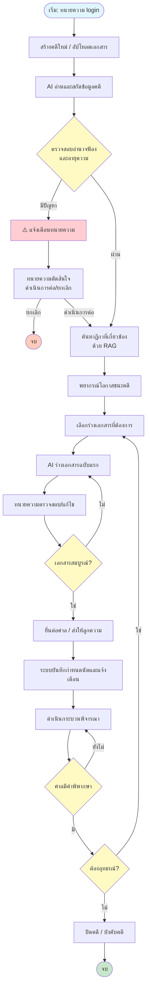

 # Civil AI Attorney (CAA)  

> **สำหรับ:** ผู้บริหาร, ทีมพัฒนา, ที่ปรึกษากฎหมาย  
> **เวอร์ชัน:** 2.0 (ปรับปรุงใหม่)  
> **วันที่:** เมษายน 2569

---

## 📌 สารบัญ

1. Executive Summary (สำหรับผู้บริหาร)  
2. ภาพรวมโครงการ  
3. Business Model Canvas (BMC)  
4. รายละเอียดโมดูลระบบ  
5. User Journey และ Workflow  
6. Flowchart หลักและ Flowchart เฉพาะทาง  
7. Template เอกสารกฎหมาย  
8. TASK LIST และ CHECKLIST  
9. แผนพัฒนา (Roadmap)  
10. ความเสี่ยงและมาตรการลดความเสี่ยง  
11. KPI และตัววัดความสำเร็จ  
12. ภาคผนวก (นิยามศัพท์, กฎหมายที่เกี่ยวข้อง)

---

## 1. Executive Summary (สำหรับผู้บริหาร)

**Civil AI Attorney (CAA)** คือแพลตฟอร์ม AI ที่ออกแบบมาเพื่อช่วยทนายความในคดีแพ่งแบบครบวงจร ประกอบด้วย 7 โมดูล ตั้งแต่การวิเคราะห์คดี การค้นหาคำพิพากษาฎีกาแบบ Semantic การร่างเอกสาร การพยากรณ์โอกาสชนะ การติดตามกำหนดเวลา การจัดการพยานหลักฐาน และการวางกลยุทธ์ก่อนสืบพยาน

**เป้าหมายสำคัญ:**
- ลดเวลาเอกสารทางกฎหมายลง **70%**
- เพิ่มความแม่นยำในการค้นหาฎีกาด้วย **Semantic Search**
- ลดความผิดพลาดเรื่องอายุความและการยื่นเอกสาร
- เพิ่มโอกาสชนะคดีด้วยการพยากรณ์และวิเคราะห์จุดอ่อน

**รูปแบบธุรกิจ:** Subscription รายเดือน/รายปี (เริ่ม 2,500 บาท/เดือน) และรุ่น On‑premise สำหรับองค์กรขนาดใหญ่

**กลุ่มเป้าหมาย:** ทนายความรายบุคคล, สำนักงานกฎหมาย, นิติกรบริษัท, ผู้ช่วยทนายความ

**สถานะโครงการ:** พร้อมเสนอขออนุมัติพัฒนา (MVP ใน 6 เดือน)

---

## 2. ภาพรวมโครงการ

### 2.1 วัตถุประสงค์ (Objectives)

| ลำดับ | วัตถุประสงค์ |
|-------|---------------|
| 1 | ลดเวลาการทำงานเอกสารทางกฎหมายของทนายความลง 70% ด้วย AI ช่วยร่างคำฟ้อง คำให้การ อุทธรณ์ ฎีกา |
| 2 | เพิ่มความแม่นยำในการค้นหาคำพิพากษาฎีกาที่เกี่ยวข้องด้วย Semantic Search แทนการใช้คำสำคัญ |
| 3 | พยากรณ์โอกาสชนะคดีเพื่อช่วยทนายความตัดสินใจรับคดีหรือเจรจาประนอมประนอม |
| 4 | ป้องกันการเสียสิทธิเนื่องจากกำหนดเวลา (อายุความ, ระยะยื่นอุทธรณ์) โดยระบบแจ้งเตือนอัตโนมัติ |
| 5 | เชื่อมต่อกับระบบศาลอิเล็กทรอนิกส์ (e-Filing) เพื่อยื่นเอกสารและรับหมายนัดโดยอัตโนมัติ |

### 2.2 กลุ่มเป้าหมาย (Customer Segments)

| กลุ่ม | รายละเอียด |
|------|-------------|
| **ทนายความรายบุคคล** | ทนายความที่เปิดสำนักงานเล็ก ต้องการเพิ่มประสิทธิภาพ ลดเวลางานเอกสาร |
| **สำนักงานกฎหมายขนาดกลาง-ใหญ่** | มีคดีจำนวนมาก ต้องการมาตรฐานเอกสารและระบบจัดการความรู้ภายใน |
| **นิติกรประจำองค์กร** | บริษัทมหาชน รัฐวิสาหกิจ ที่มีคดีแพ่งจำนวนมาก ต้องการวิเคราะห์ความเสี่ยง |
| **ผู้ช่วยทนายความ (paralegal)** | ต้องการเครื่องมือช่วยค้นคว้าฎีกาและร่างเอกสารเบื้องต้น |
| **ผู้พิพากษาหรือผู้ช่วยผู้พิพากษา** | ใช้วิเคราะห์ประเด็นและตรวจสอบคำพิพากษา (optional) |

### 2.3 ความรู้พื้นฐานที่ผู้ใช้ต้องมี

- กฎหมายวิธีพิจารณาความแพ่ง (เข้าใจขั้นตอนฟ้อง การยื่นคำให้การ การสืบพยาน การอุทธรณ์)
- กฎหมายแพ่ง (สัญญา ละเมิด ทรัพย์สิน ครอบครัว มรดก หนี้)
- การใช้คอมพิวเตอร์พื้นฐาน (อัปโหลด PDF, พิมพ์, ใช้เว็บเบราว์เซอร์)

---

## 3. Business Model Canvas (BMC)

| # | องค์ประกอบ | รายละเอียด |
|---|-------------|-------------|
| **1** | **กลุ่มลูกค้า** | ทนายความรายบุคคล, สำนักงานกฎหมาย, นิติกรบริษัท, ผู้ช่วยทนายความ |
| **2** | **คุณค่าเสนอ** | ลดเวลาเตรียมเอกสาร, ค้นหาฎีกาแม่นยำ, พยากรณ์ผลคดี, เตือนกำหนดเวลาอัตโนมัติ, รองรับ e-Filing |
| **3** | **ช่องทาง** | Web App, LINE Official Account, REST API, Mobile App (ระยะที่ 2) |
| **4** | **ความสัมพันธ์กับลูกค้า** | ทดลองใช้ฟรี 14 วัน, อบรมออนไลน์, ทีมสนับสนุนแชท/โทร, ฐานความรู้ |
| **5** | **รายได้** | Subscription 2,500 บาท/เดือน (รายปีลด 20%), On‑premise ค่าลิขสิทธิ์, บริการเทรนโมเดลเพิ่มเติม |
| **6** | **ทรัพยากรหลัก** | ทีมพัฒนา Full‑stack/AI, ทีมนักกฎหมาย, ฐานข้อมูลฎีกา 50,000+ ฉบับ, Cloud (AWS/GCP), API OpenAI/Anthropic |
| **7** | **กิจกรรมหลัก** | พัฒนาโมเดล AI และ RAG, ทำความสะอาดข้อมูลฎีกา, สร้างเทมเพลต, ดูแลระบบและความปลอดภัย, การตลาด |
| **8** | **พันธมิตร** | สำนักงานศาลยุติธรรม (e-Filing), เนติบัณฑิตยสภา, ผู้ให้บริการ Cloud, บริษัทกฎหมายชั้นนำ |
| **9** | **ต้นทุน** | ค่าแรงพัฒนา (40%), ค่า Server & API LLM (30%), การตลาด (15%), เก็บข้อมูลฎีกา (10%), สำนักงาน (5%) |

---

## 4. รายละเอียดโมดูลระบบ (7 โมดูล)

| บทที่ | ชื่อโมดูล | หน้าที่หลัก |
|-------|-----------|-------------|
| 1 | **Legal Intake & Analysis** | รับเรื่อง, วิเคราะห์คำฟ้อง, ตรวจสอบอำนาจฟ้องและอายุความ |
| 2 | **Document Generator** | สร้างร่างเอกสารทางกฎหมาย (คำฟ้อง, คำให้การ, อุทธรณ์, ฎีกา, คำร้อง) |
| 3 | **Case Law RAG** | ค้นหาคำพิพากษาฎีกาที่เกี่ยวข้องแบบ semantic พร้อม citation |
| 4 | **Predictive Analytics** | พยากรณ์โอกาสชนะคดี (%) โดยใช้ Machine Learning |
| 5 | **Timeline & Deadline Tracker** | คำนวณกำหนดเวลา, แจ้งเตือนทางอีเมล/LINE, ปฏิทินคดี |
| 6 | **Evidence Management** | จัดเก็บพยานหลักฐาน, สรุปประเด็น, แนะนำคำถามนำ/ถามค้าน |
| 7 | **Pre‑trial & Strategy** | วางกลยุทธ์, เตรียมการชี้สองสถาน, วิเคราะห์จุดแข็ง/จุดอ่อน |

---

## 5. User Journey และ Workflow หลัก

### 5.1 User Journey แบบย่อ

1. **ล็อกอิน** → สร้างคดีใหม่หรือเลือกคดีเก่า  
2. **อัปโหลดเอกสาร** (คำฟ้อง, สัญญา, หนังสือทวงถาม)  
3. **ระบบวิเคราะห์** → แสดงประเด็น กฎหมายที่เกี่ยวข้อง อายุความ  
4. **ค้นหาฎีกา** → Semantic search ได้ผลลัพธ์เรียงตามความเกี่ยวข้อง  
5. **พยากรณ์โอกาสชนะ** → รายงานเปอร์เซ็นต์และปัจจัยเสี่ยง  
6. **ร่างเอกสาร** → เลือกประเภท (คำให้การ/อุทธรณ์) → AI ร่าง → ทนายแก้ไข  
7. **ส่งหรือยื่น** → e-Filing หรือดาวน์โหลด PDF/Word  
8. **ติดตามกำหนดเวลา** → ระบบแจ้งเตือนอัตโนมัติทาง LINE/อีเมล  

### 5.2 Workflow Diagram หลัก (Main Workflow)



---

## 6. Flowchart เฉพาะทาง (สำหรับคดีแต่ละประเภท)

### 6.1 คดีทรัพย์สินทางปัญญา (ละเมิดลิขสิทธิ์โปรแกรมคอมพิวเตอร์)

```mermaid
flowchart TB
    Start([เริ่ม: โจทก์พบการละเมิดลิขสิทธิ์]) --> Step1[รวบรวมพยานหลักฐาน<br>- เอกสารจดทะเบียนลิขสิทธิ์<br>- หลักฐานการทำซ้ำ/เผยแพร่<br>- พยานบุคคล]
    Step1 --> Step2{แจ้งความดำเนินคดีอาญา?}
    Step2 -->|ใช่| Step3[แจ้งความต่อพนักงานสอบสวน<br>เพื่อขอให้ตรวจค้นและยึดของกลาง]
    Step3 --> Step4[พนักงานสอบสวนส่งสำนวนให้อัยการ]
    Step4 --> Step5[อัยการยื่นฟ้องคดีอาญาต่อศาลทรัพย์สินทางปัญญาฯ]
    Step2 -->|ไม่| Step6[ยื่นฟ้องคดีแพ่งโดยตรง]
    Step5 --> Step6
    Step6 --> Step7[ยื่นคำฟ้องคดีแพ่ง<br>พร้อมแนบเอกสารและรายการพยาน]
    Step7 --> Step8[ศาลไต่สวนมูลฟ้อง]
    Step8 --> Step9{รับฟ้อง?}
    Step9 -->|ไม่| End1([จบ])
    Step9 -->|รับ| Step10[ส่งหมายเรียก + สำเนาคำฟ้องให้จำเลย]
    Step10 --> Step11[จำเลยยื่นคำให้การ (ภายใน 15 วัน)]
    Step11 --> Step12[ชี้สองสถาน – กำหนดประเด็น]
    Step12 --> Step13[สืบพยานโจทก์และจำเลย]
    Step13 --> Step14[ศาลมีคำพิพากษา]
    Step14 --> Step15{พอใจ?}
    Step15 -->|ไม่| Step16[อุทธรณ์ต่อศาลอุทธรณ์คดีชำนัญพิเศษ]
    Step16 --> Step17[ศาลอุทธรณ์พิพากษา]
    Step17 --> Step18{พอใจ?}
    Step18 -->|ไม่| Step19[ฎีกาต่อศาลฎีกาแผนกคดีทรัพย์สินทางปัญญาฯ]
    Step19 --> Step20[คำพิพากษาศาลฎีกาเป็นที่สุด]
    Step15 -->|ใช่| End2([สิ้นสุด])
    Step18 -->|ใช่| End2
    Step20 --> End2
```

### 6.2 คดีการค้าระหว่างประเทศ (รับขนของทางทะเล – สินค้าเสียหาย)

```mermaid
flowchart TB
    Start([เริ่ม: สินค้าเสียหายเมื่อถึงปลายทาง]) --> Step1[แจ้งเหตุต่อผู้ขนส่ง/ตัวแทน<br>และจัดทำรายงานการตรวจสภาพ (Survey Report)]
    Step1 --> Step2[เก็บหลักฐาน:<br>- ใบตราส่ง (Bill of Lading)<br>- ใบส่งของ/ใบกำกับสินค้า<br>- ภาพถ่ายความเสียหาย]
    Step2 --> Step3[ตรวจสอบสัญญา/กฎหมายที่ใช้บังคับ<br>เช่น CISG, Hague-Visby Rules]
    Step3 --> Step4[ส่งหนังสือทวงถามไปยังผู้ขนส่ง]
    Step4 --> Step5{ได้รับคำตอบ?}
    Step5 -->|ปฏิเสธ| Step6[ปรึกษาทนายความเฉพาะทาง]
    Step5 -->|ยินยอม| End1([เจรจา/ประนีประนอม])
    Step6 --> Step7[ยื่นฟ้องต่อศาลทรัพย์สินทางปัญญาและการค้าระหว่างประเทศกลาง]
    Step7 --> Step8[ยื่นคำฟ้องพร้อมแนบเอกสาร]
    Step8 --> Step9[ศาลไต่สวนมูลฟ้อง]
    Step9 --> Step10[รับฟ้อง – ส่งหมายเรียกให้จำเลย]
    Step10 --> Step11[จำเลยยื่นคำให้การ (อาจยกข้อต่อสู้เช่น เหตุสุดวิสัย)]
    Step11 --> Step12[ชี้สองสถาน – กำหนดประเด็น]
    Step12 --> Step13[สืบพยาน (ผู้เชี่ยวชาญ, รายงานตรวจสภาพ)]
    Step13 --> Step14[ศาลมีคำพิพากษา]
    Step14 --> Step15{อุทธรณ์?}
    Step15 -->|ใช่| Step16[อุทธรณ์ต่อศาลอุทธรณ์คดีชำนัญพิเศษ]
    Step16 --> Step17[ศาลอุทธรณ์พิพากษา]
    Step17 --> Step18{ฎีกา?}
    Step18 -->|ใช่| Step19[ฎีกาต่อศาลฎีกา]
    Step19 --> End2([สิ้นสุด])
    Step15 -->|ไม่| End2
    Step18 -->|ไม่| End2
```

### 6.3 คดีผู้บริโภค (รถยนต์เช่าซื้อชำรุดบกพร่อง)

```mermaid
flowchart TB
    Start([เริ่ม: ผู้บริโภคได้รับความเสียหาย]) --> Step1[รวบรวมหลักฐาน:<br>- สัญญาเช่าซื้อ/สัญญาซื้อ<br>- ใบรับประกัน<br>- บันทึกการเข้ารับบริการ (Job Sheet)]
    Step1 --> Step2[แจ้งเรื่องไปยังผู้ประกอบการ]
    Step2 --> Step3{ได้รับการแก้ไข?}
    Step3 -->|ใช่| End1([จบ])
    Step3 -->|ไม่| Step4[ยื่นฟ้องด้วยวาจาหรือเป็นหนังสือ<br>ต่อศาลแพ่งแผนกคดีผู้บริโภค]
    Step4 --> Step5[เสียค่าธรรมเนียมศาลอัตราพิเศษ (ต่ำ)]
    Step5 --> Step6[ศาลรับคำฟ้องและส่งหมายเรียก]
    Step6 --> Step7[จำเลยยื่นคำให้การ]
    Step7 --> Step8[ศาลพยายามไกล่เกลี่ยก่อนการพิจารณา]
    Step8 --> Step9{ไกล่เกลี่ยสำเร็จ?}
    Step9 -->|ใช่| End2([จบ])
    Step9 -->|ไม่| Step10[ชี้สองสถาน – กำหนดประเด็น]
    Step10 --> Step11[สืบพยาน (ภาระการพิสูจน์ตกแก่ผู้ประกอบการ)]
    Step11 --> Step12[ศาลมีคำพิพากษา]
    Step12 --> Step13{พอใจ?}
    Step13 -->|ไม่| Step14[อุทธรณ์ต่อศาลอุทธรณ์แผนกคดีผู้บริโภค]
    Step14 --> Step15[ฎีกาต่อศาลฎีกา (ถ้ามีปัญหาข้อกฎหมาย)]
    Step13 -->|ใช่| End3([สิ้นสุด])
    Step15 --> End3
```

### 6.4 การฟ้องคดีแบบกลุ่ม (Class Action – รถโดยสารแก๊สระเบิด)

```mermaid
flowchart TB
    Start([เริ่ม: มีผู้เสียหายจำนวนมาก]) --> Step1[รวมกลุ่มผู้เสียหาย<br>และเลือกโจทก์ตัวแทน (Lead Plaintiff)]
    Step1 --> Step2[รวบรวมรายชื่อสมาชิกกลุ่ม<br>และเอกสารความเสียหาย]
    Step2 --> Step3[ยื่นคำร้องขอให้ดำเนินคดีแบบกลุ่ม<br>ต่อศาลแพ่ง]
    Step3 --> Step4[ศาลไต่สวนคำร้อง]
    Step4 --> Step5{ศาลอนุญาต?}
    Step5 -->|ไม่| Step6[ดำเนินคดีเป็นรายบุคคล]
    Step5 -->|อนุญาต| Step7[ศาลมีคำสั่งประกาศแจ้งสมาชิกกลุ่ม]
    Step7 --> Step8[สมาชิกมีสิทธิขอออกจากกลุ่ม (Opt-out)]
    Step8 --> Step9[ยื่นคำฟ้องโดยโจทก์ตัวแทน]
    Step9 --> Step10[จำเลยยื่นคำให้การต่อสู้]
    Step10 --> Step11[ศาลดำเนินการชี้สองสถาน]
    Step11 --> Step12[สืบพยาน]
    Step12 --> Step13[ศาลมีคำพิพากษา]
    Step13 --> Step14{คำพิพากษาผูกพันสมาชิกกลุ่ม}
    Step14 --> Step15[แบ่งเงินค่าเสียหายให้สมาชิก]
    Step15 --> Step16{มีอุทธรณ์/ฎีกา?}
    Step16 -->|ใช่| Step17[ดำเนินการตามกฎหมาย]
    Step16 -->|ไม่| End1([สิ้นสุด])
    Step6 --> End1
    Step17 --> End1
```

---

## 7. Template เอกสารกฎหมาย (สำหรับคดีตัวอย่าง)

### 7.1 Template คำฟ้องคดีละเมิดลิขสิทธิ์โปรแกรมคอมพิวเตอร์

```
คำฟ้อง
คดีแพ่งหมายเลขดำที่ ........../..........

ระหว่าง
บริษัท เอ จำกัด ที่อยู่ .......................... โจทก์
กับ
นายสมชาย ที่อยู่ .......................... จำเลย

เรื่อง ละเมิดลิขสิทธิ์โปรแกรมคอมพิวเตอร์ เรียกค่าเสียหาย

คำขอท้ายฟ้อง
๑. ขอให้พิพากษาว่า โปรแกรมคอมพิวเตอร์ระบบบัญชี “ACC-Master” เป็นงานอันมีลิขสิทธิ์ของโจทก์
๒. ขอให้พิพากษาว่า จำเลยกระทำละเมิดลิขสิทธิ์ของโจทก์ โดยการทำซ้ำ ดัดแปลง และเผยแพร่
   โปรแกรมดังกล่าวโดยไม่ได้รับอนุญาต
๓. ขอให้จำเลยชดใช้ค่าเสียหายเป็นเงิน .......................... บาท พร้อมดอกเบี้ย
   อัตราร้อยละ 7.5 ต่อปี นับถัดจากวันฟ้องจนกว่าจะชำระเสร็จ
๔. ขอให้ห้ามจำเลยและบริวารกระทำการละเมิดลิขสิทธิ์ของโจทก์อีกต่อไป
๕. ขอให้จำเลยส่งมอบหรือทำลายโปรแกรมคอมพิวเตอร์และสื่อทุกชนิดที่มีการละเมิดลิขสิทธิ์

(ลงชื่อ) .......................... โจทก์
(..........................)
(ลงชื่อ) .......................... ทนายความ
(..........................)

รายการพยาน
๑. เอกสารการจดทะเบียนลิขสิทธิ์โปรแกรมคอมพิวเตอร์
๒. สัญญาจ้างพัฒนาโปรแกรมระหว่างโจทก์กับผู้พัฒนา
๓. เอกสารการอนุญาตให้ใช้สิทธิ (Licensing Agreement)
๔. ภาพถ่ายและคลิปวิดีโอแสดงการทำซ้ำโดยจำเลย
๕. พยานบุคคล คือ นาย............ ผู้เชี่ยวชาญด้านซอฟต์แวร์
```

### 7.2 Template คำให้การคดีละเมิดลิขสิทธิ์ (สำหรับจำเลย)

```
คำให้การ
คดีแพ่งหมายเลขดำที่ ........../..........

ระหว่าง
บริษัท เอ จำกัด โจทก์
กับ
นายสมชาย จำเลย

จำเลยขอให้การต่อคดีนี้ว่า

๑. จำเลยปฏิเสธข้อกล่าวหาทั้งหมด
๒. โปรแกรมคอมพิวเตอร์ที่จำเลยใช้เป็นโปรแกรมที่จำเลยพัฒนาขึ้นเอง มิได้ลอกเลียนแบบของโจทก์
   และโจทก์ไม่มีสิทธิในโปรแกรมดังกล่าวตามกฎหมาย
๓. การกระทำของจำเลยไม่เป็นการละเมิดลิขสิทธิ์ เพราะเข้าข้อยกเว้นตาม พ.ร.บ. ลิขสิทธิ์ มาตรา ............
๔. โจทก์ไม่มีอำนาจฟ้อง เพราะไม่ใช่ผู้สร้างสรรค์หรือเจ้าของลิขสิทธิ์โดยชอบ
๕. ค่าเสียหายที่โจทก์เรียกสูงเกินความจริง

จึงขอให้ศาลยกฟ้อง

(ลงชื่อ) .......................... จำเลย
(..........................)
(ลงชื่อ) .......................... ทนายความจำเลย
(..........................)
```

### 7.3 Template คำฟ้องคดีผู้บริโภค (รถยนต์ชำรุดบกพร่อง)

```
คำฟ้อง
คดีผู้บริโภคหมายเลขดำที่ ........../..........

ระหว่าง
นายสมชาย ที่อยู่ .......................... โจทก์
กับ
บริษัทผู้ผลิต จำกัด ที่อยู่ .......................... จำเลยที่ ๑
บริษัทตัวแทนจำหน่าย จำกัด ที่อยู่ .......................... จำเลยที่ ๒

เรื่อง สินค้าชำรุดบกพร่อง เรียกค่าเสียหาย

คำขอท้ายฟ้อง
๑. ขอให้พิพากษาให้จำเลยทั้งสองร่วมกันซ่อมแซมรถยนต์ ยี่ห้อ ..... ทะเบียน ..... ให้อยู่ในสภาพที่ใช้การได้ดี
๒. หากจำเลยไม่สามารถซ่อมแซมให้ดีได้ ขอให้รับรถคืนและคืนเงินค่าเช่าซื้อที่โจทก์ชำระไปแล้ว
   พร้อมดอกเบี้ย
๓. ขอให้จำเลยชดใช้ค่าเสียหายเป็นเงิน .......................... บาท
๔. ขอให้จำเลยใช้ค่าฤชาธรรมเนียมแทนโจทก์

(ลงชื่อ) .......................... โจทก์
(..........................)

หมายเหตุ โจทก์ขอใช้สิทธิยื่นฟ้องด้วยวาจา (ถ้าต้องการ) ต่อศาล ตาม พ.ร.บ. วิธีพิจารณาคดีผู้บริโภค
```

### 7.4 Template คำร้องขอและคำฟ้องคดีแบบกลุ่ม

**ส่วนที่ 1 – คำร้องขอให้ดำเนินคดีแบบกลุ่ม**

```
คำร้องขอให้ดำเนินคดีแบบกลุ่ม
คดีแพ่งหมายเลขดำที่ ........../..........

เรื่อง ขอให้ศาลอนุญาตดำเนินคดีแบบกลุ่ม

นางสาวเอ (โจทก์ตัวแทน) ยื่นคำร้องนี้ขอให้ศาลมีคำสั่งอนุญาตให้ดำเนินคดีนี้แบบกลุ่ม
โดยมีเหตุผลดังนี้

๑. โจทก์เป็นสมาชิกกลุ่มเดียวกับผู้เสียหายอื่นซึ่งมีจำนวนมากกว่า .......... คน
๒. สมาชิกกลุ่มมีประเด็นข้อเท็จจริงและข้อกฎหมายร่วมกัน คือ ความเสียหายที่เกิดจาก
   การระเบิดของรถโดยสารแก๊ส NGV ของจำเลย
๓. การใช้โจทก์ตัวแทนเป็นวิธีการที่ยุติธรรมและมีประสิทธิภาพ
๔. โจทก์ตัวแทนมีทนายความที่มีความพร้อม

จึงขอให้ศาลอนุญาต

(ลงชื่อ) .......................... ผู้ร้อง (โจทก์ตัวแทน)
(..........................)
```

**ส่วนที่ 2 – คำฟ้อง (หลังจากศาลอนุญาต)**

```
คำฟ้อง (คดีแบบกลุ่ม)
ระหว่าง
นางสาวเอ กับพวก (โจทก์ตัวแทนและสมาชิกกลุ่ม) โจทก์
กับ
บริษัทขนส่ง จำกัด จำเลย

เรื่อง ละเมิดเรียกค่าเสียหาย

คำขอท้ายฟ้อง
๑. ขอให้จำเลยชดใช้ค่าเสียหายแก่โจทก์และสมาชิกกลุ่ม เป็นเงินรวม ............... บาท
๒. ขอให้จำเลยใช้ค่าฤชาธรรมเนียมแทนโจทก์

(ลงชื่อ) .......................... โจทก์ตัวแทน
(..........................)
```

---

## 8. TASK LIST และ CHECKLIST

### 8.1 TASK LIST Template

| Task ID | งาน (Task) | ผู้รับผิดชอบ | กำหนดแล้วเสร็จ | สถานะ | หมายเหตุ |
|---------|-------------|--------------|----------------|--------|-----------|
| CAA-001 | อัปโหลดคำฟ้องและเอกสารที่เกี่ยวข้อง | ผู้ช่วยทนาย | วันที่รับเรื่อง | ☐ ยังไม่เริ่ม | - |
| CAA-002 | วิเคราะห์ประเด็นข้อพิพาทและอายุความ | ทนายความ | +1 วัน | ☐ ยังไม่เริ่ม | ใช้ AI ช่วย |
| CAA-003 | ค้นหาฎีกาที่เกี่ยวข้อง (อย่างน้อย 5 ฉบับ) | ผู้ช่วยทนาย | +2 วัน | ☐ ยังไม่เริ่ม | ใช้ RAG |
| CAA-004 | ร่างคำให้การ / ฟ้องแย้ง | AI + ทนาย | +5 วัน | ☐ ยังไม่เริ่ม | ใช้ Document Generator |
| CAA-005 | ตรวจสอบและแก้ไขคำให้การฉบับสุดท้าย | ทนายความ | +7 วัน | ☐ ยังไม่เริ่ม | - |
| CAA-006 | ยื่นคำให้การต่อศาล (e-Filing หรือไปส่ง) | ผู้ช่วยทนาย | ภายใน 15 วันนับรับหมาย | ☐ ยังไม่เริ่ม | - |
| CAA-007 | เตรียมบัญชีระบุพยานและสรุปประเด็นสืบ | ทนายความ | ก่อนชี้สองสถาน 7 วัน | ☐ ยังไม่เริ่ม | - |
| CAA-008 | ติดตามวันนัดและแจ้งเตือนลูกความ | ระบบอัตโนมัติ | ต่อเนื่อง | ☐ อัตโนมัติ | - |

### 8.2 CHECKLIST Template

#### ✅ ก่อนยื่นคำฟ้อง
- [ ] โจทก์มีอำนาจฟ้อง (เป็นผู้เสียหาย, ทายาท, หรือตัวการ)
- [ ] ไม่ขาดอายุความ (ตรวจสอบวันที่เกิดเหตุและวันที่ฟ้อง)
- [ ] ยื่นต่อศาลที่มีเขตอำนาจ (ตามทุนทรัพย์และสถานที่เกิดเหตุ)
- [ ] เสียค่าธรรมเนียมศาลถูกต้อง
- [ ] คำฟ้องมีข้อความครบตาม ป.วิ.พ. มาตรา 172
- [ ] แนบสำเนาเอกสารประกอบคำฟ้องครบ

#### ✅ ก่อนยื่นคำให้การ
- [ ] ยื่นภายใน 15 วันนับแต่วันได้รับหมายเรียก (มาตรา 177)
- [ ] คำให้การระบุข้อต่อสู้ชัดเจน ไม่เคลือบคลุม
- [ ] หากมีฟ้องแย้ง ให้ยื่นพร้อมคำให้การ
- [ ] จัดส่งสำเนาคำให้การให้โจทก์ (หรือให้ศาลส่ง)

#### ✅ ก่อนวันสืบพยาน
- [ ] บัญชีระบุพยานยื่นก่อนวันสืบไม่น้อยกว่า 7 วัน
- [ ] พยานเอกสารเตรียมต้นฉบับและสำเนา
- [ ] เตรียมคำถามนำสำหรับพยานของตน
- [ ] เตรียมคำถามค้านสำหรับพยานคู่ความ
- [ ] แจ้งเตือนพยานบุคคลให้มาในวันนัด

#### ✅ ก่อนยื่นอุทธรณ์ / ฎีกา
- [ ] ยื่นภายใน 1 เดือนนับแต่วันอ่านคำพิพากษา (มาตรา 225)
- [ ] ตรวจสอบว่าคดีต้องห้ามอุทธรณ์ในข้อเท็จจริงหรือไม่ (ทุนทรัพย์ ≤ 50,000 บาท)
- [ ] ชำระค่าธรรมเนียมอุทธรณ์หรือวางประกันตามที่ศาลกำหนด
- [ ] อุทธรณ์ระบุข้อกฎหมายและข้อเท็จจริงที่โต้แย้งอย่างชัดเจน

---

## 9. แผนพัฒนา (Roadmap)

| ระยะ | เวลา | กิจกรรมหลัก | ผลลัพธ์ (Deliverables) |
|------|------|-------------|------------------------|
| **ระยะที่ 0** | เดือน 1-2 | เตรียมการและออกแบบ | รวบรวมฐานข้อมูลฎีกา 50,000 ฉบับ, ออกแบบสถาปัตยกรรมระบบ, รับรองข้อกำหนดกับทีมกฎหมาย |
| **ระยะที่ 1 (MVP)** | เดือน 3-6 | พัฒนาโมดูลหลัก 3 โมดูล | Intake & Analysis, Document Generator, Case Law RAG (web app พร้อม LINE Notify) |
| **ระยะที่ 2** | เดือน 7-9 | เพิ่ม Predictive Analytics และ Deadline Tracker | พยากรณ์โอกาสชนะ, ปฏิทินและแจ้งเตือนอัตโนมัติ |
| **ระยะที่ 3** | เดือน 10-12 | Evidence Management + Pre‑trial Strategy | จัดการพยาน, แนะนำคำถาม, วิเคราะห์จุดแข็ง/จุดอ่อน |
| **ระยะที่ 4** | เดือน 13-15 | เชื่อมต่อ e-Filing, Mobile App (iOS/Android) | ยื่นเอกสารอัตโนมัติ, รองรับมือถือ |
| **ระยะที่ 5** | เดือน 16-18 | ทดสอบระบบ, อบรมผู้ใช้, เปิดให้บริการจริง | Pilot กับสำนักงานกฎหมาย 5 แห่ง, เปิด Subscription |

---

## 10. ความเสี่ยงและมาตรการลดความเสี่ยง

| ความเสี่ยง | โอกาส | ผลกระทบ | มาตรการลดความเสี่ยง |
|------------|--------|----------|----------------------|
| **ข้อมูลฎีกาไม่เพียงพอหรือมีคุณภาพต่ำ** | ปานกลาง | สูง | ร่วมมือกับเนติบัณฑิตยสภาและศาลฎีกา, ใช้ OCR + ผู้ตรวจทานข้อมูล |
| **โมเดล AI ให้คำตอบที่ผิดกฎหมาย** | สูง | รุนแรง | ใส่ระบบ human-in-the-loop, ทนายตรวจสอบทุกครั้ง, แสดงข้อความเตือน |
| **การเชื่อมต่อ e-Filing ไม่ได้รับอนุญาต** | ต่ำ | สูง | เจรจากับสำนักงานศาลยุติธรรมล่วงหน้า, รองรับการดาวน์โหลด/อัปโหลดไฟล์แทน API |
| **คู่แข่งรายใหม่ที่มีราคาถูกกว่า** | ปานกลาง | ปานกลาง | สร้างฐานข้อมูลฎีกาเฉพาะ, พัฒนา RAG ให้แม่นยำ, บริการหลังการขายที่ดี |
| **การยอมรับของผู้ใช้ (ทนายความ)** | ปานกลาง | ปานกลาง | ทดลองใช้ฟรี 14 วัน, จัดอบรม, มีทีมสนับสนุนภาษาไทย, ปรับ UI ให้ง่าย |
| **ต้นทุน API สูงเกินคาด** | ปานกลาง | ปานกลาง | ใช้ open-source model (Llama 3, Mistral) ร่วมกับ API, cache ผลลัพธ์ |

---

## 11. KPI และตัววัดความสำเร็จ

| KPI | เป้าหมาย | วิธีการวัด |
|-----|----------|------------|
| **เวลาที่ใช้ในการร่างเอกสาร** | ลดลง 70% | จับเวลาเปรียบเทียบก่อน-หลังใช้ระบบ |
| **ความแม่นยำในการค้นหาฎีกา** | Precision@10 ≥ 0.85 | ทนายความประเมินความเกี่ยวข้องของ 10 อันดับแรก |
| **อัตราการแจ้งเตือนกำหนดเวลาถูกต้อง** | 100% | ระบบ log + ทนายยืนยัน |
| **ความพึงพอใจของผู้ใช้** | NPS ≥ 50 | แบบสอบถาม NPS รายไตรมาส |
| **จำนวนคดีที่ระบบช่วยวิเคราะห์** | ≥ 1,000 คดี/เดือน (หลังปีแรก) | ระบบบันทึกการใช้งาน |
| **อัตราการต่ออายุสมาชิก** | ≥ 85% | ข้อมูลการเรียกเก็บเงิน |

---

## 12. ภาคผนวก

### 12.1 นิยามศัพท์

| คำศัพท์ | นิยาม |
|---------|--------|
| **CAA** | Civil AI Attorney – ระบบ AI สำหรับทนายความในคดีแพ่ง |
| **Intake** | ขั้นตอนการรับและวิเคราะห์ข้อมูลคดีเบื้องต้น |
| **RAG** | Retrieval-Augmented Generation – เทคนิคการค้นหาเอกสารแล้วให้ AI สร้างคำตอบ |
| **Semantic Search** | การค้นหาตามความหมาย ไม่ใช่แค่คำตรง |
| **LLM** | Large Language Model – โมเดลภาษาใหญ่ เช่น GPT-4 |
| **Vector Database** | ฐานข้อมูลที่เก็บเอกสารในรูปแบบเวกเตอร์สำหรับค้นหาเชิงความหมาย |
| **Pre-trial** | การชี้สองสถาน – กระบวนการก่อนสืบพยานเพื่อกำหนดประเด็น |
| **Statute of Limitations** | อายุความ – ระยะเวลาที่กฎหมายกำหนดให้ใช้สิทธิฟ้องคดี |
| **e-Filing** | ระบบยื่นเอกสารอิเล็กทรอนิกส์ต่อศาล |
| **ฎีกา** | คำพิพากษาศาลฎีกา (Supreme Court precedent) |

### 12.2 กฎหมายที่เกี่ยวข้อง (อ้างอิงโดยย่อ)

- **ประมวลกฎหมายวิธีพิจารณาความแพ่ง** มาตรา 172, 177, 225 (อายุความ, การยื่นคำให้การ, การอุทธรณ์)
- **พระราชบัญญัติลิขสิทธิ์ พ.ศ. 2537** และแก้ไขเพิ่มเติม (มาตรา 4, มาตรา 31)
- **พระราชบัญญัติวิธีพิจารณาคดีผู้บริโภค พ.ศ. 2551** (มาตรา 12, การยื่นฟ้องด้วยวาจา)
- **พระราชบัญญัติการรับขนของทางทะเล พ.ศ. 2534**
- **ประมวลกฎหมายแพ่งและพาณิชย์** บรรพ 1-6 (โดยเฉพาะสัญญา ละเมิด หนี้ ทรัพย์สิน)

---

## ✅ สรุปสิ่งที่จัดทำใหม่ทั้งหมด

| รายการ | สถานะ |
|--------|--------|
| จัดรูปแบบเอกสารใหม่ พร้อมสารบัญ | ✅ เสร็จ |
| Executive Summary สำหรับผู้บริหาร | ✅ เสร็จ |
| BMC ครบ 9 ช่อง | ✅ เสร็จ |
| รายละเอียด 7 โมดูล | ✅ เสร็จ |
| User Journey + Workflow Diagram หลัก | ✅ เสร็จ |
| Flowchart เฉพาะทาง 4 ประเภท | ✅ เสร็จ |
| Template คำฟ้อง/คำให้การ/คำร้อง (4 ชุด) | ✅ เสร็จ |
| TASK LIST + CHECKLIST | ✅ เสร็จ |
| Roadmap 5 ระยะ | ✅ เสร็จ |
| ความเสี่ยงและมาตรการ | ✅ เสร็จ |
| KPI และตัววัดความสำเร็จ | ✅ เสร็จ |
| ภาคผนวก (นิยามศัพท์, กฎหมายที่เกี่ยวข้อง) | ✅ เสร็จ |

--- 
