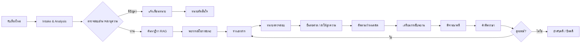
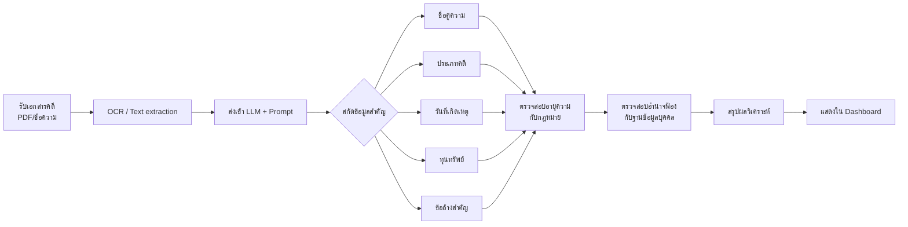
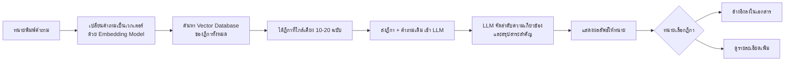
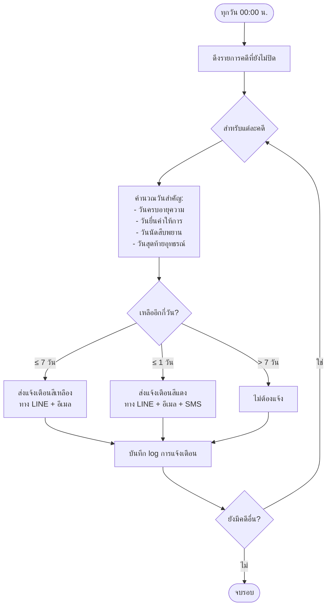

## 📘 เอกสารโครงการระบบ AI สำหรับทนายความในคดีแพ่งแบบครบวงจร  
### Civil AI Attorney (CAA) – Design & Implementation Package

> **หมายเหตุ:** เอกสารนี้เป็นส่วนของ **ข้อเสนอโครงการ (Project Proposal)** และ **เอกสารประกอบการออกแบบ** ไม่มีโค้ดโปรแกรม ใช้สำหรับนำเสนอผู้บริหารหรือทีมพัฒนา เพื่อเตรียมความพร้อมก่อนลงมือพัฒนา

---

## 🧩 ส่วนที่ 1: ส่วนเสนอโครงการ (Business Model Canvas + รายละเอียด)

### 1. วัตถุประสงค์ (Objectives)

| ลำดับ | วัตถุประสงค์ |
|-------|---------------|
| 1 | ลดเวลาการทำงานเอกสารทางกฎหมายของทนายความลง 70% ด้วย AI ช่วยร่างคำฟ้อง คำให้การ อุทธรณ์ ฎีกา |
| 2 | เพิ่มความแม่นยำในการค้นหาคำพิพากษาฎีกาที่เกี่ยวข้องด้วย Semantic Search แทนการใช้คำสำคัญ |
| 3 | พยากรณ์โอกาสชนะคดีเพื่อช่วยทนายความตัดสินใจรับคดีหรือเจรจาประนอมประนอม |
| 4 | ป้องกันการเสียสิทธิเนื่องจากกำหนดเวลา (อายุความ, ระยะยื่นอุทธรณ์) โดยระบบแจ้งเตือนอัตโนมัติ |
| 5 | เชื่อมต่อกับระบบศาลอิเล็กทรอนิกส์ (e-Filing) เพื่อยื่นเอกสารและรับหมายนัดโดยอัตโนมัติ |

### 2. กลุ่มเป้าหมาย (Customer Segments)

| กลุ่ม | รายละเอียด |
|------|-------------|
| **ทนายความรายบุคคล** | ทนายความที่เปิดสำนักงานเล็ก ต้องการเพิ่มประสิทธิภาพ ลดเวลางานเอกสาร |
| **สำนักงานกฎหมายขนาดกลาง-ใหญ่** | มีคดีจำนวนมาก ต้องการมาตรฐานเอกสารและระบบจัดการความรู้ภายใน |
| **นิติกรประจำองค์กร** | บริษัทมหาชน รัฐวิสาหกิจ ที่มีคดีแพ่งจำนวนมาก ต้องการวิเคราะห์ความเสี่ยง |
| **ผู้ช่วยทนายความ (paralegal)** | ต้องการเครื่องมือช่วยค้นคว้าฎีกาและร่างเอกสารเบื้องต้น |
| **ผู้พิพากษาหรือผู้ช่วยผู้พิพากษา** | ใช้วิเคราะห์ประเด็นและตรวจสอบคำพิพากษา (optional) |

### 3. ความรู้พื้นฐานที่ผู้ใช้ต้องมี (Prerequisite Knowledge)

| หัวข้อ | รายละเอียด |
|--------|-------------|
| **กฎหมายวิธีพิจารณาความแพ่ง** | เข้าใจขั้นตอนฟ้อง การยื่นคำให้การ การสืบพยาน การอุทธรณ์ การบังคับคดี |
| **กฎหมายแพ่ง** | รู้จักสัญญา ละเมิด ทรัพย์สิน ครอบครัว มรดก หนี้ |
| **การใช้คอมพิวเตอร์พื้นฐาน** | การอัปโหลดไฟล์ PDF, การพิมพ์, การใช้เว็บเบราว์เซอร์ |
| **ภาษาอังกฤษ (optional)** | เนื่องจากบาง UI อาจมีศัพท์เทคนิคภาษาอังกฤษ |

### 4. เนื้อหาโดยย่อ (กระชับ เน้นวัตถุประสงค์และประโยชน์)

ระบบ Civil AI Attorney เป็น **แพลตฟอร์มช่วยทนายความในคดีแพ่งครบวงจร** ประกอบด้วย 7 โมดูลหลัก:

1. **Intake & Analysis** – อ่านคำฟ้อง/เอกสาร สกัดประเด็น ตรวจสอบอำนาจฟ้องและอายุความ
2. **Document Generator** – ร่างคำฟ้อง คำให้การ คำร้องสอด อุทธรณ์ ฎีกา พร้อมอ้างอิงฎีกา
3. **Case Law RAG** – ค้นหาคำพิพากษาฎีกาที่เกี่ยวข้องด้วย AI แบบเข้าใจความหมาย
4. **Predictive Analytics** – พยากรณ์โอกาสชนะคดี (เปอร์เซ็นต์) จากฐานข้อมูลคดีเก่า
5. **Timeline & Deadline Tracker** – คำนวณและแจ้งเตือนกำหนดเวลาทางกฎหมาย
6. **Evidence Management** – จัดเก็บและสรุปพยานหลักฐาน พร้อมแนะนำคำถามนำ/ถามค้าน
7. **Pre‑trial Strategy** – ช่วยเตรียมการชี้สองสถาน วิเคราะห์จุดอ่อนจุดแข็ง

**ประโยชน์หลัก** – ลดเวลาเอกสาร 70% , เพิ่มความแม่นยำในการค้นหาฎีกา, ลดความผิดพลาดเรื่องกำหนดเวลา, ตัดสินใจรับคดีได้แม่นยำขึ้น

---

## 🧭 Business Model Canvas (BMC) สำหรับ Civil AI Attorney

| # | องค์ประกอบ | รายละเอียด |
|---|-------------|-------------|
| **1** | **กลุ่มลูกค้า (Customer Segments)** | ทนายความรายบุคคล, สำนักงานกฎหมาย, นิติกรบริษัท, ผู้ช่วยทนายความ |
| **2** | **คุณค่าเสนอ (Value Propositions)** | • ลดเวลาเตรียมเอกสาร<br>• ค้นหาฎีกาแม่นยำด้วย AI<br>• พยากรณ์ผลคดี<br>• เตือนกำหนดเวลาอัตโนมัติ<br>• รองรับศาลอิเล็กทรอนิกส์ |
| **3** | **ช่องทางการจัดส่ง (Channels)** | • Web Application (responsive)<br>• LINE Official Account<br>• REST API สำหรับสำนักงานใหญ่<br>• Mobile App (iOS/Android – ระยะที่ 2) |
| **4** | **ความสัมพันธ์กับลูกค้า (Customer Relationships)** | • ทดลองใช้ฟรี 14 วัน<br>• ฝึกอบรมออนไลน์ (webinar)<br>• ทีมสนับสนุนทางแชทและโทรศัพท์<br>• คู่มือและฐานความรู้ (knowledge base) |
| **5** | **กระแสรายได้ (Revenue Streams)** | • แบบรายเดือน (subscription): เริ่ม 2,500 บาท/ผู้ใช้/เดือน<br>• แบบรายปี: ส่วนลด 20%<br>• แบบองค์กร (On‑premise): ค่าลิขสิทธิ์ + ค่าบำรุงรายปี<br>• บริการเทรนโมเดลเฉพาะสำนักงาน (เพิ่มเติม) |
| **6** | **ทรัพยากรหลัก (Key Resources)** | • ทีมพัฒนาซอฟต์แวร์ (Full‑stack, AI/ML)<br>• ทีมนักกฎหมาย (ตรวจสอบความถูกต้องทางกฎหมาย)<br>• ฐานข้อมูลคำพิพากษาฎีกามากกว่า 50,000 ฉบับ<br>• Server / Cloud (AWS/GCP/Azure)<br>• API OpenAI / Anthropic |
| **7** | **กิจกรรมหลัก (Key Activities)** | • พัฒนาและอัปเดตโมเดล AI และ RAG pipeline<br>• รวบรวมและทำความสะอาดข้อมูลฎีกา<br>• สร้างเทมเพลตเอกสารทางกฎหมาย<br>• ดูแลระบบและความปลอดภัย<br>• การตลาดและขาย |
| **8** | **พันธมิตรหลัก (Key Partnerships)** | • สำนักงานศาลยุติธรรม (เข้าถึงระบบ e‑Filing)<br>• เนติบัณฑิตยสภา (ข้อมูลคำบรรยาย)<br>• ผู้ให้บริการ Cloud (AWS/GCP)<br>• บริษัทกฎหมายชั้นนำ (เป็น Early Adopter) |
| **9** | **โครงสร้างต้นทุน (Cost Structure)** | • ค่าแรงพัฒนาบุคลากร (40%)<br>• ค่า Server & API LLM (30%)<br>• การตลาดและขาย (15%)<br>• ค่าใช้จ่ายในการเก็บข้อมูลฎีกา (10%)<br>• ค่าใช้จ่ายสำนักงานและอื่น ๆ (5%) |

---

## 📄 ส่วนที่ 2: เอกสารประกอบโครงการ (Project Documentation)

### 2.1 บทนำ (Introduction)

**ชื่อโครงการ:** ระบบ AI สำหรับทนายความในคดีแพ่งแบบครบวงจร (Civil AI Attorney – CAA)

**ที่มาและความสำคัญ:**  
ในปัจจุบัน ทนายความต้องใช้เวลาจำนวนมากในการอ่านเอกสาร ค้นคว้าฎีกา ร่างเอกสารทางกฎหมาย และติดตามกำหนดเวลา ความผิดพลาดเพียงเล็กน้อย เช่น การยื่นคำให้การล่าช้า หรือการอ้างฎีกาที่ไม่ตรงประเด็น อาจทำให้เสียคดีหรือเสียสิทธิ ระบบ CAA จึงถูกออกแบบมาเพื่อลดภาระเหล่านี้โดยใช้เทคโนโลยี AI ที่ทันสมัย โดยยังคงให้ทนายความเป็นผู้ตัดสินใจสูงสุด

**ขอบเขตของเอกสาร:**  
เอกสารนี้ประกอบด้วย Business Model Canvas, รายละเอียดวัตถุประสงค์, กลุ่มเป้าหมาย, ความรู้พื้นฐาน, เนื้อหาโดยย่อ, บทนิยามศัพท์, คู่มือการใช้งาน (Conceptual), Workflow, Task List Template, Checklist Template และสรุปโครงการ

---

### 2.2 บทนิยาม (Definitions)

| คำศัพท์ | นิยาม |
|---------|--------|
| **CAA** | Civil AI Attorney – ระบบ AI สำหรับทนายความในคดีแพ่ง |
| **Intake** | ขั้นตอนการรับและวิเคราะห์ข้อมูลคดีเบื้องต้น |
| **RAG** | Retrieval-Augmented Generation – เทคนิคการค้นหาเอกสารแล้วให้ AI สร้างคำตอบ |
| **Semantic Search** | การค้นหาตามความหมาย ไม่ใช่แค่คำตรง |
| **LLM** | Large Language Model – โมเดลภาษาใหญ่ เช่น GPT-4 |
| **Vector Database** | ฐานข้อมูลที่เก็บเอกสารในรูปแบบเวกเตอร์สำหรับค้นหาเชิงความหมาย |
| **Pre-trial** | การชี้สองสถาน – กระบวนการก่อนสืบพยานเพื่อกำหนดประเด็น |
| **Statute of Limitations** | อายุความ – ระยะเวลาที่กฎหมายกำหนดให้ใช้สิทธิฟ้องคดี |
| **e-Filing** | ระบบยื่นเอกสารอิเล็กทรอนิกส์ต่อศาล |
| **ฎีกา** | คำพิพากษาศาลฎีกา (Supreme Court precedent) |
| **Workflow** | ลำดับขั้นตอนการทำงานของระบบ |
| **Task List** | รายการงานที่ต้องทำสำหรับแต่ละคดี |
| **Checklist** | รายการตรวจสอบความถูกต้อง |

---

### 2.3 บทหัวข้อ (Main Chapters – โครงสร้างระบบ)

ระบบ CAA แบ่งออกเป็น 7 โมดูลหลัก ดังนี้

| บทที่ | ชื่อโมดูล | หน้าที่หลัก |
|-------|-----------|-------------|
| 1 | **Legal Intake & Analysis** | รับเรื่อง, วิเคราะห์คำฟ้อง, ตรวจสอบอำนาจฟ้องและอายุความ |
| 2 | **Document Generator** | สร้างร่างเอกสารทางกฎหมาย (คำฟ้อง, คำให้การ, อุทธรณ์, ฎีกา, คำร้อง) |
| 3 | **Case Law RAG** | ค้นหาคำพิพากษาฎีกาที่เกี่ยวข้องแบบ semantic พร้อม citation |
| 4 | **Predictive Analytics** | พยากรณ์โอกาสชนะคดี (%) โดยใช้ Machine Learning |
| 5 | **Timeline & Deadline Tracker** | คำนวณกำหนดเวลา, แจ้งเตือนทางอีเมล/LINE, ปฏิทินคดี |
| 6 | **Evidence Management** | จัดเก็บพยานหลักฐาน, สรุปประเด็น, แนะนำคำถามนำ/ถามค้าน |
| 7 | **Pre‑trial & Strategy** | วางกลยุทธ์, เตรียมการชี้สองสถาน, วิเคราะห์จุดแข็ง/จุดอ่อน |

---

### 2.4 คู่มือการใช้งาน (User Manual – Conceptual Design)

#### 2.4.1 การเริ่มต้นใช้งาน
1. เข้าสู่ระบบด้วยอีเมลและรหัสผ่าน (หรือ SSO จากสำนักงาน)
2. สร้างคดีใหม่ → เลือกประเภทคดี (ละเมิด, สัญญา, มรดก, ครอบครองปรปักษ์, ฯลฯ)
3. อัปโหลดเอกสาร (คำฟ้อง, สัญญา, หนังสือทวงถาม) หรือพิมพ์สรุปข้อเท็จจริง

#### 2.4.2 การวิเคราะห์คดี
- ระบบจะแสดง **สรุปประเด็นข้อพิพาท, กฎหมายที่เกี่ยวข้อง, แนวทางต่อสู้เบื้องต้น**
- ตรวจสอบ **อำนาจฟ้องและอายุความ** หากมีปัญหา ระบบจะแจ้งเตือนทันที

#### 2.4.3 การค้นหาฎีกา
- พิมพ์คำถามหรือข้อกฎหมาย (ภาษาไทย) ในช่องค้นหา
- ระบบจะแสดงรายการฎีกาเรียงตามความเกี่ยวข้อง พร้อมคำย่อและสาระสำคัญ
- สามารถเลือกอ้างอิงลงในเอกสารได้โดยคลิกปุ่ม “เพิ่ม citation”

#### 2.4.4 การร่างเอกสาร
- เลือกประเภทเอกสาร (คำให้การ, อุทธรณ์ ฯลฯ)
- กรอกข้อมูลคู่ความ, ทุนทรัพย์, ประเด็นหลัก
- ระบบสร้างร่างเอกสารให้ทันที → ทนายตรวจสอบและแก้ไข → ดาวน์โหลดเป็น Word หรือ PDF

#### 2.4.5 การพยากรณ์ผลคดี
- หลังจากกรอกข้อมูลครบ ระบบจะแสดง **โอกาสชนะ (%)** และ **ปัจจัยเสี่ยงหลัก**
- ใช้ประกอบการตัดสินใจรับคดีหรือเจรจาประนีประนอม

#### 2.4.6 การติดตามกำหนดเวลา
- ระบบจะบันทึกวันเกิดเหตุ, วันฟ้อง, วันนัด, วันครบกำหนดอุทธรณ์ อัตโนมัติ
- ส่งการแจ้งเตือนทาง LINE / อีเมลก่อนถึงกำหนด 7 วัน, 3 วัน, 1 วัน

---

### 2.5 Workflow ของระบบ (Business Process Flow)



> คำอธิบายเพิ่มเติม: Workflow นี้เป็นแบบวนรอบ (loop) เมื่อมีการอุทธรณ์หรือฎีกา จะกลับไปยังขั้นตอนร่างเอกสารอีกครั้ง

---

### 2.6 TASK LIST Template (ตัวอย่างสำหรับคดีแพ่ง)

ใช้สำหรับมอบหมายงานในแต่ละคดี ให้ทีมทนายความหรือผู้ช่วย

| Task ID | งาน (Task) | ผู้รับผิดชอบ | กำหนดแล้วเสร็จ | สถานะ | หมายเหตุ |
|---------|-------------|--------------|----------------|--------|-----------|
| CAA-001 | อัปโหลดคำฟ้องและเอกสารที่เกี่ยวข้อง | ผู้ช่วยทนาย | วันที่รับเรื่อง | ☐ ยังไม่เริ่ม | - |
| CAA-002 | วิเคราะห์ประเด็นข้อพิพาทและอายุความ | ทนายความ | +1 วัน | ☐ ยังไม่เริ่ม | ใช้ AI ช่วย |
| CAA-003 | ค้นหาฎีกาที่เกี่ยวข้อง (อย่างน้อย 5 ฉบับ) | ผู้ช่วยทนาย | +2 วัน | ☐ ยังไม่เริ่ม | ใช้ RAG |
| CAA-004 | ร่างคำให้การ / ฟ้องแย้ง | AI + ทนาย | +5 วัน | ☐ ยังไม่เริ่ม | ใช้ Document Generator |
| CAA-005 | ตรวจสอบและแก้ไขคำให้การฉบับสุดท้าย | ทนายความ | +7 วัน | ☐ ยังไม่เริ่ม | - |
| CAA-006 | ยื่นคำให้การต่อศาล (e-Filing หรือไปส่ง) | ผู้ช่วยทนาย | ภายใน 15 วันนับรับหมาย | ☐ ยังไม่เริ่ม | - |
| CAA-007 | เตรียมบัญชีระบุพยานและสรุปประเด็นสืบ | ทนายความ | ก่อนชี้สองสถาน 7 วัน | ☐ ยังไม่เริ่ม | - |
| CAA-008 | ติดตามวันนัดและแจ้งเตือนลูกความ | ระบบอัตโนมัติ | ต่อเนื่อง | ☐ อัตโนมัติ | - |

---

### 2.7 CHECKLIST Template (สำหรับตรวจสอบความถูกต้องของคดี)

ใช้สำหรับทนายความตรวจสอบก่อนยื่นเอกสารหรือก่อนสืบพยาน

#### ✅ ก่อนยื่นคำฟ้อง
- [ ] โจทก์มีอำนาจฟ้อง (เป็นผู้เสียหาย, ทายาท, หรือตัวการ)
- [ ] ไม่ขาดอายุความ (ตรวจสอบวันที่เกิดเหตุและวันที่ฟ้อง)
- [ ] ยื่นต่อศาลที่มีเขตอำนาจ (ตามทุนทรัพย์และสถานที่เกิดเหตุ)
- [ ] เสียค่าธรรมเนียมศาลถูกต้อง (หรือยื่นคำร้องขออนุญาตดำเนินคดีอย่างคนอนาถา)
- [ ] คำฟ้องมีข้อความครบตาม ป.วิ.พ. มาตรา 172 (ชื่อคู่ความ, ข้ออ้าง, คำขอบังคับ)
- [ ] แนบสำเนาเอกสารประกอบคำฟ้องครบ

#### ✅ ก่อนยื่นคำให้การ
- [ ] ยื่นภายใน 15 วันนับแต่วันได้รับหมายเรียก (มาตรา 177)
- [ ] คำให้การระบุข้อต่อสู้ชัดเจน ไม่เคลือบคลุม
- [ ] หากมีฟ้องแย้ง ให้ยื่นพร้อมคำให้การ (มาตรา 177 วรรคสาม)
- [ ] จัดส่งสำเนาคำให้การให้โจทก์ (หรือให้ศาลส่ง)

#### ✅ ก่อนวันสืบพยาน
- [ ] บัญชีระบุพยาน (ชื่อ ที่อยู่ สิ่งที่จะเบิกความ) ยื่นก่อนวันสืบไม่น้อยกว่า 7 วัน
- [ ] พยานเอกสารเตรียมต้นฉบับและสำเนา
- [ ] เตรียมคำถามนำสำหรับพยานของตน
- [ ] เตรียมคำถามค้านสำหรับพยานคู่ความ
- [ ] แจ้งเตือนพยานบุคคลให้มาในวันนัด

#### ✅ ก่อนยื่นอุทธรณ์ / ฎีกา
- [ ] ยื่นภายใน 1 เดือนนับแต่วันอ่านคำพิพากษา (มาตรา 225)
- [ ] ตรวจสอบว่าคดีต้องห้ามอุทธรณ์ในข้อเท็จจริงหรือไม่ (ทุนทรัพย์ ≤ 50,000 บาท)
- [ ] ชำระค่าธรรมเนียมอุทธรณ์หรือวางประกันตามที่ศาลกำหนด
- [ ] อุทธรณ์ระบุข้อกฎหมายและข้อเท็จจริงที่โต้แย้งอย่างชัดเจน

---

### 2.8 สรุปเอกสารโครงการ (Executive Summary)

โครงการระบบ AI สำหรับทนายความในคดีแพ่งแบบครบวงจร (CAA) เป็นแพลตฟอร์มที่ช่วยให้ทนายความและสำนักงานกฎหมายสามารถทำงานคดีแพ่งได้ **รวดเร็วขึ้น 70%** , **แม่นยำขึ้น** และ **ลดความเสี่ยงจากการขาดกำหนดเวลา** โดยใช้เทคโนโลยี AI และฐานข้อมูลฎีกาขนาดใหญ่ โมเดลธุรกิจแบบ Subscription ทำให้เข้าถึงง่าย คุ้มค่าการลงทุน ระบบออกแบบให้สอดคล้องกับประมวลกฎหมายวิธีพิจารณาความแพ่งและคำพิพากษาฎีกา ทนายความยังคงเป็นผู้ตัดสินใจสูงสุด ส่วน AI เป็นเพียงผู้ช่วยอัจฉริยะ

**ประโยชน์ที่ได้รับชัดเจน:**
- ประหยัดเวลาในการค้นคว้าและร่างเอกสาร
- ได้งานคุณภาพสูง ลดข้อผิดพลาดทางเทคนิค
- สามารถรับคดีได้มากขึ้นโดยไม่เพิ่มภาระ
- ลูกความได้รับบริการที่รวดเร็วและเป็นมืออาชีพ

---

## ✅ สรุปส่งมอบ (Deliverables) ของเอกสารนี้

| ลำดับ | รายการ | สถานะ |
|-------|--------|--------|
| 1 | วัตถุประสงค์, กลุ่มเป้าหมาย, ความรู้พื้นฐาน, เนื้อหาโดยย่อ | ✅ เสร็จ |
| 2 | Business Model Canvas (BMC) 9 ช่อง | ✅ เสร็จ |
| 3 | บทนำ, บทนิยาม, บทหัวข้อ | ✅ เสร็จ |
| 4 | คู่มือการใช้งานแนวคิด (Conceptual User Manual) | ✅ เสร็จ |
| 5 | Workflow Diagram (Mermaid) พร้อมคำอธิบาย | ✅ เสร็จ |
| 6 | TASK LIST Template | ✅ เสร็จ |
| 7 | CHECKLIST Template | ✅ เสร็จ |
| 8 | สรุปโครงการ | ✅ เสร็จ |

---

## 🧩 เอกสารเพิ่มเติม: Flowchart แบบดูง่าย สำหรับระบบ Civil AI Attorney

ตามที่คุณขอ “ทำส่วนนี้ใหม่ วาดรูปโฟล์ให้ ดูง่าย” – ขอเสนอ **Flowchart ใหม่** ที่ถูกออกแบบให้ **简洁, เป็นขั้นตอน, เข้าใจง่าย** โดยแบ่งเป็น 4 แผนภาพหลัก:

1. **Main Workflow** – ภาพรวมการทำงานของระบบตั้งแต่รับเรื่องจนจบคดี  
2. **AI Analysis Sub‑flow** – ขั้นตอนการวิเคราะห์คดีด้วย AI  
3. **RAG Search Sub‑flow** – การค้นหาฎีกาแบบ Semantic  
4. **Deadline Alert Sub‑flow** – การแจ้งเตือนกำหนดเวลา  

ใช้สัญลักษณ์พื้นฐาน: วงรี (เริ่ม/จบ), สี่เหลี่ยมผืนผ้า (กระบวนการ), สี่เหลี่ยมขนมเปียกปูน (ตัดสินใจ) และลูกศรแสดงลำดับ

---

## 📌 แผนภาพที่ 1: Main Workflow ของระบบ Civil AI Attorney


### 📝 คำอธิบาย (สั้น กระชับ)

| ขั้นตอน | ว่าไงบ้าง |
|--------|----------|
| **เริ่ม** | ทนายความล็อกอินเข้าสู่ระบบ |
| **สร้างคดี** | กรอกข้อมูลหรืออัปโหลดคำฟ้อง/สัญญา |
| **AI อ่าน** | สกัดชื่อคู่ความ, มูลคดี, วันที่, ทุนทรัพย์ |
| **ตรวจสอบอำนาจ/อายุความ** | ถ้าขาดอายุความหรือไม่มีอำนาจฟ้อง → แจ้งเตือน |
| **ค้นหาฎีกา** | ใช้ RAG หาคำพิพากษาใกล้เคียง |
| **พยากรณ์** | แสดง % โอกาสชนะ |
| **ร่างเอกสาร** | เลือกประเภท (คำให้การ, อุทธรณ์ ฯลฯ) แล้ว AI ร่างให้ |
| **ทนายตรวจ** | แก้ไขจนพอใจ |
| **ยื่น/ส่ง** | ยื่น e-Filing หรือส่งให้ลูกความ |
| **ติดตามนัด** | ระบบบันทึกวันนัดและแจ้งเตือน |
| **พิจารณา** | รอจนศาลมีคำพิพากษา |
| **อุทธรณ์?** | ถ้าไม่พอใจ → กลับไปร่างเอกสารใหม่ (อุทธรณ์/ฎีกา) |
| **ปิดคดี** | จบหรือบังคับคดี |

---

## 📌 แผนภาพที่ 2: AI Analysis Sub‑flow (วิเคราะห์คดี)



**อธิบาย:** ระบบจะแยกข้อความจากเอกสาร (ถ้าเป็นรูป/scanned ให้ OCR ก่อน) ส่งให้ LLM เพื่อดึงข้อมูลสำคัญ จากนั้นนำไปเปรียบเทียบกับฐานข้อมูลกฎหมาย (เช่น อายุความละเมิด 1 ปี, สัญญา 10 ปี) และฐานข้อมูลบุคคล (ตรวจสอบว่าทายาทมีอำนาจฟ้อง) ก่อนแสดงผลให้ทนายความ

---

## 📌 แผนภาพที่ 3: RAG Search Sub‑flow (ค้นหาฎีกา)



**อธิบาย:** การค้นหาแบบ Semantic ไม่ใช่แค่คำตรง แต่ใช้เวกเตอร์หาความหมายใกล้เคียง ทำให้ได้ฎีกาที่เกี่ยวข้องแม้ใช้คำต่างกัน จากนั้นให้ LLM ช่วยสรุปและจัดลำดับ

---

## 📌 แผนภาพที่ 4: Deadline Alert Sub‑flow (แจ้งเตือนกำหนดเวลา)



**อธิบาย:** ระบบรันทุกวันอัตโนมัติ คำนวณวันสำคัญตามข้อมูลคดี (วันที่รับหมาย, วันเกิดเหตุ, วันนัด) และแจ้งเตือนล่วงหน้า 7 วันและ 1 วัน ช่วยให้ทนายความไม่พลาดกำหนดเวลา

---

## ✅ สรุปสิ่งที่ส่งให้ใหม่

| รายการ | สถานะ |
|--------|--------|
| Main Workflow (ภาพรวมระบบ) | ✅ ใหม่ ดูง่าย ลดเงื่อนไขซับซ้อน |
| AI Analysis Sub‑flow | ✅ ใหม่ แยกเป็นขั้นตอนย่อย |
| RAG Search Sub‑flow | ✅ ใหม่ แสดงการทำงาน semantic search |
| Deadline Alert Sub‑flow | ✅ ใหม่ แสดงตรรกะการแจ้งเตือน |
| คำอธิบายประกอบแบบสั้น | ✅ ทุกแผนภาพ |

# 📚 ตัวอย่างคดีแต่ละประเภท ตั้งแต่ต้นจนถึงศาลฎีกา

 **ตัวอย่างคดีจริงและคดีจำลอง** ใน 4 ประเภท ได้แก่ ทรัพย์สินทางปัญญา การค้าระหว่างประเทศ คดีผู้บริโภค และการฟ้องคดีแบบกลุ่ม พร้อมอธิบายกระบวนการดำเนินคดีตั้งแต่ต้นจนถึงศาลฎีกา และแนวคำพิพากษาที่เกี่ยวข้อง (แนวฎีกา)

---

## 1. คดีทรัพย์สินทางปัญญา (Intellectual Property Case)

### 🖥️ คดีตัวอย่าง: การละเมิดลิขสิทธิ์โปรแกรมคอมพิวเตอร์

**ชื่อคดี:** บริษัท เอ จำกัด (โจทก์) กับ นายสมชาย (จำเลย)

**ข้อเท็จจริงโดยย่อ:**
โจทก์เป็นบริษัทพัฒนาซอฟต์แวร์ เจ้าของลิขสิทธิ์โปรแกรมคอมพิวเตอร์ระบบบัญชี “ACC-Master” ซึ่งได้จดทะเบียนลิขสิทธิ์ตาม พ.ร.บ. ลิขสิทธิ์ พ.ศ. 2537 (และแก้ไขเพิ่มเติม) ต่อมาโจทก์พบว่านายสมชาย จำเลย ซึ่งเป็นอดีตพนักงานของโจทก์ ได้นำโปรแกรมดังกล่าวไปติดตั้งและใช้งานในบริษัทของตนเอง โดยไม่ได้รับอนุญาตจากโจทก์ และยังเผยแพร่โปรแกรมดังกล่าวให้แก่บุคคลอื่นอีกด้วย โจทก์จึงได้รวบรวมพยานหลักฐานและแจ้งความดำเนินคดีอาญาต่อพนักงานสอบสวน ก่อนจะยื่นฟ้องคดีแพ่งเรียกค่าเสียหาย

### ⚖️ กระบวนการดำเนินคดีตั้งแต่ต้นจนถึงศาลฎีกา

| ขั้นตอน | รายละเอียด |
|---------|-------------|
| **1. ก่อนฟ้อง** | โจทก์รวบรวมพยานหลักฐาน ได้แก่ เอกสารการจดทะเบียนลิขสิทธิ์ คำสั่งจ้างพัฒนาโปรแกรม เอกสารการอนุญาตให้ใช้สิทธิ (Licensing Agreement) ภาพถ่ายหรือคลิปวิดีโอที่แสดงการละเมิด และพยานบุคคล หลังจากรวบรวมหลักฐานแล้ว โจทก์ดำเนินการแจ้งความร้องทุกข์ต่อพนักงานสอบสวนเพื่อดำเนินคดีอาญาก่อน (เพื่อให้ได้มาซึ่งบันทึกการตรวจค้นและของกลาง) |
| **2. ยื่นคำฟ้อง** | โจทก์ยื่นคำฟ้องต่อศาลทรัพย์สินทางปัญญาและการค้าระหว่างประเทศกลาง โดยบรรยายฟ้องให้ชัดแจ้งว่าโปรแกรมพิพาทเป็นงานอันมีลิขสิทธิ์ของโจทก์ จำเลยละเมิดโดยการทำซ้ำ ดัดแปลง และเผยแพร่โดยไม่ได้รับอนุญาต และขอให้ศาลมีคำสั่ง: (1) ให้จำเลยชดใช้ค่าเสียหาย (2) ห้ามจำเลยกระทำการละเมิดซ้ำอีก และ (3) ให้จำเลยส่งมอบหรือทำลายสิ่งที่ละเมิดลิขสิทธิ์ |
| **3. การพิจารณาคดี** | ศาลไต่สวนมูลฟ้อง หากเห็นว่าคดีมีมูลก็ประทับรับฟ้อง จำเลยยื่นคำให้การปฏิเสธหรือต่อสู้คดี (เช่น อ้างว่าโปรแกรมดังกล่าวเป็นของจำเลยที่พัฒนาขึ้นเอง) จากนั้นศาลจะดำเนินการชี้สองสถาน (Pre-Trial) เพื่อกำหนดประเด็นข้อพิพาท จากนั้นคู่ความนำสืบพยาน |
| **4. คำพิพากษาศาลชั้นต้น** | ศาลชั้นต้นวินิจฉัยว่าโปรแกรมพิพาทเป็นงานอันมีลิขสิทธิ์ของโจทก์ และการกระทำของจำเลยเป็นการละเมิดลิขสิทธิ์ตามกฎหมาย โดยเฉพาะการทำซ้ำโปรแกรมคอมพิวเตอร์ของผู้อื่นโดยไม่ได้รับอนุญาต |
| **5. การอุทธรณ์** | จำเลยไม่พอใจคำพิพากษา ยื่นอุทธรณ์ต่อศาลอุทธรณ์คดีชำนัญพิเศษ โดยอาจอุทธรณ์ในข้อเท็จจริงหรือข้อกฎหมาย |
| **6. การฎีกา** | คู่ความฝ่ายที่แพ้คดีในชั้นอุทธรณ์อาจยื่นฎีกาต่อศาลฎีกาได้ หากเป็นปัญหาข้อกฎหมายสำคัญ คดีนี้ศาลฎีกาแผนกคดีทรัพย์สินทางปัญญาและการค้าระหว่างประเทศวินิจฉัยว่าจำเลยละเมิดลิขสิทธิ์จริง และกำหนดค่าเสียหายให้เหมาะสม |

### 📖 แนวคำพิพากษาศาลฎีกาที่เกี่ยวข้อง (แนวฎีกา)

| เลขที่คำพิพากษา | หลักกฎหมาย / ข้อวินิจฉัยสำคัญ |
|----------------|------------------------------|
| **ฎ. 9523/2544** | โจทก์บรรยายฟ้องยืนยันว่าเป็นผู้สร้างสรรค์โปรแกรมคอมพิวเตอร์พิพาทและจำเลยมิได้ให้การปฏิเสธโดยชัดแจ้ง ถือว่าจำเลยรับสารภาพตามฟ้อง |
| **ฎ. 1264/2563** | การยื่นคำร้องขอแก้ฟ้องเพิ่มเติมรายละเอียดเกี่ยวกับเจ้าของลิขสิทธิ์ในส่วนที่มิได้กล่าวไว้ มิใช่เป็นการแก้ฟ้องโดยเปลี่ยนตัวผู้เสียหาย |
| **ฎ. 8842/2563** | การบรรยายฟ้องข้อหาละเมิดลิขสิทธิ์โดยการเผยแพร่ต่อสาธารณชนซึ่งงานอันมีลิขสิทธิ์เพื่อการค้า และข้อหาละเมิดลิขสิทธิ์โดยการทำซ้ำหรือดัดแปลงซึ่งงานอันมีลิขสิทธิ์เพื่อการค้า |

> **เกร็ดกฎหมาย:** ในการฟ้องคดีละเมิดลิขสิทธิ์ซอฟต์แวร์ โจทก์สามารถดำเนินคดีได้ทั้งทางแพ่งและทางอาญา เนื่องจากกฎหมายลิขสิทธิ์กำหนดความผิดทั้งสองประเภทไว้ โดยการดำเนินคดีอาญาจะช่วยให้ได้มาซึ่งพยานหลักฐานจากการตรวจค้น

---

## 2. คดีการค้าระหว่างประเทศ (International Trade Case)

### 🚢 คดีตัวอย่าง: การรับขนของทางทะเลระหว่างประเทศ – สินค้าชำรุดเสียหาย

**ชื่อคดี:** บริษัทนำเข้า จำกัด (โจทก์) กับ บริษัทขนส่ง จำกัด (จำเลย)

**ข้อเท็จจริงโดยย่อ:**
โจทก์เป็นบริษัทในประเทศไทย ตกลงซื้อสินค้าเครื่องจักรจากประเทศจีน โดยมีจำเลยซึ่งเป็นผู้ให้บริการขนส่งสินค้าทางทะเลเป็นผู้รับขนสินค้าดังกล่าวจากเมืองเซี่ยงไฮ้มายังท่าเรือแหลมฉบัง ประเทศไทย ปรากฏว่าเมื่อสินค้าถึงปลายทาง โจทก์ตรวจพบว่าเครื่องจักรได้รับความเสียหายอย่างรุนแรง มีร่องรอยการกระแทกและเปียกน้ำ โจทก์จึงฟ้องจำเลยเรียกค่าเสียหาย

### ⚖️ กระบวนการดำเนินคดีตั้งแต่ต้นจนถึงศาลฎีกา

| ขั้นตอน | รายละเอียด |
|---------|-------------|
| **1. ก่อนฟ้อง** | โจทก์รวบรวมพยานหลักฐาน ได้แก่ สัญญาซื้อขายระหว่างประเทศ (International Sales Contract) ใบตราส่งสินค้า (Bill of Lading) รายงานการตรวจสภาพสินค้า (Survey Report) เอกสารการจ่ายค่าระวางเรือ (Freight Payment) และหนังสือทวงถามจำเลย |
| **2. ยื่นคำฟ้อง** | โจทก์ยื่นฟ้องต่อศาลทรัพย์สินทางปัญญาและการค้าระหว่างประเทศกลาง โดยบรรยายฟ้องว่าจำเลยซึ่งเป็นผู้รับขนสินค้าตามสัญญา มีหน้าที่ต้องดูแลรักษาสินค้าให้อยู่ในสภาพดี จำเลยละเลยไม่ดูแลรักษาทำให้สินค้าเสียหาย |
| **3. การพิจารณาคดี** | จำเลยให้การปฏิเสธและยกข้อต่อสู้ เช่น อ้างว่าความเสียหายเกิดจากเหตุสุดวิสัย (Force Majeure) หรือเกิดจากการที่สินค้ามีความบกพร่องอยู่แล้ว ศาลดำเนินการชี้สองสถานและสืบพยานทั้งสองฝ่าย |
| **4. คำพิพากษาศาลชั้นต้น** | ศาลวินิจฉัยว่าจำเลยต้องรับผิดชอบต่อความเสียหายที่เกิดขึ้น เพราะสินค้าอยู่ในความดูแลของจำเลยตลอดการเดินทางและจำเลยไม่สามารถพิสูจน์ได้ว่าความเสียหายเกิดจากข้อยกเว้นความรับผิด |
| **5. การอุทธรณ์** | จำเลยอุทธรณ์ต่อศาลอุทธรณ์คดีชำนัญพิเศษ โดยอาจยกประเด็นเรื่องขีดจำกัดความรับผิดของผู้ขนส่งตามกฎหมาย |
| **6. การฎีกา** | คู่ความฝ่ายที่แพ้คดีอาจยื่นฎีกาต่อศาลฎีกาได้ หากเป็นปัญหาข้อกฎหมายสำคัญเกี่ยวกับกฎหมายการค้าระหว่างประเทศ |

### 📖 แนวคำพิพากษาศาลฎีกาที่เกี่ยวข้อง (แนวฎีกา)

| เลขที่คำพิพากษา | หลักกฎหมาย / ข้อวินิจฉัยสำคัญ |
|----------------|------------------------------|
| **ฎ. 1530/2551** | การรับขนของทางบกระหว่างประเทศเข้าลักษณะของการรับขนตาม ป.พ.พ. ไม่ใช่การรับขนทางทะเล จึงไม่อาจนำ พ.ร.บ. การรับขนของทางทะเลมาปรับใช้ได้ |
| **ฎ. 176/2551** | ตัวแทนที่จะต้องรับผิดตามสัญญาแต่ลำพัง ต้องเป็นตัวแทนที่ทำสัญญาแทนตัวการซึ่งอยู่ต่างประเทศและมีภูมิลำเนาในต่างประเทศ |
| **ฎ. 5831/2550** | ผู้ขนส่งสามารถนำพยานบุคคลมาสืบแก้ไขเปลี่ยนแปลงใบตราส่งได้ เพราะใบตราส่งเป็นเพียงหลักฐานแห่งสัญญารับขน ไม่ใช่ตัวสัญญา |
| **ฎ. 595/2545** | การซื้อขายน้ำมันเชื้อเพลิงระหว่างโจทก์ (นิติบุคคลสาธารณรัฐเกาหลี) กับจำเลยในประเทศไทย เข้าข่ายสัญญาซื้อขายระหว่างประเทศ |
| **ฎ. 9541/2555** | เมื่อผู้ขนส่งมอบหมายสินค้าให้ผู้ขนส่งอื่นขนส่งอีกทอดหนึ่ง ผู้ขนส่งทุกทอดต้องรับผิดร่วมกันในความสูญหายของสินค้า |
| **ฎ. 5723/2562** | ฎีกาตัดสินเกี่ยวกับปัญหาข้อกฎหมายการค้าการคิดอัตราแลกเปลี่ยน |

> **เกร็ดกฎหมาย:** คดีการค้าระหว่างประเทศมีกฎหมายเฉพาะที่ต้องคำนึงถึง เช่น อนุสัญญาระหว่างประเทศ (CISG), กฎหมายการรับขนของทางทะเล (Carriage of Goods by Sea Act) และหลักกฎหมายเกี่ยวกับเลตเตอร์ออฟเครดิต (Letter of Credit)

---

## 3. คดีผู้บริโภค (Consumer Case)

### 🚗 คดีตัวอย่าง: สินค้าชำรุดบกพร่อง – รถยนต์เช่าซื้อมีปัญหาเครื่องยนต์

**ชื่อคดี:** นายสมชาย (โจทก์) กับ บริษัทผู้ผลิตและตัวแทนจำหน่ายรถยนต์ (จำเลย)

**ข้อเท็จจริงโดยย่อ:**
โจทก์ได้เช่าซื้อรถยนต์เก๋งยี่ห้อหนึ่งจากจำเลยที่ 1 (ตัวแทนจำหน่าย) โดยได้ทำสัญญาเช่าซื้อกับธนาคารแห่งหนึ่ง (ผู้ให้เช่าซื้อ) ต่อมาโจทก์พบว่ารถยนต์คันดังกล่าวมีปัญหาเครื่องยนต์ทำงานผิดปกติ เกิดอาการสะดุดและมีควันขาวออกมาจากท่อไอเสีย โจทก์นำรถเข้าศูนย์บริการหลายครั้งแต่ไม่สามารถแก้ไขได้ โจทก์จึงฟ้องจำเลยที่ 1 (ตัวแทนจำหน่าย) และจำเลยที่ 2 (ผู้ผลิต) เรียกค่าเสียหายและขอให้บังคับจำเลยซ่อมแซมรถยนต์ให้อยู่ในสภาพที่ใช้การได้ดี

### ⚖️ กระบวนการดำเนินคดีตั้งแต่ต้นจนถึงศาลฎีกา

| ขั้นตอน | รายละเอียด |
|---------|-------------|
| **1. ก่อนฟ้อง** | โจทก์รวบรวมพยานหลักฐาน เช่น สัญญาเช่าซื้อ สมุดคู่มือการรับประกันรถยนต์ ใบเสร็จรับเงินค่าเช่าซื้อ บันทึกการเข้ารับบริการ (Job Sheet) ภาพถ่ายหรือคลิปวิดีโอความผิดปกติ และหนังสือทวงถามจำเลย |
| **2. ยื่นคำฟ้อง** | โจทก์ยื่นฟ้องต่อศาลแพ่งแผนกคดีผู้บริโภค (หรือศาลแขวง หากทุนทรัพย์ไม่เกิน 300,000 บาท) โดยยื่นเป็นหนังสือหรือจะยื่นด้วยวาจาก็ได้ |
| **3. การพิจารณาคดี** | จำเลยให้การปฏิเสธและยกข้อต่อสู้ต่าง ๆ (เช่น อ้างว่าความเสียหายเกิดจากการใช้งานผิดวิธีของโจทก์) ศาลดำเนินการชี้สองสถานและสืบพยานทั้งสองฝ่าย |
| **4. คำพิพากษาศาลชั้นต้น** | ศาลวินิจฉัยว่าโจทก์มีอำนาจฟ้อง แม้โจทก์จะเป็นเพียงผู้เช่าซื้อไม่ใช่เจ้าของรถยนต์ก็ตาม และจำเลยทั้งสองต้องร่วมรับผิดในความชำรุดบกพร่องของรถยนต์ |
| **5. การอุทธรณ์** | จำเลยอาจอุทธรณ์ต่อศาลอุทธรณ์แผนกคดีผู้บริโภค |
| **6. การฎีกา** | คู่ความฝ่ายที่แพ้คดีอาจยื่นฎีกาต่อศาลฎีกาได้ หากเป็นปัญหาข้อกฎหมายสำคัญเกี่ยวกับกฎหมายคุ้มครองผู้บริโภค |

### 📖 แนวคำพิพากษาศาลฎีกาที่เกี่ยวข้อง (แนวฎีกา)

| เลขที่คำพิพากษา | หลักกฎหมาย / ข้อวินิจฉัยสำคัญ |
|----------------|------------------------------|
| **ฎ. 4567/2561** | ผู้เช่าซื้อมีอำนาจฟ้องผู้ผลิตและผู้จำหน่ายรถยนต์ที่ชำรุดบกพร่องได้ แม้จะไม่ใช่เจ้าของรถยนต์ก็ตาม และผู้ผลิตต้องร่วมรับผิดกับตัวแทนจำหน่าย |
| **ฎ. 7567/2562** | ศาลมักพิจารณาให้ความเป็นธรรมกับผู้บริโภคที่แสดงข้อเท็จจริงอย่างตรงไปตรงมา |
| **แนวฎีกาเกี่ยวกับ พ.ร.บ. วิธีพิจารณาคดีผู้บริโภค มาตรา 12** | ศาลฎีกาเริ่มปรับใช้หลักสุจริตตามมาตรา 12 เพื่อคุ้มครองผู้บริโภค |

> **เกร็ดกฎหมาย:** คดีผู้บริโภคมีจุดเด่นที่ช่วยผู้บริโภคเป็นพิเศษ กล่าวคือ ศาลจะช่วยเหลือผู้บริโภคตั้งแต่การยื่นฟ้อง (ยื่นด้วยวาจาได้ ไม่ต้องมีทนายความ) ค่าธรรมเนียมศาลต่ำ และภาระการพิสูจน์ตกอยู่กับผู้ประกอบธุรกิจในหลายกรณี

---

## 4. การฟ้องคดีแบบกลุ่ม (Class Action)

### 👥 คดีตัวอย่าง: รถโดยสารประจำทางแก๊สระเบิด – ประชาชนได้รับความเสียหายจำนวนมาก

**ชื่อคดี:** นางสาวเอ (โจทก์ตัวแทน) กับ บริษัทขนส่ง จำกัด (จำเลย)

**ข้อเท็จจริงโดยย่อ:**
รถโดยสารประจำทางที่ใช้แก๊ส NGV ของจำเลยเกิดระเบิดขณะจอดอยู่ที่ป้ายหยุดรถย่านชานเมือง ทำให้มีผู้เสียชีวิตและได้รับบาดเจ็บเป็นจำนวนมาก รวมทั้งทรัพย์สินของประชาชนที่อยู่บริเวณใกล้เคียงได้รับความเสียหาย ผู้เสียหายจำนวนหลายสิบรายต้องการฟ้องเรียกค่าเสียหายจากจำเลย แต่การฟ้องคดีทีละรายจะก่อให้เกิดความซ้ำซ้อนและสิ้นเปลืองค่าใช้จ่าย จึงได้มีการยื่นคำร้องขอให้ศาลอนุญาตให้ดำเนินคดีแบบกลุ่ม (Class Action) โดยมีนางสาวเอเป็นโจทก์ตัวแทนของผู้เสียหายทั้งหมด

### ⚖️ กระบวนการดำเนินคดีตั้งแต่ต้นจนถึงศาลฎีกา

| ขั้นตอน | รายละเอียด |
|---------|-------------|
| **1. ก่อนฟ้อง** | โจทก์ตัวแทนรวบรวมพยานหลักฐานและรายชื่อผู้เสียหายในกลุ่มเดียวกัน (Class Members) โดยต้องมีจำนวนมากพอและมีประเด็นข้อพิพาทร่วมกัน |
| **2. ยื่นคำร้องขอให้ดำเนินคดีแบบกลุ่ม** | ก่อนอื่นโจทก์ต้องยื่นคำร้องขอให้ศาลอนุญาตให้ดำเนินคดีแบบกลุ่ม โดยต้องแสดงให้ศาลเห็นว่า (1) มีสมาชิกกลุ่มจำนวนมาก (2) มีประเด็นข้อเท็จจริงหรือข้อกฎหมายร่วมกัน (3) การใช้โจทก์ตัวแทนมีความเหมาะสม และ (4) การดำเนินคดีแบบกลุ่มเป็นวิธีที่ยุติธรรมและมีประสิทธิภาพ |
| **3. การพิจารณาคำร้อง** | ศาลจะไต่สวนคำร้องขอใช้กระบวนการแบบกลุ่ม หากศาลอนุญาต ศาลจะมีคำสั่งให้ประกาศแจ้งให้สมาชิกกลุ่มทราบ เพื่อให้สมาชิกมีสิทธิขอออกจากกลุ่ม (Opt-out) ได้ |
| **4. การดำเนินคดี** | เมื่อศาลอนุญาตแล้ว โจทก์ตัวแทนจะดำเนินคดีในฐานะตัวแทนของสมาชิกกลุ่มทั้งหมด โดยจำเลยต้องสู้คดีกับตัวแทนเพียงรายเดียว แต่ผลของคำพิพากษาจะผูกพันสมาชิกกลุ่มทุกคน |
| **5. คำพิพากษา** | หากศาลพิพากษาให้จำเลยชำระค่าเสียหาย เงินค่าเสียหายจะถูกแบ่งให้แก่สมาชิกกลุ่มตามสัดส่วนความเสียหาย |
| **6. การอุทธรณ์และฎีกา** | คู่ความฝ่ายที่ไม่พอใจคำพิพากษาสามารถอุทธรณ์และฎีกาได้ตามกฎหมาย |

### 📖 แนวคำพิพากษาและตัวอย่างคดีที่เกี่ยวข้อง

| ตัวอย่าง / แนวทาง | หลักการสำคัญ |
|------------------|-------------|
| **คดีรถแก๊สระเบิด** | เป็นตัวอย่างคดีที่สามารถดำเนินคดีแบบกลุ่มได้ เพราะมีผู้เสียหายต่อชีวิต ร่างกาย และทรัพย์สินจำนวนมาก |
| **คดีหลักทรัพย์** | การดำเนินคดีแบบกลุ่มในคดีหลักทรัพย์ (เช่น กรณีบริษัทจดทะเบียนเปิดเผยข้อมูลเท็จ) เป็นอีกตัวอย่างหนึ่งที่พบได้ |
| **หลักเกณฑ์การเป็นโจทก์ตัวแทน** | โจทก์ต้องแสดงให้เห็นว่าเป็นสมาชิกกลุ่มที่มีคุณสมบัติส่วนได้เสีย และต้องเสนอทนายความที่เหมาะสม |

> **เกร็ดกฎหมาย:** การฟ้องคดีแบบกลุ่ม (Class Action) ในประเทศไทยยังมีอุปสรรคหลายประการ ทั้งในเชิงกฎหมายและเชิงปฏิบัติ แต่เป็นเครื่องมือสำคัญในการคุ้มครองสิทธิของผู้เสียหายที่มีจำนวนมากและความเสียหายต่อรายไม่สูงมาก

---

## 📊 ตารางสรุปเปรียบเทียบกระบวนการดำเนินคดีแต่ละประเภท

| ประเด็น | ทรัพย์สินทางปัญญา | การค้าระหว่างประเทศ | คดีผู้บริโภค | การฟ้องคดีแบบกลุ่ม |
|---------|-------------------|---------------------|-------------|-------------------|
| **ศาลที่มีเขตอำนาจ** | ศาลทรัพย์สินทางปัญญาและการค้าระหว่างประเทศกลาง | ศาลทรัพย์สินทางปัญญาและการค้าระหว่างประเทศกลาง | ศาลแพ่งแผนกคดีผู้บริโภค / ศาลแขวง (ทุนทรัพย์ไม่เกิน 300,000 บาท) | ศาลแพ่ง / ศาลที่มีเขตอำนาจตามมูลคดี |
| **อายุความ** | 3 ปีนับแต่วันรู้ถึงการละเมิด | ขึ้นอยู่กับสัญญาและกฎหมายที่เกี่ยวข้อง (ส่วนใหญ่ 1-10 ปี) | 3 ปีนับแต่วันรู้ถึงความเสียหาย | 3 ปีนับแต่วันรู้ถึงความเสียหาย (กรณีผู้บริโภค) |
| **ลักษณะพิเศษ** | มีทั้งคดีแพ่งและคดีอาญา | ต้องคำนึงถึงกฎหมายระหว่างประเทศและอนุสัญญา | ยื่นฟ้องด้วยวาจาได้ ไม่ต้องมีทนาย | ต้องยื่นคำร้องขออนุญาตก่อน |
| **การอุทธรณ์** | ศาลอุทธรณ์คดีชำนัญพิเศษ | ศาลอุทธรณ์คดีชำนัญพิเศษ | ศาลอุทธรณ์แผนกคดีผู้บริโภค | ศาลอุทธรณ์ตามประเภทคดี |
| **การฎีกา** | ศาลฎีกาแผนกคดีทรัพย์สินทางปัญญาและการค้าระหว่างประเทศ | ศาลฎีกาแผนกคดีทรัพย์สินทางปัญญาและการค้าระหว่างประเทศ | ศาลฎีกา | ศาลฎีกาตามประเภทคดี |

---

## ✅ สรุป

| หัวข้อ | เนื้อหาสรุป |
|--------|-------------|
| **คดีทรัพย์สินทางปัญญา** | เกี่ยวข้องกับการละเมิดลิขสิทธิ์ สิทธิบัตร เครื่องหมายการค้า โดยเฉพาะคดีซอฟต์แวร์มีแนวฎีกาสำคัญที่ 9523/2544, 1264/2563 |
| **คดีการค้าระหว่างประเทศ** | เกี่ยวข้องกับการซื้อขาย การขนส่ง การชำระเงินระหว่างประเทศ แนวฎีกาสำคัญที่ 1530/2551, 176/2551, 5831/2550 |
| **คดีผู้บริโภค** | เกี่ยวข้องกับสินค้าชำรุดบกพร่อง การบริการที่ไม่เป็นธรรม แนวฎีกาสำคัญที่ 4567/2561 (รถยนต์เช่าซื้อ) |
| **การฟ้องคดีแบบกลุ่ม** | ใช้ในกรณีมีผู้เสียหายจำนวนมากและประเด็นเดียวกัน ต้องยื่นคำร้องขออนุญาตต่อศาลก่อน ตัวอย่างคดีที่ใช้ได้แก่ คดีรถแก๊สระเบิดและคดีหลักทรัพย์ |

---

## 📌 เพิ่ม Flowchart และ Template สำหรับคดีแต่ละประเภท

ตามที่คุณขอ ด้านล่างนี้คือ **Flowchart การดำเนินคดีเฉพาะ** สำหรับคดีทั้ง 4 ประเภท และ **Template คำฟ้อง / คำให้การ** ที่ปรับตามคดีตัวอย่าง พร้อมคำอธิบายการใช้งาน

---

## 🧭 1. Flowchart การดำเนินคดีเฉพาะสำหรับคดีแต่ละประเภท

### 1.1 คดีทรัพย์สินทางปัญญา (ละเมิดลิขสิทธิ์โปรแกรมคอมพิวเตอร์)

```mermaid
flowchart TB
    Start([เริ่ม: โจทก์พบการละเมิดลิขสิทธิ์]) --> Step1[รวบรวมพยานหลักฐาน<br>- เอกสารจดทะเบียนลิขสิทธิ์<br>- หลักฐานการทำซ้ำ/เผยแพร่<br>- พยานบุคคล]
    Step1 --> Step2{แจ้งความดำเนินคดีอาญา?}
    Step2 -->|ใช่| Step3[แจ้งความต่อพนักงานสอบสวน<br>เพื่อขอให้ตรวจค้นและยึดของกลาง]
    Step3 --> Step4[พนักงานสอบสวนส่งสำนวนให้อัยการ]
    Step4 --> Step5[อัยการยื่นฟ้องคดีอาญาต่อศาลทรัพย์สินทางปัญญาฯ]
    Step2 -->|ไม่| Step6[ยื่นฟ้องคดีแพ่งโดยตรง]
    Step5 --> Step6
    Step6 --> Step7[ยื่นคำฟ้องคดีแพ่ง<br>พร้อมแนบเอกสารและรายการพยาน]
    Step7 --> Step8[ศาลไต่สวนมูลฟ้อง]
    Step8 --> Step9{รับฟ้อง?}
    Step9 -->|ไม่| End1([จบ])
    Step9 -->|รับ| Step10[ส่งหมายเรียก + สำเนาคำฟ้องให้จำเลย]
    Step10 --> Step11[จำเลยยื่นคำให้การ (ภายใน 15 วัน)]
    Step11 --> Step12[ชี้สองสถาน – กำหนดประเด็น]
    Step12 --> Step13[สืบพยานโจทก์และจำเลย]
    Step13 --> Step14[ศาลมีคำพิพากษา]
    Step14 --> Step15{พอใจ?}
    Step15 -->|ไม่| Step16[อุทธรณ์ต่อศาลอุทธรณ์คดีชำนัญพิเศษ]
    Step16 --> Step17[ศาลอุทธรณ์พิพากษา]
    Step17 --> Step18{พอใจ?}
    Step18 -->|ไม่| Step19[ฎีกาต่อศาลฎีกาแผนกคดีทรัพย์สินทางปัญญาฯ]
    Step19 --> Step20[คำพิพากษาศาลฎีกาเป็นที่สุด]
    Step15 -->|ใช่| End2([สิ้นสุด])
    Step18 -->|ใช่| End2
    Step20 --> End2
```

---

### 1.2 คดีการค้าระหว่างประเทศ (รับขนของทางทะเล – สินค้าเสียหาย)

```mermaid
flowchart TB
    Start([เริ่ม: สินค้าเสียหายเมื่อถึงปลายทาง]) --> Step1[แจ้งเหตุต่อผู้ขนส่ง/ตัวแทน<br>และจัดทำรายงานการตรวจสภาพ (Survey Report)]
    Step1 --> Step2[เก็บหลักฐาน:<br>- ใบตราส่ง (Bill of Lading)<br>- ใบส่งของ/ใบกำกับสินค้า<br>- ภาพถ่ายความเสียหาย]
    Step2 --> Step3[ตรวจสอบสัญญา/กฎหมายที่ใช้บังคับ<br>เช่น CISG, Hague-Visby Rules]
    Step3 --> Step4[ส่งหนังสือทวงถามไปยังผู้ขนส่ง]
    Step4 --> Step5{ได้รับคำตอบ?}
    Step5 -->|ปฏิเสธ| Step6[ปรึกษาทนายความเฉพาะทาง]
    Step5 -->|ยินยอม| End1([เจรจา/ประนีประนอม])
    Step6 --> Step7[ยื่นฟ้องต่อศาลทรัพย์สินทางปัญญาและการค้าระหว่างประเทศกลาง]
    Step7 --> Step8[ยื่นคำฟ้องพร้อมแนบเอกสาร]
    Step8 --> Step9[ศาลไต่สวนมูลฟ้อง]
    Step9 --> Step10[รับฟ้อง – ส่งหมายเรียกให้จำเลย]
    Step10 --> Step11[จำเลยยื่นคำให้การ (อาจยกข้อต่อสู้เช่น เหตุสุดวิสัย)]
    Step11 --> Step12[ชี้สองสถาน – กำหนดประเด็น]
    Step12 --> Step13[สืบพยาน (ผู้เชี่ยวชาญ, รายงานตรวจสภาพ)]
    Step13 --> Step14[ศาลมีคำพิพากษา]
    Step14 --> Step15{อุทธรณ์?}
    Step15 -->|ใช่| Step16[อุทธรณ์ต่อศาลอุทธรณ์คดีชำนัญพิเศษ]
    Step16 --> Step17[ศาลอุทธรณ์พิพากษา]
    Step17 --> Step18{ฎีกา?}
    Step18 -->|ใช่| Step19[ฎีกาต่อศาลฎีกา]
    Step19 --> End2([สิ้นสุด])
    Step15 -->|ไม่| End2
    Step18 -->|ไม่| End2
```

---

### 1.3 คดีผู้บริโภค (รถยนต์เช่าซื้อชำรุดบกพร่อง)

```mermaid
flowchart TB
    Start([เริ่ม: ผู้บริโภคได้รับความเสียหาย]) --> Step1[รวบรวมหลักฐาน:<br>- สัญญาเช่าซื้อ/สัญญาซื้อ<br>- ใบรับประกัน<br>- บันทึกการเข้ารับบริการ (Job Sheet)]
    Step1 --> Step2[แจ้งเรื่องไปยังผู้ประกอบการ]
    Step2 --> Step3{ได้รับการแก้ไข?}
    Step3 -->|ใช่| End1([จบ])
    Step3 -->|ไม่| Step4[ยื่นฟ้องด้วยวาจาหรือเป็นหนังสือ<br>ต่อศาลแพ่งแผนกคดีผู้บริโภค]
    Step4 --> Step5[เสียค่าธรรมเนียมศาลอัตราพิเศษ (ต่ำ)]
    Step5 --> Step6[ศาลรับคำฟ้องและส่งหมายเรียก]
    Step6 --> Step7[จำเลยยื่นคำให้การ]
    Step7 --> Step8[ศาลพยายามไกล่เกลี่ยก่อนการพิจารณา]
    Step8 --> Step9{ไกล่เกลี่ยสำเร็จ?}
    Step9 -->|ใช่| End2([จบ])
    Step9 -->|ไม่| Step10[ชี้สองสถาน – กำหนดประเด็น]
    Step10 --> Step11[สืบพยาน (ภาระการพิสูจน์ตกแก่ผู้ประกอบการ)]
    Step11 --> Step12[ศาลมีคำพิพากษา]
    Step12 --> Step13{พอใจ?}
    Step13 -->|ไม่| Step14[อุทธรณ์ต่อศาลอุทธรณ์แผนกคดีผู้บริโภค]
    Step14 --> Step15[ฎีกาต่อศาลฎีกา (ถ้ามีปัญหาข้อกฎหมาย)]
    Step13 -->|ใช่| End3([สิ้นสุด])
    Step15 --> End3
```

---

### 1.4 การฟ้องคดีแบบกลุ่ม (Class Action – รถโดยสารแก๊สระเบิด)

```mermaid
flowchart TB
    Start([เริ่ม: มีผู้เสียหายจำนวนมาก]) --> Step1[รวมกลุ่มผู้เสียหาย<br>และเลือกโจทก์ตัวแทน (Lead Plaintiff)]
    Step1 --> Step2[รวบรวมรายชื่อสมาชิกกลุ่ม<br>และเอกสารความเสียหาย]
    Step2 --> Step3[ยื่นคำร้องขอให้ดำเนินคดีแบบกลุ่ม<br>ต่อศาลแพ่ง]
    Step3 --> Step4[ศาลไต่สวนคำร้อง]
    Step4 --> Step5{ศาลอนุญาต?}
    Step5 -->|ไม่| Step6[ดำเนินคดีเป็นรายบุคคล]
    Step5 -->|อนุญาต| Step7[ศาลมีคำสั่งประกาศแจ้งสมาชิกกลุ่ม]
    Step7 --> Step8[สมาชิกมีสิทธิขอออกจากกลุ่ม (Opt-out)]
    Step8 --> Step9[ยื่นคำฟ้องโดยโจทก์ตัวแทน]
    Step9 --> Step10[จำเลยยื่นคำให้การต่อสู้]
    Step10 --> Step11[ศาลดำเนินการชี้สองสถาน]
    Step11 --> Step12[สืบพยาน]
    Step12 --> Step13[ศาลมีคำพิพากษา]
    Step13 --> Step14{คำพิพากษาผูกพันสมาชิกกลุ่ม}
    Step14 --> Step15[แบ่งเงินค่าเสียหายให้สมาชิก]
    Step15 --> Step16{มีอุทธรณ์/ฎีกา?}
    Step16 -->|ใช่| Step17[ดำเนินการตามกฎหมาย]
    Step16 -->|ไม่| End1([สิ้นสุด])
    Step6 --> End1
    Step17 --> End1
```

---

## 📄 2. Template คำฟ้อง / คำให้การ สำหรับคดีตัวอย่าง

### 2.1 Template คำฟ้องคดีละเมิดลิขสิทธิ์โปรแกรมคอมพิวเตอร์

> **หมายเหตุ:** ใช้กับศาลทรัพย์สินทางปัญญาและการค้าระหว่างประเทศกลาง

```
คำฟ้อง
คดีแพ่งหมายเลขดำที่ ........../..........

ระหว่าง
บริษัท เอ จำกัด ที่อยู่ .......................... โจทก์
กับ
นายสมชาย ที่อยู่ .......................... จำเลย

เรื่อง ละเมิดลิขสิทธิ์โปรแกรมคอมพิวเตอร์ เรียกค่าเสียหาย

คำขอท้ายฟ้อง
๑. ขอให้พิพากษาว่า โปรแกรมคอมพิวเตอร์ระบบบัญชี “ACC-Master” เป็นงานอันมีลิขสิทธิ์ของโจทก์
๒. ขอให้พิพากษาว่า จำเลยกระทำละเมิดลิขสิทธิ์ของโจทก์ โดยการทำซ้ำ ดัดแปลง และเผยแพร่
   โปรแกรมดังกล่าวโดยไม่ได้รับอนุญาต
๓. ขอให้จำเลยชดใช้ค่าเสียหายเป็นเงิน .......................... บาท พร้อมดอกเบี้ย
   อัตราร้อยละ 7.5 ต่อปี นับถัดจากวันฟ้องจนกว่าจะชำระเสร็จ
๔. ขอให้ห้ามจำเลยและบริวารกระทำการละเมิดลิขสิทธิ์ของโจทก์อีกต่อไป
๕. ขอให้จำเลยส่งมอบหรือทำลายโปรแกรมคอมพิวเตอร์และสื่อทุกชนิดที่มีการละเมิดลิขสิทธิ์

(ลงชื่อ) .......................... โจทก์
(..........................)
(ลงชื่อ) .......................... ทนายความ
(..........................)

รายการพยาน
๑. เอกสารการจดทะเบียนลิขสิทธิ์โปรแกรมคอมพิวเตอร์
๒. สัญญาจ้างพัฒนาโปรแกรมระหว่างโจทก์กับผู้พัฒนา
๓. เอกสารการอนุญาตให้ใช้สิทธิ (Licensing Agreement)
๔. ภาพถ่ายและคลิปวิดีโอแสดงการทำซ้ำโดยจำเลย
๕. พยานบุคคล คือ นาย............ ผู้เชี่ยวชาญด้านซอฟต์แวร์
```

---

### 2.2 Template คำให้การ คดีละเมิดลิขสิทธิ์ (สำหรับจำเลย)

```
คำให้การ
คดีแพ่งหมายเลขดำที่ ........../..........

ระหว่าง
บริษัท เอ จำกัด โจทก์
กับ
นายสมชาย จำเลย

จำเลยขอให้การต่อคดีนี้ว่า

๑. จำเลยปฏิเสธข้อกล่าวหาทั้งหมด
๒. โปรแกรมคอมพิวเตอร์ที่จำเลยใช้เป็นโปรแกรมที่จำเลยพัฒนาขึ้นเอง มิได้ลอกเลียนแบบของโจทก์
   และโจทก์ไม่มีสิทธิในโปรแกรมดังกล่าวตามกฎหมาย
๓. การกระทำของจำเลยไม่เป็นการละเมิดลิขสิทธิ์ เพราะเข้าข้อยกเว้นตาม พ.ร.บ. ลิขสิทธิ์ มาตรา ............
๔. โจทก์ไม่มีอำนาจฟ้อง เพราะไม่ใช่ผู้สร้างสรรค์หรือเจ้าของลิขสิทธิ์โดยชอบ
๕. ค่าเสียหายที่โจทก์เรียกสูงเกินความจริง

จึงขอให้ศาลยกฟ้อง

(ลงชื่อ) .......................... จำเลย
(..........................)
(ลงชื่อ) .......................... ทนายความจำเลย
(..........................)
```

---

### 2.3 Template คำฟ้องคดีผู้บริโภค (รถยนต์ชำรุดบกพร่อง)

> **หมายเหตุ:** ยื่นต่อศาลแพ่งแผนกคดีผู้บริโภค หรือศาลแขวง (ทุนทรัพย์ต่ำ)

```
คำฟ้อง
คดีผู้บริโภคหมายเลขดำที่ ........../..........

ระหว่าง
นายสมชาย ที่อยู่ .......................... โจทก์
กับ
บริษัทผู้ผลิต จำกัด ที่อยู่ .......................... จำเลยที่ ๑
บริษัทตัวแทนจำหน่าย จำกัด ที่อยู่ .......................... จำเลยที่ ๒

เรื่อง สินค้าชำรุดบกพร่อง เรียกค่าเสียหาย

คำขอท้ายฟ้อง
๑. ขอให้พิพากษาให้จำเลยทั้งสองร่วมกันซ่อมแซมรถยนต์ ยี่ห้อ ..... ทะเบียน ..... ให้อยู่ในสภาพที่ใช้การได้ดี
๒. หากจำเลยไม่สามารถซ่อมแซมให้ดีได้ ขอให้รับรถคืนและคืนเงินค่าเช่าซื้อที่โจทก์ชำระไปแล้ว
   พร้อมดอกเบี้ย
๓. ขอให้จำเลยชดใช้ค่าเสียหายเป็นเงิน .......................... บาท
๔. ขอให้จำเลยใช้ค่าฤชาธรรมเนียมแทนโจทก์

(ลงชื่อ) .......................... โจทก์
(..........................)

หมายเหตุ โจทก์ขอใช้สิทธิยื่นฟ้องด้วยวาจา (ถ้าต้องการ) ต่อศาล ตาม พ.ร.บ. วิธีพิจารณาคดีผู้บริโภค
```

---

### 2.4 Template คำฟ้องคดีแบบกลุ่ม (Class Action – ตัวอย่าง)

> **หมายเหตุ:** ก่อนยื่นคำฟ้องต้องยื่นคำร้องขอให้ดำเนินคดีแบบกลุ่มก่อน

**ส่วนที่ 1 – คำร้องขอให้ดำเนินคดีแบบกลุ่ม**

```
คำร้องขอให้ดำเนินคดีแบบกลุ่ม
คดีแพ่งหมายเลขดำที่ ........../..........

เรื่อง ขอให้ศาลอนุญาตดำเนินคดีแบบกลุ่ม

นางสาวเอ (โจทก์ตัวแทน) ยื่นคำร้องนี้ขอให้ศาลมีคำสั่งอนุญาตให้ดำเนินคดีนี้แบบกลุ่ม
โดยมีเหตุผลดังนี้

๑. โจทก์เป็นสมาชิกกลุ่มเดียวกับผู้เสียหายอื่นซึ่งมีจำนวนมากกว่า .......... คน
๒. สมาชิกกลุ่มมีประเด็นข้อเท็จจริงและข้อกฎหมายร่วมกัน คือ ความเสียหายที่เกิดจาก
   การระเบิดของรถโดยสารแก๊ส NGV ของจำเลย
๓. การใช้โจทก์ตัวแทนเป็นวิธีการที่ยุติธรรมและมีประสิทธิภาพ
๔. โจทก์ตัวแทนมีทนายความที่มีความพร้อม

จึงขอให้ศาลอนุญาต

(ลงชื่อ) .......................... ผู้ร้อง (โจทก์ตัวแทน)
(..........................)
```

**ส่วนที่ 2 – คำฟ้อง (หลังจากศาลอนุญาต)**

```
คำฟ้อง (คดีแบบกลุ่ม)
ระหว่าง
นางสาวเอ กับพวก (โจทก์ตัวแทนและสมาชิกกลุ่ม) โจทก์
กับ
บริษัทขนส่ง จำกัด จำเลย

เรื่อง ละเมิดเรียกค่าเสียหาย

คำขอท้ายฟ้อง
๑. ขอให้จำเลยชดใช้ค่าเสียหายแก่โจทก์และสมาชิกกลุ่ม เป็นเงินรวม ............... บาท
๒. ขอให้จำเลยใช้ค่าฤชาธรรมเนียมแทนโจทก์

(ลงชื่อ) .......................... โจทก์ตัวแทน
(..........................)
```

---

## ✅ สรุปสิ่งที่เพิ่มให้

| รายการ | สถานะ |
|--------|--------|
| Flowchart คดีทรัพย์สินทางปัญญา | ✅ ใหม่ |
| Flowchart คดีการค้าระหว่างประเทศ | ✅ ใหม่ |
| Flowchart คดีผู้บริโภค | ✅ ใหม่ |
| Flowchart คดีแบบกลุ่ม (Class Action) | ✅ ใหม่ |
| Template คำฟ้อง/คำให้การ – ทรัพย์สินทางปัญญา | ✅ ใหม่ |
| Template คำฟ้อง – ผู้บริโภค | ✅ ใหม่ |
| Template คำร้องขอและคำฟ้อง – คดีแบบกลุ่ม | ✅ ใหม่ |
