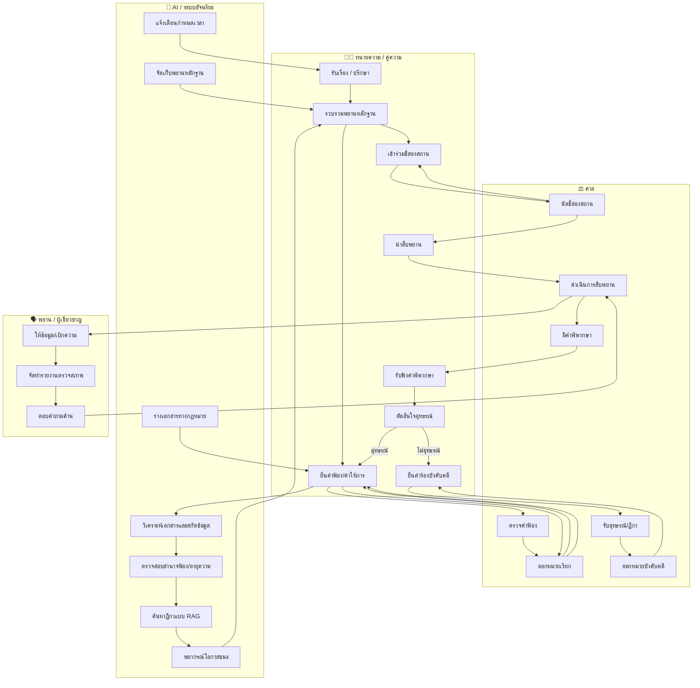
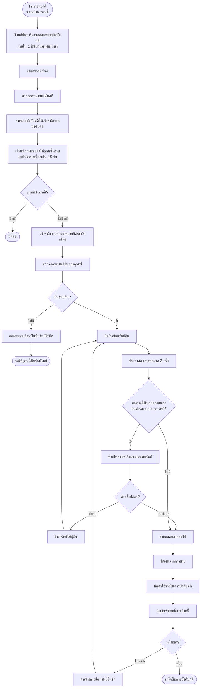
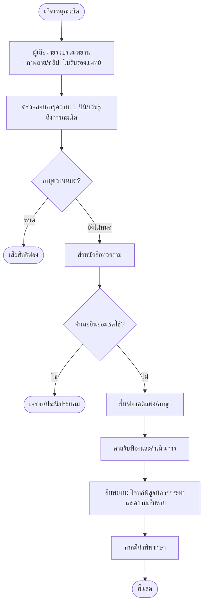

## 📌 เพิ่ม Template คำอุทธรณ์, คำร้องสอด และ Flowchart แบบ Swimlane

 
---

## 📄 1. Template คำอุทธรณ์ (Appeal Template)

> **ใช้กับ:** ศาลอุทธรณ์คดีชำนัญพิเศษ (สำหรับทรัพย์สินทางปัญญา/การค้าระหว่างประเทศ) หรือ ศาลอุทธรณ์แผนกคดีผู้บริโภค (สำหรับคดีผู้บริโภค) หรือ ศาลอุทธรณ์ทั่วไป (สำหรับคดีกลุ่ม)

### 1.1 โครงสร้างคำอุทธรณ์ (ทั่วไป)

```
คำอุทธรณ์
คดีแพ่งหมายเลขดำที่ ........../.......... 
คดีแพ่งหมายเลขแดงที่ ........../..........

ระหว่าง
(................................) โจทก์
กับ
(................................) จำเลย

เรื่อง อุทธรณ์คำพิพากษาศาลชั้นต้น

------------------------------------------------------------------
คำอุทธรณ์ของ (โจทก์/จำเลย) (เลือกฝ่ายที่อุทธรณ์)
------------------------------------------------------------------

ด้วย ศาลชั้นต้นได้มีคำพิพากษาตามคดีหมายเลขแดงที่ ........../.......... 
ลงวันที่ .......... เดือน .......... พ.ศ. .......... ความว่า
(สรุปคำพิพากษาที่ไม่พอใจ)

บัดนี้ (โจทก์/จำเลย) ขอยื่นอุทธรณ์ต่อศาลอุทธรณ์ โดยขอโต้แย้งคำพิพากษาศาลชั้นต้น 
ดังมีข้อห้ามฎีกา ดังต่อไปนี้

**ข้อ ๑.** (ระบุข้อเท็จจริงหรือข้อกฎหมายที่โต้แย้ง)

**ข้อ ๒.** (ระบุเหตุผลที่ศาลชั้นต้นวินิจฉัยผิด)

**ข้อ ๓.** (ระบุคำขอท้ายอุทธรณ์ เช่น ขอให้ศาลอุทธรณ์พิพากษากลับ หรือแก้ไข)

จึงขอให้ศาลอุทธรณ์มีคำพิพากษาตามที่ (โจทก์/จำเลย) ข้างต้น

(ลงชื่อ) .......................... ผู้ยื่นอุทธรณ์
(..........................)
(ลงชื่อ) .......................... ทนายความ
(..........................)
```

### 1.2 ตัวอย่างคำอุทธรณ์ – คดีทรัพย์สินทางปัญญา (จำเลยอุทธรณ์)

```
คำอุทธรณ์
คดีแพ่งหมายเลขดำที่ ๑๒๓/๒๕๖๗ คดีแดงที่ ๔๕๖/๒๕๖๘
ศาลทรัพย์สินทางปัญญาและการค้าระหว่างประเทศกลาง

ระหว่าง
บริษัท เอ จำกัด โจทก์
กับ
นายสมชาย จำเลย

เรื่อง อุทธรณ์คำพิพากษาศาลชั้นต้น

------------------------------------------------------------------
คำอุทธรณ์ของจำเลย (นายสมชาย)
------------------------------------------------------------------

ด้วย ศาลชั้นต้นได้มีคำพิพากษาลงวันที่ ๑๕ มีนาคม ๒๕๖๘ ให้จำเลยใช้ค่าเสียหาย
แก่โจทก์ ๕๐๐,๐๐๐ บาท และห้ามจำเลยกระทำการละเมิดลิขสิทธิ์โปรแกรมคอมพิวเตอร์
ของโจทก์อีกต่อไป

บัดนี้ จำเลยขอยื่นอุทธรณ์ต่อศาลอุทธรณ์คดีชำนัญพิเศษ โดยโต้แย้งว่า

**ข้อ ๑.** ศาลชั้นต้นวินิจฉัยผิดว่าโปรแกรม “ACC-Master” เป็นงานอันมีลิขสิทธิ์ของโจทก์
        ทั้งที่โจทก์ไม่สามารถแสดงหลักฐานการสร้างสรรค์ได้

**ข้อ ๒.** ศาลชั้นต้นรับฟังพยานโจทก์ที่ไม่น่าเชื่อถือ โดยเฉพาะนาย ก. ซึ่งเป็นอดีตพนักงาน
        มีสาเหตุโกรธเคืองกับจำเลย

**ข้อ ๓.** ค่าเสียหาย ๕๐๐,๐๐๐ บาท สูงเกินความจริง เพราะจำเลยใช้งานโปรแกรมดังกล่าว
        เพียงระยะสั้นและไม่ได้รับประโยชน์เชิงพาณิชย์มากนัก

จึงขอให้ศาลอุทธรณ์พิพากษากลับเป็นยกฟ้อง หรือลดค่าเสียหายลงตามความเหมาะสม

(ลงชื่อ) นายสมชาย จำเลย
(ลงชื่อ) ทนายสมศรี ทนายความ
```

### 1.3 ตัวอย่างคำอุทธรณ์ – คดีผู้บริโภค (โจทก์อุทธรณ์)

```
คำอุทธรณ์
คดีผู้บริโภคหมายเลขดำที่ ๗๘๙/๒๕๖๗ คดีแดงที่ ๑๒๓/๒๕๖๘
ศาลแพ่งแผนกคดีผู้บริโภค

ระหว่าง
นางสาวแดง โจทก์
กับ
บริษัทตัวแทนจำหน่ายรถยนต์ จำกัด จำเลย

เรื่อง อุทธรณ์คำสั่ง/คำพิพากษา

------------------------------------------------------------------
คำอุทธรณ์ของโจทก์
------------------------------------------------------------------

ด้วย ศาลชั้นต้นมีคำพิพากษายกฟ้อง โจทก์ไม่พอใจ ขออุทธรณ์ว่า

**ข้อ ๑.** ศาลชั้นต้นวินิจฉัยผิดว่าโจทก์ไม่มีอำนาจฟ้อง เพราะโจทก์เป็นผู้เช่าซื้อ
        มิใช่เจ้าของรถยนต์ ทั้งที่ตาม พ.ร.บ. คุ้มครองผู้บริโภค มาตรา ๔๑ ผู้เช่าซื้อ
        มีสิทธิฟ้องผู้ผลิตและผู้จำหน่ายได้

**ข้อ ๒.** ศาลชั้นต้นรับฟังว่าความชำรุดเกิดจากการใช้งานผิดวิธีของโจทก์ โดยไม่มีพยาน
        หลักฐานเพียงพอ ทั้งที่จำเลยไม่สามารถส่งมอบรถยนต์ที่อยู่ในสภาพใช้การได้ดี
        ตามสัญญา

**ข้อ ๓.** ขอให้ศาลอุทธรณ์พิพากษาให้จำเลยรับผิดชดใช้ค่าเสียหายและซ่อมแซมรถยนต์
        ตามฟ้อง

(ลงชื่อ) นางสาวแดง โจทก์
(ลงชื่อ) ทนายสมชาย ทนายความ
```

---

## 📄 2. Template คำร้องสอด (Intervention Petition)

> **ใช้เมื่อ:** บุคคลภายนอกที่มีส่วนได้เสียต้องการเข้ามาเป็นคู่ความในคดีที่กำลังพิจารณา (ตาม ป.วิ.พ. มาตรา 57)

### 2.1 โครงสร้างคำร้องสอด (ทั่วไป)

```
คำร้องสอด
คดีแพ่งหมายเลขดำที่ ........../..........
ศาล (................................)

ระหว่าง
(................................) โจทก์
กับ
(................................) จำเลย

เรื่อง ขอสอดเข้ามาเป็นคู่ความ

------------------------------------------------------------------
คำร้องสอดของ (ชื่อผู้ร้องสอด)
------------------------------------------------------------------

ข้าพเจ้า (ชื่อ-นามสกุล) ที่อยู่ ..........................
ขอสอดเข้าเป็น (โจทก์ร่วม/จำเลยร่วม) ในคดีนี้ ด้วยเหตุผลดังนี้

๑. คดีนี้เกี่ยวข้องกับทรัพย์สิน/สิทธิของข้าพเจ้าโดยตรง คือ (ระบุ)
๒. ข้าพเจ้ามีส่วนได้เสียในผลแห่งคดี เพราะหากศาลพิพากษาอย่างใดอย่างหนึ่ง
   ย่อมกระทบต่อสิทธิของข้าพเจ้า (ระบุรายละเอียด)
๓. ข้าพเจ้ามีสิทธิที่จะขอสอดตามประมวลกฎหมายวิธีพิจารณาความแพ่ง มาตรา ๕๗

จึงขอให้ศาลอนุญาตให้ข้าพเจ้าเข้าเป็นคู่ความ และโปรดรับคำให้การ/คำร้อง
ที่ข้าพเจ้ายื่นพร้อมนี้

(ลงชื่อ) .......................... ผู้ร้องสอด
(..........................)
```

### 2.2 ตัวอย่างคำร้องสอด – คดีละเมิดลิขสิทธิ์ (ผู้ได้รับอนุญาตให้ใช้สิทธิ)

```
คำร้องสอด
คดีแพ่งหมายเลขดำที่ ๑๒๓/๒๕๖๗
ศาลทรัพย์สินทางปัญญาและการค้าระหว่างประเทศกลาง

ระหว่าง
บริษัท เอ จำกัด โจทก์
กับ
นายสมชาย จำเลย

เรื่อง ขอสอดเข้าเป็นโจทก์ร่วม

------------------------------------------------------------------
คำร้องสอดของบริษัท บี จำกัด (ผู้รับอนุญาตให้ใช้สิทธิ)
------------------------------------------------------------------

ข้าพเจ้า บริษัท บี จำกัด ที่อยู่ .......................... ขอสอดเข้าเป็นโจทก์ร่วม
ในคดีนี้ เพราะ

๑. โจทก์ได้อนุญาตให้ข้าพเจ้าเป็นผู้ใช้สิทธิแต่เพียงผู้เดียวในโปรแกรม “ACC-Master”
   ตามสัญญาอนุญาตให้ใช้สิทธิ (Licensing Agreement) ลงวันที่ ............
๒. การกระทำของจำเลยเป็นการละเมิดสิทธิของข้าพเจ้าโดยตรง ทำให้ข้าพเจ้าเสียหาย
   จากการสูญเสียค่าตอบแทน
๓. ข้าพเจ้ามีส่วนได้เสียในผลแห่งคดี หากศาลพิพากษาว่าไม่มีการละเมิด ย่อมกระทบ
   ต่อสัญญาอนุญาตให้ใช้สิทธิของข้าพเจ้า

จึงขอให้ศาลอนุญาตให้ข้าพเจ้าเข้าเป็นโจทก์ร่วม พร้อมทั้งรับคำให้การและ
คำขอท้ายฟ้องของข้าพเจ้าที่แนบมาด้วย

(ลงชื่อ) .......................... ผู้ร้องสอด
(กรรมการผู้มีอำนาจ)
(ลงชื่อ) .......................... ทนายความ
```

### 2.3 ตัวอย่างคำร้องสอด – คดีครอบครองปรปักษ์ (ตามข้อสอบเนติฯ ข้อ 1)

```
คำร้องสอด
คดีแพ่งหมายเลขดำที่ ๔๕๖/๒๕๖๘
ศาลแพ่ง

ระหว่าง
นางสาวขาว โจทก์
กับ
นายดำ จำเลย

เรื่อง ขอสอดเข้าเป็นจำเลยร่วม

------------------------------------------------------------------
คำร้องสอดของนายแดง
------------------------------------------------------------------

ข้าพเจ้า นายแดง ที่อยู่ .......................... ขอสอดเข้าเป็นจำเลยร่วม
ในคดีนี้ โดยขออ้างว่า

๑. ข้าพเจ้าเป็นผู้ครอบครองที่ดินพิพาทส่วนเนื้อที่ ๑๕๐ ตารางวา ตั้งแต่ปี ๒๕๕๓
   โดยสงบ เปิดเผย ด้วยเจตนาเป็นเจ้าของ ติดต่อกันเกิน ๑๐ ปี
๒. ที่ดินส่วนดังกล่าวจึงเป็นกรรมสิทธิ์ของข้าพเจ้าโดยการครอบครองปรปักษ์
   ตาม ป.พ.พ. มาตรา ๑๓๘๒ มิใช่เป็นทรัพย์มรดกของนายดำ (ผู้ตาย)
๓. หากศาลพิพากษาขับไล่จำเลย (นายดำ) ซึ่งเป็นผู้เช่า ย่อมไม่กระทบสิทธิของข้าพเจ้า
   แต่เพื่อความแน่ชัด ข้าพเจ้าขอสอดเข้าเป็นจำเลยร่วม เพื่อแสดงสิทธิและ
   คัดค้านคำฟ้องของโจทก์

จึงขอให้ศาลอนุญาตให้ข้าพเจ้าเข้าเป็นจำเลยร่วม และรับคำให้การที่ข้าพเจ้ายื่นพร้อมนี้

(ลงชื่อ) นายแดง ผู้ร้องสอด
(ลงชื่อ) ทนายสมศรี ทนายความ
```

---

## 🧭 3. Flowchart แบบ Swimlane (แยกบทบาท)

> Flowchart ด้านล่างแสดง **บทบาทของแต่ละฝ่าย** ในกระบวนการพิจารณาคดีแพ่ง ตั้งแต่เริ่มต้นจนถึงการบังคับคดี โดยแบ่งเป็น 4 Swimlane: **ทนายความ/คู่ความ, ศาล, AI/ระบบอัจฉริยะ, พยาน/ผู้เชี่ยวชาญ**



### 📝 คำอธิบาย Swimlane Flowchart

| Swimlane | บทบาทหน้าที่ |
|----------|-------------|
| **ทนายความ / คู่ความ** | รับเรื่อง, รวบรวมหลักฐาน, ยื่นเอกสาร, ชี้สองสถาน, สืบพยาน, รับคำพิพากษา, ตัดสินใจอุทธรณ์, ขอให้บังคับคดี |
| **ศาล** | ตรวจคำฟ้อง, ออกหมายเรียก, นัดชี้สองสถาน, ดำเนินสืบพยาน, มีคำพิพากษา, รับอุทธรณ์, ออกหมายบังคับคดี |
| **AI / ระบบอัจฉริยะ** | วิเคราะห์เอกสาร, ตรวจสอบอายุความ, ค้นหาฎีกา, พยากรณ์ผล, ร่างเอกสาร, แจ้งเตือน, จัดเก็บพยาน |
| **พยาน / ผู้เชี่ยวชาญ** | ให้ข้อมูล, เบิกความ, ทำรายงาน, ตอบคำถามค้าน |

> **ข้อสังเกต:** AI ทำหน้าที่สนับสนุนทนายความและศาลในทุกขั้นตอน ตั้งแต่ก่อนฟ้อง (วิเคราะห์/พยากรณ์) ระหว่างพิจารณา (ร่างเอกสาร/แจ้งเตือน) และหลังคำพิพากษา (บังคับคดี)

---

## ✅ สรุปสิ่งที่เพิ่มให้ในรอบนี้

| รายการ | สถานะ |
|--------|--------|
| Template คำอุทธรณ์ (โครงสร้างทั่วไป + ตัวอย่าง 2 คดี) | ✅ ใหม่ |
| Template คำร้องสอด (โครงสร้างทั่วไป + ตัวอย่าง 2 คดี) | ✅ ใหม่ |
| Flowchart แบบ Swimlane (แยก 4 บทบาท) | ✅ ใหม่ พร้อมคำอธิบาย |

สามารถนำ Template ไปปรับข้อความตามข้อเท็จจริงของแต่ละคดีได้ทันที ส่วน Swimlane Flowchart ใช้สำหรับนำเสนอภาพรวมการทำงานของระบบ AI ในกระบวนการยุติธรรมทางแพ่ง
 ## 📌 เพิ่ม Template และ Flowchart สำหรับการบังคับคดีและคดีกลุ่ม

ตามที่คุณขอ ด้านล่างนี้คือ **Template คำร้องขอให้ปล่อยทรัพย์**, **Template คำร้องขอออกหมายบังคับคดี** และ **Flowchart สำหรับคดีกลุ่มโดยเฉพาะ** พร้อมตัวอย่างและคำอธิบายใช้งานจริง

---

## 📄 1. Template คำร้องขอให้ปล่อยทรัพย์ (Petition for Release of Seized Property)

> **ใช้เมื่อ:** บุคคลภายนอกอ้างว่าเป็นเจ้าของทรัพย์ที่ถูกยึดในการบังคับคดี ตาม ป.วิ.พ. มาตรา 323

### 1.1 โครงสร้างคำร้องขอให้ปล่อยทรัพย์

```
คำร้องขอให้ปล่อยทรัพย์
คดีแพ่งหมายเลขดำที่ ........../.......... 
คดีแพ่งหมายเลขแดงที่ ........../..........
ศาล (................................)

เรื่อง ขอให้ปล่อยทรัพย์ที่ถูกยึด

------------------------------------------------------------------
คำร้องของ (ชื่อผู้ร้อง)
------------------------------------------------------------------

ข้าพเจ้า (ชื่อ-นามสกุล) ที่อยู่ .......................... 
ขอร้องต่อศาลว่า

๑. เจ้าพนักงานบังคับคดีได้ยึดทรัพย์สินของจำเลยตามหมายบังคับคดีในคดีนี้ 
   คือ (ระบุทรัพย์ที่ถูกยึด เช่น ที่ดินโฉนดเลขที่ .... รถยนต์ทะเบียน ....)
   
๒. ทรัพย์ดังกล่าวมิใช่ทรัพย์สินของจำเลย แต่เป็นของข้าพเจ้าโดยชอบด้วยกฎหมาย
   เพราะ (ระบุเหตุแห่งความเป็นเจ้าของ เช่น ข้าพเจ้าซื้อมาก่อน, ได้รับมรดก,
        เป็นกรรมสิทธิ์รวมโดยมิได้จดทะเบียนแยก ฯลฯ)

๓. ข้าพเจ้ามีหลักฐานดังต่อไปนี้ (แนบเอกสาร)
   - ......................
   - ......................

จึงขอให้ศาลมีคำสั่งให้ปล่อยทรัพย์ที่ยึดดังกล่าวคืนแก่ข้าพเจ้า

(ลงชื่อ) .......................... ผู้ร้อง
(..........................)
```

### 1.2 ตัวอย่างคำร้องขอให้ปล่อยทรัพย์ (กรณีที่ดิน – ตัวการไม่เปิดเผยชื่อ)

> อ้างอิงจากฎีกาที่ 3409/2525 (ข้อ 7 ในไฟล์เนติฯ)

```
คำร้องขอให้ปล่อยทรัพย์
คดีแพ่งหมายเลขดำที่ ๑๒๓/๒๕๖๗ คดีแดงที่ ๔๕๖/๒๕๖๘
ศาลแพ่ง

เรื่อง ขอให้ปล่อยที่ดินที่ถูกยึด

------------------------------------------------------------------
คำร้องของนายแกละ
------------------------------------------------------------------

ข้าพเจ้า นายแกละ ที่อยู่ .......................... ขอร้องว่า

๑. เจ้าพนักงานบังคับคดีได้ยึดที่ดินโฉนดเลขที่ ๑๒๓ เนื้อที่ ๑ ไร่ 
   ซึ่งเป็นทรัพย์สินของนายเปีย (จำเลยในคดีนี้) ตามหมายบังคับคดี

๒. ที่ดินดังกล่าวเป็นกรรมสิทธิ์รวมระหว่างข้าพเจ้ากับนายเปีย คนละกึ่งหนึ่ง
   โดยข้าพเจ้ายินยอมให้ใส่ชื่อนายเปียเป็นเจ้าของในโฉนดเพียงผู้เดียว 
   แต่ได้แบ่งแยกการครอบครองเป็นส่วนสัดตามความเป็นจริง

๓. ข้าพเจ้าจึงขอให้ศาลมีคำสั่งให้ปล่อยที่ดินเฉพาะส่วนของข้าพเจ้า

(ลงชื่อ) นายแกละ ผู้ร้อง
(ลงชื่อ) ทนายสมหมาย ทนายความ
```

> **หมายเหตุ:** ตามคำพิพากษาฎีกาที่ 3409/2525 หากผู้รับจำนองสุจริต การจำนองย่อมผูกพันแม้เป็นตัวการไม่เปิดเผยชื่อ คำร้องเช่นนี้จะไม่ได้รับอนุญาต

### 1.3 ตัวอย่างคำร้องขอให้ปล่อยทรัพย์ (กรณีเจ้าหนี้ตามคำพิพากษาให้ส่งมอบทรัพย์)

> อ้างอิงจากมาตรา 347 วรรคสอง (ข้อ 7 ในไฟล์เนติฯ)

```
คำร้องขอให้ส่งมอบทรัพย์ (ขอให้ปล่อยทรัพย์เพื่อส่งมอบ)
คดีแพ่งหมายเลขดำที่ ๑๒๓/๒๕๖๗ คดีแดงที่ ๔๕๖/๒๕๖๘
ศาลแพ่ง

เรื่อง ขอให้ส่งมอบแหวนเพชร

------------------------------------------------------------------
คำร้องของนายหยก
------------------------------------------------------------------

ข้าพเจ้า นายหยก ที่อยู่ .......................... ขอร้องว่า

๑. ข้าพเจ้าเป็นโจทก์ในคดีหมายเลขแดงที่ ๗๘๙/๒๕๖๗ ของศาลแพ่ง ซึ่งศาลได้พิพากษา
   ให้จำเลย (นายเปีย) ส่งมอบแหวนเพชรหนึ่งวงแก่ข้าพเจ้า

๒. บัดนี้ เจ้าพนักงานบังคับคดีในคดีนี้ (โจทก์คดีนี้คือนายจุก) ได้ยึดแหวนเพชรวงเดียวกัน
   เพื่อนำออกขายทอดตลาด

๓. ตามประมวลกฎหมายวิธีพิจารณาความแพ่ง มาตรา ๓๔๗ วรรคสอง ข้าพเจ้าในฐานะเจ้าหนี้
   ตามคำพิพากษาให้ส่งมอบทรัพย์เฉพาะสิ่ง ขอให้ศาลมีคำสั่งให้เจ้าพนักงานบังคับคดี
   ส่งมอบแหวนเพชรให้แก่ข้าพเจ้า เพราะนายเปียยังมีทรัพย์สินอื่นเพียงพอที่โจทก์
   (นายจุก) จะบังคับคดีได้

จึงขอให้ศาลมีคำสั่งให้ส่งมอบแหวนเพชรแก่ข้าพเจ้า

(ลงชื่อ) นายหยก ผู้ร้อง
```

---

## 📄 2. Template คำร้องขอออกหมายบังคับคดี (Request for Enforcement Order)

> **ใช้เมื่อ:** โจทก์ชนะคดีแต่จำเลยไม่ปฏิบัติตามคำพิพากษา ตาม ป.วิ.พ. มาตรา 271-274

### 2.1 โครงสร้างคำร้องขอออกหมายบังคับคดี

```
คำร้องขอออกหมายบังคับคดี
คดีแพ่งหมายเลขดำที่ ........../.......... 
คดีแพ่งหมายเลขแดงที่ ........../..........
ศาล (................................)

เรื่อง ขอให้ออกหมายบังคับคดี

------------------------------------------------------------------
คำร้องของ (โจทก์/เจ้าหนี้ตามคำพิพากษา)
------------------------------------------------------------------

ข้าพเจ้า (ชื่อ) ที่อยู่ .......................... เจ้าหนี้ตามคำพิพากษา 
ขอร้องว่า

๑. ศาลได้มีคำพิพากษา/คำสั่งในคดีนี้เมื่อวันที่ .......... ให้ (จำเลย/ลูกหนี้)
   ชำระเงินจำนวน ............... บาท พร้อมดอกเบี้ย (หรือให้กระทำการอย่างใด)
   
๒. ครบกำหนดตามคำบังคับแล้ว จำเลย/ลูกหนี้ไม่ชำระหนี้/ไม่ปฏิบัติตามคำพิพากษา
   โดยไม่มีเหตุอันสมควร

๓. ข้าพเจ้าขอให้ศาลออกหมายบังคับคดีเพื่อยึดหรืออายัดทรัพย์สินของลูกหนี้
   และนำออกขายทอดตลาดชำระหนี้แก่ข้าพเจ้า

จึงขอให้ศาลออกหมายบังคับคดีให้แก่ข้าพเจ้าด้วย

(ลงชื่อ) .......................... ผู้ร้อง (เจ้าหนี้)
(..........................)
```

### 2.2 ตัวอย่างคำร้องขอออกหมายบังคับคดี (คดีละเมิด – เรียกค่าเสียหาย)

```
คำร้องขอออกหมายบังคับคดี
คดีแพ่งหมายเลขดำที่ ๑๒๓/๒๕๖๗ คดีแดงที่ ๔๕๖/๒๕๖๘
ศาลแพ่ง

เรื่อง ขอให้ออกหมายบังคับคดี

------------------------------------------------------------------
คำร้องของนางสาวขาว (โจทก์)
------------------------------------------------------------------

ข้าพเจ้า นางสาวขาว ที่อยู่ .......................... เจ้าหนี้ตามคำพิพากษา 
ขอร้องว่า

๑. ศาลแพ่งได้มีคำพิพากษาในคดีนี้เมื่อวันที่ ๑๕ มีนาคม ๒๕๖๘ ให้จำเลย (นายดำ)
   ชำระค่าเสียหาย ๕๐๐,๐๐๐ บาท พร้อมดอกเบี้ยอัตราร้อยละ ๗.๕ ต่อปี 
   นับถัดจากวันฟ้อง (๑ มกราคม ๒๕๖๗) จนกว่าจะชำระเสร็จ

๒. ครบกำหนดตามคำบังคับ (๑๕ เมษายน ๒๕๖๘) แล้ว จำเลยไม่ชำระหนี้
   โดยไม่มีเหตุอันควร

๓. ข้าพเจ้าขอให้ศาลออกหมายบังคับคดี เพื่อให้เจ้าพนักงานบังคับคดี
   ยึดหรืออายัดทรัพย์สินของจำเลย และนำออกขายทอดตลาด 
   นำเงินมาชำระหนี้แก่ข้าพเจ้า

จึงขอให้ศาลออกหมายบังคับคดีให้แก่ข้าพเจ้า

(ลงชื่อ) นางสาวขาว ผู้ร้อง
(ลงชื่อ) ทนายสมชาย ทนายความ
```

---

## 🧭 3. Flowchart สำหรับคดีกลุ่มโดยเฉพาะ (Class Action Specific Flowchart)

> กระบวนการเฉพาะของคดีแบบกลุ่ม ตั้งแต่การยื่นคำร้องขอจนถึงการแบ่งค่าเสียหายให้สมาชิกกลุ่ม

```mermaid
flowchart TB
    Start([เริ่ม: มีผู้เสียหายจำนวนมาก<br>และมีประเด็นเดียวกัน]) --> Step1[รวมกลุ่มผู้เสียหาย<br>หาตัวแทนกลุ่ม (Lead Plaintiff)]
    Step1 --> Step2[ยื่นคำร้องขอให้ดำเนินคดีแบบกลุ่ม<br>ต่อศาลแพ่ง]
    Step2 --> Step3[ศาลไต่สวนคำร้อง]
    
    Step3 --> Step4{ศาลวินิจฉัย}
    Step4 -->|ไม่รับ| A[ดำเนินคดีเป็นรายบุคคล]
    A --> End1([สิ้นสุด])
    
    Step4 -->|รับ| Step5[ศาลมีคำสั่งอนุญาต]
    Step5 --> Step6[ศาลกำหนดวิธีการแจ้งสมาชิกกลุ่ม]
    Step6 --> Step7[ประกาศแจ้งสมาชิกกลุ่มทางหนังสือพิมพ์/สื่อ]
    Step7 --> Step8[สมาชิกกลุ่มมีสิทธิขอออกจากกลุ่ม (Opt-out) ภายในกำหนด]
    
    Step8 --> Step9[ยื่นคำฟ้องโดยโจทก์ตัวแทน]
    Step9 --> Step10[จำเลยยื่นคำให้การ]
    Step10 --> Step11[ศาลดำเนินการชี้สองสถาน]
    Step11 --> Step12[สืบพยาน (อาจใช้พยานร่วมกัน)]
    Step12 --> Step13[ศาลมีคำพิพากษา]
    
    Step13 --> Step14{คำพิพากษาผูกพันสมาชิกกลุ่ม<br>ที่ไม่ได้ Opt-out}
    Step14 --> Step15[หากโจทก์ชนะ – กำหนดวิธีการชำระค่าเสียหาย]
    Step15 --> Step16[ศาลแต่งตั้งผู้จัดการหรือกรรมการ<br>เพื่อจัดสรรเงินให้สมาชิก]
    Step16 --> Step17[ประกาศให้สมาชิกมายื่นหลักฐานรับเงิน]
    Step17 --> Step18[จ่ายเงินค่าเสียหายให้สมาชิกตามสัดส่วน]
    Step18 --> End2([สิ้นสุด])
    
    Step13 --> Step19{มีอุทธรณ์/ฎีกา?}
    Step19 -->|ใช่| Step20[โจทก์ตัวแทนยื่นอุทธรณ์/ฎีกา<br>ในนามสมาชิกกลุ่ม]
    Step20 --> Step21[ศาลอุทธรณ์/ฎีกาพิพากษา]
    Step21 --> Step15
    Step19 -->|ไม่| Step15
```

### 📝 คำอธิบายขั้นตอนคดีกลุ่มโดยเฉพาะ

| ขั้นตอน | รายละเอียด |
|---------|-------------|
| **รวมกลุ่ม/หาตัวแทน** | ผู้เสียหายรวมตัวกัน เลือกโจทก์ตัวแทนที่มีความเสียหายคล้ายคลึงและน่าเชื่อถือ |
| **ยื่นคำร้องขอ** | ยื่นต่อศาลก่อนฟ้อง หรือภายในเวลาที่ศาลกำหนด พร้อมแสดงเหตุแห่งการฟ้องแบบกลุ่ม |
| **ศาลไต่สวน** | ตรวจสอบว่าเข้าเงื่อนไข: จำนวนสมาชิกมาก, ประเด็นร่วมกัน, เหมาะสม, มีทนายความที่ดี |
| **ประกาศแจ้งสมาชิก** | ศาลสั่งให้ประกาศทางหนังสือพิมพ์หรือสื่อออนไลน์ ให้สมาชิกทราบสิทธิ Opt-out |
| **Opt-out** | สมาชิกที่ไม่ประสงค์เข้ากลุ่มสามารถขอออกได้ภายในระยะเวลาที่กำหนด |
| **ดำเนินคดี** | โจทก์ตัวแทนดำเนินคดีแทนสมาชิกทั้งหมด ผลผูกพันทุกคนที่ไม่ได้ Opt-out |
| **คำพิพากษา** | หากชนะ ศาลจะกำหนดแนวทางแบ่งค่าเสียหาย อาจแต่งตั้งผู้จัดการหรือกรรมการกลุ่ม |
| **จ่ายเงิน** | สมาชิกยื่นหลักฐานรับเงินตามสัดส่วนความเสียหาย |

---

## ✅ สรุปสิ่งที่เพิ่มให้ในรอบนี้

| รายการ | สถานะ |
|--------|--------|
| Template คำร้องขอให้ปล่อยทรัพย์ (โครงสร้าง + 2 ตัวอย่าง) | ✅ ใหม่ |
| Template คำร้องขอออกหมายบังคับคดี (โครงสร้าง + 1 ตัวอย่าง) | ✅ ใหม่ |
| Flowchart สำหรับคดีกลุ่มโดยเฉพาะ | ✅ ใหม่ พร้อมคำอธิบายขั้นตอน |

สามารถนำ Template ไปปรับใช้กับคดีจริงได้ทันที ส่วน Flowchart ใช้สำหรับอธิบายกระบวนการคดีกลุ่มให้ผู้เกี่ยวข้องเข้าใจได้ง่าย

## 📌 เพิ่ม Template และ Flowchart สำหรับการบังคับคดีและคดีกลุ่ม

ตามที่คุณขอ ด้านล่างนี้คือ **Template คำร้องขอให้ปล่อยทรัพย์**, **Template คำร้องขอออกหมายบังคับคดี** และ **Flowchart สำหรับคดีกลุ่มโดยเฉพาะ** พร้อมตัวอย่างและคำอธิบายใช้งานจริง

---

## 📄 1. Template คำร้องขอให้ปล่อยทรัพย์ (Petition for Release of Seized Property)

> **ใช้เมื่อ:** บุคคลภายนอกอ้างว่าเป็นเจ้าของทรัพย์ที่ถูกยึดในการบังคับคดี ตาม ป.วิ.พ. มาตรา 323

### 1.1 โครงสร้างคำร้องขอให้ปล่อยทรัพย์

```
คำร้องขอให้ปล่อยทรัพย์
คดีแพ่งหมายเลขดำที่ ........../.......... 
คดีแพ่งหมายเลขแดงที่ ........../..........
ศาล (................................)

เรื่อง ขอให้ปล่อยทรัพย์ที่ถูกยึด

------------------------------------------------------------------
คำร้องของ (ชื่อผู้ร้อง)
------------------------------------------------------------------

ข้าพเจ้า (ชื่อ-นามสกุล) ที่อยู่ .......................... 
ขอร้องต่อศาลว่า

๑. เจ้าพนักงานบังคับคดีได้ยึดทรัพย์สินของจำเลยตามหมายบังคับคดีในคดีนี้ 
   คือ (ระบุทรัพย์ที่ถูกยึด เช่น ที่ดินโฉนดเลขที่ .... รถยนต์ทะเบียน ....)
   
๒. ทรัพย์ดังกล่าวมิใช่ทรัพย์สินของจำเลย แต่เป็นของข้าพเจ้าโดยชอบด้วยกฎหมาย
   เพราะ (ระบุเหตุแห่งความเป็นเจ้าของ เช่น ข้าพเจ้าซื้อมาก่อน, ได้รับมรดก,
        เป็นกรรมสิทธิ์รวมโดยมิได้จดทะเบียนแยก ฯลฯ)

๓. ข้าพเจ้ามีหลักฐานดังต่อไปนี้ (แนบเอกสาร)
   - ......................
   - ......................

จึงขอให้ศาลมีคำสั่งให้ปล่อยทรัพย์ที่ยึดดังกล่าวคืนแก่ข้าพเจ้า

(ลงชื่อ) .......................... ผู้ร้อง
(..........................)
```

### 1.2 ตัวอย่างคำร้องขอให้ปล่อยทรัพย์ (กรณีที่ดิน – ตัวการไม่เปิดเผยชื่อ)

> อ้างอิงจากฎีกาที่ 3409/2525 (ข้อ 7 ในไฟล์เนติฯ)

```
คำร้องขอให้ปล่อยทรัพย์
คดีแพ่งหมายเลขดำที่ ๑๒๓/๒๕๖๗ คดีแดงที่ ๔๕๖/๒๕๖๘
ศาลแพ่ง

เรื่อง ขอให้ปล่อยที่ดินที่ถูกยึด

------------------------------------------------------------------
คำร้องของนายแกละ
------------------------------------------------------------------

ข้าพเจ้า นายแกละ ที่อยู่ .......................... ขอร้องว่า

๑. เจ้าพนักงานบังคับคดีได้ยึดที่ดินโฉนดเลขที่ ๑๒๓ เนื้อที่ ๑ ไร่ 
   ซึ่งเป็นทรัพย์สินของนายเปีย (จำเลยในคดีนี้) ตามหมายบังคับคดี

๒. ที่ดินดังกล่าวเป็นกรรมสิทธิ์รวมระหว่างข้าพเจ้ากับนายเปีย คนละกึ่งหนึ่ง
   โดยข้าพเจ้ายินยอมให้ใส่ชื่อนายเปียเป็นเจ้าของในโฉนดเพียงผู้เดียว 
   แต่ได้แบ่งแยกการครอบครองเป็นส่วนสัดตามความเป็นจริง

๓. ข้าพเจ้าจึงขอให้ศาลมีคำสั่งให้ปล่อยที่ดินเฉพาะส่วนของข้าพเจ้า

(ลงชื่อ) นายแกละ ผู้ร้อง
(ลงชื่อ) ทนายสมหมาย ทนายความ
```

> **หมายเหตุ:** ตามคำพิพากษาฎีกาที่ 3409/2525 หากผู้รับจำนองสุจริต การจำนองย่อมผูกพันแม้เป็นตัวการไม่เปิดเผยชื่อ คำร้องเช่นนี้จะไม่ได้รับอนุญาต

### 1.3 ตัวอย่างคำร้องขอให้ปล่อยทรัพย์ (กรณีเจ้าหนี้ตามคำพิพากษาให้ส่งมอบทรัพย์)

> อ้างอิงจากมาตรา 347 วรรคสอง (ข้อ 7 ในไฟล์เนติฯ)

```
คำร้องขอให้ส่งมอบทรัพย์ (ขอให้ปล่อยทรัพย์เพื่อส่งมอบ)
คดีแพ่งหมายเลขดำที่ ๑๒๓/๒๕๖๗ คดีแดงที่ ๔๕๖/๒๕๖๘
ศาลแพ่ง

เรื่อง ขอให้ส่งมอบแหวนเพชร

------------------------------------------------------------------
คำร้องของนายหยก
------------------------------------------------------------------

ข้าพเจ้า นายหยก ที่อยู่ .......................... ขอร้องว่า

๑. ข้าพเจ้าเป็นโจทก์ในคดีหมายเลขแดงที่ ๗๘๙/๒๕๖๗ ของศาลแพ่ง ซึ่งศาลได้พิพากษา
   ให้จำเลย (นายเปีย) ส่งมอบแหวนเพชรหนึ่งวงแก่ข้าพเจ้า

๒. บัดนี้ เจ้าพนักงานบังคับคดีในคดีนี้ (โจทก์คดีนี้คือนายจุก) ได้ยึดแหวนเพชรวงเดียวกัน
   เพื่อนำออกขายทอดตลาด

๓. ตามประมวลกฎหมายวิธีพิจารณาความแพ่ง มาตรา ๓๔๗ วรรคสอง ข้าพเจ้าในฐานะเจ้าหนี้
   ตามคำพิพากษาให้ส่งมอบทรัพย์เฉพาะสิ่ง ขอให้ศาลมีคำสั่งให้เจ้าพนักงานบังคับคดี
   ส่งมอบแหวนเพชรให้แก่ข้าพเจ้า เพราะนายเปียยังมีทรัพย์สินอื่นเพียงพอที่โจทก์
   (นายจุก) จะบังคับคดีได้

จึงขอให้ศาลมีคำสั่งให้ส่งมอบแหวนเพชรแก่ข้าพเจ้า

(ลงชื่อ) นายหยก ผู้ร้อง
```

---

## 📄 2. Template คำร้องขอออกหมายบังคับคดี (Request for Enforcement Order)

> **ใช้เมื่อ:** โจทก์ชนะคดีแต่จำเลยไม่ปฏิบัติตามคำพิพากษา ตาม ป.วิ.พ. มาตรา 271-274

### 2.1 โครงสร้างคำร้องขอออกหมายบังคับคดี

```
คำร้องขอออกหมายบังคับคดี
คดีแพ่งหมายเลขดำที่ ........../.......... 
คดีแพ่งหมายเลขแดงที่ ........../..........
ศาล (................................)

เรื่อง ขอให้ออกหมายบังคับคดี

------------------------------------------------------------------
คำร้องของ (โจทก์/เจ้าหนี้ตามคำพิพากษา)
------------------------------------------------------------------

ข้าพเจ้า (ชื่อ) ที่อยู่ .......................... เจ้าหนี้ตามคำพิพากษา 
ขอร้องว่า

๑. ศาลได้มีคำพิพากษา/คำสั่งในคดีนี้เมื่อวันที่ .......... ให้ (จำเลย/ลูกหนี้)
   ชำระเงินจำนวน ............... บาท พร้อมดอกเบี้ย (หรือให้กระทำการอย่างใด)
   
๒. ครบกำหนดตามคำบังคับแล้ว จำเลย/ลูกหนี้ไม่ชำระหนี้/ไม่ปฏิบัติตามคำพิพากษา
   โดยไม่มีเหตุอันสมควร

๓. ข้าพเจ้าขอให้ศาลออกหมายบังคับคดีเพื่อยึดหรืออายัดทรัพย์สินของลูกหนี้
   และนำออกขายทอดตลาดชำระหนี้แก่ข้าพเจ้า

จึงขอให้ศาลออกหมายบังคับคดีให้แก่ข้าพเจ้าด้วย

(ลงชื่อ) .......................... ผู้ร้อง (เจ้าหนี้)
(..........................)
```

### 2.2 ตัวอย่างคำร้องขอออกหมายบังคับคดี (คดีละเมิด – เรียกค่าเสียหาย)

```
คำร้องขอออกหมายบังคับคดี
คดีแพ่งหมายเลขดำที่ ๑๒๓/๒๕๖๗ คดีแดงที่ ๔๕๖/๒๕๖๘
ศาลแพ่ง

เรื่อง ขอให้ออกหมายบังคับคดี

------------------------------------------------------------------
คำร้องของนางสาวขาว (โจทก์)
------------------------------------------------------------------

ข้าพเจ้า นางสาวขาว ที่อยู่ .......................... เจ้าหนี้ตามคำพิพากษา 
ขอร้องว่า

๑. ศาลแพ่งได้มีคำพิพากษาในคดีนี้เมื่อวันที่ ๑๕ มีนาคม ๒๕๖๘ ให้จำเลย (นายดำ)
   ชำระค่าเสียหาย ๕๐๐,๐๐๐ บาท พร้อมดอกเบี้ยอัตราร้อยละ ๗.๕ ต่อปี 
   นับถัดจากวันฟ้อง (๑ มกราคม ๒๕๖๗) จนกว่าจะชำระเสร็จ

๒. ครบกำหนดตามคำบังคับ (๑๕ เมษายน ๒๕๖๘) แล้ว จำเลยไม่ชำระหนี้
   โดยไม่มีเหตุอันควร

๓. ข้าพเจ้าขอให้ศาลออกหมายบังคับคดี เพื่อให้เจ้าพนักงานบังคับคดี
   ยึดหรืออายัดทรัพย์สินของจำเลย และนำออกขายทอดตลาด 
   นำเงินมาชำระหนี้แก่ข้าพเจ้า

จึงขอให้ศาลออกหมายบังคับคดีให้แก่ข้าพเจ้า

(ลงชื่อ) นางสาวขาว ผู้ร้อง
(ลงชื่อ) ทนายสมชาย ทนายความ
```

---

## 🧭 3. Flowchart สำหรับคดีกลุ่มโดยเฉพาะ (Class Action Specific Flowchart)

> กระบวนการเฉพาะของคดีแบบกลุ่ม ตั้งแต่การยื่นคำร้องขอจนถึงการแบ่งค่าเสียหายให้สมาชิกกลุ่ม

```mermaid
flowchart TB
    Start([เริ่ม: มีผู้เสียหายจำนวนมาก<br>และมีประเด็นเดียวกัน]) --> Step1[รวมกลุ่มผู้เสียหาย<br>หาตัวแทนกลุ่ม (Lead Plaintiff)]
    Step1 --> Step2[ยื่นคำร้องขอให้ดำเนินคดีแบบกลุ่ม<br>ต่อศาลแพ่ง]
    Step2 --> Step3[ศาลไต่สวนคำร้อง]
    
    Step3 --> Step4{ศาลวินิจฉัย}
    Step4 -->|ไม่รับ| A[ดำเนินคดีเป็นรายบุคคล]
    A --> End1([สิ้นสุด])
    
    Step4 -->|รับ| Step5[ศาลมีคำสั่งอนุญาต]
    Step5 --> Step6[ศาลกำหนดวิธีการแจ้งสมาชิกกลุ่ม]
    Step6 --> Step7[ประกาศแจ้งสมาชิกกลุ่มทางหนังสือพิมพ์/สื่อ]
    Step7 --> Step8[สมาชิกกลุ่มมีสิทธิขอออกจากกลุ่ม (Opt-out) ภายในกำหนด]
    
    Step8 --> Step9[ยื่นคำฟ้องโดยโจทก์ตัวแทน]
    Step9 --> Step10[จำเลยยื่นคำให้การ]
    Step10 --> Step11[ศาลดำเนินการชี้สองสถาน]
    Step11 --> Step12[สืบพยาน (อาจใช้พยานร่วมกัน)]
    Step12 --> Step13[ศาลมีคำพิพากษา]
    
    Step13 --> Step14{คำพิพากษาผูกพันสมาชิกกลุ่ม<br>ที่ไม่ได้ Opt-out}
    Step14 --> Step15[หากโจทก์ชนะ – กำหนดวิธีการชำระค่าเสียหาย]
    Step15 --> Step16[ศาลแต่งตั้งผู้จัดการหรือกรรมการ<br>เพื่อจัดสรรเงินให้สมาชิก]
    Step16 --> Step17[ประกาศให้สมาชิกมายื่นหลักฐานรับเงิน]
    Step17 --> Step18[จ่ายเงินค่าเสียหายให้สมาชิกตามสัดส่วน]
    Step18 --> End2([สิ้นสุด])
    
    Step13 --> Step19{มีอุทธรณ์/ฎีกา?}
    Step19 -->|ใช่| Step20[โจทก์ตัวแทนยื่นอุทธรณ์/ฎีกา<br>ในนามสมาชิกกลุ่ม]
    Step20 --> Step21[ศาลอุทธรณ์/ฎีกาพิพากษา]
    Step21 --> Step15
    Step19 -->|ไม่| Step15
```

### 📝 คำอธิบายขั้นตอนคดีกลุ่มโดยเฉพาะ

| ขั้นตอน | รายละเอียด |
|---------|-------------|
| **รวมกลุ่ม/หาตัวแทน** | ผู้เสียหายรวมตัวกัน เลือกโจทก์ตัวแทนที่มีความเสียหายคล้ายคลึงและน่าเชื่อถือ |
| **ยื่นคำร้องขอ** | ยื่นต่อศาลก่อนฟ้อง หรือภายในเวลาที่ศาลกำหนด พร้อมแสดงเหตุแห่งการฟ้องแบบกลุ่ม |
| **ศาลไต่สวน** | ตรวจสอบว่าเข้าเงื่อนไข: จำนวนสมาชิกมาก, ประเด็นร่วมกัน, เหมาะสม, มีทนายความที่ดี |
| **ประกาศแจ้งสมาชิก** | ศาลสั่งให้ประกาศทางหนังสือพิมพ์หรือสื่อออนไลน์ ให้สมาชิกทราบสิทธิ Opt-out |
| **Opt-out** | สมาชิกที่ไม่ประสงค์เข้ากลุ่มสามารถขอออกได้ภายในระยะเวลาที่กำหนด |
| **ดำเนินคดี** | โจทก์ตัวแทนดำเนินคดีแทนสมาชิกทั้งหมด ผลผูกพันทุกคนที่ไม่ได้ Opt-out |
| **คำพิพากษา** | หากชนะ ศาลจะกำหนดแนวทางแบ่งค่าเสียหาย อาจแต่งตั้งผู้จัดการหรือกรรมการกลุ่ม |
| **จ่ายเงิน** | สมาชิกยื่นหลักฐานรับเงินตามสัดส่วนความเสียหาย |

---

## ✅ สรุปสิ่งที่เพิ่มให้ในรอบนี้

| รายการ | สถานะ |
|--------|--------|
| Template คำร้องขอให้ปล่อยทรัพย์ (โครงสร้าง + 2 ตัวอย่าง) | ✅ ใหม่ |
| Template คำร้องขอออกหมายบังคับคดี (โครงสร้าง + 1 ตัวอย่าง) | ✅ ใหม่ |
| Flowchart สำหรับคดีกลุ่มโดยเฉพาะ | ✅ ใหม่ พร้อมคำอธิบายขั้นตอน |

สามารถนำ Template ไปปรับใช้กับคดีจริงได้ทันที ส่วน Flowchart ใช้สำหรับอธิบายกระบวนการคดีกลุ่มให้ผู้เกี่ยวข้องเข้าใจได้ง่าย

## 📌 เพิ่ม Template และ Flowchart สำหรับการคุ้มครองชั่วคราวและการบังคับคดีเต็มรูปแบบ

ตามที่คุณขอ ด้านล่างนี้คือ **Template คำร้องขอให้ตั้งผู้จัดการทรัพย์สินชั่วคราว**, **Template คำร้องขอคุ้มครองประโยชน์ชั่วคราว (มาตรา 254 และ 264)** และ **Flowchart การบังคับคดีเต็มรูปแบบ** พร้อมตัวอย่างและคำอธิบายประกอบ

---

## 📄 1. Template คำร้องขอให้ตั้งผู้จัดการทรัพย์สินชั่วคราว (Interim Property Manager)

> **ใช้เมื่อ:** มีเหตุจำเป็นต้องจัดการทรัพย์สินมรดกหรือทรัพย์สินที่อยู่ระหว่างพิจารณา เพื่อมิให้ทรัพย์สินสูญหายหรือเสียหาย ตาม ป.วิ.พ. มาตรา 264 (หรือตาม ป.พ.พ. มาตรา 1720 ในคดีมรดก)

### 1.1 โครงสร้างคำร้อง (ทั่วไป)

```
คำร้องขอให้ตั้งผู้จัดการทรัพย์สินชั่วคราว
คดีแพ่งหมายเลขดำที่ ........../..........
ศาล (................................)

เรื่อง ขอให้ตั้งผู้จัดการทรัพย์สินชั่วคราว

------------------------------------------------------------------
คำร้องของ (ผู้ร้อง)
------------------------------------------------------------------

ข้าพเจ้า (ชื่อ-นามสกุล) ที่อยู่ .......................... 
ขอร้องต่อศาลว่า

๑. ข้าพเจ้าเป็น (โจทก์/จำเลย/ผู้มีส่วนได้เสีย) ในคดีนี้ ซึ่งเกี่ยวข้องกับทรัพย์สิน
   คือ (ระบุทรัพย์สิน เช่น ที่ดิน, หุ้น, เงินฝากธนาคาร, สิทธิเรียกร้อง)

๒. ปัจจุบันมีเหตุจำเป็นที่ต้องจัดการทรัพย์สินดังกล่าวเป็นการชั่วคราว เพราะ
   (เลือกข้อที่เกี่ยวข้อง)
   - ทรัพย์สินอาจถูกทำลาย สูญหาย หรือเสื่อมค่า
   - คู่ความอีกฝ่ายกำลังยักย้ายถ่ายเททรัพย์สิน
   - ทรัพย์สินเป็นมรดกที่ยังไม่มีผู้จัดการมรดก
   - ทรัพย์สินต้องมีการเก็บรักษาหรือบริหารเพื่อมิให้เสียประโยชน์

๓. ข้าพเจ้าจึงขอให้ศาลมีคำสั่งตั้ง (ชื่อผู้เสนอเป็นผู้จัดการ) เป็นผู้จัดการทรัพย์สิน
   ชั่วคราว มีอำนาจหน้าที่ (ระบุ เช่น เก็บรักษา, เก็บผลประโยชน์, ห้ามจำหน่ายจ่ายโอน)

จึงขอให้ศาลมีคำสั่งตามคำร้อง

(ลงชื่อ) .......................... ผู้ร้อง
(..........................)
```

### 1.2 ตัวอย่างคำร้องขอให้ตั้งผู้จัดการมรดกชั่วคราว (กรณีทายาทยักย้ายทรัพย์)

```
คำร้องขอให้ตั้งผู้จัดการมรดกชั่วคราว
คดีแพ่งหมายเลขดำที่ ๗๘๙/๒๕๖๘
ศาลแพ่ง

เรื่อง ขอให้ตั้งผู้จัดการมรดกชั่วคราว (ระหว่างพิจารณาคดีแบ่งมรดก)

------------------------------------------------------------------
คำร้องของนายแดง (โจทก์)
------------------------------------------------------------------

ข้าพเจ้า นายแดง ที่อยู่ .......................... โจทก์ในคดีนี้ ขอร้องว่า

๑. คดีนี้เป็นคดีขอแบ่งมรดกของนายดำผู้ตาย ซึ่งมีทรัพย์สินเป็นที่ดิน ๒ แปลง
   และเงินฝากธนาคารอีก ๑,๐๐๐,๐๐๐ บาท

๒. จำเลย (นางสาวขาว) ซึ่งเป็นทายาทร่วมและกำลังครอบครองทรัพย์มรดกแต่เพียงผู้เดียว
   มีพฤติการณ์โอนเงินฝากธนาคารไปยังบัญชีอื่นและเตรียมจำหน่ายที่ดินแปลงหนึ่ง
   อันเป็นการยักย้ายถ่ายเททรัพย์มรดก

๓. หากปล่อยให้เป็นเช่นนั้น ข้าพเจ้าจะไม่ได้รับส่วนแบ่งตามสิทธิเมื่อศาลพิพากษา
   จึงจำเป็นต้องขอให้ศาลตั้งผู้จัดการมรดกชั่วคราว เพื่ออายัดการจำหน่ายทรัพย์สิน
   และเก็บรักษาทรัพย์ไว้จนกว่าคดีจะถึงที่สุด

จึงขอให้ศาลมีคำสั่งตั้งข้าพเจ้า (นายแดง) หรือบุคคลอื่นที่ศาลเห็นสมควร 
เป็นผู้จัดการมรดกชั่วคราว มีอำนาจอายัดที่ดินและเงินฝากดังกล่าวไว้

(ลงชื่อ) นายแดง ผู้ร้อง
(ลงชื่อ) ทนายสมศรี ทนายความ
```

### 1.3 ตัวอย่างคำร้องขอให้ตั้งผู้จัดการทรัพย์สินชั่วคราว (คดีฟื้นฟูกิจการ)

```
คำร้องขอให้ตั้งผู้จัดการทรัพย์สินชั่วคราว
คดีล้มละลายหมายเลขดำที่ ๑๒/๒๕๖๘
ศาลล้มละลายกลาง

เรื่อง ขอให้ตั้งผู้จัดการทรัพย์สินชั่วคราว

------------------------------------------------------------------
คำร้องของเจ้าพนักงานพิทักษ์ทรัพย์
------------------------------------------------------------------

ข้าพเจ้า เจ้าพนักงานพิทักษ์ทรัพย์ ขอร้องว่า

๑. ศาลมีคำสั่งให้ฟื้นฟูกิจการของลูกหนี้ (บริษัท เอ จำกัด) แล้ว
๒. ปรากฏว่าผู้บริหารของลูกหนี้กำลังจะโอนเครื่องจักรและสินค้าคงเหลือ
   ออกนอกสถานประกอบการ โดยมิได้รับอนุญาต
๓. เพื่อป้องกันความเสียหายต่อกองทรัพย์สิน ขอให้ศาลตั้งผู้จัดการทรัพย์สินชั่วคราว
   เข้าทำการยึดและเก็บรักษาทรัพย์สินดังกล่าว

จึงขอให้ศาลมีคำสั่งตามคำร้อง

(ลงชื่อ) เจ้าพนักงานพิทักษ์ทรัพย์
```

---

## 📄 2. Template คำร้องขอคุ้มครองประโยชน์ชั่วคราว (Interim Protection Order)

> **มาตรา 254** – การขอให้ศาลใช้มาตรการคุ้มครองชั่วคราวก่อนมีคำพิพากษา (เช่น อายัดทรัพย์, ห้ามจำหน่าย, ห้ามกระทำการ)  
> **มาตรา 264** – การขอให้ศาลกำหนดวิธีการคุ้มครองประโยชน์ของคู่ความในระหว่างพิจารณา (เช่น ให้ส่งมอบทรัพย์, ให้ชำระหนี้บางส่วน, ให้จัดการทรัพย์สิน)

### 2.1 โครงสร้างคำร้อง (มาตรา 254 – คุ้มครองชั่วคราวก่อนพิพากษา)

```
คำร้องขอให้ใช้มาตรการคุ้มครองชั่วคราวก่อนพิพากษา
(ตามประมวลกฎหมายวิธีพิจารณาความแพ่ง มาตรา 254)
คดีแพ่งหมายเลขดำที่ ........../..........
ศาล (................................)

เรื่อง ขอให้ศาลมีคำสั่งคุ้มครองชั่วคราว

------------------------------------------------------------------
คำร้องของ (โจทก์/ผู้ร้อง)
------------------------------------------------------------------

ข้าพเจ้า (ชื่อ) ที่อยู่ .......................... ขอร้องว่า

๑. ข้าพเจ้าได้ยื่นฟ้อง (จำเลย) เป็นคดีนี้แล้ว โดยมีประเด็นเกี่ยวกับ
   (ทรัพย์สิน/สิทธิเรียกร้อง) คือ ..........................

๒. มีเหตุให้เชื่อว่าหากปล่อยไว้ จำเลยจะ (เลือกข้อ)
   - ยักย้าย ถ่ายเท หรือทำให้ทรัพย์สินสูญหายไป
   - กระทำการใดๆ อันจะทำให้การบังคับคดีตามคำพิพากษาไม่ได้ผล
   - ก่อให้เกิดความเสียหายแก่ข้าพเจ้าที่ไม่อาจเยียวยาได้ด้วยค่าเสียหาย

๓. ข้าพเจ้าจึงขอให้ศาลมีคำสั่ง (เลือกมาตรการ)
   - อายัดทรัพย์สินของจำเลย (ระบุ)
   - ห้ามจำเลยจำหน่ายจ่ายโอนทรัพย์สิน
   - ห้ามจำเลยกระทำการ (ระบุ)

๔. ข้าพเจ้ายินดีวางเงินหรือหลักประกันตามที่ศาลกำหนด (ถ้ามี)

จึงขอให้ศาลมีคำสั่งตามคำร้อง

(ลงชื่อ) .......................... ผู้ร้อง
(ลงชื่อ) .......................... ทนายความ
```

### 2.2 ตัวอย่างคำร้องมาตรา 254 – อายัดทรัพย์ (คดีละเมิด)

```
คำร้องขอให้อายัดทรัพย์ชั่วคราวก่อนพิพากษา
คดีแพ่งหมายเลขดำที่ ๒๕๐/๒๕๖๘
ศาลแพ่ง

เรื่อง ขอให้อายัดที่ดินของจำเลย

------------------------------------------------------------------
คำร้องของนางสาวขาว (โจทก์)
------------------------------------------------------------------

ข้าพเจ้า นางสาวขาว ที่อยู่ .......................... ขอร้องว่า

๑. ข้าพเจ้าได้ฟ้องนายดำเป็นคดีนี้ในข้อหาละเมิด เรียกค่าเสียหาย ๕๐๐,๐๐๐ บาท
   ซึ่งคดีอยู่ระหว่างพิจารณา

๒. ข้าพเจ้ามีเหตุอันควรเชื่อว่านายดำกำลังจะโอนที่ดินโฉนดเลขที่ ๑๒๓ 
   ซึ่งเป็นทรัพย์สินหลักของนายดำให้แก่บุคคลที่สาม เพื่อมิให้ข้าพเจ้าบังคับคดีได้
   โดยมีหลักฐานคือสำเนาหนังสือแสดงเจตจำนงขายที่ดินที่ส่งให้แก่ผู้ซื้อ

๓. หากปล่อยไว้ การบังคับคดีตามคำพิพากษาจะไม่เป็นผล ข้าพเจ้าจะได้รับความเสียหาย
   อย่างร้ายแรง

จึงขอให้ศาลมีคำสั่งอายัดที่ดินโฉนดเลขที่ ๑๒๓ ของจำเลยไว้เป็นการชั่วคราว
จนกว่าคดีจะถึงที่สุด

(ลงชื่อ) นางสาวขาว ผู้ร้อง
(ลงชื่อ) ทนายสมชาย ทนายความ

หมายเหตุ ข้าพเจ้ายินดีวางเงินประกัน ๑๐,๐๐๐ บาท ตามที่ศาลเห็นสมควร
```

### 2.3 โครงสร้างคำร้อง (มาตรา 264 – คุ้มครองประโยชน์ระหว่างพิจารณา)

```
คำร้องขอให้ศาลกำหนดวิธีการคุ้มครองประโยชน์ของคู่ความ
(ตามประมวลกฎหมายวิธีพิจารณาความแพ่ง มาตรา 264)
คดีแพ่งหมายเลขดำที่ ........../..........
ศาล (................................)

เรื่อง ขอให้กำหนดวิธีการคุ้มครองประโยชน์

------------------------------------------------------------------
คำร้องของ (ผู้ร้อง)
------------------------------------------------------------------

ข้าพเจ้า (ชื่อ) ที่อยู่ .......................... ขอร้องว่า

๑. ข้าพเจ้าเป็นคู่ความในคดีนี้ ซึ่งมีประเด็นเกี่ยวกับ (สิทธิ/ทรัพย์สิน/หน้าที่)
   ..........................

๒. ในระหว่างพิจารณา มีความจำเป็นต้องได้รับความคุ้มครองประโยชน์เป็นการชั่วคราว
   เพื่อมิให้สิทธิของข้าพเจ้าสูญเสียไปก่อนมีคำพิพากษา

๓. ข้าพเจ้าขอให้ศาลมีคำสั่ง (เลือกวิธีการ)
   - ให้จำเลยส่งมอบทรัพย์ (ระบุ) ให้แก่ข้าพเจ้า
   - ให้จำเลยชำระเงินบางส่วน (ระบุจำนวน) แก่ข้าพเจ้า
   - ให้จัดการทรัพย์สินตามที่ (ระบุ)
   - ห้ามจำเลยกระทำการ (ระบุ)

จึงขอให้ศาลมีคำสั่งตามคำร้อง

(ลงชื่อ) .......................... ผู้ร้อง
```

### 2.4 ตัวอย่างคำร้องมาตรา 264 – ให้ส่งมอบรถยนต์ (คดีเช่าซื้อ)

```
คำร้องขอให้ส่งมอบรถยนต์ชั่วคราว
คดีแพ่งหมายเลขดำที่ ๓๑๕/๒๕๖๘
ศาลแพ่ง

เรื่อง ขอให้จำเลยส่งมอบรถยนต์ระหว่างพิจารณา

------------------------------------------------------------------
คำร้องของบริษัท เอ จำกัด (โจทก์)
------------------------------------------------------------------

ข้าพเจ้า บริษัท เอ จำกัด โดยนาย ก. กรรมการผู้มีอำนาจ ขอร้องว่า

๑. ข้าพเจ้าได้ฟ้องจำเลย (นายแดง) กรณีผิดสัญญาเช่าซื้อรถยนต์ ขอให้ส่งมอบรถยนต์คืน

๒. ปรากฏว่ารถยนต์ที่พิพาทกำลังถูกจำเลยใช้ขับรับจ้างโดยไม่ดูแลรักษา
   สภาพรถเริ่มทรุดโทรม หากปล่อยไว้ รถยนต์จะเสื่อมค่าอย่างร้ายแรง

๓. ข้าพเจ้าจึงขอให้ศาลมีคำสั่งให้จำเลยส่งมอบรถยนต์คันพิพาทให้แก่ข้าพเจ้า
   เพื่อเก็บรักษาไว้ระหว่างพิจารณา โดยข้าพเจ้ายินดีวางเงินประกันตามศาลกำหนด

จึงขอให้ศาลมีคำสั่งตามคำร้อง

(ลงชื่อ) บริษัท เอ จำกัด โจทก์
(ลงชื่อ) ทนายสมหมาย ทนายความ
```

---

## 🧭 3. Flowchart การบังคับคดีเต็มรูปแบบ (Full Enforcement Process)

> แผนภาพนี้แสดงกระบวนการตั้งแต่ **โจทก์ชนะคดี** → **ขอออกหมายบังคับคดี** → **ยึด/อายัดทรัพย์** → **การขายทอดตลาด** → **การร้องขอให้ปล่อยทรัพย์** → **การชำระหนี้** → **การปิดคดี**



### 📝 คำอธิบายขั้นตอนการบังคับคดีเต็มรูปแบบ

| ขั้นตอน | รายละเอียด | ระยะเวลา/หมายเหตุ |
|---------|-------------|-------------------|
| **1. ขอออกหมายบังคับคดี** | โจทก์ยื่นคำร้องต่อศาลที่ออกคำพิพากษา | ภายใน 1 ปี (มาตรา 271) ถ้าเกินต้องขออนุญาตศาล |
| **2. ออกหมายบังคับคดี** | ศาลตรวจคำร้องและออกหมายบังคับคดีให้ | โดยไม่มีการไต่สวน |
| **3. ส่งหมายให้เจ้าพนักงาน** | ศาลส่งหมายบังคับคดีให้เจ้าพนักงานบังคับคดีดำเนินการ | - |
| **4. แจ้งลูกหนี้** | เจ้าพนักงานฯ แจ้งให้ลูกหนี้ทราบพร้อมคำบังคับ | ให้ชำระภายใน 15 วัน |
| **5. ออกหมายยึด/อายัด** | หากลูกหนี้ไม่ชำระ ให้ยึด/อายัดทรัพย์สิน | ยึดได้เท่าที่พอชำระหนี้ |
| **6. การร้องขอปล่อยทรัพย์** | บุคคลภายนอกอ้างสิทธิเหนือทรัพย์ที่ถูกยึด | ยื่นต่อศาลภายในกำหนด (มาตรา 323) |
| **7. ขายทอดตลาด** | ประกาศขาย 3 ครั้ง ครั้งละไม่น้อยกว่า 7 วัน | ผู้รับผิดชอบ: เจ้าพนักงานบังคับคดี |
| **8. ชำระหนี้** | นำเงินที่ได้หักค่าใช้จ่ายแล้วชำระให้เจ้าหนี้ | ถ้าเหลือคืนให้ลูกหนี้ |
| **9. ปิดคดี** | เมื่อชำระหนี้หมด หรือไม่มีทรัพย์อื่นให้ยึด | - |

---

## ✅ สรุปสิ่งที่เพิ่มให้ในรอบนี้

| รายการ | สถานะ |
|--------|--------|
| Template คำร้องขอให้ตั้งผู้จัดการทรัพย์สินชั่วคราว (โครงสร้าง + 2 ตัวอย่าง) | ✅ ใหม่ |
| Template คำร้องขอคุ้มครองประโยชน์ชั่วคราว มาตรา 254 (โครงสร้าง + 1 ตัวอย่าง) | ✅ ใหม่ |
| Template คำร้องขอคุ้มครองประโยชน์ มาตรา 264 (โครงสร้าง + 1 ตัวอย่าง) | ✅ ใหม่ |
| Flowchart การบังคับคดีเต็มรูปแบบ | ✅ ใหม่ พร้อมคำอธิบาย |

 ## 📌 เพิ่ม Template และตัวอย่างเพิ่มเติม สำหรับการบังคับคดีและมาตรการฉุกเฉิน

ตามที่คุณขอ ด้านล่างนี้คือ **Template คำร้องขอให้เพิกถอนการยึดทรัพย์**, **Template คำร้องขอขยายเวลาบังคับคดี** และ **ตัวอย่างคำร้องมาตรา 254 กรณีฉุกเฉิน** พร้อมคำอธิบายและตัวอย่างที่ใช้ได้จริง

---

## 📄 1. Template คำร้องขอให้เพิกถอนการยึดทรัพย์ (Petition to Revoke Seizure)

> **ใช้เมื่อ:** ลูกหนี้หรือบุคคลผู้มีส่วนได้เสียเห็นว่าการยึดทรัพย์นั้นไม่ชอบด้วยกฎหมาย หรือหนี้ได้ชำระแล้ว หรือทรัพย์นั้นไม่ใช่ของลูกหนี้ โดยยื่นต่อศาลที่ออกหมายบังคับคดี ตาม ป.วิ.พ. มาตรา 296 (กรณีเพิกถอนการยึดเพราะเหตุอื่น) หรือ มาตรา 323 (กรณีอ้างสิทธิเหนือทรัพย์)

### 1.1 โครงสร้างคำร้อง (ทั่วไป)

```
คำร้องขอให้เพิกถอนการยึดทรัพย์
คดีแพ่งหมายเลขดำที่ ........../.......... 
คดีแพ่งหมายเลขแดงที่ ........../..........
ศาล (................................)

เรื่อง ขอให้เพิกถอนการยึดทรัพย์

------------------------------------------------------------------
คำร้องของ (ผู้ร้อง)
------------------------------------------------------------------

ข้าพเจ้า (ชื่อ-นามสกุล) ที่อยู่ .......................... 
ขอร้องต่อศาลว่า

๑. เจ้าพนักงานบังคับคดีได้ยึดทรัพย์สินตามบัญชีท้ายคำร้องนี้ (แนบมาด้วย)
   โดยอ้างว่าเป็นทรัพย์สินของลูกหนี้ (ชื่อจำเลย/ลูกหนี้)

๒. การยึดดังกล่าวไม่ชอบด้วยกฎหมาย เพราะ (เลือกข้อใดข้อหนึ่งหรือหลายข้อ)
   - หนี้ตามคำพิพากษาได้ชำระเสร็จสิ้นแล้ว
   - ทรัพย์ที่ถูกยึดมิใช่ทรัพย์สินของลูกหนี้ แต่เป็นของข้าพเจ้า (ระบุหลักฐาน)
   - การยึดทรัพย์มีข้อบกพร่องของกระบวนการ (ระบุ)
   - ลูกหนี้ได้วางเงินหรือหลักประกันเพื่อปลดยึดแล้ว
   - กรณีอื่น ๆ (ระบุ)

๓. ข้าพเจ้ามีหลักฐานดังนี้ (ระบุเอกสารแนบ)

จึงขอให้ศาลมีคำสั่งเพิกถอนการยึดทรัพย์ดังกล่าว และให้ปล่อยทรัพย์คืนแก่เจ้าของ
(หรือให้จำหน่ายคดีออกจากสารบบความ)

(ลงชื่อ) .......................... ผู้ร้อง
(..........................)
```

### 1.2 ตัวอย่างคำร้องขอให้เพิกถอนการยึดทรัพย์ (กรณีชำระหนี้เสร็จแล้ว)

```
คำร้องขอให้เพิกถอนการยึดทรัพย์
คดีแพ่งหมายเลขดำที่ ๑๒๓/๒๕๖๗ คดีแดงที่ ๔๕๖/๒๕๖๘
ศาลแพ่ง

เรื่อง ขอให้เพิกถอนการยึดที่ดินและทรัพย์สินอื่น

------------------------------------------------------------------
คำร้องของนายดำ (ลูกหนี้)
------------------------------------------------------------------

ข้าพเจ้า นายดำ ที่อยู่ .......................... ขอร้องว่า

๑. เจ้าพนักงานบังคับคดีได้ยึดที่ดินโฉนดเลขที่ ๑๒๓ และรถยนต์ทะเบียน กข ๙๙๙
   กรุงเทพมหานคร ของข้าพเจ้า ตามหมายบังคับคดีคดีนี้

๒. บัดนี้ ข้าพเจ้าได้ชำระหนี้ตามคำพิพากษาให้แก่โจทก์ (นางสาวขาว) ครบถ้วนแล้ว
   โดยโจทก์ได้รับเงินและได้ทำหนังสือรับรองการชำระหนี้ ลงวันที่ ..............
   (แนบหนังสือรับรองมาด้วย)

๓. การยึดทรัพย์ของข้าพเจ้าจึงไม่มีความจำเป็นอีกต่อไป และเป็นการไม่ชอบ
   เพราะหนี้สิ้นสุดแล้ว

จึงขอให้ศาลมีคำสั่งเพิกถอนการยึดทรัพย์ทั้งหมด และให้เจ้าพนักงานบังคับคดี
ส่งมอบทรัพย์สินคืนแก่ข้าพเจ้า

(ลงชื่อ) นายดำ ผู้ร้อง
(ลงชื่อ) ทนายสมศรี ทนายความ
```

### 1.3 ตัวอย่างคำร้องขอให้เพิกถอนการยึดทรัพย์ (กรณีทรัพย์ไม่ใช่ของลูกหนี้)

```
คำร้องขอให้เพิกถอนการยึดทรัพย์
คดีแพ่งหมายเลขดำที่ ๑๒๓/๒๕๖๗ คดีแดงที่ ๔๕๖/๒๕๖๘
ศาลแพ่ง

เรื่อง ขอให้เพิกถอนการยึดเครื่องจักร

------------------------------------------------------------------
คำร้องของบริษัท บี จำกัด (บุคคลภายนอก)
------------------------------------------------------------------

ข้าพเจ้า บริษัท บี จำกัด โดยนายเอก กรรมการผู้มีอำนาจ ขอร้องว่า

๑. เจ้าพนักงานบังคับคดีได้ยึดเครื่องจักร型号 XYZ หมายเลขซีเรียล ๑๒๓๔๕
   ซึ่งตั้งอยู่ที่โรงงานของจำเลย (นายดำ) โดยเข้าใจว่าเป็นทรัพย์ของจำเลย

๒. ความจริง เครื่องจักรดังกล่าวเป็นทรัพย์สินของข้าพเจ้า ซึ่งข้าพเจ้าได้เช่าซื้อ
   ไว้กับบริษัทลีสซิ่ง และนำมาให้จำเลยเช่าใช้ (มีสัญญาเช่าและสัญญาเช่าซื้อ
   แนบมาท้ายคำร้อง)

๓. ข้าพเจ้าจึงขอให้ศาลเพิกถอนการยึดเครื่องจักรดังกล่าว และให้ส่งคืนข้าพเจ้า

จึงขอให้ศาลมีคำสั่งตามคำร้อง

(ลงชื่อ) บริษัท บี จำกัด ผู้ร้อง
(ลงชื่อ) ทนายสมหมาย ทนายความ
```

---

## 📄 2. Template คำร้องขอขยายเวลาบังคับคดี (Request to Extend Enforcement Period)

> **ใช้เมื่อ:** เจ้าหนี้ตามคำพิพากษายังไม่สามารถบังคับคดีได้ทันภายใน 1 ปีนับแต่วันมีคำพิพากษา ต้องขอขยายเวลา ตาม ป.วิ.พ. มาตรา 271 วรรคสอง

### 2.1 โครงสร้างคำร้อง

```
คำร้องขอขยายเวลาบังคับคดี
คดีแพ่งหมายเลขดำที่ ........../.......... 
คดีแพ่งหมายเลขแดงที่ ........../..........
ศาล (................................)

เรื่อง ขอขยายเวลาออกหมายบังคับคดี

------------------------------------------------------------------
คำร้องของ (เจ้าหนี้ตามคำพิพากษา)
------------------------------------------------------------------

ข้าพเจ้า (ชื่อ) ที่อยู่ .......................... เจ้าหนี้ตามคำพิพากษา 
ขอร้องว่า

๑. ศาลได้มีคำพิพากษา/คำสั่งในคดีนี้เมื่อวันที่ .......... ให้ (ลูกหนี้)
   ชำระเงินจำนวน ............... บาท พร้อมดอกเบี้ยแก่ข้าพเจ้า

๒. คดีถึงที่สุดแล้ว แต่ข้าพเจ้ายังมิได้ขอออกหมายบังคับคดีภายในกำหนด ๑ ปี
   นับแต่วันมีคำพิพากษา เนื่องจาก (ระบุเหตุสุดวิสัยหรือเหตุอันสมควร)
   - เช่น จำเลยหลบหนี ไม่ทราบที่อยู่
   - อยู่ระหว่างการเจรจาประนีประนอม
   - อยู่ระหว่างการขอหมายบังคับคดีจากศาลอื่น
   - อื่น ๆ (ระบุ)

๓. ข้าพเจ้าจึงขอให้ศาลขยายเวลาการขอออกหมายบังคับคดีออกไปอีก (....) เดือน/ปี

จึงขอให้ศาลมีคำสั่งอนุญาต

(ลงชื่อ) .......................... ผู้ร้อง (เจ้าหนี้)
(ลงชื่อ) .......................... ทนายความ
```

### 2.2 ตัวอย่างคำร้องขอขยายเวลาบังคับคดี

```
คำร้องขอขยายเวลาบังคับคดี
คดีแพ่งหมายเลขดำที่ ๒๕๐/๒๕๖๗ คดีแดงที่ ๑๒๓/๒๕๖๘
ศาลแพ่ง

เรื่อง ขอขยายเวลาออกหมายบังคับคดี

------------------------------------------------------------------
คำร้องของนางสาวขาว (เจ้าหนี้)
------------------------------------------------------------------

ข้าพเจ้า นางสาวขาว ที่อยู่ .......................... เจ้าหนี้ตามคำพิพากษา 
ขอร้องว่า

๑. ศาลแพ่งได้มีคำพิพากษาในคดีนี้เมื่อวันที่ ๑๕ มีนาคม ๒๕๖๘ ให้จำเลย (นายดำ)
   ชำระค่าเสียหาย ๕๐๐,๐๐๐ บาท พร้อมดอกเบี้ยแก่ข้าพเจ้า คดีถึงที่สุดแล้ว
   เมื่อวันที่ ๑๕ พฤษภาคม ๒๕๖๘

๒. ข้าพเจ้ามิได้ขอออกหมายบังคับคดีภายในกำหนด ๑ ปี นับแต่วันมีคำพิพากษา
   (สิ้นสุด ๑๕ มีนาคม ๒๕๖๙) เนื่องจากในช่วงเวลาดังกล่าว จำเลยได้หลบหนี
   ไม่มีภูมิลำเนาแน่นอน ข้าพเจ้าเพิ่งทราบที่อยู่ของจำเลยเมื่อเดือนที่ผ่านมา

๓. ข้าพเจ้าจึงขอให้ศาลขยายเวลาการขอออกหมายบังคับคดีออกไปอีก ๑ ปี
   นับแต่วันที่ศาลมีคำสั่ง

จึงขอให้ศาลมีคำสั่งอนุญาต

(ลงชื่อ) นางสาวขาว ผู้ร้อง
(ลงชื่อ) ทนายสมชาย ทนายความ
```

---

## ⚡ 3. ตัวอย่างคำร้องมาตรา 254 กรณีฉุกเฉิน (Urgent Interim Protection)

> **มาตรา 254** วรรคสองและสาม (หรือตามมาตรา 266 ที่ให้นำมาใช้ในกรณีฉุกเฉิน) เปิดช่องให้โจทก์ยื่นคำร้องขอให้ศาลมีคำสั่งคุ้มครองชั่วคราวก่อนมีคำพิพากษา โดยไม่ต้องไต่สวนฝ่ายตรงข้าม หากเป็นกรณีรีบด่วนและจำเป็น

### 3.1 โครงสร้างคำร้อง (กรณีฉุกเฉิน)

```
คำร้องขอให้ใช้มาตรการคุ้มครองชั่วคราว (กรณีฉุกเฉิน)
ตามประมวลกฎหมายวิธีพิจารณาความแพ่ง มาตรา 254 ประกอบมาตรา 266
คดีแพ่งหมายเลขดำที่ ........../.......... (ถ้ามี)
ศาล (................................)

เรื่อง ขอให้มีคำสั่งคุ้มครองชั่วคราวก่อนการพิจารณา (กรณีฉุกเฉิน)

------------------------------------------------------------------
คำร้องของ (โจทก์/ผู้ร้อง)
------------------------------------------------------------------

ข้าพเจ้า (ชื่อ) ที่อยู่ .......................... ขอร้องว่า

๑. ข้าพเจ้ามีคำฟ้อง/จะยื่นฟ้อง (จำเลย) เป็นคดีนี้ โดยมีประเด็นเกี่ยวกับ
   (ทรัพย์สิน/สิทธิ) ..........................

๒. มีเหตุฉุกเฉินรีบด่วนอย่างยิ่งที่ไม่อาจรอการไต่สวนฝ่ายตรงข้ามได้ เพราะ
   - หากล่าช้า จำเลยจะยักย้าย ถ่ายเท ทำลาย หรือทำให้ทรัพย์สินสูญหายไป
   - การกระทำของจำเลยกำลังจะเกิดขึ้นในทันที (ระบุ)
   - ความเสียหายที่เกิดขึ้นจะไม่สามารถเยียวยาได้ด้วยค่าเสียหาย

๓. ข้าพเจ้าจึงขอให้ศาลมีคำสั่ง (เลือกมาตรการที่จำเป็น) โดยไม่ต้องไต่สวน
   หรือเรียกจำเลยมาสอบถามก่อน เช่น
   - อายัดทรัพย์สินของจำเลยเป็นการชั่วคราว
   - ห้ามจำเลยจำหน่ายจ่ายโอนทรัพย์สิน
   - ห้ามจำเลยกระทำการอย่างใดอย่างหนึ่ง

๔. ข้าพเจ้ายินดีวางเงินหรือหลักประกันตามที่ศาลกำหนด (ถ้ามี)

จึงขอให้ศาลมีคำสั่งตามคำร้องโดยฉุกเฉิน

(ลงชื่อ) .......................... ผู้ร้อง
(ลงชื่อ) .......................... ทนายความ
```

### 3.2 ตัวอย่างคำร้องมาตรา 254 ฉุกเฉิน – ห้ามโอนหุ้น (คดีหุ้นส่วน)

```
คำร้องขอให้อายัดหุ้นชั่วคราว (กรณีฉุกเฉิน)
คดีแพ่ง (ที่จะยื่นฟ้อง) หมายเลข..........
ศาลแพ่ง

เรื่อง ขอให้มีคำสั่งอายัดหุ้นของจำเลยก่อนฟ้อง

------------------------------------------------------------------
คำร้องของนายเอก (โจทก์)
------------------------------------------------------------------

ข้าพเจ้า นายเอก ที่อยู่ .......................... ขอร้องว่า

๑. ข้าพเจ้ากับนายโทเป็นหุ้นส่วนในบริษัทแห่งหนึ่ง โดยนายโทถือหุ้น ๑๐,๐๐๐ หุ้น
   มูลค่า ๑๐,๐๐๐,๐๐๐ บาท ข้าพเจ้าจะฟ้องนายโทในข้อหาฉ้อโกงและเรียกคืนหุ้น

๒. ข้าพเจ้าได้รับข้อมูลอันเป็นปัจจุบันว่านายโทกำลังดำเนินการโอนหุ้นทั้งหมด
   ให้แก่บุคคลที่สาม โดยจะไปจดทะเบียนโอนที่กรมพัฒนาธุรกิจการค้าในวันพรุ่งนี้
   (มีหลักฐานสำเนาหนังสือแจ้งการโอนและนัดหมาย)

๓. หากปล่อยให้โอนหุ้นดังกล่าว ข้าพเจ้าจะไม่สามารถบังคับคดีให้ได้หุ้นคืน
   หรือเรียกค่าเสียหายได้ เพราะนายโทไม่มีทรัพย์สินอื่นใดนอกจากหุ้นนี้
   ถือเป็นกรณีฉุกเฉินรีบด่วนอย่างยิ่ง

จึงขอให้ศาลมีคำสั่งอายัดหุ้นของนายโทจำนวน ๑๐,๐๐๐ หุ้น ในบริษัท เอ จำกัด
ไว้เป็นการชั่วคราว โดยไม่ต้องไต่สวนนายโทก่อน และห้ามนายโทและบริษัทฯ
ดำเนินการใด ๆ เกี่ยวกับหุ้นดังกล่าว

ข้าพเจ้ายินดีวางเงินประกัน ๑๐๐,๐๐๐ บาท ตามที่ศาลเห็นสมควร

(ลงชื่อ) นายเอก ผู้ร้อง
(ลงชื่อ) ทนายสมศรี ทนายความ
```

### 3.3 ตัวอย่างคำร้องมาตรา 254 ฉุกเฉิน – ห้ามรื้อถอนสิ่งปลูกสร้าง (คดีละเมิด)

```
คำร้องขอให้ห้ามรื้อถอนอาคาร (กรณีฉุกเฉิน)
คดีแพ่งหมายเลขดำที่ ........../.......... (อยู่ระหว่างการยื่นฟ้อง)
ศาลแพ่ง

เรื่อง ขอให้มีคำสั่งห้ามจำเลยรื้อถอนอาคารก่อนพิจารณา

------------------------------------------------------------------
คำร้องของนางสาวเขียว (โจทก์)
------------------------------------------------------------------

ข้าพเจ้า นางสาวเขียว ที่อยู่ .......................... ขอร้องว่า

๑. ข้าพเจ้าจะยื่นฟ้องนายเทา (จำเลย) ในข้อหาละเมิดและเรียกค่าเสียหาย
   เนื่องจากนายเทากำลังรื้อถอนกำแพงรั้วและอาคารส่วนหนึ่งของข้าพเจ้า
   โดยอ้างว่าล้ำเข้าไปในที่ดินของตน

๒. ขณะนี้ นายเทาได้นำช่างและเครื่องจักรกลมาจอดเตรียมการรื้อถอน
   และจะเริ่มรื้อถอนในวันนี้เวลา ๑๓.๐๐ น. หากล่าช้า ทรัพย์สินของข้าพเจ้า
   จะถูกทำลายก่อนที่ศาลจะรับฟ้องและมีคำสั่งใด ๆ

๓. ความเสียหายที่เกิดขึ้นจะไม่สามารถเรียกคืนหรือเยียวยาได้เต็มที่
   เพราะกำแพงและอาคารเป็นสิ่งปลูกสร้างที่มีคุณค่าและไม่อาจทดแทนได้

จึงขอให้ศาลมีคำสั่งห้ามนายเทาและบริวารรื้อถอนหรือทำลายกำแพงรั้วและอาคาร
ของข้าพเจ้าเป็นการชั่วคราว จนกว่าศาลจะมีคำพิพากษาหรือคำสั่งเป็นอย่างอื่น

(ลงชื่อ) นางสาวเขียว ผู้ร้อง
(ลงชื่อ) ทนายสมหมาย ทนายความ
```

### 3.4 ข้อควรรู้เกี่ยวกับคำร้องมาตรา 254 ฉุกเฉิน

| หัวข้อ | คำอธิบาย |
|--------|----------|
| **ยื่นเมื่อใด** | ก่อนฟ้องหรือระหว่างพิจารณา หากมีเหตุฉุกเฉินที่ไม่อาจรอได้ |
| **ต้องทำอย่างไร** | แสดงให้ศาลเห็นถึงเหตุฉุกเฉินจริงและความเสียหายที่ไม่สามารถเยียวยาได้ |
| **ศาลดำเนินการ** | ศาลอาจมีคำสั่งโดยไม่ไต่สวนฝ่ายตรงข้าม หรือเรียกผู้ร้องมาสอบปากคำ |
| **ระยะเวลา** | คำสั่งมักมีอายุสั้น (เช่น 7-15 วัน) หรือจนกว่าจะมีการไต่สวนครบ |
| **หลักประกัน** | ศาลอาจกำหนดให้ผู้ร้องวางเงินหรือหลักประกันเพื่อชดใช้ความเสียหายหากภายหลังปรากฏว่าผู้ร้องไม่มีสิทธิ |
| **การบังคับ** | หากจำเลยฝ่าฝืนคำสั่ง อาจถูกดำเนินคดีอาญาฐานหมิ่นประมาทศาล |

---

## ✅ สรุปสิ่งที่เพิ่มให้ในรอบนี้

| รายการ | สถานะ |
|--------|--------|
| Template คำร้องขอให้เพิกถอนการยึดทรัพย์ (โครงสร้าง + 2 ตัวอย่าง) | ✅ ใหม่ |
| Template คำร้องขอขยายเวลาบังคับคดี (โครงสร้าง + 1 ตัวอย่าง) | ✅ ใหม่ |
| ตัวอย่างคำร้องมาตรา 254 กรณีฉุกเฉิน (โครงสร้าง + 2 ตัวอย่าง + ตารางข้อควรรู้) | ✅ ใหม่ |

 ## 📌 เพิ่ม Template และ Flowchart ตามที่ขอ

ตามที่คุณขอ ด้านล่างนี้คือ **Template คำร้องขอไถ่ถอนการจำนอง**, **ตัวอย่างคำร้องมาตรา 264 กรณีฉุกเฉิน (ต่างจากมาตรา 254)** และ **Flowchart การร้องขอคุ้มครองชั่วคราว** พร้อมคำอธิบายประกอบ

---

## 📄 1. Template คำร้องขอไถ่ถอนการจำนอง (Petition for Redemption of Mortgage)

> **ใช้เมื่อ:** ผู้จำนองหรือทายาท/ผู้รับโอนทรัพย์จำนอง ประสงค์จะไถ่ถอนการจำนองหลังจากที่เจ้าหนี้ผู้รับจำนองได้บังคับจำนองหรือก่อนการขายทอดตลาด ตาม ป.พ.พ. มาตรา 745-747 และ ป.วิ.พ. มาตรา 293 (กรณีบังคับจำนอง)

### 1.1 โครงสร้างคำร้อง (ทั่วไป)

```
คำร้องขอไถ่ถอนการจำนอง
คดีแพ่งหมายเลขดำที่ ........../.......... 
คดีแพ่งหมายเลขแดงที่ ........../..........
ศาล (................................)

เรื่อง ขอไถ่ถอนการจำนอง

------------------------------------------------------------------
คำร้องของ (ผู้ร้อง – ผู้จำนอง/ทายาท/ผู้รับโอน)
------------------------------------------------------------------

ข้าพเจ้า (ชื่อ-นามสกุล) ที่อยู่ .......................... ขอร้องว่า

๑. ข้าพเจ้าเป็น (ผู้จำนอง/ทายาท/ผู้รับโอนสิทธิในทรัพย์สินที่จำนอง) ของ
   ทรัพย์สินที่ถูกบังคับจำนอง คือ (ระบุทรัพย์ เช่น ที่ดินโฉนดเลขที่ ....)

๒. เจ้าพนักงานบังคับคดีได้ยึดทรัพย์ดังกล่าวเพื่อนำออกขายทอดตลาด
   ตามคำขอของเจ้าหนี้ผู้รับจำนอง (ชื่อ ....) ในคดีนี้

๓. ข้าพเจ้าประสงค์จะไถ่ถอนการจำนอง โดยชำระหนี้ทั้งหมดหรือบางส่วน
   ตามเงื่อนไข ดังนี้
   - จำนวนหนี้ที่ต้องชำระ .......... บาท
   - ดอกเบี้ยและค่าใช้จ่าย .......... บาท
   - รวมทั้งสิ้น .......... บาท

๔. ข้าพเจ้าได้นำเงินมาชำระต่อศาล/เจ้าพนักงานบังคับคดีแล้ว (หรือจะชำระ)
   ดังหลักฐานแนบท้าย

จึงขอให้ศาลมีคำสั่งให้เพิกถอนการจำนองและปล่อยทรัพย์สินดังกล่าว
จากการยึด และให้เจ้าพนักงานที่ดินจดทะเบียนเพิกถอนการจำนองด้วย

(ลงชื่อ) .......................... ผู้ร้อง
(..........................)
```

### 1.2 ตัวอย่างคำร้องขอไถ่ถอนการจำนอง (ก่อนขายทอดตลาด)

```
คำร้องขอไถ่ถอนการจำนอง
คดีแพ่งหมายเลขดำที่ ๒๕๐/๒๕๖๗ คดีแดงที่ ๑๒๓/๒๕๖๘
ศาลแพ่ง

เรื่อง ขอไถ่ถอนการจำนองที่ดิน

------------------------------------------------------------------
คำร้องของนายดำ (ผู้จำนอง)
------------------------------------------------------------------

ข้าพเจ้า นายดำ ที่อยู่ .......................... ขอร้องว่า

๑. ข้าพเจ้าเป็นเจ้าของที่ดินโฉนดเลขที่ ๑๒๓ ตำบลบางบอน เขตบางขุนเทียน
   กรุงเทพมหานคร ซึ่งได้จดทะเบียนจำนองไว้แก่ธนาคาร ก. จำกัด
   เพื่อประกันหนี้เงินกู้ ๑,๐๐๐,๐๐๐ บาท

๒. ธนาคาร ก. จำกัด (เจ้าหนี้ผู้รับจำนอง) ได้ฟ้องบังคับจำนองและศาลมีคำพิพากษา
   ให้ขายทอดตลาดที่ดินดังกล่าว คดีอยู่ระหว่างการยึดและจะขายทอดตลาด
   ในวันที่ ๑๕ พฤษภาคม ๒๕๖๙

๓. ข้าพเจ้าประสงค์จะไถ่ถอนการจำนองก่อนการขายทอดตลาด โดยได้ชำระหนี้
   พร้อมดอกเบี้ยและค่าใช้จ่ายทั้งสิ้น ๑,๑๕๐,๐๐๐ บาท แก่เจ้าพนักงานบังคับคดี
   ตามใบรับเงินแนบท้าย

จึงขอให้ศาลมีคำสั่งให้เพิกถอนการยึดที่ดินโฉนดเลขที่ ๑๒๓ และให้มีคำสั่ง
ไปยังเจ้าพนักงานที่ดินเพื่อจดทะเบียนเพิกถอนการจำนองด้วย

(ลงชื่อ) นายดำ ผู้ร้อง
(ลงชื่อ) ทนายสมศรี ทนายความ
```

### 1.3 ตัวอย่างคำร้องขอไถ่ถอนการจำนอง (โดยทายาท)

```
คำร้องขอไถ่ถอนการจำนอง (ทายาท)
คดีแพ่งหมายเลขดำที่ ๓๑๕/๒๕๖๘ คดีแดงที่ ๔๕๐/๒๕๖๘
ศาลแพ่งธนบุรี

เรื่อง ขอไถ่ถอนการจำนองที่ดิน (ทายาท)

------------------------------------------------------------------
คำร้องของนางสาวขาว (ทายาท)
------------------------------------------------------------------

ข้าพเจ้า นางสาวขาว ที่อยู่ .......................... ขอร้องว่า

๑. นายแดงผู้ตายเป็นบิดาของข้าพเจ้า ได้จำนองที่ดินโฉนดเลขที่ ๔๕๖
   ไว้แก่จำเลยในคดีนี้ (บริษัท บี จำกัด) ขณะยังมีชีวิตอยู่

๒. นายแดงถึงแก่กรรม ข้าพเจ้าเป็นทายาทโดยชอบธรรมได้รับมรดกที่ดินดังกล่าว
   (มีหนังสือรับรองมรดกและทะเบียนบ้าน)

๓. บัดนี้ ข้าพเจ้าประสงค์จะไถ่ถอนการจำนอง โดยได้ชำระหนี้ที่ค้าง
   พร้อมดอกเบี้ยแก่เจ้าพนักงานบังคับคดีเรียบร้อยแล้ว

จึงขอให้ศาลมีคำสั่งเพิกถอนการจำนองและปล่อยที่ดินจากการยึด

(ลงชื่อ) นางสาวขาว ผู้ร้อง
(ลงชื่อ) ทนายสมหมาย ทนายความ
```

---

## 📄 2. ตัวอย่างคำร้องมาตรา 264 กรณีฉุกเฉิน (Urgent Request under Section 264)

> **มาตรา 264** แตกต่างจากมาตรา 254 อย่างไร?  
> - **มาตรา 254** : คุ้มครองชั่วคราว **ก่อนมีคำพิพากษา** โดยเน้นการอายัดหรือห้ามกระทำการเพื่อป้องกันการยักย้ายทรัพย์  
> - **มาตรา 264** : คุ้มครองประโยชน์ของคู่ความ **ในระหว่างพิจารณา** โดยอาจสั่งให้ส่งมอบทรัพย์ ให้ชำระหนี้บางส่วน หรือจัดการทรัพย์สิน (เช่น ตั้งผู้จัดการชั่วคราว) และสามารถใช้ **กรณีฉุกเฉิน** ได้โดยอาศัยมาตรา 270 ที่ให้นำมาตรา 266 (ฉุกเฉิน) มาใช้กับคำขออื่นนอกเหนือจากมาตรา 254 ได้ **เฉพาะที่กฎหมายบัญญัติไว้โดยชัดแจ้ง**

> **หมายเหตุสำคัญ:** มาตรา 264 วรรคสอง มิได้บัญญัติให้นำมาตรา 266 (ฉุกเฉิน) มาใช้โดยตรง ดังนั้นการใช้กรณีฉุกเฉินสำหรับมาตรา 264 จะกระทำได้ก็ต่อเมื่อมีกฎหมายอื่นรองรับ หรือศาลใช้ดุลพินิจในฐานะคำขอเพื่อคุ้มครองประโยชน์ระหว่างพิจารณา ซึ่งอาจทำได้ยากกว่า แต่ในทางปฏิบัติ หากเป็นกรณีจำเป็นเร่งด่วน ศาลอาจเร่งรัดการไต่สวนหรือออกคำสั่งชั่วคราวโดยไม่ชักช้า

### 2.1 ตัวอย่างคำร้องมาตรา 264 กรณีฉุกเฉิน – ให้ส่งมอบรถยนต์ (ก่อนเสื่อมสภาพ)

```
คำร้องขอให้ส่งมอบรถยนต์ (กรณีฉุกเฉิน)
ตามประมวลกฎหมายวิธีพิจารณาความแพ่ง มาตรา 264
คดีแพ่งหมายเลขดำที่ ๗๘๙/๒๕๖๘
ศาลแพ่ง

เรื่อง ขอให้จำเลยส่งมอบรถยนต์คันพิพาทระหว่างพิจารณา (กรณีฉุกเฉิน)

------------------------------------------------------------------
คำร้องของบริษัท เอ จำกัด (โจทก์)
------------------------------------------------------------------

ข้าพเจ้า บริษัท เอ จำกัด โดยนายเอก กรรมการผู้มีอำนาจ ขอร้องว่า

๑. ข้าพเจ้าได้ฟ้องจำเลย (นายโท) เป็นคดีนี้ ขอให้ส่งมอบรถยนต์กระบะ
   ยี่ห้อโตโยต้า ทะเบียน บฉ ๑๒๓๔ กรุงเทพมหานคร ซึ่งจำเลยเช่าซื้อไป
   แต่ผิดนัดชำระค่างวด

๒. ในระหว่างพิจารณา ข้าพเจ้าได้รับแจ้งว่าจำเลยกำลังนำรถยนต์คันดังกล่าว
   ไปใช้ขับบรรทุกของหนักและปล่อยทิ้งไว้กลางแจ้งโดยไม่ดูแล ทำให้สภาพรถ
   ทรุดโทรมลงอย่างรวดเร็ว หากปล่อยไว้ รถยนต์จะเสียหายและเสื่อมค่าอย่างมาก

๓. คดีนี้ยังไม่ถึงที่สุด การรอให้ถึงวันสืบพยาน (อีก ๓ เดือนข้างหน้า) รถยนต์
   อาจพังเสียหายจนไม่อาจซ่อมแซมได้ ซึ่งเป็นการเสียหายที่ไม่อาจเยียวยาได้
   ด้วยค่าเสียหาย (เพราะเป็นรถรุ่นพิเศษและโจทก์ประสงค์จะได้รถคืน)

๔. ข้าพเจ้าจึงขอให้ศาลมีคำสั่งให้จำเลยส่งมอบรถยนต์คันพิพาทให้แก่ข้าพเจ้า
   เพื่อเก็บรักษาไว้ระหว่างพิจารณา โดยข้าพเจ้ายินดีวางเงินประกัน ๑๐๐,๐๐๐ บาท

จึงขอให้ศาลมีคำสั่งตามคำร้องโดยเร่งด่วน (กรณีฉุกเฉิน)

(ลงชื่อ) บริษัท เอ จำกัด ผู้ร้อง
(ลงชื่อ) ทนายสมชาย ทนายความ
```

### 2.2 ตัวอย่างคำร้องมาตรา 264 กรณีฉุกเฉิน – ให้จัดการทรัพย์สินมรดก (คดีมรดก)

```
คำร้องขอให้ตั้งผู้จัดการทรัพย์สินชั่วคราว (กรณีฉุกเฉิน)
ตามประมวลกฎหมายวิธีพิจารณาความแพ่ง มาตรา 264
คดีแพ่งหมายเลขดำที่ ๒๐๑/๒๕๖๘
ศาลแพ่ง

เรื่อง ขอให้ตั้งผู้จัดการมรดกชั่วคราวระหว่างพิจารณา (ฉุกเฉิน)

------------------------------------------------------------------
คำร้องของนางสาวเขียว (โจทก์)
------------------------------------------------------------------

ข้าพเจ้า นางสาวเขียว ที่อยู่ .......................... ขอร้องว่า

๑. คดีนี้เป็นคดีขอแบ่งมรดกของนายเทา (ผู้ตาย) ซึ่งมีทรัพย์สินเป็น
   อาคารพาณิชย์ ๓ คูหา อยู่ในตลาดสด เขตบางบอน

๒. จำเลยซึ่งเป็นทายาทร่วมและกำลังครอบครองอาคารดังกล่าวแต่เพียงผู้เดียว
   ได้เริ่มรื้อถอนสิ่งปลูกสร้างภายในอาคารเพื่อเตรียมขายอาคารให้บุคคลภายนอก
   โดยไม่ได้รับความยินยอมจากโจทก์ การกระทำดังกล่าวกำลังเกิดขึ้นในวันนี้

๓. หากปล่อยให้จำเลยรื้อถอนหรือโอนอาคารไป ข้าพเจ้าจะไม่ได้รับส่วนแบ่ง
   และเสียหายอย่างไม่อาจเยียวยาได้ เป็นกรณีฉุกเฉินรีบด่วน

จึงขอให้ศาลมีคำสั่งตั้งข้าพเจ้าเป็นผู้จัดการทรัพย์สินชั่วคราว หรือตั้งผู้จัดการ
ที่ศาลเห็นสมควร มีอำนาจห้ามจำเลยรื้อถอนหรือจำหน่ายอาคารทั้งสามคูหา
จนกว่าศาลจะมีคำพิพากษาหรือคำสั่งเป็นอย่างอื่น

(ลงชื่อ) นางสาวเขียว ผู้ร้อง
(ลงชื่อ) ทนายสมศรี ทนายความ
```

### 2.3 ตารางเปรียบเทียบมาตรา 254 กับมาตรา 264 กรณีฉุกเฉิน

| ประเด็น | มาตรา 254 (คุ้มครองชั่วคราว) | มาตรา 264 (คุ้มครองประโยชน์ระหว่างพิจารณา) |
|---------|-------------------------------|---------------------------------------------|
| **เวลาที่ยื่น** | ก่อนหรือหลังฟ้อง แต่ก่อนคำพิพากษา | ระหว่างพิจารณาคดี (หลังจากรับฟ้องแล้ว) |
| **ลักษณะคำขอ** | อายัด, ห้ามจำหน่าย, ห้ามกระทำการ | ให้ส่งมอบทรัพย์, ให้ชำระหนี้บางส่วน, ตั้งผู้จัดการทรัพย์สิน |
| **การใช้กรณีฉุกเฉิน** | สามารถใช้ได้ (มาตรา 266) โดยไม่ต้องไต่สวน | ใช้ได้ยากกว่า เพราะมาตรา 264 วรรคสองไม่ได้บัญญัติให้นำมาตรา 266 มาใช้ ต้องอาศัยดุลพินิจศาลหรือกฎหมายอื่น |
| **หลักประกัน** | ศาลมักกำหนดให้วางหลักประกัน | ศาลอาจกำหนดหรือไม่ก็ได้ แล้วแต่กรณี |
| **ตัวอย่างที่ใช้จริง** | อายัดทรัพย์ก่อนฟ้องกรณีเกรงว่าจำเลยจะโอนหนี | ให้ส่งมอบรถเช่าซื้อระหว่างพิจารณา เพื่อไม่ให้รถเสียสภาพ |

---

## 🧭 3. Flowchart การร้องขอคุ้มครองชั่วคราว (Interim Protection Request Process)

> แผนภาพนี้แสดงกระบวนการตั้งแต่การพิจารณาว่าจะใช้มาตรา 254 หรือ 264 การยื่นคำร้อง การพิจารณาของศาล การออกคำสั่ง และการบังคับตามคำสั่ง

```mermaid
flowchart TB
    Start([เริ่ม: คู่ความต้องการคุ้มครองชั่วคราว]) --> Decide{เลือกประเภทคำขอ}
    
    Decide -->|มาตรา 254| A1[ยื่นคำร้องก่อนหรือระหว่างพิจารณา<br>ขอให้อายัด/ห้ามกระทำการ]
    Decide -->|มาตรา 264| B1[ยื่นคำร้องระหว่างพิจารณา<br>ขอให้ส่งมอบ/จัดการทรัพย์/ชำระหนี้บางส่วน]
    
    A1 --> A2{เป็นกรณีฉุกเฉิน?<br>(มาตรา 266)}
    A2 -->|ใช่| A3[ยื่นคำร้องโดยไม่ต้องไต่สวนฝ่ายตรงข้าม<br>ศาลอาจสอบปากคำผู้ร้อง]
    A2 -->|ไม่| A4[ศาลนัดไต่สวนฝ่ายตรงข้าม]
    
    B1 --> B2{มีกฎหมายอื่นรองรับฉุกเฉิน?<br>หรือศาลเห็นสมควร}
    B2 -->|ใช่| B3[เร่งรัดการไต่สวน หรือออกคำสั่งชั่วคราว]
    B2 -->|ไม่| B4[ศาลนัดไต่สวนตามปกติ]
    
    A3 --> A5[ศาลพิจารณาคำร้อง]
    A4 --> A5
    B3 --> B5[ศาลพิจารณาคำร้อง]
    B4 --> B5
    
    A5 --> A6{ศาลมีคำสั่ง?}
    A6 -->|อนุญาต| A7[ออกคำสั่งคุ้มครองชั่วคราว<br>อาจกำหนดหลักประกัน]
    A6 -->|ไม่อนุญาต| A8[ยกคำร้อง]
    
    B5 --> B6{ศาลมีคำสั่ง?}
    B6 -->|อนุญาต| B7[ออกคำสั่งตามมาตรา 264<br>เช่น ให้ส่งมอบทรัพย์]
    B6 -->|ไม่อนุญาต| B8[ยกคำร้อง]
    
    A7 --> A9[แจ้งคำสั่งแก่คู่ความทุกฝ่าย]
    B7 --> B9[แจ้งคำสั่งแก่คู่ความ]
    
    A9 --> A10{คู่ความฝ่าฝืน?}
    A10 -->|ฝ่าฝืน| A11[อาจถูกดำเนินคดีอาญา<br>ฐานหมิ่นประมาทศาล]
    A10 -->|ปฏิบัติตาม| End1([สิ้นสุด])
    
    B9 --> B10{คู่ความฝ่าฝืน?}
    B10 -->|ฝ่าฝืน| B11[อาจถูกบังคับตามคำสั่ง<br>หรือลงโทษฐานไม่ปฏิบัติตาม]
    B10 -->|ปฏิบัติตาม| End2([สิ้นสุด])
    
    A8 --> End3([จบ])
    B8 --> End3
    A11 --> End3
    B11 --> End3
```

### 📝 คำอธิบาย Flowchart การร้องขอคุ้มครองชั่วคราว

| ขั้นตอน | รายละเอียด |
|---------|-------------|
| **เริ่มต้น** | คู่ความ (โจทก์หรือจำเลย) มีความจำเป็นต้องได้รับการคุ้มครองชั่วคราวก่อนคดีถึงที่สุด |
| **เลือกมาตรา** | หากต้องการอายัด/ห้ามกระทำการ → มาตรา 254; หากต้องการให้ส่งมอบ/จัดการทรัพย์ → มาตรา 264 |
| **กรณีฉุกเฉิน** | มาตรา 254: ใช้มาตรา 266 ได้ (ไม่ต้องไต่สวน) ส่วนมาตรา 264: ต้องอาศัยดุลพินิจศาล |
| **การไต่สวน** | หากไม่ฉุกเฉิน ศาลจะนัดไต่สวนเพื่อให้อีกฝ่ายคัดค้าน |
| **คำสั่งศาล** | ศาลอาจอนุญาตหรือไม่ก็ได้ หากอนุญาตมักกำหนดให้วางหลักประกัน (โดยเฉพาะมาตรา 254) |
| **การบังคับ** | หากฝ่าฝืนคำสั่งศาล อาจมีความผิดฐานละเมิดอำนาจศาล (หมิ่นประมาทศาล) |

---

## ✅ สรุปสิ่งที่เพิ่มให้ในรอบนี้

| รายการ | สถานะ |
|--------|--------|
| Template คำร้องขอไถ่ถอนการจำนอง (โครงสร้าง + 2 ตัวอย่าง) | ✅ ใหม่ |
| ตัวอย่างคำร้องมาตรา 264 กรณีฉุกเฉิน (2 ตัวอย่าง + ตารางเปรียบเทียบมาตรา 254/264) | ✅ ใหม่ |
| Flowchart การร้องขอคุ้มครองชั่วคราว (ครอบคลุมทั้งมาตรา 254 และ 264) | ✅ ใหม่ พร้อมคำอธิบาย |
 ## 📌 เพิ่ม Template และกรณีศึกษา และ Flowchart แยกตามประเภทคดี

ตามที่คุณขอ ด้านล่างนี้คือ **Template คำร้องขอให้ไต่สวนฉุกเฉินตามมาตรา 266**, **ตัวอย่างคำร้องมาตรา 254 ที่ถูกศาลยก (กรณีศึกษา)** และ **Flowchart แยกตามประเภทคดี (ละเมิด, สัญญา, มรดก)** พร้อมคำอธิบายประกอบ

---

## 📄 1. Template คำร้องขอให้ไต่สวนฉุกเฉินตามมาตรา 266

> **มาตรา 266** บัญญัติให้ในกรณีฉุกเฉิน ศาลจะออกคำสั่งตามคำร้องขอ (ตามมาตรา 254) โดยไม่ต้องไต่สวนฝ่ายตรงข้ามก็ได้ แต่ต้องมีการสอบคำคู่ความฝ่ายที่ยื่นคำร้อง และอาจเรียกหลักประกัน  
> **ที่มา:** ป.วิ.พ. มาตรา 266 (ซึ่งใช้กับคำขอตามมาตรา 254 โดยมาตรา 270 อนุญาตให้นำมาใช้กับคำขออื่นได้เฉพาะที่กฎหมายบัญญัติ)

### 1.1 โครงสร้างคำร้อง (มาตรา 266 – ขอให้ไต่สวนฉุกเฉินโดยไม่ต้องไต่สวนฝ่ายตรงข้าม)

```
คำร้องขอให้ไต่สวนฉุกเฉิน (ตามมาตรา 266 ประกอบมาตรา 254)
คดีแพ่งหมายเลขดำที่ ........../.......... (ถ้ามี)
ศาล (................................)

เรื่อง ขอให้ศาลดำเนินการไต่สวนฉุกเฉินและมีคำสั่งคุ้มครองชั่วคราว

------------------------------------------------------------------
คำร้องของ (โจทก์/ผู้ร้อง)
------------------------------------------------------------------

ข้าพเจ้า (ชื่อ-นามสกุล) ที่อยู่ .......................... ขอร้องว่า

๑. ข้าพเจ้ามีคำฟ้อง/จะยื่นฟ้อง (จำเลย) เป็นคดีนี้ โดยมีประเด็นเกี่ยวกับ
   (ทรัพย์สิน/สิทธิ) ..........................

๒. กรณีเป็นเหตุฉุกเฉินรีบด่วนอย่างยิ่งที่ไม่อาจรอการไต่สวนฝ่ายตรงข้ามได้
   เพราะ (ระบุเหตุฉุกเฉิน ตัวอย่าง)
   - จำเลยกำลังจะยักย้าย ถ่ายเท หรือทำลายทรัพย์สินภายในเวลาอันใกล้นี้
   - หากล่าช้า การบังคับคดีตามคำพิพากษาจะไม่เป็นผล
   - ความเสียหายจะเกิดขึ้นทันทีและไม่อาจเยียวยาได้ด้วยค่าเสียหาย

๓. ข้าพเจ้าจึงขอให้ศาลดำเนินการไต่สวนฉุกเฉินตามมาตรา 266 โดยไม่ต้อง
   แจ้งให้จำเลยทราบก่อน (หรือให้จำเลยมาสอบถาม) และขอให้ศาลมีคำสั่ง
   คุ้มครองชั่วคราวตามมาตรา 254 (ระบุมาตรการที่ขอ)

๔. ข้าพเจ้ายินดีวางหลักประกันตามที่ศาลกำหนด (ถ้ามี)

จึงขอให้ศาลนัดไต่สวนฉุกเฉินและมีคำสั่งตามคำร้อง

(ลงชื่อ) .......................... ผู้ร้อง
(ลงชื่อ) .......................... ทนายความ
```

### 1.2 ตัวอย่างคำร้องมาตรา 266 (ขอไต่สวนฉุกเฉิน) – คดีหุ้นส่วน

```
คำร้องขอให้ไต่สวนฉุกเฉิน (ตามมาตรา 266)
คดีแพ่ง (ที่จะยื่นฟ้อง) หมายเลข..........
ศาลแพ่ง

เรื่อง ขอให้ไต่สวนฉุกเฉินและอายัดหุ้น

------------------------------------------------------------------
คำร้องของนายเอก (ผู้จะยื่นฟ้อง)
------------------------------------------------------------------

ข้าพเจ้า นายเอก ที่อยู่ .......................... ขอร้องว่า

๑. ข้าพเจ้าจะยื่นฟ้องนายโทในข้อหาละเมิดสิทธิและเรียกคืนหุ้นในบริษัทแห่งหนึ่ง
   มูลค่า ๕,๐๐๐,๐๐๐ บาท

๒. ข้าพเจ้าเพิ่งทราบว่า นายโทได้นัดหมายกับนายทะเบียนหุ้นส่วนบริษัทเพื่อ
   โอนหุ้นทั้งหมดให้แก่บุคคลภายนอกในวันพรุ่งนี้ เวลา ๑๐.๐๐ น. (มีหลักฐาน
   เอกสารนัดหมายและอีเมลแนบ)

๓. หากต้องรอการไต่สวนตามปกติ นายโทจะโอนหุ้นเสร็จสิ้นก่อน ทำให้ข้าพเจ้า
   ไม่สามารถบังคับคดีได้ เป็นกรณีฉุกเฉินรีบด่วนอย่างยิ่ง

จึงขอให้ศาลดำเนินการไต่สวนฉุกเฉินวันนี้ (หรือภายใน ๒๔ ชั่วโมง) โดยไม่ต้อง
แจ้งให้นายโททราบล่วงหน้า และขอให้ศาลมีคำสั่งอายัดหุ้นของนายโททั้งหมดไว้
ชั่วคราวจนกว่าศาลจะมีคำสั่งเป็นอย่างอื่น

ข้าพเจ้ายินดีวางเงินประกัน ๒๐๐,๐๐๐ บาท ตามที่ศาลเห็นสมควร

(ลงชื่อ) นายเอก ผู้ร้อง
(ลงชื่อ) ทนายสมศรี ทนายความ
```

---

## 📉 2. ตัวอย่างคำร้องมาตรา 254 ที่ถูกศาลยก (กรณีศึกษา)

> **กรณีศึกษา:** คำร้องขออายัดทรัพย์ก่อนฟ้องแต่ศาลยกเพราะขาดเหตุฉุกเฉินและไม่วางหลักประกัน

### 2.1 ตัวอย่างคำร้องที่ถูกยก

```
คำร้องขอให้อายัดที่ดิน (ตามมาตรา 254)
คดีแพ่ง (ที่จะยื่นฟ้อง) หมายเลข..........
ศาลแพ่ง

เรื่อง ขอให้อายัดที่ดินของจำเลย

------------------------------------------------------------------
คำร้องของนางสาวขาว (ผู้จะยื่นฟ้อง)
------------------------------------------------------------------

ข้าพเจ้า นางสาวขาว ที่อยู่ .......................... ขอร้องว่า

๑. ข้าพเจ้าจะฟ้องนายดำเรียกค่าเสียหายจากการผิดสัญญาซื้อขายที่ดิน
   เป็นเงิน ๒,๐๐๐,๐๐๐ บาท

๒. ข้าพเจ้าเกรงว่านายดำอาจจะโอนที่ดินแปลงอื่นให้บุคคลภายนอก
   จึงขอให้ศาลอายัดที่ดินโฉนดเลขที่ ๔๕๖ ของนายดำไว้ก่อน

(ผู้ร้องไม่ได้ระบุเหตุฉุกเฉิน ไม่มีหลักฐานว่าใกล้จะมีการโอนจริง 
 และไม่เสนอวางหลักประกัน)

(ลงชื่อ) นางสาวขาว ผู้ร้อง
```

### 2.2 เหตุผลที่ศาลยกคำร้อง (คำสั่งศาลจำลอง)

```
คำสั่งศาล

คดีแพ่ง (ที่จะยื่นฟ้อง) หมายเลข..........
วันที ๑๐ เมษายน ๒๕๖๘

ศาลตรวจคำร้องของนางสาวขาวแล้ว เห็นว่า

๑. ผู้ร้องยังมิได้ยื่นฟ้องเป็นคดี ความเสียหายยังไม่เกิดขึ้นจริง
๒. ผู้ร้องมิได้แสดงเหตุฉุกเฉินที่จะต้องคุ้มครองชั่วคราวก่อนฟ้อง
   โดยไม่มีพยานหลักฐานว่า จำเลยกำลังจะโอนทรัพย์สิน
๓. ผู้ร้องมิได้เสนอหลักประกันเพื่อชดใช้ค่าเสียหายแก่จำเลย
   หากภายหลังปรากฏว่าผู้ร้องไม่มีสิทธิ

จึงให้ยกคำร้อง

(ลงชื่อ) .......................... ผู้พิพากษา
```

### 2.3 ข้อควรเรียนรู้จากกรณีศึกษา

| ข้อผิดพลาด | ผลที่เกิดขึ้น | แนวทางแก้ไข |
|------------|--------------|----------------|
| ไม่แสดงเหตุฉุกเฉิน | ศาลไม่เห็นความจำเป็นรีบด่วน | ต้องระบุให้ชัดเจนว่าการโอนกำลังจะเกิดขึ้นเมื่อใด พร้อมหลักฐาน |
| ยังไม่ฟ้องคดี | ศาลจะพิจารณาเคร่งครัด | ควรยื่นฟ้องพร้อมกับคำร้อง หรืออ้างมาตรา 254(1) ที่ให้ยื่นก่อนฟ้องได้ แต่ต้องแสดงเหตุพิเศษ |
| ไม่วางหลักประกัน | ศาลไม่รับคำร้อง | เตรียมเงินหรือหนังสือค้ำประกันมาพร้อม |
| ขออายัดทรัพย์ไม่เกี่ยวข้อง | ที่ดินที่ขออายัดไม่ใช่ที่ดินพิพาท | ต้องขออายัดทรัพย์ที่เกี่ยวข้องกับหนี้หรือเป็นหลักประกัน |

---

## 🧭 3. Flowchart แยกตามประเภทคดี (ละเมิด, สัญญา, มรดก)

> แผนภาพเหล่านี้แสดง **กระบวนการพิจารณาคดีเฉพาะ** สำหรับคดีละเมิด คดีสัญญา และคดีมรดก ตั้งแต่เริ่มต้นจนถึงคำพิพากษา

### 3.1 Flowchart คดีละเมิด (Tort Case)



### 3.2 Flowchart คดีสัญญา (Contract Case)

```mermaid
flowchart TB
    Start([คู่สัญญาผิดสัญญา]) --> Step1[ตรวจสอบสัญญา: มีหลักฐานเป็นหนังสือ?]
    Step1 --> Step2[ตรวจสอบอายุความ: ป.พ.พ. มาตรา 193/30]
    Step2 --> Step3{สัญญาประเภทใด}
    Step3 -->|สัญญาซื้อขาย/เช่า/จ้าง| A1[อายุความ 2 ปี (ค่าเสียหาย)]
    Step3 -->|สัญญากู้ยืมมีหลักฐาน| A2[อายุความ 10 ปี (ต้นเงิน)]
    Step3 -->|สัญญาจะซื้อจะขาย| A3[อายุความ 1 ปี]
    A1 & A2 & A3 --> Step4[ส่งหนังสือบอกกล่าว/ทวงถาม]
    Step4 --> Step5{คู่สัญญาชำระ/ปฏิบัติ?}
    Step5 -->|ใช่| End1([สิ้นสุด])
    Step5 -->|ไม่| Step6[ฟ้องบังคับตามสัญญาหรือเรียกค่าเสียหาย]
    Step6 --> Step7[ศาลพิจารณา: พิสูจน์การมีสัญญาและการผิดสัญญา]
    Step7 --> Step8[ศาลมีคำพิพากษา]
    Step8 --> End2([สิ้นสุด])
```

### 3.3 Flowchart คดีมรดก (Inheritance Case)

```mermaid
flowchart TB
    Start([ผู้ตายถึงแก่กรรม]) --> Step1[ตรวจสอบว่ามีพินัยกรรมหรือไม่]
    Step1 -->|มี| Step2[ปฏิบัติตามพินัยกรรม]
    Step1 -->|ไม่มี| Step3[ทายาทโดยธรรมตาม ป.พ.พ. มาตรา 1629]
    Step2 --> Step4[ยื่นคำร้องขอตั้งผู้จัดการมรดก (ถ้าจำเป็น)]
    Step3 --> Step4
    Step4 --> Step5[รวบรวมทรัพย์มรดกและหนี้สิน]
    Step5 --> Step6{มีข้อพิพาทระหว่างทายาท?}
    Step6 -->|ไม่มี| Step7[แบ่งทรัพย์มรดกตามกฎหมาย]
    Step7 --> End1([สิ้นสุด])
    Step6 -->|มี| Step8[ฟ้องคดีขอแบ่งมรดกต่อศาล]
    Step8 --> Step9[ศาลดำเนินการ: สืบพยาน, กำหนดส่วนแบ่ง]
    Step9 --> Step10[ศาลมีคำพิพากษา]
    Step10 --> End2([สิ้นสุด])
```

---

## ✅ สรุปสิ่งที่เพิ่มให้ในรอบนี้

| รายการ | สถานะ |
|--------|--------|
| Template คำร้องขอให้ไต่สวนฉุกเฉินตามมาตรา 266 (โครงสร้าง + 1 ตัวอย่าง) | ✅ ใหม่ |
| ตัวอย่างคำร้องมาตรา 254 ที่ถูกศาลยก (กรณีศึกษา พร้อมคำสั่งศาลและข้อเรียนรู้) | ✅ ใหม่ |
| Flowchart แยกตามประเภทคดี (ละเมิด, สัญญา, มรดก) 3 แผนภาพ | ✅ ใหม่ |

 