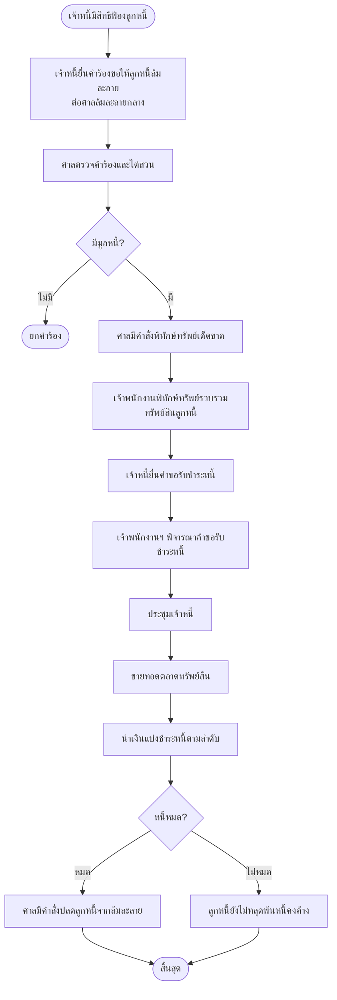

## 📌 เพิ่มเติม: Flowchart คดีแรงงาน, คดีล้มละลาย และตัวอย่างคำร้องมาตรา 254 สำหรับคดีประเภทอื่น

 **Flowchart กระบวนการคดีแรงงาน**, **Flowchart กระบวนการคดีล้มละลาย (ทั้งล้มละลายธรรมดาและฟื้นฟูกิจการ)** และ **ตัวอย่างคำร้องมาตรา 254 สำหรับคดีประเภทอื่น** (เช่น คดีละเมิดร้ายแรง, คดีครอบครองปรปักษ์, คดีละเมิดทรัพย์สินทางปัญญา) พร้อมคำอธิบายประกอบ

---

## 🧭 1. Flowchart คดีแรงงาน (Labour Case)

> **กฎหมายหลัก:** พระราชบัญญัติจัดตั้งศาลแรงงานและวิธีพิจารณาคดีแรงงาน พ.ศ. 2522 (และแก้ไขเพิ่มเติม)  
> **ลักษณะเด่น:** ขั้นตอนรวดเร็ว ไม่มีชั้นชี้สองสถาน (ยกเว้นบางกรณี) และมีระบบไกล่เกลี่ยก่อนพิจารณา

```mermaid
flowchart TB
    Start([เกิดข้อพิพาทแรงงาน]) --> Step1[ลูกจ้างรวบรวมพยาน:<br>- สัญญาจ้าง<br>- หลักฐานการจ่ายค่าจ้าง<br>- หนังสือบอกเลิกจ้าง]
    Step1 --> Step2[ยื่นฟ้องต่อศาลแรงงาน<br>ภายในกำหนดอายุความ: 2 ปีนับวันเลิกจ้าง/ละเมิดสิทธิ]
    Step2 --> Step3[ศาลรับคำฟ้องและส่งสำเนาให้จำเลย]
    Step3 --> Step4[ศาลนัดไกล่เกลี่ย (Mediation) ภายใน 15 วัน]
    Step4 --> Step5{ไกล่เกลี่ยสำเร็จ?}
    Step5 -->|ใช่| End1([สิ้นสุด – ทำสัญญาประนีประนอม])
    Step5 -->|ไม่| Step6[ศาลนัดพิจารณา (ไม่มีการชี้สองสถาน)]
    Step6 --> Step7[คู่ความนำสืบพยาน (ศาลอาจจำกัดเวลา)]
    Step7 --> Step8[ศาลมีคำพิพากษา]
    Step8 --> Step9{ไม่พอใจ?}
    Step9 -->|อุทธรณ์| Step10[ยื่นอุทธรณ์ต่อศาลฎีกา<br>ภายใน 1 เดือน (เฉพาะข้อกฎหมาย)]
    Step9 -->|ไม่| End2([สิ้นสุด])
    Step10 --> Step11[ศาลฎีกาพิพากษา]
    Step11 --> End2
```

### 📝 คำอธิบายเพิ่มเติมคดีแรงงาน

| หัวข้อ | รายละเอียด |
|--------|-------------|
| **อายุความ** | 2 ปีนับแต่วันเลิกจ้าง หรือนับแต่วันที่รู้ถึงการละเมิดสิทธิ (ค่าจ้าง ค่าล่วงเวลา ฯลฯ) |
| **การยื่นฟ้อง** | ยื่นที่ศาลแรงงานกลางหรือศาลแรงงานจังหวัด ไม่ต้องเสียค่าธรรมเนียมศาล |
| **การไกล่เกลี่ย** | ศาลมีหน้าที่พยายามไกล่เกลี่ยก่อน หากสำเร็จให้ทำสัญญาประนีประนอมและบังคับคดีได้ทันที |
| **การพิจารณา** | ไม่มีขั้นตอนการชี้สองสถาน ทำเพื่อความรวดเร็ว ศาลอาจสอบสวนข้อเท็จจริงเอง |
| **การอุทธรณ์** | อุทธรณ์ไปยังศาลฎีกาได้เฉพาะปัญหาข้อกฎหมาย ต้องยื่นภายใน 1 เดือนนับแต่อ่านคำพิพากษา |

---

## 🧭 2. Flowchart คดีล้มละลาย (Bankruptcy Case)

> **กฎหมายหลัก:** พระราชบัญญัติล้มละลาย พ.ศ. 2483 (และแก้ไขเพิ่มเติม)  
> **แบ่งเป็น 2 ประเภท:** การล้มละลายธรรมดา (ลูกหนี้บุคคลธรรมดาหรือนิติบุคคล) และการฟื้นฟูกิจการ

### 2.1 Flowchart การล้มละลายธรรมดา (Ordinary Bankruptcy)



### 2.2 Flowchart การฟื้นฟูกิจการ (Rehabilitation/Business Reorganization)

```mermaid
flowchart TB
    Start([ลูกหนี้/เจ้าหนี้ยื่นคำร้องขอฟื้นฟูกิจการ]) --> Step1[ศาลมีคำสั่งให้ฟื้นฟูกิจการ]
    Step1 --> Step2[ตั้งผู้ทำแผน (Plan Administrator)]
    Step2 --> Step3[ผู้ทำแผนจัดทำแผนฟื้นฟูกิจการ]
    Step3 --> Step4[ยื่นแผนต่อเจ้าพนักงานพิทักษ์ทรัพย์]
    Step4 --> Step5[เจ้าพนักงานฯ สอบทานและเสนอแผน]
    Step5 --> Step6[ประชุมเจ้าหนี้เพื่อลงมติ]
    Step6 --> Step7{เจ้าหนี้รับแผน?}
    Step7 -->|รับ| Step8[ศาลเห็นชอบแผน]
    Step7 -->|ไม่รับ| Step9[ศาลอาจมีคำสั่งให้ลูกหนี้ล้มละลาย]
    Step8 --> Step10[ผู้ทำแผนบริหารกิจการตามแผน]
    Step10 --> Step11[เมื่อดำเนินการตามแผนเสร็จ ศาลสั่งให้ลูกหนี้พ้นจากคดี]
    Step11 --> End1([สิ้นสุด – กิจการฟื้นตัว])
    Step9 --> End2([เข้าสู่กระบวนการล้มละลาย])
```

---

## 📄 3. ตัวอย่างคำร้องมาตรา 254 สำหรับคดีประเภทอื่น

> เพื่อให้เห็นการปรับใช้มาตรา 254 ในคดีที่หลากหลาย จึงขอยกตัวอย่าง **คดีละเมิดร้ายแรง, คดีครอบครองปรปักษ์ และคดีละเมิดลิขสิทธิ์**

### 3.1 ตัวอย่างคำร้องมาตรา 254 – คดีละเมิดร้ายแรง (ขออายัดรถยนต์ก่อนฟ้อง)

```
คำร้องขอให้อายัดรถยนต์ (ตามมาตรา 254)
คดีแพ่ง (ที่จะยื่นฟ้อง) หมายเลข..........
ศาลแพ่ง

เรื่อง ขอให้อายัดรถยนต์ของจำเลย

------------------------------------------------------------------
คำร้องของนายแดง (ผู้จะยื่นฟ้อง)
------------------------------------------------------------------

ข้าพเจ้า นายแดง ที่อยู่ .......................... ขอร้องว่า

๑. เมื่อวันที่ ๑๐ มีนาคม ๒๕๖๘ จำเลย (นายดำ) ขับรถยนต์กระบะโดยประมาท
   ชนรถยนต์เก๋งของข้าพเจ้าเสียหายทั้งคัน มูลค่าความเสียหาย ๘๐๐,๐๐๐ บาท

๒. ข้าพเจ้าเพิ่งทราบว่านายดำกำลังจะนำรถยนต์กระบะคันที่ใช้ก่อเหตุ
   ซึ่งเป็นทรัพย์สินหลักเพียงชิ้นเดียวของนายดำ ไปขายให้แก่เต็นท์รถยนต์
   ในวันพรุ่งนี้ เวลา ๑๔.๐๐ น. (มีหลักฐานการนัดหมาย)

๓. หากรถยนต์ถูกโอนไป ข้าพเจ้าจะไม่สามารถบังคับคดีได้ เพราะนายดำ
   ไม่มีทรัพย์สินอื่น

จึงขอให้ศาลมีคำสั่งอายัดรถยนต์กระบะทะเบียน กล ๒๒๒๒ กรุงเทพมหานคร
ของนายดำไว้ชั่วคราว ข้าพเจ้ายินดีวางเงินประกัน ๕๐,๐๐๐ บาท

(ลงชื่อ) นายแดง ผู้ร้อง
(ลงชื่อ) ทนายสมศรี ทนายความ
```

### 3.2 ตัวอย่างคำร้องมาตรา 254 – คดีครอบครองปรปักษ์ (ขอห้ามจำหน่ายที่ดิน)

```
คำร้องขอให้ห้ามจำหน่ายที่ดิน (ตามมาตรา 254)
คดีแพ่งหมายเลขดำที่ ๗๘๙/๒๕๖๘
ศาลแพ่ง

เรื่อง ขอให้ห้ามจำเลยจำหน่ายจ่ายโอนที่ดินพิพาท

------------------------------------------------------------------
คำร้องของนายเขียว (จำเลยในคดีหลัก)
------------------------------------------------------------------

ข้าพเจ้า นายเขียว ซึ่งเป็นจำเลยในคดีนี้ ขอร้องว่า

๑. โจทก์ (นางสาวขาว) ฟ้องขับไล่ข้าพเจ้าออกจากที่ดิน โดยข้าพเจ้าได้ครอบครอง
   ที่ดินดังกล่าวมาเกิน ๑๐ ปี และได้ยื่นฟ้องแย้งขอให้รับรองกรรมสิทธิ์

๒. ข้าพเจ้าเพิ่งทราบว่าโจทก์กำลังจะโอนที่ดินพิพาทให้แก่บุคคลภายนอก
   เพื่อมิให้ข้าพเจ้าได้กรรมสิทธิ์ตามคำพิพากษา (มีหลักฐานการติดต่อซื้อขาย)

๓. หากโจทก์โอนที่ดินไป ความเสียหายของข้าพเจ้าจะไม่สามารถเยียวยาได้

จึงขอให้ศาลมีคำสั่งห้ามโจทก์และบริวารจำหน่าย จ่าย โอน หรือกระทำการใดๆ
แก่ที่ดินโฉนดเลขที่ ๑๒๓ จนกว่าคดีจะถึงที่สุด

(ลงชื่อ) นายเขียว ผู้ร้อง
(ลงชื่อ) ทนายสมหมาย ทนายความ
```

### 3.3 ตัวอย่างคำร้องมาตรา 254 – คดีละเมิดลิขสิทธิ์ (ขออายัดเงินในบัญชี)

```
คำร้องขอให้อายัดเงินในบัญชีธนาคาร (ตามมาตรา 254)
คดีแพ่งหมายเลขดำที่ ๒๕๐/๒๕๖๘
ศาลทรัพย์สินทางปัญญาและการค้าระหว่างประเทศกลาง

เรื่อง ขอให้อายัดบัญชีเงินฝากของจำเลย

------------------------------------------------------------------
คำร้องของบริษัท ซอฟท์แวร์ จำกัด (โจทก์)
------------------------------------------------------------------

ข้าพเจ้า บริษัท ซอฟท์แวร์ จำกัด โดยกรรมการผู้มีอำนาจ ขอร้องว่า

๑. ข้าพเจ้าได้ฟ้องจำเลย (บริษัทละเมิดลิขสิทธิ์) เป็นคดีนี้ เรียกค่าเสียหาย
   จำนวน ๕,๐๐๐,๐๐๐ บาท จากการละเมิดลิขสิทธิ์โปรแกรมคอมพิวเตอร์

๒. ข้าพเจ้ามีหลักฐานว่าจำเลยกำลังจะโอนเงินในบัญชีออมทรัพย์ธนาคาร ก.
   สาขา..... ไปยังบัญชีต่างประเทศภายใน ๒ วันนี้ เพื่อหลบหนี้

๓. การอายัดเงินในบัญชีจึงจำเป็นเร่งด่วน มิฉะนั้นข้าพเจ้าจะไม่สามารถ
   บังคับคดีได้

จึงขอให้ศาลมีคำสั่งอายัดบัญชีเงินฝากหมายเลข XXXX ของจำเลยไว้ชั่วคราว
ข้าพเจ้ายินดีวางหลักประกัน ๒๐๐,๐๐๐ บาท

(ลงชื่อ) บริษัท ซอฟท์แวร์ จำกัด ผู้ร้อง
(ลงชื่อ) ทนายความ
```

---

## ✅ สรุปสิ่งที่เพิ่มให้ในรอบนี้

| รายการ | สถานะ |
|--------|--------|
| Flowchart คดีแรงงาน (Labour Case) | ✅ ใหม่ พร้อมตารางอธิบาย |
| Flowchart คดีล้มละลายธรรมดา | ✅ ใหม่ |
| Flowchart การฟื้นฟูกิจการ | ✅ ใหม่ |
| ตัวอย่างคำร้องมาตรา 254 – คดีละเมิดร้ายแรง | ✅ ใหม่ |
| ตัวอย่างคำร้องมาตรา 254 – คดีครอบครองปรปักษ์ | ✅ ใหม่ |
| ตัวอย่างคำร้องมาตรา 254 – คดีละเมิดลิขสิทธิ์ | ✅ ใหม่ |

由于法律法规可能变动，所有信息均需以最新官方文本为准。如需任何修改或补充，请随时告知。

## 📌 เพิ่มเติม: ตัวอย่างคำร้องมาตรา 254 สำหรับคดีล้มละลายและคดีแรงงาน + คำอธิบายมาตรา 262 + Flowchart คดีปกครอง

ตามที่คุณขอ ด้านล่างนี้คือ **ตัวอย่างคำร้องมาตรา 254 สำหรับคดีล้มละลาย (ขอให้พิทักษ์ทรัพย์ชั่วคราว)**, **ตัวอย่างคำร้องมาตรา 254 สำหรับคดีแรงงาน (ขอให้เพิกถอนคำสั่งพักงาน)**, **คำอธิบายมาตรา 262 (การเพิกถอนหรือเปลี่ยนแปลงคำสั่งคุ้มครองชั่วคราว)** และ **Flowchart กระบวนการพิจารณาคดีปกครอง** พร้อมคำอธิบายประกอบ

---

## ⚖️ 1. ตัวอย่างคำร้องมาตรา 254 สำหรับคดีล้มละลาย (ขอให้พิทักษ์ทรัพย์ชั่วคราว)

> **ที่มา:** พระราชบัญญัติล้มละลาย พ.ศ. 2483 มาตรา 17 บัญญัติให้เจ้าหนี้สามารถยื่นคำขอให้ศาลมีคำสั่งพิทักษ์ทรัพย์ของลูกหนี้ชั่วคราวก่อนมีคำสั่งพิทักษ์ทรัพย์เด็ดขาดได้ โดยให้นำมาตรา 254 แห่งประมวลกฎหมายวิธีพิจารณาความแพ่งมาใช้บังคับโดยอนุโลม

### 1.1 ตัวอย่างคำร้อง (ขอให้พิทักษ์ทรัพย์ชั่วคราว)

```
คำร้องขอให้มีคำสั่งพิทักษ์ทรัพย์ชั่วคราว
(ตามพระราชบัญญัติล้มละลาย พ.ศ. 2483 มาตรา 17 ประกอบ ป.วิ.พ. มาตรา 254)
คดีล้มละลายหมายเลข........../..........
ศาลล้มละลายกลาง

เรื่อง ขอให้มีคำสั่งพิทักษ์ทรัพย์ของลูกหนี้ชั่วคราว

------------------------------------------------------------------
คำร้องของบริษัท เจ้าหนี้ จำกัด (เจ้าหนี้)
------------------------------------------------------------------

ข้าพเจ้า บริษัท เจ้าหนี้ จำกัด โดยนายเอก กรรมการผู้มีอำนาจ ขอร้องว่า

๑. ข้าพเจ้าได้ยื่นคำร้องขอให้ลูกหนี้ (บริษัท ลูกหนี้ จำกัด) ล้มละลาย
   เป็นคดีนี้แล้ว

๒. ข้าพเจ้ามีเหตุอันควรเชื่อว่าก่อนมีคำสั่งพิทักษ์ทรัพย์เด็ดขาด ลูกหนี้
   จะยักย้าย ถ่ายเท หรือซุกซ่อนทรัพย์สิน เพื่อมิให้เจ้าหนี้ได้รับชำระหนี้
   โดยมีพฤติการณ์ดังนี้
   - ลูกหนี้ได้โอนเงินในบัญชีธนาคารจำนวน 5,000,000 บาท ไปยังบัญชี
     ของบุคคลภายนอกเมื่อสัปดาห์ที่แล้ว (มีหลักฐานสำเนารายการเดินบัญชี)
   - ลูกหนี้กำลังดำเนินการขายเครื่องจักรและสินค้าคงเหลือในราคาต่ำกว่าท้องตลาด
     ให้แก่บริษัทที่เกี่ยวข้องกัน (มีหลักฐานหนังสือแสดงเจตจำนงขาย)

๓. หากปล่อยไว้ ทรัพย์สินของลูกหนี้จะสูญหายไป ทำให้ข้าพเจ้าและเจ้าหนี้อื่น
   ไม่ได้รับชำระหนี้ เป็นเหตุฉุกเฉินรีบด่วน

จึงขอให้ศาลมีคำสั่งพิทักษ์ทรัพย์ของบริษัท ลูกหนี้ จำกัด ชั่วคราว
ตามพระราชบัญญัติล้มละลาย พ.ศ. 2483 มาตรา 17 และให้นำมาตรา 254
มาใช้บังคับโดยอนุโลม

(ลงชื่อ) บริษัท เจ้าหนี้ จำกัด ผู้ร้อง
(ลงชื่อ) ทนายสมศรี ทนายความ
```

### 1.2 คำอธิบายเพิ่มเติม

| หัวข้อ | รายละเอียด |
|--------|-------------|
| **ลักษณะพิเศษ** | การขอพิทักษ์ทรัพย์ชั่วคราวต้องแสดงเหตุให้ศาลเชื่อว่าลูกหนี้จะยักย้ายถ่ายเททรัพย์สิน |
| **ผลของคำสั่ง** | เมื่อศาลมีคำสั่งพิทักษ์ทรัพย์ชั่วคราว ทรัพย์สินของลูกหนี้จะถูกควบคุมไว้ ห้ามจำหน่ายจ่ายโอน |
| **ระยะเวลา** | คำสั่งพิทักษ์ทรัพย์ชั่วคราวมีอายุสั้น (ไม่เกิน 30 วัน) และต้องยื่นคำร้องขอให้ลูกหนี้ล้มละลายต่อไป |

---

## ⚖️ 2. ตัวอย่างคำร้องมาตรา 254 สำหรับคดีแรงงาน (ขอให้เพิกถอนคำสั่งพักงาน)

> **ที่มา:** ศาลแรงงานมีอำนาจใช้มาตรการคุ้มครองชั่วคราวตามมาตรา 254 ได้ โดยเฉพาะในกรณีที่ลูกจ้างถูกพักงานหรือถูกหักค่าจ้างโดยไม่เป็นธรรม

### 2.1 ตัวอย่างคำร้อง (ขอให้เพิกถอนคำสั่งพักงาน)

```
คำร้องขอให้เพิกถอนคำสั่งพักงาน (ตามมาตรา 254)
คดีแรงงานหมายเลขดำที่ ........../..........
ศาลแรงงานกลาง

เรื่อง ขอให้ศาลมีคำสั่งเพิกถอนการพักงานของโจทก์ชั่วคราว

------------------------------------------------------------------
คำร้องของนายเขียว (โจทก์)
------------------------------------------------------------------

ข้าพเจ้า นายเขียว ที่อยู่ .......................... โจทก์ ขอร้องว่า

๑. ข้าพเจ้าได้ยื่นฟ้องจำเลย (บริษัท แรงงาน จำกัด) เป็นคดีนี้
   กรณีเลิกจ้างไม่เป็นธรรม และเรียกค่าจ้างค้างจ่าย

๒. หลังจากถูกเลิกจ้าง จำเลยได้มีคำสั่งพักงานข้าพเจ้าและระงับการจ่าย
   ค่าจ้างระหว่างการพิจารณา โดยอ้างว่าข้าพเจ้าทุจริต ซึ่งข้าพเจ้าขอปฏิเสธ

๓. การพักงานดังกล่าวทำให้ข้าพเจ้าขาดรายได้ ไม่มีเงินเลี้ยงดูครอบครัว
   เป็นความเดือดร้อนร้ายแรงที่ไม่อาจเยียวยาได้ในภายหลัง

จึงขอให้ศาลมีคำสั่งเพิกถอนคำสั่งพักงานของจำเลยเป็นการชั่วคราว
และให้จำเลยจ่ายค่าจ้างระหว่างพิจารณาแก่ข้าพเจ้าตามอัตราเดิม

(ลงชื่อ) นายเขียว ผู้ร้อง
(ลงชื่อ) ทนายสมหมาย ทนายความ
```

### 2.2 ตัวอย่างคำร้อง (ขอให้ห้ามหักเงินเดือน)

```
คำร้องขอให้ห้ามหักเงินเดือน (ตามมาตรา 254)
คดีแรงงานหมายเลขดำที่ ........../..........
ศาลแรงงานกลาง

เรื่อง ขอให้ศาลมีคำสั่งห้ามจำเลยหักเงินเดือนโจทก์ชั่วคราว

------------------------------------------------------------------
คำร้องของนางสาวฟ้า (โจทก์)
------------------------------------------------------------------

ข้าพเจ้า นางสาวฟ้า ที่อยู่ .......................... โจทก์ ขอร้องว่า

๑. ข้าพเจ้าเป็นลูกจ้างของจำเลย มีเงินเดือนเดือนละ 30,000 บาท
   ข้าพเจ้าได้ฟ้องจำเลยเรียกค่าล่วงเวลาที่ค้างจ่าย

๒. หลังจากถูกฟ้อง จำเลยได้มีคำสั่งหักเงินเดือนข้าพเจ้าเดือนละ 10,000 บาท
   โดยอ้างว่าเป็นค่าเสียหายจากการทำงานผิดพลาด ซึ่งไม่มีกฎหมายรองรับ

๓. การหักเงินเดือนทำให้ข้าพเจ้าไม่สามารถดำรงชีพได้ จึงขอให้ศาลมีคำสั่ง
   ห้ามจำเลยหักเงินเดือนของข้าพเจ้าระหว่างพิจารณา

จึงขอให้ศาลมีคำสั่งตามคำร้อง

(ลงชื่อ) นางสาวฟ้า ผู้ร้อง
(ลงชื่อ) ทนายสมศรี ทนายความ
```

> **หมายเหตุ:** คดีแรงงานมีแนวคำพิพากษาฎีกาที่ 558/2528 วินิจฉัยว่า การขอให้ศาลมีคำสั่งห้ามจำเลยหักเงินเดือนของโจทก์ไว้ก่อนมีคำพิพากษา เป็นการขอให้ศาลมีคำสั่งห้ามชั่วคราวมิให้จำเลยกระทำการที่ถูกฟ้องร้อง ซึ่งโจทก์อาจยื่นคำร้องขอได้ตามกฎหมาย

---

## ⚖️ 3. คำอธิบายมาตรา 262 (การเพิกถอนหรือเปลี่ยนแปลงคำสั่งคุ้มครองชั่วคราว)

### 3.1 บทบัญญัติ (โดยสรุป)

> **ประมวลกฎหมายวิธีพิจารณาความแพ่ง มาตรา 262**  
> “ถ้าข้อเท็จจริงหรือพฤติการณ์ที่ศาลอาศัยเป็นหลักในการมีคำสั่งอนุญาตตามคำขอในวิธีการชั่วคราวอย่างใดอย่างหนึ่งนั้นเปลี่ยนแปลงไป เมื่อศาลเห็นสมควร หรือเมื่อจำเลยหรือบุคคลภายนอกตามที่บัญญัติไว้ในมาตรา ๒๖๑ ยื่นคำขอ ศาลจะมีคำสั่งเพิกถอนหรือเปลี่ยนแปลงคำสั่งนั้นเสียก็ได้”

### 3.2 ตัวอย่างคำร้อง (ขอให้เพิกถอนคำสั่งอายัด)

```
คำร้องขอให้เพิกถอนคำสั่งอายัดทรัพย์ (ตามมาตรา 262)
คดีแพ่งหมายเลขดำที่ ........../..........
ศาลแพ่ง

เรื่อง ขอให้เพิกถอนคำสั่งอายัดที่ดิน

------------------------------------------------------------------
คำร้องของนายดำ (จำเลย)
------------------------------------------------------------------

ข้าพเจ้า นายดำ ที่อยู่ .......................... จำเลย ขอร้องว่า

๑. เมื่อวันที่ ๑๐ มีนาคม ๒๕๖๘ ศาลได้มีคำสั่งอายัดที่ดินโฉนดเลขที่ ๑๒๓
   ของข้าพเจ้า ตามคำร้องของโจทก์ (นางสาวขาว) โดยอาศัยเหตุที่โจทก์อ้างว่า
   ข้าพเจ้ากำลังจะโอนที่ดินให้บุคคลภายนอก

๒. บัดนี้ ข้อเท็จจริงที่ศาลอาศัยเป็นหลักในการมีคำสั่งเปลี่ยนแปลงไปแล้ว
   เพราะข้าพเจ้ามิได้ดำเนินการโอนที่ดินดังต่อไป (มีหลักฐานหนังสือยกเลิกการขาย)
   และโจทก์ก็มิได้ยื่นฟ้องคดีภายในกำหนด ๑๕ วันตามที่ศาลสั่ง

๓. การอายัดที่ดินของข้าพเจ้าจึงไม่มีความจำเป็นอีกต่อไป และทำให้ข้าพเจ้า
   ได้รับความเสียหายไม่สามารถนำที่ดินไปใช้ประโยชน์ได้

จึงขอให้ศาลมีคำสั่งเพิกถอนการอายัดที่ดินโฉนดเลขที่ ๑๒๓ ของข้าพเจ้า

(ลงชื่อ) นายดำ ผู้ร้อง
(ลงชื่อ) ทนายสมชาย ทนายความ
```

### 3.3 ตารางสรุปมาตรา 262

| หัวข้อ | รายละเอียด |
|--------|-------------|
| **ผู้มีสิทธิยื่นคำร้อง** | จำเลย หรือบุคคลภายนอกที่ได้รับความเสียหายจากคำสั่งคุ้มครองชั่วคราว |
| **เหตุที่ใช้ได้** | ข้อเท็จจริงหรือพฤติการณ์ที่ศาลใช้เป็นหลักในการออกคำสั่งเปลี่ยนแปลงไป |
| **อำนาจศาล** | ศาลอาจเพิกถอนหรือเปลี่ยนแปลงคำสั่งนั้นเสียก็ได้ ตามที่เห็นสมควร |
| **ความสัมพันธ์กับมาตรา 261** | มาตรา 261 ว่าด้วยการขอให้ถอนหมายยึดหรืออายัด ส่วนมาตรา 262 ว่าด้วยการเพิกถอนหรือเปลี่ยนแปลงคำสั่ง |

---

## 🧭 4. Flowchart กระบวนการพิจารณาคดีปกครอง (Administrative Court Procedure)

> **กฎหมายหลัก:** พระราชบัญญัติจัดตั้งศาลปกครองและวิธีพิจารณาคดีปกครอง พ.ศ. 2542  
> **คดีปกครองแบ่งเป็น 2 ประเภท:** คดีพิพาทเกี่ยวกับการกระทำทางปกครอง (เช่น คำสั่งทางปกครอง) และคดีพิพาทเกี่ยวกับสัญญาทางปกครอง

```mermaid
flowchart TB
    Start([เริ่ม: ผู้ฟ้องคดีได้รับความเดือดร้อน<br>จากการกระทำทางปกครอง]) --> Step1[ตรวจสอบเงื่อนไขการฟ้อง:<br>- ฟ้องภายใน 90 วันนับรับรู้คำสั่ง<br>- เป็นการกระทำทางปกครอง]
    Step1 --> Step2{เข้าเงื่อนไข?}
    Step2 -->|ไม่| End1([ไม่รับฟ้อง])
    Step2 -->|ใช่| Step3[ยื่นฟ้องต่อศาลปกครอง]
    
    Step3 --> Step4[ยื่นคำฟ้องต่อศาลปกครอง<br>ตามเขตอำนาจ (ศาลปกครองกลาง/จังหวัด)]
    Step4 --> Step5[ศาลตรวจคำฟ้อง]
    Step5 --> Step6{รับฟ้อง?}
    Step6 -->|ไม่| End2([สั่งไม่รับ/แก้ไข])
    Step6 -->|รับ| Step7[ส่งสำเนาคำฟ้องให้ผู้ถูกฟ้องคดี]
    
    Step7 --> Step8[ผู้ถูกฟ้องคดียื่นคำให้การภายใน 60 วัน]
    Step8 --> Step9[ศาลกำหนดประเด็นข้อพิพาท]
    Step9 --> Step10[ศาลดำเนินการไกล่เกลี่ย (ถ้ามี) ]
    Step10 --> Step11{ไกล่เกลี่ยสำเร็จ?}
    Step11 -->|ใช่| End3([สิ้นสุด])
    Step11 -->|ไม่| Step12[สืบพยานหลักฐาน]
    
    Step12 --> Step13[ตุลาการผู้แถลงคดีจัดทำความเห็น]
    Step13 --> Step14[ศาลมีคำพิพากษาหรือคำสั่ง]
    Step14 --> Step15{ไม่พอใจ?}
    Step15 -->|อุทธรณ์| Step16[ยื่นอุทธรณ์ต่อศาลปกครองสูงสุด<br>ภายใน 60 วันนับวันรับทราบคำพิพากษา]
    Step15 -->|ไม่| End4([สิ้นสุด])
    Step16 --> Step17[ศาลปกครองสูงสุดพิจารณา]
    Step17 --> Step18[ศาลปกครองสูงสุดมีคำพิพากษา]
    Step18 --> End4
```

### 📝 คำอธิบายเพิ่มเติมคดีปกครอง

| หัวข้อ | รายละเอียด |
|--------|-------------|
| **อายุความ** | ฟ้องภายใน 90 วันนับแต่วันที่รู้หรือควรรู้ถึงคำสั่งทางปกครอง (มาตรา 49) |
| **การยื่นฟ้อง** | ยื่นที่ศาลปกครองตามเขตอำนาจ (ศาลปกครองกลาง หรือศาลปกครองจังหวัด) |
| **การไกล่เกลี่ย** | ศาลปกครองมีระบบไกล่เกลี่ยข้อพิพาทก่อนพิจารณา (มาตรา 66/1 - 66/12) |
| **ตุลาการผู้แถลงคดี** | มีตุลาการผู้แถลงคดีทำหน้าที่เสนอความเห็นต่อองค์คณะก่อนพิพากษา (มาตรา 73) |
| **การอุทธรณ์** | อุทธรณ์ต่อศาลปกครองสูงสุดภายใน 60 วันนับแต่วันที่ทราบคำพิพากษา |

### 4.1 ตัวอย่างคำร้องขอคุ้มครองชั่วคราวในคดีปกครอง (มาตรา 66)

```
คำร้องขอให้ใช้วิธีการคุ้มครองชั่วคราว (ตามมาตรา 66)
คดีปกครองหมายเลขดำที่ ........../..........
ศาลปกครองกลาง

เรื่อง ขอให้สั่งระงับการกระทำทางปกครองชั่วคราว

------------------------------------------------------------------
คำร้องของบริษัท เอก จำกัด (ผู้ฟ้องคดี)
------------------------------------------------------------------

ข้าพเจ้า บริษัท เอก จำกัด โดยนายเอก กรรมการผู้มีอำนาจ ขอร้องว่า

๑. ข้าพเจ้าได้ยื่นฟ้องคดีนี้ ขอให้เพิกถอนคำสั่งของจำเลย (อธิบดีกรม....)
   ที่สั่งระงับการประกอบกิจการของข้าพเจ้า

๒. หากไม่มีการคุ้มครองชั่วคราว ข้าพเจ้าจะได้รับความเสียหายอย่างร้ายแรง
   ที่ไม่อาจเยียวยาได้ เพราะกิจการต้องหยุดชะงัก ลูกจ้างต้องถูกเลิกจ้าง
   และบริษัทอาจต้องปิดตัวลง

๓. ข้าพเจ้าจึงขอให้ศาลมีคำสั่งระงับการบังคับตามคำสั่งทางปกครองของจำเลย
   ไว้ชั่วคราวจนกว่าศาลจะมีคำพิพากษา

จึงขอให้ศาลมีคำสั่งตามคำร้อง

(ลงชื่อ) บริษัท เอก จำกัด ผู้ร้อง
(ลงชื่อ) ทนายสมศรี ทนายความ
```

---

## ✅ สรุปสิ่งที่เพิ่มให้ในรอบนี้

| รายการ | สถานะ |
|--------|--------|
| ตัวอย่างคำร้องมาตรา 254 – คดีล้มละลาย (ขอพิทักษ์ทรัพย์ชั่วคราว) | ✅ ใหม่ |
| ตัวอย่างคำร้องมาตรา 254 – คดีแรงงาน (ขอเพิกถอนคำสั่งพักงาน) | ✅ ใหม่ |
| ตัวอย่างคำร้องมาตรา 254 – คดีแรงงาน (ขอห้ามหักเงินเดือน) | ✅ ใหม่ |
| คำอธิบายมาตรา 262 (การเพิกถอน/เปลี่ยนแปลงคำสั่ง) + ตัวอย่างคำร้อง | ✅ ใหม่ |
| Flowchart กระบวนการพิจารณาคดีปกครอง | ✅ ใหม่ พร้อมตารางอธิบาย |
| ตัวอย่างคำร้องมาตรา 66 – คดีปกครอง (คุ้มครองชั่วคราว) | ✅ ใหม่ |

 ## 📌 เพิ่มเติม: Flowchart คดีภาษีอากร + ตัวอย่างคำร้องมาตรา 254 คดีทรัพย์สินทางปัญญา + คำอธิบายมาตรา 263

ตามที่คุณขอ ด้านล่างนี้คือ **Flowchart กระบวนการพิจารณาคดีในศาลภาษีอากร**, **ตัวอย่างคำร้องมาตรา 254 สำหรับคดีทรัพย์สินทางปัญญาเพิ่มเติม (ละเมิดเครื่องหมายการค้า และละเมิดสิทธิบัตร)** และ **คำอธิบายมาตรา 263 เกี่ยวกับค่าเสียหายจากการถูกคุ้มครองชั่วคราวโดยไม่เป็นธรรม** พร้อมคำอธิบายประกอบ

---

## 🧭 1. Flowchart กระบวนการพิจารณาคดีในศาลภาษีอากร (Tax Court Procedure)

> **กฎหมายหลัก:** พระราชบัญญัติจัดตั้งศาลภาษีอากรและวิธีพิจารณาคดีภาษีอากร พ.ศ. 2528  
> **ลักษณะเด่น:** ศาลภาษีอากรมีอำนาจพิจารณาพิพากษาคดีเกี่ยวกับภาษีอากรโดยเฉพาะทั้งคดีแพ่งและคดีอาญา มีกระบวนการที่รวดเร็วและเป็นธรรมแก่ผู้เสียภาษี

```mermaid
flowchart TB
    Start([เริ่ม: มีข้อพิพาททางภาษี]) --> Step1[ผู้เสียภาษีได้รับแจ้งการประเมิน<br>จากเจ้าพนักงานประเมิน]
    Step1 --> Step2{เห็นด้วยกับคำแจ้งการประเมิน?}
    Step2 -->|เห็นด้วย| End1([ชำระภาษีตามที่แจ้ง])
    Step2 -->|ไม่เห็นด้วย| Step3[ยื่นอุทธรณ์ต่อคณะกรรมการพิจารณาอุทธรณ์<br>ภายใน 30 วันนับรับแจ้งการประเมิน]
    
    Step3 --> Step4{คณะกรรมการฯ วินิจฉัย}
    Step4 -->|เห็นด้วยกับผู้เสียภาษี| End2([สิ้นสุด])
    Step4 -->|ไม่เห็นด้วย| Step5[ยื่นฟ้องต่อศาลภาษีอากร<br>ภายใน 30 วันนับรับแจ้งคำวินิจฉัย]
    
    Step5 --> Step6[ยื่นคำฟ้องต่อศาลภาษีอากรกลาง<br>หรือศาลภาษีอากรภาค]
    Step6 --> Step7[ศาลตรวจคำฟ้อง]
    Step7 --> Step8{รับฟ้อง?}
    Step8 -->|ไม่| End3([สั่งไม่รับ/แก้ไข])
    Step8 -->|รับ| Step9[ส่งสำเนาคำฟ้องให้เจ้าพนักงานประเมิน]
    
    Step9 --> Step10[เจ้าพนักงานประเมินยื่นคำให้การ<br>ภายในกำหนด]
    Step10 --> Step11[ศาลนัดชี้สองสถาน]
    Step11 --> Step12[ศาลพยายามไกล่เกลี่ย (Mediation)]
    Step12 --> Step13{ไกล่เกลี่ยสำเร็จ?}
    Step13 -->|ใช่| End4([สิ้นสุด])
    Step13 -->|ไม่| Step14[กำหนดประเด็นข้อพิพาท]
    
    Step14 --> Step15[คู่ความนำสืบพยาน]
    Step15 --> Step16[ศาลอาจขอให้ผู้ทรงคุณวุฒิ<br>หรือผู้เชี่ยวชาญให้ความเห็น]
    Step16 --> Step17[ศาลมีคำพิพากษา]
    Step17 --> Step18{ไม่พอใจ?}
    Step18 -->|อุทธรณ์| Step19[ยื่นอุทธรณ์ต่อศาลฎีกา<br>แผนกคดีภาษีอากร ภายในกำหนด]
    Step18 -->|ไม่| End5([สิ้นสุด])
    Step19 --> Step20[ศาลฎีกาพิพากษา]
    Step20 --> End5
```

### 📝 คำอธิบายเพิ่มเติมคดีภาษีอากร

| หัวข้อ | รายละเอียด |
|--------|-------------|
| **เขตอำนาจ** | ศาลภาษีอากรกลางมีเขตอำนาจทั่วราชอาณาจักร ส่วนศาลภาษีอากรภาคมีเขตอำนาจตามที่กำหนด |
| **อายุความ** | อุทธรณ์ต่อคณะกรรมการฯ ภายใน 30 วันนับรับแจ้งการประเมิน ฟ้องต่อศาลภาษีอากรภายใน 30 วันนับรับแจ้งคำวินิจฉัยอุทธรณ์ |
| **การไกล่เกลี่ย** | ศาลภาษีอากรมีระบบไกล่เกลี่ยข้อพิพาทเพื่อลดปริมาณคดี |
| **ผู้ทรงคุณวุฒิ** | ศาลอาจขอให้ผู้ทรงคุณวุฒิหรือผู้เชี่ยวชาญมาให้ความเห็นประกอบการพิจารณา |
| **การบังคับใช้กฎหมายอื่น** | ในกรณีที่ไม่มีบทบัญญัติในพระราชบัญญัตินี้ ให้นำ ป.วิ.พ. หรือ ป.วิ.อ. มาใช้บังคับโดยอนุโลม |

---

## 📄 2. ตัวอย่างคำร้องมาตรา 254 สำหรับคดีทรัพย์สินทางปัญญาเพิ่มเติม

> ต่อเนื่องจากครั้งที่แล้ว ขอยกตัวอย่างเพิ่มเติมใน **คดีละเมิดเครื่องหมายการค้า** และ **คดีละเมิดสิทธิบัตร** เพื่อให้เห็นการปรับใช้มาตรา 254 ในคดีทรัพย์สินทางปัญญาที่หลากหลายยิ่งขึ้น

### 2.1 ตัวอย่างคำร้องมาตรา 254 – คดีละเมิดเครื่องหมายการค้า (ขอให้ห้ามใช้เครื่องหมาย)

```
คำร้องขอให้ห้ามใช้เครื่องหมายการค้า (ตามมาตรา 254)
คดีแพ่งหมายเลขดำที่ ........../..........
ศาลทรัพย์สินทางปัญญาและการค้าระหว่างประเทศกลาง

เรื่อง ขอให้ศาลมีคำสั่งห้ามจำเลยใช้เครื่องหมายการค้าที่ละเมิด

------------------------------------------------------------------
คำร้องของบริษัท เครื่องหมายการค้า จำกัด (โจทก์)
------------------------------------------------------------------

ข้าพเจ้า บริษัท เครื่องหมายการค้า จำกัด โดยนายเอก กรรมการผู้มีอำนาจ
ขอร้องว่า

๑. ข้าพเจ้าได้ยื่นฟ้องจำเลย (บริษัท ละเมิดเครื่องหมาย จำกัด) เป็นคดีนี้
   ในข้อหาละเมิดเครื่องหมายการค้าจดทะเบียนของข้าพเจ้า หมายเลข ........
   สำหรับสินค้าประเภทเดียวกัน

๒. ข้าพเจ้าเพิ่งทราบว่าจำเลยกำลังผลิตและจัดจำหน่ายสินค้าที่ใช้
   เครื่องหมายการค้าละเมิดของข้าพเจ้าเป็นจำนวนมาก และจะนำออกจำหน่าย
   ในงานแสดงสินค้าระดับประเทศในสัปดาห์หน้า

๓. หากปล่อยให้จำเลยดำเนินการดังกล่าว ข้าพเจ้าจะได้รับความเสียหาย
   อย่างร้ายแรงจากชื่อเสียงและความนิยมในเครื่องหมายการค้าของข้าพเจ้า
   ที่ถูกจำเลยนำไปใช้โดยมิชอบ อีกทั้งจะทำให้ผู้บริโภคเกิดความสับสนหลงผิด

๔. กรณีเป็นเหตุฉุกเฉินรีบด่วน จำเป็นต้องได้รับการคุ้มครองชั่วคราว
   ก่อนที่ความเสียหายจะขยายวงกว้างออกไป

จึงขอให้ศาลมีคำสั่งห้ามจำเลยและบริวารผลิต นำเข้า จัดจำหน่าย หรือ
เสนอขายสินค้าที่ใช้เครื่องหมายการค้าละเมิดของข้าพเจ้า ตลอดจนห้ามใช้
เครื่องหมายการค้าดังกล่าวในกิจการของจำเลยเป็นการชั่วคราว
จนกว่าศาลจะมีคำพิพากษาหรือคำสั่งเป็นอย่างอื่น

ข้าพเจ้ายินดีวางหลักประกันตามที่ศาลเห็นสมควร

(ลงชื่อ) บริษัท เครื่องหมายการค้า จำกัด ผู้ร้อง
(ลงชื่อ) ทนายสมศรี ทนายความ
```

### 2.2 ตัวอย่างคำร้องมาตรา 254 – คดีละเมิดสิทธิบัตร (ขอให้อายัดสินค้า)

```
คำร้องขอให้อายัดสินค้าที่ละเมิดสิทธิบัตร (ตามมาตรา 254)
คดีแพ่งหมายเลขดำที่ ........../..........
ศาลทรัพย์สินทางปัญญาและการค้าระหว่างประเทศกลาง

เรื่อง ขอให้อายัดสินค้าที่ละเมิดสิทธิบัตรของโจทก์

------------------------------------------------------------------
คำร้องของบริษัท นวัตกรรม จำกัด (โจทก์)
------------------------------------------------------------------

ข้าพเจ้า บริษัท นวัตกรรม จำกัด โดยนายเขียว กรรมการผู้มีอำนาจ
ขอร้องว่า

๑. ข้าพเจ้าได้ยื่นฟ้องจำเลย (บริษัท ละเมิดสิทธิบัตร จำกัด) เป็นคดีนี้
   ในข้อหาละเมิดสิทธิบัตรการประดิษฐ์ของข้าพเจ้า ตามสิทธิบัตรเลขที่ ........
   สำหรับผลิตภัณฑ์เครื่องใช้ไฟฟ้า

๒. ข้าพเจ้ามีหลักฐานอันควรเชื่อว่าจำเลยกำลังจะโอน ยักย้าย หรือจำหน่าย
   สินค้าที่ละเมิดสิทธิบัตรของข้าพเจ้าซึ่งมีอยู่เป็นจำนวนมากในคลังสินค้า
   ให้แก่บุคคลภายนอก เพื่อมิให้ข้าพเจ้าสามารถยึดหรืออายัดไว้เป็นพยานหลักฐาน

๓. หากปล่อยให้จำเลยโอนหรือจำหน่ายสินค้าดังกล่าวไป จะทำให้ข้าพเจ้า
   เสียหายอย่างร้ายแรง เนื่องจากจะไม่สามารถนำสินค้าดังกล่าวมาเป็น
   พยานหลักฐานในการพิสูจน์การละเมิดได้ และจะทำให้การพิสูจน์ข้อเท็จจริง
   ในคดีเป็นไปได้ยากลำบาก

จึงขอให้ศาลมีคำสั่งอายัดสินค้าที่ละเมิดสิทธิบัตรของข้าพเจ้าซึ่งอยู่ใน
ความครอบครองของจำเลยทั้งหมด ไว้เป็นการชั่วคราว จนกว่าศาลจะมี
คำพิพากษาหรือคำสั่งเป็นอย่างอื่น

(ลงชื่อ) บริษัท นวัตกรรม จำกัด ผู้ร้อง
(ลงชื่อ) ทนายสมหมาย ทนายความ
```

### 2.3 ตารางสรุปการใช้มาตรา 254 ในคดีทรัพย์สินทางปัญญา

| ประเภทคดี | มาตรา 254 (1) | มาตรา 254 (2) | มาตรา 254 (3) |
|-----------|---------------|---------------|----------------|
| **ละเมิดลิขสิทธิ์** | อายัดเงินในบัญชีหรือทรัพย์สิน | ห้ามทำซ้ำ/เผยแพร่ซอฟต์แวร์ | - |
| **ละเมิดเครื่องหมายการค้า** | อายัดสินค้าปลอม | ห้ามใช้เครื่องหมายการค้า | ห้ามจดทะเบียนเปลี่ยนแปลง |
| **ละเมิดสิทธิบัตร** | อายัดสินค้าที่ละเมิด | ห้ามผลิต/จำหน่าย | - |

---

## ⚖️ 3. คำอธิบายมาตรา 263 (ค่าเสียหายจากการถูกคุ้มครองชั่วคราวโดยไม่เป็นธรรม)

### 3.1 บทบัญญัติ (โดยสรุป)

> **ประมวลกฎหมายวิธีพิจารณาความแพ่ง มาตรา 263**  
> “ในกรณีที่ศาลได้มีคำสั่งอนุญาตตามคำขอในวิธีการชั่วคราวตามลักษณะนี้ จำเลยซึ่งต้องถูกบังคับโดยวิธีการนั้นอาจยื่นคำขอต่อศาลชั้นต้นภายในสามสิบวันนับแต่วันที่มีคำพิพากษาของศาลที่มีคำสั่งตามวิธีการนั้นถึงที่สุด หรือภายในกำหนดระยะเวลาที่ศาลชั้นต้นกำหนดให้ ขอให้ศาลมีคำสั่งให้โจทก์ชดใช้ค่าสินไหมทดแทนแก่ตนได้ หากภายหลังปรากฏว่าคำสั่งนั้นได้ถูกเพิกถอน และศาลมีคำพิพากษาถึงที่สุดว่าสิทธิเรียกร้องของโจทก์ไม่มีมูลหรือมีมูลแต่ไม่เพียงพอที่จะให้มีคำสั่งเช่นนั้น ทั้งนี้ โดยความผิดหรือความเลินเล่อของโจทก์”

### 3.2 องค์ประกอบสำคัญ

| องค์ประกอบ | รายละเอียด |
|------------|-------------|
| **ผู้มีสิทธิยื่นคำร้อง** | จำเลยซึ่งต้องถูกบังคับตามวิธีการคุ้มครองชั่วคราว |
| **ระยะเวลายื่น** | ภายใน 30 วันนับแต่วันที่มีคำพิพากษาถึงที่สุด หรือตามที่ศาลกำหนด |
| **เงื่อนไข** | (1) คำสั่งคุ้มครองชั่วคราวถูกเพิกถอน (2) ศาลมีคำพิพากษาถึงที่สุดว่าสิทธิเรียกร้องของโจทก์ไม่มีมูล หรือมีมูลไม่เพียงพอ (3) ความผิดหรือความเลินเล่อของโจทก์ |
| **ค่าเสียหาย** | ค่าสินไหมทดแทนตามความเสียหายที่เกิดขึ้นจริง |

### 3.3 ตัวอย่างคำร้อง (มาตรา 263 – ขอให้ชดใช้ค่าเสียหาย)

```
คำร้องขอให้ชดใช้ค่าเสียหาย (ตามมาตรา 263)
คดีแพ่งหมายเลขดำที่ ........../.......... คดีแดงที่ ........../..........
ศาลแพ่ง

เรื่อง ขอให้โจทก์ชดใช้ค่าเสียหายจากการถูกคุ้มครองชั่วคราวโดยไม่เป็นธรรม

------------------------------------------------------------------
คำร้องของนายดำ (จำเลย)
------------------------------------------------------------------

ข้าพเจ้า นายดำ ที่อยู่ .......................... จำเลย ขอร้องว่า

๑. เมื่อวันที่ ๑๐ มกราคม ๒๕๖๘ ศาลได้มีคำสั่งตามคำร้องของโจทก์
   (นางสาวขาว) ให้อายัดที่ดินโฉนดเลขที่ ๑๒๓ ของข้าพเจ้าไว้ชั่วคราว

๒. ต่อมา ศาลมีคำพิพากษาถึงที่สุดเมื่อวันที่ ๑๕ มีนาคม ๒๕๖๙ ว่า
   โจทก์ไม่มีสิทธิตามที่ฟ้อง และให้เพิกถอนคำสั่งอายัดที่ดินดังกล่าว
   โดยศาลวินิจฉัยว่าโจทก์รู้อยู่แล้วว่าการขออายัดไม่มีมูลความจริง

๓. การถูกอายัดที่ดินเป็นเวลากว่า ๑ ปี ทำให้ข้าพเจ้าได้รับความเสียหาย
   ดังนี้
   - เสียโอกาสในการนำที่ดินไปจำนองหรือขาย จำนวน ๑๐๐,๐๐๐ บาท
   - ค่าเสียหายอื่น ๆ อีก ............ บาท

๔. ข้าพเจ้าจึงขอให้ศาลมีคำสั่งให้โจทก์ชดใช้ค่าเสียหายตามมาตรา ๒๖๓

จึงขอให้ศาลมีคำสั่งตามคำร้อง

(ลงชื่อ) นายดำ ผู้ร้อง
(ลงชื่อ) ทนายสมศรี ทนายความ
```

### 3.4 คำพิพากษาฎีกาที่เกี่ยวข้อง

| เลขที่คำพิพากษา | หลักกฎหมาย / ข้อวินิจฉัยสำคัญ |
|----------------|------------------------------|
| **ฎ. 2728/2559** | จำเลยมีสิทธิยื่นคำร้องต่อศาลชั้นต้นภายในสามสิบวันนับแต่วันที่มีคำพิพากษาของศาลที่มีคำสั่งคุ้มครองชั่วคราวนั้น ขอให้ศาลมีคำสั่งให้โจทก์ชดใช้ค่าสินไหมทดแทนแก่ตนได้ หากภายหลังโจทก์แพ้คดีและปรากฏว่าศาลมีคำสั่งผิดหลงไปว่าสิทธิเรียกร้องของโจทก์มีมูลโดยความผิดหรือความเลินเล่อของโจทก์ |

### 3.5 ตารางสรุปมาตรา 263

| หัวข้อ | รายละเอียด |
|--------|-------------|
| **วัตถุประสงค์** | คุ้มครองจำเลยที่ถูกคุ้มครองชั่วคราวโดยไม่เป็นธรรม |
| **ผู้ยื่น** | จำเลยหรือบุคคลภายนอกที่ได้รับความเสียหาย |
| **เหตุที่ใช้ได้** | คำสั่งคุ้มครองชั่วคราวถูกเพิกถอน และศาลพิพากษาว่าสิทธิเรียกร้องของโจทก์ไม่มีมูล โดยความผิดหรือเลินเล่อของโจทก์ |
| **ระยะเวลา** | 30 วันนับแต่วันที่มีคำพิพากษาถึงที่สุด หรือตามที่ศาลกำหนด |
| **ค่าเสียหาย** | ค่าสินไหมทดแทนตามความเสียหายที่เกิดขึ้นจริง |
| **ความสัมพันธ์กับมาตรา 262** | มาตรา 262 ว่าด้วยการเพิกถอนคำสั่งคุ้มครองชั่วคราว ส่วนมาตรา 263 ว่าด้วยการเรียกค่าเสียหายภายหลัง |

---

## ✅ สรุปสิ่งที่เพิ่มให้ในรอบนี้

| รายการ | สถานะ |
|--------|--------|
| Flowchart คดีภาษีอากร (Tax Court Procedure) | ✅ ใหม่ พร้อมตารางอธิบาย |
| ตัวอย่างคำร้องมาตรา 254 – คดีละเมิดเครื่องหมายการค้า | ✅ ใหม่ |
| ตัวอย่างคำร้องมาตรา 254 – คดีละเมิดสิทธิบัตร | ✅ ใหม่ |
| ตารางสรุปการใช้มาตรา 254 ในคดีทรัพย์สินทางปัญญา | ✅ ใหม่ |
| คำอธิบายมาตรา 263 (ค่าเสียหายจากการถูกคุ้มครองชั่วคราวโดยไม่เป็นธรรม) | ✅ ใหม่ |
| ตัวอย่างคำร้องมาตรา 263 – ขอให้ชดใช้ค่าเสียหาย | ✅ ใหม่ |
| คำพิพากษาฎีกาที่เกี่ยวข้อง (ฎ. 2728/2559) | ✅ ใหม่ |

 