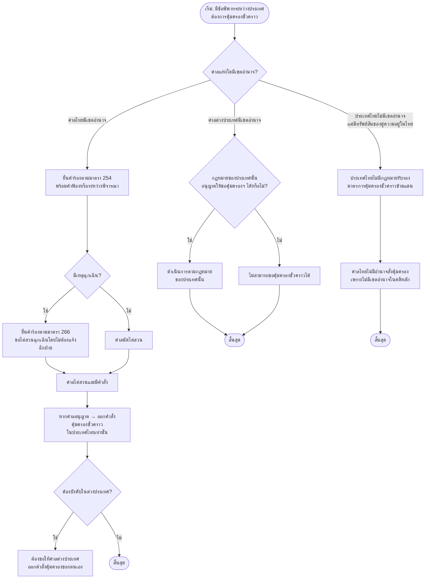

## 📌  เพิ่มเติม: ตัวอย่างคำร้องมาตรา 66 (คดีปกครอง) + Flowchart การขอคุ้มครองชั่วคราวในคดีต่างประเทศ

**ตัวอย่างคำร้องมาตรา 66 แห่งพระราชบัญญัติจัดตั้งศาลปกครองและวิธีพิจารณาคดีปกครอง พ.ศ. 2542 (วิธีการคุ้มครองชั่วคราวก่อนการพิพากษา)** และ **Flowchart การขอคุ้มครองชั่วคราวในคดีต่างประเทศ (Cross‑Border Interim Measures)** เปรียบเทียบระหว่างประเทศไทย สหรัฐอเมริกา สหราชอาณาจักร และหลักการภายใต้อนุสัญญาระหว่างประเทศ พร้อมคำอธิบายประกอบ

---

## 📄 1. ตัวอย่างคำร้องมาตรา 66 (คดีปกครอง) – วิธีการคุ้มครองชั่วคราวก่อนการพิพากษา

> **กฎหมายหลัก:** พระราชบัญญัติจัดตั้งศาลปกครองและวิธีพิจารณาคดีปกครอง พ.ศ. 2542 มาตรา 66  
> **ลักษณะพิเศษ:** ศาลปกครองมีอำนาจกำหนดมาตรการหรือวิธีการใด ๆ เพื่อบรรเทาทุกข์ให้แก่คู่กรณีเป็นการชั่วคราวก่อนการพิพากษา **ไม่ว่าจะมีคำร้องขอหรือไม่ก็ตาม** ซึ่งต่างจากมาตรา 254 แห่งประมวลกฎหมายวิธีพิจารณาความแพ่งที่ต้องมีคำร้องขอเป็นหลัก  
> **วิธีการคุ้มครองฯ แบ่งเป็น 2 ประเภทหลัก:**  
> 1. **การทุเลาการบังคับตามกฎหรือคำสั่งทางปกครอง** – ใช้ในกรณีฟ้องขอให้เพิกถอนกฎหรือคำสั่งทางปกครอง  
> 2. **การบรรเทาทุกข์ชั่วคราว** – ใช้ในกรณีอื่น ๆ ที่ศาลเห็นสมควร

### 1.1 โครงสร้างคำร้อง (มาตรา 66 – ทั่วไป)

```
คำร้องขอให้กำหนดวิธีการคุ้มครองชั่วคราวก่อนการพิพากษา
(ตามพระราชบัญญัติจัดตั้งศาลปกครองและวิธีพิจารณาคดีปกครอง พ.ศ. 2542 มาตรา 66)
คดีปกครองหมายเลขดำที่ ........../..........
ศาลปกครอง (....................)

เรื่อง ขอให้ศาลกำหนดวิธีการคุ้มครองชั่วคราวก่อนการพิพากษา

------------------------------------------------------------------
คำร้องของ (ผู้ฟ้องคดี)
------------------------------------------------------------------

ข้าพเจ้า (ชื่อ-นามสกุล) ที่อยู่ .......................... ผู้ฟ้องคดี ขอร้องว่า

๑. ข้าพเจ้าได้ยื่นฟ้อง (ผู้ถูกฟ้องคดี) เป็นคดีนี้ โดยขอให้ (เพิกถอนกฎ/คำสั่งทางปกครอง
   หรืออย่างอื่น) เนื่องจาก (ระบุเหตุแห่งการฟ้อง)

๒. ในระหว่างการพิจารณาคดี หากไม่มีการกำหนดวิธีการคุ้มครองชั่วคราว ข้าพเจ้าจะได้รับ
   ความเสียหายอย่างร้ายแรงที่ไม่อาจเยียวยาได้ในภายหลัง เพราะ (ระบุเหตุ เช่น
   - ถูกหน่วยงานทางปกครองสั่งลงโทษทางปกครองและกำลังจะถูกบังคับ
   - ถูกสั่งพักใช้ใบอนุญาตประกอบวิชาชีพ ทำให้ขาดรายได้
   - ถูกสั่งระงับการก่อสร้างโครงการที่ได้รับอนุญาตแล้ว)

๓. ข้าพเจ้าจึงขอให้ศาลมีคำสั่ง (เลือกวิธีการที่ขอ)
   - ให้ทุเลาการบังคับตาม (กฎ/คำสั่งทางปกครอง) จนกว่าศาลจะมีคำพิพากษา
   - ให้ระงับการกระทำของหน่วยงานทางปกครองเป็นการชั่วคราว
   - กำหนดวิธีการอื่นใดตามที่ศาลเห็นสมควร

จึงขอให้ศาลมีคำสั่งตามคำร้อง

(ลงชื่อ) .......................... ผู้ฟ้องคดี
(ลงชื่อ) .......................... ทนายความ (ถ้ามี)
```

### 1.2 ตัวอย่างคำร้อง – คดีทุเลาการบังคับตามคำสั่งทางปกครอง (กรณีถูกสั่งพักใช้ใบอนุญาต)

```
คำร้องขอให้ทุเลาการบังคับตามคำสั่งทางปกครอง
(ตามพระราชบัญญัติจัดตั้งศาลปกครองและวิธีพิจารณาคดีปกครอง พ.ศ. 2542 มาตรา 66)
คดีปกครองหมายเลขดำที่ ๑๐๑/๒๕๖๙
ศาลปกครองกลาง

เรื่อง ขอให้ทุเลาการบังคับตามคำสั่งคณะกรรมการวิชาชีพ

------------------------------------------------------------------
คำร้องของนายวิชัย (ผู้ฟ้องคดี)
------------------------------------------------------------------

ข้าพเจ้า นายวิชัย ที่อยู่ .......................... ผู้ฟ้องคดี ขอร้องว่า

๑. ข้าพเจ้าได้ยื่นฟ้องคณะกรรมการวิชาชีพ (ผู้ถูกฟ้องคดี) เป็นคดีนี้ ขอให้เพิกถอน
   คำสั่งที่ ............ ลงวันที่ ๑๕ มีนาคม ๒๕๖๙ ซึ่งสั่งพักใช้ใบอนุญาตประกอบวิชาชีพ
   ของข้าพเจ้าเป็นเวลา ๑ ปี เนื่องจากคณะกรรมการฯ วินิจฉัยว่าข้าพเจ้าทำผิดจรรยาบรรณ
   ซึ่งข้าพเจ้าเห็นว่าไม่เป็นความจริง

๒. ในระหว่างการพิจารณาคดี หากไม่มีการทุเลาการบังคับตามคำสั่งดังกล่าว ข้าพเจ้า
   จะถูกพักใช้ใบอนุญาต และไม่สามารถประกอบวิชาชีพได้ ขาดรายได้เลี้ยงดูครอบครัว
   เป็นความเสียหายอย่างร้ายแรงที่ไม่อาจเยียวยาได้ในภายหลัง แม้ศาลจะพิพากษาให้
   ข้าพเจ้าชนะคดีในที่สุด

๓. ข้าพเจ้าจึงขอให้ศาลมีคำสั่งทุเลาการบังคับตามคำสั่งคณะกรรมการวิชาชีพที่............
   ลงวันที่ ๑๕ มีนาคม ๒๕๖๙ ไว้ชั่วคราว จนกว่าศาลจะมีคำพิพากษาหรือคำสั่งเป็นอย่างอื่น

จึงขอให้ศาลมีคำสั่งตามคำร้อง

(ลงชื่อ) นายวิชัย ผู้ฟ้องคดี
(ลงชื่อ) ทนายสมศรี ทนายความ
```

### 1.3 ตัวอย่างคำร้อง – คดีสิ่งแวดล้อม (ขอให้ทุเลาการดำเนินโครงการ)

> **กรณีศึกษา:** คดีสมาคมต่อต้านสภาวะโลกร้อนและพวก ฟ้องขอให้เพิกถอนการให้ความเห็นชอบรายงานการประเมินผลกระทบสิ่งแวดล้อม (EIA) โครงการอาคารชุดสูง โดยศาลปกครองชั้นต้นมีคำสั่งให้ทุเลาการบังคับตามมติของผู้ถูกฟ้องคดี

```
คำร้องขอให้ทุเลาการบังคับตามมติ (กรณีโครงการก่อสร้าง)
(ตามพระราชบัญญัติจัดตั้งศาลปกครองและวิธีพิจารณาคดีปกครอง พ.ศ. 2542 มาตรา 66)
คดีปกครองหมายเลขดำที่ ๘๘/๒๕๖๖
ศาลปกครองกลาง

เรื่อง ขอให้ทุเลาการบังคับตามมติคณะกรรมการผู้ชำนาญการพิจารณารายงาน EIA

------------------------------------------------------------------
คำร้องของสมาคมต่อต้านสภาวะโลกร้อน (ผู้ฟ้องคดีที่ ๑) กับพวก
------------------------------------------------------------------

ข้าพเจ้า สมาคมต่อต้านสภาวะโลกร้อน โดยนายเอก เลขาธิการ และผู้ฟ้องคดีรวม ๑๘ คน
ขอร้องว่า

๑. ข้าพเจ้าทั้งสิบแปดได้ยื่นฟ้องคณะกรรมการผู้ชำนาญการพิจารณารายงานการประเมิน
   ผลกระทบสิ่งแวดล้อม (EIA) กรุงเทพมหานคร (ผู้ถูกฟ้องคดี) เป็นคดีนี้ ขอให้เพิกถอน
   การให้ความเห็นชอบรายงาน EIA โครงการอาคารชุดพักอาศัยสูง ๑๘ ชั้น ของบริษัท ศุภาลัย จำกัด
   (มหาชน) ซึ่งผู้ถูกฟ้องคดีได้มีมติในการประชุมครั้งที่ ๔๖/๒๕๖๔ ลงวันที่ ๒ สิงหาคม ๒๕๖๔
   ให้ความเห็นชอบแล้ว

๒. ขณะนี้ บริษัท ศุภาลัย จำกัด (มหาชน) ได้เข้ามาในพื้นที่เพื่อดำเนินการก่อสร้างโครงการนี้แล้ว
   ซึ่งการก่อสร้างจะก่อให้เกิดผลกระทบต่อผู้ฟ้องคดีและชาวบ้านโดยรอบพื้นที่อย่างร้ายแรง
   จากการบดบังแสงแดดที่เกิดจากเงาของอาคารโครงการ และการเปลี่ยนแปลงทิศทางลม

๓. หากศาลไม่มีคำสั่งกำหนดวิธีการคุ้มครองชั่วคราวก่อนการพิพากษา การก่อสร้างจะดำเนินต่อไป
   และอาจก่อให้เกิดความเสียหายต่อชุมชนและสิ่งแวดล้อมอย่างไม่อาจเยียวยาได้ในภายหลัง
   แม้ศาลจะพิพากษาให้ผู้ฟ้องคดีชนะคดีในที่สุดก็ตาม

จึงขอให้ศาลมีคำสั่งให้ทุเลาการบังคับตามมติของผู้ถูกฟ้องคดีในการประชุมครั้งที่ ๔๖/๒๕๖๔
ลงวันที่ ๒ สิงหาคม ๒๕๖๔ ที่ให้ความเห็นชอบรายงาน EIA โครงการดังกล่าว
และให้ระงับการดำเนินการก่อสร้างโครงการเป็นการชั่วคราวจนกว่าศาลจะมีคำพิพากษา

(ลงชื่อ) สมาคมต่อต้านสภาวะโลกร้อน ผู้ฟ้องคดีที่ ๑
(ลงชื่อ) นายเอก ผู้ฟ้องคดีที่ ๒
(............) ผู้ฟ้องคดีที่ ๓-๑๘
(ลงชื่อ) ทนายสมหมาย ทนายความ
```

### 1.4 ตารางเปรียบเทียบมาตรา 66 (ศาลปกครอง) กับมาตรา 254 (ศาลยุติธรรม)

| ประเด็น | มาตรา 66 (ศาลปกครอง) | มาตรา 254 (ศาลยุติธรรม) |
|---------|----------------------|--------------------------|
| **แหล่งกฎหมาย** | พ.ร.บ. จัดตั้งศาลปกครองฯ พ.ศ. 2542 | ป.วิ.พ. |
| **การริเริ่ม** | ศาลอาจมีคำสั่งเอง **แม้ไม่มีคำร้องขอ**  | ต้องมีคำร้องขอจากคู่ความ |
| **วิธีการ** | ทุเลาการบังคับตามกฎ/คำสั่งทางปกครอง หรือบรรเทาทุกข์ชั่วคราว | อายัด/ห้ามกระทำการตามที่กฎหมายกำหนด |
| **ลักษณะคดี** | คดีปกครอง (พิพาทเกี่ยวกับการกระทำทางปกครอง) | คดีแพ่ง (พิพาทระหว่างเอกชน) |
| **หลักประกัน** | ไม่จำเป็นต้องวางหลักประกัน | ศาลมักกำหนดให้วางหลักประกัน |
| **การอุทธรณ์** | อุทธรณ์ต่อศาลปกครองสูงสุด | อุทธรณ์ต่อศาลอุทธรณ์ |

---

## 🧭 2. Flowchart การขอคุ้มครองชั่วคราวในคดีต่างประเทศ (Cross‑Border Interim Measures)

> **ข้อสังเกตสำคัญ:**  
> 1. ประเทศไทย **ยังไม่มีกฎหมายเฉพาะ** เกี่ยวกับการรับรองมาตรการคุ้มครองชั่วคราวของศาลต่างประเทศ  
> 2. การขอคุ้มครองชั่วคราวตาม ป.วิ.พ. มาตรา 254 **ใช้ได้เฉพาะในคดีที่มีเขตอำนาจศาลไทย** หากไม่มีเขตอำนาจ ศาลไทยจะไม่มีอำนาจสั่งคุ้มครอง  
> 3. อนุสัญญากรุงเฮกว่าด้วยการรับรองและบังคับตามคำพิพากษา ค.ศ. 2019 **ไม่ครอบคลุมถึงมาตรการระหว่างกาล (interim measures)** เช่น freezing order

### 2.1 Flowchart ภาพรวมกระบวนการขอคุ้มครองชั่วคราวในคดีที่มีองค์ประกอบต่างประเทศ



### 2.2 เปรียบเทียบกฎหมายของสหรัฐอเมริกา สหราชอาณาจักร และไทย

| หัวข้อ | สหรัฐอเมริกา (Federal Rules) | สหราชอาณาจักร (England & Wales) | ประเทศไทย |
|--------|------------------------------|----------------------------------|-----------|
| **กฎหมายหลัก** | Federal Rule of Civil Procedure 65 | Civil Procedure Rules Part 25 | ป.วิ.พ. มาตรา 254–270 |
| **Preliminary Injunction / Freezing Order** | ต้องแจ้งให้อีกฝ่ายทราบ | freezing injunction (Mareva injunction) เพื่ออายัดทรัพย์ | มาตรา 254 (1) อายัดทรัพย์ |
| **Temporary Restraining Order (TRO) / Ex parte** | ออกได้โดยไม่ต้องแจ้ง หากมีเหตุฉุกเฉินและแสดงความเสียหายร้ายแรง มีอายุไม่เกิน 14 วัน | ex parte injunction ได้ในกรณีเร่งด่วน | มาตรา 266 (ไต่สวนฉุกเฉินโดยไม่ต้องแจ้ง) |
| **หลักประกัน (Security)** | ต้องวางหลักประกัน | ศาลมีดุลพินิจ | ศาลอาจกำหนดให้วาง |
| **การสนับสนุนคดีต่างประเทศ** | Section 25 of the Civil Jurisdiction and Judgments Act 1982 | ศาลอังกฤษมีอำนาจออก freezing order เพื่อสนับสนุนคดีในศาลต่างประเทศ | ศาลไทยมีเขตอำนาจเหนือทรัพย์ในไทย แต่ไม่มีกลไกรับรองคำสั่งศาลต่างประเทศ |
| **การรับรองคำสั่งคุ้มครองชั่วคราวต่างประเทศ** | ไม่มีกฎหมายเฉพาะ | English court may grant interim relief in support of foreign proceedings under s.25 CJJA 1982 | **ไม่มี** ประเทศไทยไม่มีกฎหมายรับรอง |

### 2.3 คำอธิบายเพิ่มเติมเกี่ยวกับมาตรการคุ้มครองชั่วคราวในคดีต่างประเทศ

| หัวข้อ | รายละเอียด |
|--------|-------------|
| **หลักการทั่วไป** | มาตรการคุ้มครองชั่วคราวเป็นเครื่องมือฉุกเฉินที่ศาลหรืออนุญาโตตุลาการใช้เพื่อรักษาสิทธิ หลักฐาน ทรัพย์สิน หรือสถานภาพระหว่างการพิจารณาคดี |
| **การขอในคดีที่ศาลไทยมีเขตอำนาจ** | หากศาลไทยมีเขตอำนาจเหนือคดีหลัก การขอคุ้มครองชั่วคราวตามมาตรา 254 สามารถทำได้ตามกฎหมายไทย โดยศาลอาจสั่งอายัดทรัพย์สินที่อยู่ในประเทศไทยได้ |
| **การขอในคดีที่ศาลต่างประเทศมีเขตอำนาจ** | ในคดีที่อยู่นอกเขตอำนาจศาลไทย ศาลไทยไม่มีอำนาจออกคำสั่งคุ้มครองชั่วคราว อย่างไรก็ตาม ภายใต้พระราชบัญญีติอนุญาโตตุลาการ พ.ศ. 2545 มาตรา 16 ศาลไทยอาจออกมาตรการคุ้มครองชั่วคราวเพื่อสนับสนุนอนุญาโตตุลาการระหว่างประเทศได้ |
| **Freezing Injunction (Mareva Injunction)** | เป็นคำสั่งห้ามจำหน่ายจ่ายโอนทรัพย์สินที่ใช้ในคดีของอังกฤษ มีผลใช้บังคับกับทรัพย์สินทุกประเภทของลูกหนี้ทั่วโลก |
| **ข้อจำกัดตามอนุสัญญากรุงเฮก 2019** | อนุสัญญากรุงเฮกว่าด้วยการรับรองและบังคับตามคำพิพากษา ค.ศ. 2019 **ไม่ครอบคลุมมาตรการระหว่างกาล (interim measures)** เช่น freezing order หรือคำสั่งอายัดทรัพย์ |

---

## ✅ สรุปสิ่งที่เพิ่มให้ในรอบนี้

| รายการ | สถานะ |
|--------|--------|
| Template คำร้องมาตรา 66 (คดีปกครอง) – โครงสร้างทั่วไป | ✅ ใหม่ |
| ตัวอย่างคำร้องมาตรา 66 – คดีทุเลาการบังคับตามคำสั่งทางปกครอง | ✅ ใหม่ |
| ตัวอย่างคำร้องมาตรา 66 – คดีสิ่งแวดล้อม (ทุเลาการดำเนินโครงการ EIA) | ✅ ใหม่ |
| ตารางเปรียบเทียบมาตรา 66 กับมาตรา 254 | ✅ ใหม่ |
| Flowchart การขอคุ้มครองชั่วคราวในคดีต่างประเทศ | ✅ ใหม่ |
| ตารางเปรียบเทียบกฎหมาย US / UK / Thai | ✅ ใหม่ |
| คำอธิบายเพิ่มเติมเกี่ยวกับมาตรการระหว่างประเทศ | ✅ ใหม่ |

สามารถนำ Template และ Flowchart ไปใช้ในการดำเนินคดีปกครอง การวางแผนคดีระหว่างประเทศ หรือใช้เป็นเอกสารประกอบการอบรมบุคลากรทางกฎหมายได้ทันที

หากต้องการให้เพิ่ม **ตัวอย่างคำสั่งศาลปกครองสูงสุดเกี่ยวกับวิธีการคุ้มครองชั่วคราว** หรือ **Flowchart การขอให้ศาลไทยออกมาตรการคุ้มครองชั่วคราวเพื่อสนับสนุนอนุญาโตตุลาการระหว่างประเทศ** หรือ **ตัวอย่างคำร้องมาตรา 66 เพิ่มเติม** แจ้งได้เลยครับFlowchart คดีล้มละลายระหว่างประเทศ + ตัวอย่างคำร้องมาตรา 254 สำหรับคดีอื่นเพิ่มเติม

 **Flowchart กระบวนการล้มละลายระหว่างประเทศ (Cross-Border Insolvency)**, **ตัวอย่างคำร้องมาตรา 254 สำหรับคดีอื่นเพิ่มเติม (คดีหย่าและคดีละเมิดลิขสิทธิ์เพิ่มเติม)** และ **ตารางสรุปการใช้มาตรา 254 ในคดีประเภทต่าง ๆ** พร้อมคำอธิบายประกอบ

---

## 🧭 1. Flowchart กระบวนการล้มละลายระหว่างประเทศ (Cross-Border Insolvency)

> **หมายเหตุสำคัญ:** ประเทศไทย **ยังมิได้เข้าเป็นภาคีอนุสัญญาหรือกฎหมายแม่บท UNCITRAL ว่าด้วยการล้มละลายข้ามชาติ (Model Law on Cross-Border Insolvency)** และกฎหมายล้มละลายไทย **ไม่มีบทบัญญัติเฉพาะ** เกี่ยวกับการล้มละลายระหว่างประเทศ  
> การดำเนินการจึงต้องอาศัย **หลักทั่วไปของกฎหมายระหว่างประเทศแผนกคดีบุคคล** และ **ความร่วมมือระหว่างศาล** เป็นหลัก

### 1.1 หลักการพื้นฐาน

| หัวข้อ | รายละเอียด |
|--------|-------------|
| **กฎหมายหลัก** | พระราชบัญญัติล้มละลาย พ.ศ. 2483 (และฉบับแก้ไข) |
| **เขตอำนาจศาล** | ศาลล้มละลายกลาง (Central Bankruptcy Court) มีอำนาจพิจารณาคดีล้มละลายของลูกหนี้ที่ประกอบธุรกิจหรือมีภูมิลำเนาในประเทศไทย |
| **ผลต่อทรัพย์สินในประเทศไทย** | การล้มละลายตามกฎหมายไทยมีผลเฉพาะทรัพย์สินของลูกหนี้ที่อยู่ในประเทศไทยเท่านั้น |
| **การรับรองคำพิพากษาต่างประเทศ** | ประเทศไทยไม่ใช่ภาคีสนธิสัญญาระหว่างประเทศเกี่ยวกับการรับรองคำพิพากษาต่างประเทศ |

### 1.2 Flowchart กระบวนการล้มละลายระหว่างประเทศ

```mermaid
flowchart TB
    Start([เริ่ม: ลูกหนี้มีหนี้สินข้ามประเทศ]) --> Step1{ลูกหนี้มีภูมิลำเนา<br>หรือประกอบธุรกิจในไทย?}
    Step1 -->|ไม่| End1([ศาลไทยไม่มีเขตอำนาจ])
    Step1 -->|ใช่| Step2[เจ้าหนี้ในประเทศ/ต่างประเทศ<br>ยื่นคำร้องขอให้ลูกหนี้ล้มละลาย<br>ต่อศาลล้มละลายกลาง]
    
    Step2 --> Step3[ศาลไต่สวนคำร้อง]
    Step3 --> Step4{ศาลมีคำสั่งรับคำร้อง?}
    Step4 -->|ไม่| End2([ยกคำร้อง])
    Step4 -->|รับ| Step5[ศาลมีคำสั่งพิทักษ์ทรัพย์เด็ดขาด]
    
    Step5 --> Step6[เจ้าพนักงานพิทักษ์ทรัพย์<br>รวบรวมทรัพย์สินของลูกหนี้<br>เฉพาะที่อยู่ในประเทศไทย]
    Step6 --> Step7[ประกาศให้เจ้าหนี้ทั้งในและต่างประเทศ<br>ยื่นคำขอรับชำระหนี้]
    Step7 --> Step8[เจ้าหนี้ต่างประเทศยื่นคำขอรับชำระหนี้<br>ผ่านตัวแทนหรือทางไปรษณีย์]
    
    Step8 --> Step9[เจ้าพนักงานพิทักษ์ทรัพย์<br>พิจารณาคำขอรับชำระหนี้]
    Step9 --> Step10{ลูกหนี้มีทรัพย์สินในต่างประเทศ?}
    Step10 -->|มี| Step11[ต้องดำเนินการตามกฎหมาย<br>ของประเทศนั้น ๆ แยกต่างหาก]
    Step10 -->|ไม่มี| Step12[ขายทอดตลาดทรัพย์สินในไทย]
    
    Step11 --> Step13[ประสานงานกับผู้บริหารทรัพย์สิน<br>ต่างประเทศ (ad hoc cooperation)]
    Step12 --> Step14[นำเงินแบ่งชำระหนี้เจ้าหนี้<br>ตามลำดับบุริมสิทธิ]
    Step13 --> Step14
    Step14 --> End3([สิ้นสุด])
```

### 📝 คำอธิบายเพิ่มเติมคดีล้มละลายระหว่างประเทศ

| หัวข้อ | รายละเอียด |
|--------|-------------|
| **การยื่นคำร้องของเจ้าหนี้ต่างประเทศ** | เจ้าหนี้ต่างประเทศสามารถยื่นคำขอรับชำระหนี้ได้เช่นเดียวกับเจ้าหนี้ในประเทศ โดยต้องแสดงหลักฐานหนี้และแปลเอกสารเป็นภาษาไทย (ถ้าจำเป็น) |
| **การรับรองกระบวนการล้มละลายต่างประเทศ** | ไทยไม่มีกฎหมายรับรองกระบวนการล้มละลายของศาลต่างประเทศโดยตรง แต่ศาลไทยอาจใช้ดุลพินิจรับฟังเป็นพยานหลักฐานประกอบ |
| **ความร่วมมือระหว่างศาล** | ในทางปฏิบัติ ศาลไทยอาจให้ความร่วมมือกับศาลต่างประเทศในระดับหนึ่ง เช่น ในคดีไทย airways มีการประสานงานกับหน่วยงานต่างประเทศ |
| **ข้อจำกัด** | หากลูกหนี้มีทรัพย์สินในหลายประเทศ เจ้าหนี้ต้องดำเนินการบังคับคดีแยกกันในแต่ละประเทศ เนื่องจากไม่มีกลไกรับรองข้ามพรมแดน |
| **แนวโน้มในอนาคต** | ประเทศไทยอยู่ระหว่างการศึกษาการนำ UNCITRAL Model Law on Cross-Border Insolvency มาใช้ |

---

## 📄 2. ตัวอย่างคำร้องมาตรา 254 สำหรับคดีอื่นเพิ่มเติม

เพื่อให้ครอบคลุมมากขึ้น ขอยกตัวอย่าง **คดีหย่า (ไม่สามารถขอได้)** และ **คดีละเมิดลิขสิทธิ์ (ตัวอย่างเพิ่มเติม)** เพื่อเป็นแนวทาง

### 2.1 ข้อควรรู้: คดีหย่า – ไม่สามารถขอคุ้มครองชั่วคราวตามมาตรา 254 ได้

> **หลักกฎหมาย:** คดีหย่าเป็นคดีเกี่ยวกับสถานะบุคคล (Status) ซึ่งสภาพแห่งคำขอท้ายฟ้องไม่เปิดช่องให้ขอคุ้มครองชั่วคราวตามมาตรา 254 ได้ เพราะมาตรา 254 มุ่งคุ้มครองประโยชน์ในทางทรัพย์สิน

#### ตัวอย่างคำร้องที่ศาลไม่รับ (กรณีศึกษา)

```
คำร้องขอให้อายัดทรัพย์ (ในคดีหย่า) – ศาลไม่รับ
คดีแพ่งหมายเลขดำที่ ........../..........
ศาลแพ่ง

เรื่อง ขอให้อายัดทรัพย์สินของจำเลย

------------------------------------------------------------------
คำร้องของนางสาวเอ (โจทก์ในคดีหย่า)
------------------------------------------------------------------

ข้าพเจ้า นางสาวเอ ที่อยู่ .......................... ขอร้องว่า

๑. ข้าพเจ้าได้ยื่นฟ้องนายบี (สามี) เป็นคดีหย่าแล้ว
๒. ข้าพเจ้าเกรงว่านายบีจะโอนทรัพย์สินให้แก่บุคคลภายนอก
   จึงขอให้ศาลอายัดทรัพย์สินของนายบีไว้ก่อน

(ศาลมีคำสั่งยกคำร้อง เพราะคดีหย่าไม่ใช่คดีที่อยู่ในข่ายขอคุ้มครองชั่วคราว
ตามมาตรา 254 ซึ่งมุ่งคุ้มครองประโยชน์ทางทรัพย์สินเท่านั้น)
```

#### คำอธิบาย

| หัวข้อ | รายละเอียด |
|--------|-------------|
| **เหตุที่ไม่สามารถขอได้** | คดีหย่าเป็นคดีเกี่ยวกับสถานะบุคคล ไม่ใช่คดีที่มีประเด็นทางทรัพย์สินโดยตรง |
| **ทางเลือกอื่น** | หากมีประเด็นเรื่องค่าเลี้ยงดูหรือแบ่งทรัพย์สินร่วม ให้แยกฟ้องเป็นอีกคดีหนึ่งหรือขอคุ้มครองตามมาตรา 254 เฉพาะในส่วนที่เกี่ยวกับทรัพย์สิน |

### 2.2 ตัวอย่างคำร้องมาตรา 254 – คดีละเมิดลิขสิทธิ์ซอฟต์แวร์ (เพิ่มเติม)

> เพิ่มเติมจากครั้งก่อน ขอยกตัวอย่าง **การขอให้ห้ามเผยแพร่และอายัดบัญชี** ในคดีละเมิดลิขสิทธิ์ซอฟต์แวร์

```
คำร้องขอให้ห้ามเผยแพร่และอายัดบัญชี (ตามมาตรา 254)
คดีแพ่งหมายเลขดำที่ ........../..........
ศาลทรัพย์สินทางปัญญาและการค้าระหว่างประเทศกลาง

เรื่อง ขอให้ห้ามจำเลยเผยแพร่ซอฟต์แวร์ละเมิดลิขสิทธิ์และอายัดบัญชี

------------------------------------------------------------------
คำร้องของบริษัท ซอฟท์แวร์ จำกัด (โจทก์)
------------------------------------------------------------------

ข้าพเจ้า บริษัท ซอฟท์แวร์ จำกัด โดยกรรมการผู้มีอำนาจ ขอร้องว่า

๑. ข้าพเจ้าได้ยื่นฟ้องจำเลย (บริษัท ละเมิดลิขสิทธิ์ จำกัด) เป็นคดีนี้
   ในข้อหาละเมิดลิขสิทธิ์โปรแกรมคอมพิวเตอร์ "ACC-Master" ของข้าพเจ้า
   โดยจำเลยทำซ้ำและเผยแพร่โดยไม่ได้รับอนุญาต

๒. ข้าพเจ้ามีหลักฐานว่าจำเลยกำลังเผยแพร่โปรแกรมละเมิดลิขสิทธิ์
   ผ่านทางเว็บไซต์ของจำเลย และมีรายได้จากการขายโปรแกรมดังกล่าว
   เข้าบัญชีธนาคารของจำเลยสัปดาห์ละประมาณ ๑๐๐,๐๐๐ บาท

๓. หากปล่อยให้จำเลยเผยแพร่ต่อไป ข้าพเจ้าจะเสียหายอย่างร้ายแรง
   จากรายได้และชื่อเสียงที่ควรได้รับ อีกทั้งจำเลยอาจโอนเงินในบัญชี
   ออกไปเพื่อหลบหนี้

จึงขอให้ศาลมีคำสั่ง
- ห้ามจำเลยและบริวารเผยแพร่ โฆษณา หรือจำหน่ายโปรแกรมคอมพิวเตอร์
  "ACC-Master" ที่ละเมิดลิขสิทธิ์ของข้าพเจ้า
- อายัดบัญชีเงินฝากของจำเลยทุกบัญชีที่ใช้รับเงินจากการขายโปรแกรม
  ดังกล่าว ไว้เป็นการชั่วคราวจนกว่าคดีจะถึงที่สุด

ข้าพเจ้ายินดีวางหลักประกัน ๑๐๐,๐๐๐ บาท ตามที่ศาลเห็นสมควร

(ลงชื่อ) บริษัท ซอฟท์แวร์ จำกัด ผู้ร้อง
(ลงชื่อ) ทนายสมศรี ทนายความ
```

---

## 📊 3. ตารางสรุปการใช้มาตรา 254 ในคดีประเภทต่าง ๆ

| ประเภทคดี | มาตรา 254 (1) ยึด/อายัด | มาตรา 254 (2) ห้ามกระทำการ | มาตรา 254 (3) อื่น ๆ | หมายเหตุ |
|-----------|-------------------------|---------------------------|---------------------|----------|
| **ละเมิดทั่วไป** | อายัดทรัพย์สิน/เงินในบัญชี | ห้ามกระทำละเมิดซ้ำ | - | ต้องแสดงความเสียหายและเหตุฉุกเฉิน |
| **ละเมิดลิขสิทธิ์** | อายัดสินค้าปลอม/เงินในบัญชี | ห้ามทำซ้ำ/เผยแพร่ซอฟต์แวร์ | - | ศาลทรัพย์สินทางปัญญาฯ |
| **ละเมิดเครื่องหมายการค้า** | อายัดสินค้าปลอม | ห้ามใช้เครื่องหมายการค้า | ห้ามจดทะเบียนเปลี่ยนแปลง | ศาลทรัพย์สินทางปัญญาฯ |
| **ละเมิดสิทธิบัตร** | อายัดสินค้าที่ละเมิด | ห้ามผลิต/จำหน่าย | - | ศาลทรัพย์สินทางปัญญาฯ |
| **ผิดสัญญา** | อายัดทรัพย์สิน | ห้ามโอน/จำหน่ายทรัพย์พิพาท | - | ต้องมีหลักฐานการผิดสัญญา |
| **ล้มละลาย** | ขอให้พิทักษ์ทรัพย์ชั่วคราว | - | - | อาศัย พ.ร.บ.ล้มละลาย มาตรา 17 ประกอบ ป.วิ.พ. มาตรา 254 |
| **แรงงาน** | อายัดเงินเดือน/ค่าชดเชย | ห้ามพักงาน/ห้ามหักเงินเดือน | - | ยื่นต่อศาลแรงงาน |
| **ผู้บริโภค** | อายัดสินค้าชำรุด | ห้ามจำหน่ายสินค้าอันตราย | - | ยื่นต่อศาลแพ่งแผนกคดีผู้บริโภค |
| **ครอบครองปรปักษ์** | - | ห้ามโอนที่ดินพิพาท | - | จำเลยในคดีหลักอาจเป็นผู้ยื่น |
| **หย่า** | **ไม่สามารถขอได้** | **ไม่สามารถขอได้** | **ไม่สามารถขอได้** | คดีเกี่ยวกับสถานะบุคคล |
| **คดีมโนสาเร่** | **ไม่สามารถขอได้** | **ไม่สามารถขอได้** | **ไม่สามารถขอได้** | ต้องเป็นคดีอื่นนอกเหนือจากคดีมโนสาเร่ |

---

## ✅ สรุปสิ่งที่เพิ่มให้ในรอบนี้

| รายการ | สถานะ |
|--------|--------|
| Flowchart คดีล้มละลายระหว่างประเทศ (Cross-Border Insolvency) | ✅ ใหม่ พร้อมตารางอธิบายหลักการ |
| คำอธิบายหลักการล้มละลายระหว่างประเทศในประเทศไทย | ✅ ใหม่ |
| ตัวอย่างคดีหย่า – กรณีที่ไม่สามารถขอมาตรา 254 ได้ | ✅ ใหม่ |
| ตัวอย่างคำร้องมาตรา 254 – คดีละเมิดลิขสิทธิ์ซอฟต์แวร์ (เพิ่มเติม) | ✅ ใหม่ |
| ตารางสรุปการใช้มาตรา 254 ในคดีประเภทต่าง ๆ | ✅ ใหม่ |

### 💡 สรุปภาพรวมทั้งหมดของมาตรา 254

| หมวดหมู่ | ใช้ได้ | ใช้ไม่ได้ |
|----------|--------|-----------|
| คดีที่มีประเด็นทางทรัพย์สิน | ✅ คดีละเมิด, ผิดสัญญา, ทรัพย์สินทางปัญญา, แรงงาน, ผู้บริโภค | ❌ คดีหย่า, คดีมโนสาเร่ |
| คดีล้มละลาย | ✅ โดยอาศัย พ.ร.บ.ล้มละลาย มาตรา 17 | - |
| คดีครอบครองปรปักษ์ | ✅ (ฝ่ายจำเลยขอห้ามโอนที่ดิน) | - |
 