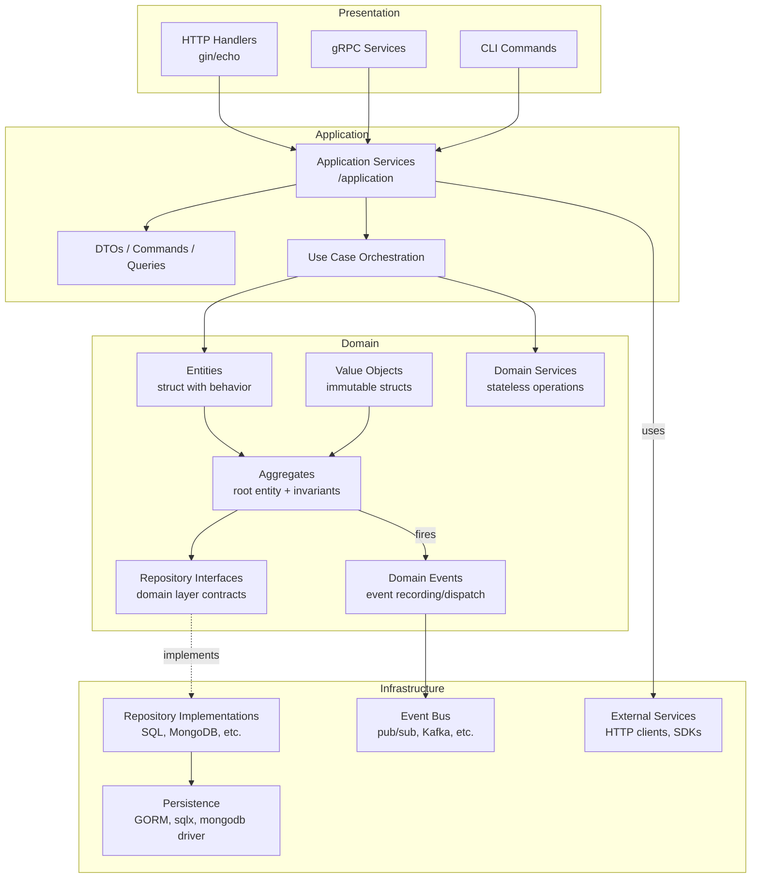

```markdown
# Tirle  xxxxxxxxxxxxxxxxxx

## Symbol | สัญลักษณ์

```html
✅ Pass | ผ่าน ❌ Not pass | ไม่ผ่าน
```
---

**Status:** 
- [ ]  Ready for merge |
- [ ]  Changes requested |
- [ ] Approved

**Reviewer:** __Dev1__________

**Date:** _2026-04-01-11-30__________

--- 

## สรุป  (ถ้ามี)
  -- xxxxxxxxx
### ผล 
### Reviewer Notes
- ✅ Pass | ผ่าน
- [ ] Not pass | ไม่ผ่าน

### ผล  mermaid
## Repositories  :  https://github.com/kongnakornna/gorestapi
##  branch : enhancement/task001
### Merge To branch  
- ✅  Merge
- [ ] NotMerge
**Date:** _2026-04-01-11-30__________


## Code Quality Checklist
### Documentation
- ✅  All exported functions have comments (godoc format)
- ✅  Package has package-level documentation comment
- ✅ Complex logic has inline comments explaining "why"
- ✅ README updated with relevant information

### Code Style
- ❌ Code formatted with `go fmt` or `gofmt`
- ❌ No unused imports or variables (`go vet` passed)
- [ ] Consistent naming convention (camelCase, PascalCase)
- [ ] No magic numbers (use constants)
- [ ] Line length < 120 characters (preferably)

### Error Handling
- [ ] All errors are handled explicitly (no `_` ignoring)
- [ ] Errors are wrapped with context (`fmt.Errorf("...: %w", err)`)
- [ ] No panic in library code (only in main/init for fatal errors)
- [ ] Custom error types used when appropriate
- [ ] Error messages are descriptive and actionable

### Concurrency
- [ ] Goroutines have proper lifecycle management
- [ ] Channels are closed appropriately
- [ ] No race conditions (`go test -race` passed)
- [ ] sync.Mutex used correctly (Lock/Unlock pairs)
- [ ] Context passed as first parameter for cancellation

### Performance
- [ ] No unnecessary allocations in hot paths
- [ ] Slice pre-allocated when size known (`make([ ]T, 0, capacity)`)
- [ ] String concatenation uses `strings.Builder` for large operations
- [ ] Database queries have appropriate indexes
- [ ] No N+1 queries

### Security
- [ ] Input validation on all external inputs
- [ ] SQL injection prevented (use parameterized queries)
- [ ] No hardcoded secrets or credentials
- [ ] Sensitive data not logged
- [ ] Passwords hashed with bcrypt (not stored in plaintext)
- [ ] JWT secrets loaded from environment
- [ ] CORS configured properly (allow only trusted origins)

### Testing
- [ ] Unit tests cover business logic
- [ ] Table-driven tests used for multiple scenarios
- [ ] Edge cases tested (nil, empty, boundary values)
- [ ] Mock external dependencies
- [ ] Test coverage > 80%

### Project Structure
- [ ] Follows standard Go project layout
- [ ] Packages have single responsibility
- [ ] No circular dependencies
- [ ] Internal packages used for private code
- [ ] Go modules properly configured

### Dependencies
- [ ] go.mod has only required dependencies
- [ ] go.sum is committed
- [ ] `go mod tidy` run before commit
- [ ] No unused dependencies

### Version Control
- [ ] Commit messages follow convention (feat, fix, docs, etc.)
- [ ] No debug code (fmt.Println, log.Println) in production code
- [ ] No commented out code
- [ ] .gitignore properly configured

### Reviewer Notes
- [ ] Code reviewed by at least one other developer
- [ ] All review comments addressed

---
```
-------------------
## หลักการทำงาน  (*จำเป็น)  แบบสั้นๆ 
### Deadlock เกิดจากอะไร

## ตัวอย่าง
## 🔍 Deadlock เกิดจากอะไร

- Deadlock จะเกิดขึ้นได้ก็ต่อเมื่อมี **4 เงื่อนไข** ต่อไปนี้เกิดขึ้นพร้อมกัน**[reference:2]**:

1. **Mutual Exclusion** –  
2. **Hold and Wait** – 
3. **No Preemption**  
4. **Circular Wait**  
 

## Test Command  |  คำสั่ง (*จำเป็น)
---

```go
go run deadlock.go 
```
 
 
## Resalte | ผลลัพธ์ (*จำเป็น)
------------
🔒 Lock 2
🔒 Lock 1

------------
### Data flow diagram (ถ้ามี)




## Remark  (ถ้ามี)


 
-----------------------
# Branch  Enchant Code

คำว่า **"Enchant Code"** น่าจะเป็นการพิมพ์ผิดจากคำว่า **"Enhancement Code"** (การปรับปรุงโค้ดให้ดีขึ้น) หรืออาจหมายถึงการเขียนโค้ดให้ **"Clean" (Clean Code)** และมีคุณภาพสูง

ในบริบทของ Git Branching สำหรับทีมใหญ่ มักจะมีการแยกประเภท Branch สำหรับ "งานปรับปรุง" ออกจาก "ฟีเจอร์ใหม่" เพื่อให้ง่ายต่อการตรวจสอบ (Code Review) และการจัดลำดับความสำคัญ (Prioritization) ดังนี้ครับ:

***

### **1. Enhancement Branch (`enhancement/xxx`)**

ใช้สำหรับงานที่ **"ไม่ใช่ฟีเจอร์ใหม่ แต่ทำให้ระบบดีขึ้น"** เช่น การปรับจูน Performance, ปรับปรุง UI/UX เล็กน้อย หรือเพิ่ม Logging

* **ความแตกต่างจาก Feature:** Feature คือสิ่งที่ User "เห็นและใช้งานได้ใหม่" ส่วน Enhancement มักเป็นการปรับปรุงของเดิมให้ดีกว่าเดิม
* **Base Branch:** แตกออกจาก `develop`
* **Pattern:** `enhancement/<TICKET-ID>-<description>`
* **ตัวอย่าง:**
    * `enhancement/CART-105-improve-loading-speed` (ทำให้โหลดเร็วขึ้น)
    * `enhancement/UI-202-adjust-button-shadow` (ปรับเงาปุ่มให้สวยขึ้น)

***

### **2. Refactor Branch (`refactor/xxx`)**

ใช้สำหรับงาน **"รื้อโครงสร้างโค้ด (Refactoring)"** โดยที่ **"ผลลัพธ์การทำงานต้องเหมือนเดิม"** (User ไม่เห็นความเปลี่ยนแปลง แต่โค้ดอ่านง่ายขึ้น บำรุงรักษาง่ายขึ้น)

* **ความสำคัญ:** ทีมใหญ่แยก Branch นี้ออกมาเพื่อบอก Reviewer ว่า *"ไม่ต้อง Test ฟังก์ชันนะ แค่ดู Logic ว่าเขียนดีขึ้นไหม"*
* **Base Branch:** แตกออกจาก `develop`
* **Pattern:** `refactor/<TICKET-ID>-<scope>`
* **ตัวอย่าง:**
    * `refactor/USER-300-clean-auth-service` (จัดระเบียบโค้ดใน Auth Service)
    * `refactor/CORE-404-remove-unused-imports` (ลบโค้ดที่ไม่ได้ใช้ออก)

***

### **3. Chore Branch (`chore/xxx`)**

ใช้สำหรับงาน **"งานบ้าน/งานจุกจิก"** ที่ไม่กระทบ Code หลัก เช่น อัปเกรด Library, แก้ไฟล์ Config, หรือเขียน Document

* **Base Branch:** แตกออกจาก `develop`
* **Pattern:** `chore/<TICKET-ID>-<task>`
* **ตัวอย่าง:**
    * `chore/DEVOPS-500-update-nestjs-v10` (อัปเกรด Version Framework)
    * `chore/DOC-101-update-readme` (แก้ไฟล์คู่มือ)

***

### **สรุปตารางเปรียบเทียบ "Enchant" (Improvement) Branches**

| ประเภท Branch | ความหมาย | ผลกระทบต่อ User | ต้องเขียน Test เพิ่มไหม? |
| :-- | :-- | :-- | :-- |
| `feature/xxx` | ของใหม่ | **เห็น** และใช้งานได้ | ✅ ต้องมี Unit/E2E Test |
| `enhancement/xxx` | ของเดิมที่ดีขึ้น | **เห็น** (ทำงานดีขึ้น/เร็วขึ้น) | ✅ อาจต้องแก้ Test เดิม |
| `refactor/xxx` | จัดระเบียบโค้ด | **ไม่เห็น** (ทำงานเหมือนเดิมเป๊ะ) | ❌ ไม่ควรแก้ Test (ถ้า Logic ไม่เปลี่ยน) |
| `chore/xxx` | งานจุกจิก/Config | **ไม่เห็น** | ❌ ไม่ต้องเขียน Test |

### **คำแนะนำเพิ่มเติมสำหรับทีมใหญ่**

ถ้าทีมของคุณต้องการเน้นเรื่อง "Enchant Code" (ทำให้โค้ดดูขลัง/เทพขึ้น 🧙‍♂️) แนะนำให้เพิ่มขั้นตอน **Automated Code Quality Check** ใน Pipeline ก่อน Merge:

1. **Linting:** บังคับใช้กฎการเขียนโค้ด (ESLint/Prettier)
2. **SonarQube:** สแกนหา "Code Smell" หรือจุดที่เขียนไม่ดี
3. **Commit Message Lint:** บังคับให้ใส่ชื่อ Branch ประเภทนี้ใน Commit Message เช่น `refactor: clean up user service` เพื่อให้ Log อ่านง่าย
-----------------------


# การตั้ง ชื่อ Branch  ทีม ใหญ่   branch หลักดังนี้:​

- main: เก็บโค้ดที่พร้อมใช้งานใน production เท่านั้น
- develop: เป็น branch หลักสำหรับการพัฒนา feature ต่างๆ
- feature/xxx: branch สำหรับพัฒนา feature ใหม่แต่ละตัว
- release/xxx: branch สำหรับเตรียมการ release เวอร์ชันใหม่
- hotfix/xxx: branch สำหรับแก้ไข bug เร่งด่วนใน production​

-  สำหรับ **ทีมขนาดใหญ่ (Large Team)** การตั้งชื่อ Branch ต้องเน้นความ **"ตรวจสอบได้ (Traceability)"** และ **"ความเป็นมาตรฐาน (Standardization)"** เพื่อให้รู้ว่าใครทำอะไร เกี่ยวข้องกับงานไหน และสถานะเป็นอย่างไร

นี่คือมาตรฐานการตั้งชื่อ Branch ที่นิยมใช้ในองค์กรใหญ่และทำงานร่วมกับระบบ Ticket (Jira, Trello, ClickUp):

### รูปแบบหลัก (Pattern)

ใช้เครื่องหมาย `/` แบ่งประเภท และ `-` คั่นคำในชื่อ (Kebab-case)
> `ประเภท/รหัสงาน-คำอธิบายสั้นๆ`

***

### 1. Feature Branches (`feature/xxx`)

ใช้สำหรับพัฒนาฟีเจอร์ใหม่ แตกจาก `develop`

* **Pattern:** `feature/<TICKET-ID>-<short-description>`
* **ความสำคัญ:** ทีมใหญ่ต้องระบุ `Ticket ID` เสมอ เพื่อให้ระบบ Automation (เช่น Jira/GitLab) ลิงก์โค้ดเข้ากับ Task งานอัตโนมัติ
* **ตัวอย่าง:**
    * `feature/JIRA-123-login-screen` (มี Ticket ID ชัดเจน)
    * `feature/AUTH-456-google-oauth`
    * `feature/PAY-789-payment-gateway`


### 2. Release Branches (`release/xxx`)

ใช้สำหรับเตรียมเวอร์ชันใหม่ แตกจาก `develop` เพื่อทำ Final Test

* **Pattern:** `release/v<MAJOR.MINOR.PATCH>` (ตามหลัก Semantic Versioning)
* **ความสำคัญ:** ห้ามใช้ชื่อเล่น (เช่น release/summer-update) ต้องใช้ตัวเลขเวอร์ชันเท่านั้น
* **ตัวอย่าง:**
    * `release/v1.0.0` (เวอร์ชันแรก)
    * `release/v1.2.0` (เพิ่มฟีเจอร์ใหม่)
    * `release/v2.0.0-rc1` (Release Candidate 1)


### 3. Hotfix Branches (`hotfix/xxx`)

ใช้แก้บั๊กเร่งด่วนบน Production แตกจาก `main`

```
*   **Pattern:** `hotfix/<TICKET-ID>-<short-description>` หรือ `hotfix/v<VERSION>-<description>`
```

* **ความสำคัญ:** ต้องระบุสิ่งที่แก้ชัดเจน เพราะเป็น Branch ที่ซีเรียสที่สุด
* **ตัวอย่าง:**
    * `hotfix/v1.0.1-fix-login-crash` (ระบุเวอร์ชันที่จะแก้)
    * `hotfix/PROD-99-fix-memory-leak` (อิงตาม Ticket แจ้งปัญหา)


### 4. (เสริม) Bugfix Branches (`bugfix/xxx`)

สำหรับทีมใหญ่ มักแยก "บั๊กทั่วไป" (บน develop) ออกจาก "บั๊กเร่งด่วน" (hotfix บน main)

* **Pattern:** `bugfix/<TICKET-ID>-<description>`
* **ความสำคัญ:** ใช้แก้บั๊กที่เจอระหว่าง Test ในช่วง Develop (ยังไม่ขึ้น Production)
* **ตัวอย่าง:**
    * `bugfix/QA-55-fix-button-color`
    * `bugfix/JIRA-124-typo-correction`


### 5. (เสริม) Chore/Refactor (`chore/xxx`)

สำหรับงานที่ไม่เกี่ยวกับ Business Logic โดยตรง เช่น อัปเกรด Library หรือจัดระเบียบโค้ด

* **ตัวอย่าง:**
    * `chore/update-nestjs-v10`
    * `refactor/clean-up-user-service`

***

### ข้อตกลงร่วมกัน (Best Practices)

1. **ตัวพิมพ์เล็กทั้งหมด (Lowercase):** ป้องกันปัญหา Case Sensitivity บน Windows/Mac (`Feature/Login` ❌ -> `feature/login` ✅)
2. **ใช้ขีดกลาง (Hyphen):** อ่านง่ายกว่า Underscore (`user_login` -> `user-login`)
3. **ห้ามใช้ชื่อบุคคล:** เช่น `feature/somchai-login` เพราะงานหนึ่งอาจทำหลายคน หรือมีการส่งต่องาน ให้ใช้ Ticket ID แทน
4. **ห้ามตั้งชื่อซ้ำ:** เมื่อ Merge และลบ Branch แล้ว ชื่อเดิมสามารถนำมาใช้ใหม่ได้ แต่ไม่แนะนำเพื่อป้องกันความสับสนใน History

### ตัวอย่างภาพรวมใน Project

| ประเภท | ชื่อ Branch | Ticket ที่เกี่ยวข้อง |
| :-- | :-- | :-- |
| **Main** | `main` | - |
| **Develop** | `develop` | - |
| **Feature** | `feature/CART-101-add-to-cart` | Ticket: CART-101 |
| **Bugfix** | `bugfix/CART-102-fix-cart-total` | Ticket: CART-102 |
| **Release** | `release/v1.5.0` | - |
| **Hotfix** | `hotfix/v1.5.1-emergency-fix` | Ticket: INC-001 |
 

# การตั้ง ชื่อ Branch  ทีม ใหญ่   branch หลักดังนี้:​

main: เก็บโค้ดที่พร้อมใช้งานใน production เท่านั้น
develop: เป็น branch หลักสำหรับการพัฒนา feature ต่างๆ
feature/xxx: branch สำหรับพัฒนา feature ใหม่แต่ละตัว
release/xxx: branch สำหรับเตรียมการ release เวอร์ชันใหม่
hotfix/xxx: branch สำหรับแก้ไข bug เร่งด่วนใน production​
enhancement/xxx: branch สำหรับแก้ไข enhancement ใน production​
 

สำหรับ **ทีมขนาดใหญ่ (Large Team)** การตั้งชื่อ Branch ต้องเน้นความ **"ตรวจสอบได้ (Traceability)"** และ **"ความเป็นมาตรฐาน (Standardization)"** เพื่อให้รู้ว่าใครทำอะไร เกี่ยวข้องกับงานไหน และสถานะเป็นอย่างไร

นี่คือมาตรฐานการตั้งชื่อ Branch ที่นิยมใช้ในองค์กรใหญ่และทำงานร่วมกับระบบ Ticket (Jira, Trello, ClickUp):

### รูปแบบหลัก (Pattern)

ใช้เครื่องหมาย `/` แบ่งประเภท และ `-` คั่นคำในชื่อ (Kebab-case)
> `ประเภท/รหัสงาน-คำอธิบายสั้นๆ`

***

### 1. Feature Branches (`feature/xxx`)

ใช้สำหรับพัฒนาฟีเจอร์ใหม่ แตกจาก `develop`

* **Pattern:** `feature/<TICKET-ID>-<short-description>`
* **ความสำคัญ:** ทีมใหญ่ต้องระบุ `Ticket ID` เสมอ เพื่อให้ระบบ Automation (เช่น Jira/GitLab) ลิงก์โค้ดเข้ากับ Task งานอัตโนมัติ
* **ตัวอย่าง:**
    * `feature/JIRA-123-login-screen` (มี Ticket ID ชัดเจน)
    * `feature/AUTH-456-google-oauth`
    * `feature/PAY-789-payment-gateway`


### 2. Release Branches (`release/xxx`)

ใช้สำหรับเตรียมเวอร์ชันใหม่ แตกจาก `develop` เพื่อทำ Final Test

* **Pattern:** `release/v<MAJOR.MINOR.PATCH>` (ตามหลัก Semantic Versioning)
* **ความสำคัญ:** ห้ามใช้ชื่อเล่น (เช่น release/summer-update) ต้องใช้ตัวเลขเวอร์ชันเท่านั้น
* **ตัวอย่าง:**
    * `release/v1.0.0` (เวอร์ชันแรก)
    * `release/v1.2.0` (เพิ่มฟีเจอร์ใหม่)
    * `release/v2.0.0-rc1` (Release Candidate 1)


### 3. Hotfix Branches (`hotfix/xxx`)

ใช้แก้บั๊กเร่งด่วนบน Production แตกจาก `main`

```
*   **Pattern:** `hotfix/<TICKET-ID>-<short-description>` หรือ `hotfix/v<VERSION>-<description>`
```

* **ความสำคัญ:** ต้องระบุสิ่งที่แก้ชัดเจน เพราะเป็น Branch ที่ซีเรียสที่สุด
* **ตัวอย่าง:**
    * `hotfix/v1.0.1-fix-login-crash` (ระบุเวอร์ชันที่จะแก้)
    * `hotfix/PROD-99-fix-memory-leak` (อิงตาม Ticket แจ้งปัญหา)


### 4. (เสริม) Bugfix Branches (`bugfix/xxx`)

สำหรับทีมใหญ่ มักแยก "บั๊กทั่วไป" (บน develop) ออกจาก "บั๊กเร่งด่วน" (hotfix บน main)

* **Pattern:** `bugfix/<TICKET-ID>-<description>`
* **ความสำคัญ:** ใช้แก้บั๊กที่เจอระหว่าง Test ในช่วง Develop (ยังไม่ขึ้น Production)
* **ตัวอย่าง:**
    * `bugfix/QA-55-fix-button-color`
    * `bugfix/JIRA-124-typo-correction`


### 5. (เสริม) Chore/Refactor (`chore/xxx`)

สำหรับงานที่ไม่เกี่ยวกับ Business Logic โดยตรง เช่น อัปเกรด Library หรือจัดระเบียบโค้ด

* **ตัวอย่าง:**
    * `chore/update-nestjs-v10`
    * `refactor/clean-up-user-service`

***

### ข้อตกลงร่วมกัน (Best Practices)

1. **ตัวพิมพ์เล็กทั้งหมด (Lowercase):** ป้องกันปัญหา Case Sensitivity บน Windows/Mac (`Feature/Login` ❌ -> `feature/login` ✅)
2. **ใช้ขีดกลาง (Hyphen):** อ่านง่ายกว่า Underscore (`user_login` -> `user-login`)
3. **ห้ามใช้ชื่อบุคคล:** เช่น `feature/somchai-login` เพราะงานหนึ่งอาจทำหลายคน หรือมีการส่งต่องาน ให้ใช้ Ticket ID แทน
4. **ห้ามตั้งชื่อซ้ำ:** เมื่อ Merge และลบ Branch แล้ว ชื่อเดิมสามารถนำมาใช้ใหม่ได้ แต่ไม่แนะนำเพื่อป้องกันความสับสนใน History

### ตัวอย่างภาพรวมใน Project

| ประเภท | ชื่อ Branch | Ticket ที่เกี่ยวข้อง |
| :-- | :-- | :-- |
| **Main** | `main` | - |
| **Develop** | `develop` | - |
| **Feature** | `feature/CART-101-add-to-cart` | Ticket: CART-101 |
| **Bugfix** | `bugfix/CART-102-fix-cart-total` | Ticket: CART-102 |
| **Release** | `release/v1.5.0` | - |
| **Hotfix** | `hotfix/v1.5.1-emergency-fix` | Ticket: INC-001 |


# Enchant Code **"Enhancement Code"** (การปรับปรุงโค้ดให้ดีขึ้น) หรืออาจเป็นการเขียนโค้ดให้ **"Clean" (Clean Code)** และมีคุณภาพสูง

ในบริบทของ Git Branching สำหรับทีมใหญ่ มักจะมีการแยกประเภท Branch สำหรับ "งานปรับปรุง" ออกจาก "ฟีเจอร์ใหม่" เพื่อให้ง่ายต่อการตรวจสอบ (Code Review) และการจัดลำดับความสำคัญ (Prioritization) ดังนี้ครับ:

- ในบริบทของ Git Branching สำหรับทีมใหญ่ มักจะมีการแยกประเภท Branch สำหรับ "งานปรับปรุง" ออกจาก "ฟีเจอร์ใหม่" เพื่อให้ง่ายต่อการตรวจสอบ (Code Review) และการจัดลำดับความสำคัญ (Prioritization) ดังนี้ครับ:


### **1. Enhancement Branch (`enhancement/xxx`)**

ใช้สำหรับงานที่ **"ไม่ใช่ฟีเจอร์ใหม่ แต่ทำให้ระบบดีขึ้น"** เช่น การปรับจูน Performance, ปรับปรุง UI/UX เล็กน้อย หรือเพิ่ม Logging

* **ความแตกต่างจาก Feature:** Feature คือสิ่งที่ User "เห็นและใช้งานได้ใหม่" ส่วน Enhancement มักเป็นการปรับปรุงของเดิมให้ดีกว่าเดิม
* **Base Branch:** แตกออกจาก `develop`
* **Pattern:** `enhancement/<TICKET-ID>-<description>`
* **ตัวอย่าง:**
    * `enhancement/CART-105-improve-loading-speed` (ทำให้โหลดเร็วขึ้น)
    * `enhancement/UI-202-adjust-button-shadow` (ปรับเงาปุ่มให้สวยขึ้น)

***

### **2. Refactor Branch (`refactor/xxx`)**

ใช้สำหรับงาน **"รื้อโครงสร้างโค้ด (Refactoring)"** โดยที่ **"ผลลัพธ์การทำงานต้องเหมือนเดิม"** (User ไม่เห็นความเปลี่ยนแปลง แต่โค้ดอ่านง่ายขึ้น บำรุงรักษาง่ายขึ้น)

* **ความสำคัญ:** ทีมใหญ่แยก Branch นี้ออกมาเพื่อบอก Reviewer ว่า *"ไม่ต้อง Test ฟังก์ชันนะ แค่ดู Logic ว่าเขียนดีขึ้นไหม"*
* **Base Branch:** แตกออกจาก `develop`
* **Pattern:** `refactor/<TICKET-ID>-<scope>`
* **ตัวอย่าง:**
    * `refactor/USER-300-clean-auth-service` (จัดระเบียบโค้ดใน Auth Service)
    * `refactor/CORE-404-remove-unused-imports` (ลบโค้ดที่ไม่ได้ใช้ออก)

***

### **3. Chore Branch (`chore/xxx`)**

ใช้สำหรับงาน **"งานบ้าน/งานจุกจิก"** ที่ไม่กระทบ Code หลัก เช่น อัปเกรด Library, แก้ไฟล์ Config, หรือเขียน Document

* **Base Branch:** แตกออกจาก `develop`
* **Pattern:** `chore/<TICKET-ID>-<task>`
* **ตัวอย่าง:**
    * `chore/DEVOPS-500-update-nestjs-v10` (อัปเกรด Version Framework)
    * `chore/DOC-101-update-readme` (แก้ไฟล์คู่มือ)

***

### **สรุปตารางเปรียบเทียบ "Enchant" (Improvement) Branches**

| ประเภท Branch | ความหมาย | ผลกระทบต่อ User | ต้องเขียน Test เพิ่มไหม? |
| :-- | :-- | :-- | :-- |
| `feature/xxx` | ของใหม่ | **เห็น** และใช้งานได้ | ✅ ต้องมี Unit/E2E Test |
| `enhancement/xxx` | ของเดิมที่ดีขึ้น | **เห็น** (ทำงานดีขึ้น/เร็วขึ้น) | ✅ อาจต้องแก้ Test เดิม |
| `refactor/xxx` | จัดระเบียบโค้ด | **ไม่เห็น** (ทำงานเหมือนเดิมเป๊ะ) | ❌ ไม่ควรแก้ Test (ถ้า Logic ไม่เปลี่ยน) |
| `chore/xxx` | งานจุกจิก/Config | **ไม่เห็น** | ❌ ไม่ต้องเขียน Test |

### **คำแนะนำเพิ่มเติมสำหรับทีมใหญ่**

ถ้าทีมของคุณต้องการเน้นเรื่อง "Enchant Code" (ทำให้โค้ดดูขลัง/เทพขึ้น 🧙‍♂️) แนะนำให้เพิ่มขั้นตอน **Automated Code Quality Check** ใน Pipeline ก่อน Merge:

1. **Linting:** บังคับใช้กฎการเขียนโค้ด (ESLint/Prettier)
2. **SonarQube:** สแกนหา "Code Smell" หรือจุดที่เขียนไม่ดี
3. **Commit Message Lint:** บังคับให้ใส่ชื่อ Branch ประเภทนี้ใน Commit Message เช่น `refactor: clean up user service` เพื่อให้ Log อ่านง่าย


# แนะนำรูปแบบการตั้งชื่อ branch สำหรับฟีเจอร์ขนาดเล็ก

สำหรับการตั้งชื่อ Branch ที่เป็น **"ฟีเจอร์ขนาดเล็ก" (Small Feature)** หรือการปรับแก้เล็กๆ น้อยๆ ที่อาจจะไม่ถึงขั้นเรียกว่าเป็น "Full Feature" ใหญ่ๆ นั้น หลักการสำคัญคือ **"อย่าสร้าง Prefix ใหม่เยอะเกินความจำเป็น"** เพื่อไม่ให้ทีมสับสนครับ

นี่คือ 3 แนวทางที่แนะนำ เรียงตามความนิยมและความเหมาะสม:

### 1. ใช้ `feature/` เหมือนเดิม (แนะนำสูงสุด ⭐️)

แม้จะเป็นงานเล็กๆ ก็ควรนับเป็น Feature เพื่อความสม่ำเสมอ (Consistency) ในการตั้งชื่อและการค้นหา

* **หลักการ:** ใช้ Pattern เดิมแต่เน้นคำอธิบายที่ **กระชับ** และเจาะจง
* **Pattern:** `feature/<TICKET>-<specific-action>`
* **ตัวอย่าง:**
    * `feature/CART-201-add-delete-btn` (แค่เพิ่มปุ่มลบปุ่มเดียว)
    * `feature/USER-305-change-font-size` (เปลี่ยนขนาดฟอนต์)
    * `feature/AUTH-102-hide-password` (ซ่อนรหัสผ่าน)


### 2. ใช้ `tweak/` (สำหรับงานจุกจิก/ปรับแต่ง)

ถ้าทีมรู้สึกว่าคำว่า `feature` ดูยิ่งใหญ่ไปสำหรับงานแก้สีปุ่ม หรือขยับ Layout นิดหน่อย การใช้ `tweak` จะสื่อความหมายได้ดีกว่าว่า "เป็นการปรับแต่งเล็กน้อย"

* **ความหมาย:** การบิด/ดัดแปลง/ปรับแต่ง (ไม่ใช่การสร้างใหม่)

```
*   **Pattern:** `tweak/<TICKET>-<description>`
```

* **ตัวอย่าง:**
    * `tweak/UI-501-adjust-padding` (ขยับช่องว่าง)
    * `tweak/UX-112-wording-change` (แก้คำผิด/แก้ข้อความ)
    * `tweak/CSS-99-dark-mode-color` (ปรับสี Dark mode นิดหน่อย)


### 3. ใช้ `ui/` หรือ `ux/` (เน้นงานหน้าบ้านโดยเฉพาะ)

สำหรับทีมที่มี Frontend หรือ Designer แยกชัดเจน อาจใช้ Prefix นี้เพื่อบอกว่าเป็นงานที่ไม่กระทบ Logic หรือ Database เลย

* **ความหมาย:** งานที่เกี่ยวกับหน้าตาล้วนๆ

```
*   **Pattern:** `ui/<TICKET>-<description>`
```

* **ตัวอย่าง:**
    * `ui/HOME-404-hero-banner` (เปลี่ยนรูป Banner)
    * `ui/MENU-202-icon-update` (เปลี่ยนไอคอน)

***

### 💡 เคล็ดลับ: การตั้งชื่อเมื่อเป็น "ส่วนย่อย" ของฟีเจอร์ใหญ่

บางครั้งฟีเจอร์เล็กๆ นั้นเป็นส่วนหนึ่งของโปรเจกต์ใหญ่ (เช่น ทำระบบ Login แต่แยก Branch มาทำแค่ปุ่ม "Lium Password")
แนะนำให้ใช้ **"Slash Grouping"** (การใช้ / ซ้อนกัน) เพื่อจัดกลุ่มใน Git GUI (เช่น SourceTree, GitKraken จะเห็นเป็นโฟลเดอร์)

* **Pattern:** `feature/<MAJOR-FEATURE>/<SUB-TASK>`
* **ตัวอย่าง:**
    * `feature/login/forget-password-link`
    * `feature/login/google-button`
    * `feature/dashboard/chart-widget`
    * `feature/dashboard/export-csv-btn`

**ข้อดี:** เวลาดูในโปรแกรม Git จะเห็น Branch ถูกจัดกลุ่มเป็นระเบียบ ไม่สะเปะสะปะครับ

### สรุปคำแนะนำ

* ถ้าอยากให้เป็นระเบียบที่สุด -> ใช้ **`feature/`** ทั้งหมด (Work สุดสำหรับ Automation)
* ถ้าอยากแยกความรู้สึกของงาน -> ใช้ **`tweak/`** สำหรับงานแก้เล็กๆ น้อยๆ
* ถ้าเป็นงานส่วนย่อยของงานใหญ่ -> ใช้ **`feature/main/sub`**

# ---------------------- 
 

# สรุป Code Review Workflow แบบเข้าใจง่าย

1) Code Assistant — เขียนโค้ดด้วยเครื่องมือช่วย
• ใช้ AI/Code Assistant ช่วยเขียนโค้ดให้เร็วขึ้น
• ตรวจสไตล์โค้ดเบื้องต้นก่อนส่งขึ้นระบบ
เริ่มต้นให้โค้ดพร้อมตรวจ
⸻
2) Pull Request — ส่งโค้ดให้ทีมตรวจ
• เปิด Pull Request พร้อมคำอธิบาย
• แนบรายการเปลี่ยนแปลง, Issue ที่เกี่ยวข้อง
• Reviewer สามารถเข้ามาตรวจได้ทันที
เป็นขั้นตอนขอให้ทีมช่วยตรวจ
⸻
3) CI Pipeline — ตรวจอัตโนมัติ
• ระบบรัน Test / Lint / Build อัตโนมัติ
• ถ้าไม่ผ่าน จะต้องแก้ไขก่อนเข้าสู่ Code Review
ป้องกันโค้ดเสียตั้งแต่ต้นทาง
⸻
4) Code Review — ทีมตรวจโค้ด
• Reviewer ตรวจคุณภาพโค้ด ความถูกต้อง ความเหมาะสม
• อาจมีข้อเสนอแนะหรือให้แก้ไข
ให้แน่ใจว่าคุณภาพได้มาตรฐานทีม
⸻
5) Code Update — แก้ไขตามรีวิว
• ปรับตามคำแนะนำ
• Push โค้ดขึ้นมาใหม่ให้ระบบ rerun
รอบแก้ไขเพื่อให้โค้ดสมบูรณ์ขึ้น
⸻
6) Deploy — ปล่อยสู่ระบบ
• เมื่อรีวิวผ่านและ CI ผ่าน
• โค้ดถูก merge และนำไป deploy
ก้าวสู่ production อย่างมั่นใจ
⸻
เหมาะกับใคร?
• Developer ทุกระดับ
• ทีมที่ต้องการ workflow ที่ชัดเจน
• ผู้เริ่มต้นที่อยากเรียนรู้ขั้นตอน CI/CD + Code Review
• Tech Lead ที่ต้องการอธิบาย Flow ให้ทีมใหม่เข้าใจเร็ว

นี่คือสรุป **Code Review Workflow แบบเข้าใจง่าย** สำหรับทีมที่ต้องการกระบวนการที่มีคุณภาพและรวดเร็ว ตั้งแต่เริ่มเขียนจนถึงขึ้นระบบ โดยเน้นความชัดเจนในแต่ละขั้นตอน:

### 1. Code Assistant — เขียนโค้ดด้วยตัวช่วย

* **หน้าที่:** Developer
* **การกระทำ:**
    * ใช้ AI หรือ Code Assistant ช่วยร่างโค้ดและตรวจสอบ Syntax เบื้องต้น
    * รัน Unit Test (local) ด้วยตัวเองให้ผ่านทุกข้อ
    * จัด Format โค้ดให้สวยงามตามมาตรฐานทีม (Linting)
* **เป้าหมาย:** ส่งโค้ดที่ "สะอาด" และ "ทำงานได้" เข้าสู่ระบบ ลดภาระคนตรวจ


### 2. Pull Request (PR) — ส่งโค้ดให้ทีมตรวจ

* **หน้าที่:** Developer
* **การกระทำ:**
    * สร้าง PR/MR เข้า Branch หลัก (เช่น `develop`)
    * **สำคัญ:** เขียนคำอธิบาย PR ให้ชัดเจน (ทำอะไร? เพื่อแก้ Ticket ไหน? มีผลกระทบอะไร?)
    * แนบรูปภาพหรือผลเทสประกอบถ้ามี
* **เป้าหมาย:** แจ้งทีมว่า "งานเสร็จแล้ว ช่วยมาดูหน่อย"


### 3. CI Pipeline — ตรวจอัตโนมัติ (ด่านหน้า)

* **หน้าที่:** ระบบอัตโนมัติ (System)
* **การกระทำ:**
    * ทันทีที่เปิด PR ระบบจะรัน Test, Lint, และ Build Docker Image
    * เช็ค Code Coverage (ต้องผ่านเกณฑ์ที่ตั้งไว้)
    * *ถ้าไม่ผ่าน:* ระบบจะ Block ไม่ให้ Merge และแจ้งเตือน Developer ให้ไปแก้ก่อน
* **เป้าหมาย:** คัดกรอง Error พื้นฐานออกไป ไม่ให้เสียเวลาคนตรวจ


### 4. Code Review — ทีมตรวจคุณภาพ

* **หน้าที่:** Reviewer (Senior/Lead/Peer)
* **การกระทำ:**
    * อ่าน Logic ว่าถูกต้องและปลอดภัยไหม
    * เช็คความอ่านง่าย (Readability) และการตั้งชื่อตัวแปร
    * ดูว่า Unit Test ครอบคลุมและแยกส่วน (Isolation) จริงหรือไม่
    * ให้ Comment แนะนำจุดที่ควรปรับ (เน้นสร้างสรรค์ ไม่ใช่จับผิด)
* **เป้าหมาย:** รักษามาตรฐานทีม และแชร์ความรู้ร่วมกัน


### 5. Code Update — แก้ไขตามรีวิว

* **หน้าที่:** Developer
* **การกระทำ:**
    * อ่าน Comment และแก้ไขโค้ดตามคำแนะนำ
    * Push โค้ดใหม่ขึ้นไป (ระบบ CI จะรันซ้ำอัตโนมัติ)
    * Reply ใน PR ว่า "แก้แล้วครับ" เพื่อเรียกคนตรวจกลับมาดู
* **เป้าหมาย:** ปรับปรุงงานให้สมบูรณ์ที่สุดก่อนรวมร่าง


### 6. Deploy — ปล่อยสู่ระบบ

* **หน้าที่:** Team Lead / System
* **การกระทำ:**
    * เมื่อ Reviewer กด **Approve** และ CI เป็นสีเขียว ✅
    * กดปุ่ม **Merge** โค้ดเข้าสู่ Branch หลัก
    * ระบบ CD (Continuous Deployment) จะนำโค้ดใหม่ไป Deploy ขึ้น Server (Staging/Production) ทันที
* **เป้าหมาย:** ส่งมอบคุณค่า (Value) ให้ผู้ใช้งานอย่างรวดเร็วและมั่นใจ

***

### แผนภาพสรุป (Workflow Diagram)

```mermaid
graph TD
    A[1. Code Assistant<br/>(Dev เขียนโค้ด)] -->|Push Code| B[3. CI Pipeline<br/>(Auto Test/Lint)]
    B -->|❌ ไม่ผ่าน| A
    B -->|✅ ผ่าน| C[2. Pull Request<br/>(ขอตรวจงาน)]
    C --> D[4. Code Review<br/>(ทีมช่วยดู)]
    D -->|❌ ขอแก้| E[5. Code Update<br/>(Dev แก้ตามสั่ง)]
    E -->|Push ใหม่| B
    D -->|✅ Approve| F[6. Deploy<br/>(Merge & Run)]
```

**เหมาะกับใคร?**

* **Developer ทุกระดับ:** เพื่อให้รู้หน้าที่ตัวเองในแต่ละขั้นตอน
* **ทีมที่ต้องการมาตรฐาน:** ลดการ "หลุด" ของบั๊กง่ายๆ
* **Tech Lead:** ใช้สอนน้องใหม่ในทีมให้เข้าใจ Flow การทำงานร่วมกันได้อย่างรวดเร็ว

# เกณฑ์สำคัญ 10 ข้อสำหรับการประเมินโค้ดโดย reviewer

**เกณฑ์สำคัญ 10 ข้อสำหรับการประเมินโค้ด (Code Review Criteria)**
เพื่อช่วยให้ Reviewer ตรวจงานได้อย่างมีทิศทาง ลดความขัดแย้ง และยกระดับคุณภาพซอฟต์แวร์ นี่คือ Checklist 10 ข้อที่ครอบคลุมทั้ง Functionality, Quality และ Testing ครับ:

***

### หมวดที่ 1: ความถูกต้องและการใช้งาน (Does it work?)

**1. ตรงตาม Requirement (Correctness):**

* โค้ดทำงานถูกต้องตาม Ticket/User Story หรือไม่?
* Logic การคำนวณหรือ Flow การทำงานถูกต้องตาม Business Rule ไหม?
* *คำถาม:* "ถ้า User ทำตาม Step 1-2-3 ผลลัพธ์ออกมาถูกเป๊ะไหม?"

**2. รองรับ Edge Cases (Robustness):**

* ทดสอบกรณี "ข้อมูลแปลกๆ" หรือยัง? (เช่น ข้อมูลเป็น Null, Array ว่าง, User กรอก Emoji, เน็ตหลุดกลางทาง)
* มีการจัดการ Error (Error Handling) ที่เหมาะสมหรือไม่? ไม่ใช่แค่ `try-catch` ทิ้งไว้เฉยๆ

**3. ความปลอดภัย (Security):**

* มีการตรวจสอบข้อมูลนำเข้า (Input Validation) ไหม?
* มีช่องโหว่พื้นฐานหรือไม่? (เช่น SQL Injection, XSS, หรือเผลอ Hardcode Password/API Key ลงไปในโค้ด)

***

### หมวดที่ 2: คุณภาพโค้ด (Is it clean?)

**4. อ่านง่ายและสื่อความหมาย (Readability \& Naming):**

* ชื่อตัวแปร ฟังก์ชัน และคลาส สื่อความหมายชัดเจนหรือไม่? (เช่น `d` ❌ vs `daysSinceLastLogin` ✅)
* โครงสร้างโค้ดซับซ้อนเกินไปไหม? (Cyclomatic Complexity) ถ้าอ่านแล้วต้องขมวดคิ้วเกิน 3 วิ แสดงว่าควรแก้

**5. ไม่ทำงานซ้ำซ้อน (DRY - Don't Repeat Yourself):**

* มีการ Copy-Paste Logic เดิมไปแปะหลายที่ไหม?
* ถ้ามี ควรยุบรวมเป็น Function กลาง หรือ Component ที่ใช้ร่วมกันได้

**6. ประสิทธิภาพ (Performance):**

* มีการ Loop ซ้อน Loop (O(n^2)) โดยไม่จำเป็นไหม?
* มีการ Query Database ใน Loop (N+1 Problem) หรือไม่?
* มีการโหลดข้อมูลมาเยอะเกินความจำเป็นไหม? (เช่น `SELECT *` แต่ใช้แค่ 2 fields)

**7. สไตล์และมาตรฐาน (Coding Standard):**

* การจัด Format (เว้นวรรค, ย่อหน้า) ตรงตามมาตรฐานทีมหรือ Linter ไหม?
* โครงสร้าง Folder/File ถูกต้องตาม Architecture ของโปรเจกต์ไหม?

***

### หมวดที่ 3: การทดสอบและการดูแลรักษา (Can we maintain it?)

**8. การทดสอบ (Test Coverage \& Quality):**

* มี Unit Test ครอบคลุม Logic ใหม่หรือไม่?
* Test เขียนตามหลัก Arrange-Act-Assert และ Isolation (Mock dependency) หรือไม่?
* Test เคส Unhappy Path (กรณี Error) ด้วยหรือเปล่า?

**9. ไม่กระทบของเดิม (No Regression):**

* การแก้นี้ไปทำให้ฟีเจอร์เก่าที่เคยดีอยู่...พังไหม?
* ควรเช็คว่ามีการแก้ไขไฟล์ที่ไม่เกี่ยวข้องโดยไม่ตั้งใจหรือไม่

**10. เอกสารประกอบ (Documentation):**

* ถ้ามีการแก้ API มีการอัปเดต Swagger/Postman หรือยัง?
* ถ้า Logic ซับซ้อนมาก มี Comment อธิบาย "Why" (ทำไมถึงเขียนแบบนี้) ไว้ไหม?

***

### 💡 เคล็ดลับสำหรับ Reviewer

* **Be Constructive:** วิจารณ์ที่ "โค้ด" ไม่ใช่ "คน" (เช่น "ตรงนี้อาจทำให้ช้า" แทน "ทำไมเขียนแบบนี้")
* **Nitpicks:** เรื่องเล็กน้อย (เช่น ลืมลบ console.log) ให้ระบุว่าเป็น "Nitpick" (แก้ก็ดี ไม่แก้ก็ได้) เพื่อไม่ให้ผู้ถูกตรวจรู้สึกกดดัน
* **Approve with Comments:** ถ้ามีแก้เล็กน้อย ให้ Approve ไปเลยแต่ฝากแก้ด้วย เพื่อไม่ให้งานสะดุด
 

 
# ตัวอย่างคำถามที่ reviewer ควรถามเมื่อรีวิวโค้ด

คำถามที่ดีคือเครื่องมือที่ทรงพลังที่สุดของ Reviewer ครับ เพราะมันช่วย "กระตุ้นให้คิด" มากกว่า "ออกคำสั่ง" ทำให้ Developer ไม่รู้สึกเหมือนโดนจับผิด

นี่คือตัวอย่างคำถามที่ Reviewer ควรใช้ แบ่งตามสถานการณ์ เพื่อให้ได้โค้ดที่มีคุณภาพและทีมมีความสุข:

### 1. เมื่อสงสัยใน Logic หรือความซับซ้อน (Complexity)

แทนที่จะบอกว่า "เขียนงงมาก" ให้ถามว่า:

* "ช่วยอธิบาย Flow ตรงนี้ให้ฟังหน่อยได้ไหมครับ ว่ามันทำงานยังไง?" (ให้เขาเล่า Logic เอง อาจจะเจอจุดผิดเอง)
* "ถ้า Input เป็นค่า [X] หรือ [Null] ฟังก์ชันนี้จะยังทำงานถูกไหม?" (ชวนคิดเรื่อง Edge Cases)
* "ตรงนี้ถ้าเราแตกเป็นฟังก์ชันย่อยออกมา จะทำให้อ่านง่ายขึ้นไหม หรือมีเหตุผลอะไรที่ต้องรวมไว้ที่เดียว?"
* "มีวิธีอื่นที่เขียนสั้นกว่านี้ไหม หรือแบบนี้คือดีที่สุดแล้วในมุมมองของคุณ?"


### 2. เมื่อกังวลเรื่อง Performance (Performance)

แทนที่จะบอกว่า "ช้าแน่ๆ" ให้ถามว่า:

* "ถ้าข้อมูลใน Database โตขึ้นเป็นแสน record ตรงนี้จะมีปัญหาไหม?"
* "เราจำเป็นต้อง Loop ตรงนี้ทุกรอบไหม หรือ Cache ไว้ได้?"
* "Query นี้มีโอกาสเกิด N+1 ปัญหาไหมครับ?"


### 3. เมื่อโค้ดดูไม่ปลอดภัย (Security)

แทนที่จะบอกว่า "ไม่ปลอดภัย" ให้ถามว่า:

* "เรามั่นใจได้ยังไงว่า Input ตัวนี้ปลอดภัยจากการถูก Hack (เช่น SQL Injection)?"
* "ถ้า User คนอื่นมาเรียก API นี้ เขาจะเห็นข้อมูลของคนอื่นไหม?"
* "เราควรซ่อน Sensitive Data ตรงนี้ใน Log ไหมครับ?"


### 4. เมื่ออยากให้เพิ่ม Test (Testing)

แทนที่จะบอกว่า "ไปเขียนเทสมา" ให้ถามว่า:

* "เราจะมั่นใจได้ยังไงว่า Logic นี้ทำงานถูก ถ้าในอนาคตมีคนมาแก้โค้ดบรรทัดนี้?"
* "มี Test Case ไหนที่ครอบคลุมกรณี Error นี้หรือยังครับ?"
* "ส่วนนี้ Mock dependency ไว้หรือยัง หรือว่าต่อ Database จริง?"


### 5. เมื่อดูแล้ว "ดีแล้ว" แต่อยากแนะแนวทาง (Suggestion)

* "อันนี้ Logic ดีแล้วครับ แต่ถ้าใช้ [Library X / Function Y] อาจจะประหยัดบรรทัดได้อีก สนใจลองดูไหม?"
* "ตั้งชื่อตัวแปรแบบนี้ก็โอเคครับ แต่ถ้าเปลี่ยนเป็น [ชื่อใหม่] จะสื่อความหมายชัดกว่าไหม?"

***

### 💡 Tip: เทคนิคการตั้งคำถามที่ดี

1. **ถาม "Why" ไม่ใช่ "What":** ถามหาเหตุผล ("ทำไมถึงเลือกวิธีนี้?") แทนที่จะถามว่าทำอะไร
2. **ใช้ "เรา" แทน "คุณ":** "ตรงนี้ **เรา** จะปรับให้เร็วขึ้นได้ไหม?" (ให้ความรู้สึกเป็นทีมเดียวกัน)
3. **เสนอทางเลือก:** "ถ้าลองทำแบบ A หรือ B คิดว่าแบบไหนดีกว่ากันครับ?"

- การใช้คำถามแบบนี้จะเปลี่ยนบรรยากาศ Code Review จากการ **"สอบสวน"** ให้กลายเป็นการ **"ปรึกษาหารือ"** (Discussion) ซึ่งดีต่อสุขภาพจิตของทีมมาก 


# คำถามเฉพาะสำหรับรีวิวความปลอดภัยของโค้ด

สำหรับเรื่องความปลอดภัย (Security) ซึ่งเป็นจุดตายที่สำคัญมาก นี่คือชุดคำถาม **"Security-Focused Questions"** ที่ Reviewer ควรใช้จี้จุด Developer โดยอ้างอิงจากมาตรฐาน OWASP และ Secure Coding Practice:

### 1. Input Validation (ข้อมูลขาเข้า)

*สำคัญที่สุด เพราะ 80% ของการโดน Hack มาจากช่องนี้*

* "ตัวแปร `userInput` นี้ เรามีการ Validate หรือ Sanitize ก่อนนำไปใช้ไหมครับ? (ป้องกัน XSS/Injection)"
* "ถ้าผมส่งค่า `null`, ค่าติดลบ หรือ String ยาว 1 ล้านตัวอักษรเข้ามา ระบบจะพังไหม?"
* "ตรงนี้รับ File Upload มีการเช็ค Mime-Type และนามสกุลไฟล์จริงๆ ไหม? (ไม่ใช่แค่เช็คชื่อไฟล์)"


### 2. Authentication \& Authorization (ใครเป็นใคร ทำอะไรได้บ้าง)

* "API Endpoint นี้ มีการเช็ค Permission ไหมว่า User คนนี้มีสิทธิ์เรียกจริงๆ? (ป้องกัน IDOR)"
* "ถ้าผมเปลี่ยน `userId` ใน URL เป็นของคนอื่น ผมจะเห็นข้อมูลของเขาไหม?"
* "ทำไมเราต้องส่ง `password` หรือ `token` กลับไปใน Response ด้วยครับ? (ควรเอาออก)"


### 3. Data Protection (การปกป้องข้อมูล)

* "Log บรรทัดนี้ มีการปริ้นท์ข้อมูลส่วนตัว (PII) เช่น บัตรประชาชน หรือเบอร์โทร ลงไปไหม?"
* "ค่า `API_KEY` นี้ Hardcode ไว้ในโค้ดหรือเปล่า? (ควรย้ายไป Environment Variable)"
* "ข้อมูลที่ส่งออกไปหน้าบ้าน มีการ Encrypt หรือ Hash ข้อมูลสำคัญหรือยัง?"


### 4. Dependency \& Libraries (ของแถม)

* "Library ตัวนี้ที่เอามาใช้ เป็นเวอร์ชันล่าสุดที่มี Patch ความปลอดภัยหรือยัง?"
* "เราจำเป็นต้องใช้ Library ใหญ่ขนาดนี้ เพื่อทำฟังก์ชันแค่นี้จริงเหรอ? (ลด Attack Surface)"


### 5. Logic \& Business Rules (ตรรกะทางธุรกิจ)

* "ใน Flow การจ่ายเงิน ถ้าเน็ตหลุดตอนตัดบัตรเครดิตเสร็จ แต่ยังไม่บันทึก Database เงินจะหายไหม?"
* "มี Rate Limit ป้องกันคนยิง API รัวๆ หรือยัง?"

***

### 💡 Tip: เทคนิคการรีวิว Security ให้ไม่เครียด

ใช้คำถามเชิงสมมติสถานการณ์ (Hypothetical Scenarios) จะช่วยให้ Developer เห็นภาพความเสี่ยงได้ชัดขึ้นครับ เช่น:
> *"ถ้าสมมติผมเป็น Hacker แล้วลองส่ง Script `<script>alert('hack')</script>` เข้ามาที่ช่อง Comment นี้ หน้าเว็บของ User คนอื่นจะเด้ง Popup ไหมครับ?"*

คำถามแบบนี้จะทำให้ Developer รีบกลับไปเช็คโค้ดตัวเองทันทีโดยที่เราไม่ต้องด่าเลยครับ 😉

# ## 

# รายการเช็คลิสต์ตรวจหาช่องโหว่ทั่วไปในโค้ด

นี่คือรายการเช็คลิสต์ (Checklist) ที่สรุปมาจากมาตรฐาน **OWASP Top 10** และ **CWE Top 25** เพื่อใช้ตรวจหาช่องโหว่ทั่วไปในโค้ดได้อย่างครอบคลุม:

### 1. การตรวจสอบข้อมูลขาเข้า (Input Validation)

*สาเหตุอันดับ 1 ของการถูกแฮก (เช่น SQL Injection, XSS)*

* [ ] **Type Checking:** ตัวแปรรับค่าถูกประเภทไหม? (เช่น รับตัวเลขต้องเป็น Int ไม่ใช่ String)
* [ ] **Length Check:** จำกัดความยาว Input หรือยัง? (ป้องกัน Buffer Overflow)
* [ ] **Allowlist:** ตรวจสอบค่าที่ยอมรับเท่านั้น (White-listing) แทนที่จะแบนค่าที่ห้าม (Black-listing)
* [ ] **Sanitization:** ลบอักขระพิเศษที่อันตรายออกก่อนนำไปใช้ (เช่น `<script>`, `'`, `--`)


### 2. การยืนยันตัวตนและสิทธิ์ (Authentication \& Authorization)

* [ ] **Broken Access Control:** User A สามารถแก้ URL เพื่อดูข้อมูล User B ได้ไหม? (IDOR)
* [ ] **Permission Check:** ทุก API Endpoint มีการเช็ค Role/Permission ก่อนทำงานเสมอไหม?
* [ ] **No Hardcoded Credential:** ไม่มี Username/Password หรือ API Key ฝังอยู่ในโค้ด
* [ ] **Session Management:** Session ID ถูกสร้างใหม่ทุกครั้งที่ Login ไหม? (ป้องกัน Session Fixation)


### 3. การจัดการข้อมูลสำคัญ (Sensitive Data Exposure)

* [ ] **Encryption:** รหัสผ่านถูก Hash ด้วย Algorithm ที่ปลอดภัย (เช่น Argon2, Bcrypt) หรือไม่? (ห้ามใช้ MD5/SHA1)
* [ ] **No Logging Secrets:** มั่นใจว่าไม่มีการ `console.log` หรือเขียน Log ข้อมูลบัตรเครดิต/รหัสผ่าน
* [ ] **HTTPS Only:** บังคับใช้ HTTPS เท่านั้น ไม่มีการส่งข้อมูลผ่าน HTTP ธรรมดา


### 4. ความปลอดภัยของโค้ดและไลบรารี (Vulnerable Components)

* [ ] **Outdated Libraries:** ไลบรารีที่ใช้ (npm, pip, maven) เป็นเวอร์ชันล่าสุดที่แพทช์ช่องโหว่แล้วหรือยัง?
* [ ] **Unused Code:** ลบโค้ดเก่าที่ไม่ได้ใช้ (Dead Code) ออกเพื่อลดช่องทางโจมตี


### 5. การจัดการข้อผิดพลาด (Error Handling)

* [ ] **Generic Error Message:** เมื่อระบบ Error ต้องไม่โชว์ Stack Trace หรือข้อมูล Database ให้ User เห็น (โชว์แค่ "เกิดข้อผิดพลาด กรุณาติดต่อแอดมิน")
* [ ] **Fail Safe:** ถ้าระบบล่ม ต้องล่มในสถานะที่ "ปิด" (Deny Access) ไม่ใช่ "เปิด" ให้เข้าได้ทุกคน

***

### 🛠 เครื่องมือช่วยสแกนอัตโนมัติ (แนะนำให้ใช้เสริม)

* **SonarQube:** ตรวจคุณภาพโค้ดและช่องโหว่พื้นฐาน
* **OWASP ZAP:** สแกนเว็บหาช่องโหว่แบบ Black-box
* **Snyk / npm audit:** ตรวจหา Library ที่มีช่องโหว่

**คำแนะนำ:** นำ Checklist นี้ไปใส่ใน Pull Request Template หมวด "Security Review" เพื่อเตือนสติ Developer ก่อน Merge ครับ