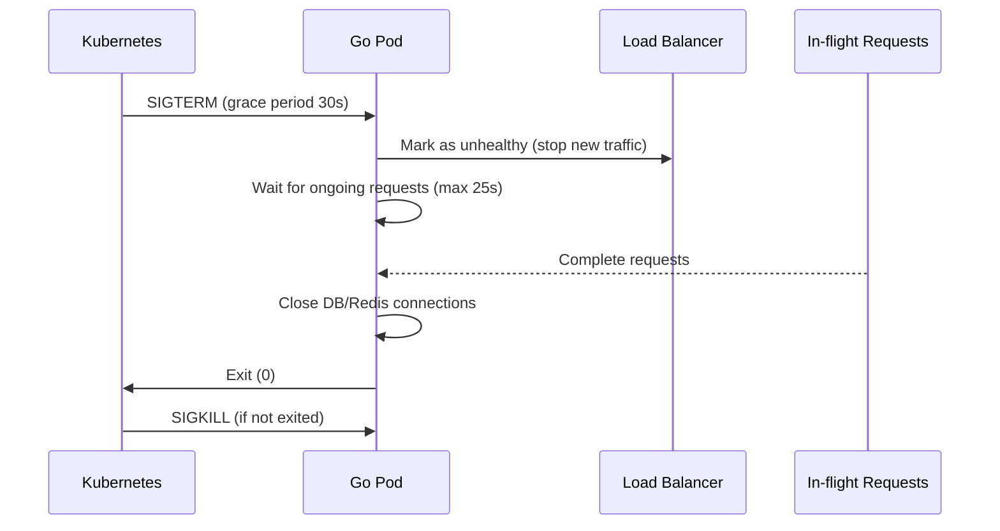

# เล่ม 4: การปรับใช้ การบำรุงรักษา และการขยายระบบ (Deployment, Maintenance & Scaling)

### สรุปสั้นก่อนเริ่ม
การพัฒนา API ให้ทำงานได้ในเครื่องพัฒนาเป็นแค่ก้าวแรก การนำระบบขึ้นสู่ Production จำเป็นต้องมี **Docker Containerization**, **Orchestration (Docker Compose / Kubernetes)**, **การจัดการ Environment Secrets**, **การตรวจสอบสุขภาพ (Health Checks)**, **การทำ Graceful Shutdown**, **การ Backup/Restore ฐานข้อมูล**, **การ Monitoring ด้วย Prometheus & Grafana**, และ **แนวทางการขยายระบบ (Horizontal Scaling)** บทนี้จะนำเสนอแนวปฏิบัติที่สมบูรณ์ พร้อมตัวอย่างไฟล์ docker-compose, Dockerfile, Makefile, และเทมเพลตสำหรับ Checklist และ Timeline Project

---

## คำอธิบายแนวคิด (Concept Explanation)

### 1. การ Containerize ด้วย Docker

**Docker** ช่วยบรรจุแอปพลิเคชัน Go พร้อม dependencies ทั้งหมดให้อยู่ใน image ที่สามารถรันได้เหมือนกันทุก environment (development, staging, production)

#### ทำไมต้องใช้ Docker?
- **Consistency** – รันบนเครื่อง local, server, cloud เหมือนกัน
- **Isolation** – ไม่กระทบกับโปรแกรมอื่นบน host
- **Scalability** – ง่ายต่อการเพิ่มจำนวน replicas
- **Reproducibility** – ใช้ version control บน Dockerfile

#### Multi-stage Build ใน Go
เพื่อให้ image สุดท้ายเล็กและปลอดภัย (ไม่มี compiler, source code) เราใช้ multi-stage:
- Stage 1: `builder` – ใช้ Go image ขนาดใหญ่ compile binary
- Stage 2: `runner` – ใช้ Alpine หรือ Distroless ขนาดเล็ก รัน binary เท่านั้น

#### ประโยชน์ที่ได้รับ
- ลดขนาด image (จาก ~1GB เหลือ ~20MB)
- เพิ่มความปลอดภัย (ไม่มี shell, ไม่มี build tools)

#### ข้อควรระวัง
- ต้องจัดการ timezone และ certificates ใน Alpine
- ต้องตั้ง `CGO_ENABLED=0` สำหรับ static binary

---

### 2. Docker Compose สำหรับ Development และ Production

**Docker Compose** ใช้สำหรับรัน multi-container (Go API, PostgreSQL, Redis, MQTT Broker) บนเครื่องเดียว เหมาะสำหรับ dev และ production ขนาดเล็ก

**ไฟล์หลัก:**
- `docker-compose.dev.yml` – ใช้ hot-reload, mount local code, debug
- `docker-compose.prod.yml` – ใช้ built images, network isolation, restart policy

#### ข้อดี
- กำหนด dependency และ network ได้ง่าย
- รันทั้งระบบด้วย `docker-compose up -d`

#### ข้อเสีย
- ไม่เหมาะกับการ scaling ข้ามหลายเครื่อง (ใช้ Kubernetes แทน)

---

### 3. Environment Variables และ Secrets Management

**หลักการ 12-factor app:** เก็บ config ใน environment variables

**แนวปฏิบัติ:**
- ใช้ `.env` เฉพาะ local development (ไม่ commit)
- ใน production ใช้ secrets manager (Docker secrets, Kubernetes secrets, HashiCorp Vault)
- ใช้ `viper` โหลดจาก env, file, และ flag

**ตัวอย่าง secrets ที่ต้อง保护好:**
- DB password, JWT private key, SMTP password, API keys

---

### 4. Health Checks และ Graceful Shutdown

**Health check endpoints** ให้ orchestrator (Docker, K8s) ทราบว่า service ยังทำงานปกติ:
- `/health/live` – ตรวจสอบว่า process ยังรันอยู่ (ไม่ deadlock)
- `/health/ready` – ตรวจสอบว่า service พร้อมรับ traffic (DB, Redis connected)

**Graceful Shutdown:** เมื่อได้รับ SIGTERM ให้หยุดรับ request ใหม่, รอให้ request ที่กำลังทำอยู่เสร็จ (timeout 30 วินาที) แล้วค่อยปิด connection

---

### 5. Monitoring: Prometheus + Grafana

**Prometheus** – เก็บ metrics (time-series database)  
**Grafana** – แสดง dashboard จาก Prometheus

**Metric types ที่สำคัญ:**
- Counter – จำนวน request, error
- Gauge – ค่าปัจจุบัน (goroutines, memory usage)
- Histogram – latency distribution

**ใน Go ใช้ `prometheus/client_golang`** ทำ middleware ที่นับ request duration, status code, path

---

### 6. การ Backup และ Restore ฐานข้อมูล

**PostgreSQL:** ใช้ `pg_dump` หรือ `pg_basebackup` ทำ full backup ทุกวัน, WAL archiving สำหรับ point-in-time recovery  
**Redis:** ใช้ `SAVE` หรือ `BGSAVE` สร้าง dump.rdb หรือใช้ AOF

**แนวทาง:**
- Backup ไปยัง object storage (S3, MinIO)
- กำหนด retention policy (30 วัน)
- ทดสอบ restore เป็นประจำ

---

### 7. Horizontal Scaling (การขยายแนวนอน)

เมื่อ traffic เพิ่มขึ้น แทนที่จะเพิ่มทรัพยากรเครื่องเดียว (vertical scaling) ให้เพิ่มจำนวน instance (replicas) หลายเครื่องทำงานร่วมกัน โดยมี load balancer อยู่ข้างหน้า

**ข้อกำหนดสำหรับการ scaling แนวนอน:**
- **Stateless** – เก็บ session, cache, refresh token ใน Redis (shared)
- **Database connection pool** – แต่ละ instance มี pool ของตัวเอง แต่ใช้ DB เดียวกัน
- **Distributed lock** สำหรับ scheduler (ใช้ Redis)
- **Message queue** สำหรับ async tasks (Redis Stream, RabbitMQ)

**เครื่องมือ:**
- Load balancer: Nginx, HAProxy, AWS ALB
- Orchestration: Kubernetes, Docker Swarm

---

## การออกแบบ Workflow และ Dataflow

### Workflow: Deployment Pipeline (CI/CD)

```mermaid
flowchart LR
    Dev[Developer push code] --> CI[CI: GitHub Actions / GitLab CI]
    CI --> Test[Run unit tests & lint]
    Test --> Build[Build Docker image]
    Build --> Push[Push to registry (Docker Hub / ECR)]
    Push --> CD[CD: Deploy to staging]
    CD --> SmokeTest[Smoke test]
    SmokeTest --> Approve{Manual approve?}
    Approve -->|Yes| DeployProd[Deploy to production]
    Approve -->|No| Rollback
```

**รูปที่ 14:** ขั้นตอน CI/CD สำหรับ Go backend application

### Workflow: Graceful Shutdown



**รูปที่ 15:** ลำดับการปิดระบบแบบ graceful ที่ Kubernetes ใช้

---

## ตัวอย่างโค้ดที่รันได้จริง (Runnable Code Example)

### 1. Dockerfile (Multi-stage)

**Dockerfile.prod**
```dockerfile
# Stage 1: Build
FROM golang:1.21-alpine AS builder

WORKDIR /app
COPY go.mod go.sum ./
RUN go mod download

COPY . .
# Build static binary
RUN CGO_ENABLED=0 GOOS=linux go build -a -installsuffix cgo -o main ./cmd/api

# Stage 2: Runtime
FROM alpine:3.18

RUN apk --no-cache add ca-certificates tzdata
WORKDIR /root/

# Copy binary from builder
COPY --from=builder /app/main .
# Copy config file
COPY --from=builder /app/config/config-prod.yml ./config/

EXPOSE 8080

# Health check
HEALTHCHECK --interval=30s --timeout=3s --start-period=5s --retries=3 \
  CMD ["wget", "--no-verbose", "--tries=1", "--spider", "http://localhost:8080/health/live"] || exit 1

CMD ["./main", "serve"]
```

**Dockerfile.dev** (สำหรับ development พร้อม Air hot-reload)
```dockerfile
FROM golang:1.21-alpine

WORKDIR /app
RUN go install github.com/cosmtrek/air@latest
COPY go.mod go.sum ./
RUN go mod download

COPY . .
CMD ["air", "-c", ".air.toml"]
```

### 2. Docker Compose Development

**docker-compose.dev.yml**
```yaml
version: '3.8'

services:
  postgres:
    image: postgres:15-alpine
    environment:
      POSTGRES_USER: ${DB_USER}
      POSTGRES_PASSWORD: ${DB_PASSWORD}
      POSTGRES_DB: ${DB_NAME}
    ports:
      - "5432:5432"
    volumes:
      - postgres_data:/var/lib/postgresql/data
    healthcheck:
      test: ["CMD-SHELL", "pg_isready -U ${DB_USER}"]
      interval: 10s
      timeout: 5s
      retries: 5

  redis:
    image: redis:7-alpine
    ports:
      - "6379:6379"
    volumes:
      - redis_data:/data
    command: redis-server --appendonly yes

  mqtt:
    image: eclipse-mosquitto:2.0
    ports:
      - "1883:1883"
      - "9001:9001"
    volumes:
      - ./mosquitto/config:/mosquitto/config
      - mosquitto_data:/mosquitto/data

  api:
    build:
      context: .
      dockerfile: Dockerfile.dev
    ports:
      - "8080:8080"
    environment:
      DB_HOST: postgres
      DB_PORT: 5432
      DB_USER: ${DB_USER}
      DB_PASSWORD: ${DB_PASSWORD}
      DB_NAME: ${DB_NAME}
      REDIS_ADDR: redis:6379
      MQTT_BROKER: tcp://mqtt:1883
    volumes:
      - .:/app
    depends_on:
      postgres:
        condition: service_healthy
      redis:
        condition: service_started
      mqtt:
        condition: service_started

volumes:
  postgres_data:
  redis_data:
  mosquitto_data:
```

### 3. Docker Compose Production

**docker-compose.prod.yml**
```yaml
version: '3.8'

services:
  api:
    image: ${REGISTRY}/cmom-api:${TAG:-latest}
    restart: always
    environment:
      DB_HOST: postgres
      REDIS_ADDR: redis:6379
    deploy:
      replicas: 3
      resources:
        limits:
          cpus: '0.5'
          memory: 512M
    networks:
      - backend
    healthcheck:
      test: ["CMD", "wget", "--spider", "http://localhost:8080/health/ready"]
      interval: 30s
      timeout: 5s
      retries: 3

  nginx:
    image: nginx:alpine
    ports:
      - "80:80"
    volumes:
      - ./nginx.conf:/etc/nginx/nginx.conf
    depends_on:
      - api
    networks:
      - backend

  postgres:
    image: postgres:15-alpine
    environment:
      POSTGRES_PASSWORD_FILE: /run/secrets/db_password
    secrets:
      - db_password
    volumes:
      - pg_data:/var/lib/postgresql/data
    networks:
      - backend

secrets:
  db_password:
    external: true

networks:
  backend:
    driver: bridge
```

### 4. Graceful Shutdown Implementation ใน Go

**internal/delivery/rest/server.go**
```go
package rest

import (
    "context"
    "log"
    "net/http"
    "os"
    "os/signal"
    "syscall"
    "time"
)

type Server struct {
    httpServer *http.Server
}

func NewServer(handler http.Handler, port string) *Server {
    return &Server{
        httpServer: &http.Server{
            Addr:         ":" + port,
            Handler:      handler,
            ReadTimeout:  15 * time.Second,
            WriteTimeout: 15 * time.Second,
            IdleTimeout:  60 * time.Second,
        },
    }
}

// StartWithGracefulShutdown runs server and handles SIGTERM gracefully
func (s *Server) StartWithGracefulShutdown() {
    // Channel to listen for interrupt signals
    stop := make(chan os.Signal, 1)
    signal.Notify(stop, syscall.SIGINT, syscall.SIGTERM)

    // Start server in goroutine
    go func() {
        log.Printf("Server starting on %s", s.httpServer.Addr)
        if err := s.httpServer.ListenAndServe(); err != nil && err != http.ErrServerClosed {
            log.Fatalf("Server error: %v", err)
        }
    }()

    // Wait for signal
    <-stop
    log.Println("Shutting down gracefully...")

    // Create timeout context for shutdown (30 seconds max)
    ctx, cancel := context.WithTimeout(context.Background(), 30*time.Second)
    defer cancel()

    // Attempt graceful shutdown
    if err := s.httpServer.Shutdown(ctx); err != nil {
        log.Printf("Forced shutdown: %v", err)
    }

    log.Println("Server stopped")
}
```

### 5. Health Check Endpoints

**internal/delivery/rest/handler/health_handler.go**
```go
package handler

import (
    "encoding/json"
    "net/http"
    "gorm.io/gorm"
    "github.com/redis/go-redis/v9"
    "context"
)

type HealthHandler struct {
    db  *gorm.DB
    rdb *redis.Client
}

func NewHealthHandler(db *gorm.DB, rdb *redis.Client) *HealthHandler {
    return &HealthHandler{db: db, rdb: rdb}
}

// LivenessProbe returns 200 if process is alive
func (h *HealthHandler) LivenessProbe(w http.ResponseWriter, r *http.Request) {
    w.WriteHeader(http.StatusOK)
    w.Write([]byte("OK"))
}

// ReadinessProbe checks if dependencies (DB, Redis) are ready
func (h *HealthHandler) ReadinessProbe(w http.ResponseWriter, r *http.Request) {
    ctx := context.Background()
    status := map[string]string{}

    // Check PostgreSQL
    sqlDB, err := h.db.DB()
    if err != nil || sqlDB.PingContext(ctx) != nil {
        status["postgres"] = "unavailable"
    } else {
        status["postgres"] = "ready"
    }

    // Check Redis
    if err := h.rdb.Ping(ctx).Err(); err != nil {
        status["redis"] = "unavailable"
    } else {
        status["redis"] = "ready"
    }

    // Overall status
    allReady := true
    for _, s := range status {
        if s == "unavailable" {
            allReady = false
            break
        }
    }

    w.Header().Set("Content-Type", "application/json")
    if !allReady {
        w.WriteHeader(http.StatusServiceUnavailable)
    }
    json.NewEncoder(w).Encode(status)
}
```

### 6. Prometheus Metrics Middleware

**internal/delivery/rest/middleware/metrics.go**
```go
package middleware

import (
    "net/http"
    "strconv"
    "time"
    "github.com/prometheus/client_golang/prometheus"
    "github.com/prometheus/client_golang/prometheus/promauto"
)

var (
    httpRequestsTotal = promauto.NewCounterVec(
        prometheus.CounterOpts{
            Name: "http_requests_total",
            Help: "Total number of HTTP requests",
        },
        []string{"method", "path", "status"},
    )
    httpRequestDuration = promauto.NewHistogramVec(
        prometheus.HistogramOpts{
            Name:    "http_request_duration_seconds",
            Help:    "Duration of HTTP requests",
            Buckets: prometheus.DefBuckets,
        },
        []string{"method", "path"},
    )
)

func Metrics(next http.Handler) http.Handler {
    return http.HandlerFunc(func(w http.ResponseWriter, r *http.Request) {
        start := time.Now()
        wrapped := &statusWriter{ResponseWriter: w, statusCode: http.StatusOK}
        next.ServeHTTP(wrapped, r)
        duration := time.Since(start).Seconds()
        httpRequestsTotal.WithLabelValues(r.Method, r.URL.Path, strconv.Itoa(wrapped.statusCode)).Inc()
        httpRequestDuration.WithLabelValues(r.Method, r.URL.Path).Observe(duration)
    })
}

type statusWriter struct {
    http.ResponseWriter
    statusCode int
}

func (w *statusWriter) WriteHeader(code int) {
    w.statusCode = code
    w.ResponseWriter.WriteHeader(code)
}
```

### 7. Makefile สำหรับ automation

**Makefile**
```makefile
.PHONY: build test run migrate-up migrate-down docker-build docker-up

# Variables
APP_NAME=cmom-api
VERSION=$(shell git describe --tags --always)

build:
	go build -o bin/$(APP_NAME) ./cmd/api

test:
	go test -v -race -cover ./...

run:
	go run ./cmd/api serve

migrate-up:
	go run ./cmd/api migrate up

migrate-down:
	go run ./cmd/api migrate down

docker-build:
	docker build -f Dockerfile.prod -t $(APP_NAME):$(VERSION) .

docker-up-dev:
	docker-compose -f docker-compose.dev.yml up --build

docker-up-prod:
	docker-compose -f docker-compose.prod.yml up -d

lint:
	golangci-lint run

generate-mock:
	mockgen -source=internal/repository/user_repo.go -destination=internal/mocks/user_repo_mock.go

.PHONY: help
help:
	@echo "Available targets: build, test, run, migrate-up, migrate-down, docker-build, docker-up-dev, docker-up-prod"
```

---

## เทมเพลตสำหรับ Task List, Checklist และ Timeline Project

### Task List Template (งานที่ต้องทำก่อน Deploy Production)

| Task ID | รายการ | สถานะ | หมายเหตุ |
|---------|--------|-------|----------|
| PRE-01 | ตั้งค่า environment variables บน production server | ⬜ | ใช้ secrets manager |
| PRE-02 | สร้างฐานข้อมูล PostgreSQL และ Redis cluster | ⬜ | แยก instance |
| PRE-03 | สร้าง private/public keys สำหรับ JWT (RS256) | ⬜ | เก็บใน secure location |
| PRE-04 | ติดตั้ง Docker และ Docker Compose บน production | ⬜ | version 20.10+ |
| PRE-05 | ตั้งค่า reverse proxy (Nginx) พร้อม SSL (Let's Encrypt) | ⬜ | ใช้ certbot |
| PRE-06 | ตั้งค่า monitoring stack (Prometheus + Grafana) | ⬜ | สร้าง dashboard |
| PRE-07 | ตั้งค่า log aggregation (Loki หรือ ELK) | ⬜ | เก็บ logs 90 วัน |
| PRE-08 | กำหนด backup schedule (DB ทุกวัน, เก็บ 30 วัน) | ⬜ | ใช้ cron + pg_dump |
| PRE-09 | ทดสอบ graceful shutdown และ health checks | ⬜ | simulate SIGTERM |
| PRE-10 | Load testing (k6 หรือ wrk) เป้าหมาย 1000 req/s | ⬜ | บันทึก baseline |
| PRE-11 | จัดทำ runbook สำหรับการ deploy และ rollback | ⬜ | ขั้นตอนชัดเจน |
| PRE-12 | ตั้งค่า CI/CD (GitHub Actions) auto deploy เมื่อ push main | ⬜ | ต้องมี staging |

### Deployment Checklist (ก่อน Go-Live)

```markdown
## Pre-Deployment Checklist
- [ ] โค้ดผ่าน unit tests และ integration tests ทั้งหมด
- [ ] ไม่มี secret hardcoded ใน code (ใช้ env)
- [ ] การ migrate database ได้ทดสอบบน staging แล้ว
- [ ] มีการตั้งค่า `max_connections` ของ PostgreSQL เพียงพอ (100+)
- [ ] Redis memory limit และ eviction policy ตั้งค่าแล้ว
- [ ] JWT access token expiry ≤ 15 นาที
- [ ] Rate limit กำหนดค่าเหมาะสม (เช่น 100 req/sec/IP)
- [ ] มี logging level = info (ไม่ debug) ใน production
- [ ] HTTP timeouts ตั้งค่า (read, write, idle)
- [ ] มี health endpoints (/live, /ready) และ Kubernetes probes
- [ ] มี monitoring alert เมื่อ error rate > 1%
- [ ] Backup script ทดลอง restore แล้ว
- [ ] มี disaster recovery plan (RTO < 4 hours)
- [ ] Firewall rule: เปิดเฉพาะ port 80, 443, และ internal ports
- [ ] ติดตั้ง fail2ban ป้องกัน brute force
```

### Timeline Project Template (ตัวอย่าง 8 สัปดาห์)

| Week | กิจกรรม | Deliverable | ผู้รับผิดชอบ |
|------|---------|-------------|--------------|
| 1 | วิเคราะห์ requirement, ออกแบบสถาปัตยกรรม, เลือกเทคโนโลยี | Architectural Design Document | Solution Architect |
| 2 | ตั้งค่า development environment, โครงสร้างโปรเจกต์, base config | Go project scaffold, docker-compose dev | Backend Dev |
| 3 | พัฒนา Authentication (JWT, refresh token), User management | Login/Register API, middleware | Backend Dev |
| 4 | พัฒนา MQTT subscriber, Rule engine, Alert notifier | MQTT worker, Email/Line notification | Backend Dev |
| 5 | พัฒนา Web Dashboard (WebSocket, Chart.js) | Real-time dashboard, device control | Frontend Dev |
| 6 | พัฒนา Scheduler, Report generator (PDF), API สำหรับ schedules | Automation, daily report email | Backend Dev |
| 7 | Integration testing, Load testing, Security audit | Test report, performance baseline | QA Engineer |
| 8 | Deploy to staging, UAT, สร้าง documentation, Deploy production | Production system, Runbook | DevOps + Team |

---

## กรณีศึกษาและแนวทางแก้ไขปัญหา

### ปัญหา: หลังจาก deploy แล้วพบว่า connection pool หมด (too many connections)
**สาเหตุ:** แต่ละ instance ของ Go สร้าง connection pool ไปยัง PostgreSQL (default max_open_conns = unlimited) เมื่อมีหลาย replicas อาจ overwhelm DB  
**แนวทางแก้ไข:** ตั้ง `db.SetMaxOpenConns(50)` และ `db.SetMaxIdleConns(25)` และใช้ PgBouncer เป็น connection pooler ระหว่าง app กับ DB

### ปัญหา: การ zero-downtime deployment ล้มเหลว (requests ระหว่าง deploy ตก)
**สาเหตุ:** Kubernetes ส่ง SIGTERM แต่ Go app ไม่ graceful shutdown หรือ readiness probe ยังคงเป็น ready ขณะกำลังปิด  
**แนวทางแก้ไข:** Implement `/health/ready` ที่ return 503 ก่อน shutdown, และเพิ่ม `terminationGracePeriodSeconds: 60` ใน K8s spec

### ปัญหา: ระบบช้าเมื่อมี replicas หลายตัว (cache thrashing)
**สาเหตุ:** Local memory cache ต่าง instance กัน ทำให้ cache miss บ่อย  
**แนวทางแก้ไข:** ใช้ distributed cache (Redis) แทน local cache (หรือใช้两者 blend: local cache + Redis สำหรับ invalidation)

---

## ตารางสรุป: Production vs Development Environment

| รายการ | Development | Production |
|--------|-------------|-------------|
| **Logging** | human-readable, debug level | JSON, info level, ไปยัง Loki/CloudWatch |
| **Database** | containerized (docker) | managed service (RDS) หรือ cluster |
| **Secrets** | .env file | secrets manager (AWS Secrets, Vault) |
| **Hot-reload** | ใช้ Air | ไม่มี (build image ใหม่) |
| **Rate limit** | ปิด หรือ สูงมาก | เปิดตาม capacity |
| **Debug symbols** | มี | ไม่มี (strip binary) |
| **CORS** | อนุญาต * | จำกัดเฉพาะ domain ที่อนุญาต |
| **Graceful shutdown** | ไม่จำเป็น | mandatory |
| **Monitoring** | - | Prometheus + Grafana |

---

## แบบฝึกหัดท้ายบท (3 ข้อ)

1. **สร้าง Docker image ที่มีขนาดต่ำกว่า 20MB** สำหรับ Go binary ที่ใช้ static linking (CGO_ENABLED=0) และใช้ scratch image (ไม่ต้องมี alpine) ทดสอบรัน container แล้วเรียก health check endpoint

2. **Implement graceful shutdown ใน MQTT worker** ให้ disconnect จาก MQTT broker และรอให้ message ที่กำลังประมวลผลเสร็จ ก่อนปิดโปรแกรม

3. **สร้าง Prometheus alerting rule** (ใน Prometheus config) ที่จะแจ้งเตือนเมื่อ error rate 5xx เกิน 5% ในช่วง 5 นาที และส่งไปยัง Alertmanager + Line notify

---

## แหล่งอ้างอิง (References)

- Docker multi-stage builds: [https://docs.docker.com/build/building/multi-stage/](https://docs.docker.com/build/building/multi-stage/)
- Twelve-factor app: [https://12factor.net/](https://12factor.net/)
- Prometheus Go client: [https://github.com/prometheus/client_golang](https://github.com/prometheus/client_golang)
- Graceful shutdown in Go: [https://christophberger.com/graceful-shutdown-of-go-net-http-servers/](https://christophberger.com/graceful-shutdown-of-go-net-http-servers/)
- Kubernetes best practices for Go: [https://kubernetes.io/blog/2021/01/28/kubernetes-best-practices-for-go-developers/](https://kubernetes.io/blog/2021/01/28/kubernetes-best-practices-for-go-developers/)

---

**หมายเหตุ:** บทนี้ถือเป็นบทสุดท้ายของเอกสารทั้ง 4 เล่ม ครอบคลุมตั้งแต่การออกแบบสถาปัตยกรรม (เล่ม 2), การพัฒนาเชิงปฏิบัติ (เล่ม 3), ไปจนถึงการปรับใช้และการบำรุงรักษา (เล่ม 4) ตามความต้องการของโครงการ CMON IoT Solution ครบถ้วนสมบูรณ์
