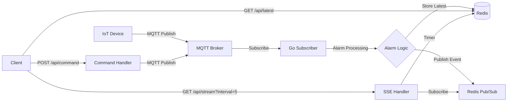

# Module 25: pkg/redis_realtime_mqtt (พร้อมระบบสั่งงานอุปกรณ์และตรวจสอบการแจ้งเตือน)

## สำหรับโฟลเดอร์ `pkg/redis_realtime_mqtt/`

ไฟล์ที่เกี่ยวข้อง:
- `client.go` – การสร้างและจัดการ Redis client และ MQTT client
- `subscriber.go` – การ subscribe MQTT topics, ตรวจจับการแจ้งเตือน, และ publish ไปยัง Redis
- `alarm.go` – ตรรกะการประมวลผลการแจ้งเตือน (แปลงจาก TypeScript)
- `api.go` – REST API handlers: ดึงข้อมูลล่าสุด, stream แบบ interval, สั่งงานอุปกรณ์, ตรวจสอบการแจ้งเตือน
- `command.go` – การส่งคำสั่งไปยังอุปกรณ์ผ่าน MQTT
- `config.go` – การตั้งค่าการเชื่อมต่อ Redis, MQTT, และ interval polling
- `examples/main.go` – ตัวอย่างการใช้งานครบวงจร

---

## หลักการ (Concept)

โมดูลนี้ใช้ Redis เป็นตัวกลางสำหรับรับข้อมูลจาก MQTT (IoT, sensors) และให้ REST API สำหรับ:
- ดึงค่าล่าสุดของเซ็นเซอร์ (polling ตาม interval ที่กำหนด)
- **สั่งงานอุปกรณ์** (ส่งคำสั่ง ON/OFF หรือ custom payload ผ่าน MQTT)
- **ตรวสอบการแจ้งเตือน** (alarm) ตามเกณฑ์ที่ตั้งไว้ (min, max, warning, critical, recovery)
- แสดงผลแบบ real-time ผ่าน Server-Sent Events (SSE)

**ข้อห้ามสำคัญ:** ห้ามใช้ Redis เป็น long-term storage สำหรับประวัติศาสตร์ข้อมูล (ควรใช้ PostgreSQL หรือ TimescaleDB ร่วมด้วย)

### มีกี่แบบ? (Architecture Patterns)

| แบบ | คำอธิบาย | เหมาะกับ |
|-----|----------|----------|
| **MQTT → Alarm → Redis** | Subscriber MQTT, ประมวลผล alarm, เก็บ latest value + alarm state | ระบบที่ต้องการตรวจสอบการแจ้งเตือนทันที |
| **REST + SSE** | Client ดึงข้อมูลแบบ interval หรือ real-time ผ่าน SSE | Dashboard, mobile app |
| **Command via MQTT** | ส่งคำสั่งกลับไปยังอุปกรณ์ผ่าน MQTT topic | ควบคุมอุปกรณ์ (เปิด/ปิด, ปรับตั้งค่า) |

---

## การออกแบบ Workflow และ Dataflow



**ขั้นตอนการทำงาน:**
1. Subscriber รับ MQTT message → แปลง payload → เรียก `ProcessAlarm()`
2. `ProcessAlarm()` เปรียบเทียบค่ากับเกณฑ์ (max, min, warning, alert, recovery) → คำนวณ `status`, `title`, `content`
3. เก็บค่าและสถานะล่าสุดใน Redis (`sensor:latest:{device_id}`)
4. Publish ผ่าน Redis Pub/Sub channel `alarm:updates` เพื่อให้ SSE ส่ง real-time
5. REST API: ดึงค่า, stream, หรือรับคำสั่งควบคุมอุปกรณ์

---

## ตัวอย่างโค้ดที่รันได้จริง

### โครงสร้างโปรเจกต์
```
pkg/redis_realtime_mqtt/
├── client.go
├── alarm.go          # ตรรกะการแจ้งเตือน (แปลงจาก TypeScript)
├── subscriber.go
├── api.go
├── command.go
├── config.go
└── examples/main.go
```

### 1. การติดตั้ง Dependencies

```bash
go get github.com/redis/go-redis/v9
go get github.com/eclipse/paho.mqtt.golang
go get github.com/gorilla/mux
go get github.com/google/uuid
```

### 2. การติดตั้ง Redis และ MQTT Broker (Docker)

```yaml
# docker-compose.yml
version: '3.8'
services:
  redis:
    image: redis:7-alpine
    ports:
      - "6379:6379"
  mosquitto:
    image: eclipse-mosquitto:latest
    ports:
      - "1883:1883"
```

### 3. ตัวอย่างโค้ด: Configuration

```go
// config.go
package redis_realtime_mqtt

import "time"

type Config struct {
    RedisAddr     string
    RedisPassword string
    RedisDB       int

    MQTTServer    string
    MQTTClientID  string
    MQTTUsername  string
    MQTTPassword  string
    MQTTTopics    []string   // topics to subscribe

    HTTPPort      string
    DefaultInterval time.Duration  // polling interval (seconds)
}

func DefaultConfig() Config {
    return Config{
        RedisAddr:       "localhost:6379",
        RedisPassword:   "",
        RedisDB:         0,
        MQTTServer:      "tcp://localhost:1883",
        MQTTClientID:    "redis_mqtt_gateway",
        MQTTTopics:      []string{"sensor/+/data"},
        HTTPPort:        ":8080",
        DefaultInterval: 5 * time.Second,
    }
}
```

### 4. ตัวอย่างโค้ด: Alarm Processing (แปลงจาก TypeScript)

```go
// alarm.go
package redis_realtime_mqtt

import (
    "fmt"
    "strconv"
    "strings"
    "time"
)

// SensorData คือข้อมูลที่ได้รับจาก MQTT
type SensorData struct {
    HardwareID        int     `json:"hardware_id"`         // 1=Sensor,2=IO Sensor,3=IO Control,4=Critical
    DeviceID          string  `json:"device_id"`
    ValueData         float64 `json:"value_data"`
    ValueAlarm        int     `json:"value_alarm"`         // สำหรับ IO
    Max               *float64 `json:"max,omitempty"`
    Min               *float64 `json:"min,omitempty"`
    StatusAlert       float64 `json:"status_alert"`
    StatusWarning     float64 `json:"status_warning"`
    RecoveryWarning   float64 `json:"recovery_warning"`
    RecoveryAlert     float64 `json:"recovery_alert"`
    Unit              string  `json:"unit"`
    MQTTName          string  `json:"mqtt_name"`
    DeviceName        string  `json:"device_name"`
    ActionName        string  `json:"action_name"`
    MQTTControlOn     string  `json:"mqtt_control_on"`
    MQTTControlOff    string  `json:"mqtt_control_off"`
    CountAlarm        int     `json:"count_alarm"`
    Event             int     `json:"event"`               // 1=เปิด,0=ปิด
}

type AlarmResult struct {
    CaseStatus        int     `json:"case_status"`
    Status            int     `json:"status"`              // 1=Warning,2=Critical,3=Recovery Warning,4=Recovery Critical,5=Normal
    Title             string  `json:"title"`
    Subject           string  `json:"subject"`
    Content           string  `json:"content"`
    ValueData         float64 `json:"value_data"`
    DataAlarm         float64 `json:"data_alarm"`
    EventControl      int     `json:"event_control"`
    MessageMqttControl string `json:"message_mqtt_control"`
    Timestamp         string  `json:"timestamp"`
}

// ProcessAlarm จำลองการทำงานของ AlarmDetailValidate ใน TypeScript
func ProcessAlarm(data SensorData, lang string) AlarmResult {
    // ค่าเริ่มต้น
    result := AlarmResult{
        Timestamp: time.Now().Format("2006-01-02 15:04:05"),
    }

    // ฟังก์ชันช่วยแปลข้อความ (เลือกภาษา)
    getMsg := func(key string) string {
        if lang == "th" {
            return thMessages[key]
        }
        return enMessages[key]
    }

    // แปลงค่า sensor ตาม hardware_id
    sensorValue := data.ValueData
    if data.HardwareID == 2 || data.HardwareID == 3 {
        // IO Sensor/Control: ใช้ value_alarm (0/1) แทน
        sensorValue = float64(data.ValueAlarm)
    }

    // กรณี hardware_id = 3 (IO Control) – ปกติ
    if data.HardwareID == 3 && (sensorValue == 0 || sensorValue == 1) {
        result.CaseStatus = 1
        result.Status = 5
        result.Title = getMsg("normal")
        result.Subject = getMsg("normal")
        result.Content = fmt.Sprintf("%s case_status:1", getMsg("normal"))
        result.DataAlarm = 0
        result.EventControl = data.Event
        result.MessageMqttControl = ""
        return result
    }

    // hardware_id = 4 (Critical Sensor)
    if data.HardwareID == 4 {
        if sensorValue != 1 {
            result.CaseStatus = 2
            result.Status = 2
            result.Title = getMsg("critical")
            result.Subject = fmt.Sprintf("%s %s: %s %.2f %s", data.MQTTName, getMsg("critical"), data.DeviceName, sensorValue, data.Unit)
            result.Content = fmt.Sprintf("%s %s %s: %s %.2f case_status:2", data.MQTTName, data.ActionName, getMsg("critical"), data.DeviceName, sensorValue)
            result.DataAlarm = data.StatusWarning
            return result
        } else {
            result.CaseStatus = 3
            result.Status = 5
            result.Title = getMsg("normal2")
            result.Subject = getMsg("normal2")
            result.Content = fmt.Sprintf("%s case_status:3", getMsg("normal"))
            result.DataAlarm = 0
            return result
        }
    }

    // ตรวจสอบ max/min (เฉพาะ hardware_id 1,2)
    if data.HardwareID == 1 || data.HardwareID == 2 {
        if data.Max != nil && sensorValue >= *data.Max {
            result.CaseStatus = 4
            result.Status = 2
            result.Title = getMsg("criticalMax")
            result.Subject = fmt.Sprintf("%s %s: %s %.2f %s", data.MQTTName, getMsg("criticalMax"), data.DeviceName, sensorValue, data.Unit)
            result.Content = fmt.Sprintf("%s %s %s: %s %.2f case_status:4", data.MQTTName, data.ActionName, getMsg("criticalMax"), data.DeviceName, sensorValue)
            result.DataAlarm = data.StatusWarning
            return result
        }
        if data.Min != nil && sensorValue <= *data.Min {
            result.CaseStatus = 5
            result.Status = 1
            result.Title = getMsg("criticalMin")
            result.Subject = fmt.Sprintf("%s %s: %s %.2f %s", data.MQTTName, getMsg("criticalMin"), data.DeviceName, sensorValue, data.Unit)
            result.Content = fmt.Sprintf("%s %s %s: %s %.2f case_status:5", data.MQTTName, data.ActionName, getMsg("criticalMin"), data.DeviceName, sensorValue)
            result.DataAlarm = data.StatusWarning
            return result
        }
    }

    // Warning zone (เฉพาะ hardware_id=1)
    if data.HardwareID == 1 && data.StatusWarning > 0 && sensorValue >= data.StatusWarning && sensorValue < data.StatusAlert {
        result.CaseStatus = 6
        result.Status = 1
        result.Title = getMsg("warning")
        result.Subject = fmt.Sprintf("%s %s: %s %.2f %s", data.MQTTName, getMsg("warning"), data.DeviceName, sensorValue, data.Unit)
        result.Content = fmt.Sprintf("%s %s %s: %s %.2f case_status:6", data.MQTTName, data.ActionName, getMsg("warning"), data.DeviceName, sensorValue)
        result.DataAlarm = data.StatusWarning
        return result
    }

    // Alert zone (เฉพาะ hardware_id=1)
    if data.HardwareID == 1 && data.StatusAlert > 0 && sensorValue >= data.StatusAlert {
        result.CaseStatus = 7
        result.Status = 2
        result.Title = getMsg("critical")
        result.Subject = fmt.Sprintf("%s %s: %s %.2f %s", data.MQTTName, getMsg("critical"), data.DeviceName, sensorValue, data.Unit)
        result.Content = fmt.Sprintf("%s %s %s: %s %.2f case_status:7", data.MQTTName, data.ActionName, getMsg("critical"), data.DeviceName, sensorValue)
        result.DataAlarm = data.StatusAlert
        return result
    }

    // value_alarm == 0 สำหรับ hardware_id 2,3,4
    if data.ValueAlarm == 0 && (data.HardwareID == 2 || data.HardwareID == 3 || data.HardwareID == 4) {
        isCritical := data.HardwareID == 4
        if isCritical {
            result.CaseStatus = 9
            result.Status = 2
            result.Title = getMsg("critical")
        } else {
            result.CaseStatus = 8
            result.Status = 1
            result.Title = getMsg("warning")
        }
        result.Subject = fmt.Sprintf("%s %s: %s %.2f %s", data.MQTTName, result.Title, data.DeviceName, sensorValue, data.Unit)
        result.Content = fmt.Sprintf("%s %s %s: %s %.2f case_status:%d", data.MQTTName, data.ActionName, result.Title, data.DeviceName, sensorValue, result.CaseStatus)
        result.DataAlarm = data.StatusWarning
        return result
    }

    // Recovery Warning
    if data.CountAlarm >= 1 && data.RecoveryWarning > 0 && sensorValue <= data.RecoveryWarning && (data.HardwareID == 1 || data.HardwareID == 2) {
        result.CaseStatus = 10
        result.Status = 3
        result.Title = getMsg("recoveryWarning")
        result.Subject = fmt.Sprintf("%s %s: %s %.2f %s", data.MQTTName, getMsg("recoveryWarning"), data.DeviceName, sensorValue, data.Unit)
        result.Content = fmt.Sprintf("%s %s %s: %s %.2f case_status:10", data.MQTTName, data.ActionName, getMsg("recoveryWarning"), data.DeviceName, sensorValue)
        result.DataAlarm = data.RecoveryWarning
        result.EventControl = 1 - data.Event // flip
        result.MessageMqttControl = getMqttControl(result.EventControl, data)
        return result
    }

    // Recovery Critical
    if data.CountAlarm >= 1 && data.RecoveryAlert > 0 && sensorValue <= data.RecoveryAlert && (data.HardwareID == 1 || data.HardwareID == 2) {
        result.CaseStatus = 11
        result.Status = 4
        result.Title = getMsg("recoveryCritical")
        result.Subject = fmt.Sprintf("%s %s: %s %.2f %s", data.MQTTName, getMsg("recoveryCritical"), data.DeviceName, sensorValue, data.Unit)
        result.Content = fmt.Sprintf("%s %s %s: %s %.2f case_status:11", data.MQTTName, data.ActionName, getMsg("recoveryCritical"), data.DeviceName, sensorValue)
        result.DataAlarm = data.RecoveryAlert
        result.EventControl = 1 - data.Event
        result.MessageMqttControl = getMqttControl(result.EventControl, data)
        return result
    }

    // Recovery for IO devices
    if data.CountAlarm >= 1 && data.ValueAlarm >= 1 && (data.HardwareID == 2 || data.HardwareID == 3 || data.HardwareID == 4) {
        result.CaseStatus = 12
        result.Status = 4
        result.Title = getMsg("recoveryCritical")
        result.Subject = fmt.Sprintf("%s %s: %s %.2f %s", data.MQTTName, getMsg("recoveryCritical"), data.DeviceName, sensorValue, data.Unit)
        result.Content = fmt.Sprintf("%s %s %s: %s %.2f case_status:12", data.MQTTName, data.ActionName, getMsg("recoveryCritical"), data.DeviceName, sensorValue)
        result.DataAlarm = data.RecoveryAlert
        result.EventControl = 1 - data.Event
        result.MessageMqttControl = getMqttControl(result.EventControl, data)
        return result
    }

    // Default Normal
    result.CaseStatus = 13
    result.Status = 5
    result.Title = getMsg("normal3")
    result.Subject = getMsg("normal3")
    result.Content = fmt.Sprintf("%s case_status:13", getMsg("normal"))
    result.DataAlarm = 0
    return result
}

func getMqttControl(eventControl int, data SensorData) string {
    if eventControl == 1 {
        return data.MQTTControlOn
    }
    return data.MQTTControlOff
}

// ข้อความภาษาไทย
var thMessages = map[string]string{
    "warning":         "คำเตือน มีความผิดปกติ",
    "critical":        "ภาวะวิกฤตต้องแก้ไขทันที",
    "recoveryWarning": "คืนสู่ภาวะปกติ (คำเตือน)",
    "recoveryCritical":"คืนสู่ภาวะปกติ (วิกฤต)",
    "normal":          "ปกติ",
    "normal2":         "ปกติ",
    "normal3":         "ปกติ",
    "criticalMax":     "วิกฤต มีค่าสูงเกินกำหนด",
    "criticalMin":     "วิกฤต มีค่าต่ำกว่ากำหนด",
}

var enMessages = map[string]string{
    "warning":         "Warning",
    "critical":        "Critical",
    "recoveryWarning": "Recovery Warning",
    "recoveryCritical":"Recovery Critical",
    "normal":          "Normal",
    "normal2":         "Normal",
    "normal3":         "Normal",
    "criticalMax":     "Critical! Maximum limit.",
    "criticalMin":     "Critical! Minimum limit",
}
```

### 5. ตัวอย่างโค้ด: Subscriber (MQTT → Alarm → Redis)

```go
// subscriber.go
package redis_realtime_mqtt

import (
    "context"
    "encoding/json"
    "log"
    "strconv"
    "strings"

    mqtt "github.com/eclipse/paho.mqtt.golang"
    "github.com/redis/go-redis/v9"
)

func (g *Gateway) StartSubscriber(ctx context.Context) error {
    g.mqttClient.AddRoute("#", func(client mqtt.Client, msg mqtt.Message) {
        topic := msg.Topic()
        payload := msg.Payload()

        // แปลง payload เป็น SensorData (สมมติว่าเป็น JSON)
        var data SensorData
        if err := json.Unmarshal(payload, &data); err != nil {
            log.Printf("Failed to parse JSON from %s: %v", topic, err)
            return
        }
        if data.DeviceID == "" {
            // ถ้าไม่มี device_id ให้ใช้ topic แทน
            data.DeviceID = topic
        }

        // ประมวลผล alarm (ภาษาไทย)
        alarmResult := ProcessAlarm(data, "th")

        // สร้าง object สำหรับเก็บใน Redis
        record := map[string]interface{}{
            "device_id":    data.DeviceID,
            "value":        data.ValueData,
            "alarm_status": alarmResult.Status,
            "title":        alarmResult.Title,
            "content":      alarmResult.Content,
            "timestamp":    alarmResult.Timestamp,
            "raw_data":     string(payload),
        }
        recordJSON, _ := json.Marshal(record)

        // เก็บ latest value ใน Redis
        key := "sensor:latest:" + data.DeviceID
        if err := g.rdb.Set(ctx, key, recordJSON, 24*time.Hour).Err(); err != nil {
            log.Printf("Redis set error: %v", err)
        }

        // Publish ไปยัง Redis Pub/Sub สำหรับ real-time
        event := map[string]interface{}{
            "device_id": data.DeviceID,
            "alarm":     alarmResult,
            "timestamp": alarmResult.Timestamp,
        }
        eventJSON, _ := json.Marshal(event)
        g.rdb.Publish(ctx, "alarm:updates", eventJSON)
    })

    for _, topic := range g.config.MQTTTopics {
        token := g.mqttClient.Subscribe(topic, 1, nil)
        if token.Wait() && token.Error() != nil {
            return token.Error()
        }
        log.Printf("Subscribed to MQTT topic: %s", topic)
    }
    return nil
}
```

### 6. ตัวอย่างโค้ด: REST API (Polling, SSE, Command)

```go
// api.go
package redis_realtime_mqtt

import (
    "context"
    "encoding/json"
    "fmt"
    "log"
    "net/http"
    "strconv"
    "time"

    "github.com/gorilla/mux"
    "github.com/redis/go-redis/v9"
)

func (g *Gateway) StartAPI(ctx context.Context) *http.Server {
    r := mux.NewRouter()
    r.HandleFunc("/api/latest/{device_id}", g.handleGetLatest).Methods("GET")
    r.HandleFunc("/api/stream", g.handleSSE).Methods("GET")
    r.HandleFunc("/api/command", g.handleCommand).Methods("POST")
    r.HandleFunc("/api/alerts/{device_id}", g.handleAlertStatus).Methods("GET")
    r.HandleFunc("/health", func(w http.ResponseWriter, r *http.Request) {
        w.WriteHeader(http.StatusOK)
        w.Write([]byte(`{"status":"ok"}`))
    })

    srv := &http.Server{Addr: g.config.HTTPPort, Handler: r}
    go func() {
        if err := srv.ListenAndServe(); err != nil && err != http.ErrServerClosed {
            log.Fatalf("HTTP server error: %v", err)
        }
    }()
    return srv
}

// ดึงค่าล่าสุดของ device
func (g *Gateway) handleGetLatest(w http.ResponseWriter, r *http.Request) {
    vars := mux.Vars(r)
    deviceID := vars["device_id"]
    key := "sensor:latest:" + deviceID
    val, err := g.rdb.Get(r.Context(), key).Result()
    if err == redis.Nil {
        http.NotFound(w, r)
        return
    }
    if err != nil {
        http.Error(w, err.Error(), http.StatusInternalServerError)
        return
    }
    w.Header().Set("Content-Type", "application/json")
    w.Write([]byte(val))
}

// SSE stream: ส่ง real-time updates หรือ heartbeat ตาม interval
func (g *Gateway) handleSSE(w http.ResponseWriter, r *http.Request) {
    intervalStr := r.URL.Query().Get("interval")
    interval := g.config.DefaultInterval
    if sec, err := strconv.Atoi(intervalStr); err == nil && sec > 0 {
        interval = time.Duration(sec) * time.Second
    }

    w.Header().Set("Content-Type", "text/event-stream")
    w.Header().Set("Cache-Control", "no-cache")
    w.Header().Set("Connection", "keep-alive")
    flusher, ok := w.(http.Flusher)
    if !ok {
        http.Error(w, "SSE not supported", http.StatusInternalServerError)
        return
    }

    ctx, cancel := context.WithCancel(r.Context())
    defer cancel()

    pubsub := g.rdb.Subscribe(ctx, "alarm:updates")
    defer pubsub.Close()
    ch := pubsub.Channel()

    ticker := time.NewTicker(interval)
    defer ticker.Stop()

    for {
        select {
        case <-ctx.Done():
            return
        case msg := <-ch:
            fmt.Fprintf(w, "event: alarm\ndata: %s\n\n", msg.Payload)
            flusher.Flush()
        case <-ticker.C:
            // keep-alive
            fmt.Fprintf(w, ": heartbeat\n\n")
            flusher.Flush()
        }
    }
}

// สั่งงานอุปกรณ์ผ่าน MQTT
func (g *Gateway) handleCommand(w http.ResponseWriter, r *http.Request) {
    var req struct {
        DeviceID string `json:"device_id"`
        Command  string `json:"command"`   // "ON", "OFF", หรือ custom payload
        Topic    string `json:"topic"`     // MQTT topic สำหรับส่งคำสั่ง
    }
    if err := json.NewDecoder(r.Body).Decode(&req); err != nil {
        http.Error(w, err.Error(), http.StatusBadRequest)
        return
    }
    if req.Topic == "" {
        req.Topic = "cmd/" + req.DeviceID
    }
    payload := []byte(req.Command)
    token := g.mqttClient.Publish(req.Topic, 1, false, payload)
    token.Wait()
    if token.Error() != nil {
        http.Error(w, token.Error().Error(), http.StatusInternalServerError)
        return
    }
    w.WriteHeader(http.StatusOK)
    json.NewEncoder(w).Encode(map[string]string{"status": "sent", "topic": req.Topic})
}

// ตรวจสอบสถานะการแจ้งเตือนล่าสุดของ device
func (g *Gateway) handleAlertStatus(w http.ResponseWriter, r *http.Request) {
    vars := mux.Vars(r)
    deviceID := vars["device_id"]
    key := "sensor:latest:" + deviceID
    val, err := g.rdb.Get(r.Context(), key).Result()
    if err == redis.Nil {
        http.NotFound(w, r)
        return
    }
    if err != nil {
        http.Error(w, err.Error(), http.StatusInternalServerError)
        return
    }
    var data map[string]interface{}
    json.Unmarshal([]byte(val), &data)
    // ส่งเฉพาะ alarm status
    result := map[string]interface{}{
        "device_id":    deviceID,
        "alarm_status": data["alarm_status"],
        "title":        data["title"],
        "content":      data["content"],
        "timestamp":    data["timestamp"],
    }
    w.Header().Set("Content-Type", "application/json")
    json.NewEncoder(w).Encode(result)
}
```

### 7. ตัวอย่างการใช้งานรวมใน Main

```go
// examples/main.go
package main

import (
    "context"
    "log"
    "os"
    "os/signal"
    "time"

    "yourproject/pkg/redis_realtime_mqtt"
)

func main() {
    cfg := redis_realtime_mqtt.DefaultConfig()
    // กำหนด topics ที่ต้องการ subscribe
    cfg.MQTTTopics = []string{"sensor/+/data", "device/+/status"}

    gateway, err := redis_realtime_mqtt.NewGateway(cfg)
    if err != nil {
        log.Fatal(err)
    }
    defer gateway.Close()

    ctx, cancel := context.WithCancel(context.Background())
    if err := gateway.StartSubscriber(ctx); err != nil {
        log.Fatal(err)
    }

    srv := gateway.StartAPI(ctx)

    quit := make(chan os.Signal, 1)
    signal.Notify(quit, os.Interrupt)
    <-quit
    cancel()

    shutdownCtx, shutdownCancel := context.WithTimeout(context.Background(), 5*time.Second)
    defer shutdownCancel()
    srv.Shutdown(shutdownCtx)
    log.Println("Shutdown complete")
}
```

---

## วิธีใช้งาน module นี้

1. **ติดตั้ง Redis และ MQTT broker** (ใช้ docker-compose ตามตัวอย่าง)
2. **ติดตั้ง Go dependencies** (`go get ...`)
3. **คัดลอกโค้ด** ไปไว้ใน `pkg/redis_realtime_mqtt/`
4. **ปรับ configuration** (MQTT topics, Redis address)
5. **รัน `main.go`** – จะเริ่ม subscriber และ REST API
6. **ทดสอบ REST API**:
   - `GET /api/latest/sensor123` – ดึงค่าล่าสุด
   - `GET /api/stream?interval=5` – SSE stream (heartbeat ทุก 5 วินาที + real-time alarm)
   - `POST /api/command` – สั่งงานอุปกรณ์ (JSON body: `{"device_id":"sensor123","command":"ON","topic":"cmd/sensor123"}`)
   - `GET /api/alerts/sensor123` – ตรวจสอบสถานะการแจ้งเตือนล่าสุด

---

## การตั้งค่า configuration (Environment Variables)

```bash
REDIS_ADDR=localhost:6379
MQTT_SERVER=tcp://localhost:1883
MQTT_TOPICS="sensor/+/data,device/+/status"
HTTP_PORT=:8080
POLL_INTERVAL=5s
```

---

## การใช้งานจริงกับ Frontend (JavaScript)

```javascript
// Polling ทุก 5 วินาที
setInterval(async () => {
    const res = await fetch('/api/latest/sensor123');
    const data = await res.json();
    document.getElementById('value').innerText = data.value;
    document.getElementById('alarm').innerText = data.title;
}, 5000);

// SSE real-time
const evtSource = new EventSource('/api/stream?interval=10');
evtSource.addEventListener('alarm', (e) => {
    const event = JSON.parse(e.data);
    console.log('Real-time alarm:', event);
});

// สั่งเปิด/ปิดอุปกรณ์
async function sendCommand(device, command) {
    await fetch('/api/command', {
        method: 'POST',
        headers: {'Content-Type': 'application/json'},
        body: JSON.stringify({device_id: device, command: command, topic: "cmd/"+device})
    });
}
```

---

## ตารางสรุป Components

| Component | คำอธิบาย | ตัวอย่าง |
|-----------|----------|----------|
| **ProcessAlarm** | ตรรกะการแจ้งเตือน (แปลงจาก TypeScript) | คืนค่า status, title, content |
| **MQTT Subscriber** | รับข้อมูลและเรียก ProcessAlarm | `StartSubscriber()` |
| **Redis Store** | เก็บ latest value + alarm state | `sensor:latest:{device_id}` |
| **Redis Pub/Sub** | กระจาย real-time alarm events | `alarm:updates` |
| **REST API** | `/api/latest`, `/api/stream`, `/api/command`, `/api/alerts` | Polling, SSE, command |
| **SSE Stream** | Server-Sent Events ส่ง real-time และ heartbeat | `/api/stream?interval=5` |

---

## แบบฝึกหัดท้าย module (3 ข้อ)

### ข้อ 1: เพิ่มการบันทึกประวัติการแจ้งเตือนลง PostgreSQL
ใช้ GORM สร้างตาราง `alarm_histories` และบันทึกทุกครั้งที่ `ProcessAlarm` คืนค่า status != 5 (normal) พร้อมทั้งเพิ่ม REST endpoint `/api/alerts/history/{device_id}` สำหรับดึงประวัติย้อนหลัง

### ข้อ 2: Implement WebSocket แทน SSE
ใช้ `gorilla/websocket` สร้าง WebSocket endpoint `/ws` ที่ client สามารถ subscribe และรับ real-time alarm events และยังสามารถส่งคำสั่งกลับผ่าน WebSocket ได้ (bidirectional)

### ข้อ 3: เพิ่ม Rate Limiting และ Authentication
- ใช้ Redis-based rate limiter จำกัดการเรียก API ต่อ IP (100 requests/นาที)
- เพิ่ม API key authentication (Header `X-API-Key`) สำหรับ endpoint `/api/command` และ `/api/stream`

---

## แหล่งอ้างอิง

- [Redis Pub/Sub Documentation](https://redis.io/docs/latest/develop/interact/pubsub/)
- [Eclipse Paho MQTT Go Client](https://github.com/eclipse/paho.mqtt.golang)
- [Server-Sent Events (SSE) in Go](https://developer.mozilla.org/en-US/docs/Web/API/Server-sent_events)
- [GORM](https://gorm.io/)

---

**หมายเหตุ:** module นี้ครบถ้วนสำหรับ `pkg/redis_realtime_mqtt` ที่รองรับการสั่งงานอุปกรณ์และการตรวสอบการแจ้งเตือนตามเงื่อนไขที่กำหนด หากต้องการเพิ่มฟีเจอร์ (เช่น dashboard, WebSocket) โปรดแจ้ง