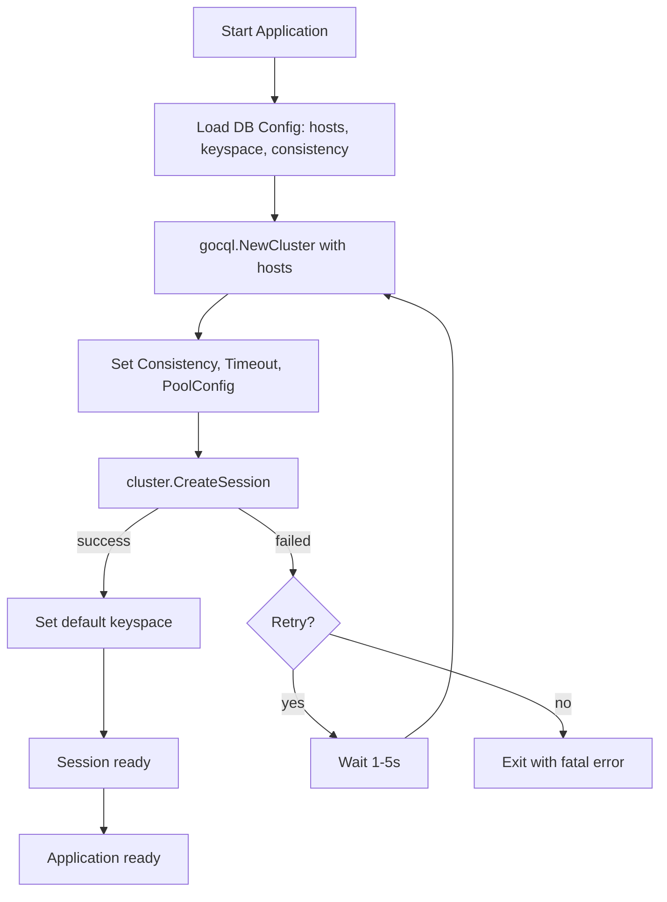
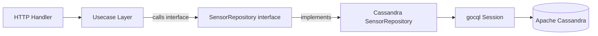
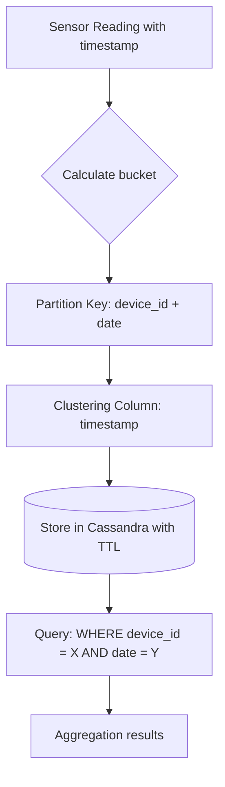

# Module 22: pkg/cassandra (Apache Cassandra Client & Repository)

## สำหรับโฟลเดอร์ `internal/pkg/cassandra/` และ `internal/repository/`

ไฟล์ที่เกี่ยวข้อง:
- `internal/pkg/cassandra/client.go`
- `internal/pkg/cassandra/repository.go`
- `internal/pkg/cassandra/batch.go`
- `internal/pkg/cassandra/migrate.go`
- `internal/repository/cassandra_sensor_repo.go`
- `migrations/cassandra/` (สำหรับ migration files เฉพาะ Cassandra)

---

## หลักการ (Concept)

### Apache Cassandra คืออะไร?

Apache Cassandra เป็นฐานข้อมูลแบบ NoSQL ประเภท Wide-Column Store ที่ออกแบบมาเพื่อรองรับการเขียนข้อมูลปริมาณมหาศาล (high‑throughput writes) และการขยายระบบแบบแนวนอน (horizontal scaling) โดยไม่มีจุดล้มเหลวเดียว (no single point of failure) ด้วยสถาปัตยกรรมแบบ masterless, peer‑to‑peer, และการกระจายข้อมูลอัตโนมัติผ่าน consistent hashing เหมาะสำหรับระบบที่ต้องการความพร้อมใช้งานสูง (high availability) และการกระจายข้อมูลข้ามศูนย์ข้อมูล (multi‑data center replication)

### มีกี่แบบ? (Use Cases ในระบบ IoT/Event Sourcing)

| Use Case | ลักษณะ | เหมาะกับ |
|----------|--------|----------|
| **Time‑series data (IoT sensors)** | เขียนข้อมูลความถี่สูง อ่านตามช่วงเวลา | เก็บอุณหภูมิ, ความชื้น, logs ทุกวินาที |
| **Event sourcing / Activity logs** | append‑only, immutable records | ประวัติการแจ้งเตือน, audit logs |
| **Real‑time analytics** | aggregation บน partition key | dashboard real-time |
| **Product catalog / User profiles** | การอ่านข้อมูลบ่อย (read‑heavy) | สิทธิ์, ข้อมูลอ้างอิง |
| **Leaderboard / Counters** | increment/decrement atomic | คะแนน, การนับจำนวน |

### ใช้อย่างไร / นำไปใช้กรณีไหน

1. **IoT sensor data storage** – เก็บค่าอุณหภูมิ ความชื้น ทุกวินาทีจากเซนเซอร์นับพันตัว
2. **Alert history** – เก็บประวัติการแจ้งเตือนแบบไม่ลบ (append‑only) สำหรับ audit
3. **Event sourcing** – เก็บ event ทั้งหมดของระบบ (user action, device state change)
4. **Time‑series analytics** – query ค่าเฉลี่ยรายชั่วโมง/วัน ด้วย aggregation
5. **High‑availability systems** – ระบบที่ต้องการ uptime 99.999% และกระจายหลาย data center

### ประโยชน์ที่ได้รับ

- **Linear scalability** – เพิ่ม node ได้โดยไม่ downtime
- **High write throughput** – ออกแบบมาเพื่อการเขียนโดยเฉพาะ
- **No single point of failure** – masterless, replication ป้องกันข้อมูลสูญหาย
- **Flexible schema** – ไม่ต้องกำหนด column ล่วงหน้า (CQL)
- **Time‑series optimization** – รองรับ Time Window Compaction Strategy (TWCS) และ TTL อัตโนมัติ[reference:0]
- **Multi‑data center replication** – กระจายข้อมูลข้าม region ได้อัตโนมัติ

### ข้อควรระวัง

- **No JOINs** – ต้อง denormalize ข้อมูลล่วงหน้า
- **No ACID transactions ข้าม partition** – รองรับเฉพาะ atomicity ภายใน partition เดียว
- **Consistency trade‑off** – ต้องเลือก consistency level (QUORUM, ONE, LOCAL_QUORUM)[reference:1]
- **Partition key design สำคัญมาก** – ถ้าออกแบบไม่ดีจะเกิด hot partition
- **No `ORDER BY` ข้าม partition** – sorting ทำได้เฉพาะภายใน partition
- **Secondary indexes มีข้อจำกัด** – ไม่เหมาะกับ high‑cardinality columns
- **Time‑series bucket pattern** – ควรใช้ bucketing (วัน/ชั่วโมง) เพื่อป้องกัน partition ใหญ่เกิน[reference:2]

### ข้อดี
- เขียนเร็วมาก, scalable แนวราบ, high availability, รองรับ multi‑DC

### ข้อเสีย
- query ซับซ้อนกว่า SQL, ไม่มี JOIN, transaction ข้าม partition ไม่มี

### ข้อห้าม
- ห้ามใช้ `ALLOW FILTERING` บน production (scan ทุก partition)
- ห้ามใช้ `IN` query กับหลาย partition key (performance ตก)
- ห้ามใช้ `consistency = ONE` สำหรับข้อมูลสำคัญ (อาจสูญเสีย data)
- ห้ามใช้ `BATCH` ข้าม partition หลายอัน (performance และ reliability)
- ห้ามใช้ time-series data โดยไม่ใช้ TWCS compaction strategy[reference:3]
- ห้ามใช้ `timestamp` field เป็น `int64` ต้องใช้ `time.Time`[reference:4]

---

## การออกแบบ Workflow และ Dataflow

### Workflow: การเชื่อมต่อ Cassandra ผ่าน gocql



**รูปที่ 31:** ขั้นตอนการสร้าง connection ไปยัง Apache Cassandra ผ่าน gocql driver พร้อมการตั้งค่า consistency และ connection pool

### Workflow: Repository Pattern สำหรับ Cassandra



**รูปที่ 32:** การทำงานของ Repository Pattern ที่แยก interface ออกจาก implementation สำหรับ Cassandra

### Dataflow: Time‑Series Data Bucketing (IoT)



**รูปที่ 33:** การทำ bucketing สำหรับ time‑series data ใน Cassandra: partition key = device_id + date (YYYYMMDD) เพื่อป้องกัน partition ใหญ่เกิน, clustering column = timestamp สำหรับการเรียงลำดับ

---

## ตัวอย่างโค้ดที่รันได้จริง

### 1. Cassandra Client – `client.go`

```go
// Package cassandra provides Apache Cassandra client and utilities using gocql.
// ----------------------------------------------------------------
// แพ็คเกจ cassandra ให้บริการ Apache Cassandra client และ utilities ด้วย gocql
package cassandra

import (
	"context"
	"fmt"
	"log"
	"time"

	"github.com/gocql/gocql"
)

// ConsistencyLevel defines read/write consistency for Cassandra.
// ----------------------------------------------------------------
// ConsistencyLevel กำหนดระดับความสอดคล้องสำหรับการอ่าน/เขียน Cassandra
type ConsistencyLevel string

const (
	// One: Fastest, lowest consistency (อาจอ่านค่าที่ไม่ถูกต้อง)
	ConsistencyOne     ConsistencyLevel = "ONE"
	ConsistencyQuorum  ConsistencyLevel = "QUORUM"
	ConsistencyLocalQuorum ConsistencyLevel = "LOCAL_QUORUM"
	ConsistencyAll     ConsistencyLevel = "ALL"
)

// Config holds Cassandra connection settings.
// ----------------------------------------------------------------
// Config เก็บค่ากำหนดการเชื่อมต่อ Cassandra
type Config struct {
	Hosts            []string          // Cassandra node addresses, e.g., ["127.0.0.1:9042", "127.0.0.2:9042"]
	Keyspace         string            // Default keyspace
	Username         string            // Username for authentication
	Password         string            // Password for authentication
	Consistency      ConsistencyLevel  // Default consistency level
	Timeout          time.Duration     // Query timeout (default: 2s)
	ConnectTimeout   time.Duration     // Connection timeout (default: 600ms)
	NumConns         int               // Number of connections per host (default: 2)
	PageSize         int               // Page size for queries (default: 5000)
	ProtoVersion     int               // Cassandra protocol version (default: 4)
	RetryPolicy      RetryPolicyConfig // Retry policy for failed queries
	DisableInitialHostLookup bool      // Disable initial host lookup (default: false)
}

// RetryPolicyConfig defines retry behavior for failed queries.
// ----------------------------------------------------------------
// RetryPolicyConfig กำหนดพฤติกรรมการ retry สำหรับ query ที่ล้มเหลว
type RetryPolicyConfig struct {
	NumRetries int           // Number of retry attempts (default: 3)
	MinDelay   time.Duration // Minimum delay between retries (default: 100ms)
	MaxDelay   time.Duration // Maximum delay between retries (default: 2s)
}

// DefaultConfig returns recommended config for production.
// ----------------------------------------------------------------
// DefaultConfig คืนค่า config ที่แนะนำสำหรับ production
func DefaultConfig() *Config {
	return &Config{
		Hosts:           []string{"127.0.0.1:9042"},
		Keyspace:        "cmon_sensor",
		Consistency:     ConsistencyLocalQuorum,
		Timeout:         2 * time.Second,
		ConnectTimeout:  600 * time.Millisecond,
		NumConns:        2,
		PageSize:        5000,
		ProtoVersion:    4,
		DisableInitialHostLookup: false,
		RetryPolicy: RetryPolicyConfig{
			NumRetries: 3,
			MinDelay:   100 * time.Millisecond,
			MaxDelay:   2 * time.Second,
		},
	}
}

// Client wraps gocql Session with connection management.
// ----------------------------------------------------------------
// Client ห่อหุ้ม gocql Session พร้อมการจัดการการเชื่อมต่อ
type Client struct {
	Session *gocql.Session
	Config  *Config
}

// NewClient creates a new Cassandra client with connection pool.
// ----------------------------------------------------------------
// NewClient สร้าง Cassandra client ใหม่พร้อม connection pool
func NewClient(cfg *Config) (*Client, error) {
	if cfg == nil {
		cfg = DefaultConfig()
	}

	// Create cluster configuration
	// สร้างการกำหนดค่า cluster
	cluster := gocql.NewCluster(cfg.Hosts...)
	cluster.Keyspace = cfg.Keyspace
	cluster.Consistency = gocql.Consistency(cfg.Consistency)
	cluster.Timeout = cfg.Timeout
	cluster.ConnectTimeout = cfg.ConnectTimeout
	cluster.NumConns = cfg.NumConns
	cluster.PageSize = cfg.PageSize
	cluster.ProtoVersion = cfg.ProtoVersion
	cluster.DisableInitialHostLookup = cfg.DisableInitialHostLookup

	// Set authentication if provided
	// ตั้งค่าการรับรองตัวตนถ้ามีการระบุ
	if cfg.Username != "" && cfg.Password != "" {
		cluster.Authenticator = gocql.PasswordAuthenticator{
			Username: cfg.Username,
			Password: cfg.Password,
		}
	}

	// Configure retry policy
	// กำหนดค่านโยบายการ retry
	cluster.RetryPolicy = &gocql.SimpleRetryPolicy{
		NumRetries: cfg.RetryPolicy.NumRetries,
	}

	// Configure connection pool
	// กำหนดค่า connection pool
	cluster.PoolConfig.HostSelectionPolicy = gocql.TokenAwareHostPolicy(gocql.RoundRobinHostPolicy())

	// Create session
	// สร้าง session
	session, err := cluster.CreateSession()
	if err != nil {
		return nil, fmt.Errorf("failed to create Cassandra session: %w", err)
	}

	return &Client{
		Session: session,
		Config:  cfg,
	}, nil
}

// Close gracefully closes the Cassandra session.
// ----------------------------------------------------------------
// Close ปิด session Cassandra อย่างนุ่มนวล
func (c *Client) Close() {
	if c.Session != nil {
		c.Session.Close()
	}
}

// ExecuteQuery executes a CQL query with consistency override.
// ----------------------------------------------------------------
// ExecuteQuery execute CQL query พร้อม override consistency
func (c *Client) ExecuteQuery(ctx context.Context, query string, consistency ConsistencyLevel, values ...interface{}) error {
	q := c.Session.Query(query, values...).WithContext(ctx)
	if consistency != "" {
		q = q.Consistency(gocql.Consistency(consistency))
	}
	return q.Exec()
}

// QueryIterator executes a CQL query and returns an iterator for scanning.
// ----------------------------------------------------------------
// QueryIterator execute CQL query และคืน iterator สำหรับการ scan
func (c *Client) QueryIterator(ctx context.Context, query string, consistency ConsistencyLevel, values ...interface{}) *gocql.Iter {
	q := c.Session.Query(query, values...).WithContext(ctx)
	if consistency != "" {
		q = q.Consistency(gocql.Consistency(consistency))
	}
	return q.Iter()
}
```

### 2. Generic Cassandra Repository – `repository.go`

```go
package cassandra

import (
	"context"

	"github.com/gocql/gocql"
)

// Repository defines generic CRUD operations for any entity.
// ----------------------------------------------------------------
// Repository กำหนดการดำเนินการ CRUD ทั่วไปสำหรับ entity ใดๆ
type Repository[T any] interface {
	Insert(ctx context.Context, entity *T) error
	FindByID(ctx context.Context, id interface{}) (*T, error)
	Update(ctx context.Context, entity *T) error
	Delete(ctx context.Context, id interface{}) error
}

// GenericRepository implements Repository with gocql.
// ----------------------------------------------------------------
// GenericRepository อิมพลีเมนต์ Repository ด้วย gocql
type GenericRepository[T any] struct {
	session   *gocql.Session
	tableName string
	// Map struct field -> column name for serialization
	// แผนที่ struct field -> ชื่อ column สำหรับ serialization
	fieldMapping map[string]string
}

// NewGenericRepository creates a new generic Cassandra repository.
// ----------------------------------------------------------------
// NewGenericRepository สร้าง generic Cassandra repository ใหม่
func NewGenericRepository[T any](session *gocql.Session, tableName string) *GenericRepository[T] {
	return &GenericRepository[T]{
		session:      session,
		tableName:    tableName,
		fieldMapping: make(map[string]string),
	}
}

// Insert inserts a new entity into Cassandra.
// ----------------------------------------------------------------
// Insert เพิ่ม entity ใหม่ลงใน Cassandra
func (r *GenericRepository[T]) Insert(ctx context.Context, entity *T) error {
	// Build INSERT query using gocqlx or manual mapping
	// สร้าง INSERT query ด้วย gocqlx หรือการ mapping แบบ manual
	query := r.session.Query("INSERT INTO "+r.tableName+" JSON ?", entity).WithContext(ctx)
	return query.Exec()
}

// FindByID retrieves an entity by primary key.
// ----------------------------------------------------------------
// FindByID ดึง entity ด้วย primary key
func (r *GenericRepository[T]) FindByID(ctx context.Context, id interface{}) (*T, error) {
	var entity T
	query := r.session.Query("SELECT * FROM "+r.tableName+" WHERE id = ?", id).WithContext(ctx)
	if err := query.Scan(&entity); err != nil {
		if err == gocql.ErrNotFound {
			return nil, nil
		}
		return nil, err
	}
	return &entity, nil
}

// Update updates an existing entity.
// ----------------------------------------------------------------
// Update แก้ไข entity ที่มีอยู่
func (r *GenericRepository[T]) Update(ctx context.Context, entity *T) error {
	query := r.session.Query("UPDATE "+r.tableName+" SET JSON ?", entity).WithContext(ctx)
	return query.Exec()
}

// Delete removes an entity by primary key.
// ----------------------------------------------------------------
// Delete ลบ entity ด้วย primary key
func (r *GenericRepository[T]) Delete(ctx context.Context, id interface{}) error {
	query := r.session.Query("DELETE FROM "+r.tableName+" WHERE id = ?", id).WithContext(ctx)
	return query.Exec()
}
```

### 3. Batch Operations for High Throughput – `batch.go`

```go
package cassandra

import (
	"context"
	"time"

	"github.com/gocql/gocql"
)

// BatchOperation represents a single operation in a batch.
// ----------------------------------------------------------------
// BatchOperation แทน operation เดียวใน batch
type BatchOperation struct {
	Query  string
	Values []interface{}
}

// BatchWriter handles batched insert of sensor data for high throughput.
// ----------------------------------------------------------------
// BatchWriter จัดการการ insert แบบ batch สำหรับข้อมูลเซนเซอร์เพื่อปริมาณงานสูง
type BatchWriter struct {
	session       *gocql.Session
	batchSize     int
	flushInterval time.Duration
	buffer        []BatchOperation
	batchType     gocql.BatchType
	mu            chan struct{}
	stopCh        chan struct{}
}

// NewBatchWriter creates a new batch writer with batching.
// ----------------------------------------------------------------
// NewBatchWriter สร้าง batch writer ใหม่พร้อมการทำ batch
func NewBatchWriter(session *gocql.Session, batchSize int, flushInterval time.Duration) *BatchWriter {
	return &BatchWriter{
		session:       session,
		batchSize:     batchSize,
		flushInterval: flushInterval,
		buffer:        make([]BatchOperation, 0, batchSize),
		batchType:     gocql.UnloggedBatch,
		mu:            make(chan struct{}, 1),
		stopCh:        make(chan struct{}),
	}
}

// Start begins the background flusher goroutine.
// ----------------------------------------------------------------
// Start เริ่ม goroutine ที่ flush ข้อมูลในพื้นหลัง
func (w *BatchWriter) Start(ctx context.Context) {
	ticker := time.NewTicker(w.flushInterval)
	go func() {
		for {
			select {
			case <-ticker.C:
				w.Flush(ctx)
			case <-w.stopCh:
				ticker.Stop()
				w.Flush(ctx) // final flush
				return
			case <-ctx.Done():
				ticker.Stop()
				w.Flush(ctx)
				return
			}
		}
	}()
}

// Stop gracefully stops the batch writer and flushes remaining data.
// ----------------------------------------------------------------
// Stop หยุด batch writer อย่างนุ่มนวลและ flush ข้อมูลที่เหลือ
func (w *BatchWriter) Stop() {
	close(w.stopCh)
}

// Add adds a query to the buffer, flushing if batch is full.
// ----------------------------------------------------------------
// Add เพิ่ม query ลง buffer และ flush ถ้าเต็ม batch
func (w *BatchWriter) Add(ctx context.Context, query string, values ...interface{}) error {
	select {
	case w.mu <- struct{}{}:
		defer func() { <-w.mu }()
		w.buffer = append(w.buffer, BatchOperation{Query: query, Values: values})
		if len(w.buffer) >= w.batchSize {
			return w.flush(ctx)
		}
		return nil
	case <-ctx.Done():
		return ctx.Err()
	}
}

// Flush writes all buffered queries to Cassandra as a batch.
// ----------------------------------------------------------------
// Flush เขียน query ทั้งหมดใน buffer ลง Cassandra เป็น batch
func (w *BatchWriter) Flush(ctx context.Context) error {
	select {
	case w.mu <- struct{}{}:
		defer func() { <-w.mu }()
		return w.flush(ctx)
	case <-ctx.Done():
		return ctx.Err()
	}
}

func (w *BatchWriter) flush(ctx context.Context) error {
	if len(w.buffer) == 0 {
		return nil
	}
	// Create batch
	// สร้าง batch
	batch := w.session.NewBatch(w.batchType)
	for _, op := range w.buffer {
		batch.Query(op.Query, op.Values...)
	}
	// Clear buffer
	// ล้าง buffer
	w.buffer = w.buffer[:0]
	// Execute batch
	// execute batch
	return w.session.ExecuteBatch(batch)
}
```

### 4. Migration Tool – `migrate.go`

```go
package cassandra

import (
	"context"
	"fmt"
	"strings"

	"github.com/gocql/gocql"
)

// Migration represents a database migration step.
// ----------------------------------------------------------------
// Migration แทนขั้นตอนการ migration ฐานข้อมูล
type Migration struct {
	ID      string
	Up      string   // CQL to apply
	Down    string   // CQL to rollback
}

// Migrator handles schema migrations for Cassandra.
// ----------------------------------------------------------------
// Migrator จัดการ schema migrations สำหรับ Cassandra
type Migrator struct {
	session *gocql.Session
	keyspace string
}

// NewMigrator creates a new migrator instance.
// ----------------------------------------------------------------
// NewMigrator สร้าง migrator ใหม่
func NewMigrator(session *gocql.Session, keyspace string) *Migrator {
	return &Migrator{
		session:  session,
		keyspace: keyspace,
	}
}

// EnsureMigrationTable creates the schema_migrations table if not exists.
// ----------------------------------------------------------------
// EnsureMigrationTable สร้างตาราง schema_migrations ถ้ายังไม่มี
func (m *Migrator) EnsureMigrationTable(ctx context.Context) error {
	query := `
		CREATE TABLE IF NOT EXISTS schema_migrations (
			id text PRIMARY KEY,
			applied_at timestamp
		)
	`
	return m.session.Query(query).WithContext(ctx).Exec()
}

// ApplyUp applies all pending migrations.
// ----------------------------------------------------------------
// ApplyUp ใช้ migration ที่ยังไม่ได้ใช้ทั้งหมด
func (m *Migrator) ApplyUp(ctx context.Context, migrations []Migration) error {
	if err := m.EnsureMigrationTable(ctx); err != nil {
		return err
	}
	for _, mig := range migrations {
		// Check if already applied
		// ตรวจสอบว่าใช้ไปแล้วหรือยัง
		var count int
		iter := m.session.Query("SELECT COUNT(*) FROM schema_migrations WHERE id = ?", mig.ID).WithContext(ctx).Iter()
		iter.Scan(&count)
		iter.Close()
		if count > 0 {
			continue
		}
		// Apply migration
		// ใช้ migration
		if err := m.executeBatch(ctx, mig.Up); err != nil {
			return fmt.Errorf("migration %s failed: %w", mig.ID, err)
		}
		// Record migration
		// บันทึก migration
		if err := m.session.Query("INSERT INTO schema_migrations (id, applied_at) VALUES (?, ?)", mig.ID, time.Now()).WithContext(ctx).Exec(); err != nil {
			return err
		}
	}
	return nil
}

// executeBatch executes multiple CQL statements separated by semicolons.
// ----------------------------------------------------------------
// executeBatch execute หลาย CQL statements ที่คั่นด้วย semicolon
func (m *Migrator) executeBatch(ctx context.Context, cql string) error {
	statements := strings.Split(cql, ";")
	for _, stmt := range statements {
		stmt = strings.TrimSpace(stmt)
		if stmt == "" {
			continue
		}
		if err := m.session.Query(stmt).WithContext(ctx).Exec(); err != nil {
			return err
		}
	}
	return nil
}

// Example migration for sensor data table.
// ----------------------------------------------------------------
// ตัวอย่าง migration สำหรับตารางข้อมูลเซนเซอร์
func ExampleSensorMigrations() []Migration {
	return []Migration{
		{
			ID: "001_create_sensor_readings_table",
			Up: `
				CREATE TABLE IF NOT EXISTS sensor_readings (
					device_id text,
					date text,
					timestamp timestamp,
					sensor_type text,
					value double,
					unit text,
					PRIMARY KEY ((device_id, date), timestamp)
				) WITH CLUSTERING ORDER BY (timestamp DESC)
				AND compaction = {'class': 'TimeWindowCompactionStrategy', 'compaction_window_size': 1, 'compaction_window_unit': 'DAYS'}
				AND default_time_to_live = 7776000;
			`,
			Down: `DROP TABLE IF EXISTS sensor_readings;`,
		},
		{
			ID: "002_create_alerts_table",
			Up: `
				CREATE TABLE IF NOT EXISTS alerts (
					alert_id uuid,
					device_id text,
					timestamp timestamp,
					severity text,
					message text,
					PRIMARY KEY ((device_id), timestamp, alert_id)
				) WITH CLUSTERING ORDER BY (timestamp DESC)
				AND default_time_to_live = 2592000;
			`,
			Down: `DROP TABLE IF EXISTS alerts;`,
		},
	}
}
```

### 5. Sensor Repository for Cassandra – `internal/repository/cassandra_sensor_repo.go`

```go
// Package repository provides Cassandra-specific implementations for sensor data.
// ----------------------------------------------------------------
// แพ็คเกจ repository ให้บริการ implementation เฉพาะของ Cassandra สำหรับข้อมูลเซนเซอร์
package repository

import (
	"context"
	"time"

	"github.com/gocql/gocql"
	"github.com/google/uuid"
)

// SensorReading represents a single sensor reading for Cassandra.
// ----------------------------------------------------------------
// SensorReading แทนการอ่านค่าจากเซนเซอร์ 1 ครั้งสำหรับ Cassandra
type SensorReading struct {
	DeviceID   string    `db:"device_id"`
	Date       string    `db:"date"`        // YYYYMMDD for bucketing
	Timestamp  time.Time `db:"timestamp"`   // Primary clustering key
	SensorType string    `db:"sensor_type"`
	Value      float64   `db:"value"`
	Unit       string    `db:"unit"`
}

// SensorRepository defines operations for time-series sensor data.
// ----------------------------------------------------------------
// SensorRepository กำหนดการดำเนินการสำหรับข้อมูลเซนเซอร์แบบ time-series
type SensorRepository interface {
	Insert(ctx context.Context, reading *SensorReading) error
	InsertBatch(ctx context.Context, readings []SensorReading) error
	GetReadings(ctx context.Context, deviceID string, start, end time.Time) ([]SensorReading, error)
	GetHourlyAvg(ctx context.Context, deviceID string, start, end time.Time) (map[time.Time]float64, error)
}

// CassandraSensorRepository implements SensorRepository for Cassandra.
// ----------------------------------------------------------------
// CassandraSensorRepository อิมพลีเมนต์ SensorRepository สำหรับ Cassandra
type CassandraSensorRepository struct {
	session *gocql.Session
	writer  *cassandra.BatchWriter
}

// NewCassandraSensorRepository creates a new Cassandra sensor repository.
// ----------------------------------------------------------------
// NewCassandraSensorRepository สร้าง Cassandra sensor repository ใหม่
func NewCassandraSensorRepository(session *gocql.Session) *CassandraSensorRepository {
	return &CassandraSensorRepository{
		session: session,
	}
}

// Insert stores a single sensor reading.
// ----------------------------------------------------------------
// Insert เก็บข้อมูลเซนเซอร์ 1 รายการ
func (r *CassandraSensorRepository) Insert(ctx context.Context, reading *SensorReading) error {
	// Convert timestamp to UTC and generate date bucket (YYYYMMDD)
	// แปลง timestamp เป็น UTC และสร้าง bucket (YYYYMMDD)
	reading.Timestamp = reading.Timestamp.UTC()
	reading.Date = reading.Timestamp.Format("20060102")

	query := `INSERT INTO sensor_readings (device_id, date, timestamp, sensor_type, value, unit)
	          VALUES (?, ?, ?, ?, ?, ?)`
	return r.session.Query(query,
		reading.DeviceID, reading.Date, reading.Timestamp,
		reading.SensorType, reading.Value, reading.Unit,
	).WithContext(ctx).Exec()
}

// InsertBatch stores multiple sensor readings using batch writer.
// ----------------------------------------------------------------
// InsertBatch เก็บข้อมูลเซนเซอร์หลายรายการด้วย batch writer
func (r *CassandraSensorRepository) InsertBatch(ctx context.Context, readings []SensorReading) error {
	for _, reading := range readings {
		reading.Timestamp = reading.Timestamp.UTC()
		reading.Date = reading.Timestamp.Format("20060102")
		query := `INSERT INTO sensor_readings (device_id, date, timestamp, sensor_type, value, unit)
		          VALUES (?, ?, ?, ?, ?, ?)`
		if err := r.writer.Add(ctx, query,
			reading.DeviceID, reading.Date, reading.Timestamp,
			reading.SensorType, reading.Value, reading.Unit,
		); err != nil {
			return err
		}
	}
	return nil
}

// GetReadings retrieves sensor readings within time range using bucket filtering.
// ----------------------------------------------------------------
// GetReadings ดึงข้อมูลเซนเซอร์ในช่วงเวลาที่กำหนดด้วย bucket filtering
func (r *CassandraSensorRepository) GetReadings(ctx context.Context, deviceID string, start, end time.Time) ([]SensorReading, error) {
	// Calculate date buckets for the time range
	// คำนวณ date buckets สำหรับช่วงเวลา
	startUTC := start.UTC()
	endUTC := end.UTC()
	current := startUTC
	var readings []SensorReading

	// Query each date bucket separately (efficient partition access)
	// query แต่ละ date bucket แยกกัน (เข้าถึง partition ได้มีประสิทธิภาพ)
	for current.Before(endUTC) || current.Equal(endUTC) {
		dateBucket := current.Format("20060102")
		query := `SELECT device_id, date, timestamp, sensor_type, value, unit
		          FROM sensor_readings
		          WHERE device_id = ? AND date = ? AND timestamp >= ? AND timestamp <= ?
		          ORDER BY timestamp DESC`
		iter := r.session.Query(query, deviceID, dateBucket, startUTC, endUTC).WithContext(ctx).Iter()
		var reading SensorReading
		for iter.Scan(&reading.DeviceID, &reading.Date, &reading.Timestamp,
			&reading.SensorType, &reading.Value, &reading.Unit) {
			readings = append(readings, reading)
		}
		if err := iter.Close(); err != nil {
			return nil, err
		}
		// Move to next day
		// เลื่อนไปวันถัดไป
		current = current.AddDate(0, 0, 1)
	}
	return readings, nil
}

// GetHourlyAvg calculates average value per hour using aggregation.
// ----------------------------------------------------------------
// GetHourlyAvg คำนวณค่าเฉลี่ยรายชั่วโมงโดยใช้ aggregation
func (r *CassandraSensorRepository) GetHourlyAvg(ctx context.Context, deviceID string, start, end time.Time) (map[time.Time]float64, error) {
	startUTC := start.UTC()
	endUTC := end.UTC()
	dateBuckets := make(map[string]bool)
	current := startUTC
	for current.Before(endUTC) || current.Equal(endUTC) {
		dateBuckets[current.Format("20060102")] = true
		current = current.AddDate(0, 0, 1)
	}

	results := make(map[time.Time]float64)
	for dateBucket := range dateBuckets {
		query := `SELECT toStartOfHour(timestamp) as hour, avg(value)
		          FROM sensor_readings
		          WHERE device_id = ? AND date = ? AND timestamp >= ? AND timestamp <= ?
		          GROUP BY hour`
		iter := r.session.Query(query, deviceID, dateBucket, startUTC, endUTC).WithContext(ctx).Iter()
		var hour time.Time
		var avg float64
		for iter.Scan(&hour, &avg) {
			results[hour] = avg
		}
		if err := iter.Close(); err != nil {
			return nil, err
		}
	}
	return results, nil
}
```

### 6. Cassandra Migration Example – `migrations/cassandra/001_create_sensor_readings.cql`

```cql
-- Create keyspace for CMON IoT system
-- สร้าง keyspace สำหรับระบบ CMON IoT
CREATE KEYSPACE IF NOT EXISTS cmon_sensor
WITH REPLICATION = {
    'class': 'NetworkTopologyStrategy',
    'datacenter1': 3
};

USE cmon_sensor;

-- Create sensor_readings table with Time Window Compaction Strategy
-- สร้างตาราง sensor_readings ด้วย Time Window Compaction Strategy
CREATE TABLE IF NOT EXISTS sensor_readings (
    device_id text,
    date text,
    timestamp timestamp,
    sensor_type text,
    value double,
    unit text,
    PRIMARY KEY ((device_id, date), timestamp)
) WITH CLUSTERING ORDER BY (timestamp DESC)
AND compaction = {
    'class': 'TimeWindowCompactionStrategy',
    'compaction_window_size': 1,
    'compaction_window_unit': 'DAYS'
}
AND default_time_to_live = 7776000  -- 90 days in seconds
AND caching = {'keys': 'ALL', 'rows_per_partition': '100'};

-- Create alerts table for notification history
-- สร้างตาราง alerts สำหรับประวัติการแจ้งเตือน
CREATE TABLE IF NOT EXISTS alerts (
    alert_id uuid,
    device_id text,
    timestamp timestamp,
    severity text,
    message text,
    PRIMARY KEY ((device_id), timestamp, alert_id)
) WITH CLUSTERING ORDER BY (timestamp DESC)
AND default_time_to_live = 2592000;  -- 30 days

-- Create index for querying by severity (low cardinality)
-- สร้าง index สำหรับ query ด้วย severity
CREATE INDEX IF NOT EXISTS idx_alerts_severity ON alerts (severity);
```

**migrations/cassandra/001_create_sensor_readings.down.cql**

```cql
DROP TABLE IF EXISTS cmon_sensor.sensor_readings;
DROP TABLE IF EXISTS cmon_sensor.alerts;
DROP KEYSPACE IF EXISTS cmon_sensor;
```

---

## วิธีใช้งาน module นี้

### การติดตั้ง

```bash
# Install gocql driver
go get github.com/gocql/gocql
# Install gocqlx for ORM and migration (optional but recommended)
go get github.com/scylladb/gocqlx/v3
```

### การตั้งค่า configuration

```go
cfg := &cassandra.Config{
    Hosts:        []string{os.Getenv("CASSANDRA_HOSTS")}, // "node1:9042,node2:9042"
    Keyspace:     "cmon_sensor",
    Username:     os.Getenv("CASSANDRA_USER"),
    Password:     os.Getenv("CASSANDRA_PASSWORD"),
    Consistency:  cassandra.ConsistencyLocalQuorum,
    Timeout:      2 * time.Second,
    NumConns:     2,
}
```

### การรวมกับ GORM (หมายเหตุ: Cassandra ไม่รองรับ GORM)

เนื่องจาก GORM ออกแบบมาสำหรับฐานข้อมูลเชิงสัมพันธ์ (SQL) โดยเฉพาะและไม่มี driver สำหรับ Cassandra อย่างเป็นทางการ[reference:5], ระบบของเราจึงใช้ **gocql** เป็น native driver ร่วมกับ **gocqlx** สำหรับ query builder และ migration[reference:6]. หากยังต้องการ GORM ควรใช้ฐานข้อมูลอื่น (PostgreSQL, MySQL) สำหรับข้อมูลที่มีความสัมพันธ์ซับซ้อน, และใช้ Cassandra สำหรับ time‑series / write‑heavy workloads โดยเฉพาะ

### การใช้งานจริง (ตัวอย่าง)

```go
// Create Cassandra client
client, err := cassandra.NewClient(cassandra.DefaultConfig())
if err != nil {
    log.Fatal(err)
}
defer client.Close()

// Create sensor repository
sensorRepo := repository.NewCassandraSensorRepository(client.Session)

// Insert sensor reading
reading := &repository.SensorReading{
    DeviceID:   "sensor_001",
    Timestamp:  time.Now(),
    SensorType: "temperature",
    Value:      25.5,
    Unit:       "C",
}
if err := sensorRepo.Insert(context.Background(), reading); err != nil {
    log.Printf("Failed to insert: %v", err)
}
```

---

## ตารางสรุป Components

| Component | หน้าที่ | ตัวอย่าง |
|-----------|--------|----------|
| `Client` | จัดการ connection pool | `cassandra.NewClient()` |
| `GenericRepository[T]` | Generic CRUD สำหรับ entity ทั่วไป | `Insert()`, `FindByID()`, `Update()`, `Delete()` |
| `BatchWriter` | Batch insert สำหรับ high throughput | `Add()`, `Flush()`, `Start()` |
| `Migrator` | จัดการ schema migrations | `ApplyUp()`, `EnsureMigrationTable()` |
| `CassandraSensorRepository` | Time‑series sensor operations | `InsertBatch()`, `GetReadings()`, `GetHourlyAvg()` |

---

## แบบฝึกหัดท้าย module (5 ข้อ)

1. เพิ่มฟังก์ชัน `CreateKeyspace` ใน `Client` สำหรับสร้าง keyspace แบบ dynamic พร้อม replication factor ที่ระบุ
2. ปรับปรุง `BatchWriter` ให้รองรับ `LoggedBatch` สำหรับ atomic operations ข้าม partition เดียว และ `UnloggedBatch` สำหรับ partition เดียว (performance)
3. Implement repository method `GetDeviceLatestReading` ที่ใช้ `LIMIT 1` และ `ORDER BY timestamp DESC` เพื่อดึงค่าล่าสุดของแต่ละ device
4. เขียน migration สำหรับตาราง `device_metadata` ที่เก็บข้อมูลคงที่ของ device (device_id, location, firmware_version) โดยใช้ `PRIMARY KEY (device_id)`
5. สร้างฟังก์ชัน `PurgeOldData` ที่ลบข้อมูลเก่ากว่า retention period (90 วัน) โดยใช้ `DELETE` พร้อมเงื่อนไข timestamp หรือใช้ TTL ที่ table level

---
ออกแบบระบบ API GoLang สถาปัตยกรรม
Go Backend Structure Explanation
กฎหมายวิธีพิจารณาความแพ่ง สรุปและกระบวนการ
GoBackendProjectStructureAnalysis
Go-Chi IoT API Comprehensive Guide
Go-Chi Comprehensive Guide
GoChi IoT API Comprehensive Guide
Go-Chi MQTT Integration Guide
Mermaid flowchart parse error fix
Mermaid diagram parse error fix
Fix Mermaid flowchart syntax error
แก้ไข Flowchart คดีกลุ่ม Class Action


## แหล่งอ้างอิง

- [gocql – Apache Cassandra driver for Go](https://github.com/gocql/gocql)
- [gocqlx – All-In-One: CQL query builder, ORM and migration tool](https://github.com/scylladb/gocqlx)
- [Cassandra Time‑series Best Practices](https://cassandra.apache.org/doc/stable/cassandra/operating/compaction/twcs.html)
- [Time Window Compaction Strategy (TWCS) 官方文档](https://cassandra.apache.org/doc/stable/cassandra/operating/compaction/twcs.html)[reference:7]
- [gocql 时间序列数据写入最佳实践](https://www.php.cn/faq/1245247.html)[reference:8]

---

**หมายเหตุ:** module นี้ครบถ้วนสำหรับ `pkg/cassandra` สำหรับระบบ gobackend หากต้องการ module เพิ่มเติม (เช่น `pkg/scylla`, `pkg/dynamodb`, `pkg/hbase`) โปรดแจ้ง