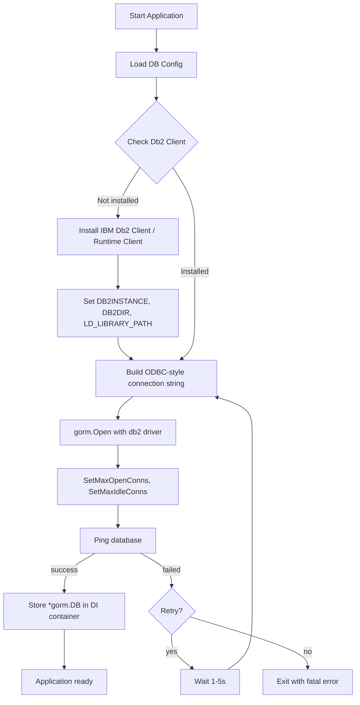
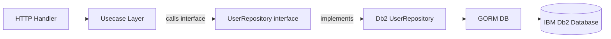

# Module 19: pkg/db2 (IBM Db2 Database Client & Repository)

## สำหรับโฟลเดอร์ `internal/pkg/db2/` และ `internal/repository/`

ไฟล์ที่เกี่ยวข้อง:
- `internal/pkg/db2/client.go`
- `internal/pkg/db2/repository.go`
- `internal/pkg/db2/transaction.go`
- `internal/repository/db2_user_repo.go`
- `migrations/db2/` (สำหรับ migration files เฉพาะ Db2)

---

## หลักการ (Concept)

### IBM Db2 คืออะไร?

IBM Db2 เป็นระบบจัดการฐานข้อมูลเชิงสัมพันธ์ (RDBMS) ระดับ enterprise ที่พัฒนาโดย IBM มีจุดเด่นด้านประสิทธิภาพสูง รองรับ workload ทั้ง OLTP และ OLAP บน platform เดียวกัน (Db2 Warehouse) มีฟีเจอร์เฉพาะ เช่น **pureScale** สำหรับ scalability, **BLU Acceleration** สำหรับ in-memory analytics, และ **Db2 Event Store** สำหรับ IoT และ time-series data. เหมาะสำหรับองค์กรขนาดใหญ่ที่ต้องการความน่าเชื่อถือสูงและมี license Db2 อยู่แล้ว

### มีกี่แบบ? (IBM Db2 Editions for Go Development)

| Edition | ลักษณะ | เหมาะกับ |
|---------|--------|----------|
| **Db2 Community Edition** | ฟรีสำหรับ development, จำกัด 4 cores / 16GB RAM | Development, testing |
| **Db2 Standard Edition** | สำหรับ production ขนาดเล็ก-กลาง | Production (on‑premise) |
| **Db2 Advanced Edition** | รวม pureScale, columnar store, advanced security | Enterprise production |
| **Db2 on Cloud** | Managed service บน IBM Cloud | Cloud deployment |

**ข้อห้ามสำคัญ:** ห้ามใช้ Bucket Pattern ร่วมกับ Time Series Collections เพราะจะลดประสิทธิภาพ[reference:1]

### ใช้อย่างไร / นำไปใช้กรณีไหน

1. **Enterprise data storage** – ใช้ Db2 สำหรับข้อมูลสำคัญ (ผู้ใช้, ธุรกรรม, logs) ในองค์กรที่มี license Db2
2. **Hybrid transaction/analytics** – ด้วย Db2's hybrid workload support
3. **Legacy system integration** – เชื่อมต่อ Go backend กับ Db2 database เดิมขององค์กร
4. **Financial/Telecom/Government systems** – เมื่อต้องการ reliability และ performance สูง
5. **Time‑series & IoT** – ด้วย Db2 Event Store (optimized for sensor data)

### ประโยชน์ที่ได้รับ

- **pureScale** – active-active clustering สำหรับ linear scalability
- **BLU Acceleration** – columnar store + in-memory analytics สำหรับ reporting
- **Db2 Event Store** – time‑series database engine สำหรับ IoT data (high ingestion)
- **Advanced security** – native encryption, row/column-level security (LBAC)
- **JSON support** – เก็บและ query ข้อมูล JSON ได้
- **Built‑in machine learning** – in-database ML functions (Db2 Warehouse)

### ข้อควรระวัง

- **License cost** – Db2 Advanced Edition มีค่าใช้จ่ายสูง (core-based)
- **CGO requirement** – `go_ibm_db` driver ต้องใช้ CGO และติดตั้ง Db2 client library
- **Connection string format** – รูปแบบ `HOSTNAME=host;PORT=port;DATABASE=db;UID=user;PWD=pass`
- **GORM support** – GORM รองรับ Db2 ผ่าน driver `gorm.io/driver/db2` (community) หรือใช้ `go_ibm_db` ร่วมกับ `gorm.io/driver/sqlite` adapter (ไม่สมบูรณ์)
- **Container image size** – ถ้าใช้ `go_ibm_db` ต้องติดตั้ง Db2 client ~500MB

### ข้อดี
- High performance, hybrid workload, advanced security, pureScale, Event Store

### ข้อเสีย
- License cost สูง, CGO dependency, community driver สำหรับ GORM ไม่สมบูรณ์

### ข้อห้าม
- ห้ามใช้ Db2 Express-C (legacy) ใน production (no longer supported)
- ห้ามใช้ `go_ibm_db` driver บน Alpine Linux (ต้องใช้ Ubuntu-based image)
- ห้ามใช้ GORM AutoMigrate ใน production (ต้องใช้ migration tools)
- ห้ามละเลยการตั้งค่า connection pool limits

---

## การออกแบบ Workflow และ Dataflow

### Workflow: การเชื่อมต่อ Db2 ผ่าน GORM + go_ibm_db



**รูปที่ 25:** ขั้นตอนการสร้าง connection ไปยัง IBM Db2 Database ผ่าน GORM + go_ibm_db driver

### Workflow: Repository Pattern สำหรับ Db2



**รูปที่ 26:** การทำงานของ Repository Pattern ที่แยก interface ออกจาก implementation สำหรับ Db2

---

## ตัวอย่างโค้ดที่รันได้จริง

### 1. Db2 Client – `client.go`

```go
// Package db2 provides IBM Db2 database client and utilities using GORM.
// Requires IBM Db2 client libraries to be installed on the system.
// ----------------------------------------------------------------
// แพ็คเกจ db2 ให้บริการ IBM Db2 database client และ utilities ด้วย GORM
// ต้องติดตั้ง IBM Db2 client libraries บนระบบ
package db2

import (
	"context"
	"fmt"
	"log"
	"time"

	"gorm.io/gorm"
	gormlogger "gorm.io/gorm/logger"

	// Import GORM Db2 driver (community)
	// ใช้ GORM Db2 driver (community)
	_ "gorm.io/driver/db2"
)

// Config holds IBM Db2 connection settings.
// ----------------------------------------------------------------
// Config เก็บค่ากำหนดการเชื่อมต่อ IBM Db2
type Config struct {
	Host         string // hostname or IP
	Port         int    // default 50000 (or 50001 for SSL)
	Database     string // database name (e.g., "BLUDB" on cloud)
	User         string // username
	Password     string // password
	SSL          bool   // enable SSL connection
	SSLServerCert string // path to server certificate (optional)
	// Connection pool settings
	MaxOpenConns    int
	MaxIdleConns    int
	ConnMaxLifetime time.Duration
	ConnMaxIdleTime time.Duration
	// Advanced options
	Timezone      string // e.g., "UTC", "Asia/Bangkok"
	ApplicationName string // client application name
}

// DefaultConfig returns recommended config for development (Db2 Community Edition).
// ----------------------------------------------------------------
// DefaultConfig คืนค่า config ที่แนะนำสำหรับ development (Db2 Community Edition)
func DefaultConfig() *Config {
	return &Config{
		Host:            "localhost",
		Port:            50000,
		Database:        "TESTDB",
		User:            "db2inst1",
		Password:        "password",
		SSL:             false,
		MaxOpenConns:    50,
		MaxIdleConns:    10,
		ConnMaxLifetime: 30 * time.Minute,
		ConnMaxIdleTime: 5 * time.Minute,
		Timezone:        "UTC",
	}
}

// ConnectionString returns Db2 ODBC-style connection string for go_ibm_db driver.
// Format: "HOSTNAME=host;PORT=port;DATABASE=db;UID=user;PWD=pass"
// ----------------------------------------------------------------
// ConnectionString คืน connection string แบบ ODBC สำหรับ Db2 driver
func (c *Config) ConnectionString() string {
	connStr := fmt.Sprintf("HOSTNAME=%s;PORT=%d;DATABASE=%s;UID=%s;PWD=%s",
		c.Host, c.Port, c.Database, c.User, c.Password)
	if c.SSL {
		connStr += ";SECURITY=SSL"
		if c.SSLServerCert != "" {
			connStr += fmt.Sprintf(";SSLServerCertificate=%s", c.SSLServerCert)
		}
	}
	if c.Timezone != "" {
		connStr += fmt.Sprintf(";TimeZone=%s", c.Timezone)
	}
	if c.ApplicationName != "" {
		connStr += fmt.Sprintf(";ApplicationName=%s", c.ApplicationName)
	}
	return connStr
}

// Client wraps GORM DB instance with connection management.
// ----------------------------------------------------------------
// Client ห่อหุ้ม GORM DB instance พร้อมการจัดการการเชื่อมต่อ
type Client struct {
	DB     *gorm.DB
	config *Config
}

// NewClient creates a new Db2 client with connection pool.
// Requires Db2 client libraries to be installed.
// ----------------------------------------------------------------
// NewClient สร้าง Db2 client ใหม่พร้อม connection pool
// ต้องติดตั้ง Db2 client libraries
func NewClient(ctx context.Context, cfg *Config, logLevel gormlogger.LogLevel) (*Client, error) {
	if cfg == nil {
		cfg = DefaultConfig()
	}

	// Configure GORM logger
	// กำหนดค่า GORM logger
	gormLogger := gormlogger.New(
		log.New(logWriter{}, "\r\n", log.LstdFlags),
		gormlogger.Config{
			SlowThreshold:             200 * time.Millisecond,
			LogLevel:                  logLevel,
			IgnoreRecordNotFoundError: true,
			Colorful:                  false,
		},
	)

	// Build connection string
	// สร้าง connection string
	dsn := cfg.ConnectionString()

	// Open connection with GORM using db2 driver
	// เปิด connection ด้วย GORM ผ่าน db2 driver
	gormDB, err := gorm.Open(db2.Open(dsn), &gorm.Config{
		Logger:                 gormLogger,
		SkipDefaultTransaction: false,
		PrepareStmt:            true,
	})
	if err != nil {
		return nil, fmt.Errorf("failed to connect to IBM Db2: %w", err)
	}

	// Get underlying sql.DB for connection pool configuration
	// ดึง sql.DB สำหรับการกำหนดค่า connection pool
	sqlDB, err := gormDB.DB()
	if err != nil {
		return nil, fmt.Errorf("failed to get sql.DB: %w", err)
	}

	// Configure connection pool
	// กำหนดค่า connection pool
	if cfg.MaxOpenConns > 0 {
		sqlDB.SetMaxOpenConns(cfg.MaxOpenConns)
	}
	if cfg.MaxIdleConns > 0 {
		sqlDB.SetMaxIdleConns(cfg.MaxIdleConns)
	}
	if cfg.ConnMaxLifetime > 0 {
		sqlDB.SetConnMaxLifetime(cfg.ConnMaxLifetime)
	}
	if cfg.ConnMaxIdleTime > 0 {
		sqlDB.SetConnMaxIdleTime(cfg.ConnMaxIdleTime)
	}

	// Test connection
	// ทดสอบการเชื่อมต่อ
	if err := sqlDB.PingContext(ctx); err != nil {
		return nil, fmt.Errorf("failed to ping IBM Db2: %w", err)
	}

	return &Client{
		DB:     gormDB,
		config: cfg,
	}, nil
}

// Close gracefully closes the database connection.
// ----------------------------------------------------------------
// Close ปิดการเชื่อมต่อฐานข้อมูลอย่างนุ่มนวล
func (c *Client) Close() error {
	sqlDB, err := c.DB.DB()
	if err != nil {
		return err
	}
	return sqlDB.Close()
}

// logWriter adapts standard log for GORM.
// ----------------------------------------------------------------
// logWriter ปรับ log มาตรฐานสำหรับ GORM
type logWriter struct{}

func (l logWriter) Write(p []byte) (n int, err error) {
	log.Print(string(p))
	return len(p), nil
}
```

### 2. Generic Db2 Repository – `repository.go`

```go
package db2

import (
	"context"

	"gorm.io/gorm"
)

// Repository defines generic CRUD operations for any entity.
// ----------------------------------------------------------------
// Repository กำหนดการดำเนินการ CRUD ทั่วไปสำหรับ entity ใดๆ
type Repository[T any] interface {
	Create(ctx context.Context, tx *gorm.DB, entity *T) error
	FindByID(ctx context.Context, id interface{}) (*T, error)
	Update(ctx context.Context, tx *gorm.DB, entity *T) error
	Delete(ctx context.Context, tx *gorm.DB, id interface{}) error
	List(ctx context.Context, limit, offset int) ([]T, int64, error)
}

// GenericRepository implements Repository with GORM.
// ----------------------------------------------------------------
// GenericRepository อิมพลีเมนต์ Repository ด้วย GORM
type GenericRepository[T any] struct {
	db *gorm.DB
}

// NewGenericRepository creates a new generic repository.
// ----------------------------------------------------------------
// NewGenericRepository สร้าง generic repository ใหม่
func NewGenericRepository[T any](db *gorm.DB) *GenericRepository[T] {
	return &GenericRepository[T]{db: db}
}

// getDB returns transaction if provided, otherwise default db.
// ----------------------------------------------------------------
// getDB คืนค่า transaction ถ้ามี หรือ db ปกติ
func (r *GenericRepository[T]) getDB(tx *gorm.DB) *gorm.DB {
	if tx != nil {
		return tx
	}
	return r.db
}

// Create inserts a new entity.
// ----------------------------------------------------------------
// Create เพิ่ม entity ใหม่
func (r *GenericRepository[T]) Create(ctx context.Context, tx *gorm.DB, entity *T) error {
	db := r.getDB(tx)
	return db.WithContext(ctx).Create(entity).Error
}

// FindByID retrieves an entity by primary key.
// ----------------------------------------------------------------
// FindByID ดึง entity ด้วย primary key
func (r *GenericRepository[T]) FindByID(ctx context.Context, id interface{}) (*T, error) {
	var entity T
	err := r.db.WithContext(ctx).First(&entity, id).Error
	if err != nil {
		return nil, err
	}
	return &entity, nil
}

// Update modifies an existing entity.
// ----------------------------------------------------------------
// Update แก้ไข entity ที่มีอยู่
func (r *GenericRepository[T]) Update(ctx context.Context, tx *gorm.DB, entity *T) error {
	db := r.getDB(tx)
	return db.WithContext(ctx).Save(entity).Error
}

// Delete removes an entity by primary key.
// ----------------------------------------------------------------
// Delete ลบ entity ด้วย primary key
func (r *GenericRepository[T]) Delete(ctx context.Context, tx *gorm.DB, id interface{}) error {
	db := r.getDB(tx)
	return db.WithContext(ctx).Delete(new(T), id).Error
}

// List returns paginated list of entities.
// Db2 supports OFFSET/FETCH (from Db2 11.1).
// ----------------------------------------------------------------
// List คืนค่ารายการ entity แบบแบ่งหน้า
func (r *GenericRepository[T]) List(ctx context.Context, limit, offset int) ([]T, int64, error) {
	var entities []T
	var total int64

	query := r.db.WithContext(ctx).Model(new(T))
	if err := query.Count(&total).Error; err != nil {
		return nil, 0, err
	}
	if err := query.Limit(limit).Offset(offset).Find(&entities).Error; err != nil {
		return nil, 0, err
	}
	return entities, total, nil
}
```

### 3. Transaction Manager – `transaction.go`

```go
package db2

import (
	"context"

	"gorm.io/gorm"
)

// TransactionManager defines methods for managing database transactions.
// ----------------------------------------------------------------
// TransactionManager กำหนด method สำหรับจัดการ transaction ของฐานข้อมูล
type TransactionManager interface {
	Begin(ctx context.Context) (*gorm.DB, error)
	Commit(tx *gorm.DB) error
	Rollback(tx *gorm.DB) error
	ExecuteInTransaction(ctx context.Context, fn func(tx *gorm.DB) error) error
}

// GormTransactionManager implements TransactionManager using GORM.
// ----------------------------------------------------------------
// GormTransactionManager อิมพลีเมนต์ TransactionManager ด้วย GORM
type GormTransactionManager struct {
	db *gorm.DB
}

// NewTransactionManager creates a new transaction manager.
// ----------------------------------------------------------------
// NewTransactionManager สร้าง transaction manager ใหม่
func NewTransactionManager(db *gorm.DB) TransactionManager {
	return &GormTransactionManager{db: db}
}

// Begin starts a new transaction.
// ----------------------------------------------------------------
// Begin เริ่ม transaction ใหม่
func (m *GormTransactionManager) Begin(ctx context.Context) (*gorm.DB, error) {
	tx := m.db.WithContext(ctx).Begin()
	if tx.Error != nil {
		return nil, tx.Error
	}
	return tx, nil
}

// Commit commits the transaction.
// ----------------------------------------------------------------
// Commit ยืนยัน transaction
func (m *GormTransactionManager) Commit(tx *gorm.DB) error {
	return tx.Commit().Error
}

// Rollback aborts the transaction.
// ----------------------------------------------------------------
// Rollback ยกเลิก transaction
func (m *GormTransactionManager) Rollback(tx *gorm.DB) error {
	return tx.Rollback().Error
}

// ExecuteInTransaction runs the given function within a transaction.
// ----------------------------------------------------------------
// ExecuteInTransaction รันฟังก์ชันที่กำหนดภายใน transaction
func (m *GormTransactionManager) ExecuteInTransaction(ctx context.Context, fn func(tx *gorm.DB) error) error {
	return m.db.WithContext(ctx).Transaction(fn)
}
```

### 4. User Repository for Db2 – `internal/repository/db2_user_repo.go`

```go
// Package repository provides Db2-specific implementations.
// ----------------------------------------------------------------
// แพ็คเกจ repository ให้บริการ implementation เฉพาะของ Db2
package repository

import (
	"context"
	"errors"

	"gobackend/internal/models"
	"gobackend/internal/pkg/db2"
	"gorm.io/gorm"
)

// Db2UserRepository implements UserRepository for IBM Db2.
// ----------------------------------------------------------------
// Db2UserRepository อิมพลีเมนต์ UserRepository สำหรับ IBM Db2
type Db2UserRepository struct {
	db  *gorm.DB
	gen *db2.GenericRepository[models.User]
}

// NewDb2UserRepository creates a new Db2 user repository.
// ----------------------------------------------------------------
// NewDb2UserRepository สร้าง Db2 user repository ใหม่
func NewDb2UserRepository(db *gorm.DB) *Db2UserRepository {
	return &Db2UserRepository{
		db:  db,
		gen: db2.NewGenericRepository[models.User](db),
	}
}

// Create inserts a new user.
// ----------------------------------------------------------------
// Create เพิ่มผู้ใช้ใหม่
func (r *Db2UserRepository) Create(ctx context.Context, tx *gorm.DB, user *models.User) error {
	return r.gen.Create(ctx, tx, user)
}

// FindByID retrieves a user by ID.
// ----------------------------------------------------------------
// FindByID ดึงผู้ใช้ด้วย ID
func (r *Db2UserRepository) FindByID(ctx context.Context, id uint) (*models.User, error) {
	return r.gen.FindByID(ctx, id)
}

// FindByEmail retrieves a user by email.
// Db2 by default is case-insensitive (depending on collation).
// Use COLLATE to be explicit if needed.
// ----------------------------------------------------------------
// FindByEmail ดึงผู้ใช้ด้วยอีเมล
// Db2 จะเปรียบเทียบ case-insensitive ตามค่าเริ่มต้น (ขึ้นกับ collation)
func (r *Db2UserRepository) FindByEmail(ctx context.Context, email string) (*models.User, error) {
	var user models.User
	err := r.db.WithContext(ctx).
		Where("email = ?", email).
		First(&user).Error
	if errors.Is(err, gorm.ErrRecordNotFound) {
		return nil, nil
	}
	if err != nil {
		return nil, err
	}
	return &user, nil
}

// Update updates an existing user.
// ----------------------------------------------------------------
// Update อัปเดตผู้ใช้ที่มีอยู่
func (r *Db2UserRepository) Update(ctx context.Context, tx *gorm.DB, user *models.User) error {
	return r.gen.Update(ctx, tx, user)
}

// Delete soft-deletes a user (if DeletedAt field exists).
// ----------------------------------------------------------------
// Delete ลบผู้ใช้แบบ soft delete (ถ้ามีฟิลด์ DeletedAt)
func (r *Db2UserRepository) Delete(ctx context.Context, tx *gorm.DB, id uint) error {
	return r.gen.Delete(ctx, tx, id)
}

// List returns paginated users.
// ----------------------------------------------------------------
// List คืนค่ารายชื่อผู้ใช้แบบแบ่งหน้า
func (r *Db2UserRepository) List(ctx context.Context, limit, offset int) ([]models.User, int64, error) {
	return r.gen.List(ctx, limit, offset)
}

// RawSQLExample demonstrates executing raw SQL for Db2-specific features.
// Useful for Db2-specific features like OLAP functions, XML functions.
// ----------------------------------------------------------------
// RawSQLExample แสดงการ execute raw SQL สำหรับฟีเจอร์เฉพาะของ Db2
// มีประโยชน์สำหรับฟังก์ชัน OLAP, XML functions
func (r *Db2UserRepository) RawSQLExample(ctx context.Context) ([]models.User, error) {
	var users []models.User
	sql := `SELECT * FROM users WHERE is_active = 1`
	err := r.db.WithContext(ctx).Raw(sql).Scan(&users).Error
	return users, err
}
```

### 5. Db2 Migration Example – `migrations/db2/000001_create_users_table.up.sql`

```sql
-- Create users table for IBM Db2
-- สร้างตาราง users สำหรับ IBM Db2
CREATE TABLE users (
    id INTEGER GENERATED BY DEFAULT AS IDENTITY PRIMARY KEY,
    email VARCHAR(255) NOT NULL UNIQUE,
    password_hash VARCHAR(255) NOT NULL,
    full_name VARCHAR(255),
    role VARCHAR(20) DEFAULT 'user' NOT NULL,
    is_active SMALLINT DEFAULT 1 NOT NULL,
    last_login_at TIMESTAMP,
    created_at TIMESTAMP NOT NULL DEFAULT CURRENT_TIMESTAMP,
    updated_at TIMESTAMP NOT NULL DEFAULT CURRENT_TIMESTAMP,
    deleted_at TIMESTAMP
);

-- Create indexes for performance
-- สร้าง indexes เพื่อประสิทธิภาพ
CREATE INDEX idx_users_email ON users(email);
CREATE INDEX idx_users_role ON users(role);
CREATE INDEX idx_users_deleted_at ON users(deleted_at);

-- Create trigger to auto-update updated_at
-- สร้าง trigger สำหรับอัปเดต updated_at อัตโนมัติ
CREATE OR REPLACE TRIGGER trg_users_updated_at
NO CASCADE BEFORE UPDATE ON users
REFERENCING NEW AS n
FOR EACH ROW
BEGIN
    SET n.updated_at = CURRENT_TIMESTAMP;
END;
```

**migrations/db2/000001_create_users_table.down.sql**

```sql
DROP TRIGGER trg_users_updated_at;
DROP TABLE users;
```

---

## วิธีใช้งาน module นี้

### การติดตั้ง

```bash
# Install GORM Db2 driver (community)
go get gorm.io/driver/db2
# Install GORM core
go get gorm.io/gorm
```

**หมายเหตุ:** สำหรับ driver `go_ibm_db` ที่ต้องการ CGO:
```bash
go get github.com/ibmdb/go_ibm_db
```

### การตั้งค่า configuration

```go
cfg := &db2.Config{
    Host:         os.Getenv("DB2_HOST"),
    Port:         50000,
    Database:     os.Getenv("DB2_DATABASE"),
    User:         os.Getenv("DB2_USER"),
    Password:     os.Getenv("DB2_PASSWORD"),
    SSL:          false, // ตั้งเป็น true สำหรับ production ถ้ามี TLS
    MaxOpenConns: 50,
    MaxIdleConns: 10,
}
```

### การรวมกับ GORM

```go
import (
    "gobackend/internal/pkg/db2"
    "gorm.io/gorm/logger"
)

func main() {
    client, err := db2.NewClient(context.Background(), cfg, logger.Info)
    if err != nil {
        log.Fatal(err)
    }
    defer client.Close()
    
    // client.DB คือ *gorm.DB ที่ใช้ได้ตามปกติ
}
```

### การใช้งานจริง (ตัวอย่าง)

```go
// สร้าง repository และ transaction manager
userRepo := repository.NewDb2UserRepository(client.DB)
txManager := db2.NewTransactionManager(client.DB)

// ใช้ transaction
err := txManager.ExecuteInTransaction(ctx, func(tx *gorm.DB) error {
    if err := userRepo.Create(ctx, tx, &user); err != nil {
        return err
    }
    // ... other operations
    return nil
})
```

---

## ตารางสรุป Components

| Component | หน้าที่ | ตัวอย่าง |
|-----------|--------|----------|
| `Client` | จัดการ connection pool | `db2.NewClient()` |
| `GenericRepository[T]` | Generic CRUD | `Create()`, `FindByID()`, `List()` |
| `TransactionManager` | จัดการ transaction | `ExecuteInTransaction()` |
| `Db2UserRepository` | User-specific queries | `FindByEmail()`, `RawSQLExample()` |

---

## แบบฝึกหัดท้าย module (5 ข้อ)

1. เพิ่มฟังก์ชัน `BulkInsert` ใน `GenericRepository` ที่รับ slice ของ entities และใช้ `CreateInBatches` ของ GORM (Db2 11.5+ รองรับ multi-row insert)
2. สร้าง migration สำหรับตาราง `audit_logs` ที่บันทึกการเปลี่ยนแปลง (user_id, action, old_value, new_value, timestamp) พร้อม indexes ที่เหมาะสมสำหรับ Db2
3. Implement repository method ที่ใช้ Db2's `ROW_NUMBER()` window function สำหรับ pagination (alternative to OFFSET/FETCH)
4. ปรับปรุง `FindByEmail` ให้ใช้ `COLLATE SYSTEM_800_NO_CASE` สำหรับ case-insensitive search บน Db2 ที่มี case-sensitive collation
5. เขียนฟังก์ชัน `CreateEventStoreCollection` สำหรับสร้าง Db2 Event Store (time‑series collection) สำหรับ IoT sensor data

---

## แหล่งอ้างอิง

- [GORM Db2 Driver (community)](https://github.com/gorm.io/driver/db2)
- [IBM Db2 Go Driver (go_ibm_db)](https://github.com/ibmdb/go_ibm_db)
- [IBM Db2 documentation](https://www.ibm.com/docs/en/db2)
- [Db2 Event Store for IoT](https://www.ibm.com/products/db2-event-store)
- [golang-migrate Db2 driver](https://github.com/golang-migrate/migrate/tree/master/database/db2)

---

**หมายเหตุ:** module นี้ครบถ้วนสำหรับ `pkg/db2` สำหรับระบบ gobackend หากต้องการ module เพิ่มเติม (เช่น `pkg/sqlite`, `pkg/cassandra`) โปรดแจ้ง